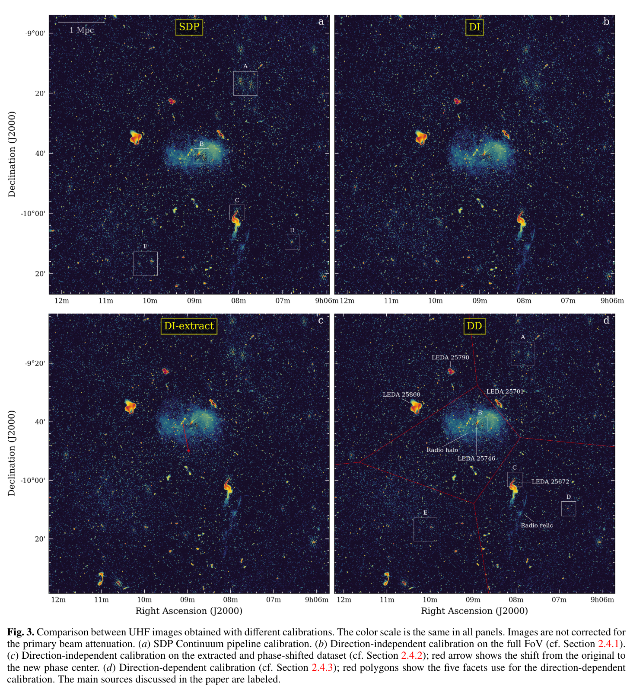

## 2024-06-03

1. [Designing an Evaluation Framework for Large Language Models in Astronomy Research](https://arxiv.org/abs/2405.20389)

   > Astronomy, Deep Learning

   [AstroArXivBot](https://github.com/jsalt2024-evaluating-llms-for-astronomy/astro-arxiv-bot)是一个Slack聊天机器人，通过检索arXiv的天文论文-增强生成（RAG）回答用户的查询，LLM使用``gpt-4o`，编码器使用`bge-small-en-v1.5 `。收集用户对LLM的反馈，实现未来对天文学LLM工具的动态评估。

   

2. [A Needle in a Cosmic Haystack: A Review of FRB Search Techniques](https://arxiv.org/abs/2405.20716)

   > Fast Radio Burst, Method, Search

   讲FRB的搜索方法，主要讲了各种RFI消除方法的优劣，新方法包括霍夫变换甚至量子搜索，也就下面这个图有用。

   

3. [The First Billion Years, According to JWST](https://arxiv.org/abs/2405.21054)

   > JWST, Review

   JWST以惊人的清晰度揭示了宇宙的第一个十亿年。这里介绍了JWST的1.5年科学任务中的发现和突破，尚未理解的主题和问题，以及未来几年将解决的问题。

   

## 2024-06-04

1. [Revisiting Energy Distribution and Formation Rate of CHIME Fast Radio Bursts](https://arxiv.org/abs/2406.00476)

   > Fast Radio Burst, Statistics

   统计CHIME/FRB爆发的能量函数和红移的关系。用`Lynden-Bell’s c-`方法分离energy function和formation rate的依赖，用`Kendell τ`统计能量和红移的关联性。

   发现FRB的energy function随红移演化$E(z)\propto(1+z)^{5.23}$，formation rate也随红移演化$\rho(z)\propto(1+z)^{-4.73}$（与恒星形成历史不符）。去除红移依赖，能量分布是指数为$-0.38$和$-2.01$的分段幂律函数，分界线$2.1\times10^{40}\,\rm erg$，形成率是$1.25\times10^4\,\rm Gpc^{-3}\, yr^{-1}$。认为大多数FRB可能来自老年恒星群体。

2. [Comprehensive analysis of the Apertif Fast Radio Burst sample: similarities with young, energetic neutron stars](https://arxiv.org/abs/2406.00482)

   > Fast Radio Burst, Observation, Statistics

   Apertif在2019年7月到2022年2月期间在1370MHz的FRB巡天，找到了18个新的FRB，其中5个确定了关联概率大于50%的宿主星系，并研究了这些爆发的属性。散射和RM表明很大一部分FRB在恒星形成区或超新星遗迹等复杂介质中。

   

   全天FRB事件率$459^{+208}_{-155}\,\rm sky^{-1}\,day^{-1}$，在流量阈值$4.1\,\rm Jy\,ms$上，累积流量分布是指数$-1.23\pm0.06\pm0.2$的幂律分布，与欧几里得宇宙的预测大致一致。

   文章里有很多图，包括爆发、定位、散射、能量分布等。

   

3. [The Origins of Narrow Spectra of Fast Radio Bursts](https://arxiv.org/abs/2406.01266)

   > Fast Radio Burst, Frequency, Theory

   猜测等离子体透镜或者闪烁是导致FRB窄谱的原因。

4. [Knowledge Graph in Astronomical Research with Large Language Models: Quantifying Driving Forces in Interdisciplinary Scientific Discovery](https://arxiv.org/abs/2406.01391)

   > Astronomy, Deep Learning

   [AstroKG](https://astrokg.github.io/)用大语言模型从过去20年里，大概30万篇的arXiv上的天文论文中，提炼出了接近2万5千个“知识概念” 。在此基础上，这些概念和涉及这些概念的论文之间的引用关系帮助我们构建出了一个庞大的三维知识图谱。图谱中不同颜色的点代表了天文研究中不同的大领域。

   

   虽然机器学习的发展突飞猛进，在天文学领域内也是炙手可热，但在知识图谱里，和机器学习、人工智能相关的概念大多数位于图谱的“边缘”，还没有和大部分的天文学概念发生紧密的联系。这从侧面说明，人工智能引领的科研新思路还没有充分地在天文学领域内被挖掘出来。所谓的“人工智能科研革命”，还没有到来。

   以数值模拟技术领域和相关科学应用的核心概念为例子，去溯源过去20年里这些概念发展的相关，我们可以看到科学概念的推动往往相对于技术有一定的“延迟”。而且，可能更重要的是，这个过程不是一蹴而就的，而是要经历若干不同的阶段，以某些新的突破、新的项目、新的理解为契机，带动新的科学概念的发展。从这个角度上看，这几年里的机器学习技术上的大幅进步，可能还需要几年时间的沉淀才能真的掀起天文学研究的新浪潮。

   

## 2024-06-05

1. [Kilonova Seekers: the GOTO project for real-time citizen science in time-domain astrophysics](https://arxiv.org/abs/2406.02334)

   > Supernovae, Instrument

   GOTO是多站点大视场光学望远镜阵，这里介绍用于这个望远镜的公众科学[Kilonova Seekers](https://kilonova-seekers.org/)，从大约2000名志愿者那里收到了超过60万个分类，产生了17,682个“黄金标准”训练集。

   

## 2024-06-06

1. [Spying on the quickly variable optical sky with the fast optical photometer SiFAP2](https://arxiv.org/abs/2406.03042)

   > Transient, Instrument

   目前发现了两个光学波段的毫秒脉冲星，PSR J1023+0038和SAX J1808.4-3658。SiFAP2是安装在INAF Telescopio Nazionale Galileo上的高速光学光度计，意在探索光学波段的暂现源。光学望远镜比高能波段更容易积累光子，可以灵敏地探测吸积中子星的弱脉冲信号，这是仍然未被检测到的连续引力波的最佳候选。

## 2024-06-07

1. [The formation rate and luminosity function of fast radio bursts](https://arxiv.org/abs/2406.03672)

   > Fast Radio Burst, Statistics

   跟三天前06-04的第一篇文章完全一样的内容，一样的方法，结论也类似。光度函数用断幂拟合，断点在$1.33\times10^{41}\,\rm erg\,s^{-1}$，形成率$\rho(z)\propto(1+z)^{-4.9\pm0.3}$，本地形成率$1.13\times10^{4}\,\rm Gpc^{-3}\,yr^{-1}$，单调下降与GRB类似，FRB起源与年老天体相关。

2. [Time delay of fast radio burst population with respect to the star formation history](https://arxiv.org/abs/2406.03809)

   >  Fast Radio Burst, Statistics

   用贝叶斯信息准则`Bayesian information criterion, BIC`，检验CHIME/FRB与恒星形成历史之间是高斯/对数正态/幂律延迟。结论是对数正态延迟更好，FRB追踪SFH模型被否定。能量函数与红移无关，幂律指数为1.8。

3. [An emission state switching radio transient with a 54 minute period](https://arxiv.org/abs/2407.12266)

   > Pulsar, Transient, Observation

   NA上发表的文章，没有贴到arXiv。发现的ASKAP J193505.1+214841.0是一个周期为53.8分钟的射电暂现源，没有探测到高能和光学对应，其发射有三个不同的阶段（PSR J1107-5907也有类似的三种发射状态）

   - 亮脉冲状态，高度线偏振，宽度10-50秒
   - 弱脉冲状态，高度圆偏振，宽度370ms，比亮脉冲暗26倍
   - 无脉冲状态

   另外也与银河系中心射电暂现源GCRT J1745-3009有相似之处，周期为77分钟，有2分钟和10分钟宽度的脉冲。

   

   对观测期间源半径的限制排除了孤立磁性白矮星起源的可能性。发射模式变化明显，让人联想到中子星。然而，它的无线电特性挑战了我们目前对中子星发射和演化的理解。

4. [The magnetic field of the Radcliffe Wave: starlight polarization at nearest approach to the Sun](https://arxiv.org/abs/2406.03765)

   > Stellar, Magnetic Field, Radcliffe Wave

   根据光学恒星偏振和新的红外数据测量Radcliffe Wave位置天空投影的磁场，发现距离更远的恒星的偏振角显示出平行于银河系盘面的平均方向。

   

## 2024-06-10

1. [The role of magnetar transient activity in time-domain and multimessenger astronomy](https://arxiv.org/abs/2406.04967)

   > Magnetar, Review

   综述磁星在时域和多信使天文学中的重要性。下图展示的是磁星可能产生的各种爆发现象。

   

## 2024-06-11

1. [Most nearby young star clusters formed in three massive complexes](https://arxiv.org/abs/2406.06510)

   > Stellar, Cluster

   还是发现Radcliffe Wave那帮人，从Gaia数据中找到太阳附近1kpc以内的272个星团，其中155个星团在30亿年前的位置表明，这些星团集中在三个大质量恒星形成复合体中形成。估计这些星团中产生了200多个超新星，这些超新星导致了local bubble和supershell GSH 238+00+09的形成，这两个结构在尘埃地图中清晰可见。

   

   可视化在[这里](https://sites.google.com/view/families-of-clusters/home)。

## 2024-06-12

1. [All-sky three-dimensional dust density and extinction Maps of the Milky Way out to 2.8 kpc](https://arxiv.org/abs/2406.06740)

   > ISM, Dust

   [Dustribution](https://github.com/Thavisha/Dustribution)用高斯过程，根据Gaia DR2、2MASS和AllWISE的恒星消光和距离，建立太阳附近2.8kpc以内的全天[三维尘埃密度和消光图](www.mwdust.com)，数据在[这里](https://zenodo.org/records/11448780)。在可视化的网站中，有一个非常丝滑的三维data cube的展示，应该是用`three.js`自己实现的，也可以用在FAST数据的data cube的展示。

   

## 2024-06-13

1. [ExoSpikeNet: A Light Curve Analysis Based Spiking Neural Network for Exoplanet Detection](https://arxiv.org/abs/2406.07927)

   > Exoplanet, Light Curve, Deep Learning

   用SNN对开普勒的光变曲线做分类。

## 2024-06-14

1. [E(2)-Equivariant Features in Machine Learning for Morphological Classification of Radio Galaxies](https://arxiv.org/abs/2406.09024)

   > Galaxy, Deep Learning, Classification

   由于CNN没有旋转和反射不变性，有工作试图用`G-steerable CNN`解决，这样的CNN等价于指定的`二维欧几里得变换, E(2)`子集，尽管提高了模型性能，但是计算成本增加。

   这里考虑使用直接提取`E(2)`等变特征对射电星系进行分类，包括`Minkowski functionals (MFs)`, `Haralick features (HFs)` 和`elliptical Fourier descriptors (EFDs)`。其中MFs信息量最大，EFDs信息量最小，准确性低于CNN，但是运算时间少50倍。

   

## 2024-06-17

1. [The Black Hole Explorer: Operating a Hybrid Observatory](https://arxiv.org/abs/2406.09610)

   > Astronomy, Black Hole, Instrument

   黑洞探测器`Black Hole Explorer`是一个天基概念，与地面VLBI协同观测，证实广义相对论预言的黑洞周围强引力透镜光子轨迹产生的`sharp photon ring`。

   

## 2024-06-18

1. [Magnetospheric origin of a fast radio burst constrained using scintillation](https://arxiv.org/abs/2406.11053)

   > Fast Radio Burst, Scintillation

   在`FRB 20221022A`的频谱中测量到两个闪烁尺度，分别来自银河系内和宿主星系的散射屏。据此约束FRB发射区域小于$3\times10^4\,\rm km$，猜测是致密天体磁层发射的。

   

2. [A search for the fine-structure constant evolution from fast radio bursts and type Ia supernovae data](https://arxiv.org/abs/2406.11691)

   > Fast Radio Burst, Cosmology

   用FRB加Ia型超新星约束精细结构常数可能的红移演化。
   $$
   DM=\int_0^z\frac{n_e(z')c}{(1+z)^2H(z')}\left(\frac{\Delta\alpha(z')}{\alpha_0}+1\right)dz'
   $$

## 2024-06-19

1. [Scintillation velocity and arc observations of FRB 20201124A](https://arxiv.org/abs/2406.12218)

   > Fast Radio Burst, Scintillation

   FAST对FRB20201124A的观测分析闪烁的周年变化，限制闪烁屏距离地球0.4kpc。

   

2. [Varying activity and the bursts properties of FRB 20240114A probed with GMRT down to 300 MHz](https://arxiv.org/abs/2406.12804)

   > Fast Radio Burst, Observation

   uGMRT对FRB20240114A的观测，在300-750MHz探测到57个爆发。给PRS在400MHz的上限$600\,\mu Jy$和650MHz的$89\,\rm \mu Jy$。

## 2024-06-20

1. [A two-minute burst of highly polarised radio emission originating from low Galactic latitude](https://arxiv.org/abs/2406.12352)

   > Radio, Transient, Observation

   ASKAP探测到一个持续2分钟的射电暂现源`J175534.9-252749.1`，且在60个小时内没有重复，偏振和形态与脉冲星类似，流量200mJy。

   

## 2024-06-21

1. [The Curious Case of Twin Fast Radio Bursts: Evidence for Neutron Star Origin?](https://arxiv.org/abs/2406.13704)

   > Fast Radio Burst, Observation

   ASKAP探测到的FRB20210912A，是一个非重复暴，其PA和RM的变化模式可以用一个自转周期为1.1ms的脉冲星解释。之前探测到的FRB20181112A与这个FRB非常相似，可能有相似的起源。

   

## 2024-06-24

1. [Pulscan: Binary pulsar detection using unmatched filters on NVIDIA GPUs](https://arxiv.org/abs/2406.15186)

   > Pulsar, Search, Software

   [Pulscan](https://github.com/jack-white1/pulscan)实现了一种高效的滤波方法，用于探测`accelerated`和`jerked`脉冲双星。

2. [Advancing Galaxy Analysis: AI-Powered Detection and Segmentation of Edge-On Galaxies](https://arxiv.org/abs/2406.15064)

   > Galaxy, Search, Deep Learning

   用YoLoV5[找edge-on的星系](https://github.com/MatFyzGalaxy/EdgeOnML)。

   

## 2024-06-25

1. [cp3-bench: A tool for benchmarking symbolic regression algorithms tested with cosmology](https://arxiv.org/abs/2406.15531)

   > Cosmology, Symbolic Regression

   [cp3-bench](https://github.com/CP3-Origins/cp3-bench)测试十种符号回归算法在宇宙学数据集上的效果，现有的方法在宇宙学数据集上表现糟糕，并且有过拟合的倾向。

   

2. [The FRB-searching pipeline of the Tianlai Cylinder Pathfinder Array](https://arxiv.org/abs/2406.15740)

   > Fast Radio Burst, Search, Instrument

   介绍天籁的波束合成和FRB搜索方案（用的Heimdall+FETCH），介绍发现的一个非重复暴FRB20220414A。

## 2024-06-26

1. [A review of unsupervised learning in astronomy](https://arxiv.org/abs/2406.17316)

   > Astronomy, Machine Learning, Review

   总结天文中用到的非监督机器学习方法。

   

## 2024-06-27

1. [Searching anomalies using nonlinear dimensionality reduction techniques](https://arxiv.org/abs/2406.18148)

   > Radio, Deep Learning, Anomaly Detection

   用训练好的ResNet提取射电观测数据的特征，然后用UMAP降维，找异常值。

   

2. [Searching for the Signature of Fast Radio Burst by Swift/XRT X-ray Afterglow Light Curve](https://arxiv.org/abs/2406.18104)

   > Fast Radio Burst, GRB, Statistics

   超大质量中子星诞生后不久（几百到几千秒），可能会发生塌缩，此时有可能产生FRB。塌缩事件发生时，GRB的X射线余辉光通量突然下降。

   这里统计Swift的GRB星表中发生这种X射线余辉光变曲线有上述特征的源，与FRB的发生时间进行比较，没有发现任何相关的FRB-GRB对。

## 2024-06-28

1. [The prototypical major cluster merger Abell 754. I. Calibration of MeerKAT data and radio/X-ray spectral mapping of the cluster](https://arxiv.org/abs/2406.18983)

   > Galaxy, Observation

   MeerKAT对Abell 754的观测。下图的colormap可能是[CMasher](https://github.com/1313e/CMasher)中的pride。

   

