## 2024-07-01

1. [A lensed FRB candidate in the first CHIME/FRB Catalogue and its potential implications](https://arxiv.org/abs/2406.19654)

   > Fast Radio Burst, Gravitational Lensing

   从CHIME目录中找透镜FRB，认为FRB20190308C是透镜信号的显著性有3.4sigma。

   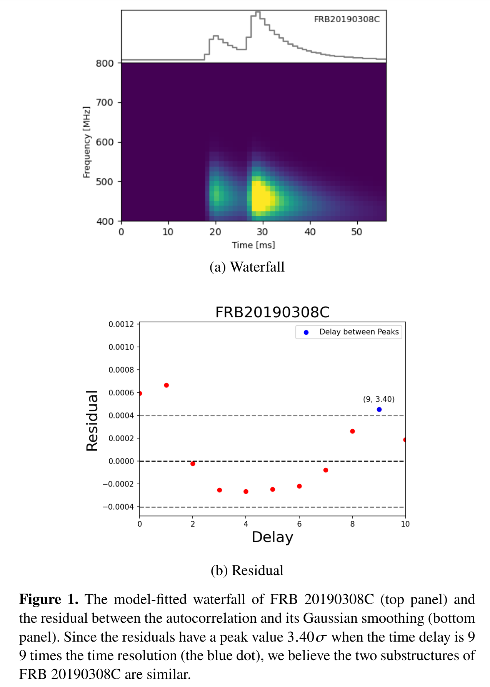

2. [The impact of shear on the rotation of Galactic plane molecular clouds](https://arxiv.org/abs/2406.19637)

   > ISM, Dynamics

   **研究背景**：恒星形成于分子云最密集的区域，但是目前还没有普遍认可的理论来解释是什么因素调控了这些云的动态，以及这些因素如何影响气体转变为恒星。

   **研究内容**：作者们分析了银河系的剪切对巨大分子云（GMCs）旋转的影响，并探讨了这种旋转与湍流中的旋涡模式（即溶涡模式）的关系。

   **数据来源**：他们利用了来自 CHIMPS 和 COHRS 的数据，这些数据提供了银河系内部许多分子云的详细观测结果。

   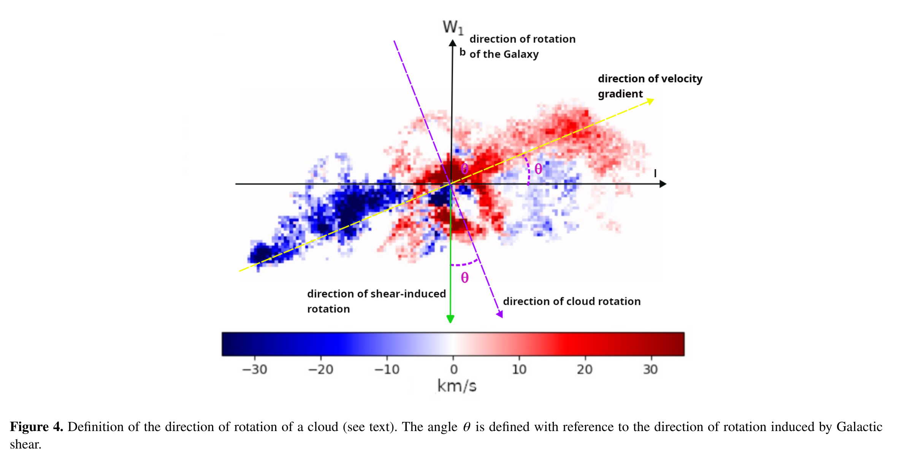

   **方法**：他们估算了大量分子云的旋转方向，并引入了一个参数来描述银河剪切对云内部密度扰动的破坏能力。

   **主要发现**：

   - **旋转方向与剪切无关**：研究发现分子云的旋转方向、剪切参数和速度梯度的大小之间没有明显的相关性。
   - **湍流模式与剪切有关**：但在 CHIMPS 样本中，湍流中的旋涡模式（溶涡部分）与剪切参数之间存在正相关关系，这种关系在以距银河中心距离作图时表现得非常明显。
   - **剪切对云的影响**：他们提出，巨大的分子云可能并不足够大或存在时间不够长，因此不会受到银河剪切的显著影响而表现出旋转方向的一致性。
   - **湍流促进恒星形成**：理论上，银河剪切可能会增加溶涡湍流，从而抑制恒星的形成。
   - **云的旋转起因**：研究还表明，分子云的旋转更多是由形成这些云的流动碰撞中的开尔文-亥姆霍兹不稳定性造成的，而不是直接受银河盘面整体旋转的影响。

## 2024-07-02

1. [Search for rotating radio transients in monitoring data for three years](https://arxiv.org/abs/2407.01285)

   > Transient, Survey

   `Large Phased Array`对$-9^\circ<dec<42^\circ$的天区进行巡天观测，发现了19个新的RRAT，其中根据YMW16估计距离太阳最近的是134pc。

## 2024-07-03

1. [ALMA reveals spatially-resolved properties of molecular gas in the host galaxy of FRB 20191001A at z = 0.2340](https://arxiv.org/abs/2407.01889)

   > Fast Radio Burst, Galaxy, Observation

   ALAM观测到FRB20191001A在红移0.234处的宿主星系的`CO2-1`的发射，推测恒星形成率$8.06\pm2.42M_\odot/yr$，远比别的FRB的宿主星系高，证实FRB来自不同环境。

   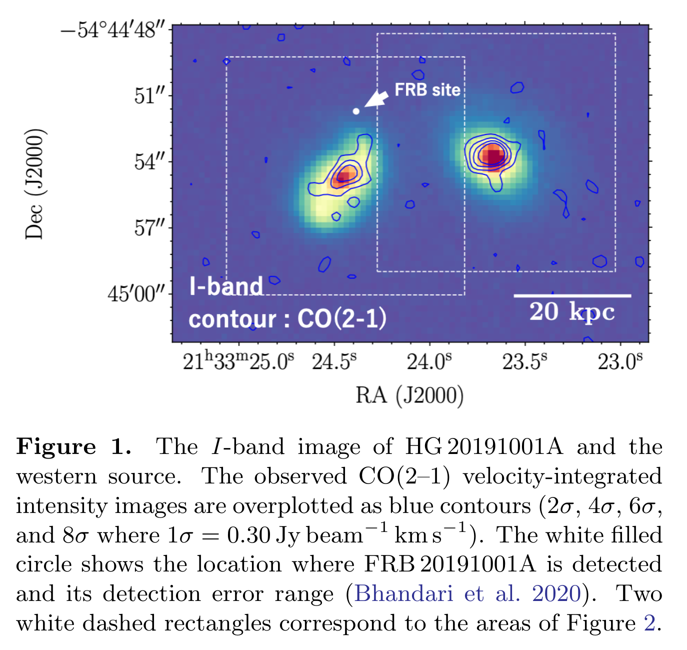

2. [A study of two FRBs with low polarization fractions localized with the MeerTRAP transient buffer system](https://arxiv.org/abs/2407.02173)

   > Fast Radio Burst, Observation, Localization

   MeerTRAP探测并定位到两个FRB 20220717A和20220905A，定位精度达到1角秒。确定了20220717A的宿主星系，并且宿主星系贡献了15%的DM。另一个宿主星系暗淡，且位于密集星场，很难探测。

   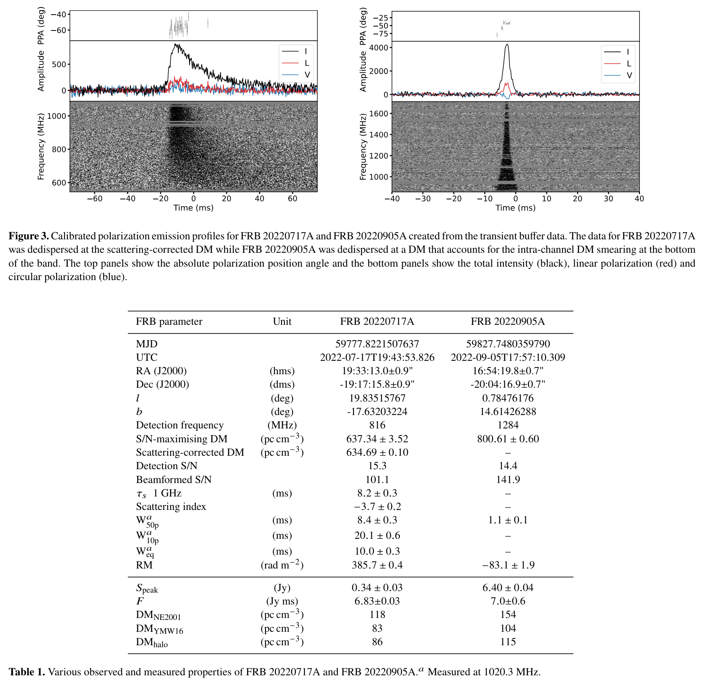

   

## 2024-07-04

1. [Scientific Text Analysis with Robots applied to observatory proposals](https://arxiv.org/abs/2407.02992)

   > Astronomy, LLM

   研究LLM对观测申请的影响。发现经过ChatGPT修改的观测申请往往会得到比原版更低的评分。ChatGPT在提炼摘要做的还不错，但是不能找出观测申请的弱点，并且在给观测申请评分时，ChatGPT会给出比人类评价更高的分数，并且倾向于自己写的观测申请。

## 2024-07-05

今日停更

## 2024-07-08

1. [Fast Radio Bursts and Artificial Neural Networks: a cosmological-model-independent estimation of the Hubble Constant](https://arxiv.org/abs/2407.03532)

   > Fast Radio Burst, Cosmology

   用单层神经网络对定位的FRB的红移和色散做回归。

2. [Simulating FRB Morphologies and Coherent Phase Correlation Signatures from Multi-Plane Astrophysical Lensing](https://arxiv.org/abs/2407.04097)

   > Fast Radio Burst, Lensing, Software

   [RWLensPy](https://github.com/zkader/RWLensPy)用于模拟经过透镜后的FRB的时间频率形态。

   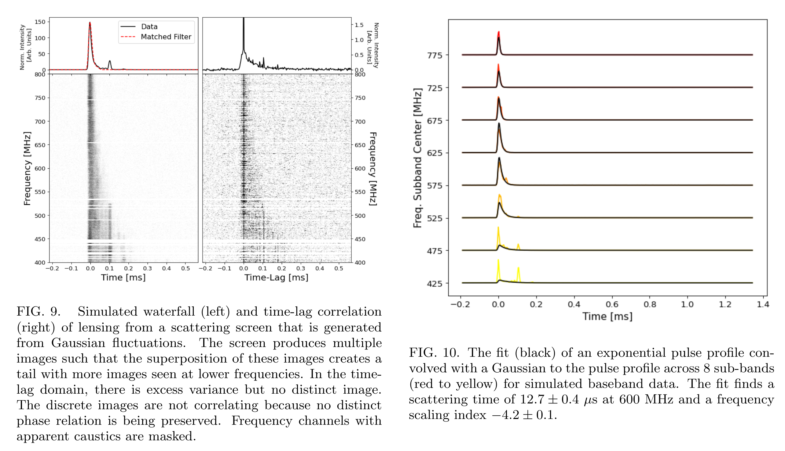

3. [cosmosage: A Natural-Language Assistant for Cosmologists](https://arxiv.org/abs/2407.04420)

   > Cosmology, LLM

   [cosmosage](https://github.com/tijmen/cosmosage)是使用宇宙学课本和arxiv文章微调后的[Mistral-7B-v0.1](https://huggingface.co/mistralai/Mistral-7B-v0.1)。

## 2024-07-09

1. [An activity transition in FRB 20201124A: methodological rigor, detection of frequency-dependent cessation, and a geometric magnetar model](https://arxiv.org/abs/2407.05366)

   > Fast Radio Burst, Observation

   用Apertif/WSRT和GMRT对FRB20201124A在2019年9月的观测，当FAST探测不到脉冲时，GMRT在400MHz探测到几次爆发。推测它是一个超长周期的磁星，周期长达数月，占空比非常宽，极不规则。

2. [TransformerPayne: enhancing spectral emulation accuracy and data efficiency by capturing long-range correlations](https://arxiv.org/abs/2407.05751)

   > Stellar, Spectrum, Deep Learning

   用Transformer将波长和光谱参数做输入，输出光谱。

## 2024-07-10

1. [Impact of lensing bias on the cosmological dispersion measure](https://arxiv.org/abs/2407.06621)

   > Fast Radio Burst, Cosmology

   由于宇宙中物质分布不均匀，FRB的光线往往会避开高密度区域，从而导致色散-红移的选择偏差。

## 2024-07-11

1. [The discovery of a nearby 421~s transient with CHIME/FRB/Pulsar](https://arxiv.org/abs/2407.07480)

   > Radio, Transient

   CHIME探测到的一个421s周期的暂现源。

   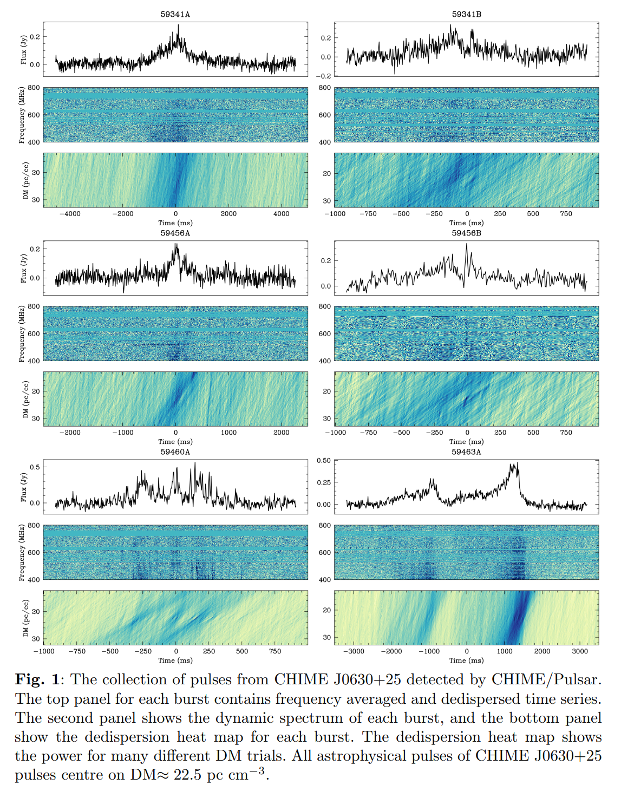

## 2024-07-12

1. [Deep learning solutions to telescope pointing and guiding](https://arxiv.org/abs/2407.08046)

   > Astronomy, Deep Learning

   为了改进望远镜指向精度，使用RNN来改进指向模型。

## 2024-07-15

1. [FlyEye Ground-Based Telescope: Unveiling New Frontiers in Astronomical Science](https://arxiv.org/abs/2407.09140)

   > Astronomy, Instrument

   `FlyEye`是欧空局开发的1m望远镜，有44平方度的视场，可以每晚对三分之二的可见天空进行三次观测。

2. [Exploring Galactic open clusters with Gaia I. An examination in the first kiloparsec](https://arxiv.org/abs/2407.09407)

   > Stellar, Cluster, Catalog

   从Gaia DR3的星表中，使用HDBSCAN找到1kpc以内的370个疏散星团，用Mahalanobis剔除异常值，并估算了这些星团的年龄、金属丰度、距离和消光。

   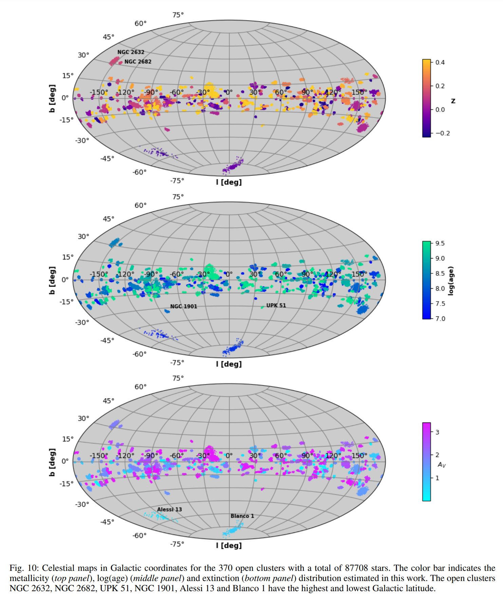

   与之前使用 Gaia DR2 星表的工作相比，我们在这些星团中发现的恒星数量增加了约 40%，其中包括 G > 17 的暗星新成员。

## 2024-07-16

1. [A Nançay Radio Telescope study of the hyperactive repeating FRB 20220912A](https://arxiv.org/abs/2407.10155)

   > Fast Radio Burst, Observation

   NRT对FRB20220912A在22年10月到23年4月的观测，61个小时探测到696次爆发，峰值事件率75个每小时。

2. [Sudden polarization angle jumps of the repeating fast radio burst FRB 20201124A](https://arxiv.org/abs/2407.10540)

   > Fast Radio Burst, Polarization

   佳瑞的文章，看到FRB20201124A的爆发中特殊的偏振表现。

3. [A Proposal for a Fast Infrared Bursts Detector](https://arxiv.org/abs/2407.10712)

   > Astronomy, Instrument

   提出探测红外波段的快速爆发。

## 2024-07-17

1. [AstroMLab 1: Who Wins Astronomy Jeopardy!?](https://arxiv.org/abs/2407.11194)

   > Astronomy, LLM

   用《Annual Review of Astronomy and Astrophysics》上的4425道选择题测评大模型在天文领域的表现，总的来说，Claude-3.5-Sonnet性能最好。

   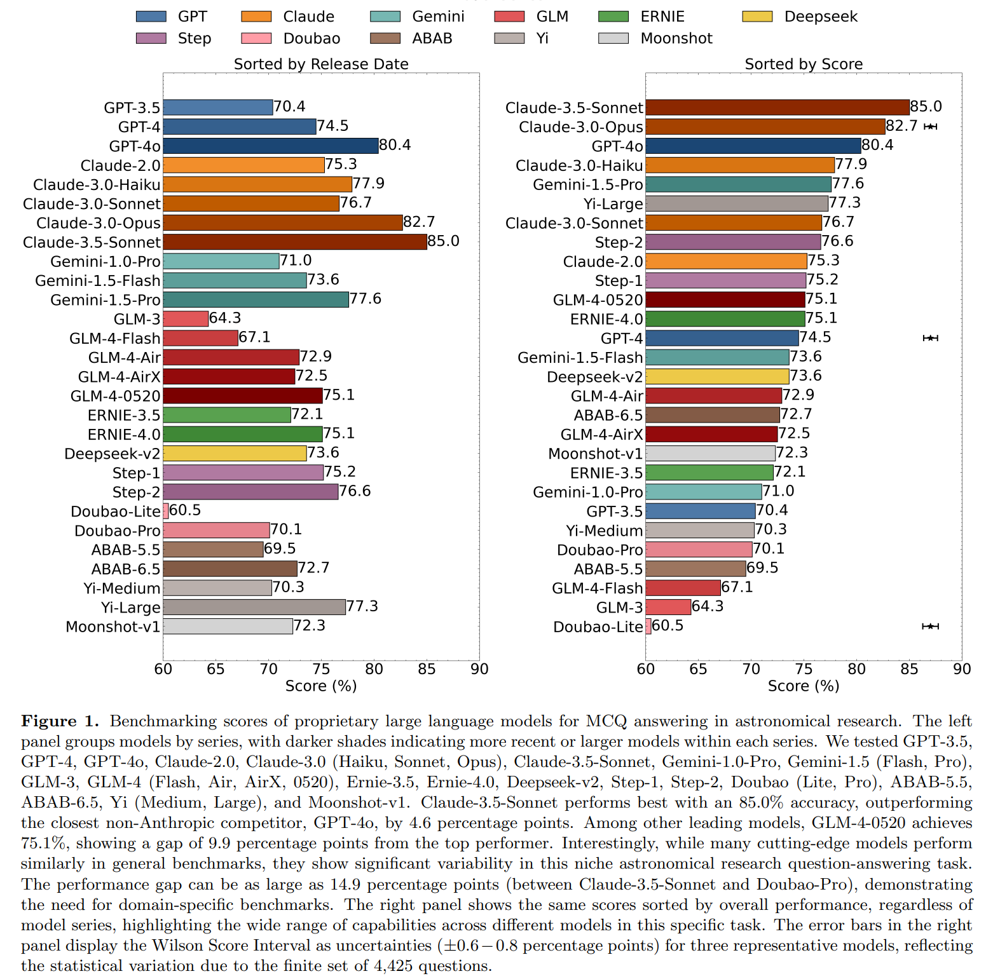

## 2024-07-18

1. [Maximum-likelihood regression with systematic errors for astronomy and the physical sciences: I. Methodology and goodness-of-fit statistic of Poisson data](https://arxiv.org/abs/2407.12132)

   > Astronomy, Statistics

   在整数计数的数据中使用泊松分布作为误差分布进行最大似然回归。

## 2024-07-19

1. [A New Probe of μHz Gravitational Waves with FRB Timing](https://arxiv.org/abs/2407.12920)

   > Fast Radio Burst, Gravitational Wave

   用两个望远镜测量同一个FRB的计时测引力波。

   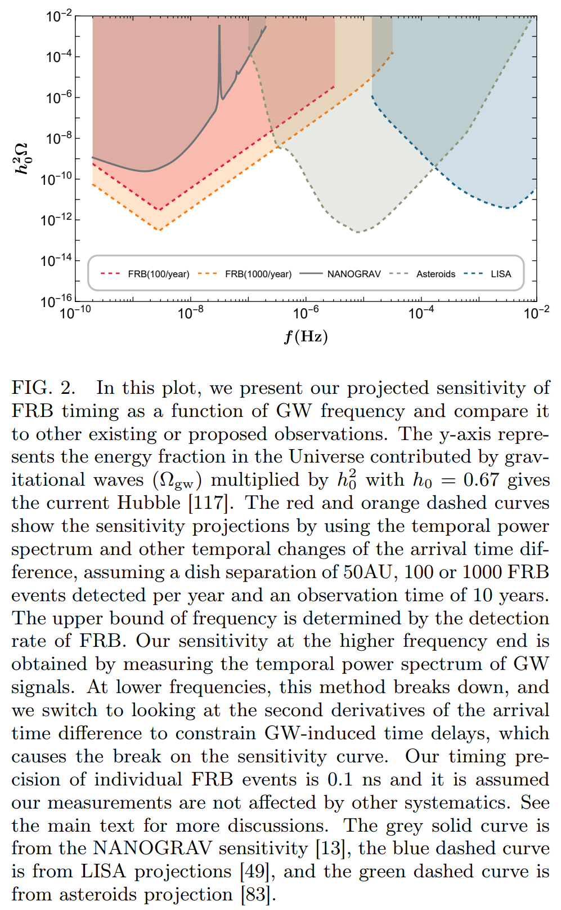

## 2024-07-22

1. [The FAST HI 21-cm absorption blind survey. II -- statistic exploration for associated and intervening systems](https://arxiv.org/abs/2407.14411)

   > HI, Survey

   找CRAFTS和FASHI中的HI吸收线，找到了14个以前发现的和20个新的。

2. [Deep learning-driven likelihood-free parameter inference for 21-cm forest observations](https://arxiv.org/abs/2407.14298)

   > Cosmology, Deep Learning

   用[LAMPE](https://github.com/probabilists/lampe)实现`generative normalizing flows`实现`21-cm forest`约束暗物质参数。竟然是投到Nature。

## 2024-07-23

1. [Fast radio bursts as precursor radio emission from monster shocks](https://arxiv.org/abs/2407.15076)

   > Fast Radio Burst, Theory, Simulation

   模拟强磁化中子星内部磁层的MHD波断裂可以产生GHz的FRB，其能量占冲击耗散总能量的$\sim10^{-3}$。

2. [Unveiling the Milky Way dust extinction curve in 3D](https://arxiv.org/abs/2407.14594)

   > ISM, Dust, Extinction

   用Gaia数据测量1.3亿颗恒星的消光曲线，发现在银河系中等密度区域，吸积是尘埃颗粒生长的主要机制，在密度较高的区域，凝结主导。在恒星形成区，消光曲线变平，可能是分子云中形成大颗粒循环，或者超新星冲击摧毁小颗粒。看起来是在Science审稿。

   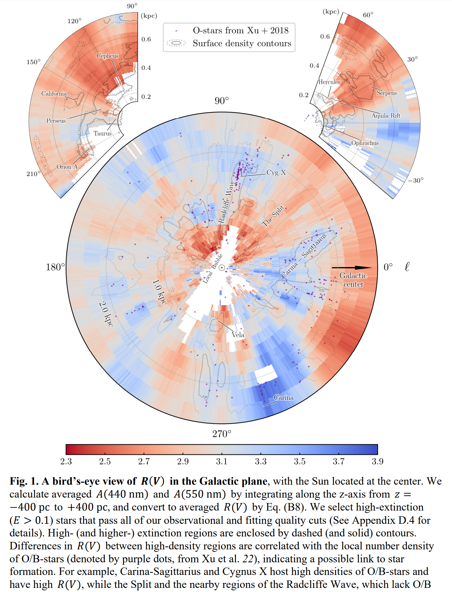

## 2024-07-24

1. [A Statistical Analysis of Crab Pulsar Giant Pulse Rates](https://arxiv.org/abs/2407.15996)

   > Pulsar, Statistics, Giant Pulse

   用GBO的20米镜子观测Crab的巨脉冲，在88小时的观测时间里探测到24985个巨脉冲，对这些巨脉冲的统计。

## 2024-07-25

1. [The dispersion measure and rotation measure from fast radio burst host galaxies based on the IllustrisTNG50 simulation](https://arxiv.org/abs/2407.16748)

   > Fast Radio Burst, Cosmology, DM, Simulation

   用IllustrisTNG50模拟星系对FRB的DM和RM的贡献，发现DM是正态分布，RM在0左右对称，可以用一个洛伦兹函数和两个高斯函数的组合拟合。

   预计要约束$\sigma_{\rm RM,IGM}\sim2\rm\, rad/m^2$需要红移95000个红移在0.5的FRB，或者9500个红移在2的FRB。

## 2024-07-26

1. [Identifying pulsar candidates in interferometric radio images using scintillation](https://arxiv.org/abs/2407.17764)

   > Pulsar, Scintillation, Search, Method

   从闪烁谱中搜索脉冲星，可以找到那些难以探测的脉冲星，比如亚毫秒脉冲星和高度加速的双星中的脉冲星。

2. [Cross-Observatory Coordination with tilepy: A Novel Tool for Observations of Multi-Messenger Transient Events](https://arxiv.org/abs/2407.18076)

   > Astronomy, Transient, Software

   [tilepy](https://github.com/astro-transients/tilepy)用于自动安排对定位较差的瞬变事件的跟踪观测，可以接入[Astro-COLIBRI](https://astro-colibri.science/)。

   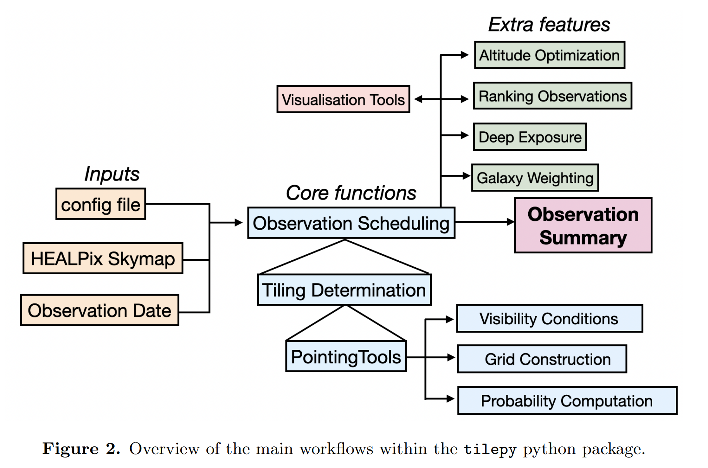

## 2024-07-29

1. [Long-term radio monitoring of the fast X-ray transient EP240315a: evidence for a relativistic jet](https://arxiv.org/abs/2407.18311)

   > High Energy, Radio, X-ray, GRB

   对爱因斯坦探针（EP）探测到的`fast X-ray transients`的射电干涉阵ATCA的跟踪观测，在5.5GHz和9GHz进行了观测，其射电总能量表明其是典型的GRB，说明相当一部分FXRT可能与标准的GRB有关。

## 2024-07-30

1. [A Phase-resolved View of "Heartbeat"-like variability in IGR J17091-3624 During the 2022 Outburst](https://arxiv.org/abs/2407.19388)

   > High Energy, Black Hole

   除了`GRS 1915+105`之外，`IGR J17091-3624`是唯一显示出心跳形的光变曲线的X射线双黑洞，这里使用NICER和NuSTAR的数据进行分析，显示了磁盘温度和通量与计数率的显著同步变化。这些发现意味着耀斑主要是由吸积盘内部的不稳定性驱动的，这与之前对 GRS 1915+105 中著名的 rho 级变异的研究是一致的。

   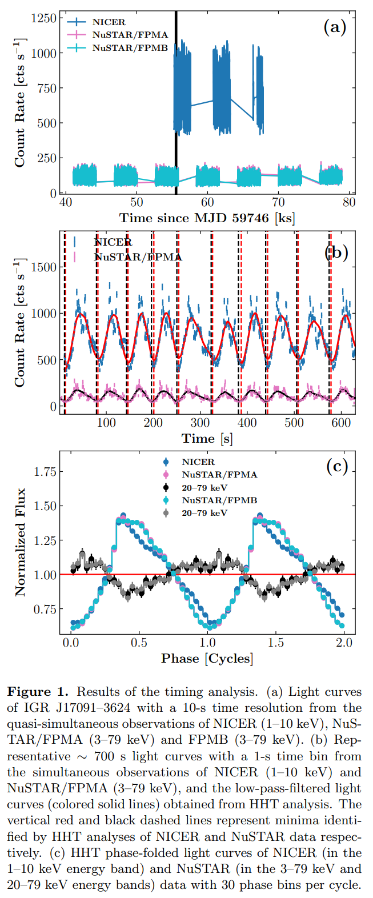

## 2024-07-31

1. [A radio loud semiregular variable](https://arxiv.org/abs/2407.20602)

   > Stellar, Variable, Radio

   在找银河系中有伽马射线辐射的恒星时，发现了一颗冷演化恒星`IRC-10412`，在厘米-毫米波段有射电辐射，并且光变曲线表现出两个周期。

   认为其异常高的射电辐射来自于附近OB星团的恒星风。

   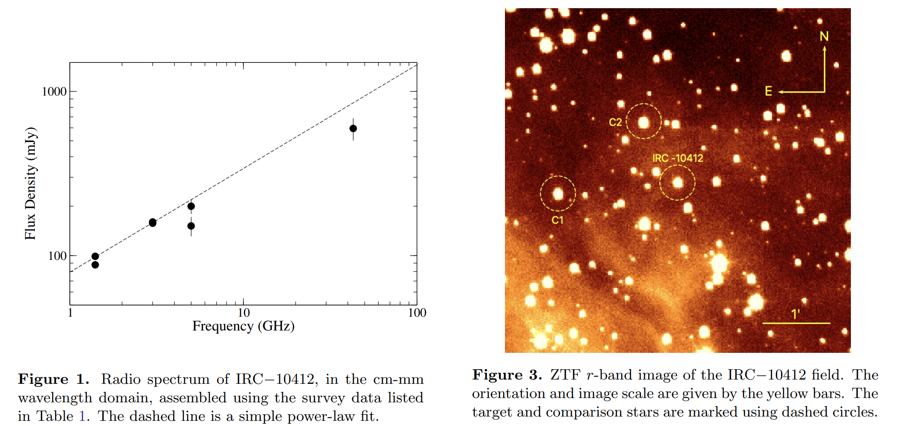

