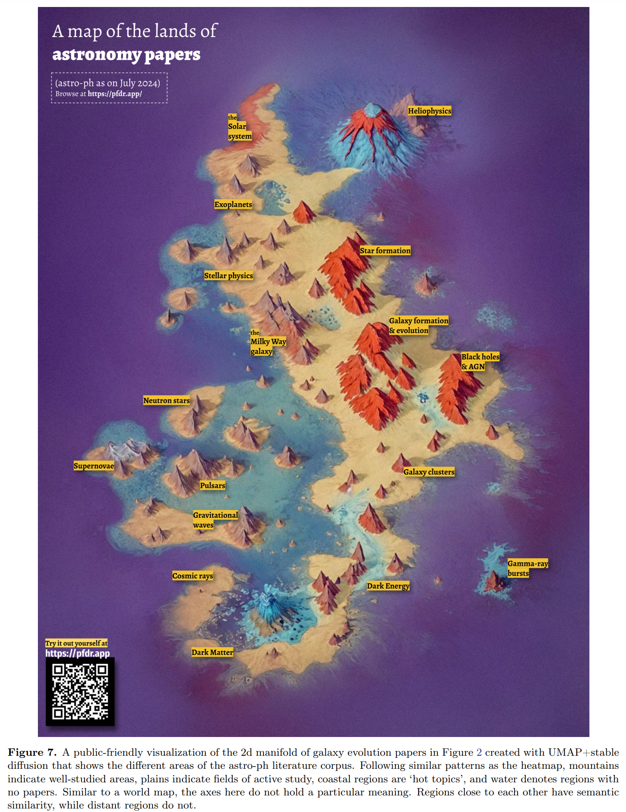

## 2024-08-01

1. [Radio observations of the 2022 outburst of the transitional Z-Atoll source XTE J1701-462](https://arxiv.org/abs/2407.21509)

   > High Energy, Radio

   `XTE J1701-462`是2006年发现的一颗中子星X射线双星，在2022年进入新的爆发期，用MeerKAT进行观测，发现在23年3月25日达到射电峰值。

   射电光变曲线显示，在最初的一百天里，至少发生了三次类似耀斑的事件。将该源置于射电-X射线平面内，证明在射电中探测到它时，它与其它`Z-source`位于参数空间的相似区域。

   

2. [FCN4Flare: Fully Convolution Neural Networks for Flare Detection](https://arxiv.org/abs/2407.21240)

   > Solar, Flare, Deep Learning

   用全卷积神经网络做光变曲线分割，识别开普勒和LAMOST数据中的耀斑，编制了一份包含 1426 颗恒星的 30285 个高置信耀斑的星表。

   

## 2024-08-02

1. [Apocalypse When? No Certainty of a Milky Way -- Andromeda Collision](https://arxiv.org/abs/2408.00064)

   > Galaxy, Milky Way, Simulation, Dynamics

   根据Gaia和Hubble测量的银河系和仙女座星系的质量，推导未来可能发生的情况。发现M33的加入增加了合并的可能，LMC的轨道与MW-M31的轨道垂直，使合并可能性降低。

   在整个系统中，发现所有星系目前的位置、运动和质量都存在不确定性，因此会出现截然不同的结果，在未来的 100 亿年中，银河系-仙女座星系合并的可能性接近 50%。

   

## 2024-08-05

1. [Searching for Pulsars, Magnetars, and Fast Radio Bursts in the Sculptor Galaxy using MeerKAT](https://arxiv.org/abs/2408.01217)

   > Transient, Survey, Fast Radio Burst

   NGC 253也叫Sculptor Galaxy，是除银河系之外第一个与两个巨大磁星耀斑相关联的星系，因此可能是脉冲星或者FRB的宿主星系。

   用MeerKAT对这个星系进行了4小时的观测，没有发现任何脉冲星和单脉冲，流量限制分别是4.4uJy和62mJy。

## 2024-08-06

1. [pathfinder: A Semantic Framework for Literature Review and Knowledge Discovery in Astronomy](https://arxiv.org/abs/2408.01556)

   > Astronomy, LLM

   [pathfinder](https://pfdr.app)使用LLM对ADS上的350,000篇文章进行检索，使用RAG通过语义上下文搜索天文文献，弥补使用关键词搜索文献的不足，还可以做文献综述。

   

   

2. [The Quark-Nova model for FRBs: model comparison with observational data](https://arxiv.org/abs/2408.01834)

   > Fast Radio Burst, Theory

   认为FRB来自Quark-Nova穿越电离介质时发出的coherent synchrotron emission，并预言可能产生持续长达分钟的FRB，以及在远离宿主星系的时候就可以产生FRB，因此看起来像是没有宿主星系的FRB。

3. [Selection bias obfuscates the discovery of fast radio bursts sources](https://arxiv.org/abs/2408.01876)

   > Fast Radio Burst, Statistics

   统计FRB的宿主星系，发现在倾角较大的星系（edge-on）中探测 FRB 存在很大的选择偏差，导致低估了FRB的事件率（大约低估2倍），宿主星系中的散射是造成这个偏差的原因。

   这也能发Nature？

   

4. [The Commensal Real-time ASKAP Fast Transient incoherent-sum survey](https://arxiv.org/abs/2408.02083)

   > Fast Radio Burst, Observation, Survey

   介绍ASKAP的CRAFT巡天，使用相控阵搜索FRB。介绍ASKAP迄今为止找到的43个FRB爆发，其中22个以前未曾报道过（16个定位到1arcsec，其中11个确定了宿主星系，6个定位到10arcmin）。迄今为止，所有 30 个测量到的宿主红移的中位数是 z = 0.23。

5. [Quantifying the randomness and scale invariance of the repeating fast radio bursts](https://arxiv.org/abs/2408.02203)

   > Fast Radio Burst, Statistics

   使用Hurst指数、q-Gaussian、Pincus Index说明FRB不是完全随机的。（但是前两个用高斯分布也能复现，Hurst指数那个甚至算的不对，PincusIndex都是大于0.8的数。

## 2024-08-07

1. [FAST detection of OH emission in the carbon-rich planetary nebula NGC 7027](https://arxiv.org/abs/2408.02962)

   > ISM, OH

   用FAST的超宽带接收机探测到行星状星云NGC 7027的OH发射线（1612MHz）。

2. [Ninety percent circular polarization detected in a repeating fast radio burst](https://arxiv.org/abs/2408.03313)

   > Fast Radio Burst, Polarization

   姜金辰的文章，在FRB20201124A的观测中探测到90%的圆偏振，且圆偏振度和爆发流量之间没有相关性，认为磁层辐射和传播效应之间的相互作用形成了观测到的FRB辐射。

3. [Redshift dependence of FRB host dispersion measures across cosmic epochs](https://arxiv.org/abs/2408.03163)

   > Fast Radio Burst, Population, Statistics, Galaxy

   假设宿主星系贡献的DM随红移是幂律$\propto(1+z)^\alpha$，对已知红移的FRB进行拟合发现，$\alpha\approx0$。

## 2024-08-08

1. [Siril: An Advanced Tool for Astronomical Image Processing](https://arxiv.org/abs/2408.03346)

   > Astronomy, Software

   [Siril](https://siril.org/)是一款功能强大的开源软件包，用于处理天文图像，提供了图像堆叠、校准和增强等工具。

2. [Yet another introduction to relativistic astrophysics](https://arxiv.org/abs/1703.05575)

   > Astronomy, Review, Relativity

   相对论天体物理课程讲义。

## 2024-08-09

1. [The propagation-induced circular polarization of fast radio bursts in relativistic plasma](https://arxiv.org/abs/2408.04401)

   > Fast Radio Burst, Theory, Polarization

   认为FRB的圆偏振来自相对论性等离子体引起的磁层传播效应，高圆偏振度发生的条件非常罕见。

## 2024-08-12

1. [Modelling DSA, FAST and CRAFT surveys in a z-DM analysis and constraining a minimum FRB energy](https://arxiv.org/abs/2408.04878)

   > Fast Radio Burst, Survey

   结合ASKAP、DSA和FAST的数据，估计FRB population的光度函数。预测FAST将在$z\ge2$处检测到25-41%的FAST能探测到的FRB，DSA将在$z\ge1$处检测到2-12%的DSA能探测到的FRB。

   

## 2024-08-13

1. [Prospects of FRBs and Large Scale 21 cm Power Spectra in Constraining the Epoch of Reionization](https://arxiv.org/abs/2408.05722)

   > Fast Radio Burst, Cosmology

   用1000个FRB可以在68%的置信度下限制再电离的时间线。用到[Cobaya](https://cobaya.readthedocs.io/en/latest/)做MCMC。

2. [The impact of the FREDDA dedispersion algorithm on H0 estimations with FRBs](https://arxiv.org/abs/2408.05937)

   > Fast Radio Burst, Cosmology

   ASKAP使用FREDDA来消色散，这里估计这一算法对哈勃常数估计的影响，估计会带来0.3km/s/Mpc的系统误差。

## 2024-08-14

1. [Interference detection in radio astronomy applying Shapiro-Wilks normality test, spectral entropy, and spectral relative entropy](https://arxiv.org/abs/2408.06488)

   > Radio, RFI, Method

   用`Shapiro-Wilks` 、`Spectral entropy`、`spectral relative entropy`标记RFI。随时间和频率变化的RFI使用`Shapiro-Wilks`最好用。

## 2024-08-15

1. [Ultraviolet Technology To Prepare For The Habitable Worlds Observatory](https://arxiv.org/abs/2408.07242)

   > Astrobiology, Instrument

   介绍一系列有前途的紫外线技术的现状，为宜居世界天文台做准备。

## 2024-08-16

1. [Citizen ASAS-SN Data Release II: Variable Star Classification Using Citizen Science](https://arxiv.org/abs/2408.07859)

   > Stellar, Variable, Catalog

   `Citizen ASAS-SN`是托管在Zooniverse上的超新星自动调查的公民科学项目，这里介绍从94975个新的候选星开始，并确定了4432个新的变星，提供了标记为有趣或不寻常的变量的样本。

## 2024-08-19

1. [Arecibo Wow! I: An Astrophysical Explanation for the Wow! Signal](https://arxiv.org/abs/2408.08513)

   > Astrobiology, Radio

   Arecibo在1977年探测到了Wow!信号。

   

   这里介绍2020年2-5月再1420MHz附近漂移扫描的结果，探测到在氢线附近的窄带信号，推测Wow!信号是由于磁星耀斑或者软伽马重复暴SGR刺激氢线发射引起的突然变亮（氢线maser），取决于特殊的条件和排列方式，这些云可能在几秒到几分钟内突然变亮，非常罕见。

   

## 2024-08-20

1. [The Fast Radio Burst Population Energy Distribution](https://arxiv.org/abs/2408.09351)

   > Fast Radio Burst, Statistics

   使用ASKAP探测到的63个FRB爆发统计其V/Vmax的能量分布，发现FRB种群的微分能量分布在$10^{23-16}\,\rm J/Hz$之间符合指数为-1.96的幂律或者指数为-1.82的Schechter函数。

2. [A Classifier-Based Approach to Multi-Class Anomaly Detection Applied to Astronomical Time-Series](https://arxiv.org/abs/2408.08888)

   > Variable, Light Curve, Deep Learning, Anomaly Detection

   在ZTF的模拟光变曲线数据库中，使用常见的光变曲线训练一个RNN用来分类。将分类器用在所有光变曲线上，把最后的全连接层参数拿出来用umap做聚类，用Isolation Forests找异常值。

## 2024-08-21

1. [Detection and localisation of the highly active FRB 20240114A with MeerKAT](https://arxiv.org/abs/2408.10988)

   > Fast Radio Burst, Observation

   MeerKAT对FRB20240114A的观测和定位，探测到62个爆发，fluence阈值是$1\,\rm Jy\cdot ms$，能量分布的幂律指数是-1.8。定位在RA=21h27m39.86s，Dec=+04d19m45.01s，不确定度为1.4角秒，预测PRS的流量$0.6-60\,\rm \mu Jy$。

## 2024-08-22

1. [A white dwarf binary showing sporadic radio pulses at the orbital period](https://arxiv.org/abs/2408.11536)

   > White Dwarf, Pulsar, Transient

   LOFAR找到`ILT J1101+5521`，是M矮星-白矮星双星系统，轨道周期125.5分钟，当两颗恒星结合在一起时，产生1分钟的射电脉冲，猜测可能是磁相互作用使白矮星的旋转周期和轨道周期同步的极性系统。

   

2. [Positive and unlabelled machine learning reveals new fast radio burst repeater candidates](https://arxiv.org/abs/2408.11436)

   > Fast Radio Burst, Statistics, Machine Learning

   由于FRB只有重复暴是确定重复的，非重复暴不确定是否是重复的，所以在使用机器学习进行分类的时候，之前的工作都没有完全考虑到数据的positive and unlabelled (PU) 性质。

   这里用PU学习的方法，对CHIME的FRB进行分类，新找到18个重复FRB候选。

## 2024-08-23

1. [Contemporaneous X-ray Observations of 30 Bright Radio Bursts from the Prolific Fast Radio Burst Source FRB 20220912A](https://arxiv.org/abs/2408.11895)

   > Fast Radio Burst, High Energy, Observation

   对FRB20220912A在CHIME探测到爆发时的X射线观测，在30个爆发发生时没有探测到明显的X射线辐射。

   

2. [FRB 20121102A monitoring: updated periodicity at L-band](https://arxiv.org/abs/2408.12567)

   > Fast Radio Burst, Statistics, Periodicity

   报告Effelsberg对FRB121102的持续观测对周期的影响，发现爆发的活跃性在活跃窗口中呈高斯形。L波段和S波段的周期相同，但是S波段比L波段更早结束活跃。

3. [Application of Convolutional Neural Networks to time domain astrophysics. 2D image analysis of OGLE light curves](https://arxiv.org/abs/2408.11960)

   > Light Curve, Deep Learning, Classification

   用2D直方图将折叠后的光变曲线转换成2D图像用CNN进行分类，比仅用CNN提高了分类的准确率。

## 2024-08-26

1. [Checking the Empirical Relations with the Current Localized Fast Radio Bursts](https://arxiv.org/abs/2408.12983)

   > Fast Radio Burst, Statistics

   统计FRB各个参数之间的相关关系。

2. [Morphology of 137 Fast Radio Bursts down to Microseconds Timescales from The First CHIME/FRB Baseband Catalog](https://arxiv.org/abs/2408.13215)

   > Fast Radio Burst, Morphology, Observation

   使用[fitburst](https://github.com/CHIMEFRB/fitburst)拟合CHIME的137个有基带数据的爆发，发现其中1/3的样本在高时间分辨率下表现出额外的爆发成分，最窄的成分有$23\mu s$。统计认为重复/非重复FRB可能是不同的类别，但是性质重叠。

   

3. [The FAST Core Array](https://arxiv.org/abs/2408.12826)

   > Radio, Instrument

   计划在FAST周边5公里的范围内，放24个40米的镜子，组成阵列，以得到4.3角秒的空间分辨率。

## 2024-08-27

1. [Eighteen new fast radio bursts in the High Time Resolution Universe survey](https://arxiv.org/abs/2408.14384)

   > Fast Radio Burst, Observation

   在parkes的超宽带低频接收机的数据上做测试，认为对sub-band做搜索可以找到更多的FRB爆发。重新搜索`High Time Resolution Universe South survey`，找到18个新的爆发，使这个巡天发现的FRB的数量增加3倍。

## 2024-08-28

1. [Key Science Goals for the Next Generation Very Large Array (ngVLA): Update from the ngVLA Science Advisory Council (2024)](https://arxiv.org/abs/2408.14497)

   > Radio, Instrument, Review

   `ngVLA`的科学目标，包括

   - 揭开太阳系类似物形成的面纱
   - 利用天体化学探测行星系统和生命的初始条件
   - 绘制从最初的十亿年到现在的星系组装、结构和演化图
   - 极端科学： 作为基础物理学实验室的脉冲星
   - 在多信使天文学时代了解恒星和超大质量黑洞的形成和演化

## 2024-08-29

1. [A 2.9-hour periodic radio transient with an optical counterpart](https://arxiv.org/abs/2408.15757)

   > Transient, Observation, Optical

   `GLEAM-X J0704-37`是MWA发现的一个新的射电暂现源，周期2.9小时，并发现了光学对应体，是一个M3的冷主序星。来自 MeerKAT 的高时间分辨率观测结果表明，来自该源的脉冲显示出复杂的微观结构和高线性极化，这表明脉冲星般的发射机制是由强有序磁场引起的。该系统和 M-矮星的银河纬度较高，排除了磁星的解释，表明该系统更有可能是 M-矮星/白矮星双星。

   

## 2024-08-30

1. [IAU CPS Tools to Address Satellite Constellation Interference](https://arxiv.org/abs/2408.16026)

   > Astronomy, Software

   [SatChecker](https://github.com/iausathub/satchecker)是用于预测卫星星座坐标的工具。

2. [Six Maxims of Statistical Acumen for Astronomical Data Analysis](https://arxiv.org/abs/2408.16179)

   > Astronomy, Statistics, Review

   关于天文统计的六条格言

   - All data have stories, but some are mistold.
   - All assumptions are meant to be helpful, but some can be harmful.
   - All prior distributions are informative, even those that are uniform.
   - All models are subject to interpretation, but some are less contrived.
   - All statistical tests have thresholds, but some are mis-set.
   - All model checks consider variations of the data, but some variants are more relevant than others.

