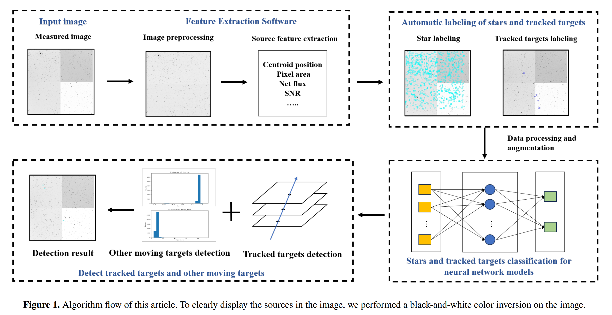
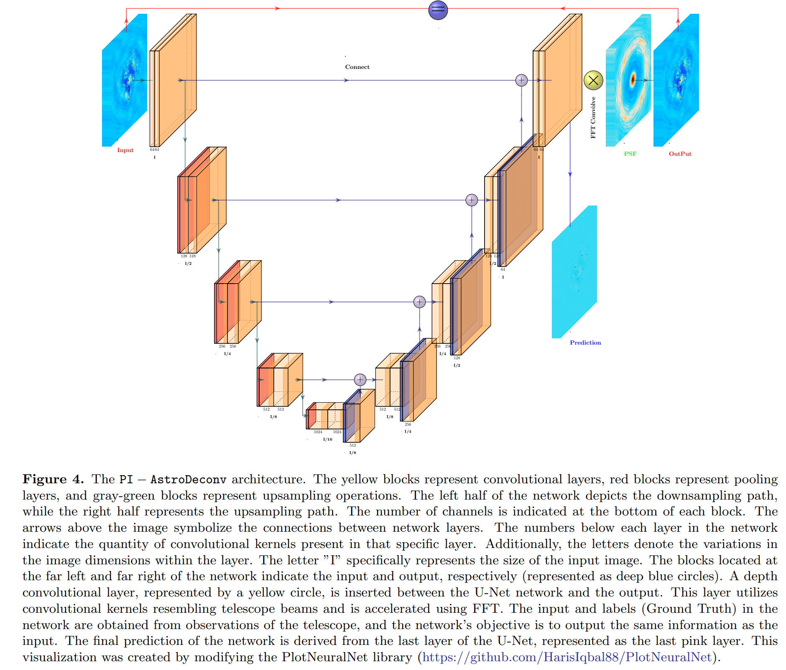

## 2024-09-02

<<<<<<< HEAD
1. [Deep learning approach for identification of HII regions during reionization in 21-cm observations -- III. image recovery](https://arxiv.org/abs/2408.16814)

   > HI, Deep Learning

   [SERNet](https://github.com/micbia/serenet)用于SKA-low从前景污染中分离出21cm信号，从而探测在店里期间的电离区和中性区。

## 2024-09-03

今日停更。

## 2024-09-04

1. [Forecasts for Helium Reionization Detection with Fast Radio Bursts in the Era of Square Kilometre Array](https://arxiv.org/abs/2409.01543)

   > Fast Radio Burst, Cosmology

   FRB的DM和红移测量可以检测氦离子再电离。假设宇宙模型中的再电离发生在某一个特定的红移，SKA二期探测到的$10^6$个FRB可以使HeII再电离的信噪比接近$32-50\sigma$。

## 2024-09-05

1. [Rapid Automatic Multiple Moving Objects Detection Method Based on Feature Extraction from Images with Non-sidereal Tracking](https://arxiv.org/abs/2409.02405)

   > Astronomy, Deep Learning

   从光学图像中提取物体特征（中心点、形状、流量），然后标记为运动物体和恒星，用全连接网络分类特征，跟踪物体。

   

## 2024-09-06

1. [Asking Fast Radio Bursts (FRBs) for More than Reionization History](https://arxiv.org/abs/2409.03255)

   > Fast Radio Burst, Cosmology

   用FRB的DM测量再电离。

   在知道红移的情况下，1000个DM测量值可以区分不同的再电离模型。$\sigma(DM)/\overline{DM}$取决于电离泡的大小和再电离历史。DM的角方差（结构函数）中编码了有关再电离持续时间的和典型气泡大小的信息。

## 2024-09-09

1. [White dwarf fundamentals](https://arxiv.org/abs/2409.03941)

   > White Dwarf, Review

   文章讨论了白矮星的发现、它们作为简并天体的性质、它们与恒星演化早期阶段的联系，以及它们在逐渐冷却过程中所经历的演化。文章还描述了从白矮星致密的核心到稀薄的大气层的不同物理条件，提供了已知白矮星数量不断增加的一些关键统计数据，介绍了它们光谱的多样性、行星物质的吸积以及磁场的存在。最后，这篇文章还强调了白矮星在其他天文学领域的重要作用。

## 2024-09-10

1. [Application of Physics-Informed Neural Networks in Removing Telescope Beam Effects](https://arxiv.org/abs/2409.05718)

   > Radio, Deep Learning

   用FFT代替U-Net的一些卷积层，从干涉阵观测数据中恢复洁图。

   

## 2024-09-11

1. [FAST Observations of Four Comets to Search for the Molecular Line Emissions between 1.0 and 1.5 GHz Frequencies](https://arxiv.org/abs/2409.06227)

   > Radio, Comet

   用FAST对四颗彗星`C/2020 F3 (NEOWISE)`、`C/2020 R4 (ATLAS)`、`C/2021 A1 (Leonard)`、`67P/Churyumov-Gerasimenko`进行了观测，没有发现明确的分子发射信号。

## 2024-09-12

1. [Waste Heat and Habitability: Constraints from Technological Energy Consumption](https://arxiv.org/abs/2409.06737)

   > Astrobiology

   根据热力学定律，废热产生是能量转换的必然结果。在宜居行星上可能存在技术物种，特点是能源消耗和废热产生持续呈指数增长。这里发现，从能量消耗指数增长开始，此类类地行星都会在1000年的时间尺度上丧失宜居条件。

## 2024-09-13

1. [nifty-ls: Fast and Accurate Lomb-Scargle Periodograms Using a Non-Uniform FFT](https://arxiv.org/abs/2409.08090)

   > Astronomy, Periodicity, Software

   [nifty-ls](https://github.com/flatironinstitute/nifty-ls/)使用`Flatiron Institute NUFFT`加速Lomb-Scargle的非均匀FFT计算，比Astropy的实现快，并且还可以在CUDA上运行。

## 2024-09-16

=======
>>>>>>> 22bfbc0efcb1bd248abb3ccd14fe88a1a2404ef6
