## 2024-09-02

1. [Deep learning approach for identification of HII regions during reionization in 21-cm observations -- III. image recovery](https://arxiv.org/abs/2408.16814)

   > HI, Deep Learning

   [SERNet](https://github.com/micbia/serenet)用于SKA-low从前景污染中分离出21cm信号，从而探测在店里期间的电离区和中性区。

## 2024-09-03

今日停更。

## 2024-09-04

1. [Forecasts for Helium Reionization Detection with Fast Radio Bursts in the Era of Square Kilometre Array](https://arxiv.org/abs/2409.01543)

   > Fast Radio Burst, Cosmology

   FRB的DM和红移测量可以检测氦离子再电离。假设宇宙模型中的再电离发生在某一个特定的红移，SKA二期探测到的$10^6$个FRB可以使HeII再电离的信噪比接近$32-50\sigma$。

## 2024-09-05

1. [Rapid Automatic Multiple Moving Objects Detection Method Based on Feature Extraction from Images with Non-sidereal Tracking](https://arxiv.org/abs/2409.02405)

   > Astronomy, Deep Learning

   从光学图像中提取物体特征（中心点、形状、流量），然后标记为运动物体和恒星，用全连接网络分类特征，跟踪物体。

   

## 2024-09-06

1. [Asking Fast Radio Bursts (FRBs) for More than Reionization History](https://arxiv.org/abs/2409.03255)

   > Fast Radio Burst, Cosmology

   用FRB的DM测量再电离。

   在知道红移的情况下，1000个DM测量值可以区分不同的再电离模型。$\sigma(DM)/\overline{DM}$取决于电离泡的大小和再电离历史。DM的角方差（结构函数）中编码了有关再电离持续时间的和典型气泡大小的信息。

## 2024-09-09

1. [White dwarf fundamentals](https://arxiv.org/abs/2409.03941)

   > White Dwarf, Review

   文章讨论了白矮星的发现、它们作为简并天体的性质、它们与恒星演化早期阶段的联系，以及它们在逐渐冷却过程中所经历的演化。文章还描述了从白矮星致密的核心到稀薄的大气层的不同物理条件，提供了已知白矮星数量不断增加的一些关键统计数据，介绍了它们光谱的多样性、行星物质的吸积以及磁场的存在。最后，这篇文章还强调了白矮星在其他天文学领域的重要作用。

## 2024-09-10

1. [Application of Physics-Informed Neural Networks in Removing Telescope Beam Effects](https://arxiv.org/abs/2409.05718)

   > Radio, Deep Learning

   用FFT代替U-Net的一些卷积层，从干涉阵观测数据中恢复洁图。

   

## 2024-09-11

1. [FAST Observations of Four Comets to Search for the Molecular Line Emissions between 1.0 and 1.5 GHz Frequencies](https://arxiv.org/abs/2409.06227)

   > Radio, Comet

   用FAST对四颗彗星`C/2020 F3 (NEOWISE)`、`C/2020 R4 (ATLAS)`、`C/2021 A1 (Leonard)`、`67P/Churyumov-Gerasimenko`进行了观测，没有发现明确的分子发射信号。

## 2024-09-12

1. [Waste Heat and Habitability: Constraints from Technological Energy Consumption](https://arxiv.org/abs/2409.06737)

   > Astrobiology

   根据热力学定律，废热产生是能量转换的必然结果。在宜居行星上可能存在技术物种，特点是能源消耗和废热产生持续呈指数增长。这里发现，从能量消耗指数增长开始，此类类地行星都会在1000年的时间尺度上丧失宜居条件。

## 2024-09-13

1. [nifty-ls: Fast and Accurate Lomb-Scargle Periodograms Using a Non-Uniform FFT](https://arxiv.org/abs/2409.08090)

   > Astronomy, Periodicity, Software

   [nifty-ls](https://github.com/flatironinstitute/nifty-ls/)使用`Flatiron Institute NUFFT`加速Lomb-Scargle的非均匀FFT计算，比Astropy的实现快，并且还可以在CUDA上运行。

## 2024-09-16

1. [A Radio Technosignature Search of TRAPPIST-1 with the Allen Telescope Array](https://arxiv.org/abs/2409.08313)

   > Exoplanet, Astrobiology, SETI

   地外智慧生命处于通信或者科学的目的，可能会向他们附近的其它行星发射雷达信号。因此，从地球上看那些行星-行星掩星（PPOs）系统，就有可能探测到这些信号的溢出。

   使用窄带技术特征搜索代码[turboSETI](https://github.com/UCBerkeleySETI/turbo_seti)结合[NbeamAnalysis](https://github.com/SETIatHCRO/ATA-Utils/tree/master/NbeamAnalysis)信号过滤工具，从`Allen Telescope Array`望远镜阵列观在2022年10月底观测`TRAPPIST-1 `的0.9-9.3GHz的数据中找SETI信号，使用[NbodyGradient](https://github.com/Tusay/NbodyGradient.jl)预测行星-行星掩食的时刻，最后发现2264个信号在掩食窗口，但是没有非人类来源的信号。

   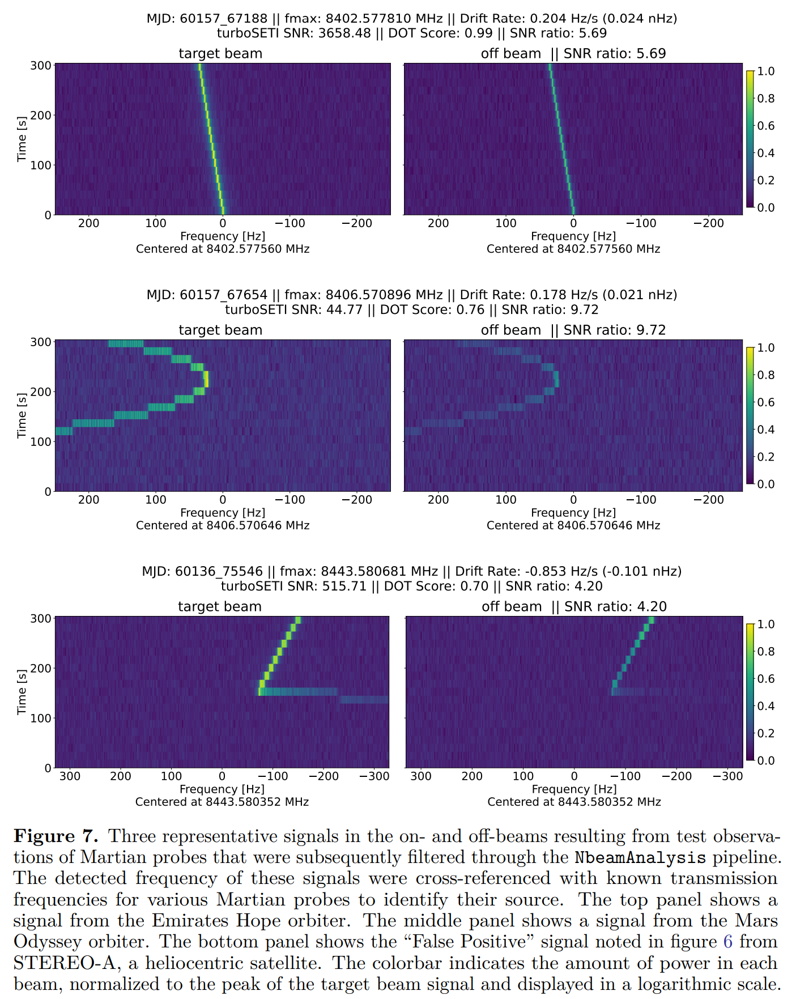

## 2024-09-17

1. [Kinematic study of the Orion Complex: Analysing the young stellar clusters from big and small structures](https://arxiv.org/abs/2409.09206)

   > Stellar, Cluster, Orion, Kinematics

   在Gaia DR3的5D运动学参数空间中，用HDBSCAN对Orion的恒星进行聚类，加入APOGEE和GALAH DR3的径向速度进行运动学分析，发现Orion OB1 association在膨胀，以及$\lambda$ Orion的膨胀。

   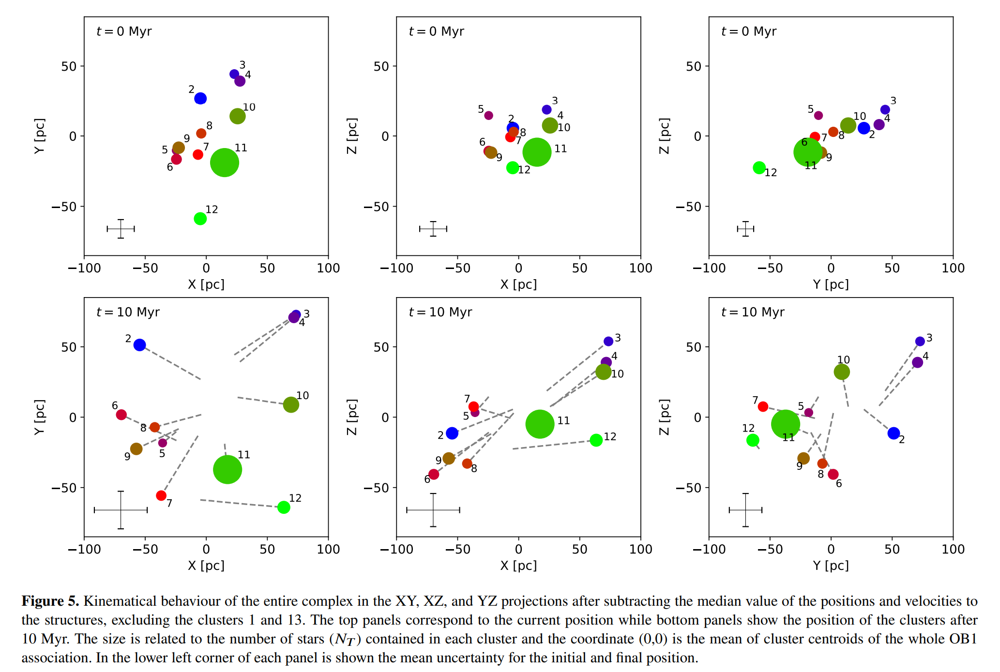

2. [Minor planets, asteroids, comets and interplanetary dust within 30 au](https://arxiv.org/abs/2409.09540)

   > Planetary Science, Solar, Asteroid

   讨论小天体群（小行星、彗星、尘埃粒子）的形成和演化。

   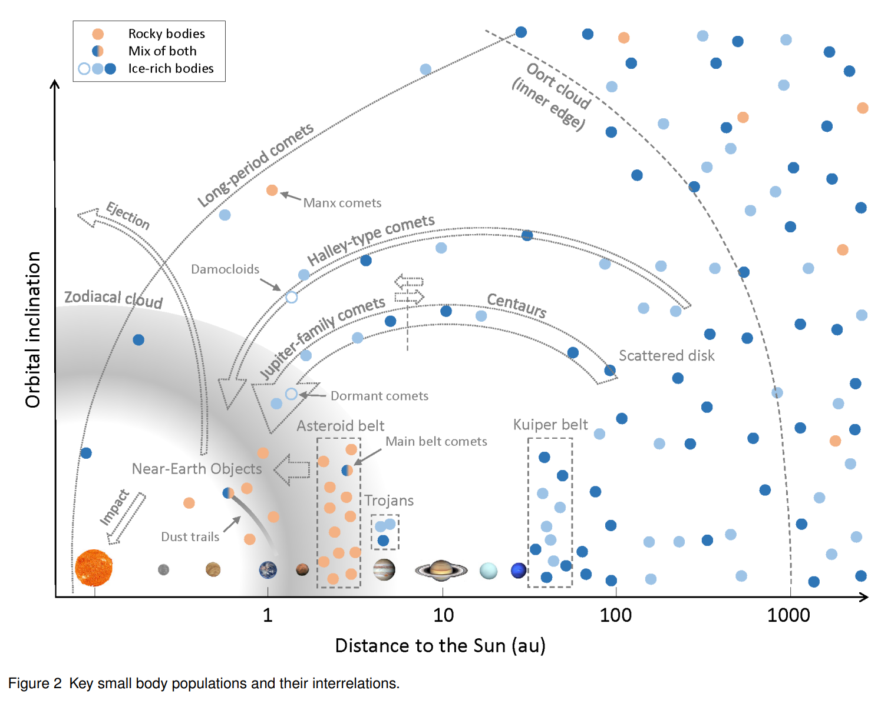

3. [Exploring the time variability of the Solar Wind using LOFAR pulsar data](https://arxiv.org/abs/2409.09838)

   > Pulsar, DM, Solar

   用脉冲星计时阵的DM数据测量太阳风。发现1AU处的电子密度与脉冲星的黄道纬度（ELAT）之间存在很强的相关性。$\left|{\rm ELAT}\right|<3^\circ$的脉冲星的平均电子密度明显更高。我们观察到不同脉冲星的电子密度具有不同的时间模式。

   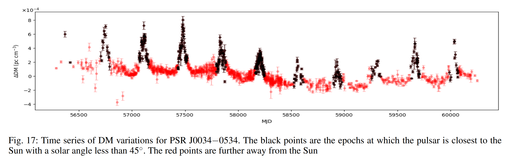

4. [The CRAFT Coherent (CRACO) upgrade I: System Description and Results of the 110-ms Radio Transient Pilot Survey](https://arxiv.org/abs/2409.10316)

   > Transient, Instrument, Survey

   CRACO是ASKAP升级的暂现源巡天，寻找FRB、脉冲星和超长周期天体（ULPO）。调试阶段的时间分辨率是110ms，消多个色散，然后在$空间\times时间\times色散$空间上做boxcar来找信号。发现了两个FRB、4个脉冲星和两个新的RRAT，并通过其子脉冲结构探测到了一个已知的 ULPO，GPM J1839-10。在110ms的灵敏度是11.6 Jy ms。

   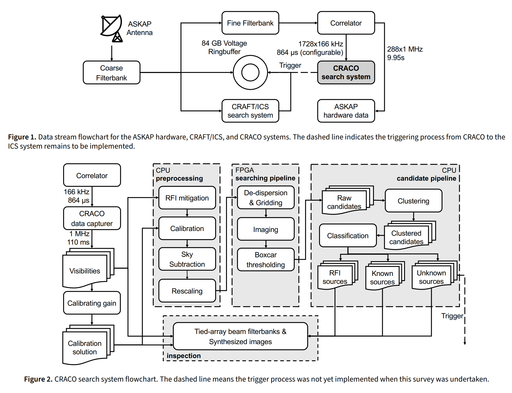

   CRACO目前的时间分辨率是13.8ms，预计2024年底之前做到1.7ms的时间分辨率，灵敏度为1.5 Jy ms，可以探测到比CRAFT多10倍的FRB，也即每天0.5-2个FRB。

5. [Sherpa: An Open Source Python Fitting Package](https://arxiv.org/abs/2409.10400)

   > Astronomy, Software

   [Sherpa](https://github.com/sherpa/sherpa)是用于天文数据分析的工具，其中使用了各种统计和优化方法对数据进行拟合。

   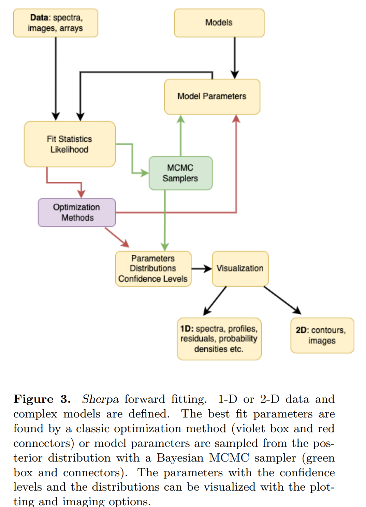

## 2024-09-18

1. [Escape of fast radio bursts from magnetars](https://arxiv.org/abs/2409.10732)

   > Fast Radio Burst, Theory

   研究FRB在磁星风中的传播，假设风是强磁化的，由正负电子对组成。结果表明，FRB应该在距离磁星很远的地方产生$R>10^{12}\,\rm cm$，或者磁星风的结构在耀斑期间发生强烈变化，以允许在半径$R<10^{12}\,\rm cm$处的FRB逃逸。

2. [Fast radio bursts as a probe of gravity on cosmological scales](https://arxiv.org/abs/2409.11163)

   > Fast Radio Burst, Cosmology

   讨论使用FRB的色散相关性和宇宙剪切力相结合来改进对`Horndeski gravity`的约束，从`stage-4 cosmic shear mock survey`和`1e4 FRB`推断`kinetic braiding` 和`Planck mass run rate`，代码在[这里](https://github.com/DennisNeumann97/frb_horndeski_forecast)。

3. [Exploring the Key Features of Repeating Fast Radio Bursts with Machine Learning](https://arxiv.org/abs/2409.11173)

   > Fast Radio Burst, Classification, Machine Learning

   根据CHIME的拟合参数，对重复暴和非重复暴的数据做t-SNE降维并聚类。发现CHIME的`spectral running`对分类至关重要。

4. [Vision foundation models: can they be applied to astrophysics data?](https://arxiv.org/abs/2409.11175)

   > Astronomy, Deep Learning

   使用几种视觉基础模型在光学和射电图像上做训练。结果表明，与传统监督学习相比，特定基础模型提取的特征可以提高光学星系图像分类的准确性，在射电图像上也能取得不错的性能，不过在射电数据上不如传统的监督训练结果。

## 2024-09-19

1. [A VLBI Calibrator Grid at 600MHz for Fast Radio Transient Localizations with CHIME/FRB Outriggers](https://arxiv.org/abs/2409.11476)

   > Fast Radio Burst, Instrument

   构建了一个包含200颗致密天体校准源星表，适用于GHz波段30毫角秒的VLBI观测。用于 CHIME/FRB-Outriggers的FRB定位。

2. [A search for persistent radio sources toward repeating fast radio bursts discovered by CHIME/FRB](https://arxiv.org/abs/2409.11533)

   > Fast Radio Burst, Galaxy, PRS

   对CHIME的37个有角秒定位的FRB进行的PRS搜索，发现20181030A和20190417A的宿主星系中不存在恒星形成或活动星系核，因此可能是PRS。可以在磁星、超星云、伽马射线暴余辉或超新星喷出物模型的背景下得到合理的解释，但是这两个FRB也都符合在星云模型中预测射电流量和RM的关系。

   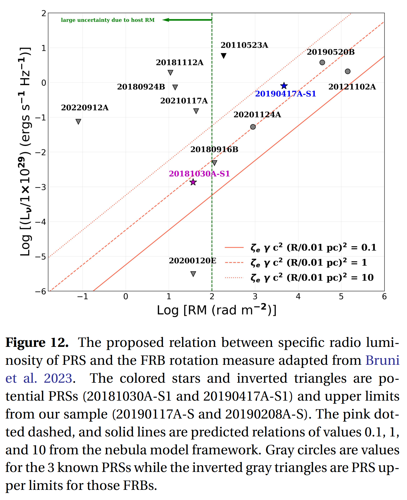

3. [Bright unintended electromagnetic radiation from second-generation Starlink satellites](https://arxiv.org/abs/2409.11767)

   > Astronomy, Radio, RFI, Satellite

   来自荷兰的一组天文学家最近利用欧洲低频射电阵列LOFAR的观测，指出第二代星链卫星产生的射电干扰时上一代的30多倍(已经考虑了卫星距离不同的影响)，可能会对射电观测产生影响。

   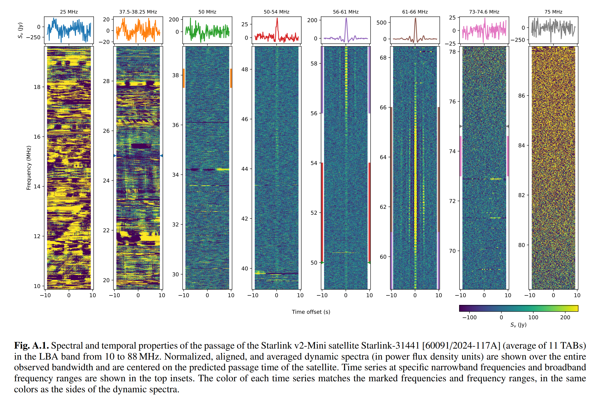

   这个射电信号强度已经在国际电信联盟（International Telecommunications Union）为射电天文学分配的150.05-153 MHz频段内超过了推荐的辐射量阈值。

   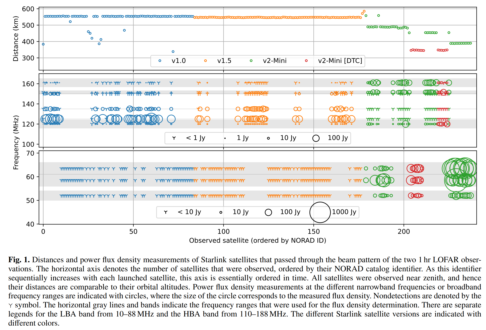

## 2024-09-20

1. [Rotation Measure study of FRB 20180916B with the uGMRT](https://arxiv.org/abs/2409.12584)

   > Fast Radio Burst, Observation, Polarization

   uGMRT对FRB20180916B的观测，探测到它的RM线性上升后保持稳定在$-58.75\,\rm rad/m^2$。

   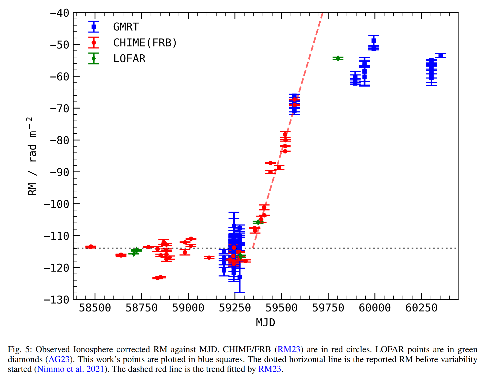

2. [The Twisting of Radio Waves in a Randomly Inhomogeneous Plasma](https://arxiv.org/abs/2409.12365)

   > Radio, Polarization, Theory

   光的偏振矢量沿着非平面曲线传播时，会经历额外的旋转，导致消偏振。`geometric depolarization (GDP)`。

   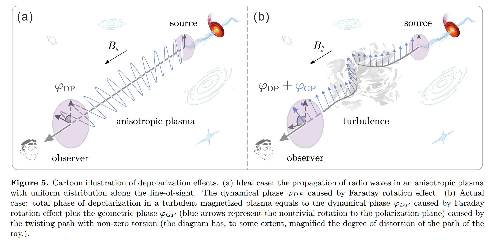

## 2024-09-23

 1. [The Variability of Persistent Radio Sources of Fast Radio Bursts](https://arxiv.org/abs/2409.13170)

    > Fast Radio Burst, PRS, Observation

    杨嬡媛的文章，VLA对FRB121102和190520的PRS观测。

 2. [Statistical properties and cosmological applications of fast radio bursts](https://arxiv.org/abs/2409.13247)

    > Fast Radio Burst, Statistics

    总结了利用大样本FRB的统计分析和宇宙学应用，包括能量函数、重复FRB的等待时间分布、宇宙中 缺失重子和环星系介质的探测、宇宙学参数的测量、再电离历史的探索、FRB的引力透镜研究等。

 3. [The Near-Ultraviolet eXplorer (NUX): a ground-based wide-field near-UV telescope to search for near-UV transients](https://arxiv.org/abs/2409.13577)

    > Transient, NUV, Instrument

    近紫外暂现源探测器，由4个小型地面望远镜（36cm）组成，视场17平方度，分辨率2.6角秒，对300-350nm波段进行2.5分钟的曝光观测，以提高对数天、数小时的瞬变物理过程的认识。

 4. [Venus Phosphine: Updates and lessons learned](https://arxiv.org/abs/2409.13438)

    > Planetary Science, Astrobiology, Venus

    金星大气中磷化氢的探测结果经受住了各种挑战，并获得了来自PVP数据档案的独立支持，促成了金星大气长期监测计划JCMT-Venus，这里介绍这一计划的最新成果。指出磷化氢的发现并不构成生命的证据，只是磷化氢的证据。

    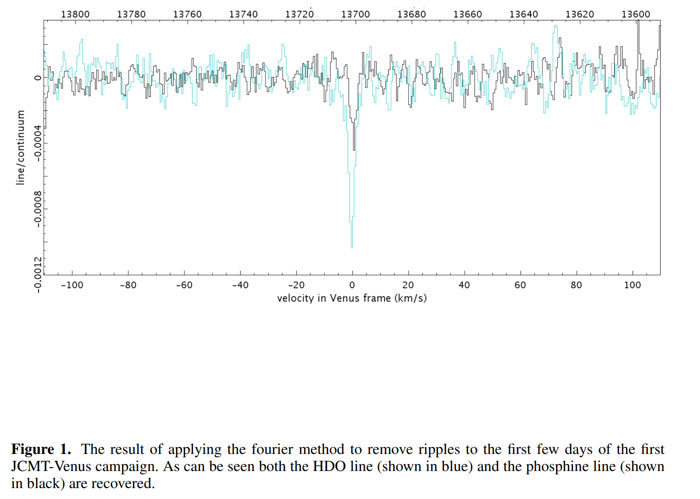

## 2024-09-24

1. [Interpreting Multi-band Galaxy Observations with Large Language Model-Based Agents](https://arxiv.org/abs/2409.14807)

   > Galaxy, Deep Learning, LLM

   提出`mephisto`，使用`CIGALE`的SED模型，给LLM输入星系的SED、SED模型和拟合质量指标，让LLM推理拟合的好不好。如果拟合的不好，采用树搜索改进SED模型，从过去的拟合历史中提取有用的知识，并将其整合到知识库中。最终实现SED拟合，并解释星系多波段观测数据。

   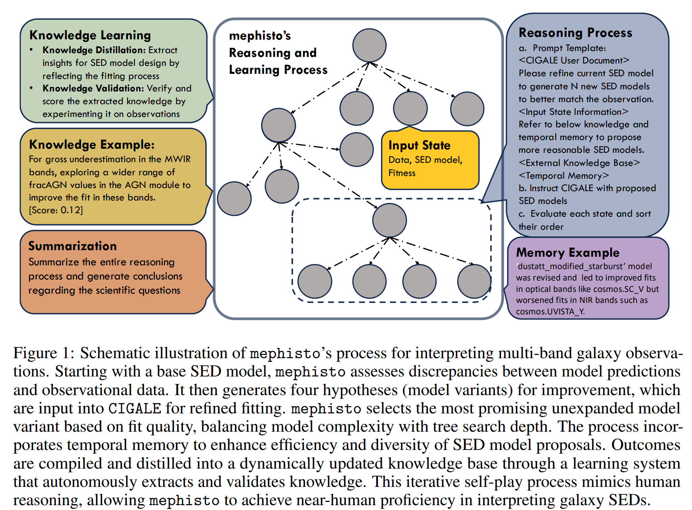

## 2024-09-25

1. [Novel understanding of Cosmological Phenomena using Fast Radio Bursts](https://arxiv.org/abs/2409.15526)

   > Fast Radio Burst, Cosmology

   探讨高频引力波产生FRB的可能，以及修正引力对FRB引力透镜的影响，从而对原初黑洞站暗物质的比例施加约束。

   结果表明，修正引力在透镜效应上引入了屏蔽效应，类似于等离子体对光线的散射效应。进一步讨论了即将到来的HIRAX射电望远镜对FRB和透镜FRB的探测率。

2. [Gaussian Process Models Impact the Inferred Properties of Giant Planets around Active Stars](https://arxiv.org/abs/2409.15407)

   > Variable, Gaussian Process

   用高斯过程拟合光变曲线，推断恒星周边行星的最小质量和偏心率等参数，受高斯过程框架选择的影响，推测参数的变化幅度搞到67%和95%。

## 2024-09-26

1. [A PyTorch Benchmark for High-Contrast Imaging Post Processing](https://arxiv.org/abs/2409.16466)

   > Exoplanet, Machine Learning

   [torchKLIP](https://github.com/astrochialinko/torchKLIP)用于系外行星的直接成像。系外行星的直接成像是一项极具挑战性的任务，需要将微弱的行星信号从其宿主恒星的强光中区分出来，而宿主恒星的强光通常会被称为 “斑点 ”的时变恒星噪声所掩盖。减去斑点噪声的主要算法采用基于本征的点扩散函数（PSF）拟合技术，从恒星斑点噪声中分辨出行星信号。

   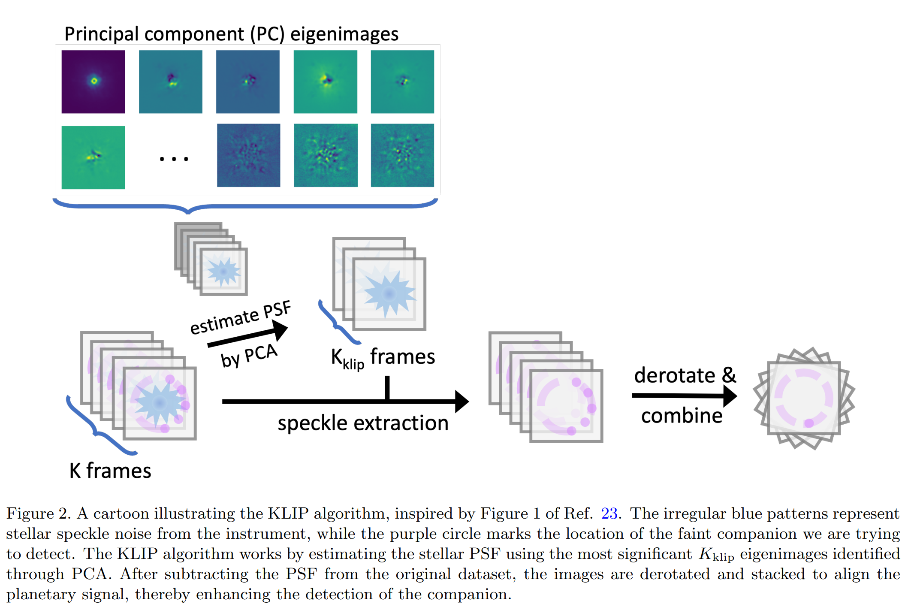

## 2024-09-27

1. [Millinovae: a new class of transient supersoft X-ray sources](https://arxiv.org/abs/2409.17338)

   > Stellar, Transient, Novae

   白矮星吸积盘累积的气体达到临界温度发生新星爆发，这里发现了`OGLE-mNOVA-11`在光学爆发期间发出了supersoft X-ray，但是没有检测到质量抛射（没有发生经典新星爆发）。作者称这种现象是`millinovae`，其光学亮度是经典新星的千分之一，这些天体可能代表一类新的、尚未发现的恒星群。

2. [Preferential Occurrence of Fast Radio Bursts in Massive Star-Forming Galaxies](https://arxiv.org/abs/2409.16964)

   > Fast Radio Burst, Galaxy, Observation, Statistics

   对DSA发现的30个FRB的宿主星系的光学观测发现，FRB倾向于在大质量恒星形成星系中出现，低质量FRB宿主星系的恒星形成活动低于背景星系。可能是由于大质量恒星形成星系中更有可能发生恒星并合产生磁星。

   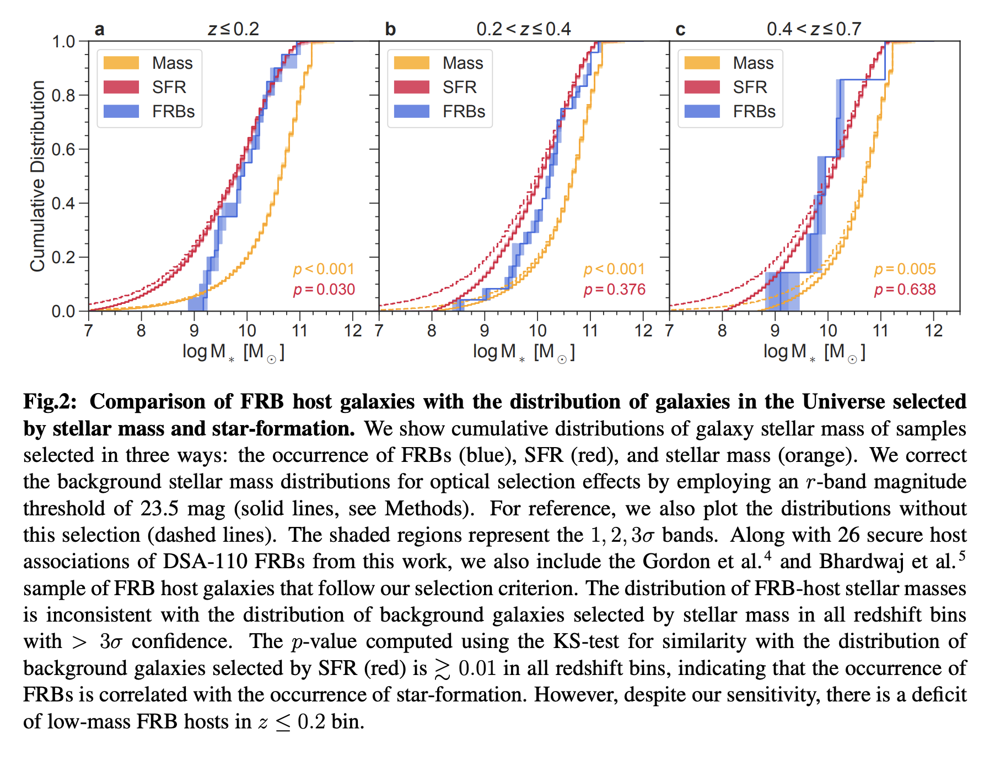

## 2024-09-30

1. [A determination of the cosmic microwave background temperature using Galactic molecules](https://arxiv.org/abs/2409.18270)

   > ISM, Cosmology

   测量了银河系弥漫分子云中CN的激发温度，测量值为$T=2.725\pm0.015K$，与宇宙微波背景温度的直接测定值一致。

