## 2024-10-01

1. [Predicting the rate of fast radio bursts in globular clusters from binary black hole observations](https://arxiv.org/abs/2409.20564)

   > Fast Radio Burst, Theory

   球状星团中可能产生双白矮星并合以及双黑洞并合，前者的发生率与后者相关。双白矮星的并和率随着红移的增加而降低，与最近测量到的FRB事件率与红移的函数关系类似。

2. [The Einstein Probe transient EP240414a: Linking Fast X-ray Transients, Gamma-ray Bursts and Luminous Fast Blue Optical Transients](https://arxiv.org/abs/2409.19056)

   > High Energy, Observation, Multi Wavelength

   过去几十年探测到越来越多的`Fast X-ray Transient`，但起源是个谜。

   EP探测到`EP240414a`，这里报告它的光学波段对应体，光学光曲线显示至少有三次不同的发射事件，时间尺度分别为1、4和15天，峰值绝对星等分别为-20、-21和-19.5。早期的光学光谱极蓝，与余辉发射不符。可能是喷流和超新星冲击波与恒星包膜和致密的星周介质相互作用的结果。

3. [The Radio Counterpart to the Fast X-ray Transient EP240414a](https://arxiv.org/abs/2409.19055)

   > High Energy, Observation, Multi Wavelength

   EP探测到`EP240414a`，这里报告它的射电波段对应体，3GHz的射电辐射在爆炸后30天达到峰值，光谱光度为$2\times10^{30}\,\rm ergs^{-1}Hz^{-1}$，需要一个至少具有中等体积洛伦兹因子（$\Gamma≳1.6$）、最小能量为$∼10^{48}\,\rm erg$的外流。

4. [AstroMLab 2: AstroLLaMA-2-70B Model and Benchmarking Specialised LLMs for Astronomy](https://arxiv.org/abs/2409.19750)

   > Astronomy, LLM

   在`LLaMA-2-7B`的基础上微调的`AstroLLaMA`在天文领域的性能甚至不如基础模型。如果在arXiv的摘要上继续训练基础模型，可以部分缓解性能下降的问题，但是与模型大小相关，小模型会发生灾难性遗忘，70B的模型继续训练可以产生改进。新训练了[AstroLLAMA-3-8B/-2-70B](https://huggingface.co/AstroMLab)。

   

5. [Gravitational Wave Astronomy With TianQin](https://arxiv.org/abs/2409.19665)

   > Gravitational Wave, White Paper

   天琴白皮书。天琴计划由三个卫星组成，将在约105公里的高度轨道上运行，形成等边三角形，将观测从恒星双星到星系和大尺度结构的引力波信号。

   天琴能够探测的引力波源包括恒星双星、超大质量黑洞（MBHs）的并合、以及早期宇宙事件。

   1. **恒星物理**：
      - 讨论了双星演化、恒星团动力学、以及围绕旋转超大质量黑洞的双星动力学。
   2. **超大质量黑洞的诞生和成长**：
      - 探讨了超大质量黑洞的种子形成、宇宙学演化、以及多信使探测。
   3. **超大质量黑洞周围的源**：
      - 讨论了轻IMRIs（中等质量比螺旋）的探测、环境效应、多信使探测。

## 2024-10-02

1. [GalaxiesML: a dataset of galaxy images, photometry, redshifts, and structural parameters for machine learning](https://arxiv.org/abs/2410.00271)

   > Galaxy, Machine Learning, Dataset

   构建了用于星系机器学习的数据集，包含了286,401个星系的图像、光度测量和光谱红移。数据在[GalaxiesML](https://doi.org/10.5281/zenodo.11117528)，代码在[galaxiesml_examples](https://github.com/astrodatalab/galaxiesml_examples)。

   

2. [Revisiting the Mysterious Origin of FRB 20121102A with Machine-learning Classification](https://arxiv.org/abs/2410.00576)

   > Fast Radio Burst, Statistics, Machine Learning

   用UMAP对Arecibo探测到的FRB121102的977个爆发进行降维，用到的数据包括`amplitude, linear temporal drift, time duration, central frequency, bandwidth, scaled energy, and fluence`，发现这些爆发成团。

   

## 2024-10-03

1. [Finding radio transients with anomaly detection and active learning based on volunteer classifications](https://arxiv.org/abs/2410.01034)

   > Transient, Machine Learning, Anomaly Detection

   使用MeerKAT收集的500张图像，覆盖11个天区，提取其中的X射线双星系统的光变曲线。然后使用三种特征对光变曲线进行特征提取，使用局部异常因子（LOF）和孤立森林（IF）进行异常值检验。

   发现`feets`和`wavelet`特征在异常检测中表现得更好，使用主动学习（标记一小部分，让机器学习模型学习，然后进行预测）可以减少标记数量。

   

2. [The Tale of Two Telescopes: How Hubble Uniquely Complements the James Webb Space Telescope: Galaxies](https://arxiv.org/abs/2410.01187)

   > Galaxy, Observation

   HST 可以独一无二地探测星系中年轻、炽热、大质量的恒星（未被遮挡），而 JWST 则可以揭示较老恒星群的更晚期阶段，以及星系在激烈的恒星形成过程中产生和脱落大量尘埃的相对短暂阶段，以及 HST 无法进入的超高红移宇宙（z≳10-11）。

   

## 2024-10-04

1. [Fast Radio Bursts as probes of the late-time universe: a new insight on the Hubble tension](https://arxiv.org/abs/2410.01974)

   > Fast Radio Burst, Cosmology

   根据不同望远镜观测到的64个河外FRB样本，采用不同的似然函数，估计哈勃常数，发现FRB示踪的是宇宙晚期的哈勃常数。与之前的工作相比，这里的误差范围更小，且推导出的哈勃常数的$1\sigma$误差范围与早期宇宙（CMB）测量的结果不再重叠，说明Hubble Tension确实存在。

2. [Multi-wavelength and Multi-messenger Counterparts of Fast Radio Bursts](https://arxiv.org/abs/2410.02216)

   > Fast Radio Burst, Theory, Review, Multi Wavelength

   回顾FRB相关的可能的多波段信号探测。

## 2024-10-07

1. [DRAFTS: A Deep Learning-Based Radio Fast Transient Search Pipeline](https://arxiv.org/abs/2410.03200)

   > Fast Radio Burst, Search, Software

   我的文章，讲FRB搜索。

   

2. [Identifying the Origin of FRB-associated X-ray Bursts with X-ray Polarization](https://arxiv.org/abs/2410.03167)

   > Fast Radio Burst, Theory, High Energy, Polarization

   SGR1935发出的那次FRB有对应的X射线暴，有几种可能的模型

   - emission of a trapped fireball modified by resonant cyclotron scattering
   - outflow from a polar trapped-expanding fireball
   - synchrotron radiation of a far-away relativistic shock

   这里认为，这三种模型预测的X射线暴的偏振模式不同。

3. [The Kinematics of 30 Milky Way Globular Clusters and the Multiple Stellar Populations within](https://arxiv.org/abs/2410.02855)

   > Stellar, Cluster, Kinematics

   使用HST和Gaia的自行数据，研究银河系内球状星团的运动学。根据恒星相对星团中心的径向切向速度随位置角的变化来测量三维旋转。

   在21个球状星团中发现了显著的旋转，不同恒星族群之间的旋转幅度没有显著差异。星团的三维旋转幅度与其质量、弛豫时间、富星分数和浓度强相关。

## 2024-10-08

1. [Measuring Hubble constant using localized and unlocalized fast radio bursts](https://arxiv.org/abs/2410.03994)

   > Fast Radio Burst, Cosmology

   用IllustrisTNG模拟的host和IGM的DM概率分布，在69个定位的FRB上约束哈勃常数为$H_0=70.41^{+2.28}_{-2.34}\,\rm km/s/Mpc$，介于CMB和超新星测量的中间。使用CHIME未定位的527个FRB测量的H0在69附近。500个定位的FRB会将统计误差降低到1%，但在测量时，系统误差占主导。

2. [Fast Radio Bursts with Narrow Beaming Angles Can Escape from Magnetar Magnetospheres](https://arxiv.org/abs/2410.04065)

   > Fast Radio Burst, Theory

   如果FRB起源于磁星磁层，磁层中的正负电子对会散射FRB，使FRB难以逃离。这里认为，如果FRB传播方向和背景磁场之间的夹角小于$10^{-2}\,\rm rad$，散射效应大大减弱，使FRB可以发射出来。

## 2024-10-09

今日停更

## 2024-10-10

1. [Exploring Magnetic Fields in Molecular Clouds through Denoising Diffusion Probabilistic Models](https://arxiv.org/abs/2410.07032)

   > ISM, Deep Learning

   用`Denoising Diffusion Probabilistic Models`从柱密度、偏振角、视向非热速度弥散三个通道来估计磁场强度，表现优于传统DCF方法的估计。

   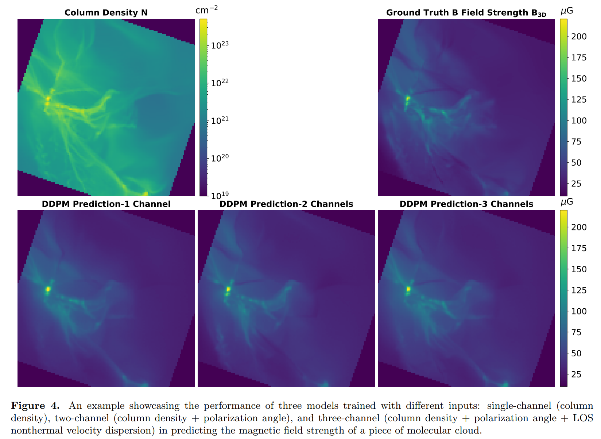

2. [Constraining the dispersion measure redshift relation with simulation-based inference](https://arxiv.org/abs/2410.07084)

   > Fast Radio Burst, Cosmology

   用定位的FRB的DM来估计宇宙学参数，基于`simulation-based inference`。

## 2024-10-11

1. [Investigating the sightline of a highly scattered FRB through a filamentary structure in the local Universe](https://arxiv.org/abs/2410.07307)

   > Fast Radio Burst, Scattering

   FRB 20200723B是目前CHIME探测到的散射时标最大的单成分爆发，其宿主星系最有可能是NGC 4602。分析认为散射来自其宿主星系内部。

   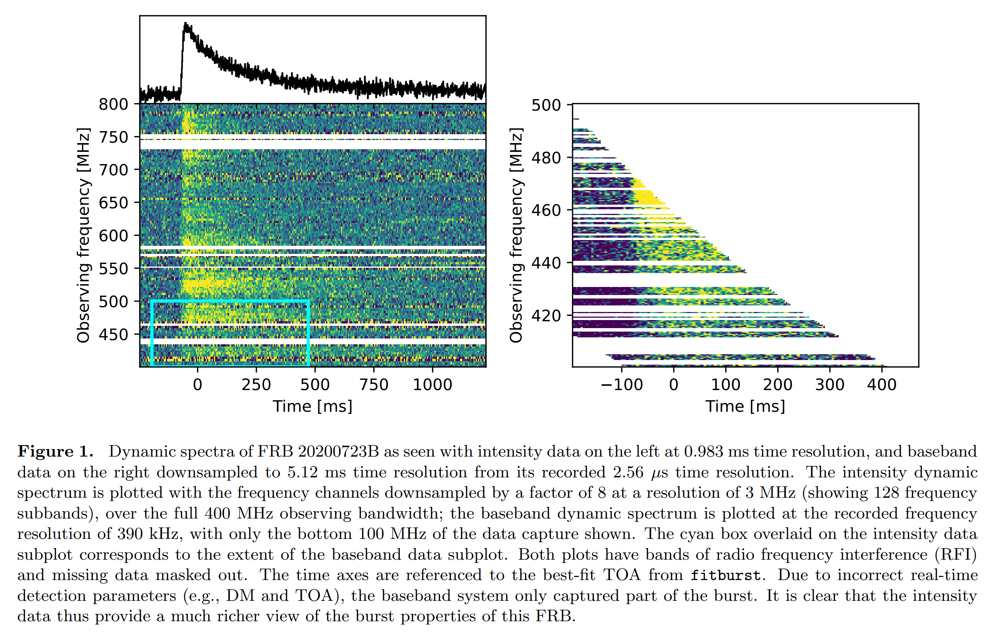

## 2024-10-14

1. [SETI in 2022](https://arxiv.org/abs/2410.08253)

   > SETI, Review

   回顾了2022年的SETI研究，包括：

   - 实际搜索结果（16篇论文），涉及Breakthrough Listen项目、太阳引力透镜搜索、VASCO项目等。
   - 搜索方法和仪器（11篇论文），包括对下一代VLA、PANOSETI项目、小尺寸光学望远镜等的讨论。
   - 目标和频率选择（4篇论文），探讨了通过分析系外行星宿主恒星位置来推断星际通信网络的拓扑结构等。
   - 技术签名的发展（17篇论文），包括对星际通信形式、恒星演化与技术签名、大气和地质技术签名等的讨论。
   - ETI理论（26篇论文），涉及德雷克方程、费米悖论、星际迁移、星际探测器等。
   - SETI的社会方面（6篇论文），包括对SETI的历史分析、对地缘政治风险的批判、文化影响等。

## 2024-10-15

1. [A search using GEO600 for gravitational waves coincident with fast radio bursts from SGR 1935+2154](https://arxiv.org/abs/2410.09151)

   > Fast Radio Burst, Magnetar, Gravitational Wave

   在GEO600探测器的数据中找SGR1935的FRB对应的引力波，没有找到引力波信号。

2. [Polarization Characteristics of the Hyperactive FRB 20240114A](https://arxiv.org/abs/2410.10172)

   > Fast Radio Burst, Observation

   GBT观测FRB20240114A，事件率最高260每小时。

3. [Fast Radio Burst Tomography of the Unseen Universe](https://arxiv.org/abs/1903.06535)

   > Fast Radio Burst, Review

   Ravi写的FRB科学白皮书。

   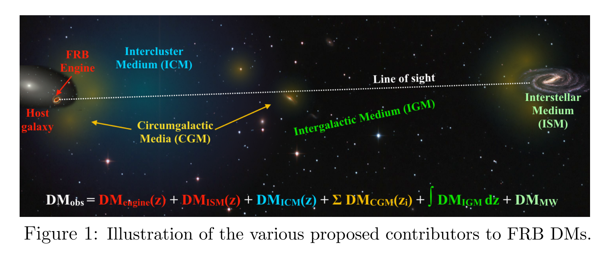

## 2024-10-16

1. [AI Foundation Model for Heliophysics: Applications, Design, and Implementation](https://arxiv.org/abs/2410.10841)

   > Solar, Deep Learning

   太阳动力学天文台（Solar Dynamics Observatory, SDO）提供了连续的高分辨率太阳观测数据，这些数据被广泛应用于太阳和日球物理领域的研究。

   这里使用SDO的AIA的七个极紫外线（EUV）波段图像和HMI（太阳磁场和磁流体动力学成像仪）的矢量磁图，采用`Long-Short Spectral Transformer`进行了训练，结果表明模型能够学习并预测太阳活动。

   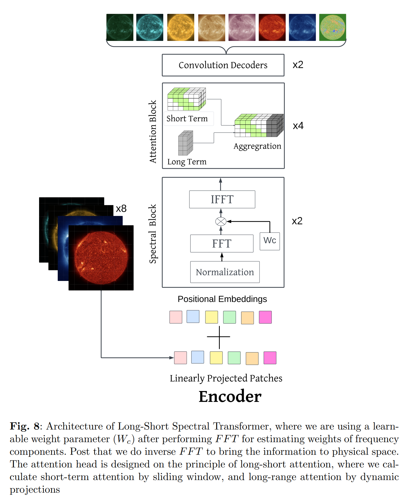

   文章还展示了使用扩散模型生成的AIA-EUV通道的初步结果。

   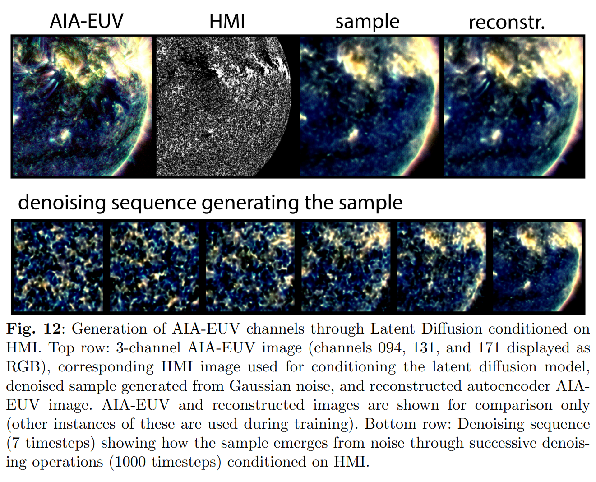

2. [Serendipitous observation of a white dwarf companion to a JWST/MIRI coronagraphic calibrator](https://arxiv.org/abs/2410.11568)

   > White Dwarf, Observation, JWST

   使用JWST的中红外仪器MIRI进行观测时，发现了HD 218261的伴星，是一颗有效温度约为10,000 K，半径约为太阳的0.8倍的白矮星。

   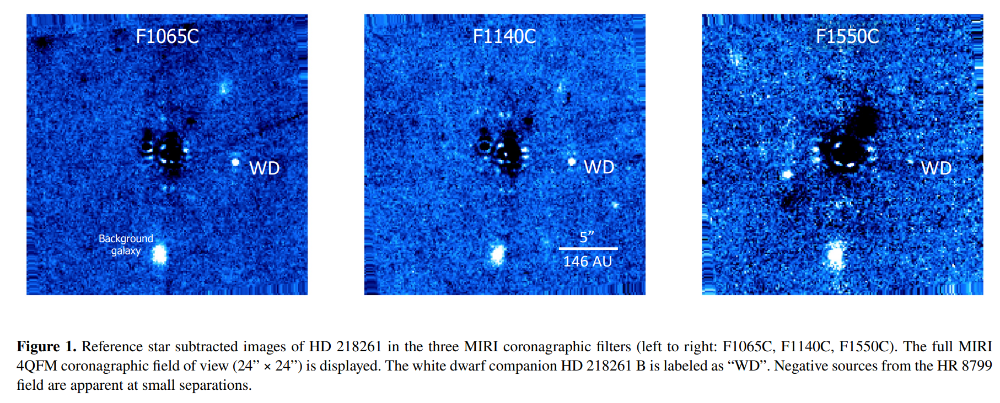

   这颗恒星原本是作为观测系外行星HR 8799的日冕观测校准星。这些结果表明，使用MIRI进行精确的中红外光度测量白矮星伴星是可能的，这为研究近距离双星系统中的白矮星开辟了新的可能性。

## 2024-10-17

1. [Basic Data Processing of Gravitational Waves](https://arxiv.org/abs/2410.11858)

   > Gravitational Wave, Method, Review

   引力波数据处理综合指南，从引力波和LIGO和Virgo使用的检测技术开始，涵盖了信号处理的基本知识，包括傅里叶分析、滤波和二次啁啾信号的生成，并探讨了噪声分析以及`Generalized Likelihood Ratio Test`等信号检测方法。

2. [MeerKAT observations of pair-plasma induced birefringence in the double pulsar eclipses](https://arxiv.org/abs/2410.12510)

   > Pulsar, Binary, Polarization

   `PSR J0737-3039A/B`是几乎完美的`edge-on`双中子星系统，快速旋转的脉冲星A被慢速旋转的脉冲星B的磁场掩盖。

   使用MeerKAT观测，研究食变时的偏振特性。在校正脉冲星B的旋转后对光变曲线进行平均，发现出现了大量的圆偏振和线偏振位置角的快速变化，这些变化发生在脉冲星A的发射部分透射脉冲星B磁层的阶段。证实食变是等离子体同步吸收的结果。

   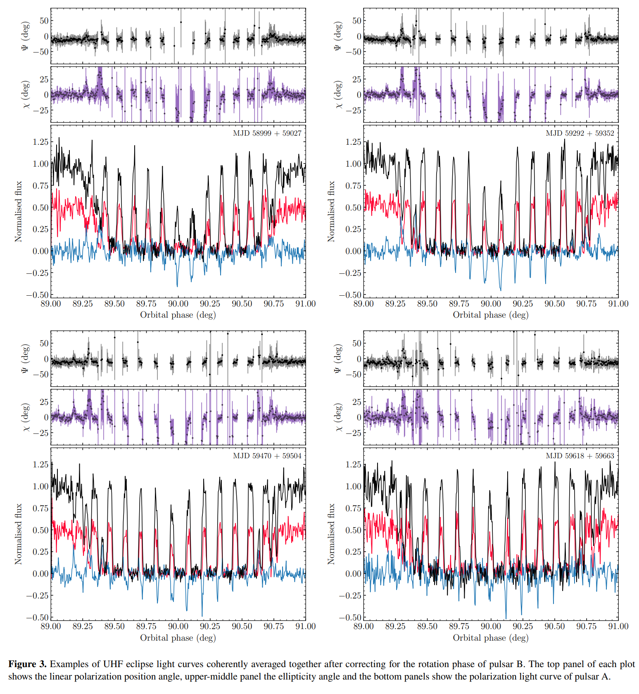

## 2024-10-18

1. [Pushchino multibeam pulsar search -- V. The bright FRB 20190203 detected at 111 MHz](https://arxiv.org/abs/2410.13561)

   > Fast Radio Burst, Observation

   `Pushchino`在111MHz探测到一个色散为134的非重复FRB20190203，并且没有看到任何短伽马射线暴。

   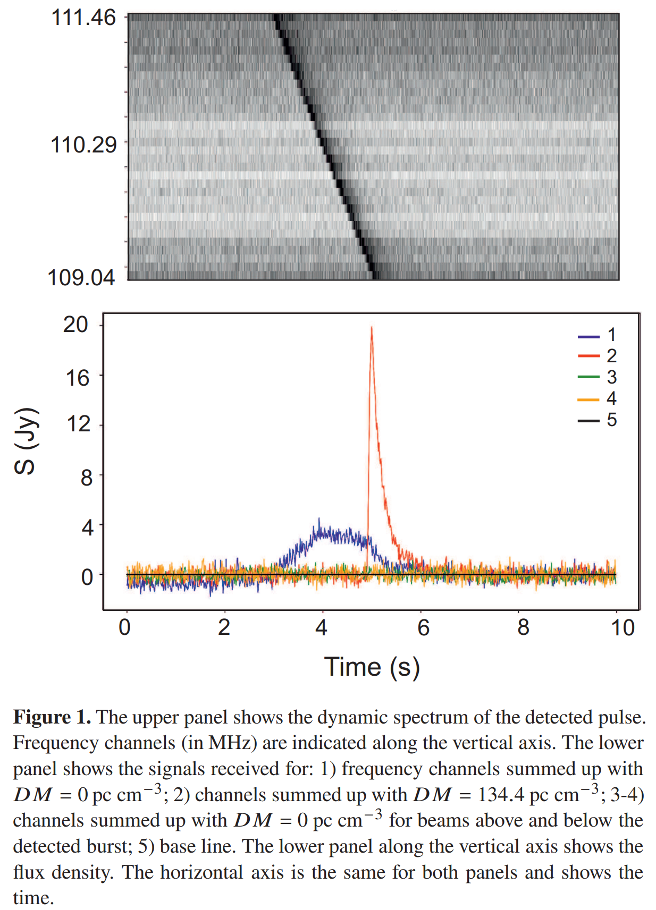

## 2024-10-21

1. [Little time for oscillation: Fast disruption of the Radcliffe Wave by Galactic motions](https://arxiv.org/abs/2410.14603)

   > ISM, Radcliffe Wave

   李广兴的文章，认为之前那篇说`Radcliffe Wave在振荡`的文章，把Radcliffe Wave看的太简单了。

   他们模拟了本地星际气体的三维演化，发现剪切会在45Myr的时间尺度上将Radcliffe Wave拉伸到当前长度的两倍，但在这个时间尺度上，垂直振荡只发生了半个周期。

## 2024-10-22

1. [The disappearance of a massive star marking the birth of a black hole in M31](https://arxiv.org/abs/2410.14778)

   > Stellar, Black Hole

   报告了M31中一个大质量超巨星`M31-2014-DS1`，于2014年在红外波段发现，光度在之后的一千天没有变化，再之后的一千天急速减弱，且没有探测到光学爆发，可以解释为恒星回落到一个新形成的黑洞中。可能是黑洞形成的直接观测。

   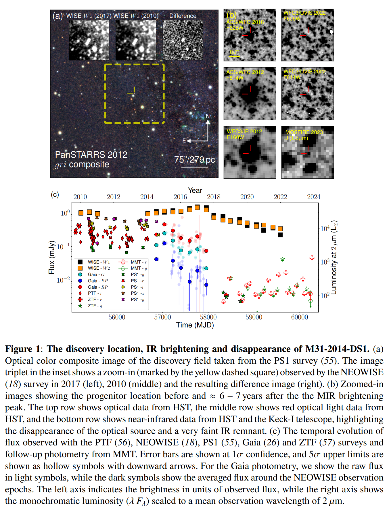

2. [Cthulhu: An Open Source Molecular and Atomic Cross Section Computation Code for Substellar Atmospheres](https://arxiv.org/abs/2410.14751)

   > Exoplanet, Software

   [Cthulhu](https://cthulhu.readthedocs.io/en/latest/)，克苏鲁，根据原子和分子线计算系外行星或者褐矮星的光谱模型。

   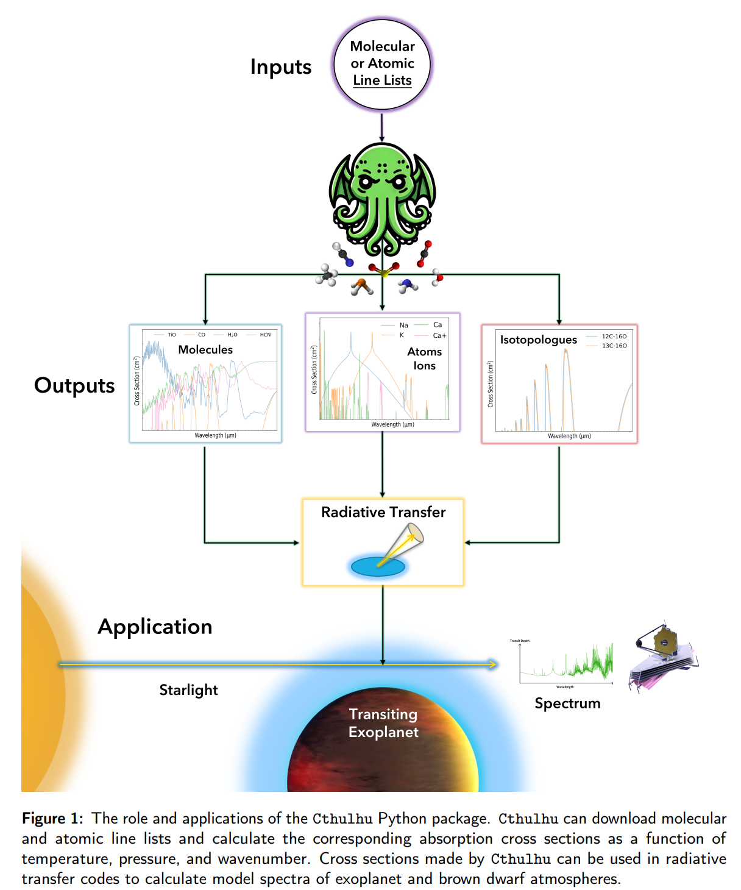

## 2024-10-23

1. [A probe of the maximum energetics of fast radio bursts through a prolific repeating source](https://arxiv.org/abs/2410.17024)

   > Fast Radio Burst, Observation

   对FRB20220912A从2022年10月到2023年2月，共1500个小时的观测，探测到130次高能量爆发，爆发的能量分布在高能端变平，与FRB20201124A一样（作者也是Hessels那帮人）。

2. [A Repeating Fast Radio Burst Source in a Low-Luminosity Dwarf Galaxy](https://arxiv.org/abs/2410.17044)

   > Fast Radio Burst, Galaxy, Observation

   对FRB20190208A的定位，使用EVN在1.4GHz观测了65.6个小时，探测到一次爆发，定位在$RA=18h54m11.27s,\, Dec=+46d55m21.67s$，误差为260毫角秒。

   使用GTC积分3.2小时探测到宿主星系，i波段星等为27.32等，是目前为止最暗的FRB宿主星系，而且EVN和VLA没有看到PRS。

   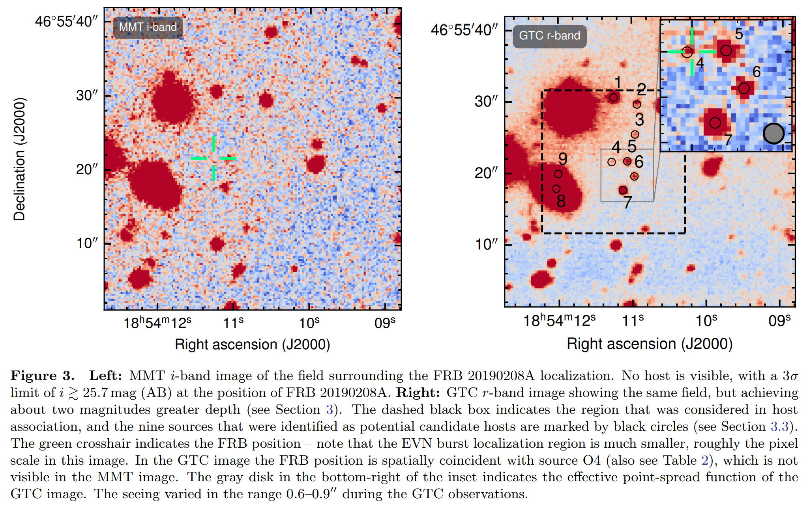

3. [Coniferest: a complete active anomaly detection framework](https://arxiv.org/abs/2410.17142)

   > Astronomy, Machine Learning, Anomaly Detection

   [coniferest](https://github.com/snad-space/coniferest)基于`Isolation forest`、`Active Anomaly Discovery`和`Pineforest`的天文异常检测工具。

## 2024-10-24

1. [Rare Event Classification with Weighted Logistic Regression for Identifying Repeating Fast Radio Bursts](https://arxiv.org/abs/2410.17474)

   > Fast Radio Burst, Machine Learning, Classification

   用加权逻辑回归基于FRB的参数分类重复和非重复FRB。

2. [Blast: a Web Application for Characterizing the Host Galaxies of Astrophysical Transients](https://arxiv.org/abs/2410.17322)

   > Transient, Galaxy, Software

   [Blast](https://blast.scimma.org/)接收暂现源警报的实时数据流，将暂现源与宿主星系进行匹配，并对宿主星系的重合档案成像数据进行光度测量。

   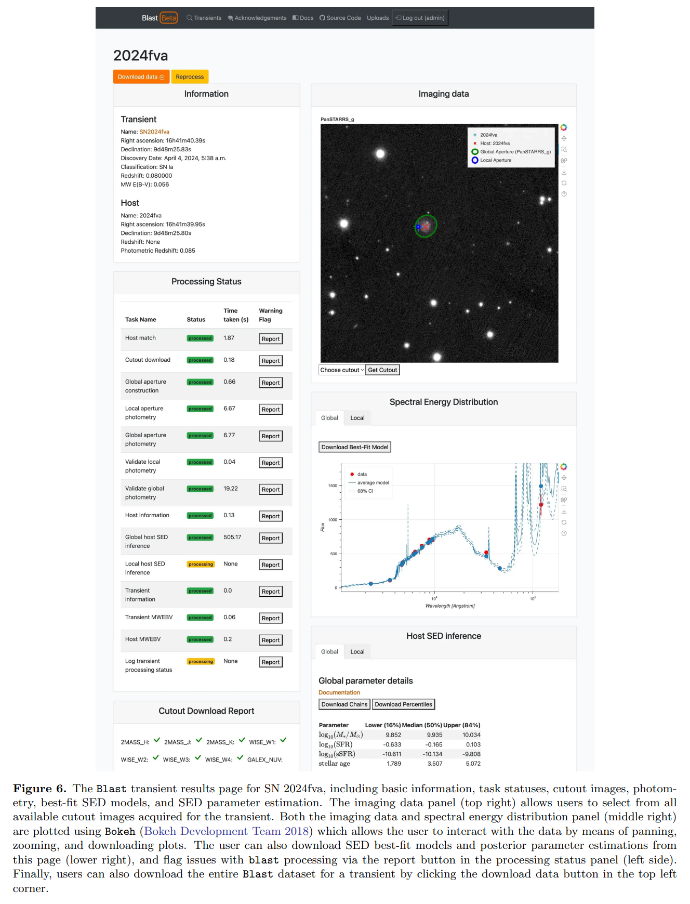

## 2024-10-25

1. [Exploring the Universe with SNAD: Anomaly Detection in Astronomy](https://arxiv.org/abs/2410.18875)

   > Astronomy, Machine Learning, Anomaly Detection, Method

   [SNAD](https://snad.space/)是一个国际项目，主要重点是利用主动学习和其他机器学习算法在大规模巡天中探测天文异常现象。

   本文对 SNAD 项目进行了回顾，总结了团队几年来取得的进展和成就，包括`Superluminous supernova candidates`、`Red dwarf flares`、`Catalog of artefacts`。

## 2024-10-28

1. [The role of magnetic and rotation axis alignment in driving fast radio burst phenomenology](https://arxiv.org/abs/2410.19043)

   > Fast Radio Burst, Theory

   FRB产生于磁星极轴附近，对于重复FRBs，如果它们的磁轴和自转轴之间的夹角较小，那么它们的极帽区域几乎总是面向观测者，因此，爆发的时间间隔将由产生爆发的机制决定，而不会反映出中子星的潜在周期性。

   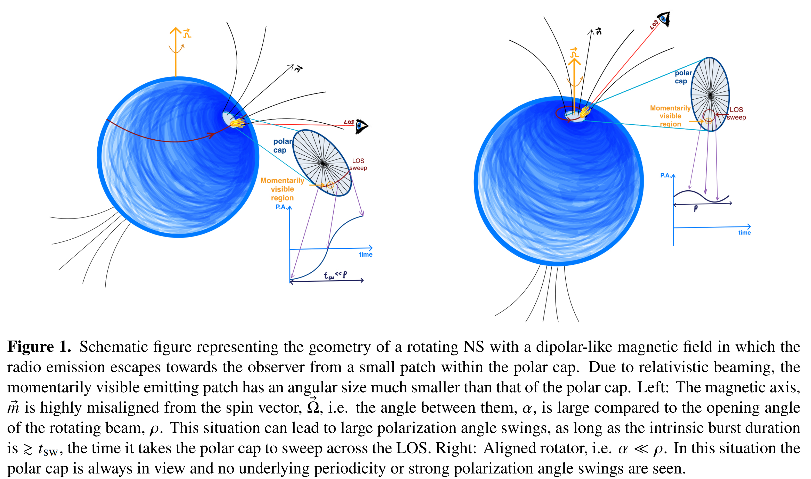

2. [Wideband Monitoring of FRB 180916.J0158+6 Across a Half-Decade Bandwidth Using the Upgraded GMRT](https://arxiv.org/abs/2409.20307)

   > Fast Radio Burst, Observation

   uGMRT对FRB180916的观测，在250-500MHz探测到4次爆发，在550-750MHz探测到4次爆发。

3. [TRAPUM pulsar and transient search in the Sextans A and B galaxies and discovery of background FRB 20210924D](https://arxiv.org/abs/2410.04658)

   > Fast Radio Burst, Survey, Observation

   `TRansients And PUlsars with MeerKAT, TRAPUM`对`Sextans A/B`星系进行了三次2小时的观测，没有发现脉冲星，看到一个FRB20210924D。

## 2024-10-29

1. [A parametric study of population inversions in relativistic plasmas through nonresonant interactions with Alfvén waves and their applications to Fast Radio Bursts](https://arxiv.org/abs/2410.21022)

   > Fast Radio Burst, Theory

   `Synchrotron maser`产生FRB需要`population inversion`，这里证明阿尔芬波和相对论性等离子体之间的非共振相互作用可以产生种群反转。该机制在靠近磁星光速圆柱面时可以产生GHz的FRB信号，并且该信号可以在没有明显阻尼的情况下逃离磁星环境。

2. [Generative Simulations of The Solar Corona Evolution With Denoising Diffusion : Proof of Concept](https://arxiv.org/abs/2410.20843)

   > Solar, Deep Learning

   用`DDPM`生成日冕的未来演变，代码在[这里](https://github.com/gfrancisco20/video_diffusion)。

   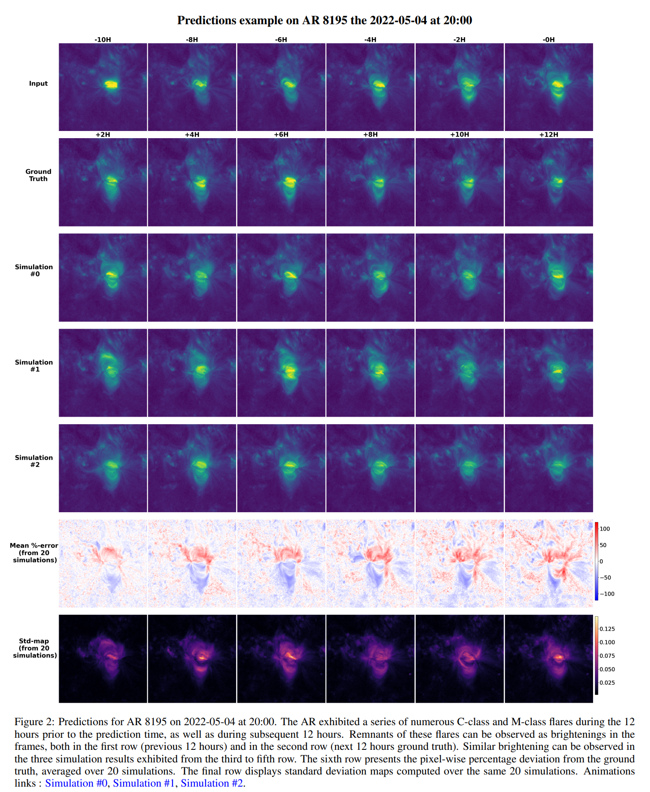

## 2024-10-30

1. [Semi-supervised Spectral Classification of DESI White Dwarfs by Dimensionality Reduction](https://arxiv.org/abs/2410.22221)

   > Stellar, White Dwarf, Machine Learning

   用tSNE对DESI EDR的白矮星光谱进行降维，识别具有氦特征的白矮星和灾变变星。

   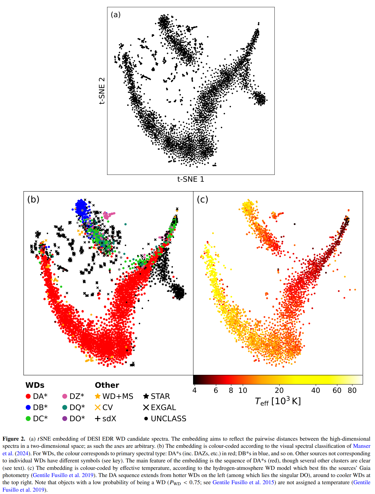

## 2024-10-31

1. [frb-voe: A Real-time Virtual Observatory Event Alert Service for Fast Radio Bursts](https://arxiv.org/abs/2410.22468)

   > Fast Radio Burst, Software

    介绍`frb-voe`，是一个使射电天文台通过低延迟虚拟天文台事件广播的软件。CHIME现在用的就是它，还可以提交到TNS上。

   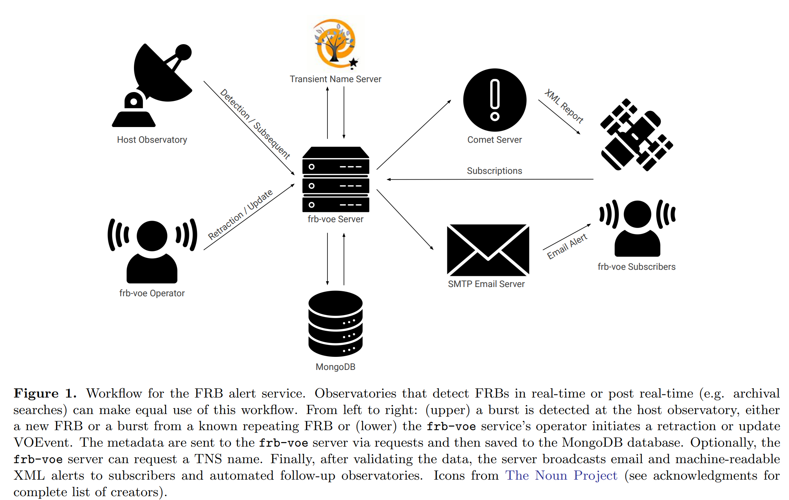

2. [Performance of the Segment Anything Model in Various RFI/Events Detection in Radio Astronomy](https://arxiv.org/abs/2410.22497)

   > Radio, Astronomy, RFI

   使用[HQ-SAM](https://github.com/SysCV/sam-hq)分割射电图像中的射频干扰和太阳射电暴。`HQ-SAM`表现由于原始的`SAM`，在RFI检测上优于`SumThreshold`。

   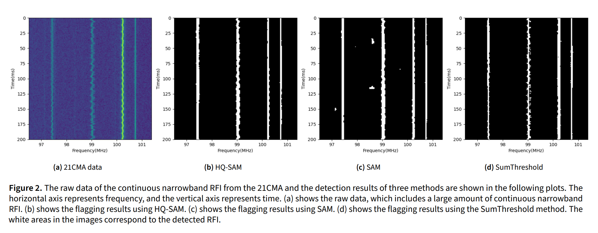

   也可以找`II/III`类太阳射电暴。

   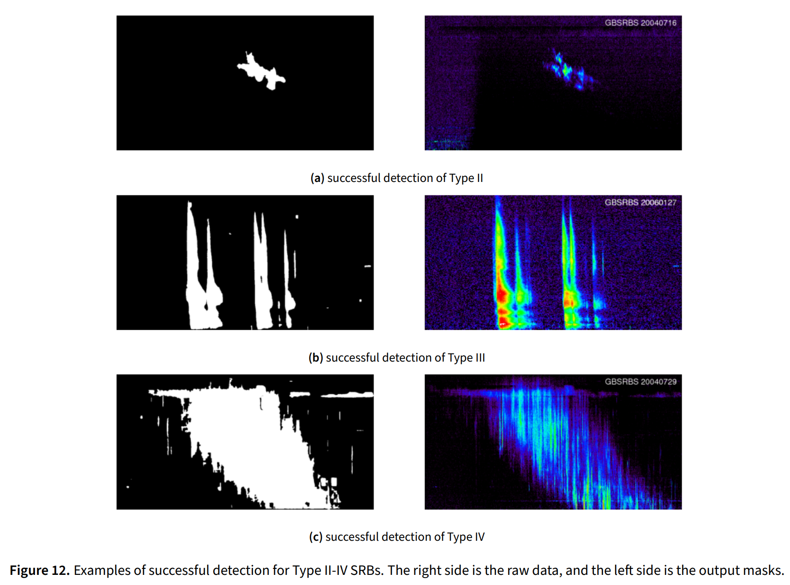

