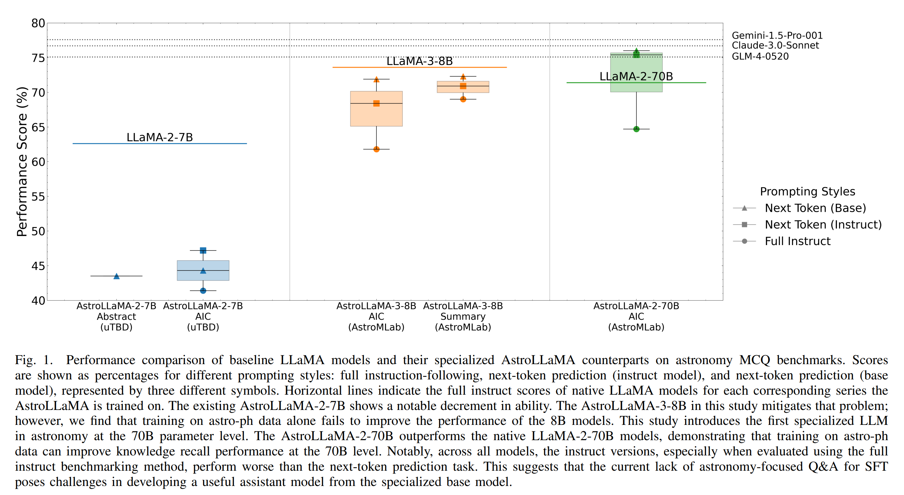
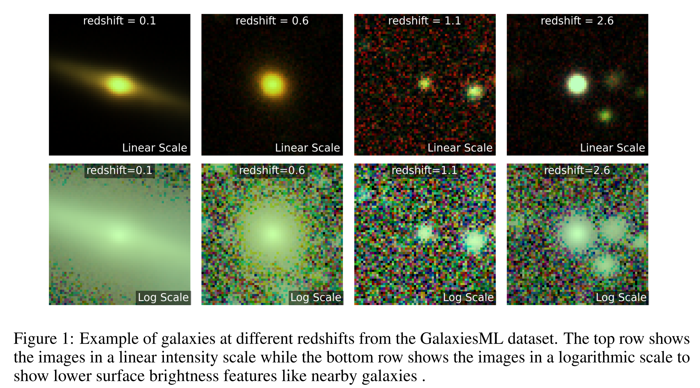
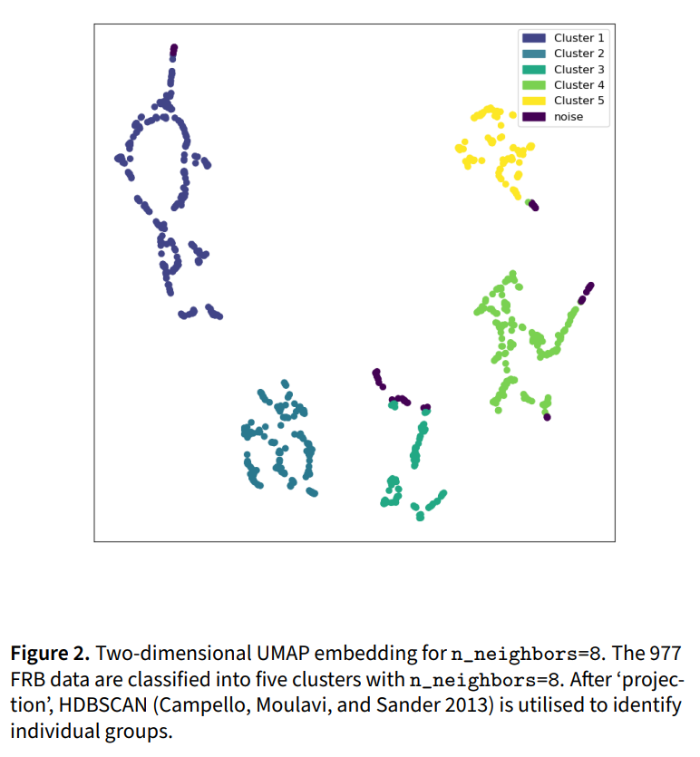
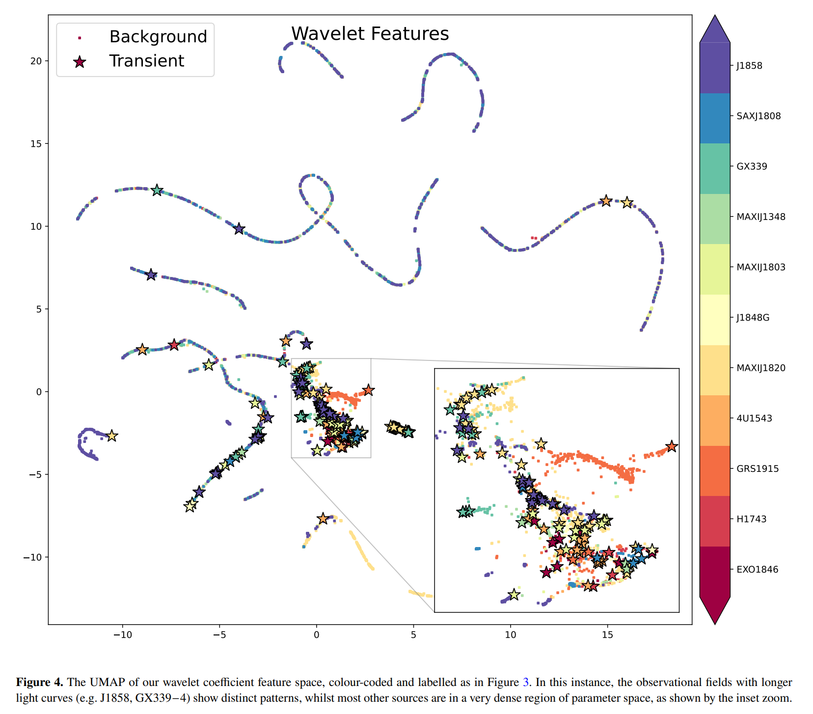
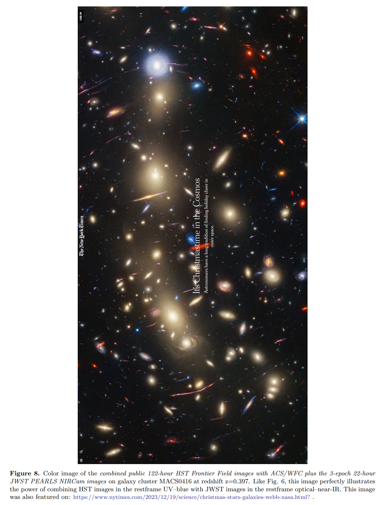
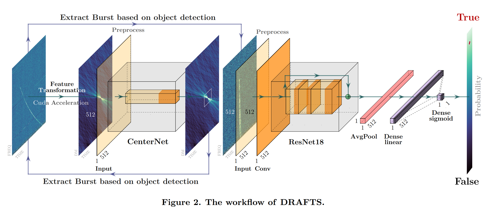

## 2024-10-01

1. [Predicting the rate of fast radio bursts in globular clusters from binary black hole observations](https://arxiv.org/abs/2409.20564)

   > Fast Radio Burst, Theory

   球状星团中可能产生双白矮星并合以及双黑洞并合，前者的发生率与后者相关。双白矮星的并和率随着红移的增加而降低，与最近测量到的FRB事件率与红移的函数关系类似。

2. [The Einstein Probe transient EP240414a: Linking Fast X-ray Transients, Gamma-ray Bursts and Luminous Fast Blue Optical Transients](https://arxiv.org/abs/2409.19056)

   > High Energy, Observation, Multi Wavelength

   过去几十年探测到越来越多的`Fast X-ray Transient`，但起源是个谜。

   EP探测到`EP240414a`，这里报告它的光学波段对应体，光学光曲线显示至少有三次不同的发射事件，时间尺度分别为1、4和15天，峰值绝对星等分别为-20、-21和-19.5。早期的光学光谱极蓝，与余辉发射不符。可能是喷流和超新星冲击波与恒星包膜和致密的星周介质相互作用的结果。

3. [The Radio Counterpart to the Fast X-ray Transient EP240414a](https://arxiv.org/abs/2409.19055)

   > High Energy, Observation, Multi Wavelength

   EP探测到`EP240414a`，这里报告它的射电波段对应体，3GHz的射电辐射在爆炸后30天达到峰值，光谱光度为$2\times10^{30}\,\rm ergs^{-1}Hz^{-1}$，需要一个至少具有中等体积洛伦兹因子（$\Gamma≳1.6$）、最小能量为$∼10^{48}\,\rm erg$的外流。

4. [AstroMLab 2: AstroLLaMA-2-70B Model and Benchmarking Specialised LLMs for Astronomy](https://arxiv.org/abs/2409.19750)

   > Astronomy, LLM

   在`LLaMA-2-7B`的基础上微调的`AstroLLaMA`在天文领域的性能甚至不如基础模型。如果在arXiv的摘要上继续训练基础模型，可以部分缓解性能下降的问题，但是与模型大小相关，小模型会发生灾难性遗忘，70B的模型继续训练可以产生改进。新训练了[AstroLLAMA-3-8B/-2-70B](https://huggingface.co/AstroMLab)。

   

5. [Gravitational Wave Astronomy With TianQin](https://arxiv.org/abs/2409.19665)

   > Gravitational Wave, White Paper

   天琴白皮书。天琴计划由三个卫星组成，将在约105公里的高度轨道上运行，形成等边三角形，将观测从恒星双星到星系和大尺度结构的引力波信号。

   天琴能够探测的引力波源包括恒星双星、超大质量黑洞（MBHs）的并合、以及早期宇宙事件。

   1. **恒星物理**：
      - 讨论了双星演化、恒星团动力学、以及围绕旋转超大质量黑洞的双星动力学。
   2. **超大质量黑洞的诞生和成长**：
      - 探讨了超大质量黑洞的种子形成、宇宙学演化、以及多信使探测。
   3. **超大质量黑洞周围的源**：
      - 讨论了轻IMRIs（中等质量比螺旋）的探测、环境效应、多信使探测。

## 2024-10-02

1. [GalaxiesML: a dataset of galaxy images, photometry, redshifts, and structural parameters for machine learning](https://arxiv.org/abs/2410.00271)

   > Galaxy, Machine Learning, Dataset

   构建了用于星系机器学习的数据集，包含了286,401个星系的图像、光度测量和光谱红移。数据在[GalaxiesML](https://doi.org/10.5281/zenodo.11117528)，代码在[galaxiesml_examples](https://github.com/astrodatalab/galaxiesml_examples)。

   

2. [Revisiting the Mysterious Origin of FRB 20121102A with Machine-learning Classification](https://arxiv.org/abs/2410.00576)

   > Fast Radio Burst, Statistics, Machine Learning

   用UMAP对Arecibo探测到的FRB121102的977个爆发进行降维，用到的数据包括`amplitude, linear temporal drift, time duration, central frequency, bandwidth, scaled energy, and fluence`，发现这些爆发成团。

   

## 2024-10-03

1. [Finding radio transients with anomaly detection and active learning based on volunteer classifications](https://arxiv.org/abs/2410.01034)

   > Transient, Machine Learning, Anomaly Detection

   使用MeerKAT收集的500张图像，覆盖11个天区，提取其中的X射线双星系统的光变曲线。然后使用三种特征对光变曲线进行特征提取，使用局部异常因子（LOF）和孤立森林（IF）进行异常值检验。

   发现`feets`和`wavelet`特征在异常检测中表现得更好，使用主动学习（标记一小部分，让机器学习模型学习，然后进行预测）可以减少标记数量。

   

2. [The Tale of Two Telescopes: How Hubble Uniquely Complements the James Webb Space Telescope: Galaxies](https://arxiv.org/abs/2410.01187)

   > Galaxy, Observation

   HST 可以独一无二地探测星系中年轻、炽热、大质量的恒星（未被遮挡），而 JWST 则可以揭示较老恒星群的更晚期阶段，以及星系在激烈的恒星形成过程中产生和脱落大量尘埃的相对短暂阶段，以及 HST 无法进入的超高红移宇宙（z≳10-11）。

   

## 2024-10-04

1. [Fast Radio Bursts as probes of the late-time universe: a new insight on the Hubble tension](https://arxiv.org/abs/2410.01974)

   > Fast Radio Burst, Cosmology

   根据不同望远镜观测到的64个河外FRB样本，采用不同的似然函数，估计哈勃常数，发现FRB示踪的是宇宙晚期的哈勃常数。与之前的工作相比，这里的误差范围更小，且推导出的哈勃常数的$1\sigma$误差范围与早期宇宙（CMB）测量的结果不再重叠，说明Hubble Tension确实存在。

2. [Multi-wavelength and Multi-messenger Counterparts of Fast Radio Bursts](https://arxiv.org/abs/2410.02216)

   > Fast Radio Burst, Theory, Review, Multi Wavelength

   回顾FRB相关的可能的多波段信号探测。

## 2024-10-07

1. [DRAFTS: A Deep Learning-Based Radio Fast Transient Search Pipeline](https://arxiv.org/abs/2410.03200)

   > Fast Radio Burst, Search, Software

   我的文章，讲FRB搜索。

   

2. [Identifying the Origin of FRB-associated X-ray Bursts with X-ray Polarization](https://arxiv.org/abs/2410.03167)

   > Fast Radio Burst, Theory, High Energy, Polarization

   SGR1935发出的那次FRB有对应的X射线暴，有几种可能的模型

   - emission of a trapped fireball modified by resonant cyclotron scattering
   - outflow from a polar trapped-expanding fireball
   - synchrotron radiation of a far-away relativistic shock

   这里认为，这三种模型预测的X射线暴的偏振模式不同。

3. [The Kinematics of 30 Milky Way Globular Clusters and the Multiple Stellar Populations within](https://arxiv.org/abs/2410.02855)

   > Stellar, Cluster, Kinematics

   使用HST和Gaia的自行数据，研究银河系内球状星团的运动学。根据恒星相对星团中心的径向切向速度随位置角的变化来测量三维旋转。

   在21个球状星团中发现了显著的旋转，不同恒星族群之间的旋转幅度没有显著差异。星团的三维旋转幅度与其质量、弛豫时间、富星分数和浓度强相关。

## 2024-10-08

1. [Measuring Hubble constant using localized and unlocalized fast radio bursts](https://arxiv.org/abs/2410.03994)

   > Fast Radio Burst, Cosmology

   用IllustrisTNG模拟的host和IGM的DM概率分布，在69个定位的FRB上约束哈勃常数为$H_0=70.41^{+2.28}_{-2.34}\,\rm km/s/Mpc$，介于CMB和超新星测量的中间。使用CHIME未定位的527个FRB测量的H0在69附近。500个定位的FRB会将统计误差降低到1%，但在测量时，系统误差占主导。

2. [Fast Radio Bursts with Narrow Beaming Angles Can Escape from Magnetar Magnetospheres](https://arxiv.org/abs/2410.04065)

   > Fast Radio Burst, Theory

   如果FRB起源于磁星磁层，磁层中的正负电子对会散射FRB，使FRB难以逃离。这里认为，如果FRB传播方向和背景磁场之间的夹角小于$10^{-2}\,\rm rad$，散射效应大大减弱，使FRB可以发射出来。

## 2024-10-09

