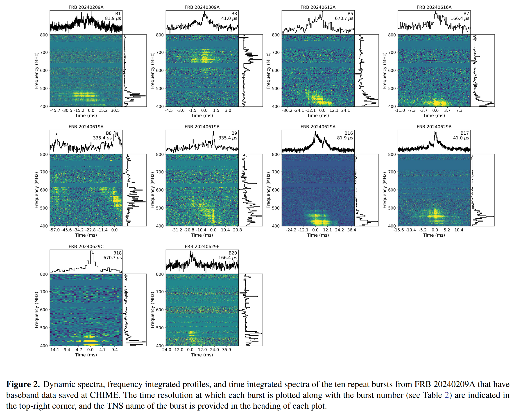
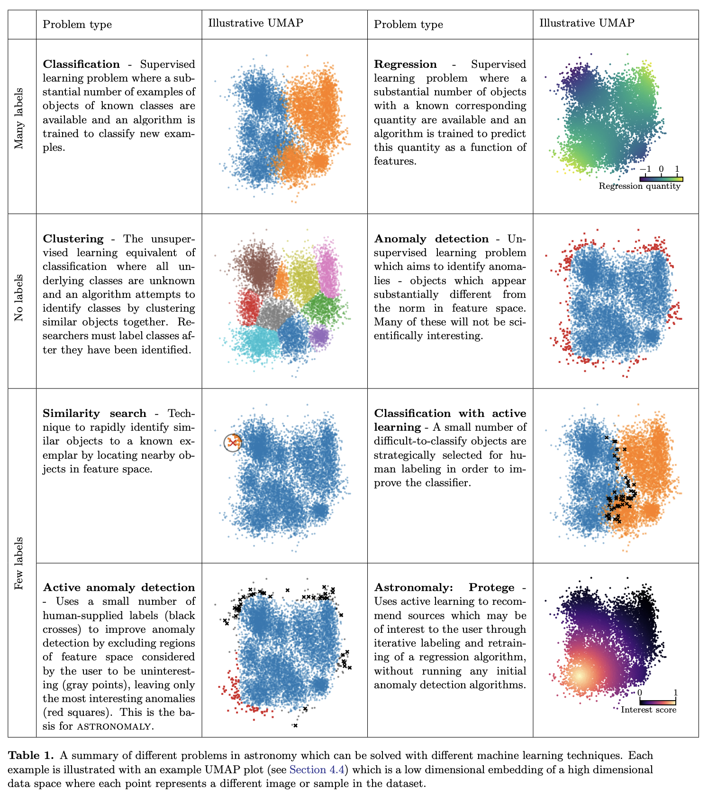

## 2024-11-01

1. [A repeating fast radio burst source in the outskirts of a quiescent galaxy](https://arxiv.org/abs/2410.23374)

   > Fast Radio Burst, Observation

   CHIME找到新的重复FRB20240209A，在2024年2月到7月探测到22次爆发，6次被`Outrigger`记录到。66公里的基线定位单脉冲到$\rm Ra=19h19m33s,\ Dec=+86d03m52s$，误差1x2角秒。

   

   Gemini的光学观测发现这个位置旁边有个大星系，FRB偏离星系中心$40\pm5\,\rm kpc$，是迄今为止宿主星系偏移量最大的FRB。如果按照宿主星系大小进行归一化，这个偏离与FRB20200120E相当。考虑了几种偏移大的原因，包括FRB被踢出宿主星系或者FRB形成于低亮度卫星星系，发现最合理的情况就是起源于球状星团。

2. [The Massive and Quiescent Elliptical Host Galaxy of the Repeating Fast Radio Burst FRB20240209A](https://arxiv.org/abs/2410.23336)

   > Fast Radio Burst, Galaxy, Observation

   对FRB20240209A的宿主星系Keck和Gemini的数据分析。红移在$z=0.1384\pm0.0004$，恒星质量$\log(M_*/M_\odot)=11.34\pm0.01$，恒星群年龄$11\,\rm Gyr$，这是迄今为止发现的质量最大、年龄最大的FRB宿主，是个椭圆星系，没有恒星形成。

   

   这样的星系环境类似短时伽马射线暴、Ia型超新星和超亮X射线源。宿主星系的特征加上FRB与星系的巨大偏移，得出结论FRB20240209A可能来双中子星/白矮星合并、白矮星吸积引起的坍缩而形成的磁星、一个高亮度的 X 射线双星。

3. [Cosmology with Fast Radio Bursts](https://arxiv.org/abs/2410.24072)

   > Fast Radio Burst, Cosmology, Review

   介绍各种宇宙学问题，以及快速射电暴研究如何约束宇宙学参数，以及了解重子在整个宇宙中的分布。

## 2024-11-04

1. [TOPO: Time-Ordered Provable Outputs](https://arxiv.org/abs/2411.00072)

   > Astronomy, Software

   [TOPO](https://github.com/santiagocasas/topo-cobaya)是`Time-Ordered Provable Outputs`，使用`deterministic hashing`生成输出的唯一数字指纹，并使用`Merkle Trees`以时间顺序的方式存储输出。旨在提高天体物理研究中的再现性和数据完整性的工具，为数据分析盲化提供了一种无需信任的替代方案。

   使用`TOPO-cobaya`演示了TOPO在宇宙学的实用性，展示了如何将盲化和验证无缝集成到MCMC计算中，从而使该过程在密码上可证明。该方法解决了可重复性危机中的紧迫挑战，并为天体物理数据分析提供了一个强大的、可验证的框架。

## 2024-11-05

1. [Separating repeating fast radio bursts using the minimum spanning tree as an unsupervised methodology](https://arxiv.org/abs/2411.02216)

   > Fast Radio Burst, Machine Learning, Classification

   用`Minimum Spanning Tree`根据FRB的参数区分重复FRB和非重复FRB。

2. [Constraining the Hubble constant with scattering in host galaxies of fast radio bursts](https://arxiv.org/abs/2411.02249)

   > Fast Radio Burst, Cosmology

   根据FRB的散射约束宿主星系的DM贡献，进一步提升使用DM估计哈勃常数的精度，最后得到结果是$H_0=74^{+7.5}_{-7.2}\,\rm km/s/Mpc$，中心值与近邻宇宙测量一致，与CMB不太一致。

## 2024-11-06

1. [Combining strongly lensed and unlensed fast radio bursts: to be a more precise late-universe probe](https://arxiv.org/abs/2411.03126)

   > Fast Radio Burst, Cosmology

   使用透镜FRB限制哈勃常数和暗能量状态方程。

2. [Morphology of 32 Repeating Fast Radio Burst Sources at Microsecond Time Scales with CHIME/FRB](https://arxiv.org/abs/2411.02870)

   > Fast Radio Burst, Statistics, Morphology

   对CHIME/FRB基带数据的32个爆发进行了形态分析。没有发现流量、色散、事件率和爆发持续时间之间有任何的相关性。发现重复FRB比非重复FRB带宽窄且持续时间长，与之前的结果一致。另外发现，重复/非重复FRB根据爆发持续时间归一化后，sub-burst的宽度是一致的，可能表明相同的辐射机制。

   

3. [Accelerating FRB Search: Dataset and Methods](https://arxiv.org/abs/2411.02859)

   > Fast Radio Burst, Software

   之江的文章，斜线检测找FRB。

4. [Dispersion Measures of Fast Radio Bursts through the Epoch of Reionization](https://arxiv.org/abs/2411.02699)

   > Fast Radio Burst, Cosmology

   基于星系形成和再电离的大规模辐射-流体动力学模拟，预测FRB的DM随红一的变化，发现DM的均值和标准差随着红移的增加而增加。

## 2024-11-07

1. [Neural Network Prediction of Strong Lensing Systems with Domain Adaptation and Uncertainty Quantification](https://arxiv.org/abs/2411.03334)

   > Gravitational Lensing, Deep Learning

   使用` Mean-variance Estimators`和`unsupervised domain adaptation`结合，预测透镜参数并获得不确定性。

## 2024-11-08

1. [Astronomaly Protege: Discovery Through Human-Machine Collaboration](https://arxiv.org/abs/2411.04188)

   > Astronomy, Machine Learning, Anomaly Detection

   在[Astronomaly](https://github.com/MichelleLochner/astronomaly)基础上扩展了`Protege`，基于少量优化的人类标签，使用自监督深度学习方法`Bootstrap Your Own Latent`来找到射电星系的低维表示，在这个特征空间中找不同形态的源，异常形态的png在[这里](https://github.com/MichelleLochner/mgcls.protege)。

   

## 2024-11-11

1. [The Spider Stellar Engine: a Fully Steerable Extraterrestrial Design?](https://arxiv.org/abs/2411.05038)

   > SETI, Astronomy, Pulsar

   当一个文明的恒星耗尽能量时，文明不可避免地要迁移到附近的恒星。这里研究了使用Spider Pulsar作为恒星发动机，捕获附近的恒星，并在捕获后喷射其耗尽的伴星，从而实现星际旅行。

## 2024-11-12

1. [Flaring gamma-ray emission coincident with a hyperactive fast radio burst source](https://arxiv.org/abs/2411.06996)

   > Fast Radio Burst, High Energy

   余文飞的文章。从Fermi望远镜中探测到FRB20240114A的GRB。

   

2. [A method based on Generative Adversarial Networks for disentangling physical and chemical properties of stars in astronomical spectra](https://arxiv.org/abs/2411.05960)

   > Stellar, Spectrum, Deep Learning

   [GANDALF](https://github.com/raul-santovena/gandalf)用`encoder-decoder`结构提取APOGEE和Gaia光谱的特征，从潜空间中提取物理参数。

## 2024-11-13

1. [Physics of radio antennas](https://arxiv.org/abs/2411.07507)

   > Radio, Telescope

   讨论半波偶极子的电磁学数理基础。

## 2024-11-14

1. [Application of Machine Learning Methods for Detecting Atypical Structures in Astronomical Maps](https://arxiv.org/abs/2411.08079)

   > Astronomy, Machine Learning

   在宇宙微波背景辐射图上找非典型异常结构。

## 2024-11-15

1. [AstroMLab 3: Achieving GPT-4o Level Performance in Astronomy with a Specialized 8B-Parameter Large Language Model](https://arxiv.org/abs/2411.09012)

   > Astronomy, LLM

   [AstroSage-Llama-3.1-8B](https://huggingface.co/AstroMLab/AstroSage-8B)使用2007-2024年间天文相关的arxiv文章，以及数百万个合成问答，基于Llama-3.1 8B模型进行训练，在 AstroMLab-1 基准测试中，AstroSage-Llama-3.1-8B 的得分率高达 80.9%。

   

2. [Polarization properties of 28 repeating fast radio burst sources with CHIME/FRB](https://arxiv.org/abs/2411.09045)

   > Fast Radio Burst, Polarization, Observation

   报告CHIME探测到的20个重复暴的RM测量。发现重复FRB可以分为两类，一类是RM变化，一类RM不变。

   其中FRB20180916B的RM，先平稳的随机变化、再线性变化、再平稳的随机变化。FRB20190303A和FRB20190929C的RM符号变化。

   对重复和非重复FRB的偏振对比，发现`电子密度加权的视线方向磁场`可以略微区分两种FRB。

   

3. [Fast Radio Bursts and Interstellar Objects](https://arxiv.org/abs/2411.09135)

   > Fast Radio Burst, Theory

   认为星际天体`interstellar objects, ISO`与中子星的碰撞是FRB产生的源头。ISO-中子星的碰撞率与FRB事件率相当，FRB持续时间与ISO的大小一致，FRB的能量分布与观测到的太阳系星体的大小分布一致。

4. [Reinvestigation of Fast Radio Bursts Host Galaxy and Event Rate Density](https://arxiv.org/abs/2411.09203)

   > Fast Radio Burst, Statistics

   统计重复和非重复FRB的宿主星系DM贡献，没发现区别。

## 2024-11-18

1. [The Last Arecibo Message](https://arxiv.org/abs/2411.09790)

   > Astronomy

   阿雷西博信息是 1974 年 11 月 16 日从阿雷西博天文台向太空发送的简短二进制编码通信，旨在展示人类的技术实力。

   2018 年底，为纪念这一信息发布 45 周年，阿雷西博天文台发起了 “新阿雷西博信息 ”竞赛。经过一系列挑战，我们的 Boriken Voyagers 团队于 2020 年 8 月被评为竞赛优胜者。本文介绍了最初为阿雷西博望远镜开发的 “最后的阿雷西博信息”。如果说最初的信息是 “我们是一种生命形式，伸出手来建立联系”，那么我们的信息则是 “我们已经准备好共同探索宇宙”。

   

## 2024-11-19

1. [An Extreme Stellar Prominence Eruption Observed by LAMOST Time-Domain Spectroscopy](https://arxiv.org/abs/2411.11076)

   > Stellar, Burst, Spectral

   LAMOST看到M矮星`LAMOST J044431.62+235627.9`上的一次极端恒星爆发，伴随着一次持续时间超过 160.4 分钟的超级辉光。在耀斑峰值附近，$H\alpha$线表现出明显的蓝端增强。

   

## 2024-11-20

1. [DESI 2024 VII: Cosmological Constraints from the Full-Shape Modeling of Clustering Measurements](https://arxiv.org/abs/2411.12022)

   > Cosmology, DESI

   DESI第一年测量的宇宙学结果。

## 2024-11-21

1. [HiFAST: An HI Data Calibration and Imaging Pipeline for FAST III. Standing Wave Removal](https://arxiv.org/abs/2411.13016)

   > HI, RFI

   用FFT去除FAST观测数据中的驻波。

## 2024-11-22

1. [Unsupervised Machine Learning for Classifying CHIME Fast Radio Bursts and Investigating Empirical Relations](https://arxiv.org/abs/2411.14040)

   > Fast Radio Burst, Statistics, Machine Learning

   用UMAP、k-means和HDBSCAN从CHIME的FRB参数表中对重复/非重复FRB进行聚类，发现一些不明显的相关关系，比如散射时标-脉冲宽度，散射时标-亮温度之间可能存在相关关系。

   

2. [3D Localization of FRB 20190425A for Its Potential Host Galaxy and Implications](https://arxiv.org/abs/2411.13973)

   > Fast Radio Burst, Localization

   定义了`Trigger-Magnitude-Distance`来从CHIME观测到的FRB的位置估计其宿主星系。

   

## 2024-11-25

1. [Unusual intra-burst variations of polarization states in FRB 20210912A and FRB 20230708A : Effects of plasma birefringence?](https://arxiv.org/abs/2411.14784)

   > Fast Radio Burst, Polarization

   ASKAP探测到两个非重复FRB20230708A和20210912A，表现出线偏振和圆偏振随时间的变化，以及RM值在爆发之间的变化。

   

## 2024-11-26

1. [A 44-minute periodic radio transient in a supernova remnant](https://arxiv.org/abs/2411.15739)

   > Transient, White Dwarf Pulsar

   DART探测到周期44分钟的变源。

   

2. [Detection of X-ray Emission from a Bright Long-Period Radio Transient](https://arxiv.org/abs/2411.16606)

   > Transient, White Dwarf Pulsar, High Energy

   ASKAP探测到跟DRAT相同的变源，同时还观测到X射线的辐射，认为是磁星或者是白矮星。

   

3. [Structure Functions of Rotation Measures Revealing the Origin of Fast Radio Bursts](https://arxiv.org/abs/2411.15546)

   > Fast Radio Burst, Period

   从FRB的RM结构函数里找周期，南大那些人的文章。

   

4. [Long term monitoring of FRB~20121102 with the Nançay Radio Telescope and multi-wavelength campaigns including INTEGRAL](https://arxiv.org/abs/2411.16419)

   > Fast Radio Burst, Observation

   对FRB121102的长期观测，使用`INTEGRAL`没探测到的Gamma-Ray的辐射，给了个上限。报告NRT在2016-2020年间探测到的119个爆发。

5. [Minimum Entropy Indicator for Evaluating Dispersion Measure](https://arxiv.org/abs/2411.16023)

   > Radio, Dispersion Measure

   用脉冲轮廓的熵最小时找正确的DM。

6. [The FAST Galactic Plane Pulsar Snapshot survey: VI. The discovery of 473 new pulsars](https://arxiv.org/abs/2411.15961)

   > Pulsar, Catalog

   GPPS探测到的脉冲星表。

7. [Anomaly Detection and RFI Classification with Unsupervised Learning in Narrowband Radio Technosignature Searches](https://arxiv.org/abs/2411.16556)

   > SETI, Machine Learning

   用HDBSCAN降低找SETI信号的误报率。

## 2024-11-27

1. [An analytical model for the dispersion measure of Fast Radio Burst host galaxies](https://arxiv.org/abs/2411.17682)

   > Fast Radio Burst, Cosmology

   扩展了`baryonification (BCM)`方法，估计FRB宿主星系的DM贡献。

## 2024-11-28

1. [A VLBI Calibration System with Real-time Pulsar Gating for FRB Localization using CHIME/FRB Outriggers](https://arxiv.org/abs/2411.17801)

   > Fast Radio Burst, Localization, Method

   用100个脉冲星做校准源，用于CHIME/FRB Outrigger的各个望远镜精确定位FRB，可以做到50mas的定位精度。

2. [Timing analysis of rotating radio transients discovered with MeerKAT](https://arxiv.org/abs/2411.18149)

   > Transient, Timming

   对MeerKAT探测到的4个RRAT做计时。由于RRATs的脉冲到达时间非常稀疏，对其进行时间分析比常规脉冲星更为困难，目前只有少数RRATs具有连贯的时间解决方案。

   使用DSPSR消色散，使用[clfd](https://github.com/v-morello/clfd)消RFI，并使用TEMPO2拟合时间模型。对于没有现有时间模型的源，使用[RRATsoLve](https://github.com/v-morello/rratsolve)暴力算法确定周期。

3. [Leveraging Transfer Learning for Astronomical Image Analysis](https://arxiv.org/abs/2411.18206)

   > Astronomy, Deep Learning, Anomaly Detection

   用在ImageNet上预训练好的EfficientNet对天文图像进行特征提取，在特征空间中找相似的图像和不同的图像。可以用于AGN检测、星系属性估计、强引力透镜检测、时间序列异常检测、以及大规模异常检测。

   

4. [Learning the Evolution of Physical Structure of Galaxies via Diffusion Models](https://arxiv.org/abs/2411.18440)

   > Galaxy, Redshift, Deep Learning

   研究如何利用红移（redshift）条件化的去噪扩散概率模型（DDPM）生成星系图像，并验证这些模型是否能够准确捕捉星系的物理特性。

   利用U-Net架构的时间步长来学习条件分布$p(X_z|z)$。模型从带有高斯噪声的初始星系图像开始，通过迭代去噪过程生成清晰的星系图像。

5. [Variability of hot sub-luminous stars and binaries: Machine learning analysis of Gaia DR3 multi-epoch photometry](https://arxiv.org/abs/2411.18609)

   > Stellar, Variable, Machine Learning

   用Lomb-Scargle周期图和Lafler-Kinman统计量等方法，提取了恒星光变曲线的84个特征。使用UMAP和t-SNE对特征降维，使用GMM聚类，识别出三个团体`具有显著变异性的热亚矮星`、`非变星`和`激变变星`。

   

   
