## 2024-12-02

1. [Polarization Calibration of the FAST L-band 19-beam Receiver: I. On-axis Mueller Matrix Parameters](https://arxiv.org/abs/2411.18763)

   > Radio, Instrument, Polarization

   庆道冲的文章，测量FAST的19波束接收机的Mueller矩阵的参数，用来做偏振定标。

   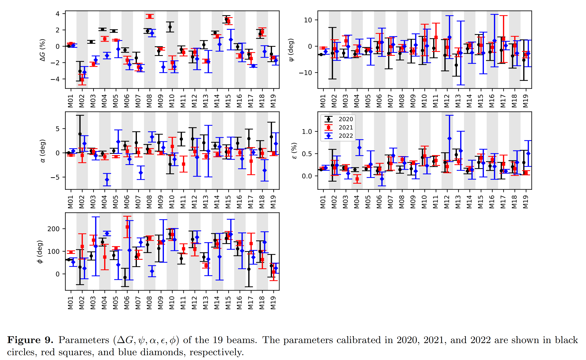

2. [Polarization Calibration of the FAST L-band 19-beam Receiver: II. Beam Measurements of Full Stokes Parameters](https://arxiv.org/abs/2411.18865)

   > Radio, Instrument, Polarization

   陈训舟的文章，测量FAST的19波束的波束响应。

   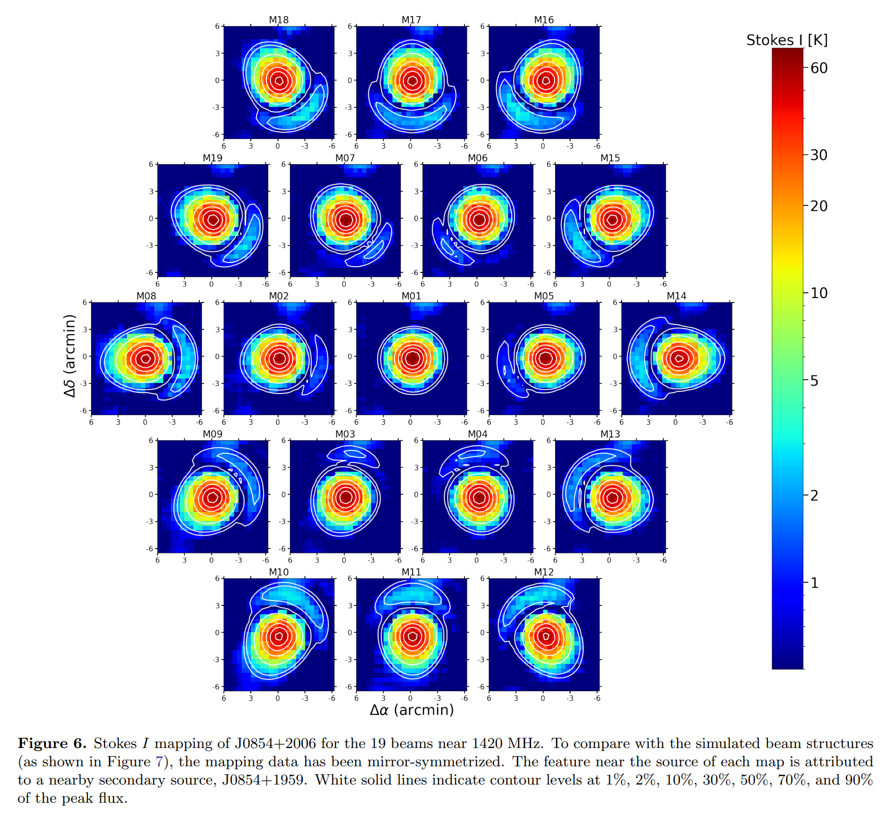

3. [Bayesian Deconvolution of Astronomical Images with Diffusion Models: Quantifying Prior-Driven Features in Reconstructions](https://arxiv.org/abs/2411.19158)

   > Astronomy, Deep Learning

   [diffusion4astro](https://github.com/astrodeepnet/diffusion4astro)用扩散模型做天文图像反卷积。

   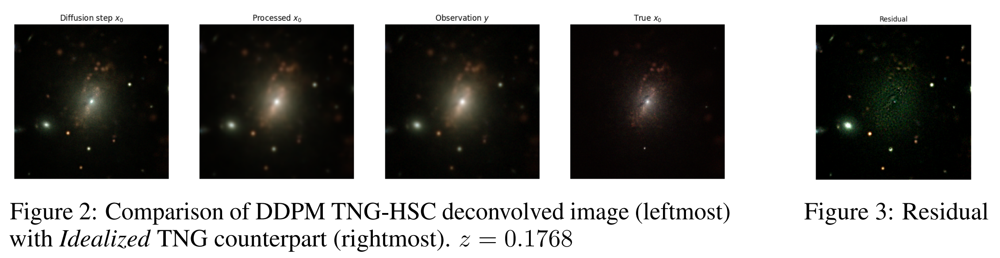

## 2024-12-03

1. [Strong gravitational lensing with upcoming wide-field radio surveys](https://arxiv.org/abs/2412.01746)

   > Radio, Gravitational Lensing, Prediction

   CLASS巡天发现，平均每个10,000个源中可能有几个被识别为强透镜。据此估计DSA-2000将发现约$5\times10^8$个外星系源，从而可能产生约$10^5$个新的星系尺度射电强透镜。

   在识别时，使用机器学习方法（如POLISH算法）进行图像重建，以识别低于点扩散函数（PSF）尺度的强透镜系统。

   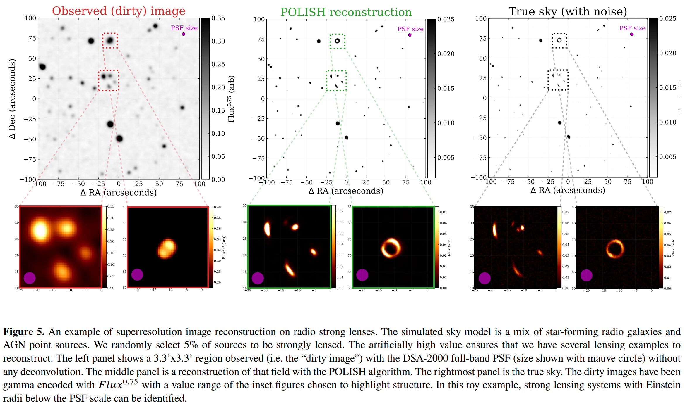

2. [Fast Radio Bursts and the radio perspective on multi-messenger gravitational lensing](https://arxiv.org/abs/2412.01536)

   > Fast Radio Burst, Gravitational Lensing, Review

   这篇综述概述了识别透镜FRB的要求，考虑了它们的传播效应以及捕捉信号振幅和相位的重要性。

   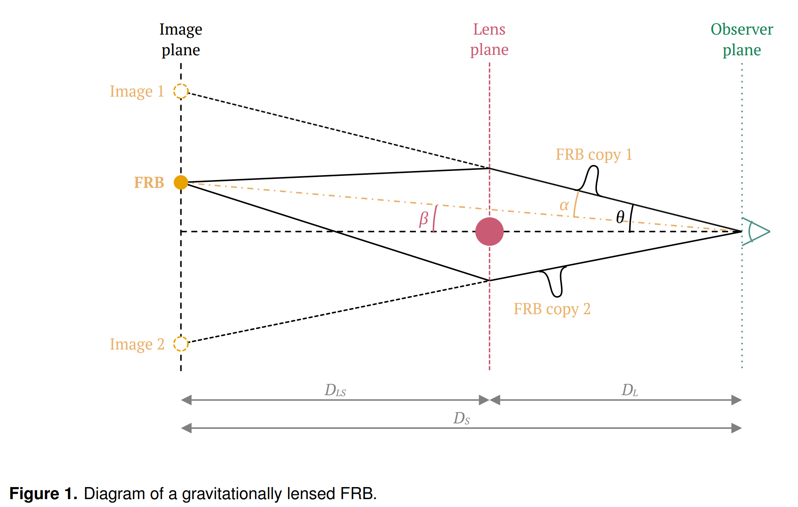

3. [Discovery of a PRS associated with FRB 20240114A](https://arxiv.org/abs/2412.01478)

   > Fast Radio Burst, Galaxy, PRS

   PRECISE在5GHz探测到FRB20240114A的PRS。

   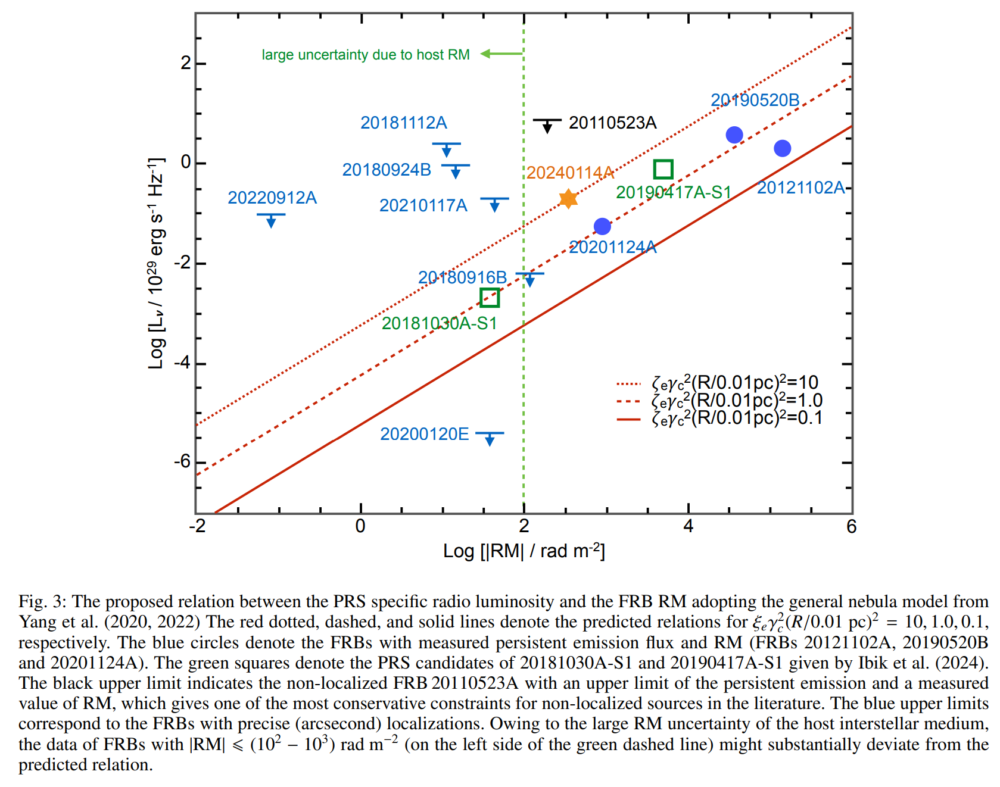

4. [Impact of propagation effects on the spectro-temporal properties of Fast Radio Bursts](https://arxiv.org/abs/2412.00232)

   > Fast Radio Burst, Theory

   强散射会影响FRB的光谱的斜率。

5. [The MeerKAT Pulsar Timing Array: The first search for gravitational waves with the MeerKAT radio telescope](https://arxiv.org/abs/2412.01153)

   > Gravitational Wave, Pulsar, PTA, MeerKAT

   MeerKAT的PTA测量引力波的结果，大概$3-3.4\sigma$。

   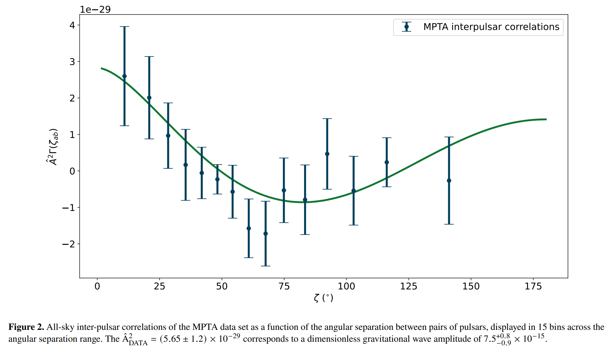

6. [Representation Learning for Time-Domain High-Energy Astrophysics: Discovery of Extragalactic Fast X-ray Transient XRT 200515](https://arxiv.org/abs/2412.01150)

   > High Energy, Transient, Machine Learning, Anomaly Detection

   在X射线数据上，重构为`E-t`和`E-t-dt`的数据，使用AutoEncoder提取特征，再使用DBSCAN找异常值，从而找新的暂现源。

   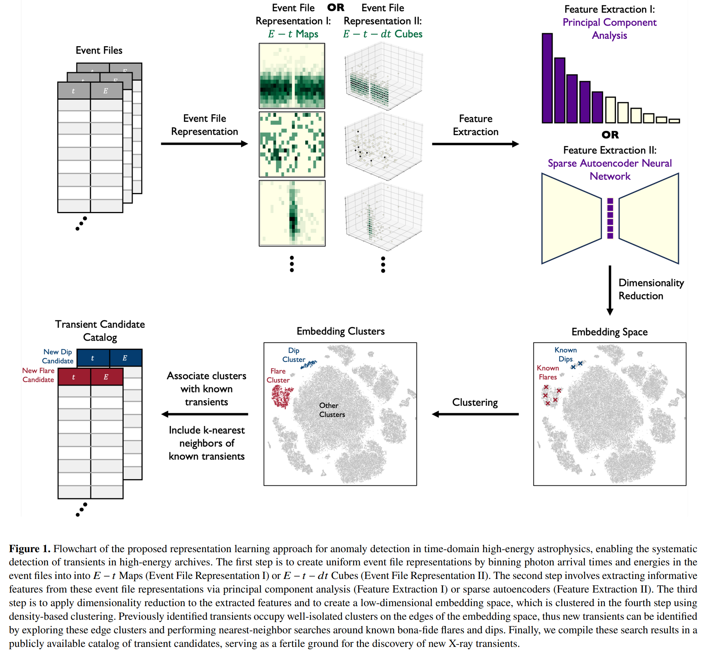

7. [MeerKAT discovery of GHz radio emission extending from Abell 3017 toward Abell 3016](https://arxiv.org/abs/2412.00204)

   > Galaxy, HI, Observation

   MeerKAT探测到星系团Abell 3017和2016之间有$0.1\mu Jy$的射电桥。

   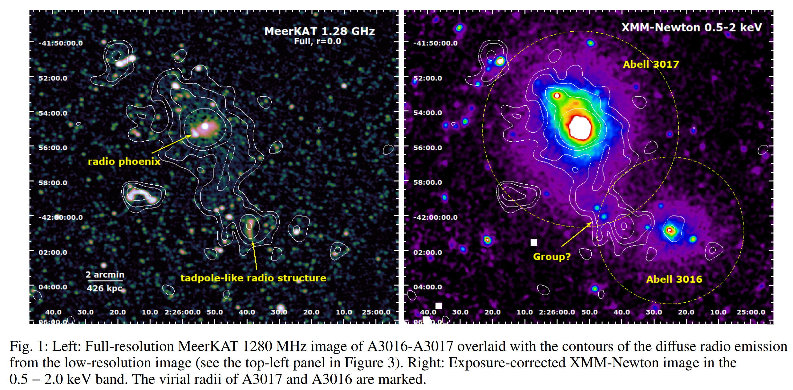

## 2024-12-04

1. [The classification of real and bogus transients using active learning and semi-supervised learning](https://arxiv.org/abs/2412.02409)

   > Transient, Deep Learning

   [RB-C1000](https://github.com/cherry0116/RB-C1000)在少量标注的情况下，加上主动学习和半监督学习，分辨光学暂现源。

   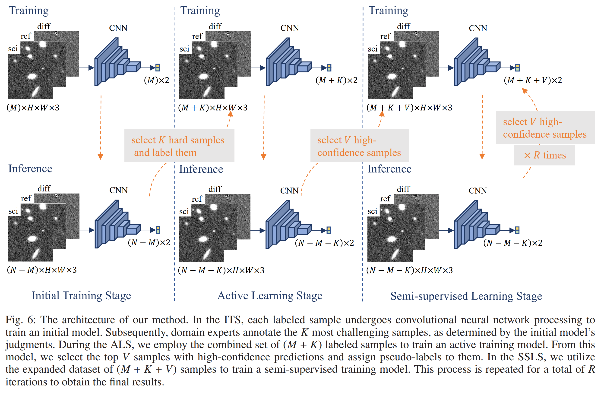

2. [The Multimodal Universe: Enabling Large-Scale Machine Learning with 100TB of Astronomical Scientific Data](https://arxiv.org/abs/2412.02527)

   > Astronomy, Deep Learning, LLM

   构建[Multimodal Universe](https://github.com/MultimodalUniverse/MultimodalUniverse)数据集，解决天文学数据整合和标准化的问题。

   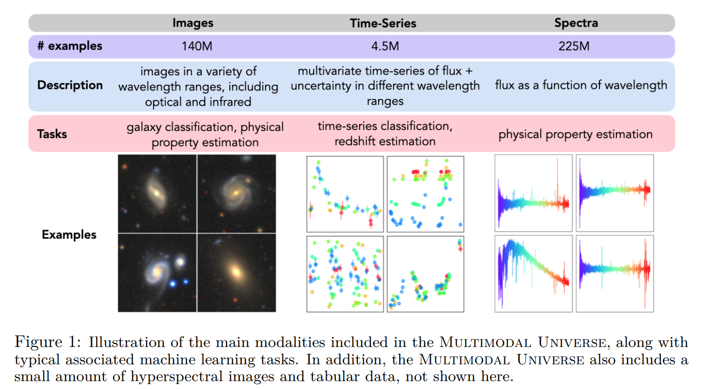

   MU包含了超过100TB的数据，主要包括88TB的多波段图像、光谱、多变量时间序列和科学测量数据。具体模态包括图像、光谱、高光谱图像时间序列和表格数据。

   - 图像数据来自Legacy Surveys DR10、Legacy Surveys North、HSC、BTS和JWST等巡天
   - 光谱数据来自Gaia BP/RP、SDSS-II、DESI、APOGEE、GALAH、VIPERS和Chandra等巡天
   - 高光谱图像时间序列数据来自MaNGA SDSS-IV、PLAsTiCC2、TESS、CfA样本、YSE、PS1 SNe Ia、DES Y3 SNe Ia、SNLS、Foundation、CSP和Swift SNe Ia等巡天
   - 表格数据来自Gaia、ProVABGS和Galaxy10 DECaLS等巡天

   实验任务包括星系形态分类、物理性质推断、PLAsTiCC光度分类和红移估计、YSE光度分类、BTSbot候选体识别、对比图像-光谱预训练和高光谱图像立方体到物理参数图像的推断等任务。

## 2024-12-05

1. [Universal Constants and Energy Integral in Self-Organized Criticality Systems](https://arxiv.org/abs/2412.03481)

   > Transient, SOC

   对于SOC系统，其flux的幂律指数应该是$\alpha_F=9/5=1.8$，fluence的幂律指数是$\alpha_E=5/3=1.67$。使用NASA天文数据库系统（ADS）搜索和识别相关关键词，从已发表的文献中提取了23种天体物理现象的观测数据。

   - 标准的 SOC 模型（能量分布的幂律斜率与1.67一致）——`太阳耀斑、恒星耀斑、日冕物质抛射（CME）、极光、耀斑、银河系快速射电暴（FRB）、活动星系核（AGN）、伽马射线暴（GRB）等、 伽马射线暴（GRB）、软伽马射线中继器（SGB）和黑洞系统（BH）`
   - 非标准的 SOC 模型（能量分布的幂律斜率偏离1.67）——`相干太阳射电暴、随机射电暴、太阳高能粒子（SEP）、宇宙射线和脉冲星闪烁`

## 2024-12-06

1. [Time-Frequency Correlation of Repeating Fast Radio Bursts: Correlated Aftershocks Tend to Exhibit Downward Frequency Drifts](https://arxiv.org/abs/2412.04313)

   > Fast Radio Burst, Statistics

   统计FAST观测的重复FRB爆发，两两之间的时间差和峰值频率的差。发现更短的时间间隔内峰值频率下降。

2. [Automated galaxy sizes in Euclid images using the Segment Anything Model](https://arxiv.org/abs/2412.03642)

   > Galaxy, Deep Learning

   用分割一切来测量Euclid观测到的星系的大小，SAM识别的星系大小与手动测量的结果相比，平均偏差约为3%，并且SAM在不同星系形态、红移和视大小下的性能相对稳定。

   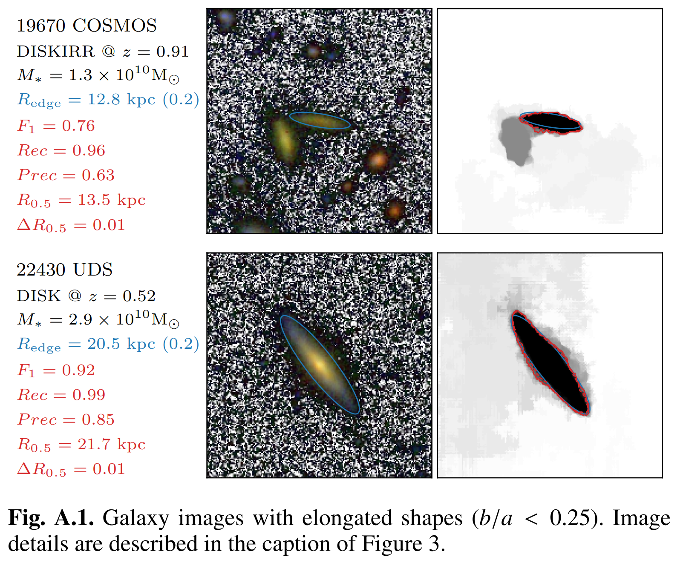

## 2024-12-09

1. [Prospects for Observing Astrophysical Transients with GeV Neutrinos](https://arxiv.org/abs/2412.05087)

   > Transient, High Energy

   研究了各种暂现源【包括经典新星、超新星、潮汐破坏事件（TDEs）、快速蓝光光学瞬变（FBOTs）、伽马射线暴（GRBs）和快速射电暴（FRBs）】产生的中微子的量，能否用现在的高能中微子探测器（比如iceCube）探测到。

   结果发现，所有暂现源产生的中微子的量都远低于探测阈值，在未来十年不太可能被探测到。

## 2024-12-10

1. [StarWhisper Telescope: Agent-Based Observation Assistant System to Approach AI Astrophysicist](https://arxiv.org/abs/2412.06412c)

   > Astronomy, LLM

   基于LLM的望远镜观测辅助系统。

   使用Qwen 2.5 instruct 14B作为LLM，结合Chain of Thought，通过工作流，输入观测目标，筛选出适合不同站点和望远镜的天体对象，考虑观测时间和季节等因素。通过UDP协议发送序列功能至N.I.N.A.，实现观测列表加载和自动观测控制。使用X-OPSTEP管道处理观测数据，包括图像预处理、星历解算、光度校准和图像减法等。

2. [Binary and Grouped Open Clusters: A New Catalogue](https://arxiv.org/abs/2412.05376)

   > Stellar, Cluster, Catalog

   使用`Hunt & Reffert (2023, 2024)`中的星团列表，结合潮汐力估计，识别双星系统和多星系统。

3. [A Novel Technosignature Search in the Breakthrough Listen Green Bank Telescope Archive](https://arxiv.org/abs/2412.05786)

   > Radio, SETI

   假设射电数据没有信号的地方是高斯的，有信号的地方偏离高斯。使用`Fisher kurtosis`来识别这些信号，从中找可能的SETI信号。

## 2024-12-11

1. [M dwarfs quasi-periodic pulsations at a time resolution of 1 s](https://arxiv.org/abs/2412.07580)

   > Stellar, Periodicity

   使用6米BTA望远镜在U波段对最近的M矮星（如EV Lac、Wolf 359、Wolf 424、V577 Mon和UV Ceti）进行了70小时的观测，时间分辨率为1秒。使用经验模态分解（EMD）找其中的QPO。

## 2024-12-12

1. [CRAFTS for HI cosmology: I. data analysis and preliminary results](https://arxiv.org/abs/2412.08173)

   > Radio, Galaxy, Cosmology

   杨文秀的文章，处理CRAFTS数据找星系做宇宙学。

## 2024-12-13

1. [On the Use of Letters of Recommendation in Astronomy and Astrophysics Graduate Admissions](https://arxiv.org/abs/2412.08715)

   > Astronomy

   认为现在天文学研究生录取中，推荐信用处不大、带有偏见且带来了极大的工作量。希望改为学生提交作品集+导师提供简短背景介绍。

2. [herakoi: a sonification experiment for astronomical data](https://arxiv.org/abs/2412.09152)

   > Astronomy, Astronify

   [herakoi](https://github.com/herakoi/herakoi)使用`MediaPipe Hand Landmarker`模型通过摄像头实时检测和跟踪用户的手部位置，将检测到的手部坐标映射到选定图像的像素坐标上，定义触摸区域，将触摸区域的视觉属性（如颜色和亮度）转换为虚拟MIDI键盘上选定乐器的声音属性。颜色与音高相对应，亮度与音量相对应。

3. [Galaxy Morphological Classification with Manifold Learning](https://arxiv.org/abs/2412.09358)

   > Galaxy, Machine Learning, Classification

   用`Locally Linear Embedding`对星系图像降维，用`multinomial regression`进行分类。这篇文章不重要，查了一下流行降维的方法的适用取向

   - **线性数据**：PCA 或 Isomap。
   - **非线性数据（小数据集）**：t-SNE 或 LLE。
   - **非线性数据（大数据集）**：UMAP 或自编码器。
   - **注重局部结构**：t-SNE 或 LLE。
   - **注重全局结构**：Isomap 或 UMAP。

## 2024-12-16

1. [Bounding the photon mass with gravitationally lensed fast radio bursts](https://arxiv.org/abs/2412.09806)

   > Fast Radio Burst, Cosmology

   用FRB的引力透镜限制光子质量，上限可以用透镜FRB的时间延迟和流量比得到。

2. [A catalogue of complex radio sources in the Rapid ASKAP Continuum Survey created using a Self-Organising Map](https://arxiv.org/abs/2412.10183)

   > Radio, Machine Learning, Classification

   用`Self-Organising Maps`对ASKAP的多高斯源进行无监督机器学习，以识别和分类射电源的形态。

## 2024-12-17

1. [FRB 20230708A, a quasi-periodic FRB with unique temporal-polarimetric morphology](https://arxiv.org/abs/2412.11347)

   > Fast Radio Burst, Observation

   ASKAP探测到FRB20230708A，定位在红移0.105的星系中，表现出复杂的形态，有$1.7\sigma$的7.267ms的准周期，表现出明显的圆偏振转换，但不太可能是法拉第转换。

   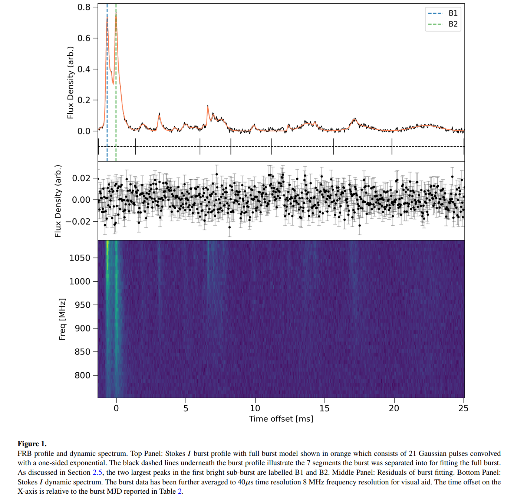

2. [PSR J1631-4722: The Discovery of a Young and Energetic Pulsar in the Supernova Remnant G336.7+0.5](https://arxiv.org/abs/2412.11345)

   > Pulsar, Supernova, Observation

   发现与超新星遗迹（SNR）和/或脉冲星风星云（PWN）相关联的脉冲星，这对于揭示其形成历史和脉冲星风动力学至关重要。

   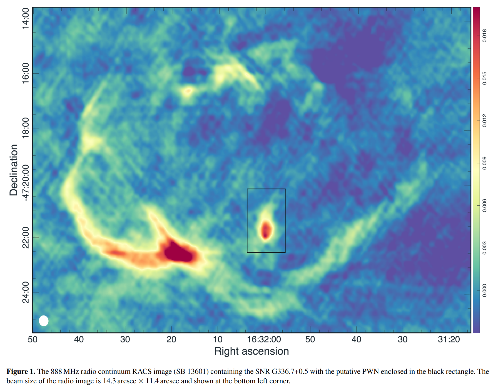

   在ASKAP的连续谱巡天中看到一个致密射电源，用Parkes的观测找到了一个118ms的脉冲星。

## 2024-12-18

1. [Representation learning for fast radio burst dynamic spectra](https://arxiv.org/abs/2412.12394)

   > Fast Radio Burst, Statistics, Deep Learning

   用[FRBakery](https://github.com/SRON-API-DataMagic/Rep_Learn_FRB/tree/main/FRBakery)生成FRB动态谱，分别使用PCA和卷积自编码器来学习动态谱中的特征。PCA在重建简单爆发时表现良好，但在处理复杂爆发时效果不佳。IOB-CAE在重建复杂爆发时表现出色，能够保留更多的细节和关键特征。

   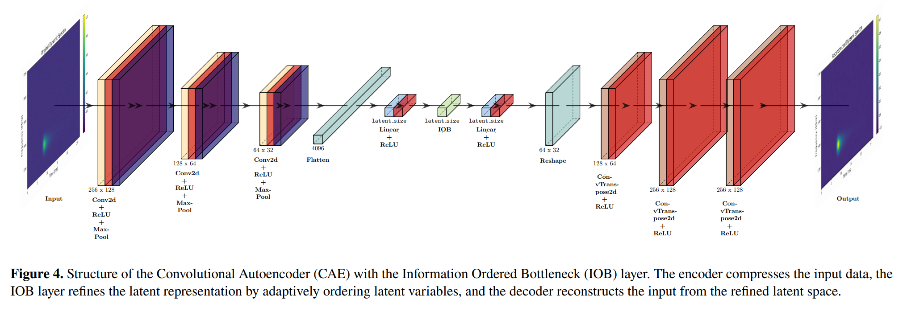

2. [High precision spectro-temporal analysis of ultra-fast radio bursts using per-channel arrival times](https://arxiv.org/abs/2412.12404)

   > Fast Radio Burst, Statistics

   统计FRB的频率漂移率和持续时间的关系。

   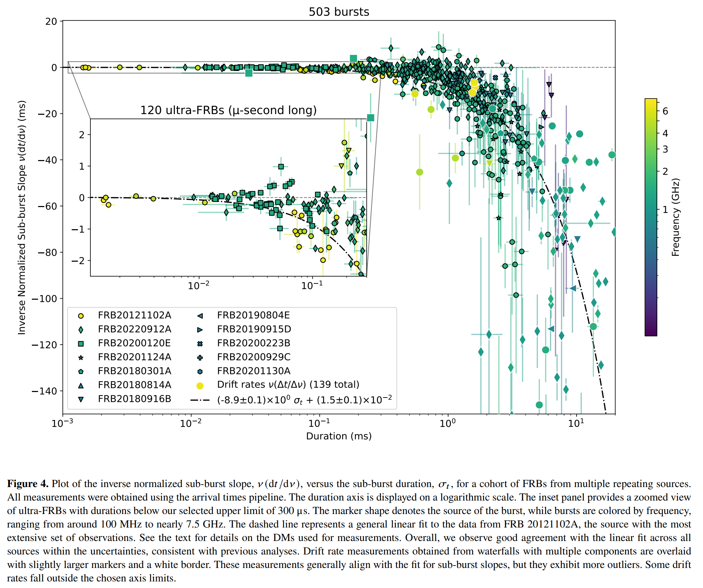

3. [Low-frequency Probes of the Persistent Radio Sources associated with Repeating FRBs](https://arxiv.org/abs/2412.13121)

   > Fast Radio Burst, PRS

   uGMRT看FRB20220912A、FRB20240114A和FRB20240619D的PRS。FRB20220912A的宿主星系的射电发射，流量密度为$435\pm53\,\rm\mu Jy/beam$，推测主要与恒星形成活动有关。FRB20240114A的PRS在650MHz的流量密度为$65.6\pm8.1\,\rm\mu Jy/beam$。FRB20240619D附近有AGN，没探测到PRS。

   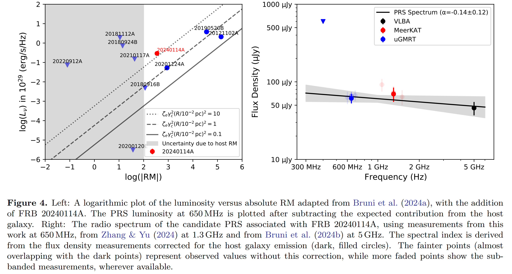

4. [Ultra-long period compact sources: a glimpse into observational breakthroughs and theoretical challenges](https://arxiv.org/abs/2412.12763)

   > Radio, Transient, LPT, Review

   总结到目前为止探测到的12个长周期射电源，和可能的辐射机制。其中3个确认是白矮星脉冲星，其余的性质不清楚。

   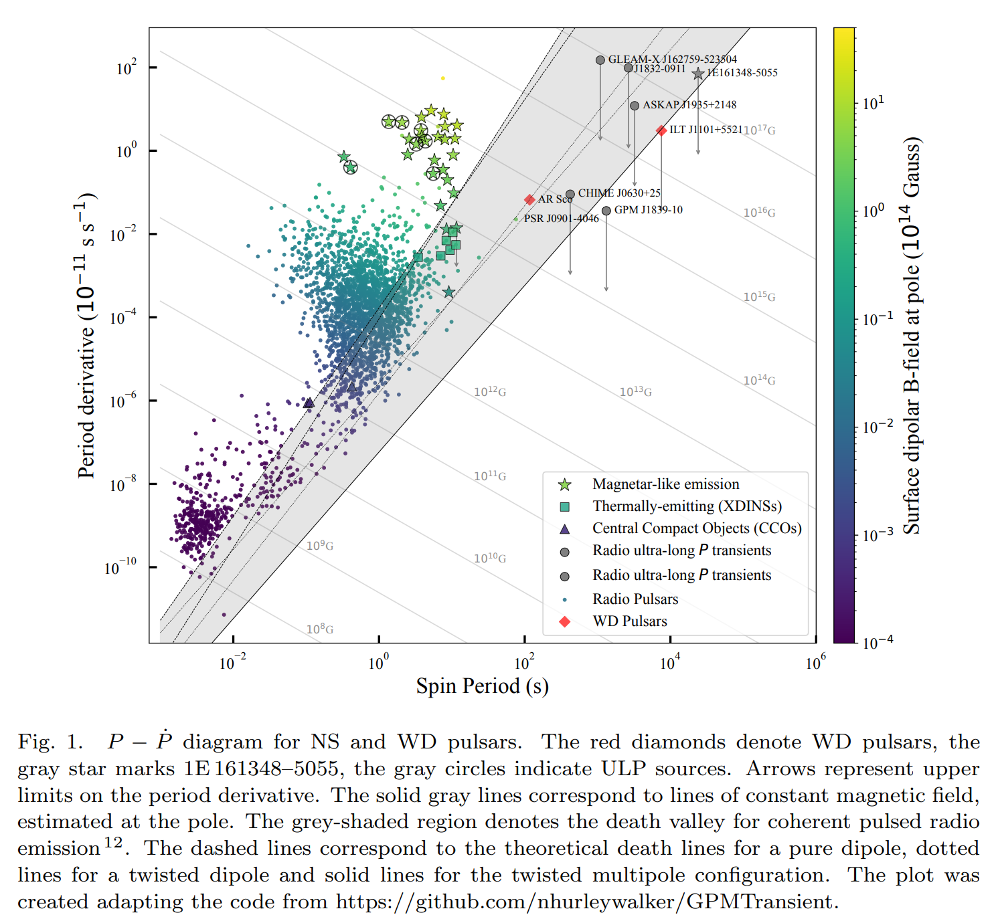

5. [Sun-like stars produce superflares roughly once per century](https://arxiv.org/abs/2412.12265)

   > Stellar, Flare

   统计开普勒光变曲线中，主序星的耀斑发射。这种耀斑发生的事件率随能量上升而下降，幂律拟合的指数$\alpha=1.97\pm0.3$。将其向低能端延伸，可以与太阳耀斑联系起来，表明两者可能由相同的物理机制产生。

   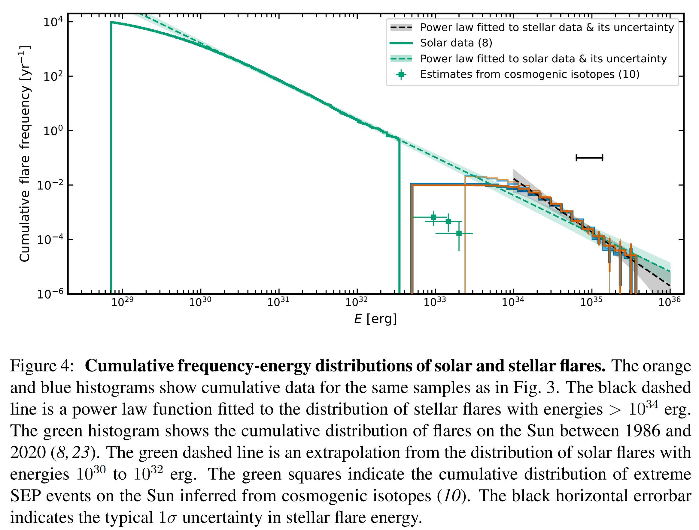

   类似太阳的恒星大约每世纪会产生一次超级耀斑。这一结果比太阳活动记录中的任何耀斑都要强大得多。

6. [Milky Way Disk](https://arxiv.org/abs/2412.12252)

   > Galaxy, Review

   Gaia mission提供了革命性的数据，使得我们对银河系盘面的看法发生了转变。指出，银河系盘面不是一个静态的系统，而是一个受到多种扰动的动态系统。

## 2024-12-19

1. [Montage and Radio Astronomy](https://arxiv.org/abs/2412.13213)

   > Radio, Astronomy

   [Montage](https://github.com/Caltech-IPAC/MontageNotebooks)图像拼接引擎在射电天文学中的应用。Montage用于将VLA发现并由ASKAP定位的FRB的后续图像进行拼接，以识别宿主星系。以及创建LoTSS-DR2数据的拼接法拉第立方体，并通过旋转测量合成算法构建法拉第矩图，以探测我们银河系的磁离子结构。

   

## 2024-12-20

1. [Energy and polarization based on-line interference mitigation in radio interferometry](https://arxiv.org/abs/2412.14775)

   > Radio, RFI, Method

   使用

   - `spectral kurtosis`，一种基于能量的高阶统计量，能够更灵敏地检测低能量RFI。
   - `directional statistics`计算偏振向量的方向

   来识别RFI信号。

   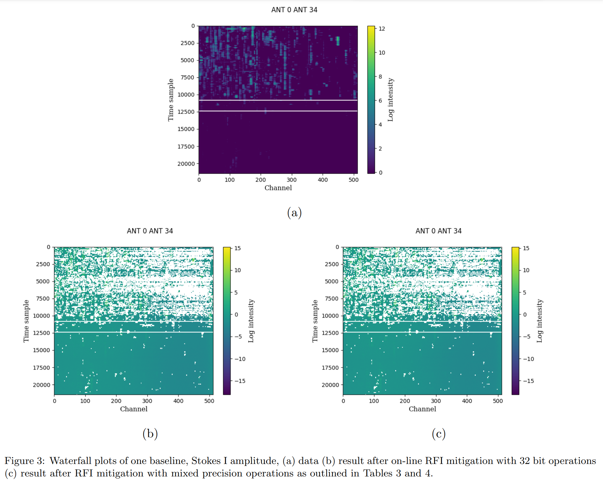

## 2024-12-23

