## 2025-01-01

今日停更

## 2025-01-02

今日停更

## 2025-01-03

1. [First Search for Pulsed CH Maser Emission Stimulated by a Pulsar](https://arxiv.org/abs/2501.01074)

   > ISM, Pulsar

   刘梦婷的文章，搜索由脉冲星PSR J1644-4559激发的脉冲CH脉泽辐射。在脉冲星ON和OFF阶段均检测到CH发射特征，观测到的速度与之前研究中OH发射和吸收的速度一致，表明CH和OH分子在空间上紧密相关。

2. [SpecPT (Spectroscopy Pre-trained Transformer) Model for Extragalactic Spectroscopy: I. Architecture and Automated Redshift Measurement](https://arxiv.org/abs/2501.01070)

   > Galaxy, Deep Learning, Spectrum

   在DESI的数据上训练编码器-解码器结构的模型，重建光谱，降低噪声。并在编码器后续实现一些下游任务，如红移预测。

   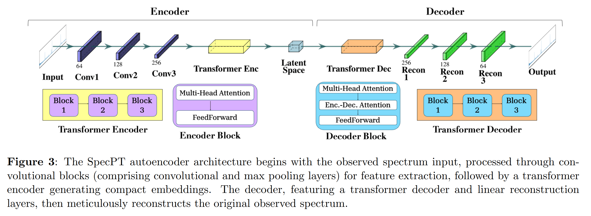

3. [On the Duration of Gamma-Ray Bursts](https://arxiv.org/abs/2501.00239)

   > GRB, Theory, Review

   GRB的持续时间通常通过T90（即GRB流量从5%增加到95%所需的时间）来衡量，并且存在短时（T90<2秒）和长时（T90>2秒）两类GRB。传统的观点认为短时GRB与双中子星并合事件相关，而长时GRB与大质量恒星核心坍缩事件相关。然而，最近发现的几例特殊GRB事件（如GRB 200826A、GRB 211211A和GRB 230307A）打破了这一简单分类。

   提出了一个模型来解释GRB的持续时间，并分析了三个特殊的GRB事件。具体来说，

   1. **前兆系统定义的持续时间**：假设GRB喷流由吸积驱动，持续时间由以下公式定义
      $$
      T_{GRB}=\max(t_{ff}, t_{acc})-t_{bo}
      $$
      其中$t_{ff}$是前兆恒星的自由落时间，$t_{acc}$ 是吸积时间尺度，$t_{bo}$是喷流突破前兆系统包层的时间。

   2. **引擎定义的持续时间**：如果GRB的中心引擎不是吸积黑洞，而是毫秒磁星，持续时间将由磁星的活动时间尺度定义，可能是吸积、磁泡发射或磁星自转减速。

   3. **发射器定义的持续时间**：发射器的发射时间可能比中心引擎的时间长，特别是在内部碰撞诱导的磁重联和湍流（ICMART）模型中，发射器在大范围内持续辐射。

   4. **几何定义的持续时间**：如果视线在相对论性喷流锥体外部，观测到的持续时间可能会因几何效应而改变。

## 2025-01-06

1. [ORACLE: A Real-Time, Hierarchical, Deep-Learning Photometric Classifier for the LSST](https://arxiv.org/abs/2501.01496)

   > Variable, Deep Learning, Classification

   [ELAsTiCC-Classification](https://github.com/uiucsn/ELAsTiCC-Classification)用RNN做LSST光变曲线的分类。

   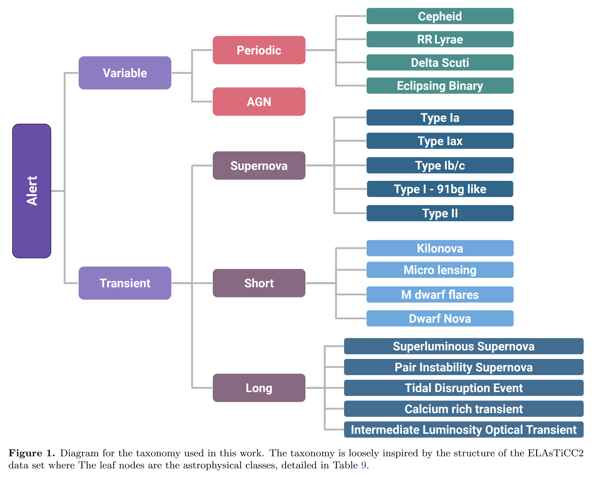

2. [Millihertz Oscillations Near the Innermost Orbit of a Supermassive Black Hole](https://arxiv.org/abs/2501.01581)

   > Black Hole, QPO

   使用[pyLag](https://github.com/wilkinsdr/pylag)分析XMM-Newton的光变曲线，画PSD，发现`SMBH 1ES 1927+654`的一个毫赫兹QPO。在2022年首次检测到QPO，周期约为18分钟，随后在两年内周期缩短至7.1分钟，且频率演化呈现减速趋势。QPO可能由极端质量比伴星、盘撕裂不稳定性或冕层振荡引起。

   

## 2025-01-07

1. [Revealing the internal magnetic field configuration of magnetars via their associated periodic signals](https://arxiv.org/abs/2501.02887)

   > Magnetar, Theory

   分析磁星4U 0142+61、1E 1547.0-5408、SGR 1900+14和SGR 1806-20的硬X射线发射中的周期性脉冲相位调制，以及FRB 180916和121102的周期性，解释为磁星的`自由进动`，并利用这些周期性信号研究磁星的内部磁场。

2. [Shear-gravity transition determines the steep velocity dispersion-size relation in molecular clouds: confronting analytical formula with observations](https://arxiv.org/abs/2501.03027)

   > ISM, Kinematics

   分子云的速度弥散-尺度关系可以由重力、湍流、剪切等解释。Larson关系的0.38的幂律指数用湍流解释，0.5的幂律指数用引力平衡或者可压缩超音速湍流解释，然而大于0.6的幂律指数还难以解释。

   这里认为是剪切和自引力共同贡献。小云团主要由自引力引起速度弥散，而大云团主要受剪切影响，过渡尺度约为100 pc。分析太阳邻域内的分子云发现模型给出的幂律指数0.71和观测一致。表明速度弥散-尺寸关系的幂律指数和归一化反映了从重力主导到剪切主导的渐变过程。

   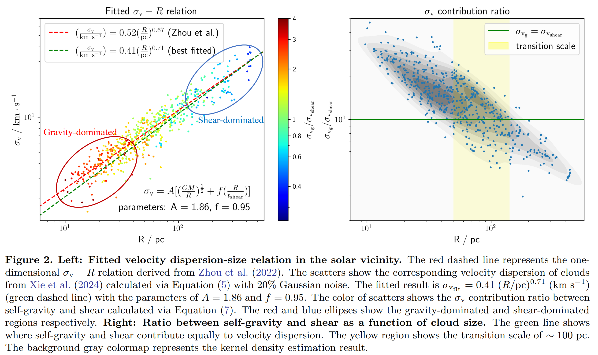

3. [Gaussian process regression of temperature-dependent radial velocities](https://arxiv.org/abs/2501.02959)

   > Stellar, Radial Velocity, GPR

   用准周期核函数
   $$
   k(t_i, t_j)=A^2\exp\left[-\frac{\left|t_i-t_j\right|^2}{\tau^2}-\frac{\sin^2\left(\frac{\pi\left|t_i-t_j\right|}{P_{\rm rot}}\right)}{\mu^2}\right] + \delta_{i, j}\beta^2
   $$
   

   来进行高斯过程回归，其中$A$是振幅，$\tau$是时间尺度，$P_{\rm rot}$是旋转周期，$\mu$是平滑因子，$\beta$是抖动项。

   使用[MAGPy_RV](https://github.com/frescigno/magpy_rv)进行拟合对恒星径向速度建模。结果显示，恒星活动信号在不同温度范围内表现不同，总体趋势是向温度极值方向增加。

4. [FRELLED Reloaded: Multiple techniques for astronomical data visualisation in Blender](https://arxiv.org/abs/2501.02919)

   > Astronomy, Visualization

   [FRELLED 5.0](https://ascl.net/1508.004)是Blender插件，用于实时可视化天文Volume数据。

   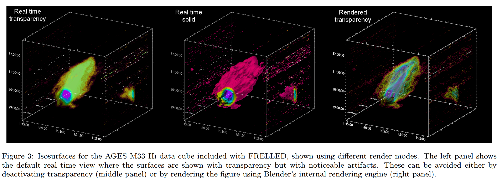

5. [The Kratos Framework for Hetrogeneous Astrophysical Simulations: Fundamental Infrastructures and Hydrodynamics](https://arxiv.org/abs/2501.02317)

   > ISM, Simulation, Software

   王力乐的文章，介绍他用来做模拟的工具`Kratos`。

6. [Using LSDB to enable large-scale catalog distribution, cross-matching, and analytics](https://arxiv.org/abs/2501.02103)

   > Variable, Software

   LSST将产生约60 PB的原始数据和约30万亿个观测源，为此开发的

   - 新的数据格式`HATS`，利用healpix像素将天空划分为多个分区，每个分区包含大致相同数量的对象。HATS使用Apache Parquet作为底层存储格式，提供高效的表格数据存储和检索。
   - 新的分析工具`LSDB`，集成空间查询、交叉匹配和时间序列工具，并利用Dask进行并行化。

## 2025-01-08

1. [Spectroscopic Detection of a 2.9-hour Orbit in a Long Period Radio Transient](https://arxiv.org/abs/2501.03315)

   > Transient, Radio, LPT, Spectrum

   Keck观测`GLEAM-X J0704-37`，发现其位于一个双星系统中。白矮星+M矮星的双星系统可以解释观测到的光谱，M矮星的轨道周期与射电爆发的周期一致。且这个系统距离我们400pc，比之前的报道近得多，表明附近可能有更多这样的系统。

   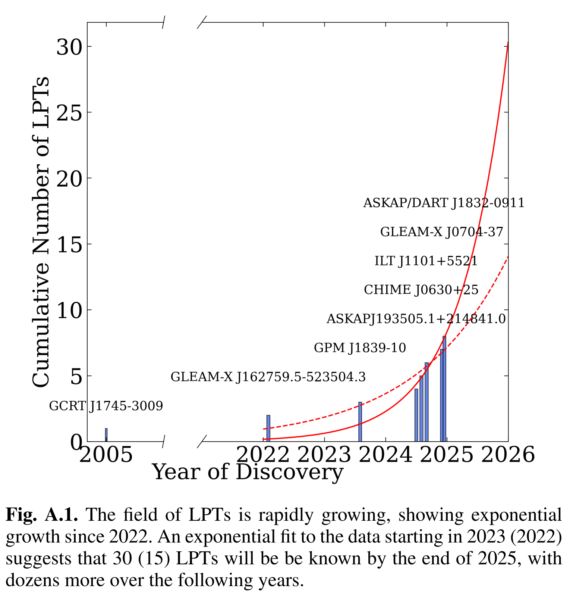

## 2025-01-09

1. [Dissipation and particle acceleration in astrophysical jets with velocity and magnetic shear: Interaction of Kelvin-Helmholtz and Drift-Kink Instabilities](https://arxiv.org/abs/2501.04090)

   > Turbulence, Simulation

   天体物理中的相对论性喷流，这些喷流通常具有“脊柱-鞘”结构，即较快的喷流被较慢的鞘包围，导致喷流边界处的速度剪切。这种剪切容易引发Kelvin-Helmholtz（KH）不稳定性。此外，这些喷流也被观察到是磁化的，可能包含环向或螺旋磁场，磁场方向和强度的变化可能导致电流片，这些电流片容易引发撕裂模式/磁重联，并且也是高效的粒子加速器。电流片也容易受到Drift-Kink（DK）不稳定性的影响。

   DK不稳定性可以有效地破坏KH涡旋，形成湍流剪切层，显著增强耗散。此外，在中等速度剪切范围内，联合DK-KH不稳定性特别活跃，导致更强的耗散和粒子加速。

2. [TransientVerse: A Comprehensive Real-Time Alert and Multi-Wavelength Analysis System for Transient Astronomical Events](https://arxiv.org/abs/2501.04247)

   > Transient, Software

   TransientVerse的文章。

## 2025-01-10

1. [Euclid: Detecting Solar System objects in Euclid images and classifying them using Kohonen self-organising maps](https://arxiv.org/abs/2501.05023)

   > Stellar, Software

   再欧几里得的光学和红外图像中通过SExtractor找太阳系移动天体， 使用Kohonen自组织映射（SOM）对恒星、星系和SSOs进行分类。

## 2025-01-13

1. [BASSET: Bandpass-Adaptive Single-pulse SEarch Toolkit -- Optimized Sub-Band Pulse Search Strategies for Faint Narrow-Band FRBs](https://arxiv.org/abs/2501.05875)

   > Fast Radio Burst, Software, Search

   曹锦煌的文章，窄带FRB搜索。

## 2025-01-14

1. [Science objectives of the Einstein Probe mission](https://arxiv.org/abs/2501.07362)

   > High Energy, Instrument, Review

   EP的科学任务，包括快速外星系瞬变源（FXRTs，预计每年可以检测到数十个FXRTs）、伽马射线暴（GRBs，预计每年可以检测到约1.5个高红移GRBs）、超新星遗迹（SNR）、活动星系核（AGN，研究其X射线光度和光谱演化）和白矮星（WD）等。

## 2025-01-15

1. [Discovery of 26 new Galactic radio transients by MeerTRAP](https://arxiv.org/abs/2501.08224)

   > Transient, Observation, Radio

   MeerTRAP探测到的26个新的河内暂现源，其中大部分是RRAT。根据基带数据的图像做到角秒定位，从而得到5个源的计时解，得知这些RRAT具有几百万年的年龄和较低的表面磁场强度。测量了另外8个暂现源的自转周期，其中一个的周期似乎长约17.5秒。大多数暂现源只出现过一次。

   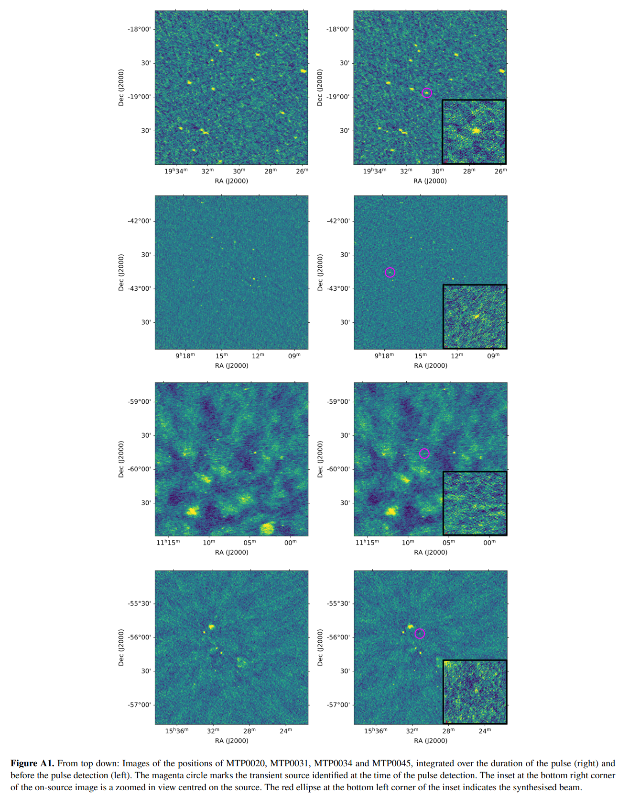

2. [Inadequate turbulent support in low-metallicity molecular clouds](https://arxiv.org/abs/2501.07636)

   > ISM, Turbulence

   测量银河系分子云的维里参数，发现银河系外盘的低金属丰度的分子云的湍流弱于靠近太阳的富金属分子云。说明在低金属丰度的银河系外盘，磁场成为了支持分子云的主要机制。

   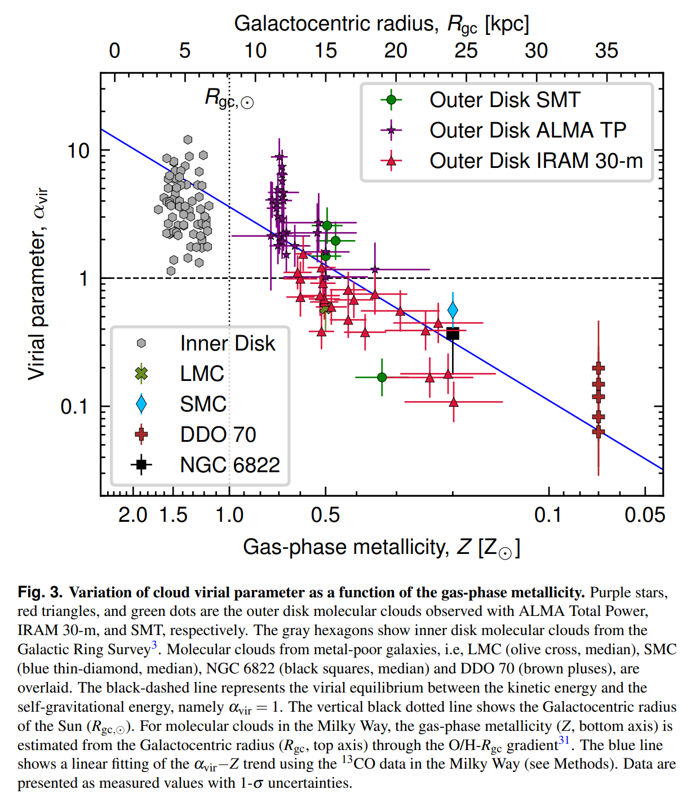

## 2025-01-16

1. [An Ultra-Wideband Dual Polarization Antenna Array for the Detection and Localization of Bright Fast Radio Transients in the Milky Way](https://arxiv.org/abs/2501.08764)

   > Fast Radio Burst, Instrument

   提出了一种紧凑的临时天线阵列，旨在对银河系内的 FRB 进行有效探测和定位。该天线在1200-1800 MHz范围内工作，由三个子阵列组成，呈L形放置，用于源定位。

   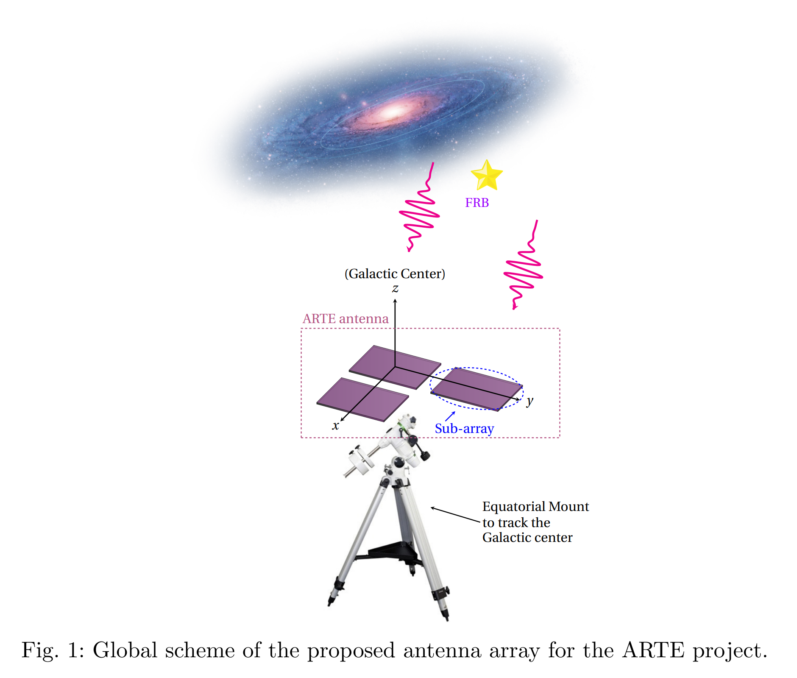

## 2025-01-17

1. [Probing Cosmology with 92 Localized Fast Radio Bursts and DESI BAO](https://arxiv.org/abs/2501.09260)

   > Fast Radio Burst, Cosmology

   使用92个定位了的FRB，结合DESI BAO、PantheonPlus和CMB数据，约束了暗能量的状态方程。结果倾向于动态暗能量模型，与标准ΛCDM模型存在显著差异。

   通过FRBs单独估计哈勃常数，显示出不同的趋势，表明准确的银河系电子密度模型对于解决哈勃张力至关重要。

   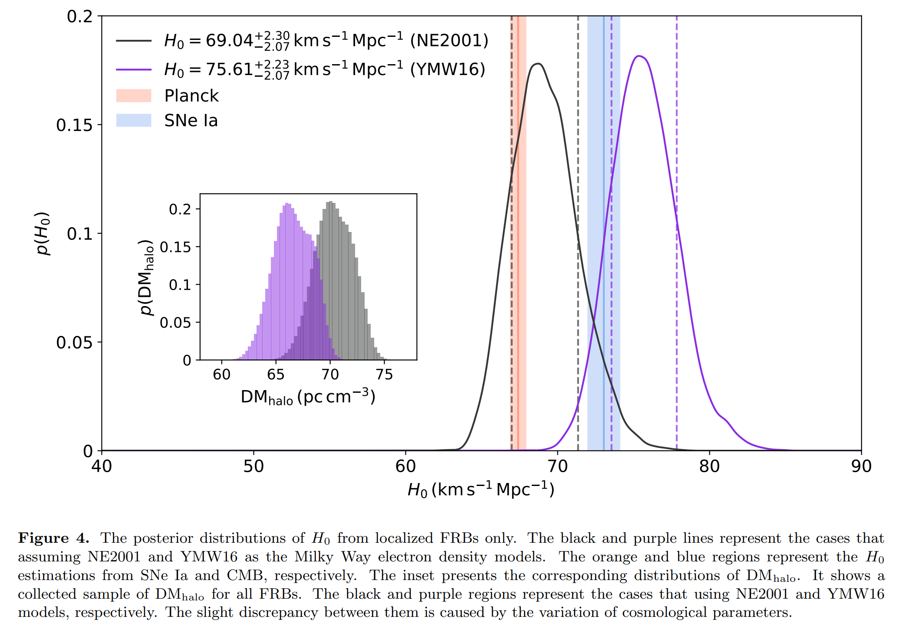

2. [A universal break in energy functions of three hyperactive repeating fast radio bursts](https://arxiv.org/abs/2501.09248)

   > Fast Radio Burst, Statistics

   统计FRB的能量分布，认为有拐折是星震。

3. [An Intermediate-mass Black Hole Lurking in A Galactic Halo Caught Alive during Outburst](https://arxiv.org/abs/2501.09580)

   > Black Hole, MultiWavelength, Observation

   多波段观测`EP240222a`

   - X射线光谱显示出软的特征，表明其可能是一个IMBH-TDE。光谱分析显示，其内盘温度约为210 eV，符合IMBH的预期。
   - 光学光谱显示出显著的He II和Hα发射线，进一步支持了TDE的诊断。光谱分析确定了其红移为0.032。
   - 光变曲线显示出长期的上升阶段、显著的爆发阶段和平坦的平台阶段，符合IMBH-TDE的典型特征。

   这是首次在星系晕中探测到的一个中等质量黑洞的潮汐瓦解事件。

   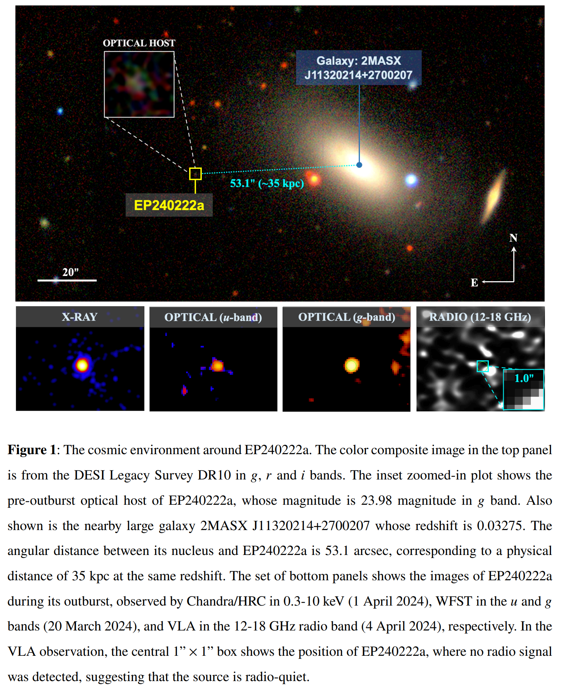

4. [The emission of interpulses by a 6.45-hour period coherent radio transient](https://arxiv.org/abs/2501.09133)

   > Transient, LPT, Observation

   `ASKAP J1839-0756`是ASKAP新探测到的长周期变源，周期6.45小时，显示出主脉冲和较弱的中脉冲，表明其具有有序的双极磁场，可能来自一个紧凑的天体，如中子星。

   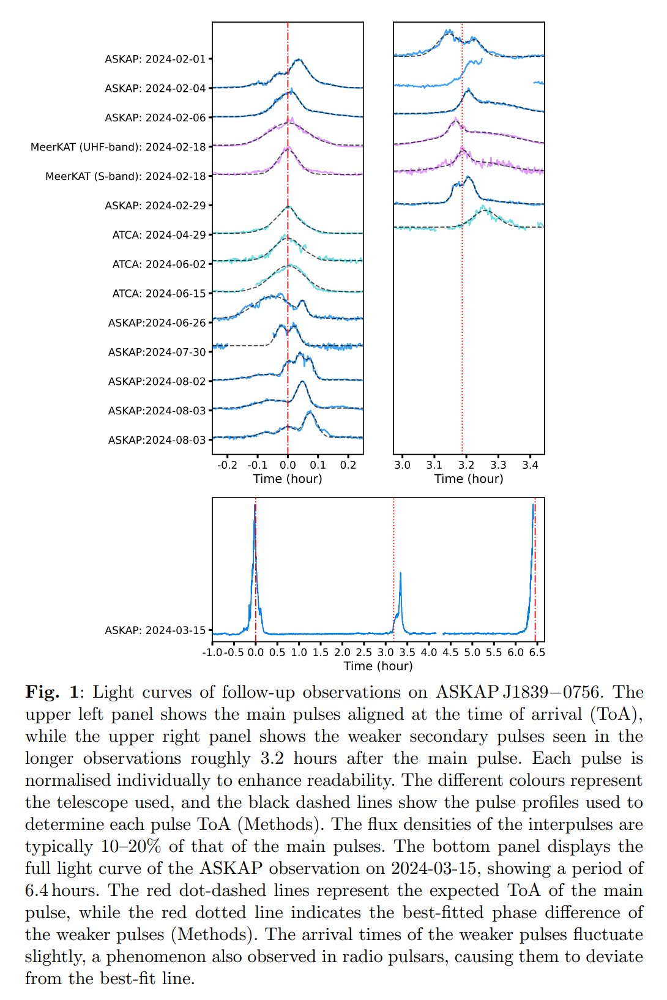

## 2025-01-20

