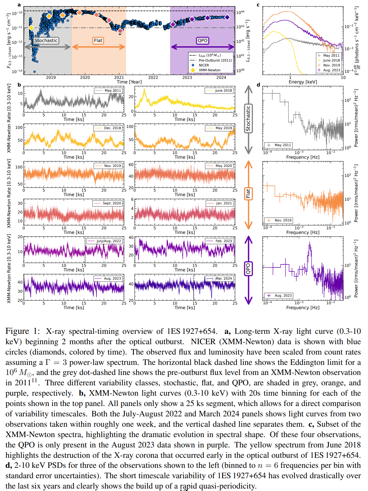

## 2025-01-01

今日停更

## 2025-01-02

今日停更

## 2025-01-03

1. [First Search for Pulsed CH Maser Emission Stimulated by a Pulsar](https://arxiv.org/abs/2501.01074)

   > ISM, Pulsar

   刘梦婷的文章，搜索由脉冲星PSR J1644-4559激发的脉冲CH脉泽辐射。在脉冲星ON和OFF阶段均检测到CH发射特征，观测到的速度与之前研究中OH发射和吸收的速度一致，表明CH和OH分子在空间上紧密相关。

2. [SpecPT (Spectroscopy Pre-trained Transformer) Model for Extragalactic Spectroscopy: I. Architecture and Automated Redshift Measurement](https://arxiv.org/abs/2501.01070)

   > Galaxy, Deep Learning, Spectrum

   在DESI的数据上训练编码器-解码器结构的模型，重建光谱，降低噪声。并在编码器后续实现一些下游任务，如红移预测。

   

3. [On the Duration of Gamma-Ray Bursts](https://arxiv.org/abs/2501.00239)

   > GRB, Theory, Review

   GRB的持续时间通常通过T90（即GRB流量从5%增加到95%所需的时间）来衡量，并且存在短时（T90<2秒）和长时（T90>2秒）两类GRB。传统的观点认为短时GRB与双中子星并合事件相关，而长时GRB与大质量恒星核心坍缩事件相关。然而，最近发现的几例特殊GRB事件（如GRB 200826A、GRB 211211A和GRB 230307A）打破了这一简单分类。

   提出了一个模型来解释GRB的持续时间，并分析了三个特殊的GRB事件。具体来说，

   1. **前兆系统定义的持续时间**：假设GRB喷流由吸积驱动，持续时间由以下公式定义
      $$
      T_{GRB}=\max(t_{ff}, t_{acc})-t_{bo}
      $$
      其中$t_{ff}$是前兆恒星的自由落时间，$t_{acc}$ 是吸积时间尺度，$t_{bo}$是喷流突破前兆系统包层的时间。

   2. **引擎定义的持续时间**：如果GRB的中心引擎不是吸积黑洞，而是毫秒磁星，持续时间将由磁星的活动时间尺度定义，可能是吸积、磁泡发射或磁星自转减速。

   3. **发射器定义的持续时间**：发射器的发射时间可能比中心引擎的时间长，特别是在内部碰撞诱导的磁重联和湍流（ICMART）模型中，发射器在大范围内持续辐射。

   4. **几何定义的持续时间**：如果视线在相对论性喷流锥体外部，观测到的持续时间可能会因几何效应而改变。

## 2025-01-06

1. [ORACLE: A Real-Time, Hierarchical, Deep-Learning Photometric Classifier for the LSST](https://arxiv.org/abs/2501.01496)

   > Variable, Deep Learning, Classification

   [ELAsTiCC-Classification](https://github.com/uiucsn/ELAsTiCC-Classification)用RNN做LSST光变曲线的分类。

   

2. [Millihertz Oscillations Near the Innermost Orbit of a Supermassive Black Hole](https://arxiv.org/abs/2501.01581)

   > Black Hole, QPO

   使用[pyLag](https://github.com/wilkinsdr/pylag)分析XMM-Newton的光变曲线，画PSD，发现`SMBH 1ES 1927+654`的一个毫赫兹QPO。在2022年首次检测到QPO，周期约为18分钟，随后在两年内周期缩短至7.1分钟，且频率演化呈现减速趋势。QPO可能由极端质量比伴星、盘撕裂不稳定性或冕层振荡引起。

   

## 2025-01-07

1. [Revealing the internal magnetic field configuration of magnetars via their associated periodic signals](https://arxiv.org/abs/2501.02887)

   > Magnetar, Theory

   分析磁星4U 0142+61、1E 1547.0-5408、SGR 1900+14和SGR 1806-20的硬X射线发射中的周期性脉冲相位调制，以及FRB 180916和121102的周期性，解释为磁星的`自由进动`，并利用这些周期性信号研究磁星的内部磁场。

2. [Shear-gravity transition determines the steep velocity dispersion-size relation in molecular clouds: confronting analytical formula with observations](https://arxiv.org/abs/2501.03027)

   > ISM, Kinematics

   分子云的速度弥散-尺度关系可以由重力、湍流、剪切等解释。Larson关系的0.38的幂律指数用湍流解释，0.5的幂律指数用引力平衡或者可压缩超音速湍流解释，然而大于0.6的幂律指数还难以解释。

   这里认为是剪切和自引力共同贡献。小云团主要由自引力引起速度弥散，而大云团主要受剪切影响，过渡尺度约为100 pc。分析太阳邻域内的分子云发现模型给出的幂律指数0.71和观测一致。表明速度弥散-尺寸关系的幂律指数和归一化反映了从重力主导到剪切主导的渐变过程。

   

3. [Gaussian process regression of temperature-dependent radial velocities](https://arxiv.org/abs/2501.02959)

   > Stellar, Radial Velocity, GPR

   用准周期核函数
   $$
   k(t_i, t_j)=A^2\exp\left[-\frac{\left|t_i-t_j\right|^2}{\tau^2}-\frac{\sin^2\left(\frac{\pi\left|t_i-t_j\right|}{P_{\rm rot}}\right)}{\mu^2}\right] + \delta_{i, j}\beta^2
   $$
   

   来进行高斯过程回归，其中$A$是振幅，$\tau$是时间尺度，$P_{\rm rot}$是旋转周期，$\mu$是平滑因子，$\beta$是抖动项。

   使用[MAGPy_RV](https://github.com/frescigno/magpy_rv)进行拟合对恒星径向速度建模。结果显示，恒星活动信号在不同温度范围内表现不同，总体趋势是向温度极值方向增加。

4. [FRELLED Reloaded: Multiple techniques for astronomical data visualisation in Blender](https://arxiv.org/abs/2501.02919)

   > Astronomy, Visualization

   [FRELLED 5.0](https://ascl.net/1508.004)是Blender插件，用于实时可视化天文Volume数据。

   

5. [The Kratos Framework for Hetrogeneous Astrophysical Simulations: Fundamental Infrastructures and Hydrodynamics](https://arxiv.org/abs/2501.02317)

   > ISM, Simulation, Software

   王力乐的文章，介绍他用来做模拟的工具`Kratos`。

6. [Using LSDB to enable large-scale catalog distribution, cross-matching, and analytics](https://arxiv.org/abs/2501.02103)

   > Variable, Software

   LSST将产生约60 PB的原始数据和约30万亿个观测源，为此开发的

   - 新的数据格式`HATS`，利用healpix像素将天空划分为多个分区，每个分区包含大致相同数量的对象。HATS使用Apache Parquet作为底层存储格式，提供高效的表格数据存储和检索。
   - 新的分析工具`LSDB`，集成空间查询、交叉匹配和时间序列工具，并利用Dask进行并行化。

## 2025-01-08

1. [Spectroscopic Detection of a 2.9-hour Orbit in a Long Period Radio Transient](https://arxiv.org/abs/2501.03315)

   > Transient, Radio, LPT, Spectrum

   Keck观测`GLEAM-X J0704-37`，发现其位于一个双星系统中。白矮星+M矮星的双星系统可以解释观测到的光谱，M矮星的轨道周期与射电爆发的周期一致。且这个系统距离我们400pc，比之前的报道近得多，表明附近可能有更多这样的系统。

   

## 2025-01-09

1. [Dissipation and particle acceleration in astrophysical jets with velocity and magnetic shear: Interaction of Kelvin-Helmholtz and Drift-Kink Instabilities](https://arxiv.org/abs/2501.04090)

   > Turbulence, Simulation

   天体物理中的相对论性喷流，这些喷流通常具有“脊柱-鞘”结构，即较快的喷流被较慢的鞘包围，导致喷流边界处的速度剪切。这种剪切容易引发Kelvin-Helmholtz（KH）不稳定性。此外，这些喷流也被观察到是磁化的，可能包含环向或螺旋磁场，磁场方向和强度的变化可能导致电流片，这些电流片容易引发撕裂模式/磁重联，并且也是高效的粒子加速器。电流片也容易受到Drift-Kink（DK）不稳定性的影响。

   DK不稳定性可以有效地破坏KH涡旋，形成湍流剪切层，显著增强耗散。此外，在中等速度剪切范围内，联合DK-KH不稳定性特别活跃，导致更强的耗散和粒子加速。

2. [TransientVerse: A Comprehensive Real-Time Alert and Multi-Wavelength Analysis System for Transient Astronomical Events](https://arxiv.org/abs/2501.04247)

   > Transient, Software

   TransientVerse的文章。

## 2025-01-10

1. [Euclid: Detecting Solar System objects in Euclid images and classifying them using Kohonen self-organising maps](https://arxiv.org/abs/2501.05023)

   > Stellar, Software

   再欧几里得的光学和红外图像中通过SExtractor找太阳系移动天体， 使用Kohonen自组织映射（SOM）对恒星、星系和SSOs进行分类。

## 2025-01-13

1. [BASSET: Bandpass-Adaptive Single-pulse SEarch Toolkit -- Optimized Sub-Band Pulse Search Strategies for Faint Narrow-Band FRBs](https://arxiv.org/abs/2501.05875)

   > Fast Radio Burst, Software, Search

   曹锦煌的文章，窄带FRB搜索。

## 2025-01-14

1. [Science objectives of the Einstein Probe mission](https://arxiv.org/abs/2501.07362)

   > High Energy, Instrument, Review

   EP的科学任务，包括快速外星系瞬变源（FXRTs，预计每年可以检测到数十个FXRTs）、伽马射线暴（GRBs，预计每年可以检测到约1.5个高红移GRBs）、超新星遗迹（SNR）、活动星系核（AGN，研究其X射线光度和光谱演化）和白矮星（WD）等。

## 2025-01-15

1. [Discovery of 26 new Galactic radio transients by MeerTRAP](https://arxiv.org/abs/2501.08224)

   > Transient, Observation, Radio

   MeerTRAP探测到的26个新的河内暂现源，其中大部分是RRAT。根据基带数据的图像做到角秒定位，从而得到5个源的计时解，得知这些RRAT具有几百万年的年龄和较低的表面磁场强度。测量了另外8个暂现源的自转周期，其中一个的周期似乎长约17.5秒。大多数暂现源只出现过一次。

   

2. [Inadequate turbulent support in low-metallicity molecular clouds](https://arxiv.org/abs/2501.07636)

   > ISM, Turbulence

   测量银河系分子云的维里参数，发现银河系外盘的低金属丰度的分子云的湍流弱于靠近太阳的富金属分子云。说明在低金属丰度的银河系外盘，磁场成为了支持分子云的主要机制。

   

## 2025-01-16

1. [An Ultra-Wideband Dual Polarization Antenna Array for the Detection and Localization of Bright Fast Radio Transients in the Milky Way](https://arxiv.org/abs/2501.08764)

   > Fast Radio Burst, Instrument

   提出了一种紧凑的临时天线阵列，旨在对银河系内的 FRB 进行有效探测和定位。该天线在1200-1800 MHz范围内工作，由三个子阵列组成，呈L形放置，用于源定位。

   

## 2025-01-17

1. [Probing Cosmology with 92 Localized Fast Radio Bursts and DESI BAO](https://arxiv.org/abs/2501.09260)

   > Fast Radio Burst, Cosmology

   使用92个定位了的FRB，结合DESI BAO、PantheonPlus和CMB数据，约束了暗能量的状态方程。结果倾向于动态暗能量模型，与标准ΛCDM模型存在显著差异。

   通过FRBs单独估计哈勃常数，显示出不同的趋势，表明准确的银河系电子密度模型对于解决哈勃张力至关重要。

   

2. [A universal break in energy functions of three hyperactive repeating fast radio bursts](https://arxiv.org/abs/2501.09248)

   > Fast Radio Burst, Statistics

   统计FRB的能量分布，认为有拐折是星震。

3. [An Intermediate-mass Black Hole Lurking in A Galactic Halo Caught Alive during Outburst](https://arxiv.org/abs/2501.09580)

   > Black Hole, MultiWavelength, Observation

   多波段观测`EP240222a`

   - X射线光谱显示出软的特征，表明其可能是一个IMBH-TDE。光谱分析显示，其内盘温度约为210 eV，符合IMBH的预期。
   - 光学光谱显示出显著的He II和Hα发射线，进一步支持了TDE的诊断。光谱分析确定了其红移为0.032。
   - 光变曲线显示出长期的上升阶段、显著的爆发阶段和平坦的平台阶段，符合IMBH-TDE的典型特征。

   这是首次在星系晕中探测到的一个中等质量黑洞的潮汐瓦解事件。

   

4. [The emission of interpulses by a 6.45-hour period coherent radio transient](https://arxiv.org/abs/2501.09133)

   > Transient, LPT, Observation

   `ASKAP J1839-0756`是ASKAP新探测到的长周期变源，周期6.45小时，显示出主脉冲和较弱的中脉冲，表明其具有有序的双极磁场，可能来自一个紧凑的天体，如中子星。

   

## 2025-01-20

1. [The cosmic evolution of FRBs inferred from CHIME/FRB Catalog 1](https://arxiv.org/abs/2501.09810)

   > Fast Radio Burst, Statistics, Cosmology

   对CHIME的FRB目录进行统计，发现FRB的能量分布可以用Schechter函数描述，指数为-1.94。FRB源可能由年轻和年老两种通道组合形成。

   预计下一代射电望远镜每年在$z\ge6$时能探测到几十个FRB，具备系统等效通量密度$\le1\,\rm Jy$和瞬时天空覆盖200平方度的望远镜应能在$z\ge6$时每年探测到$1.4\times10^3$个 FRBs，在$z\ge6$时每年探测到$243^{+250}_{-162}$FRBs。

2. [So long Kolmogorov: the forward and backward turbulence cascades in a supernovae-driven, multiphase interstellar medium](https://arxiv.org/abs/2501.09855)

   > ISM, Turbulence, Simulation

   通过对超新星驱动的多相星际介质的模拟发现，超新星爆炸不仅驱动了湍流，还通过不可压缩模式的逆级联和可压缩模式的相互作用，形成了独特的湍流特性。

   

## 2025-01-21

今日停更

## 2025-01-22

1. [A highly magnetized long-period radio transient exhibiting unusual emission features](https://arxiv.org/abs/2501.10528)

   > Transient, LPT, Observation

   MeerKAT对GPM J1839-10的观测（三十年那个），降采样到12ms的时间分辨率用TransientX进行单脉冲搜索。在15次观测中，只在最后3次观测找到了爆发。用ACF和PSD找到了1.97s的准周期。

   

   测量了三个脉冲的RM，发现线偏振和圆偏振在不同相位间波动，圆极化分数高达约95%。PA摆动显示出复杂的相位变化，并在特定相位出现正交极化模式。在P2脉冲的子脉冲中观察到频率依赖的线极化到圆极化的转换。

   

   观测结果支持长周期磁星模型，并暗示LPRTs、磁星和FRBs之间可能存在联系。

2. [DECH: Software Package for Astronomical Spectral Data Processing and Analysis](https://arxiv.org/abs/2501.12207)

   > Spectrum, Software

   [DECH](http://www.gazinur.com/Download.html)用于处理光谱数据，提供从图像预处理到光谱提取、波长校准、连续谱归一化、等值宽度测量（提供多种方法测量等值宽度，包括直接积分、高斯、洛伦兹和Voigt拟合）和径向速度测量等一系列功能。

3. [WALLABY Pilot Survey: kNN identification of perturbed galaxies through HI morphometrics](https://arxiv.org/abs/2501.10563)

   > Galaxy, Machine Learning, Classification

   用k近邻对WALLABY的HI星系的形态参数（包括集中性、不对称性、平滑度、Gini、M20和Sersic指数。使用STATMORPH工具计算这些参数）进行分类，识别扰动星系。

4. [GPU Accelerated Image Quality Assessment-Based Software for Transient Detection](https://arxiv.org/abs/2501.10653)

   > Transient, Software

   在成像数据中找暂现源，通过前后两张微分的方法。之前有人提出`低信息相似性指数, LISI`的方法
   $$
   {\rm LISI}(x, y)=D\frac{\sum_{i=1}^N\frac{|x_i+y_i|}{|x_i-y_i|+C_1}}{\max\left(\sum_{i=1}^Nx_i, \sum_{i=1}^Ny_i\right)+C_2}
   $$
   其中x和y是输入图像，C是小常数。以及augLISI
   $$
   {\rm augLISI}(x, y)=1-\frac{\sum_{i=1}^N|x_i+y_i||x_i-y_i|}{\sum_{i=1}^Nx_i+\sum_{i=1}^Ny_i+C}
   $$

   - LISI对所有强度级别的变化都非常敏感，即使变化很小，LISI值的范围较广。
   - augLISI对显著变化更敏感，对小变化的敏感性较低，能够有效识别源差异并忽略噪声变化。

   

   LISI在图像的角落和由CLEAN波束卷积引起的结构中产生低值，而augLISI则能更好地定位瞬变，减少误报。这里实现了GPU版本的[LISI](https://github.com/egbdfX/gpuLISI)和[augLISI](https://github.com/egbdfX/gpuAugLISI)。

5. [Observational signatures of mixing-induced cooling in the Kelvin-Helmholtz instability](https://arxiv.org/abs/2501.11324)

   > Solar, Simulation

   太阳大气中存在冷（约10^4K）而密集的物质，如日珥和日冕雨，这些物质与热（约10^6K）而稀薄的日冕物质混合。湍流可以驱动这些物质之间的混合，导致中间温度（约10^5K）的光谱线发射增强，通常归因于混合层内的湍流加热。然而，辐射冷却在中等温度下非常有效，数值模拟表明辐射冷却可以远远超过湍流加热。

   使用[PIP](https://github.com/AstroSnow/PIP)进行非维度形式的辐射磁流体动力学方程的演化。模拟包括密度、速度、磁场和压力等变量。使用CHIANTI v9和自定义的辐射损失函数来计算辐射损失。

   

   数值模拟显示，混合过程本身可以导致暖光谱线发射的增加，而不需要加热。辐射损失在混合层中非常有效，导致热能净减少。因此，在日珥-日冕界面观测到的暖光谱线发射增加可能是混合的结果，而不是加热的标志。

6. [Classification of HI Galaxy Profiles Using Unsupervised Learning and Convolutional Neural Networks: A Comparative Analysis and Methodological Cases of Studies](https://arxiv.org/abs/2501.11657)

   > Galaxy, Machine Learning, Classification

   对星系HI轮廓进行分类。用到了[Shapelet](https://tslearn.readthedocs.io/en/latest/user_guide/shapelets.html)变换，Shapelet Transform 的目标是找到那些能够**最好地分离不同类别**的 shapelets，并利用它们对整个时间序列进行变换，生成一个新的特征空间。

   - **解释性强**：Shapelet 是时间序列的子序列，具有明显的物理或模式意义。
   - **降维能力**：通过提取 shapelets，可以有效减少时间序列的高维性和冗余信息。
   - **适用性广**：经过 Shapelet Transform 后，可以结合任何传统分类算法。

## 2025-01-23

1. [FindPOTATOs: Minor Planet Observation Linking Software](https://arxiv.org/abs/2501.12922)

   > Planetary Science, Software

   [FindPOTATOs](https://github.com/nugent-lab/FindPOTATOS-stable/)是一个灵活且健壮的链接算法，能够在噪声数据中找到小行星轨迹片段。

## 2025-01-24

1. [COOL Research DAO Whitepaper -- Towards community-owned astrophysics for everyone](https://arxiv.org/abs/2501.13160)

   > Astronomy, Software

   [COOL Research DAO](https://coolresearch.io/)利用互联网上的开放结构和区块链技术，提供了一个去中心化、透明和民主的平台，用于进行和组织科学研究。通过DAO，研究产品、社区和资金可以开放给所有人，通过开放访问和透明的资源分配实现。

## 2025-01-27

1. [Empirical estimation of host galaxy dispersion measure towards well localized fast radio bursts](https://arxiv.org/abs/2501.14063)

   > Fast Radio Burst, Galaxy, Statistics

   通过对十二个已定位的FRB宿主星系的DM进行经验估计，发现宿主星系的DM与宿主星系的恒星质量和恒星形成率之间存在正相关关系。

   

2. [A flaring radio counterpart to a fast radio burst reveals a newborn magnetized engine](https://arxiv.org/abs/2501.14247)

   > Fast Radio Burst, Galaxy, Observation, PRS

   观测FRB20240114A的宿主星系，看到了FRS（flaring radio source）。

   

   FRS的时间和光谱特性与其他已知的爆发性天体（如超新星和低光度活动星系核）相似，表明FRB引擎可能涉及爆炸和吸积/喷流过程。FRS的磁场强度和大小表明其可能处于PRS的早期阶段，暗示其他活跃FRB的PRS可能是其后期演化阶段。

3. [Artificial Intelligence Could Have Predicted All Space Weather Events Associated with the May 2024 Superstor](https://arxiv.org/abs/2501.14684)

   > Solar, Deep Learning

   这篇论文提出了多种AI方法来预测空间天气事件。具体来说：

   - **活动区分类:** 使用Vision Transformer（ViT）对AR13664的形态演化进行分类。首先，对磁图进行预处理（归一化、裁剪和填充），然后进行数据增强。接着，将数据分为训练集、验证集和测试集，并应用ViT模型进行分类。
   - **耀斑预测:** 采用基于视频的深度学习方法，通过一系列卷积神经网络（CNN）和一个长短期记忆网络（LSTM）来预测太阳耀斑的发生。构建24小时长的AR13664磁图视频，每36分钟一个时间点，通过优化过程预测未来24小时内M类以上耀斑的发生。
   - **CME传播时间预测:** 使用物理驱动的神经网络模型，结合气动阻力的确定性模型来预测CME的传播时间。输入参数包括CME初始速度、质量、角宽度、太阳风数密度和速度。通过锥模型和半经验模型获取CME的速度、轨迹和质量，并结合太阳风密度和速度进行预测。
   - **地磁暴预测:** 利用LSTM网络，结合太阳风和地磁场的实时测量数据，预测地磁暴的强度和影响。输入参数包括磁场向量和太阳风速度向量的模、太阳风温度、磁螺旋度、动能和磁能等。

## 2025-01-28

1. [Constraints on fast radio burst population from the first CHIME/FRB catalog from Hierarchical Bayesian Inference](https://arxiv.org/abs/2501.15530)

   > Fast Radio Burst, Statistics

   使用层次贝叶斯推断方法对CHIME/FRB目录数据的分析，发现当前的FRB样本并不追踪恒星形成历史，这与之前的研究结果一致。

2. [Mapping Galaxy Images Across Ultraviolet, Visible and Infrared Bands Using Generative Deep Learning](https://arxiv.org/abs/2501.15149)

   > Galaxy, Deep Learning

   [Galaxy Band Conversion](https://github.com/yazaazou/Galaxy-Band-Conversion)基于CycleGAN结构，将星系观测数据在不同紫外、可见光和红外波段之间进行转换。模型能够成功地进行波段插值和外推，生成的图像与真实数据高度一致。

   

## 2025-01-29

1. [Constraining the Milky Way's Dispersion Measure Using FRB and X-ray Data](https://arxiv.org/abs/2501.16770)

   > Fast Radio Burst, Statistics, ISM

   比较FRB的银河系贡献的DM与 O VII和O VIII吸收线的关系。发现DM~MW~与O VII吸收线有正相关关系，与O VIII吸收线相关性不显著，表明银河系中高温气体少。结果说明DM~MW~贡献不仅来自盘，还来自晕，特别是较高温度的气体贡献较小。

2. [Nonlinear fitting of undersampled discrete datasets in astronomy](https://arxiv.org/abs/2501.17163)

   > Astronomy, Method

   大多数光学和红外天文数据集是由光探测器上的规则形状像素采样的离散值表示的。现有的非线性优化算法（如Levenberg-Marquardt算法）通常在像素中心评估拟合函数，而不是在像素区域内积分，这可能导致拟合结果不准确，特别是在数据欠采样的情况下。

   文章认为使用数值或者解析积分来改进非线性拟合，可以显著提高低信噪比下的你和精度。

## 2025-01-30

1. [Detection of Oscillation-like Patterns in Eclipsing Binary Light Curves using Neural Network-based Object Detection Algorithms](https://arxiv.org/abs/2501.17538)

   > Light Curve, Deep Learning, Object Detection

   使用目标检测识别蚀变双星光变曲线中的振荡模式。

   

## 2025-01-31

1. [Constraining the Effect of Baryonic Feedback on the Matter Power Spectrum with Fast Radio Bursts](https://arxiv.org/abs/2501.17922)

   > Fast Radio Burst, Statistics, Cosmology

   用快速射电暴（FRBs）来约束重子反馈对物质功率谱的影响。

2. [TRIPP: A General Purpose Data Pipeline for Astronomical Image Processing](https://arxiv.org/abs/2501.18142)

   > Transient, Optical, Method

   介绍了一个名为TRIPP（Transient Image Processing Pipeline）的天文图像处理数据方法，用于检测天文数据中的瞬变和可变源。

   通过差分成像为所有源生成光变曲线，之后计划使用机器学习提取瞬变源。

