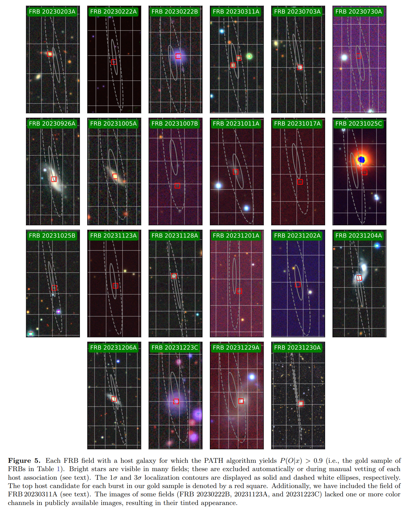

## 2025-02-03

1. [The Local Galactic Transient Survey Applied to an Optical Search for Directed Intelligence](https://arxiv.org/abs/2501.18903)

   > Transient, SETI

   传统的SETI研究主要集中在无线电频率上，但随着激光技术的不断发展，光学和近红外波段的激光通信成为了一个新的研究方向。

   LGTS旨在通过Las Cumbres Observatory的0.4米望远镜网络，探测仙女座星系（M31）、大麦哲伦云（LMC）和小麦哲伦云（SMC）中的光学瞬变信号。

   不同文明等级的激光功率
   $$
   P=F_e\epsilon_c10^{2S}
   $$
   其中$F_e$是太阳照度，$\epsilon_c$是激光转换效率，S是文明等级。

   文章的计算表明，利用本世纪可以构建的激光技术，LGTS的观测能力和TRIPP的检测能力足以探测到M31中使用的定向能量系统。

2. [Machine Learning in Gamma Astronomy](https://arxiv.org/abs/2501.19064)

   > High Energy, Deep Learning, Review

   通过成像大气切伦科夫望远镜（IACT）获得的天体粒子数据的最流行的深度学习方法，并提供了原始论文的参考文献。

   使用CNN进行**粒子类型分类**、**EAS参数重建**，使用GAN生成高质量的伽马/质子事件图像。

## 2025-02-04

1. [PyLMT: A transient detection pipeline for the 4-m International Liquid Mirror Telescope](https://arxiv.org/abs/2502.00556)

   > Transient, Deep Learning, Software

   `PyLMT`对光学图像进行微分，然后使用CNN进行判别图像中是否存在真的暂现源，然后使用另一个CNN对判断为真的暂现源进行分类。

2. [BatAnalysis -- A Comprehensive Python Pipeline for Swift BAT Time-Tagged Event Data Analysis](https://arxiv.org/abs/2502.00278)

   > High Energy, Software

   [BatAnalysis](https://github.com/parsotat/BatAnalysis)用于处理Swift Burst Alert Telescope（BAT）收集的时间标记事件（TTE）数据，包括数据获取、处理、光谱拟合和图像拼接。通过分析GRB 050724、FRB 180916、LMXB EXO 0748-676和GRB 210706A的数据，验证了软件的正确性和功能。

3. [A Fast Periodicity Detection Algorithm Sensitive to Arbitrary Waveforms](https://arxiv.org/abs/2502.00243)

   > Light Curve, Periodicity, Method

   [FPW](https://github.com/Sewhitebook/FPW)是一种相位分箱算法，通过将每个观测值分配到相应的相位箱中，计算每个周期或频率的统计量
   $$
   {\rm SFPW}=\frac{1}{\alpha^2}\sum_{m=1}^M\left[\frac{\sum_{j=1}^{Nm}x^2_{m,j}/\sigma^2_{m,j}}{\sum_{j=1}^{Nm}\left(\frac{1}{\sigma^2_{m,j}}+\frac{1}{\alpha^2}\right)}\right]
   $$
   其中，M是相位箱的数量，$Nm$是第$m$个相位箱中的观测数量，$x_{m,j}$ 是第$m$个相位箱中第$j$个光度观测值的均值减去后的值，$\sigma^2_{m,j}$是$x_{m,j}$的观测误差平方。

   用于检测非均匀采样时间序列数据中任意波形周期性。

4. [Million Points of Light (MPoL): a PyTorch library for radio interferometric imaging and inference](https://arxiv.org/abs/2502.00100)

   > Interferometry, Software

   [MPoL](https://mpol-dev.github.io/MPoL/)使用PyTorch建立了反向传播和梯度下降，用于解决射电干涉成像和推断的问题。

   

## 2025-02-05

1. [Discovery of an RRAT-like pulsar via its single pulses in an MWA imaging survey](https://arxiv.org/abs/2502.02130)

   > Pulsar, Observation

   使用MWA的成像数据检测到PSR J0031-5726，，它表现出介于正常脉冲星和RRATs之间的特征。PSR J0031-5726的单脉冲行为复杂，包括长尾的脉冲能量分布和剧烈的极化角变化。

2. [Exploring blazars through sonification. Visual and auditory insights into multifrequency variability](https://arxiv.org/abs/2502.01929)

   > Astronomy, Sonify

   结合视觉和听觉手段，展示了blazars的多频变异性分析。链接在[这里](https://www.guijongustavo.org/datasonification)。

3. [Thirty-five years of timing of M53A with Arecibo and FAST](https://arxiv.org/abs/2502.02042)

   > Pulsar, Timing, Observation

   结合FAST和Arecibo的数据给出球状星团NGC5024中的脉冲星M53A的计时解，确认伴星为一个氦白矮星。或许可以看看他们的数据有没有白矮星的辐射。

## 2025-02-06

1. [Propagation-induced Frequency-dependent Polarization Properties of Fast Radio Burst](https://arxiv.org/abs/2502.02857)

   > Fast Radio Burst, Theory

   王维扬的文章，讲FRB的辐射在等离子体中传播时，同时遇到法拉第旋转和转换，会发生偏振谱在庞加莱球面上随频率的旋转。

2. [Astromer 2](https://arxiv.org/abs/2502.02717)

   > Astronomy, Deep Learning

   [Astromer 2](https://github.com/astromer-science)使用BERT的结构，在光变曲线数据上进行训练，输出恒星标签。

3. [Earth Detecting Earth: At what distance could Earth's constellation of technosignatures be detected with present-day technology?](https://arxiv.org/abs/2502.02614)

   > SETI

   利用现有技术检测地球技术特征（technosignatures）的最大距离。

   1. **无线电传输:**
      - **间歇性天体目标无线电传输:** 例如，故意发送给外星智能的消息（METI）信号和行星雷达传输。计算得出其最大可探测距离为12000光年。
      - **持续性天体目标无线电传输:** 例如，NASA的深空网络（DSN）。其最大可探测距离为65光年。
      - **持续性全向无线电泄漏:** 例如，手机塔和电视广播站。其最大可探测距离为4.0光年。
      - **来自人造物体的无线电信号:** 例如，来自行星轨道器的下行链路。其最大可探测距离为0.97光年。
   2. **大气技术特征:**
      - 以NO₂为例，使用即将到来的6米级红外/光学/紫外望远镜进行直接成像光谱观测。计算得出其最大可探测距离为5.71光年。
   3. **光学和红外发射:**
      - **城市灯光:** 使用高压力钠灯的城市灯光。其最大可探测距离为0.036光年。
      - **定向激光:** 使用地面激光阵列和Keck II上的NIRSPEC仪器。未解析情况下的最大可探测距离为150天文单位，半解析情况下为1.8秒差距。
      - **热岛效应:** 以香港为例，计算得出其最大可探测距离为30天文单位。
   4. **空间或行星表面物体:**
      - **星际/星际探测器:** 例如，回声项目中的卫星。其最大可探测距离为0.145天文单位。
      - **行星表面物体:** 例如，阿波罗登月舱。其最大可探测距离为8600公里。
      - **卫星过境:** 以国际空间站为例，其最大可探测距离为1.3天文单位。

   人类对地球和太阳系的远程可探测影响跨越了12个数量级。

## 2025-02-07

1. [Multidisciplinary Science in the Multimessenger Era](https://arxiv.org/abs/2502.03577)

   > Astronomy, White Paper, Transient

   多信使天文学（TDAMM）在时间域和多信使天文物理学中的重要性。应用案例，核心坍缩超新星、中子星合并、快速射电暴。

2. [Self-Supervised Learning for Solar Radio Spectrum Classification](https://arxiv.org/abs/2502.03778)

   > Solar Flare, Deep Learning

   用BERT架构对太阳射电频谱图像进行预训练。

## 2025-02-10

1. [Broadband γ-ray spectrum of supernova remnant Cassiopeia A](https://arxiv.org/abs/2502.04848)

   > High Energy, Observation

   Cassiopeia A（Cas A）作为银河系中最亮的射电源之一，通过分析Fermi-LAT和LHAASO的观测数据，检测到Cas A区域有一个点状源，发现了30 GeV以上的新的光谱特征。该特征在1 TeV以上非常软，尽管SBPL和对数幂律模型都能很好地拟合LHAASO数据，但它们在10 TeV以上的预测截然不同，暗示了不同的亚PeV粒子加速过程。

   

## 2025-02-11

1. [The Host Galaxy of the Hyperactive Repeating FRB 20240114A: Behind a Galaxy Cluster](https://arxiv.org/abs/2502.05587)

   > Fast Radio Burst, Galaxy, Observation

   FRB20240114A的宿主星系的光学观测，红移0.1306，宿主星系提供200单位的DM。重复FRB和非重复FRB的星系恒星形成率分布不同。

   

2. [The dispersion measure and scattering of Fast Radio Bursts: contributions from multi-components, and clues for the intrinsic properties](https://arxiv.org/abs/2502.05838)

   > Fast Radio Burst, Statistics

   统计FRB的DM和散射，发现FRB的红移可以通过DM和散射的信息进行估计，但加上散射的信息并未显著提高估计的准确性。

3. [GDL 1.1, a smart and green language](https://arxiv.org/abs/2502.05913)

   > Astronomy, Software

   [GDL](https://github.com/gnudatalanguage/gdl)继承了IDL的功能，避免了python的GIL，变成了一个解释性语言。

## 2025-02-12

1. [Exoplanet Transit Candidate Identification in TESS Full-Frame Images via a Transformer-Based Algorithm](https://arxiv.org/abs/2502.07542)

   > Light Curve, Deep Learning

   使用Transformer结合卷积嵌入，识别TESS光变曲线中存在凌日现象的概率。

2. [The New Science of Unidentified Aerospace-Undersea Phenomena (UAP)](https://arxiv.org/abs/2502.06794)

   > Astronomy, SETI, Review

   详细回顾了从1933年至今的全球和政府对不明飞行物（UAP）的研究历史，涵盖了多个国家和时期的研究努力。包括美国的“罗斯威尔事件”、法国的“幽灵火箭”等。

## 2025-02-13

1. [Fast Radio Bursts as cosmological proxies: estimating the Hubble constant](https://arxiv.org/abs/2502.08509)

   > Fast Radio Burst, Cosmology, Statistics

   使用定位的FRB测量哈勃常数，给了98个定位的FRB，但是引用不靠谱。

2. [FEASTS: The Fate of Gas and Star Formation in Interacting Galaxies](https://arxiv.org/abs/2502.08218)

   > Galaxy, Statistics

   使用FAST扩展目标样本调查（FEASTS，王菁他们的数据）的高灵敏度HI数据，选择具有显著HI潮汐特征的相互作用系统和随机选择的孤立星系作为对照样本。

   发现相互作用星系的HI分布更广，膨胀更大，并且在系统的两端堆积。次星系的恒星形成率普遍受到抑制，表明气体去除的影响大于气体压缩和流入的影响。

## 2025-02-14

1. [Altitude Estimation of Radio Frequency Interference Sources via Interferometric Near Field Corrections](https://arxiv.org/abs/2502.08867)

   > Radio, RFI

   通过干涉近场校正估计射频干扰源的高度。

   1. **远场相位调整:**
      使用pyuvdata包对数据进行远场相位调整，以确保信号来自远场的假设成立。这需要对源的位置有精确的了解。

   2. **波束成形:**
      通过平均所有可见度，将阵列波束集中在图像空间的单个“像素”上，从而隔离该像素内的源强度。这种方法用于估计任何无线电源的强度。

   3. **近场校正:**
      对于近场对象，应用近场校正以将其聚焦。通过假设阵列和对象之间的径向焦距，计算几何校正。公式如下：
      $$
      f_x=f_{\rm dist}\times\cos(\phi)\times\sin(\theta)
      f_y=f_{\rm dist}\times\sin(\phi)
      f_z=f_{\rm dist}\times\cos(\phi)\times\cos(\theta)
      $$
      

      其中，$f_{\rm dist}$是假设的焦距，$\phi$和$\theta$是对象的方位角和极角。

   4. **相位校正:**
      计算近场相位校正：
      $$
      \Delta\phi_{i, j}=\exp^{i2\pi\frac{\Delta w_{i,j}}{\lambda}}
      $$
      

      其中$\Delta w_{i,j}=w_{{\rm near-field},i,j}-w_{{\rm far-field},i,j}$是近场和远场的延迟差，$\lambda$是观测波长。

      使用Murchison Widefield Array（MWA）的Phase I观测数据，观测ID为1061313128，持续时间为两分钟，频率范围为167到198 MHz，估计了RFI发射源的平均高度为11.7公里，速度为792公里/小时，表明其可能是一架飞机。

      

2. [Searching for axion dark matter gegenschein of the Vela supernova remnant with FAST](https://arxiv.org/abs/2502.08913)

   > Radio, High Energy

   轴子作为暗物质候选粒子之一。如果在银河系暗物质晕中嵌入轴子，它们的激发衰变将使我们能够观测到一个反像（“轴子反光”），其频率等于轴子质量的一半，位于明亮射电源的相反方向。

   使用FAST观测Vela超新星遗迹的轴子反光图像，没有探测到的有效的信号，可以在某一个质量范围内给出轴子-光子耦合强度上限。

## 2025-02-17

1. [Contemporaneous optical-radio observations of a fast radio burst in a close galaxy pair](https://arxiv.org/abs/2502.10153)

   > Fast Radio Burst, Observation, Galaxy

   MeerTRAP探测到FRB20230808F，色散653.2。在FRB到达后3.4秒开始MeerLICHT开始光学观测，尝试寻找光学对应体，没有找到。通过SALT光谱观测，确定FRB的宿主星系为一对近距离的星系，红移为0.3472。

   

   他们用[CHIME的方法](https://doi.org/10.1051/0004-6361/202243339)（不是Nature那篇，是后来AA的那篇，方法类似）检测准周期，信号不显著。

2. [ExoMiner++ on TESS with Transfer Learning from Kepler: Transit Classification and Vetting Catalog for 2-min Data](https://arxiv.org/abs/2502.09790)

   > Transient, Deep Learning, Light Curve

   `ExoMiner++`用多特征解决TESS数据中行星信号分类的问题。

   

## 2025-02-18

1. [A very young tau-Herculid meteor cluster observed during a 2022 shower outburst](https://arxiv.org/abs/2502.11580)

   > Meteor, Statistics

   在2022年5月31日，两台摄像机在8.5秒内探测到52颗流星。使用FishScan软件手动测量流星记录，并使用Boltrack程序的新模块计算流星的大气轨迹。模拟不同ZHR下的流星出现概率，发现观测到的流星群不是随机出现的，而是流星雨中的一个真实流星群。

   流星群的质量分布显示出两个不同的幂律斜率，质量大于0.08克的碎片，幂律指数为-2.1。

   

2. [A Catalog of Local Universe Fast Radio Bursts from CHIME/FRB and the KKO Outrigger](https://arxiv.org/abs/2502.11217)

   > Fast Radio Burst, Observation, Localization

   通过CHIME和KKO对81个FRB的定位，使用PATH算法识别到21个FRB宿主星系，并获得了19个星系的光谱红移。

   

3. [A Possible Four-Month Periodicity in the Activity of FRB 20240902A](https://arxiv.org/abs/2502.11215)

   > Fast Radio Burst, Periodicity

   他题目写错了。根据CHIME的[Repeater的数据](https://www.chime-frb.ca/repeaters/FRB20240209A)看到FRB20240209A的周期，大概123.6天，但只有三个周期。

   

4. [Repeating fast radio bursts from synchrotron maser radiation in localized plasma blobs: Application to FRB 20121102A](https://arxiv.org/abs/2502.11103)

   > Fast Radio Burst, Theory

   提出重复的FRBs是由弱磁化等离子体中局部等离子团块内的同步辐射激微波辐射引起的，该等离子体相对论性地向观测者移动。

5. [Image Pre-Processing Framework for Time-Domain Astronomy in the Artificial Intelligence Era](https://arxiv.org/abs/2502.10783)

   > Astronomy, Deep Learning

   介绍了一个用于时间域天文学图像预处理的框架，旨在通过集成针对图形处理单元（GPU）架构优化的关键算法来提高图像预处理的效率。

   

## 2025-02-19

1. [Improved constraints on the Faraday rotation towards eight fast radio bursts using dense grids of polarized radio galaxies](https://arxiv.org/abs/2502.12263)

   > Fast Radio Burst, Polarization, Observation

   对8个FRB的2-4GHz的VLA观测，测量RM，限制FRB周围1平方度范围的银河系RM。发现与Hutschenreuter et al. 2022的结果相差几个单位到40个单位。将结果推广到已知偏振的FRB，可能错误的估计了30%的FRB的宿主星系RM。

   

## 2025-02-20

1. [White Dwarf Variability](https://arxiv.org/abs/2502.13258)

   > White Dwarf, Light Curve, Variable

   总结了白矮星光变机制及其对恒星物理结构和形成的影响。白矮星的光变主要有三种机制：恒星脉动、自转和双星系统中的潮汐变形。

   

## 2025-02-21

1. [Constraints on optical and near-infrared variability in the localisation of the long-period radio transient GLEAM-X J1627-52](https://arxiv.org/abs/2502.14688)

   > Transient, LPT, Optical

   对GLEAM-X J1627-52周围的光学和近红外源进行详细搜索，未能发现明显的对应体。

   

2. [The Thousand-Pulsar-Array programme on MeerKAT XVII: Discovery of beating radio emission variability in PSR J1514-4834](https://arxiv.org/abs/2502.14481)

   > Pulsar, Periodicity

   PSR J1514-4834表现出复杂次脉冲调制模式，包括快速振幅调制和漂移次脉冲的共存现象。

   

   对MeerKAT观测数据的堆叠图进行二维傅里叶变换，发现漂移次脉冲的周期约为40P，而闪烁（快速振幅调制）的周期约为2P（即0.45秒）。

   通过计算傅里叶相位相关性，验证了次脉冲的漂移和闪烁特征确实存在拍频特征。傅里叶相位的相关性表明这些特征是由两个独立的周期性过程引起的。

## 2025-02-24

