## 2025-03-03

1. [The Chinese pulsar timing array data release I. Polarimetry for 56 millisecond pulsars](https://arxiv.org/abs/2502.20820)

   > Pulsar, Polarization, PTA

   研究CPTA中的56颗毫秒脉冲星的偏振。大多数MSPs显示出较弱的成分（低于峰值流量的3%），25%的脉冲星显示出类似间脉冲的结构，大多数脉冲星显示出线性偏振位置角度跳跃。偏振百分比的分布与正常脉冲星的分布一致，表明MSPs的偏振特性与正常脉冲星相似。计算了每个脉冲星的RM和DM值，发现RM的变化可能与脉冲轮廓的频率演化有关。

   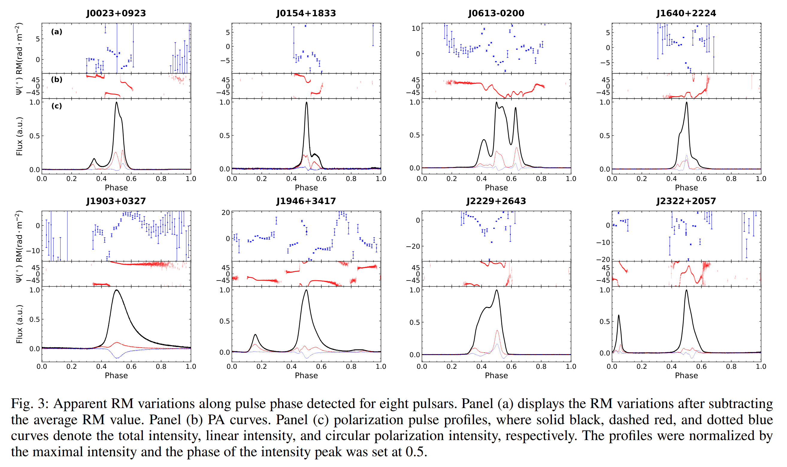

## 2025-03-04

1. [The Host Galaxy of FRB 20190520B and Its Unique Ionized Gas Distribution](https://arxiv.org/abs/2503.01740)

   > Fast Radio Burst, Galaxy, Observation

   陈向蕾的文章，讲FRB 190520的宿主星系。PRS和FRB的位置位于Ha辐射的峰值，根据Ha辐射估计DM贡献为950个单位。

2. [An Unusual Change in the Radio Jets of GRS 1915+105](https://arxiv.org/abs/2503.01105)

   > High Energy, Radio, Observation

   GRS 1915+105（或称天鹰座V1487）是由一颗规则恒星和黑洞组成的X射线双星系统，“GRS”缩写自“源自GRANAT（GRANAT source）”。

   这篇文章讲VLA对这个源的观测，在1994年和2023年，发现喷流的位置角在30年间发生了偏转。认为这些突然的变化可能是由于该系统中存在一个未被发现的三级成分。

   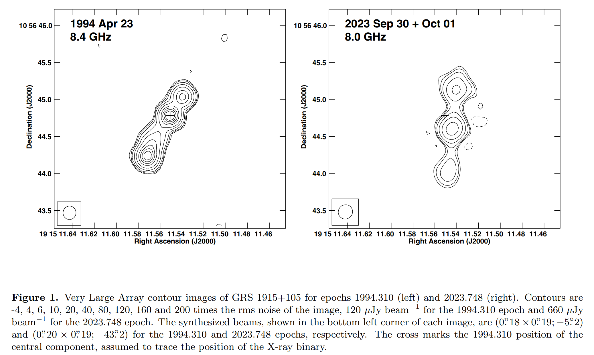

## 2025-03-05

1. [Mapping the Milky Way in 5-D with 170 Million Stars](https://arxiv.org/abs/2503.02200)

   > Stellar, Catalog

   使用[BRUTUS](https://github.com/joshspeagle/brutus)处理Pan-STARRS、2MASS、UKIDSS、unWISE和Gaia DR2的光度和天体测量数据，得到125万颗恒星的参数，建立了[Augustus](http://allsky.s3-website.us-east-2.amazonaws.com/)恒星目录。

   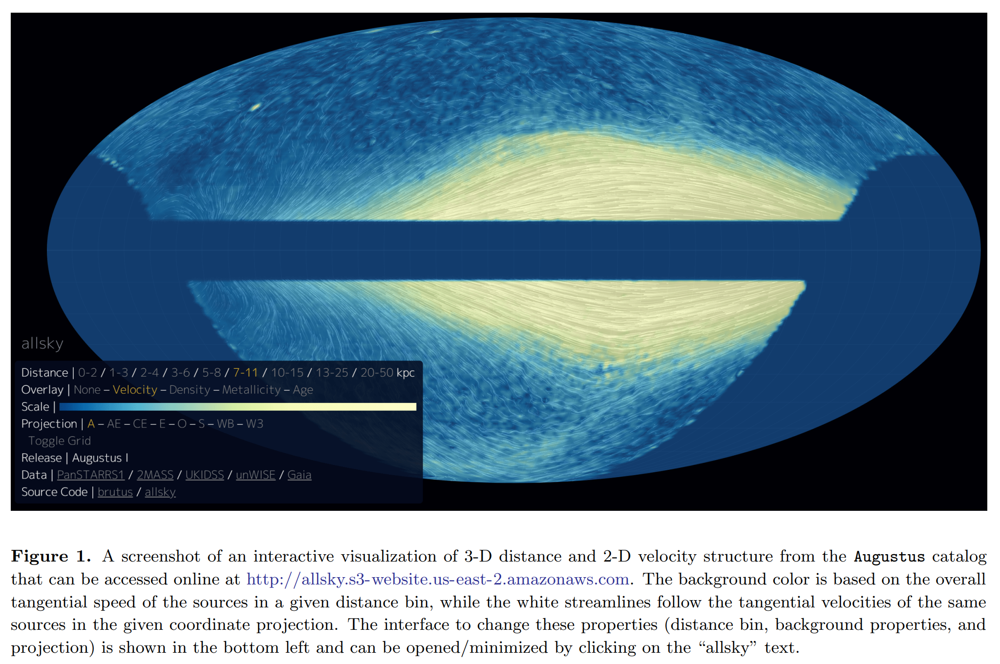

2. [Microphysics of Circumgalactic Turbulence Probed by Fast Radio Bursts and Quasars](https://arxiv.org/abs/2503.02329)

   > Fast Radio Burst, Cosmology

   总结了通过FRBs和类星体观测来研究CGM湍流微观物理的方法。结果表明，CGM中的密度波动幅度较小，对FRB散射的贡献有限。然而，通过联合类星体和FRB观测，可以在一定程度上限制CGM湍流的耗散尺度。

3. [Constraints on the X-ray-to-radio fluence ratio of FRB 20240114A](https://arxiv.org/abs/2503.02580)

   > Fast Radio Burst, Observation, High Energy

   对FRB20240114A的射电和X射线同步观测。在2024年5月23日，使用Effelsberg探测到459次爆发，从1.3GHz到6GHz都有。X射线没找到爆发，射电最亮的流量是$1.4\times10^{-17}\,\rm erg/cm^2$，给出X射线和射电的能量比$\eta_{x/r}<1.2\times10^7$，这个值对SGR1935是$\eta_{x/r}\sim2.5\times10^5$。因此认为FRB与SGR的射电暴的机制是一致的。

## 2025-03-06

1. [Evidence for a hot galactic halo around the Andromeda Galaxy using fast radio bursts](https://arxiv.org/abs/2503.02947)

   > Fast Radio Burst, Galaxy, ISM

   使用VLA定位FRB 20230903A在红移0.09的星系，FRB 20230506C在红移0.39的星系，两个FRB都穿过M31的晕。估计了M31对DM的贡献，认为M31的需要有一个热晕才能提供足够的DM。作为M31存在热晕的间接证据。

## 2025-03-07

1. [An active repeating fast radio burst in a magnetized eruption environment](https://arxiv.org/abs/2503.04727)

   > Fast Radio Burst, Observation

   李晔的文章，FAST看fRB 20220529。

2. [Quasi-periodic oscillations of GHz-band polarization in a black hole](https://arxiv.org/abs/2503.04011)

   > Black Hole, Periodicity

   GRS 1915+105偏振流量变化，有准周期。在时间分辨率0.5s的情况下直接看时间序列。

   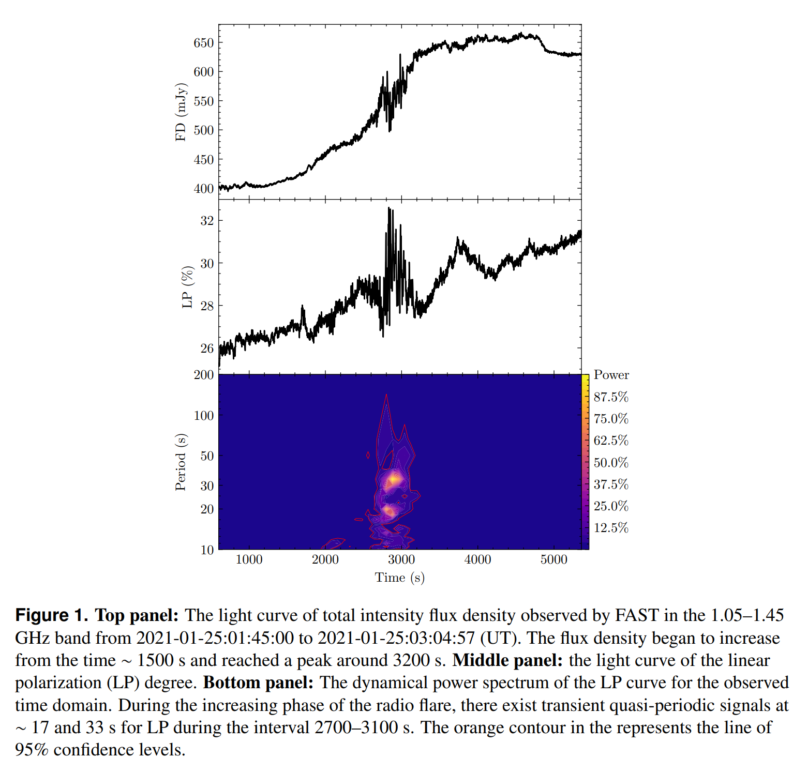

3. [Finding White Dwarfs' Hidden Companions using an Unsupervised Machine Learning Technique](https://arxiv.org/abs/2503.04672)

   > Stellar, White Dwarf, Machine Learning

   通过Gaia CMD的颜色和天体测量选择白矮星候选体，然后使用[自组织映射SOM](https://github.com/JustGlowing/minisom/)应用到[Gaia的BP/RP光谱](https://gaia-dpci.github.io/GaiaXPy-website/)上，识别出两个主要由白矮星伴星（用SDSS和LAMOST确认的白矮星伴星数据）组成的神经元，并将其标记为白矮星伴星神经元。从这两个神经元中找到993个白矮星伴星，其中801个未被文献报道过。

   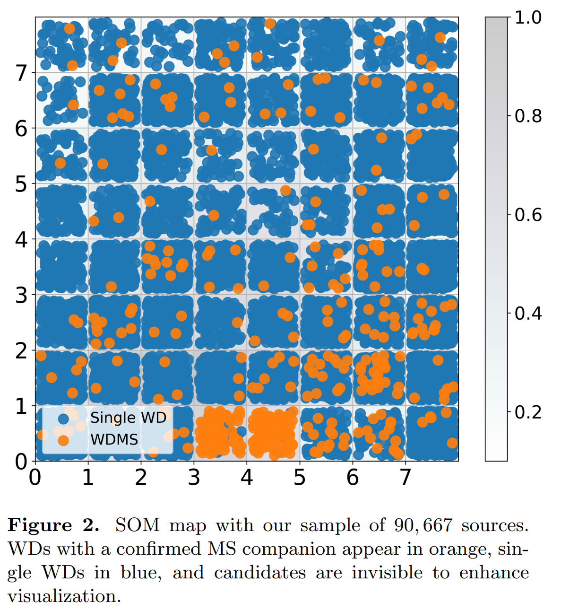

   展示了SOM算法在识别Gaia XP光谱中的细微规律方面的强大能力。

4. [Magnetars](https://arxiv.org/abs/2503.04442)

   > Magnetar, Review

   磁星的综述。

   1. **磁星的定义和特性**：
      - **定义:** 磁星是一种孤立的中子星，其特征是拥有极强的磁场。
      - **发现:** 磁星最初通过其X射线和伽马射线爆发被发现，随后被识别为具有异常大X射线光度的脉冲星。
      - **能量辐射:** 磁星在不同能量带（从无线电到伽马射线）发射，表现出多种高能瞬变现象。
   2. **磁星的稳态辐射**：
      - **X射线和伽马射线:** 磁星的持续X射线辐射是其能量的主要释放方式，通常由一个或多个黑体成分和一个或多个幂律成分描述。
      - **光学和红外:** 大约三分之一的已知磁星在光学或红外波段有对应体，但其亮度较低且受银河系红化影响。
      - **无线电:** 部分磁星在无线电波段发射，显示出间歇性或突发性的爆发，通常与X射线爆发同时发生。
   3. **磁星的爆发和活动**：
      - **短爆发:** 这些是最频繁但能量最低的爆发，持续时间约为0.1-0.2秒，峰值光度为$10^{38}-10^{40}$ erg/s。
      - **中间爆发:** 持续时间介于短爆发和巨型爆发之间，光度可达$10^{41}-10^{32}$ erg/s。
      - **巨型爆发:** 这是最具能量的爆发事件之一，光度可达$10^{43}-10^{45}$ erg/s，仅记录了三次。
   4. **磁星的建模**：
      - **光谱建模:** 磁星的光谱由热辐射和复杂的磁层相互作用产生，通常使用黑体模型和幂律成分描述。
      - **磁场演化:** 磁场的演化通过欧姆耗散和霍尔效应描述，磁场衰减会影响磁星的热光度。

## 2025-03-10

1. [The Chemical Composition of the Sun](https://arxiv.org/abs/2503.05402)

   > Solar, Review

   通过对太阳光球层、太阳风、日冕和中微子的综合分析，提供了太阳化学成分的详细信息。

   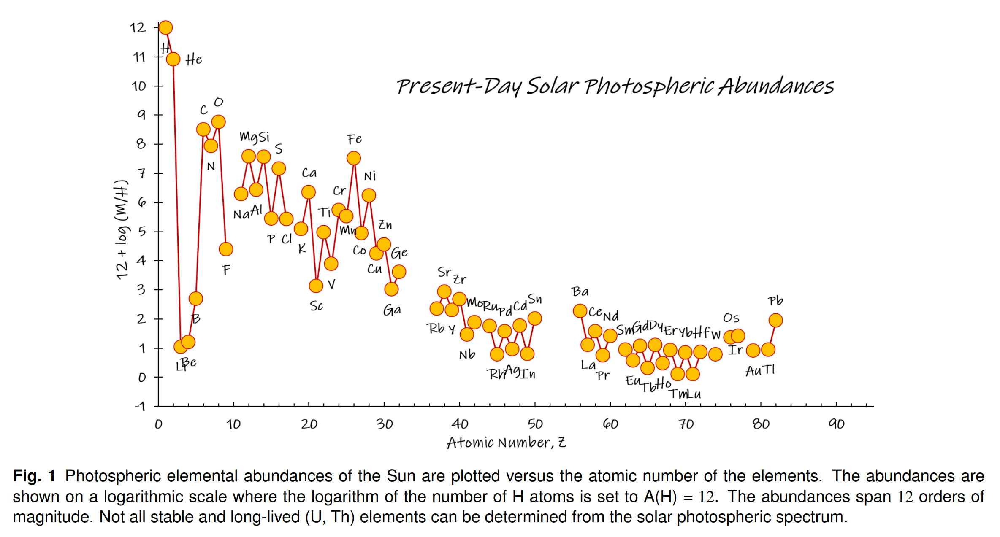

## 2025-03-11

1. [Constraints on Evolutions of Fundamental Constants from Clustering of Fast Radio Burst Dispersion Measure](https://arxiv.org/abs/2503.06120)

   > Fast Radio Burst, Cosmology

   通过分析FRB的DM与前景星系的交叉相关信号，约束精细结构常数$\alpha$的演化。

2. [First detection of variable radio emission originating from the infant planetary system V1298 Tau](https://arxiv.org/abs/2503.05952)

   > Stellar, Radio, Observation

   `V1298 Tau`是一颗非常年轻且磁活动活跃的K1V恒星，并且有着多行星系统。这里使用VLA、uGMRT和SRT进行观测，在VLA的C波段探测到射电流量。

   - 射电辐射的高峰值出现在光学光曲线的最小值相位附近，表明射电辐射可能与恒星磁活动相关。
   - 所有检测到的射电辐射均未显示显著的圆偏振，表明射电辐射可能不是由电子回旋脉泽发射机制产生的。

   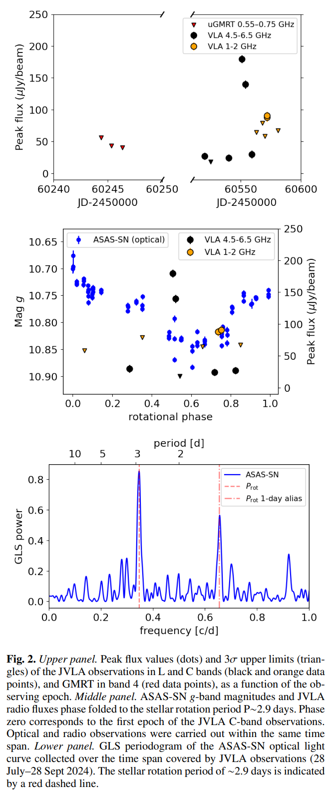

## 2025-03-12

1. [A Neural Symbolic Model for Space Physics](https://arxiv.org/abs/2503.07994)

   > Deep Learning, Symbolic Regression

   [PhyE2E](https://github.com/Jie0618/PhysicsRegression)是一个新的AI模型，用于通过符号回归发现物理公式。

   1. **预训练语言模型**：首先，使用现有的物理公式对大型语言模型（LLM）进行微调，使其能够生成与物理公式统计分布一致的公式。
   2. **端到端模型**：其次，基于Transformer模型训练一个端到端的公式回归模型，将数据矩阵直接转换为逆波兰表示法的符号公式。
   3. **公式分解技术**：为了降低搜索复杂度，开发了一种公式分解技术，能够将没有非线性（或对数非线性）关系的变量分组，生成一系列更简单的子公式。
   4. **优化算法**：利用最先进的遗传算法（GA）和蒙特卡罗树搜索（MCTS）方法进一步细化预测的公式。

   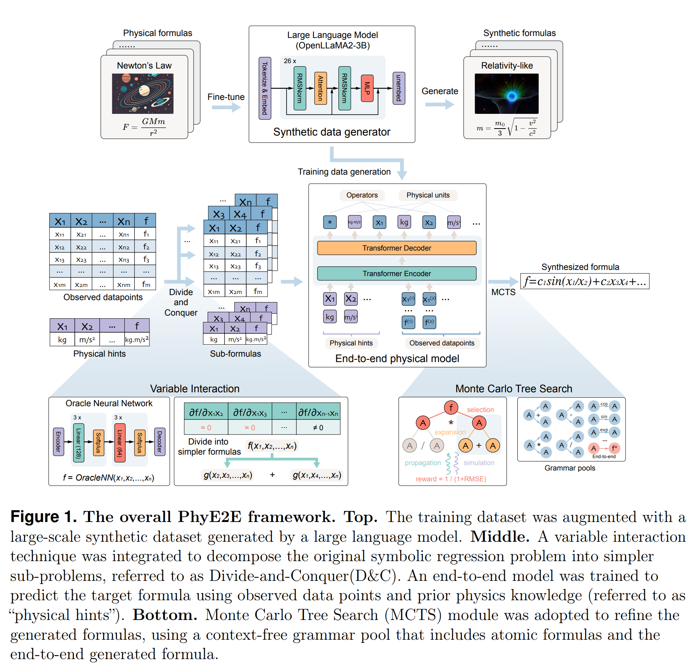

   `PhyE2E`的准确率要比`Feynman`等符号回归方法高40%，也用在了太阳黑子活动周期的拟合上。他们图搞得不错。

   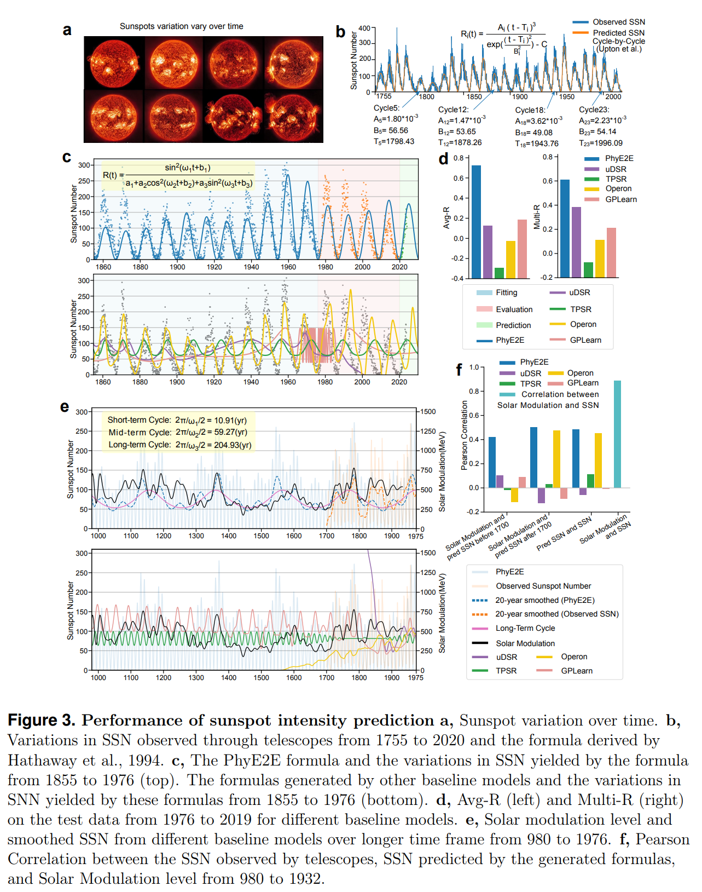

2. [A radio transient with unusually slow periodic emission](https://arxiv.org/abs/2503.08033)

   > Radio, Transient, LPT, Observation

   MWA发现的`GLEAM-X J 162759.5-523504.3`，靠近银盘，在低频72-231MHz，周期18.18分钟，高线偏振度，没有X射线发射。2022年发表在Nature上，现在统称这类源是长周期射电源。

   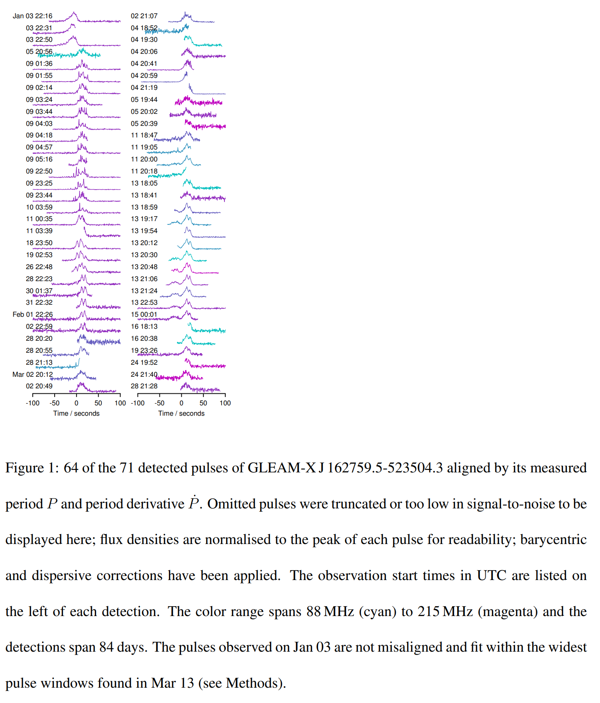

3. [A long-period radio transient active for three decades](https://arxiv.org/abs/2503.08036)

   > Radio, Transient, LPT, Observation

   MWA发现的`GPMJ1839-10`，周期21分钟，脉冲持续时间30-300s，有准周期结构，并且在VLA历史数据中发现，活动持续了30多年。

   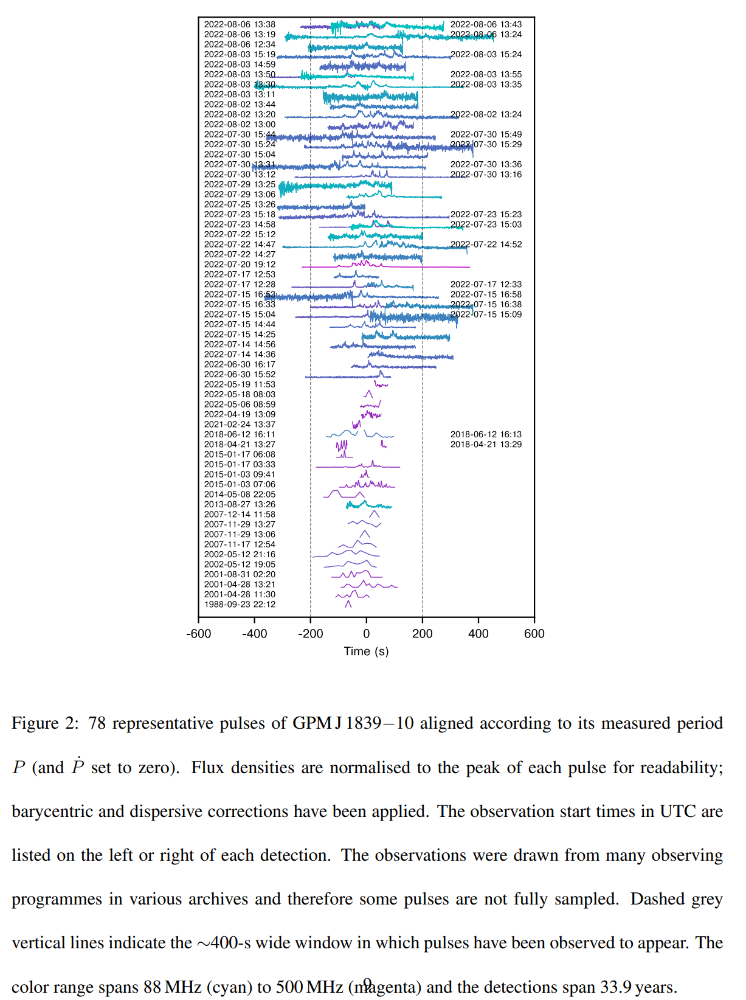

4. [The discovery of a 41-second radio pulsar PSR J0311+1402 with ASKAP](https://arxiv.org/abs/2503.07936)

   > Radio, Transient, Pulsar, Observation

   ASKAP发现的`PSR J0311+1402`，周期40.9s的脉冲星。

   - **脉冲星特性:** PSR J0311+1402表现出低线性极化（约25%）和圆极化（约5%），光谱指数较陡（约-2.3），这些特征与正常脉冲星相似。
   - **自转衰减:** 其自转衰减特性使其位于脉冲星死亡线以下，表明其无线电发射可能无法仅由旋转能量驱动。
   - **位置:** PSR J0311+1402位于银河系高纬度区域，与其他LPTs不同，显示出较低的极化和较高的银河系纬度。

   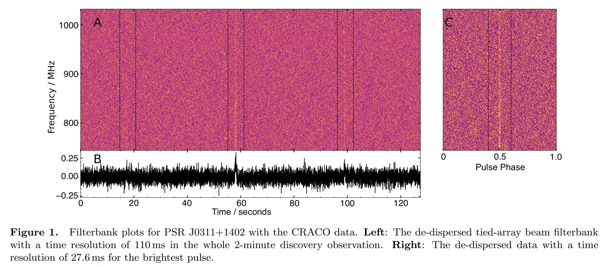

5. [Probing Globular Cluster with MeerKAT and FAST: A Pulsar Polarization Census](https://arxiv.org/abs/2503.08291)

   > Pulsar, Observation

   张蕾的文章，使用MeerKAT和FAST望远镜对8个球状星团中的43颗脉冲星进行了观测。

6. [Utilizing localized fast radio bursts to constrain their progenitors and the expansion history of the Universe](https://arxiv.org/abs/2503.08441)

   > Fast Radio Burst, Cosmology

   根据110个定位的FRB，选择了24个有散射时标测量的样本估计哈勃常数，在1sigma置信区间内兼容不同的测量结果。

7. [CSST Strong Lensing Preparation: Fast Modeling of Galaxy-Galaxy Strong Lenses in the Big Data Era](https://arxiv.org/abs/2503.08586)

   > Gravitational Lensing, Deep Learning

   [TinyLensGPU](https://github.com/caoxiaoyue/TinyLensGpu)是使用GPU对引力透镜进行建模的工具。

   - 使用JAX库进行GPU加速，通过XLA库编译Python代码，实现高效的GPU执行。
   - 采用nautilus-sampler算法，利用神经网络增强嵌套采样，减少对局部最优解的敏感性，从而提高采样效率。

   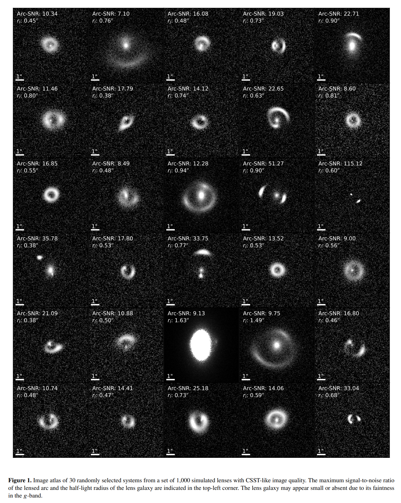

## 2025-03-13

1. [AGILE observations of a sample of repeating Fast Radio Burst sources](https://arxiv.org/abs/2503.08951)

   > Fast Radio Burst, High Energy

   研究FRB的高能对应体。筛选重复暴的爆发时间戳，搜索AGILE卫星的MCAL（硬X射线观测）、GRID（伽马射线观测）和SuperAGILE（硬X射线成像）探测器中对应时间点的高能信号，没有发现任何天体物理信号，但推导出的通量上限为理解FRB的高能对应物提供了重要信息。

2. [FAST Discovery of A Gas-rich and Ultra-faint Dwarf Galaxy: KK153](https://arxiv.org/abs/2503.08999)

   > Galaxy, HI, Observation

   朱明他们的文章，使用FAST漂移扫描模式观测星系KK153，是一个富含气体的星系，动力学质量是重子质量的60倍。KK153的发现为研究宇宙再电离理论提供了新的挑战，因为其低质量和高气体含量的特征与现有的宇宙再电离模型存在差异。

   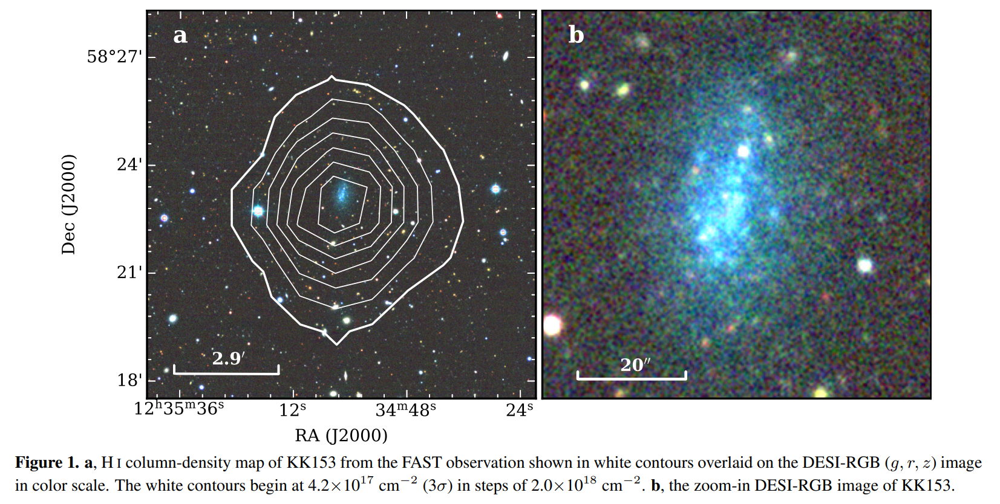

3. [Exploring symbolic regression and genetic algorithms for astronomical object classification](https://arxiv.org/abs/2503.09220)

   > Galaxy, Symbolic Regression

   根据SDSS DR17中星表的参数（比如不同波段星等、红移等），使用符号回归对天体进行分类（恒星、星系、活动星系核）。

## 2025-03-14

1. [Anomaly Detection to identify Transients in LSST Time Series Data](https://arxiv.org/abs/2503.09699)

   > Stellar, Machine Learning, Anomaly Detection

   使用孤立森林`iForest`在无信号光变曲线上进行训练，实现对LSST光变曲线的异常检测，来探测变星，包括点状微引力透镜事件（ML）、二元微引力透镜（Binary ML）、以及由扩展物体引起的微引力透镜：NFW亚晕和玻色星（BS）。

   实验表明，至少需要20个观测时间戳才能可靠地过滤掉无信号光变曲线，而大约需要30个时间戳才能可靠地捕捉到瞬变现象。训练数据和模型在[这里](https://zenodo.org/records/15005108)。

## 2025-03-17

