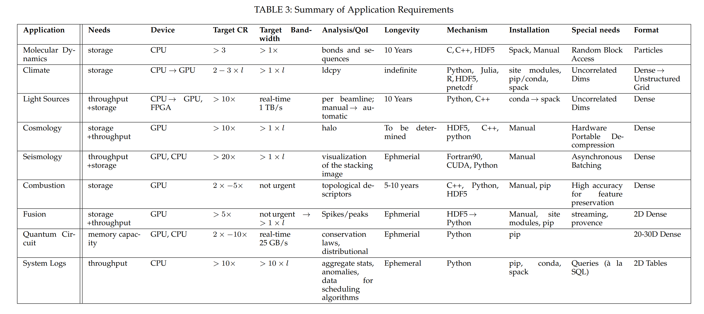
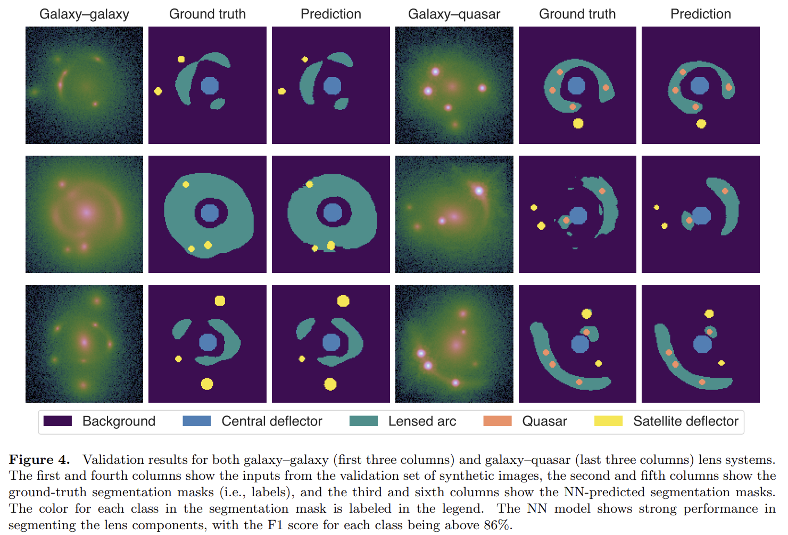

## 2025-03-03

1. [The Chinese pulsar timing array data release I. Polarimetry for 56 millisecond pulsars](https://arxiv.org/abs/2502.20820)

   > Pulsar, Polarization, PTA

   研究CPTA中的56颗毫秒脉冲星的偏振。大多数MSPs显示出较弱的成分（低于峰值流量的3%），25%的脉冲星显示出类似间脉冲的结构，大多数脉冲星显示出线性偏振位置角度跳跃。偏振百分比的分布与正常脉冲星的分布一致，表明MSPs的偏振特性与正常脉冲星相似。计算了每个脉冲星的RM和DM值，发现RM的变化可能与脉冲轮廓的频率演化有关。

   

## 2025-03-04

1. [The Host Galaxy of FRB 20190520B and Its Unique Ionized Gas Distribution](https://arxiv.org/abs/2503.01740)

   > Fast Radio Burst, Galaxy, Observation

   陈向蕾的文章，讲FRB 190520的宿主星系。PRS和FRB的位置位于Ha辐射的峰值，根据Ha辐射估计DM贡献为950个单位。

2. [An Unusual Change in the Radio Jets of GRS 1915+105](https://arxiv.org/abs/2503.01105)

   > High Energy, Radio, Observation

   GRS 1915+105（或称天鹰座V1487）是由一颗规则恒星和黑洞组成的X射线双星系统，“GRS”缩写自“源自GRANAT（GRANAT source）”。

   这篇文章讲VLA对这个源的观测，在1994年和2023年，发现喷流的位置角在30年间发生了偏转。认为这些突然的变化可能是由于该系统中存在一个未被发现的三级成分。

   

## 2025-03-05

1. [Mapping the Milky Way in 5-D with 170 Million Stars](https://arxiv.org/abs/2503.02200)

   > Stellar, Catalog

   使用[BRUTUS](https://github.com/joshspeagle/brutus)处理Pan-STARRS、2MASS、UKIDSS、unWISE和Gaia DR2的光度和天体测量数据，得到125万颗恒星的参数，建立了[Augustus](http://allsky.s3-website.us-east-2.amazonaws.com/)恒星目录。

   

2. [Microphysics of Circumgalactic Turbulence Probed by Fast Radio Bursts and Quasars](https://arxiv.org/abs/2503.02329)

   > Fast Radio Burst, Cosmology

   总结了通过FRBs和类星体观测来研究CGM湍流微观物理的方法。结果表明，CGM中的密度波动幅度较小，对FRB散射的贡献有限。然而，通过联合类星体和FRB观测，可以在一定程度上限制CGM湍流的耗散尺度。

3. [Constraints on the X-ray-to-radio fluence ratio of FRB 20240114A](https://arxiv.org/abs/2503.02580)

   > Fast Radio Burst, Observation, High Energy

   对FRB20240114A的射电和X射线同步观测。在2024年5月23日，使用Effelsberg探测到459次爆发，从1.3GHz到6GHz都有。X射线没找到爆发，射电最亮的流量是$1.4\times10^{-17}\,\rm erg/cm^2$，给出X射线和射电的能量比$\eta_{x/r}<1.2\times10^7$，这个值对SGR1935是$\eta_{x/r}\sim2.5\times10^5$。因此认为FRB与SGR的射电暴的机制是一致的。

## 2025-03-06

1. [Evidence for a hot galactic halo around the Andromeda Galaxy using fast radio bursts](https://arxiv.org/abs/2503.02947)

   > Fast Radio Burst, Galaxy, ISM

   使用VLA定位FRB 20230903A在红移0.09的星系，FRB 20230506C在红移0.39的星系，两个FRB都穿过M31的晕。估计了M31对DM的贡献，认为M31的需要有一个热晕才能提供足够的DM。作为M31存在热晕的间接证据。

## 2025-03-07

1. [An active repeating fast radio burst in a magnetized eruption environment](https://arxiv.org/abs/2503.04727)

   > Fast Radio Burst, Observation

   李晔的文章，FAST看fRB 20220529。

2. [Quasi-periodic oscillations of GHz-band polarization in a black hole](https://arxiv.org/abs/2503.04011)

   > Black Hole, Periodicity

   GRS 1915+105偏振流量变化，有准周期。在时间分辨率0.5s的情况下直接看时间序列。

   

3. [Finding White Dwarfs' Hidden Companions using an Unsupervised Machine Learning Technique](https://arxiv.org/abs/2503.04672)

   > Stellar, White Dwarf, Machine Learning

   通过Gaia CMD的颜色和天体测量选择白矮星候选体，然后使用[自组织映射SOM](https://github.com/JustGlowing/minisom/)应用到[Gaia的BP/RP光谱](https://gaia-dpci.github.io/GaiaXPy-website/)上，识别出两个主要由白矮星伴星（用SDSS和LAMOST确认的白矮星伴星数据）组成的神经元，并将其标记为白矮星伴星神经元。从这两个神经元中找到993个白矮星伴星，其中801个未被文献报道过。

   

   展示了SOM算法在识别Gaia XP光谱中的细微规律方面的强大能力。

4. [Magnetars](https://arxiv.org/abs/2503.04442)

   > Magnetar, Review

   磁星的综述。

   1. **磁星的定义和特性**：
      - **定义:** 磁星是一种孤立的中子星，其特征是拥有极强的磁场。
      - **发现:** 磁星最初通过其X射线和伽马射线爆发被发现，随后被识别为具有异常大X射线光度的脉冲星。
      - **能量辐射:** 磁星在不同能量带（从无线电到伽马射线）发射，表现出多种高能瞬变现象。
   2. **磁星的稳态辐射**：
      - **X射线和伽马射线:** 磁星的持续X射线辐射是其能量的主要释放方式，通常由一个或多个黑体成分和一个或多个幂律成分描述。
      - **光学和红外:** 大约三分之一的已知磁星在光学或红外波段有对应体，但其亮度较低且受银河系红化影响。
      - **无线电:** 部分磁星在无线电波段发射，显示出间歇性或突发性的爆发，通常与X射线爆发同时发生。
   3. **磁星的爆发和活动**：
      - **短爆发:** 这些是最频繁但能量最低的爆发，持续时间约为0.1-0.2秒，峰值光度为$10^{38}-10^{40}$ erg/s。
      - **中间爆发:** 持续时间介于短爆发和巨型爆发之间，光度可达$10^{41}-10^{32}$ erg/s。
      - **巨型爆发:** 这是最具能量的爆发事件之一，光度可达$10^{43}-10^{45}$ erg/s，仅记录了三次。
   4. **磁星的建模**：
      - **光谱建模:** 磁星的光谱由热辐射和复杂的磁层相互作用产生，通常使用黑体模型和幂律成分描述。
      - **磁场演化:** 磁场的演化通过欧姆耗散和霍尔效应描述，磁场衰减会影响磁星的热光度。

## 2025-03-10

1. [The Chemical Composition of the Sun](https://arxiv.org/abs/2503.05402)

   > Solar, Review

   通过对太阳光球层、太阳风、日冕和中微子的综合分析，提供了太阳化学成分的详细信息。

   

## 2025-03-11

1. [Constraints on Evolutions of Fundamental Constants from Clustering of Fast Radio Burst Dispersion Measure](https://arxiv.org/abs/2503.06120)

   > Fast Radio Burst, Cosmology

   通过分析FRB的DM与前景星系的交叉相关信号，约束精细结构常数$\alpha$的演化。

2. [First detection of variable radio emission originating from the infant planetary system V1298 Tau](https://arxiv.org/abs/2503.05952)

   > Stellar, Radio, Observation

   `V1298 Tau`是一颗非常年轻且磁活动活跃的K1V恒星，并且有着多行星系统。这里使用VLA、uGMRT和SRT进行观测，在VLA的C波段探测到射电流量。

   - 射电辐射的高峰值出现在光学光曲线的最小值相位附近，表明射电辐射可能与恒星磁活动相关。
   - 所有检测到的射电辐射均未显示显著的圆偏振，表明射电辐射可能不是由电子回旋脉泽发射机制产生的。

   

## 2025-03-12

1. [A Neural Symbolic Model for Space Physics](https://arxiv.org/abs/2503.07994)

   > Deep Learning, Symbolic Regression

   [PhyE2E](https://github.com/Jie0618/PhysicsRegression)是一个新的AI模型，用于通过符号回归发现物理公式。

   1. **预训练语言模型**：首先，使用现有的物理公式对大型语言模型（LLM）进行微调，使其能够生成与物理公式统计分布一致的公式。
   2. **端到端模型**：其次，基于Transformer模型训练一个端到端的公式回归模型，将数据矩阵直接转换为逆波兰表示法的符号公式。
   3. **公式分解技术**：为了降低搜索复杂度，开发了一种公式分解技术，能够将没有非线性（或对数非线性）关系的变量分组，生成一系列更简单的子公式。
   4. **优化算法**：利用最先进的遗传算法（GA）和蒙特卡罗树搜索（MCTS）方法进一步细化预测的公式。

   

   `PhyE2E`的准确率要比`Feynman`等符号回归方法高40%，也用在了太阳黑子活动周期的拟合上。他们图搞得不错。

   

2. [A radio transient with unusually slow periodic emission](https://arxiv.org/abs/2503.08033)

   > Radio, Transient, LPT, Observation

   MWA发现的`GLEAM-X J 162759.5-523504.3`，靠近银盘，在低频72-231MHz，周期18.18分钟，高线偏振度，没有X射线发射。2022年发表在Nature上，现在统称这类源是长周期射电源。

   

3. [A long-period radio transient active for three decades](https://arxiv.org/abs/2503.08036)

   > Radio, Transient, LPT, Observation

   MWA发现的`GPMJ1839-10`，周期21分钟，脉冲持续时间30-300s，有准周期结构，并且在VLA历史数据中发现，活动持续了30多年。

   

4. [The discovery of a 41-second radio pulsar PSR J0311+1402 with ASKAP](https://arxiv.org/abs/2503.07936)

   > Radio, Transient, Pulsar, Observation

   ASKAP发现的`PSR J0311+1402`，周期40.9s的脉冲星。

   - **脉冲星特性:** PSR J0311+1402表现出低线性极化（约25%）和圆极化（约5%），光谱指数较陡（约-2.3），这些特征与正常脉冲星相似。
   - **自转衰减:** 其自转衰减特性使其位于脉冲星死亡线以下，表明其无线电发射可能无法仅由旋转能量驱动。
   - **位置:** PSR J0311+1402位于银河系高纬度区域，与其他LPTs不同，显示出较低的极化和较高的银河系纬度。

   

5. [Probing Globular Cluster with MeerKAT and FAST: A Pulsar Polarization Census](https://arxiv.org/abs/2503.08291)

   > Pulsar, Observation

   张蕾的文章，使用MeerKAT和FAST望远镜对8个球状星团中的43颗脉冲星进行了观测。

6. [Utilizing localized fast radio bursts to constrain their progenitors and the expansion history of the Universe](https://arxiv.org/abs/2503.08441)

   > Fast Radio Burst, Cosmology

   根据110个定位的FRB，选择了24个有散射时标测量的样本估计哈勃常数，在1sigma置信区间内兼容不同的测量结果。

7. [CSST Strong Lensing Preparation: Fast Modeling of Galaxy-Galaxy Strong Lenses in the Big Data Era](https://arxiv.org/abs/2503.08586)

   > Gravitational Lensing, Deep Learning

   [TinyLensGPU](https://github.com/caoxiaoyue/TinyLensGpu)是使用GPU对引力透镜进行建模的工具。

   - 使用JAX库进行GPU加速，通过XLA库编译Python代码，实现高效的GPU执行。
   - 采用nautilus-sampler算法，利用神经网络增强嵌套采样，减少对局部最优解的敏感性，从而提高采样效率。

   

## 2025-03-13

1. [AGILE observations of a sample of repeating Fast Radio Burst sources](https://arxiv.org/abs/2503.08951)

   > Fast Radio Burst, High Energy

   研究FRB的高能对应体。筛选重复暴的爆发时间戳，搜索AGILE卫星的MCAL（硬X射线观测）、GRID（伽马射线观测）和SuperAGILE（硬X射线成像）探测器中对应时间点的高能信号，没有发现任何天体物理信号，但推导出的通量上限为理解FRB的高能对应物提供了重要信息。

2. [FAST Discovery of A Gas-rich and Ultra-faint Dwarf Galaxy: KK153](https://arxiv.org/abs/2503.08999)

   > Galaxy, HI, Observation

   朱明他们的文章，使用FAST漂移扫描模式观测星系KK153，是一个富含气体的星系，动力学质量是重子质量的60倍。KK153的发现为研究宇宙再电离理论提供了新的挑战，因为其低质量和高气体含量的特征与现有的宇宙再电离模型存在差异。

   

3. [Exploring symbolic regression and genetic algorithms for astronomical object classification](https://arxiv.org/abs/2503.09220)

   > Galaxy, Symbolic Regression

   根据SDSS DR17中星表的参数（比如不同波段星等、红移等），使用符号回归对天体进行分类（恒星、星系、活动星系核）。

## 2025-03-14

1. [Anomaly Detection to identify Transients in LSST Time Series Data](https://arxiv.org/abs/2503.09699)

   > Stellar, Machine Learning, Anomaly Detection

   使用孤立森林`iForest`在无信号光变曲线上进行训练，实现对LSST光变曲线的异常检测，来探测变星，包括点状微引力透镜事件（ML）、二元微引力透镜（Binary ML）、以及由扩展物体引起的微引力透镜：NFW亚晕和玻色星（BS）。

   实验表明，至少需要20个观测时间戳才能可靠地过滤掉无信号光变曲线，而大约需要30个时间戳才能可靠地捕捉到瞬变现象。训练数据和模型在[这里](https://zenodo.org/records/15005108)。

## 2025-03-17

1. [Novel Methods for Simulating Astrophysical Plasmas and the Coherent Emission in Fast Radio Bursts](https://arxiv.org/abs/2503.10888)

   > Fast Radio Burst, Theory, Simulation

   通过一维粒子模拟研究了相对论性电磁冲击波中的粒子能量分布，发现粒子反转状态可能支持同步辐射激微波发射。

## 2025-03-18

1. [How stable are the impact factors of major astrophysics journals](https://arxiv.org/abs/2503.12372)

   > Astronomy

   研究了主要天体物理学期刊的影响因子在过去十年（2015-2024）内的稳定性，包括ApJ、AJ、ApJL、ApJS、AA、JCAP、MNRAS。其中AJ和ApJL影响因子升高，其余降低。

   

2. [A second-scale periodicity in an active repeating fast radio burst source](https://arxiv.org/abs/2503.12013)

   > Fast Radio Burst, Periodicity, Statistics

   在FRB 20201124A第一次集中活跃期的其中两天，发现了1.7s的周期，其余日期没有。

   

3. [AstroSat-CZTI searches for hard X-ray prompt emission from Fast Radio Bursts](https://arxiv.org/abs/2503.12452)

   > Fast Radio Burst, High Energy

   通过对AstroSat-CZTI数据的系统搜索，未能发现任何FRBs的X射线对应体，但提供了有意义的X射线通量和通量上限。

   

4. [Exploring a tentative link between FRBs and pulsars with broad energy distributions and applications for nearby FRB survey strategies](https://arxiv.org/abs/2503.13210)

   > Fast Radio Burst, Statistics

   分析FRB和具有宽能量分布的脉冲星，发现它们的能量分布在高能尾部表现出相似的幂律特性。尽管样本量有限，但这些结果表明高亮度FRB可能自然地从低亮度无线电脉冲衍生而来。此外，文章还讨论了针对附近FRB的详细观测策略，建议结合FAST和Parkes cryoPAF的观测以发现新的FRB。

5. [A Study on the Evolutionary Period Changes of Short-period Type II Cepheids](https://arxiv.org/abs/2503.12164)

   > Stellar, Variable

   II型造父变星（T2Cs）是一类低质量恒星，表现出径向脉动。它们位于赫罗图上的经典造父变星和RR Lyrae星之间，对距离测量和恒星演化研究具有重要意义。

   通过扩展样本量和利用长时间基线数据，揭示了短周期BL Her星的周期变化。研究发现既有周期增加也有周期减少的现象，这与传统的红移演化模型不符，但与最新的理论模型一致。这些发现支持了Gravo-Nuclear Loops（GNLs）的存在，提供了对低质量恒星氦燃烧混合过程的新见解。

6. [Ring or no ring -- Revisiting the Multiphase Nuclear Environment in M31](https://arxiv.org/abs/2503.12346)

   > Galaxy, ISM

   李宗男的文章。使用了新获得的JCMT CO(3-2)和IRAM CO(1-0)观测数据，以及VLA和FAST的HI观测数据和CFHT/SITELLE的光谱成像数据研究M31的多相气体结构的核环现象。认为M31的核气体结构不是一个持续旋转的环，而是由最近形成的、具有显著倾斜的不对称螺旋臂组成。

   

## 2025-03-19

1. [On Using Gradient Dynamic Spectra (GraDS) to Study Type-II Solar Radio Bursts](https://arxiv.org/abs/2503.13876)

   > Solar, Flare, Statistics

   使用梯度动态频谱（Gradient Dynamic Spectra, GraDS）来研究II型太阳射电暴。`GraDS`就是对每个频率通道做时间微分得到的结果，可以借鉴到FRB的研究上。

   

   早期研究表明，大部分II型射电暴起源于CME驱动的冲击波，分带现象可以用于估计冲击波前沿的磁场强度。然而，确定一个给定的II型射电暴是否确实具有分带现象仍然是一个挑战。通过对2014年9月28日的II型射电暴数据的分析，发现该事件不符合上游-下游场景，而是显示出复杂的发射形态。

2. [The emission geometry of pulsars with interpulses](https://arxiv.org/abs/2503.13824)

   > Pulsar, Statistics

   用RVM拟合有中间脉冲的脉冲星的PA，是16颗来自FAST的脉冲星。发现对于5颗脉冲星，中脉冲发射可能来自与主脉冲相同的磁极；对于11颗脉冲星，中脉冲和主脉冲发射来自相反的磁极。

## 2025-03-20

1. [Enhanced Astrometry of the Rapid ASKAP Continuum Survey for Precise Localisation of Fast Radio Bursts](https://arxiv.org/abs/2503.14856)

   > Fast Radio Burst, Localization, Method

   澳大利亚平方公里阵列探路者（ASKAP）通过Rapid ASKAP Continuum Survey（RACS）发现了许多FRBs，但RACS的初始天体测量精度存在系统误差，影响了FRB的定位精度。

   

   这里通过交叉匹配RACS与WISE目录来改进RACS天体测量精度的方法，修正后的RACS-Low1目录在银河平面以外的区域表现良好（定位精度好于半个角秒），但在复杂区域仍需进一步优化。

2. [Is the Radcliffe wave turbulent?](https://arxiv.org/abs/2503.15345)

   > Radcliffe Wave, Statistics

   Radcliffe波是一种在银河系中发现的波动现象，其形成机制可能包括与卫星星系的潮汐相互作用和Kelvin-Helmholtz不稳定性。在这些机制中，湍流可能是生成的副产品。写我们的论文的时候可以参考他们的背景。

   使用Li&Chen 2022、Konietzka et al. 2024、Zhu et al., 2024等文章中，年轻气体示踪物的z方向的速度数据，分别计算傅里叶功率谱和结构函数。

   

   发现不同数据集得到的功率谱的幂律指数相近

   - 功率谱在大波数（小空间尺度）上表现出q^-3的行为，在大空间尺度（小波数）上显示出q^-2的行为
   - 结构函数在大空间滞后上显示出对数斜率为1，在小空间滞后上显示出对数斜率为2，这对应于1D湍流功率谱的k^-2依赖性

   得出结论，Radcliffe波中存在可压缩的Burgers湍流。湍流的时间尺度在最大空间尺度上为约500-900百万年，表明湍流大约在500-900百万年前生成。湍流区域的深度在垂直于Radcliffe波方向的方向上约为400-500 pc。

   

3. [Optical and Near-Infrared Contemporaneous Polarimetry of C/2023 A3 (Tsuchinshan-ATLAS)](https://arxiv.org/abs/2503.14896)

   > Comet, Planetary Science, Spectrum

   彗星作为太阳系中最原始的天体之一，保留了大约46亿年前太阳系形成时期的信息。通过对彗星的偏振观测，可以获得关于彗星尘埃颗粒的光学性质、单体大小和孔隙率等信息。

   通过对C/2023 A3彗星的广泛偏振和光谱观测，确认了其尘埃颗粒的光学性质与其他彗星相似。研究结果表明，彗星尘埃的物理特性在Oort云彗星和短周期彗星之间具有较大的一致性。

   

4. [Euclid Quick Data Release (Q1) - Data release overview](https://arxiv.org/abs/2503.15302)

   > Survey, Data Release, Catalog

   Euclid任务，是一个由欧洲空间局（ESA）发起的空间任务，旨在通过弱引力透镜和星系团聚来研究暗物质和暗能量。Euclid使用Korsch望远镜和两个仪器（VIS和NISP）进行观测，覆盖了14,000平方度的天区。

   

   今天他们发了34篇文章，介绍了Euclid Quick Data Release (Q1) 的数据发布。涵盖了三个Euclid深场（EDF-N、EDF-S、EDF-F）和一个Lynd's Dark Nebula 1641区域，包含约3000万个天体。

5. [Euclid Quick Data Release (Q1): The Strong Lensing Discovery Engine A -- System overview and lens catalogue](https://arxiv.org/abs/2503.15324)

   > Survey, Data Release, Gravitational Lensing

   从欧几里得 Q1 数据的 63 个平方度里里找到了 500 多个优质的强引力透镜系统，其中还包含数十个 disk lenses，4 个更稀有的双环透镜，还有 NGC6505。

   

6. [Data Release 1 of the Dark Energy Spectroscopic Instrument](https://arxiv.org/abs/2503.14745)

   > Survey, Data Release, Cosmology

   揭示暗能量的本质以及宇宙加速膨胀的物理机制，这是物理学和科学中最重要的未解之谜之一。DESI项目旨在通过测量重子声波振荡（BAO）特征和红移空间畸变来对暗能量的状态方程、大尺度结构的引力驱动增长以及中微子质量的总和进行精确约束，并探索原初暴胀的观测特征。

   介绍了暗能量光谱仪（DESI）数据发布1（DR1）的内容和成果，测量了大约1870万个独特目标的红移，使其成为迄今为止最大的外星系红移样本。

   

   今天宇宙学发了N多论文，DES Multiprobe (x4)、DESI DR2 (x8)、ACT DR6 (x3)、Euclid Q1 (x34)。

## 2025-03-21

1. [Prompt Periodicity in the GRB 211211A Precursor: Black-hole or magnetar engine?](https://arxiv.org/abs/2503.15613)

   > GRB, QPO, Periodicity

   分析了GRB 211211A前兆现象的时间序列数据，使用Lomb-Scargle和STFT看转周期，发现21.6Hz的准周期，可能是由早期喷流-盘耦合机制引起的。

   

2. [Compression fronts from fast radio bursts](https://arxiv.org/abs/2503.16054)

   > Fast Radio Burst, Theory, Simulation

   总结了FRB与磁星风的相互作用，发现FRB在*r<rstoch*的区域会显著加热和压缩等离子体，导致其能量损失。FRB在*r>rstoch*的区域则主要通过驱动压缩波来加速等离子体。

3. [Neuromorphic Cameras in Astronomy: Unveiling the Future of Celestial Imaging Beyond Conventional Limits](https://arxiv.org/abs/2503.15883)

   > Astronomy, Instrument

   现有的CCD和CMOS传感器在处理快速变化的动态现象时存在局限性，特别是在满月夜等高亮度背景下，这些传感器的动态范围有限，容易出现饱和效应。

   使用神经形态相机来解决传统相机在天文成像中的局限性。**神经形态相机的工作原理**：每个像素包含光电二极管、差分放大器和比较器，模拟视网膜的光感受器、双极细胞和开关神经元。光电二极管检测光强，差分放大器计算光强变化，比较器在亮度变化超过阈值时生成正负事件。

   1. **光度响应**：通过对包含HILTNER 600的恒星场进行光度测量，发现暗淡恒星的V波段星等与真实星等之间存在线性关系，误差百分比在3%以内。

      

      

   2. **高动态范围成像**：使用Trapezium星团进行观测，成功捕捉到亮度在5.3到14.2之间的气体云结构，并与哈勃空间望远镜的光学图像一致。

      

      

   3. **高时间分辨率结果**：使用200毫米多布森望远镜捕捉国际空间站（ISS）和Atlas Centaur-2火箭体的图像，未出现运动模糊。

      

      

   4. **偶然观测到的月球陨石**：在观测过程中偶然检测到光迹，分析其角速度后推测这些光迹可能是由接近月球表面的陨石撞击产生的。

      

## 2025-03-24

1. [Deep-TAO: The Deep Learning Transient Astronomical Object data set for Astronomical Transient Event Classification](https://arxiv.org/abs/2503.16714)

   > Transient, Deep Learning, Dataset

   [Deep-TAO](https://github.com/MachineLearningUniandes/)是用于瞬变源分类的数据集。数据基于Catalina实时瞬变巡天（CRTS）的公开数据，覆盖了从2007年开始的观测数据。包括3807个瞬变序列和12500个非瞬变序列（64x64的光学图片），包含五种瞬变类别（blazars、active galactic nuclei、cataclysmic variables、supernovae和其他未确定的事件）以及非瞬变对象。

   

2. [Multi-category solar radio burst detection based on task-aligned one-stage object detection model](https://arxiv.org/abs/2503.16483)

   > Solar, Flare, Deep Learning

   建立了一个基于e-CALLISTO的SRB光谱图像数据集，并注释了五种类型的暴发事件。提出了一个基于[TOOD的SRB检测模型](https://github.com/onewangqianqian/MobileNetVitv2-TOOD)，通过MobileViTv2骨干网络进行全局时空特征提取，并通过通道注意力增强的FPN进行特征融合。最后，采用任务对齐的模型进行分类和定位检测，实现了SRB事件的自动识别和检测。模型在数据集上达到了79.9%的mAP@50和95.1%的召回率。

3. [JWST's little red dots: an emerging population of young, low-mass AGN cocooned in dense ionized gas](https://arxiv.org/abs/2503.16595)

   > Galaxy, LRD, JWST

   JWST在高红移处发现了大量具有宽氢氦线的星系，有着异常大的黑洞质量和极弱的X射线和射电发射，这些星系被称为“小红点”（LRD），可能是由超大质量黑洞（SMBH）驱动或由强烈的恒星形成驱动。

   使用JWST/NIRSpec的中分辨率光谱，分析了红移在3.4到6.7之间的12个对象和红移在2.32到6.76之间的18个对象的叠加光谱，测量Hα线的固有宽度来估算黑洞的质量。

   

   发现Hα线的宽线成分主要由电子散射引起，而非典型的多普勒运动。电子柱密度和紧凑的大小表明SMBH吸积是主要的能量来源。表明LRD是一类年轻的、低质量的SMBH，被密集的电离气体包裹，处于接近爱丁顿极限的吸积状态。这些发现解决了LRD的一些谜团，如黑洞质量过大和缺乏X射线和射电检测。

4. [Unravelling the dynamics of cosmic vortices: Probing a Kelvin-Helmholtz instability in the jet of 3C 84](https://arxiv.org/abs/2503.16647)

   > Galaxy, Radio, VLBI

   使用EVN在22GHz的频率下对3C84的喷流进行观测，在喷流图像上，垂直于喷流轴进行局部切片，并使用双峰函数拟合，区分出两个峰值，分别对应绿色线程（T1）和蓝色线程（T2）。通过计算共振K-H模式的波长，确定喷流的内部和外部介质的马赫数、速度、密度比和声速。发现其丝状结构可以由K-H不稳定性描述。

   

## 2025-03-25

1. [Why the DESI Results Should Not Be A Surprise](https://arxiv.org/abs/2503.17659)

   > DESI, Cosmology, Dark Energy

   DESI（Dark Energy Spectroscopic Instrument）的最新结果表明，暗能量的密度可能是时间依赖的。这些结果与标准宇宙学模型ΛCDM存在显著冲突。

   文章从基本理论的角度论证了暗能量密度的时间依赖性不应令人惊讶。至少在有效场论的框架下，一个具有裸宇宙常数的模型是非幺正的。

2. [Decoding FRB energetics and frequency features hidden by observational incompleteness](https://arxiv.org/abs/2503.18084)

   > Fast Radio Burst, Statistics

   使用高斯拟合FRB的频谱，认为只有亮爆发才是窄带的，弱爆发的窄带是观测的选择效应。

   

3. [The Impact of Accretion on FRB Radiation Mechanisms in Binary Systems: Constraints and Implications](https://arxiv.org/abs/2503.18651)

   > Fast Radio Burst, Theory

   总结了吸积对双星系统中FRB辐射机制的影响，结果表明，为了在吸积物质存在下产生可观测的FRBs，中子星必须具有强磁场，表明产生可观测FRBs的中子星可能是磁星。

   

4. [Deep learning-based identification of precipitation clouds from all-sky camera data for observatory safety](https://arxiv.org/abs/2503.18670)

   > Astronomy, Deep Learning

   伊朗国家天文台的全天空相机，捕获640x480像素的图像，曝光时间为60秒，夜间每分钟拍摄一帧。使用`EfficientNet`预测图像中有云还是有雨，提高望远镜的效率并最大化可用的观测时间。

5. [Detection method for periodic radio emissions from an exoplanet's magnetosphere or a star-planet interaction](https://arxiv.org/abs/2503.18733)

   > Radio, Periodicity, Planetary Science

   探测系外行星或恒星-行星相互作用的射电信号是探测行星磁场唯一的方法。由于系外行星磁场通常较弱，难以通过成像技术直接探测，因此需要间接方法来探测这些信号。

   使用Lomb-Scargle检测不均匀采样信号中的周期信号。

   - 模拟了一个周期为12.9小时的信号，并随机保留了2.65%的数据点。随后，模拟了更现实的观测条件，将保留的数据分为多个8小时的间隔，间隔时间为23.93小时。能检测到模拟信号
   - NenuFAR射电望远镜对木星射电发射的观测数据。数据覆盖了超过六年的时间，总观测时长约为1400小时。将信号分割为每5MHz一段，积分后使用LSP成功检测到了木星的自转周期和由木星与其卫星Io相互作用引起的发射的会合周期。

   

6. [New Tests on Lorentz Invariance Violation Using Energy-Resolved Polarimetry of Gamma-Ray Bursts](https://arxiv.org/abs/2503.18277)

   > GRB, High Energy, Cosmology, Statistics

   洛伦兹不变性破缺（LIV）的一个表现是真空双折射，它会导致来自天体源的线偏振光子的偏振平面发生能量依赖性的旋转。

   使用五个明亮伽马射线暴的瞬时γ射线发射的能量分辨偏振测量来限制真空双折射效应，并推导出洛伦兹不变性破缺的参数η的约束。结果表明，η的约束值显著优于以往的多波段光学偏振观测，且统计上更为稳健。

7. [Self-Organized Criticality Across Thirteen Orders of Magnitude in the Solar-Stellar Connection](https://arxiv.org/abs/2503.18136)

   > Solar, Stellar, Flare, Statistics

   研究太阳和恒星耀斑的大小分布，发现这些耀斑跨越数量级符合同一个幂律分布，与自组织临界现象（FD-SOC，如分形、经典扩散、无标度和体积-通量比例关系）模型的预测一致。预测能量通量的幂律指数是$\alpha_F=9/5$，能量的秘密率指数是$\alpha_E=5/3$。

   - **软X射线热能:** 通过SXT/Yohkoh、EIT/SOHO、TRACE和GOES等仪器观测到的太阳耀斑数据，涵盖了从纳米耀斑到大型耀斑的能量范围。
   - **硬X射线非热能:** 通过ISEE-3/ICE和HXRBS/SMM数据集观测到的太阳非热耀斑能量分布。
   - **白光辐射能:** 通过KEPLER任务观测到的恒星耀斑数据，特别是G型恒星的耀斑。

   

8. [Redshift Distributions of Fast Radio Bursts Inferred Using Clustering in Dispersion Measure Space](https://arxiv.org/abs/2503.18604)

   > Fast Radio Burst, Statistics

   利用FRB在色散量（DM）空间中的聚类来推断其红移分布，而不需要精确建模宿主星系和源周围环境的DM贡献。

   通过假设FRBs具有恒定的共动数密度，并在某个红移处引入高斯截止来表示仪器的信噪比阈值，通过计算不同DM区间和红移区间的角功率谱来重建真实的红移分布。

9. [Solar Radio Burst Detection Based on Deformable DETR](https://arxiv.org/abs/2503.18287)

   > Solar, Flare, Deep Learning

   使用DETR做太阳耀斑射电信号的目标检测。

   

10. [Generative AI for Validating Physics Laws](https://arxiv.org/abs/2503.17894)

    > Astronomy, Deep Learning

    Stefan-Boltzmann定律描述了恒星的光度与其绝对温度的关系
    $$
    L=4\pi R^2\sigma T^4
    $$
    其中L是光度，R是恒星半径，T是表面温度，$\sigma$是Stefan-Boltzmann常数。

    使用Gaia DR3数据集中的主序星样本，最终样本包含240颗恒星，包含恒星的表面温度、半径、绝对星等和光度。使用因果分析中的潜在结果框架，每个恒星在不同温度下有不同的潜在光度值。通过模拟这些反事实场景，计算温度对光度的因果效应。

    

    结果显示，温度对光度的影响呈右偏分布，大多数恒星的温度影响较小，而高温恒星的光度增加显著。这表明温度增加通常会导致光度增加，与理论预期一致。

    

## 2025-03-26

1. [A depolarisation census of ASKAP fast radio bursts](https://arxiv.org/abs/2503.19749)

   > Fast Radio Burst, Polarization, Statistics

   研究ASKAP的12个非重复暴的消偏振现象，其中FRB 20230526A表现出明显的消偏振，但是没有在FRB位置发现明显的PRS。对比了$\sigma_{RM}$和RPS广度之间的关系。研究支持这样一种假设，即重复FRB和非重复FRB有一个共同的起源，并且非重复FRB代表了相对于重复FRB的一个较老的群体。

   

2. [Classification of Radio Sources Through Self-Supervised Learning](https://arxiv.org/abs/2503.19111)

   > Radio, Deep Learning, Classification

   使用`SimCLR`进行自监督与训练（对比学习），使用ResNet18作为编码器，投影向量为256维。训练过程中使用NT-Xent损失函数，在LoTSS-DR2的数据集上进行训练。展示了使用自监督学习对LoTSS-DR2中多样化形态的射电源进行分类的能力。

   

3. [Discovery of Quasi-periodic Eruptions in the Tidal Disruption Event and Extreme Coronal Line Emitter AT2022upj: implications for the QPE/TDE fraction and a connection to ECLEs](https://arxiv.org/abs/2503.19013)

   > High Energy, Periodicity, QPO

   准周期性爆发（QPEs）是从超大质量黑洞（SMBHs）附近出现的软X射线瞬变现象，通常出现在低质量星系核中。目前已知的QPE宿主星系约有十个。研究表明，一些QPE与新形成的吸积流有关，这些吸积流可能源自TDEs。

   

   通过观测和分析AT2022upj的光度曲线和光谱数据来研究QPEs的方法。具体来说，

   - **光度曲线分析:** 通过对AT2022upj的长期光学（ZTF g-/r波段）、紫外（Swift UVW1）和X射线（0.3-10 keV）光度曲线的分析，识别出QPEs的特征。
   - **光谱分析:** 使用NICER的时间分辨光谱方法，分析了QPEs的光谱特性，以确定其温度和亮度。
   - **模型拟合:** 使用FitTeD代码对晚期平缓阶段的光度曲线进行拟合，以评估吸积盘的性质。

   在AT2022upj中发现了八个QPEs，具有不同的重现时间和持续时间。QPEs与ECLEs之间可能存在关联，表明ECLEs可能是形成QPEs的高效环境。

## 2025-03-27

1. [The Extreme Faraday Effect in Fast Radio Bursts](https://arxiv.org/abs/2503.20154)

   > Fast Radio Burst, Theory

   参考翁苏明老师的报告，指出极端法拉第效应导致线偏振的爆发在传播过程中可以分离成左右旋独立的两个爆发，并且会产生频率漂移。

   

2. [Lossy Compression of Scientific Data: Applications Constrains and Requirements](https://arxiv.org/abs/2503.20031)

   > Astronomy, Method

   总结了**气候**、**燃烧**、**宇宙学**、**磁约束聚变**、**光源**、**分子动力学模拟**、**量子电路模拟**、**地震学**、**系统日志**对有损压缩的需求和约束。管现有的有损压缩技术在某些方面表现良好，但仍存在许多未满足的需求，特别是在高精度、高性能和长寿命的数据存储方面。
   
   

## 2025-03-28

1. [Age Estimation of the Radcliffe Wave from Open Star Clusters](https://arxiv.org/abs/2503.21019)

   > Radcliffe Wave, Stellar, Cluster, Statistics

   通过分析不同年龄的开放星团的坐标和速度来估计Radcliffe波的特征，并确定仍属于这一波的开放星团的最大年龄。

   - 使用Hunt和Reffert（2023）目录中的4780个开放星团，根据年龄将开放星团分为四组：小于10 Myr、10-30 Myr、30-50 Myr和50-70 Myr。
   - 对于平均年龄为40 Myr和61 Myr的开放星团，发现其垂直位置和速度的波动特性与Radcliffe波不一致，得出**Radcliffe波与年龄不超过30 Myr的开放星团相关联**。
   - 同时发现Radcliffe波的径向运动速度约为10 pc Myr^-1，认为Radcliffe波可能是由超新星爆炸产生的冲击波引起的，这些冲击波不仅来自北极星云的外边界，还来自一个更大规模的扩展前沿。

## 2025-03-31

1. [dolphin: A fully automated forward modeling pipeline powered by artificial intelligence for galaxy-scale strong lenses](https://arxiv.org/abs/2503.22657)

   > Gravitational Lensing, Deep Learning

   [DOLPHIN](https://github.com/ajshajib/dolphin)使用U-Net做语义分割实现对引力透镜的正向建模。

   

2. [Tracing the Heliospheric Magnetic Field via Anisotropic Radio-Wave Scattering](https://arxiv.org/abs/2503.22553)

   > Solar, Flare

   太阳射电爆发在传播过程中会受到介质中密度不规则性的散射影响。文章通过多视角观测III型太阳无线电爆发和各向异性无线电波传播模拟，展示磁场不仅引导发射电子，还通过介质中的各向异性散射影响无线电波的传播路径。

   

   使用来自四个不同航天器的无线电数据（Parker Solar Probe/FIELDS、Solar Orbiter/RPW、STEREO A/WAVES和WIND/WAVES），观测频率范围为0.9 MHz到0.2 MHz，观测结果显示，无线电波的强度和到达时间在不同航天器上存在显著差异，表明无线电波沿磁场线传播。无线电波的峰值强度随频率降低而向东偏移。

