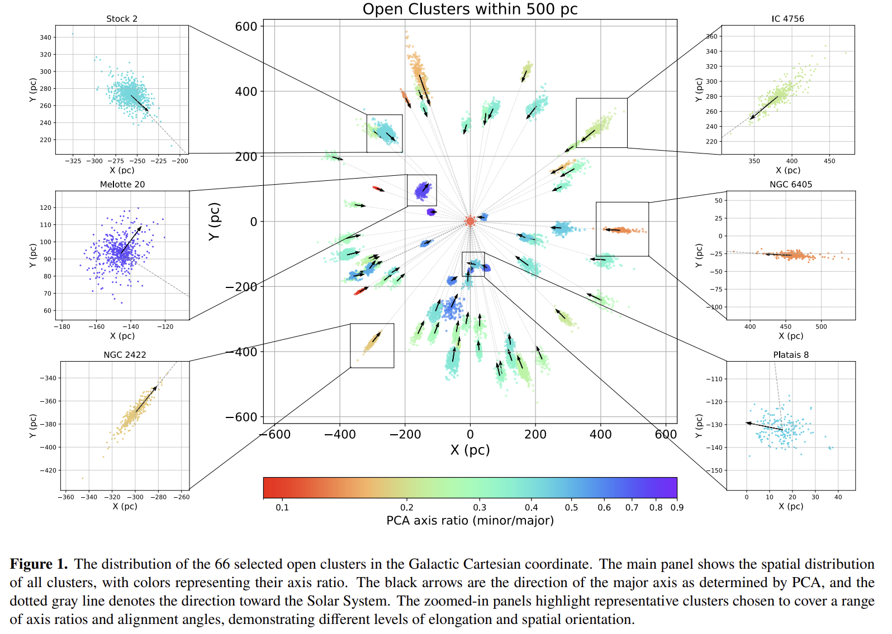
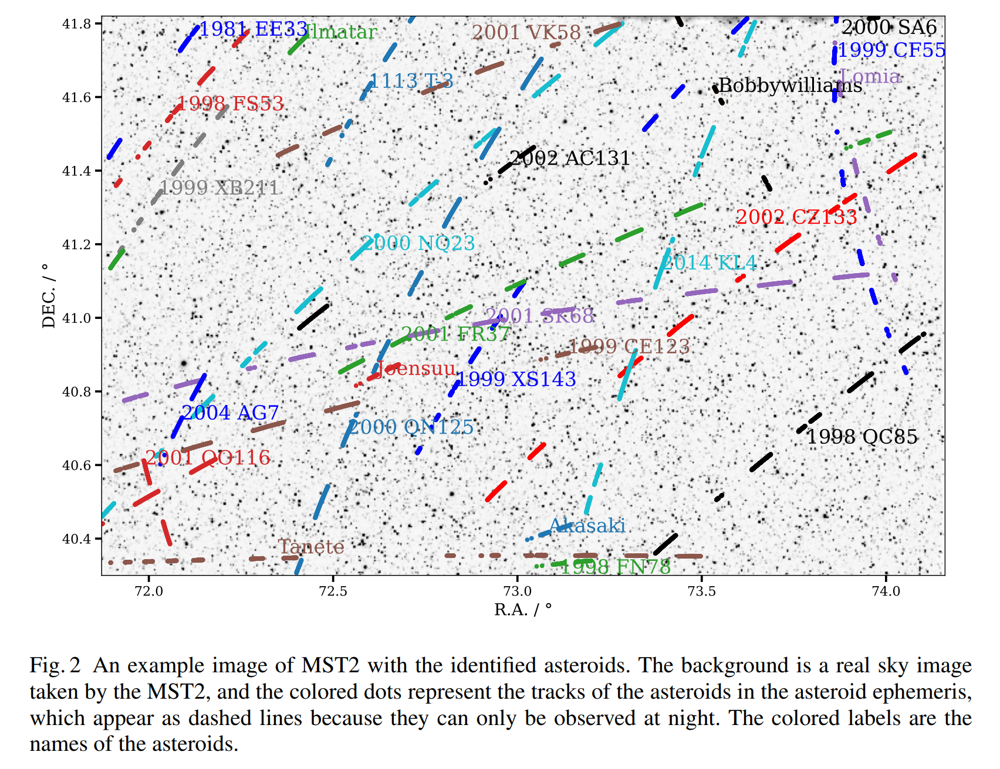

## 2025-04-01

1. [A formula for the area of a triangle: Useless, but explicitly in Deep Sets form](https://arxiv.org/abs/2503.22786)

   > April Fools

   任何排列不变的数据点函数都可以写成$\rho\left(\sum_i\phi(\vec r_i\right)$的形式，这种形式在机器学习文献中被称为深度集合（Deep Sets）。作者旨在找到一个显式的深度集合形式的三角形面积公式（虽然没什么用）。
   $$
   \begin{align}
       \Delta^2 = \ &
       \frac{3}{4}
           \,\big( \sum_{i=1}^{3} x_i^2 \big)
           \,\big( \sum_{i=1}^{3} y_i^2 \big)
       - \frac{3}{4}
           \,\big( \sum_{i=1}^{3} x_i \, y_i \big)^2 
       \nonumber\\ &
       + \frac{2}{4}
           \,\big( \sum_{i=1}^{3} x_i \, y_i \big)
           \,\big( \sum_{i=1}^{3} x_i \big)
           \,\big( \sum_{i=1}^{3} y_i \big)
       \nonumber\\ &
       - \frac{1}{4}
           \,\big( \sum_{i=1}^{3} x_i^2 \big)
           \,\big( \sum_{i=1}^{3} y_i \big)^2
       - \frac{1}{4}
           \,\big( \sum_{i=1}^{3} y_i^2 \big)
           \,\big( \sum_{i=1}^{3} x_i \big)^2
        ~.
   \end{align}
   $$

2. [PromoPlot: Covering open-access fees by filling wasted space in corner plots](https://arxiv.org/abs/2503.24254)

   > April Fools

   [PromoPlot](https://github.com/dmrowan/promoplot)在corner图角落里插入广告，以抵消版面费。假设ApJ的读者群为10,000人，每则广告的收入约为7.43美元。建议在ApJ上发表的论文至少包含200个角落图广告，在MNRAS上发表的论文至少包含490个角落图广告，以抵消出版费用。

   

3. [On the structure of open clusters: geometric vs geomantic](https://arxiv.org/abs/2503.22800)

   > April Fools

   太阳系可能在宇宙中占据了一个特殊的位置，类似于宇宙的“风水”热点。数据来自Cantat-Gaudin等人（2020）的目录，选择了距离太阳系500秒差距内的星团，并且每个星团至少有100颗成员星以确保结构的可靠性。发现大多数星团的结构延展方向指向太阳系，暗示太阳系可能是一个特殊的宇宙位置。（但这显然是视差测量的问题）

   

4. [The Eras Tour: Mapping the Eras of Taylor Swift to the Cosmological Eras of the Universe](https://arxiv.org/abs/2503.22795)

   > April Fools

   将宇宙的演化时期与泰勒·斯威夫特的音乐生涯进行对比，探索两者之间的相似性。作者创建了一个映射，将宇宙的演化时期与泰勒·斯威夫特的专辑时期相对应。例如，她的处女作对应大统一理论时代，而《Fearless》对应电弱时代，以此类推。

   

   - 根据上述映射，作者预测泰勒·斯威夫特的第十二张专辑（TS12）可能会对应核时代，预期这张专辑将具有更强烈的能量和实验性的声音。
   - 作者大胆地推测，泰勒·斯威夫特的第十三张专辑（TS13）可能会揭示宇宙的终极命运，可能是大冻结、大撕裂或大坍缩中的一个。

   我记得去年也有一个TS相关的文章，得看看是不是同一个人写的。

5. [Kepler's Platonic Model and Its Application to Exoplanetary Systems](https://arxiv.org/abs/2503.22793)

   > April Fools

   开普勒试图使用他的柏拉图立体模型来解释太阳系内六颗最内侧行星的排列，但最终失败了。尽管太阳系内的六颗最内侧行星不符合开普勒的柏拉图模型，但某些外太阳系行星系统显示出与该几何框架的良好对齐。三到四个行星的系统表现出最佳匹配，而五到六个行星的系统显示出更高的偏离。这些结果表明，开普勒的几何框架可能适用于某些特定的行星架构，而不是普遍适用。

   

6. [Written in the Stars: How your (pens and) papers decide the fate of the arXiverse](https://arxiv.org/abs/2503.23957)

   > April Fools

   通过分析1992年至当前的astro-ph子类别的提交数据，量化arXiverse的扩张速率，并引入“arXiverse常数”（a0）来描述这一速率。

   通过线性回归拟合，发现astro-ph整体及其子类别的扩张速率（a0）并非恒定，而是随时间变化。astro-ph.GA、astro-ph.EP、astro-ph.HE和astro-ph.IM的a0为正值，表明其提交率随时间增加；而astro-ph.CO的a0为负值，astro-ph.SR的a0接近零，表明其提交率随时间减少或保持不变。表明arXiverse的扩张速率可能在逐渐减缓。

   

7. [pastamarkers 2: pasta sauce colormaps for your flavorful results](https://arxiv.org/abs/2503.23126)

   > April Fools

   [pastamarkers 2](https://github.com/LR-inaf/pasta-marker)使用意大利面形状标记进行数据可视化，此次更新还加入了意大利面颜色的colormap。

   

8. [Astronomers Getting Less Creative Over Time Is Why This Title Isn't Better](https://arxiv.org/abs/2503.23614)

   > April Fools

   使用了国际天文学联合会（IAU）定义的88个星座，并根据维基百科和其他资料确定每个星座的年代。使用图论中的环数公式来计算星座的复杂性，并使用Mann-Whitney U秩检验比较不同组之间的复杂性分布。公式为 M=E−N+2P，其中N是星星的数量，E是连接星星的线段数量，P是连通分量的数量。

   结果显示，随着时间的推移，星座的复杂性逐渐降低。古代星座的中位数复杂性和平均复杂性分别为3和2.6，1500年代至1600年代的星座分别为2和2.0，1700年后的星座分别为1和1.4。作者认为，星座命名的简化可能与现代社会对创造力的重视程度下降有关。

9. [Enhancing Image Resolution of Solar Magnetograms: A Latent Diffusion Model Approach](https://arxiv.org/abs/2503.24271)

   > Solar, Deep Learning

   使用DDPM增强太阳磁图分辨率，代码在[这里](https://github.com/fpramunno/ldm_superresolution)。

   

10. [From Local to Remote: VisIVO Visual Analytics in the Era of the Square Kilometre Array](https://arxiv.org/abs/2503.24113)

    > Astronomy, Visualization

    [VisIVO](http://visivo.oact.inaf.it/)是INAF卡塔尼亚天文台一直在开发和维护，用于促进三维和多维数据分析及可视化。桌面工具转变为客户端-服务器架构，优化了计算资源的使用并增强了数据可访问性。

    

11. [Evaluating small vision-language models as AI assistants for radio astronomical source analysis tasks](https://arxiv.org/abs/2503.23859)

    > Astronomy, Deep Learning, LLM

    探讨了将小型视觉-语言模型（VLMs）作为射电天文学中人工智能助手的可行性。

    在LLaVA VLM的基础上进行微调，使用了来自多个射电调查的59,000张射电图像数据集，并从射电天文文献中提取了38,000个图像-描述对。

    微调后，纯视觉模型在一些任务上仍优于VLM，表明视觉-语言对齐仍是一个限制因素。全参数微调会导致灾难性遗忘，LoRA好一点。

12. [Using Wavelet Decomposition to Determine the Dimension of Structures from Projected Images](https://arxiv.org/abs/2503.23202)

    > Astronomy, Method

    使用小波分解图像。

    

13. [Habitability and Biosignatures](https://arxiv.org/abs/2503.22990)

    > Astronomy, Review

    探讨了系外行星环境中生命宜居性和生物标志物的关键方面。

    

    1. **行星宜居性**：
       - **液态水和宜居带**：宜居带的定义是基于行星表面能否维持液态水的假设。宜居带的范围取决于恒星的类型和行星的大气成分。
       - **生物必需元素**：生命需要碳、氢、氮、氧、磷和硫等主要元素，以及其他微量元素。这些元素在生物结构和功能中起关键作用。
       - **能量**：生命需要能量来维持生存和进行生物功能。地球上，光合作用和化能合成是主要的能量来源。
       - **环境条件**：温度、压力、pH值、盐度和辐射等因素影响生命的生存和功能。
       - **其他影响因素**：包括大气逃逸、磁场、地质活动和宿主恒星的性质等。
    2. **生物标志物**：
       - **大气生物标志物**：生物标志物是宜居环境中可观测的生命迹象，可以是单一特征或多个特征的结合。理想的生物标志物应具有无显著的非生物来源、强光谱特征、可被生命产生且数量足够大等特点。
       - **主要生物标志物气体**：氧气（O2）、臭氧（O3）、甲烷（CH4）和一氧化二氮（N2O）是地球上最显著的生物标志物气体。
       - **次要生物标志物气体**：包括硫化物气体（如DMS）、甲基卤素（如CH3Cl）和其他烃类气体（如乙烯C2H6）。
       - **评估生物标志物的关键因素**：环境背景和化学不平衡是评估生物标志物的重要因素。特定分子对的组合可以提供更强的生物标志物信号。

14. [Enhancing Celestial Imaging: High Dynamic Range with Neuromorphic Cameras](https://arxiv.org/abs/2503.22814)

    > Astronomy, Instrument

    传统基于帧的相机在拍摄亮度变化显著的场景时，常常会遇到动态范围有限的问题，导致亮部过曝和细节丢失。神经形态相机受人类视网膜启发，具有固有的高动态范围，能够同时捕捉亮部和暗部的细节，从而解决这一问题。

    神经形态相机将入射光强度转换为对数电压，防止饱和，并以脉冲或事件的形式输出。每个活动像素使用异步事件表示（AER）协议进行读取，确保只有产生事件的像素被传输到AER总线，从而实现低数据率和高时间分辨率。

    使用了一个1280 x 720像素的神经形态相机，安装在位于印度北阿坎德邦的1.3米Devasthal快速光学望远镜（DFOT）的焦平面上。观测使用了B和V波段滤光片。

    

    - **天狼星:**
      天狼星A的亮度为-1.46等，而其伴星天狼星B的亮度为8.41等。尽管观测当晚有明亮的满月背景，相机仍然清晰地分辨出了天狼星B。
    - **土星:**
      土星的亮度为1.16等，其卫星Enceladus的亮度为11.94等。土星与Enceladus之间的通量比约为20,500，对应的动态范围超过86.24 dB。即使在大于2"的较差视宁度条件下，Enceladus的亮度仍明显高于噪声底限。

15. [Supermassive Black Holes in X-rays: From Standard Accretion to Extreme Transients](https://arxiv.org/abs/2503.22791)

    > High Energy, Black Hole, Review

    X射线观测来理解超大质量黑洞（SMBH）的吸积过程，特别是标准吸积和极端瞬变事件。

    

## 2025-04-02

1. [Polarization Position Angle Swing and the Rotating Vector Model of Repeating Fast Radio Bursts](https://arxiv.org/abs/2504.00391)

   > Fast Radio Burst, Polarization

   刘小辉的文章，研究重复FRB的偏振位置角（PA）摆动及其与旋转矢量模型（RVM）的关系。

   

   分析了来自三个活跃重复FRB源的PA演化模式，发现大多数爆发的PA保持不变，少数显示出显著变化。尽管46个爆发的PA变化可以用RVM拟合，但拟合参数的不一致性表明FRB的磁层是动态演变的。

2. [Forecasting the FRB Population Observed Through Galaxy Cluster Lenses](https://arxiv.org/abs/2504.00922)

   > Fast Radio Burst, Galaxy, Gravitational Lensing

   高红移的快速射电暴（FRBs）具有探测宇宙的巨大潜力，但由于其检测难度较大，目前只有少数在红移大于1的情况下被确认。星系团的引力透镜效应可以放大背景源，从而提高高红移FRBs的检测率。

   文章预言，当望远镜的探测束中有质量大于$5\times10^{14}M_\odot$的星系团时，检测到的高红移FRB的速率大约会增加一倍。通过透镜观测到的FRB的z-DM分布显示出更高的红移和更大的色散值，表明透镜显著增加了高红移FRB的检测率。

   

   今年写观测申请可以用。

3. [The Rizzeta Stone: Adopting Gen-α Colloquial Language to Improve Scientific Paper Rizz and Aura from a Skibidi Perspective](https://arxiv.org/abs/2504.00073)

   > April Fools

   研究在文章中加入“俚语”以改善天文学术文章的可读性。

   文章提供了将经典天文和天体物理论文翻译成使用俚语的版本，展示了如何将这些俚语应用于学术写作中。通过对比原文和翻译后的段落，文章试图展示这种方法的可行性和吸引力。

   

   作者认识到与年轻一代沟通的重要性，但结果表明大多数年轻人对成年人或权威人士尝试使用现代俚语感到“尴尬”。俚语的快速发展和失去语境使得其在学术出版物中的应用变得不可行。文章建议进一步观察年轻人的语言变化，而不是在当前出版物中人为地加入俚语。预测显示，如果继续以当前的速度发展，到2048年，学术论文可能会包含高达50%的俚语，从而变得难以理解。

4. [Stellar Magnetism](https://arxiv.org/abs/2504.00179)

   > Stellar, Review, Polarization

   恒星磁场影响所有光谱类型的恒星，并在其演化过程中存在和变化。磁场不仅影响恒星的内部，还影响其周围的星周环境。文章集中讨论了通过Zeeman效应在恒星光谱上的影响来测量恒星表面磁场的方法。

## 2025-04-03

1. [Persistent radio sources associated with fast radio bursts: Implications from magnetar progenitors](https://arxiv.org/abs/2504.01125)

   > Fast Radio Burst, PRS

   通过对FRB-PRS系统的研究，提出了磁星风星云（MWN）作为FRB前身星的解释。研究发现，PRS的年龄和特性要求磁星具有中等初始自转周期和非常强的内部磁场，且内部磁场衰减时间尺度约为10-100年。

2. [STRAUSS: Sonification Tools & Resources for Analysis Using Sound Synthesis](https://arxiv.org/abs/2504.01660)

   > Astronomy, Sonify

   [strauss](https://strauss.readthedocs.io/en/latest/)提供了一个完整的从数据到声化音频的流程。

3. [How to write competitive proposals and job applications](https://arxiv.org/abs/2504.01645)

   > Astronomy

   讨论了如何撰写有竞争力的科研提案和求职申请，旨在帮助专业天文学家提高写作技能。

   - **提案基础:** 资源分配或职位申请的竞争非常激烈，成功的机会通常很低。作者建议仔细研究提案要求，并根据预期的成功率决定是否投入时间。提案的成功与否取决于其科学相关性、潜在收益以及是否能够有效利用团队资源。
   - **成功的提案:** 提案应被视为一种销售工具，需要吸引评审团并说服他们批准。成功的提案应具有科学相关性、基础性、作者的独特性、合理的方法论和令人信服的故事性。
   - **撰写有竞争力的提案:** 提案的撰写应遵循科学文章的规则，强调清晰的结构和简洁的语言。作者建议创建提纲，避免使用通用标题，并通过多次修订来完善文本。特别强调了标题、摘要、开头段落和结论的重要性。
   - **具体写作技巧:** 避免使用通用陈述，保持简单和清晰，确保每个句子都有意义。使用积极的语言，但要避免过度夸大。注意避免性别和文化偏见，避免使用负面表达。
   - **求职申请:** 求职申请需要特别注意拼写和语法，确保动机信和简历符合要求。建议提供详细的推荐信，并提前与推荐人沟通。强调科学独立性和软技能的重要性。
   - **人工智能的智能使用:** 作者讨论了使用人工智能工具（如ChatGPT）来提高写作效率和质量的可能性。建议将AI作为辅助工具，而不是完全依赖其生成的内容。

4. [The Mini-SiTian Array: A Pathfinder for the SiTian Project](https://arxiv.org/abs/2504.01615)

   > Astronomy, Survey

   SiTian计划部署至少60台米级宽视场望远镜，以实现每30分钟对整个天空进行三波段（g, r, i）巡天观测，达到21等的深度。Mini-SiTian旨在验证这一目标的技术可行性。**Mini-SiTian阵列**由三个30厘米望远镜组成，位于兴隆观测站，每个望远镜配备了一个ZWO ASI6200 CMOS相机，具有9,576×6,388像素的分辨率和0.862角秒/像素的像素尺度，提供2.29°×1.53°的视场，采用折射光学配置，每个望远镜的主镜为300毫米，焦比为f/3。

   - 在两年的观测中，获得了22颗小行星的光变曲线测量，其中14颗为新发现。

     

   - 模拟了MST阵列对潮汐破坏事件的预期探测率。

     

   - 使用SiTian原型望远镜模拟了LIGO O4观测运行期间的潜在千新星探测。

     

## 2025-04-04

1. [Stellar tidal streams around nearby spiral galaxies with deep imaging from amateur telescopes](https://arxiv.org/abs/2504.02071)

   > Galaxy, Optical

   利用业余天文爱好者的设备来探测和研究附近螺旋星系周围的暗淡、弥散结构。发现了一系列以前未报告的暗淡结构，包括恒星流、壳层和伞状结构。意外地发现了一个超弥散星系（NGC150-UDG1），显示出潮汐扰动的迹象。

   

## 2025-04-07

1. [The EMPI Code for Plasma-Induced Effects on Radio Waves I: Non-Magnetized Media and Applications to Fast Radio Bursts](https://arxiv.org/abs/2504.03273)

   > Fast Radio Burst, Simulation

   介绍EMPI代码，用于模拟射电信号通过冷等离子体传播时的相互作用，包括色散、等离子体透镜、闪烁和散射。

2. [The flat tail in the burst energy distribution of FRB 20240114A](https://arxiv.org/abs/2504.03569)

   > Fast Radio Burst, Observation

   黄玉祥的文章，拿昆明40米看FRB20240114A，探测到几个爆发搞搞能量函数。

3. [The AI Cosmologist I: An Agentic System for Automated Data Analysis](https://arxiv.org/abs/2504.03424)

   > Astronomy, LLM

   [AI Cosmologist](https://github.com/adammoss/aicosmologist)使用LLM Agent，用于自动化宇宙学数据分析。包括规划代理、编码代理、执行代理、分析代理、综合代理和文献代理。每个代理利用大型语言模型（LLMs）进行特定功能，保持独立决策能力。在Galaxy Zoo和Quijote数据集上进行了测试。

   

4. [Comparative Statistics of Solar Flares and Flare Stars](https://arxiv.org/abs/2504.02943)

   > Stellar, Solar, Flare, Statistics

   比较太阳耀斑（来自Chandrayaan-2 XSM目录和GOES数据库）和恒星耀斑（来自来自TESS卫星观测到的四个恒星）的等待时间分布，使用对数正态的宽度、偏度和峰度进行描述。太阳耀斑的对数正态宽度于噪声过程，恒星耀斑的对数正态宽度为0.683，接近噪声过程的宽度，表明没有记忆效应。

## 2025-04-08

1. [Metal-rich stellar counterpart of the Radcliffe Wave and the 3D chemical footprints of the Milky Way spiral arms](https://arxiv.org/abs/2504.03843)

   > Stellar, Radcliffe Wave

   研究了银河系旋臂的三维金属丰度分布。发现了一个与Radcliffe波相位一致的金属富集星体结构，称为扩展的Radcliffe波。该结构延伸至少4 kpc，垂直幅度接近270 pc，并包含原始的Radcliffe波。

   

2. [CHIME/FRB Outriggers: Design Overview](https://arxiv.org/abs/2504.05192)

   > Fast Radio Burst, Instrument

   介绍CHIME/FRB Outtriggers的设计和观测能力，目前有两个台站在工作，第三个台站正在调试。

3. [Observations of fast radio variations in microquasars by FAST](https://arxiv.org/abs/2504.04719)

   > Radio, Black Hole, Periodicity, QPO

   微类星体，即包含吸积黑洞的致密天体，这些天体会产生相对论性喷流。介绍FAST观测到的GRS1915的QPO。

   

## 2025-04-09

1. [Observing radio transients with Phased ALMA: Pulses from the Galactic Centre magnetar](https://arxiv.org/abs/2504.06234)

   > Transient, Radio, Magnetar

   用ALMA找单脉冲，ALMA的时间分辨率可以做到8us。在ALMA观测Sgr A*的历史数据中，找到了来自PSR J1745-2900这个磁星的8个爆发，能量大概是1e29 erg，累积能量分布的幂律指数是-2.4。

   

## 2025-04-10

1. [Probable evidence for a transient mega-electron volt emission line in the GRB 221023A](https://arxiv.org/abs/2504.06968)

   > High Energy, Observation, GRB

   在GRB 221023A的光谱中探测到的约2.1 MeV的窄发射特征，NC的文章。

   

2. [Evidence for repeating fast radio bursts association with fast super-twisted magnetars](https://arxiv.org/abs/2504.06645)

   > Fast Radio Burst, Theory

   假设爆发是由沿着磁星磁层磁场线流动的超相对论等离子体产生的，根据几何模型拟合CHIME探测到的FRB 20180814A和FRB 20180916B的十几个爆发，推断出这些源具有快速的自转和高环形磁场。

3. [Radio emission across the entire rotation phases of pulsars](https://arxiv.org/abs/2504.06545)

   > Pulsar, Polarization

   研究了脉冲星在整个旋转相位中产生的射电辐射。

   

## 2025-04-11

1. [Polarization Angle Orthogonal Jumps in Fast Radio Bursts](https://arxiv.org/abs/2504.07449)

   > Fast Radio Burst, Theory

   屈元鸿的文章，研究FRB 20201124A中PA正交跳跃的起源。

   - **相干叠加**：当两个电磁波相干叠加时，PA跳跃发生在线性极化达到最小值且圆极化达到最大值时，总极化度保持不变。PA跳跃需要两个正交模式的振幅相当。
   - **非相干叠加**：非相干叠加可能导致去极化。观测数据似乎更符合非相干叠加的情况。

2. [Discovery of extreme Quasi-Periodic Eruptions in a newly accreting massive black hole](https://arxiv.org/abs/2504.07169)

   > High Energy, Black Hole, Periodicity, QPO

   通过对SDSS1335+0728星系的观测，发现了极端的QPEs，扩展了我们对QPEs形成通道的理解。研究表明，QPEs不仅与“标准”的TDEs有关，还与新形成的吸积流更广泛地相关。

   

## 2025-04-14

