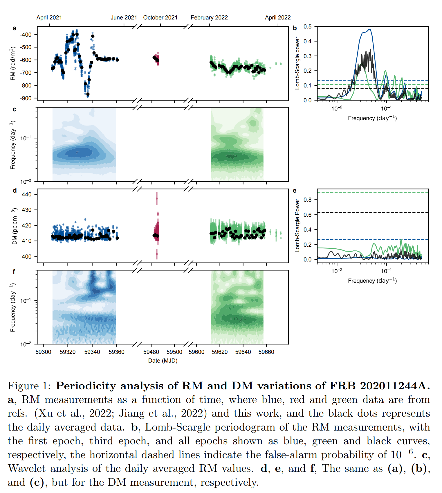
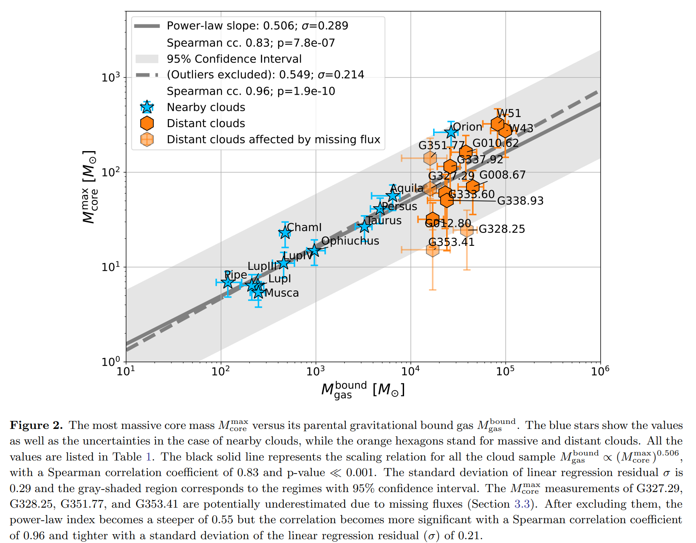
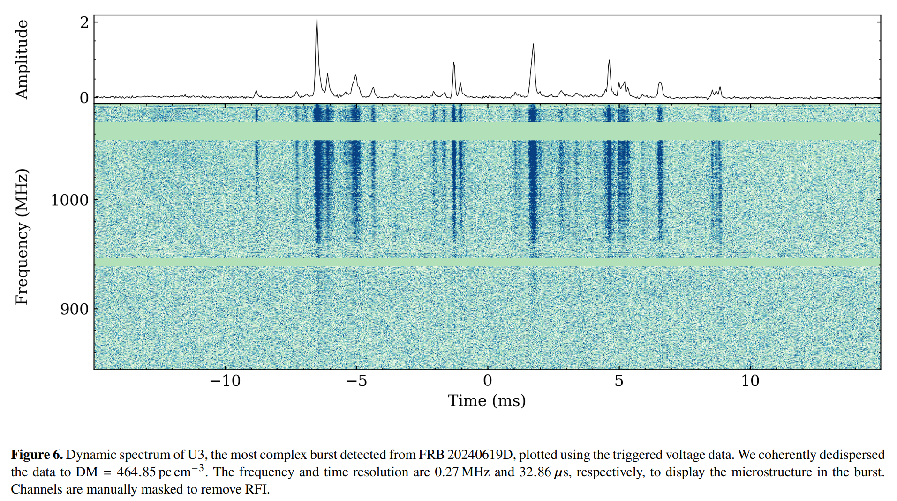
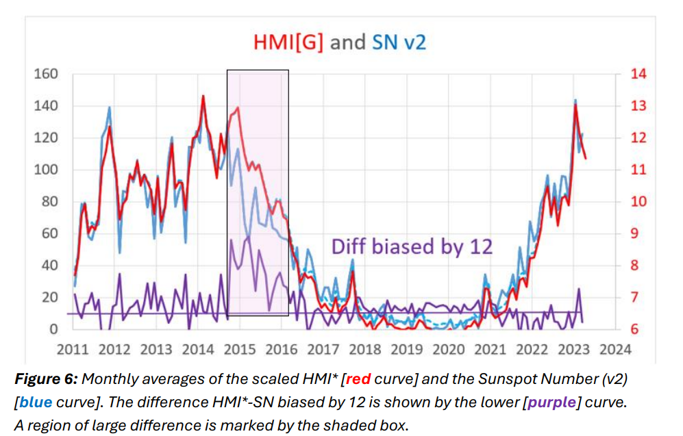
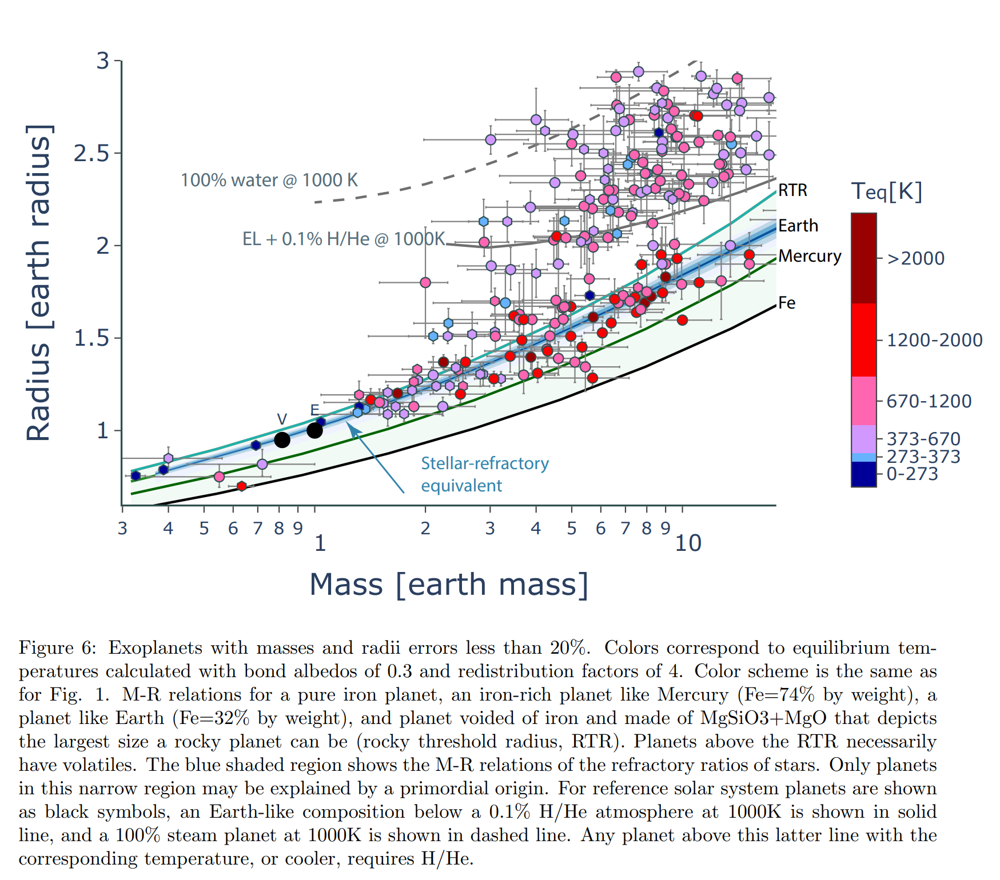
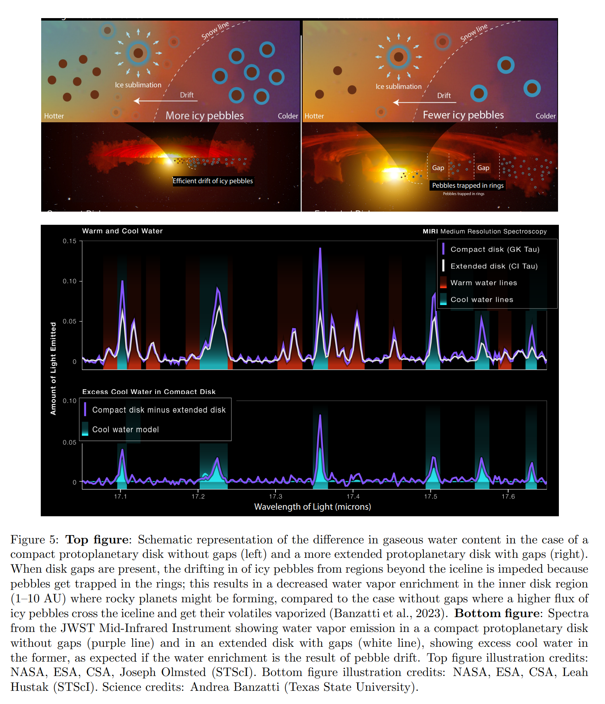
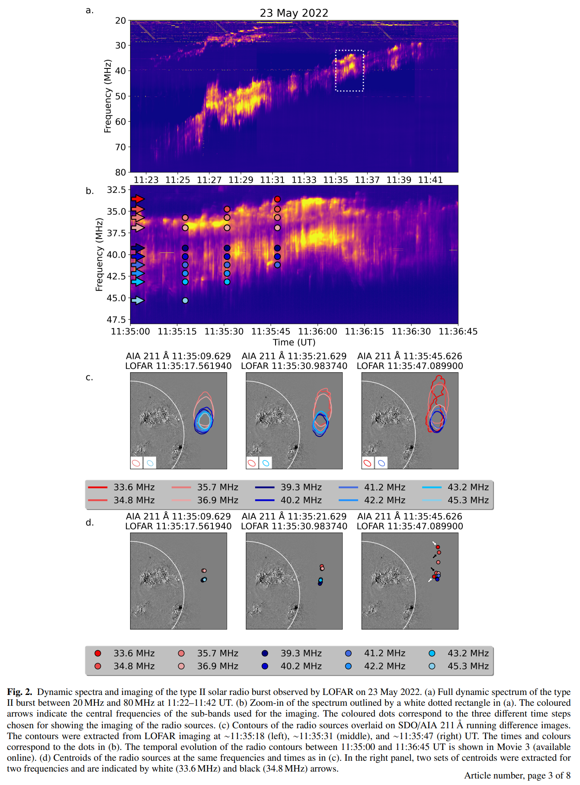
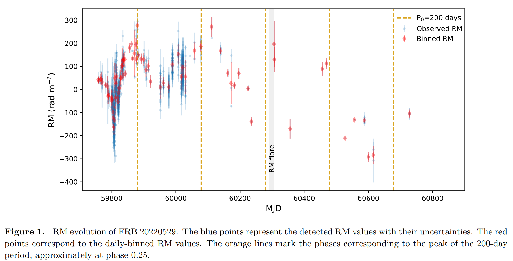

## 2025-05-01

1. [Cosmological-model independent limits on photon mass from FRB and SNe data](https://arxiv.org/abs/2504.21129)

   > Fast Radio Burst, Cosmology

   利用快速射电暴（FRB）和Ia型超新星（SNe）的数据，在不依赖宇宙学模型的情况下，对光子质量进行限制。考虑光子质量非0，色散关系变为$\omega^2=k^2c^2+\omega_p^2+\omega_\gamma^2$ 。

2. [The H.E.S.S. extragalactic sky survey with the first decade of observations](https://arxiv.org/abs/2504.21221)

   > High Energy, Survey

   介绍了高能立体系统（H.E.S.S.）对河外天区进行的伽马射线巡天的初步结果。选择了2720小时的观测数据，涵盖了5.7%的天空区域，检测到23个源，其中大多数为耀变体。检测到的源包括18个BL Lac对象、2个射电星系、1个平谱射电类星体、1个恒星形成星系和1个不确定类型的源。

## 2025-05-02

1. [Convolutional Autoencoders for Data Compression and Anomaly Detection in Small Satellite Technologies](https://arxiv.org/abs/2505.00040)

   > Astronomy, Deep Learning

   使用卷积自编码器（CAE）在卫星图像中进行数据压缩和异常检测。使用SSIM损失函数进行优化，SSIM得分分布显示，异常图像的重建质量较低，SSIM得分显著低于正常图像。

2. [Absence of TeV halos around millisecond pulsars](https://arxiv.org/abs/2505.00184)

   > Pulsar, High Energy

   HAWC天文台位于墨西哥，由300个水切伦科夫探测器组成，观测能量范围从300 GeV到100 TeV。对之前报告有TeV晕的MSPs进行重新分析，未发现显著辐射，表明之前的检测可能是统计波动。MSPs的TeV晕发射效率低于孤立脉冲星，表明MSPs在产生TeV晕方面不如孤立脉冲星高效。

3. [Extended TeV Halos May Commonly Exist around Middle-Aged Pulsars](https://arxiv.org/abs/2505.00175)

   > Pulsar, High Energy

   通过堆叠分析发现，围绕孤立中年脉冲星的扩展TeV伽马射线晕可能普遍存在。这一发现表明TeV晕的产生机制更可能与脉冲星附近的相对论粒子传输有关，而不是观测到的晕的局部环境。

## 2025-05-05

1. [Power Laws Associated with Self-Organized Criticality: A Comparison of Empirical Data with Model Predictions](https://arxiv.org/abs/2505.00748)

   > Astronomy, Statistics, SOC

   对于分形扩散自组织临界现象，流量的幂律斜率为$\alpha_F=9/5=1.8$，能量的幂律斜率是$\alpha_E=5/3=1.67$，雪崩持续时间的幂律斜率是$\alpha_T=2$。分析了64个案例的分布，其中80%与SOC的预测几乎一致，包括太阳耀斑、地震和森林火灾等现象。

   

## 2025-05-06

1. [Non-thermal Radio Emission from Massive Protostars in the SARAO MeerKAT Galactic Plane Survey](https://arxiv.org/abs/2505.01683)

   > Stellar, Radio, Survey

   MeerKAT银河平面巡天中发现的已知大质量年轻恒星物体（MYSOs）的L波段发射，以寻找样本中的非热辐射源。至少52%的样本显示出非热辐射的证据，这与大质量原恒星的流出模型一致。

## 2025-05-07

1. [Identifying Astrophysical Anomalies in 99.6 Million Cutouts from the Hubble Legacy Archive Using AnomalyMatch](https://arxiv.org/abs/2505.03508)

   > Astronomy, Deep Learning, Anomaly Detection, Galaxy, Optical

   使用[AnomalyMatch](https://github.com/esa/AnomalyMatch)系统地搜索哈勃遗产档案（HLA）中的图像切片，以高效检测天体物理异常。AnomalyMatch基于FixMatch方法，采用EfficientNet骨干网络，在初始阶段，使用少量标记数据和大量未标记数据进行训练。模型在未标记数据上进行预测，并根据预测结果生成高置信度的伪标签。然后，用户通过交互式界面验证和标记高置信度的异常候选对象，逐步优化模型。

   在HLA中识别出1176个新发现的异常对象，涵盖19个不同类别，包括417个新的星系合并候选对象、138个引力透镜候选对象、18个水母星系和2个碰撞环星系。

   

2. [Decoding the cosmological baryonic fluctuations using localized fast radio bursts](https://arxiv.org/abs/2505.03326)

   > Fast Radio Burst, Cosmology

   大爆炸理论预测的重子物质总量中，只有40%能被观测到，大部分重子物质仍然缺失。星际介质（IGM）被认为是这些缺失重子物质的主要候选者。

   发现FRB的DM超出与前景星系密度增量之间存在明显的正相关关系。表明重子物质在宇宙中的分布并非均匀，而是在高星系密度区域更为集中。

3. [A Wide-band High-frequency Type-II Solar Radio Burst](https://arxiv.org/abs/2505.02991)

   > Solar Flare, Radio, Observation

   II型射电爆发通常在低于400 MHz的频率下观测到，具有窄带和缓慢漂移的基本和谐波结构。本文报道了一种不寻常的高频宽频带II型爆发，起始频率高达600-700 MHz，瞬时带宽约为300 MHz。结合射电成像、光谱数据和极紫外观测，表明这种射电爆发起源于日冕中的密集流区域，并与CME冲击波与上方密集环结构的相互作用有关。

   

## 2025-05-08

1. [Scintillometry of Fast Radio Bursts: Resolution effects in two-screen models](https://arxiv.org/abs/2505.04576)

   > Fast Radio Burst, Scintillation

   由于望远镜频率分辨率限制，双屏系统中FRB的闪烁可能会无法解析。这里证明解析效应仅抑制较宽尺度的闪烁，而较窄尺度的闪烁仍然存在。

2. [PANCAKE: Python bAsed Numerical Color-magnitude-diagram Analysis pacKagE](https://arxiv.org/abs/2505.04534)

   > Galaxy, Software

   郑沄的文章，用颜色-星等图拟合恒星形成历史。

## 2025-05-09

1. [Searching for pulsars in Globular Clusters with the Fast Fold Algorithm and a new pulsar discovered in M13](https://arxiv.org/abs/2505.05021)

   > Pulsar, Observation

   用[riptide](https://github.com/v-morello/riptide)的FFA搜索FAST球状星团观测数据，一共16个球状星团的数据，找到38个孤立脉冲星和49个脉冲双星，其中有一个新的毫秒脉冲双星。

2. [Machine Learning Workflow for Morphological Classification of Galaxies](https://arxiv.org/abs/2505.04676)

   > Galaxy, Deep Learning

   [Spherinator](https://github.com/HITS-AIN/Spherinator)使用VAE把星系降维。

## 2025-05-12

1. [Periodic variation of magnetoionic environment of a fast radio burst source](https://arxiv.org/abs/2505.06006)

   > Fast Radio Burst, Polarization, Periodicity

   北大的文章，在FRB20201124A的长期观测里找到RM变化的周期性，约26天。

   

## 2025-05-13

1. [Why is the Star Formation Rate Proportional to Dense Gas Mass?](https://arxiv.org/abs/2505.07764)

   > ISM, Statistics

   焦斯汗的文章，统计恒星形成率（SFR）与密集气体质量之间的比例关系。

   

2. [EP241021a: a months-duration X-ray transient with luminous optical and radio emission](https://arxiv.org/abs/2505.07665)

   > High Energy, Observation

   对EP241021a的多波段观测（X射线-EP、光学-Kech、射电-VLA/MeerKAT/VLBA/ATCA）。EP241021a的

   - X射线爆发持续约100秒，随后在1.5天内下降超过三个数量级。在接下来的7天内保持平稳，之后以$t^{-1.2}$的速度衰减，最终在30天后变得不可检测。
   - 光学对应体在X射线触发后1.8天内被检测到，并在20天后出现第二次光学增亮。
   -  射电对应体在X射线触发后8.4天被检测到，射电频谱能量分布显示出高亮度，类似于长伽马射线暴和喷流TDE。

## 2025-05-14

1. [MeerKAT discovery of a hyperactive repeating fast radio burst source](https://arxiv.org/abs/2505.08372)

   > Fast Radio Burst, Observation

   MeerKAT探测到FRB 20240619D，是一个活跃的重复FRB，共检测到249个爆发事件，其中UHF波段46个，L波段177个，S波段26个。在L波段事件率最高。100%线偏振，少数圆偏振，没有光学对应体。

   

## 2025-05-15

1. [A Possible Problem with the Sunspot Number](https://arxiv.org/abs/2505.08832)

   > Solar, Statistics

   自2014年7月至2015年12月期间，太阳黑子数与F10.7（太阳微波辐射常用指标，主要由热轫致辐射（TB）和回旋共振（GR）产生）的变化关系出现异常，而F10.7与HMI测量的磁通量关系正常。由于SILSO未公开原始太阳黑子观测数据，无法独立验证SN的推导过程。

   

## 2025-05-16

1. [Diversity of Exoplanets](https://arxiv.org/abs/2505.09754)

   > Exoplanet, Review

   综述了低质量系外行星（包括超级地球和迷你海王星）的研究进展。

   1. **行星半径和质量测量**：通过凌星法和径向速度法测量行星的半径和质量。低质量行星的半径和质量分布广泛，存在显著的差异。超级地球和迷你海王星的质量和半径范围较大，而水世界的半径较小。

      

   2. **大气成分分析**：通过低分辨率和高分辨率的光谱分析来研究行星大气的成分。不同类型的行星大气成分差异显著。超级地球和迷你海王星的大气中可能含有氢、氦和水蒸气，而水世界的大气中主要含有水蒸气。

   3. **行星分类和特征描述**：根据行星的半径和质量将其分类为不同的类型，如超级地球、迷你海王星和水世界。

      

      - **初始阶段**：行星形成始于原行星盘中的固体颗粒凝聚，形成星子和小行星体。这个阶段的物质组成受温度和压力的影响。
      - **碰撞和迁移**：行星体通过碰撞和迁移增长，最终形成行星。这个过程中可能发生大气逃逸和化学分馏。
      - **巨行星的影响**：巨行星的形成和迁移对其他行星的轨道和生长有显著影响，可能导致行星的吸积或抛射。

2. [Imaging and spectropolarimetric observations of a band-split type II solar radio burst with LOFAR](https://arxiv.org/abs/2505.10243)

   > Solar, Flare, Observation

   II型太阳射电暴的频带分裂现象，起源于激波的两个不同区域，而不是激波前后的同一区域。两个子带的圆偏振度相似，表明两个区域的磁场强度相似，且辐射区域的等离子体几乎没有变化。

   

3. [A possible periodic RM evolution in the repeating FRB 20220529](https://arxiv.org/abs/2505.10463)

   > Fast Radio Burst, Polarization, Periodicity

   觉得FRB 20220529的RM有个200天的周期。

   

## 2025-05-19

