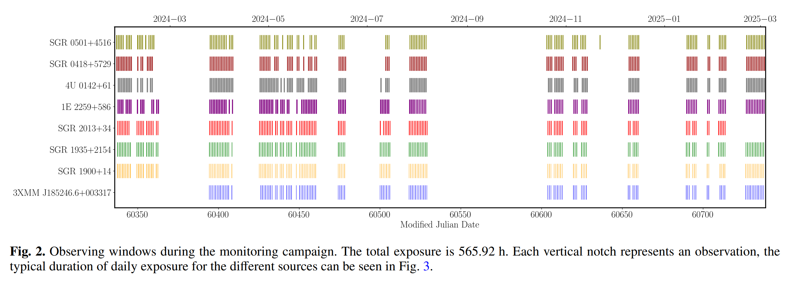
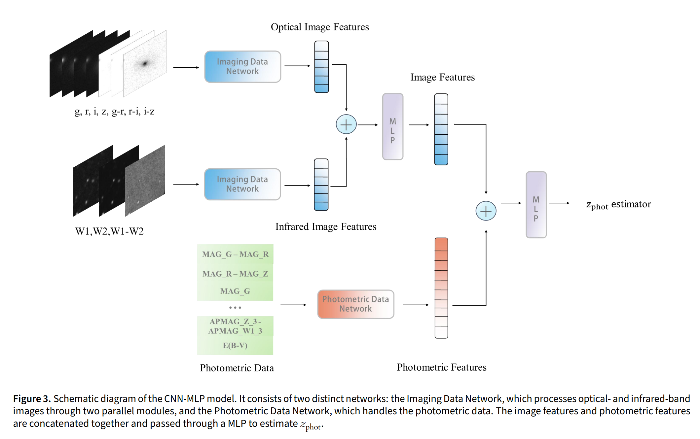
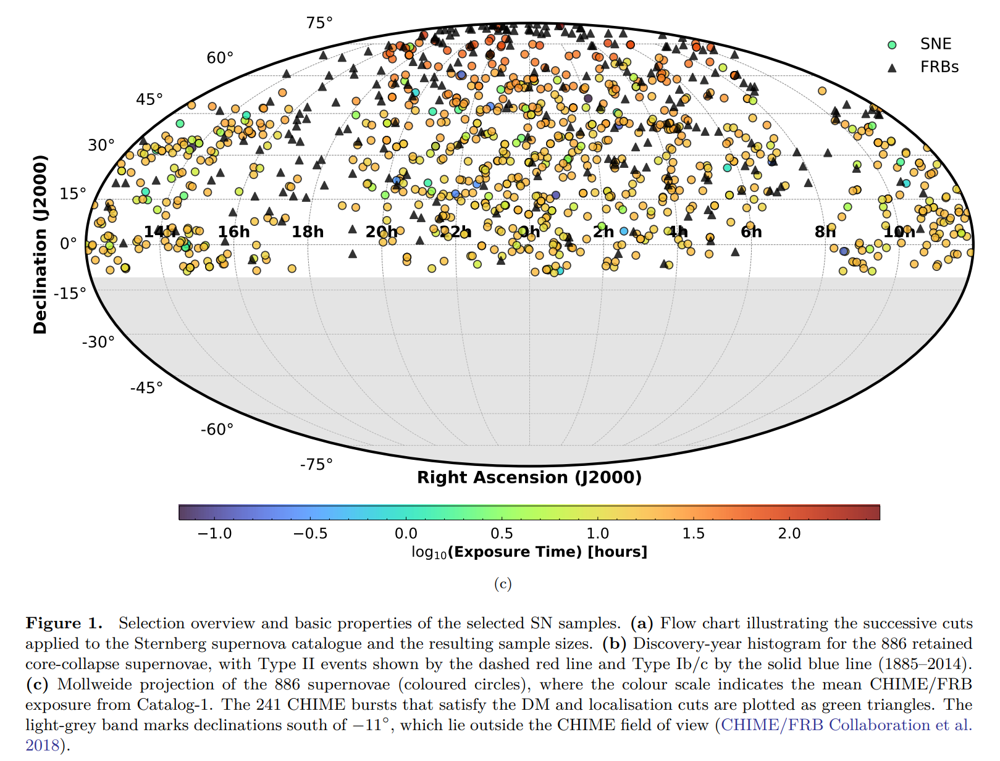
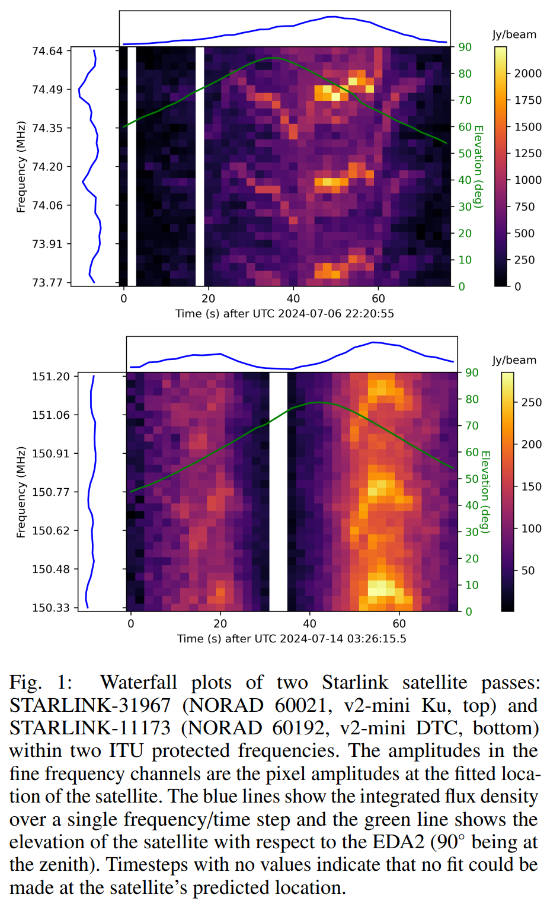
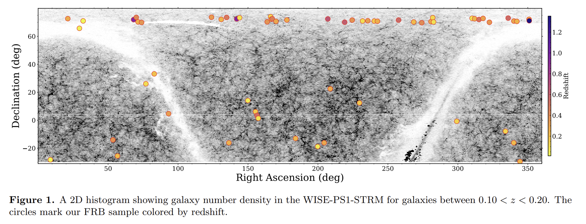
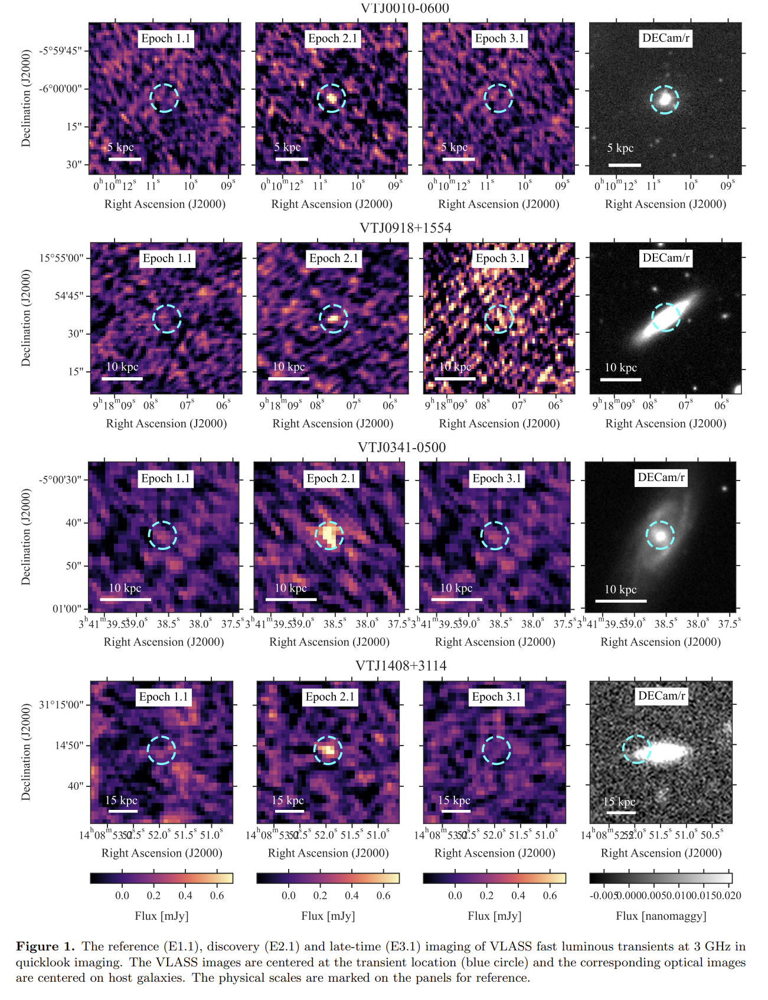
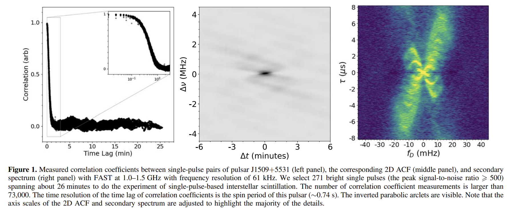

## 2025-06-02

1. [Physics beyond the Standard Model with the DSA-2000](https://arxiv.org/abs/2505.23892)

   > Radio, DSA, Prediction, Survey

   讨论DSA-2000建成后在探测**超出标准模型的物理现象**的潜力。

   1. **轴子暗物质转换:**
      - **机制:** 文章研究了轴子暗物质在脉冲星磁层中的转换机制，提出了两种探测轴子的方法：一是通过轴子暗物质转换产生的无线电信号，二是通过轴子云产生的无线电信号。
      - **预测:** 预测DSA-2000将能够探测到质量范围在2.9-8.3微电子伏特之间的轴子，并对QCD轴子参数空间进行约束。
   2. **暗光子超辐射:**
      - **机制:** 文章探讨了通过黑洞超辐射产生的暗光子信号，分析了其电磁特征。
      - **预测:** 预测DSA-2000将能够在暗光子质量范围为6×10^-14至5×10^-13电子伏特之间探测到暗光子，并对其混合参数进行约束。
   3. **脉冲星计时阵列:**
      - **机制:** 文章讨论了利用脉冲星计时阵列（PTA）探测暗物质亚结构和第五力的可能性。
      - **预测:** 预计DSA-2000将发现约130颗新的毫秒脉冲星，这将使对暗物质亚结构和第五力的约束提高一个数量级。
   4. **快速射电暴的中微子质量测量:**
      - **机制:** 文章介绍了如何利用快速射电暴的色散测量来打破弱引力透镜观测中的重子反馈退耦，从而改进中微子质量的宇宙学推断。
      - **预测:** 预计通过这种方法可以将中微子质量的约束提高三倍。

2. [The Northern Cross Fast Radio Burst project: V. Search for transient radio emission from Galactic magnetars](https://arxiv.org/abs/2505.24049)

   > Fast Radio Burst, Magnetar, Observation

   使用位于意大利Medicina的Northern Cross射电望远镜对7个磁星进行长时间观测，没有找到任何爆发，限制磁星设点信号的爆发事件率<46 / yr。

   

3. [Photometric redshift estimation for emission line galaxies of DESI Legacy Imaging Surveys by CNN-MLP](https://arxiv.org/abs/2505.24175)

   > Galaxy, Spectrum, Deep Learning

   提出了一种结合卷积神经网络（CNN）和多层感知机（MLP）的混合模型（CNN-MLP），用于提高暗能量光谱仪（DESI）遗产成像调查中发射线星系（ELGs）的光度红移估计精度。

   

## 2025-06-03

1. [Testing the Young FRB Progenitor Hypothesis: A Crossmatch of Catalog-1 CHIME Bursts with Historic Local Universe Supernovae](https://arxiv.org/abs/2506.01238)

   > Fast Radio Burst, Statistics

   交叉匹配CHIME的FRB和近邻宇宙中的历史超新星（CCSNe），只有FRB 20190412B和SN 2009gi对通过了自洽性测试，有待进一步研究。

   

2. [Probing Cosmic Curvature with Fast Radio Bursts and DESI DR2](https://arxiv.org/abs/2506.01504)

   > Fast Radio Burst, Cosmology

   使用FRB+DESI DR2来约束宇宙曲率$\Omega_k$，结果表明，当前数据在1σ水平上与空间平坦的宇宙一致，但存在对封闭宇宙的轻微偏好。

3. [Applying Vision Transformers on Spectral Analysis of Astronomical Objects](https://arxiv.org/abs/2506.00294)

   > Galaxy, Spectrum, Deep Learning

   [spectromer](https://github.com/astromer-science/spectromer)先将光谱画成图像，然后在[facebook/dino-vitb16](https://github.com/facebookresearch/dino)的基础上进行微调，并在其基础上添加自定义的回归头进行红移估计。对于分类任务，添加了分类头（如恒星/星系/类星体识别）。

## 2025-06-04

1. [The Growing Impact of Unintended Starlink Broadband Emission on Radio Astronomy in the SKA-Low Frequency Range](https://arxiv.org/abs/2506.02831)

   > Astronomy, Radio, RFI

   SKA-Low原型站EDA2在29天内捕获了约7600万张全天空图像，覆盖了SKA-Low频段范围内的多个频率。

   - 共检测到112,534个星链卫星的信号，涉及1,806颗独特的星链卫星。
   - 在73.00-74.60 MHz和150.05-153.00 MHz频段内检测到大量星链卫星的辐射信号，表明这些卫星在这些受保护频段内的辐射活动。
   - 宽带辐射的XX和YY极化通量密度表现出反相关特性，表明其辐射特性随时间变化。
   - 检测到星链卫星反射地面FM广播信号的现象，特别是在99.70 MHz频段。

   

   星链卫星的意外电磁辐射对射电天文学观测构成了显著干扰。

2. [An Exploratory Framework for Future SETI Applications: Detecting Generative Reactivity via Language Models](https://arxiv.org/abs/2506.02730)

   > SETI, Deep Learning

   把`人类语言`（来自LibriVox语料库的英语口语数据）、`鲸鱼叫声`（来自SanctSound被动声学数据集的座头鲸叫声）、`鸟鸣`（来自Xeno-Canto平台的Phylloscopus trochilus鸟鸣）、`白色噪声`（使用Python的NumPy模块生成的合成白色噪声），转换成梅尔声谱后展开成一维向量，用GPT-2进行训练，计算不同类别的声音的`Semantic Induction Potential`， 鲸鱼和鸟类的叫声比白色噪声触发了更高的SIP分数，而人类语言只触发了中等反应。

   结果表明，语言模型可以检测到数据中的潜在结构，即使这些数据没有传统的语义，为SETI提供了一种新的检测策略。

## 2025-06-05

1. [Do they repeat? Monitoring 36 non-repeating FRBs with FAST](https://arxiv.org/abs/2506.03564)

   > Fast Radio Burst, Observation

   用FAST在2021年对CHIME Catalog中的36个非重复暴（基于Hashimoto2020的物理参数和Chen2022的机器学习方法进行筛选）进行了每个10分钟的观测，没找到信号，对这些FRB的事件率进行了限制。

2. [A Correlation Between FRB Dispersion Measure and Foreground Large-Scale Structure](https://arxiv.org/abs/2506.04186)

   > Fast Radio Burst, Cosmology

   研究FRB的DM与大尺度结构的关系。

   

   - **方法一：** 搜索星系数量密度与FRBs DM之间的相关性。通过计算沿FRBs视线方向的星系数量密度，并将其与FRBs的DM进行比较，以量化星系数量密度与DM之间的关系。
     - 星系数量密度与FRBs DM之间存在显著正相关关系，支持了DM主要由IGM贡献的观点。
   - **方法二：** 堆叠分析，测量前景星系的影响参数与平均过量DM之间的关系。通过堆叠所有FRBs-星系对的数据，获得空间信息，了解电离气体在星系晕周围的分布情况。
     - 堆叠分析显示，在Mpc尺度上存在过量DM，进一步支持了DM主要由IGM贡献的观点。

3. [Constraining the Baryon Fraction in the Intergalactic Medium with 92 localized Fast Radio Bursts](https://arxiv.org/abs/2506.03536)

   > Fast Radio Burst, Cosmology

   利用快速射电暴（FRBs）来约束星系际介质（IGM）中的重子分数（$f_{\rm IGM}$），以解决宇宙中缺失重子的问题。结果表明，IGM中的重子分数在$f_{\rm IGM}$0.8到0.9范围内，支持大多数缺失重子存在于弥散IGM中的观点。

4. [Exploring selection biases in FRB dispersion-galaxy cross-correlations with magnetohydrodynamical simulations](https://arxiv.org/abs/2506.03258)

   > Fast Radio Burst, Simulation, Statistics

   使用IllustrisTNG300-1模拟来研究预期观测选择效应对FRB色散-星系位置交叉相关的影响。

   - **宿主星系性质**：FRB样本对宿主星系的性质（如SFR分布）不敏感，交叉相关测量结果一致。
   - **光学后续选择效应**：对暗宿主星系的FRB进行选择不会显著影响交叉相关信号。
   - **宿主DM**：宿主DM的贡献增加了交叉相关测量的方差，但不会引入显著偏差。
   - **DM依赖选择效应**：DM依赖选择效应会显著降低交叉相关信号的幅度。例如，去除DM最大的5% FRB会使交叉相关幅度在角尺度小于1000时下降超过50%。
   - **散射效应**：散射效应对交叉相关信号的影响不显著，但在高红移FRB样本中可能需要进一步研究。

## 2025-06-06

1. [Constraints on the progenitor models of fast radio bursts from population synthesis with the first CHIME/FRB catalog](https://arxiv.org/abs/2506.04986)

   > Fast Radio Burst, Statistics

   基于CHIME的FRB表格研究FRB是否直接追踪宇宙恒星形成历史（SFH）或需要延迟。结果表明，SFH模型和延迟SFH模型均未被数据排除，支持FRBs主要源自年轻恒星群体（如通过核心坍缩超新星形成的磁星）的观点。

2. [Fast Luminous Extragalactic Transients in the VLA Sky Survey: Implications for the rates of Accretion-Induced Collapse Events, Fast Blue Optical Transients and Gamma Ray Burst Afterglows](https://arxiv.org/abs/2506.04522)

   > Transient, Survey

   在VLA的巡天项目VLASS的三期观测数据，搜索在第二期检测到但在第一期和第三期未检测到的瞬变源。覆盖赤纬-40度以北的天空区域，每期观测间隔约三年。发现了六种快速明亮的河外瞬变源，并对其进行了分类和体积发生率的估算。

   

3. [Single-pulse-based interstellar scintillation studies of RRATs](https://arxiv.org/abs/2506.04532)

   > Radio, Transient, RRAT, Scintillation

   通过单脉冲观测成功研究了RRATs的星际闪烁特性，并推导出其横向速度。

   

## 2025-06-07

