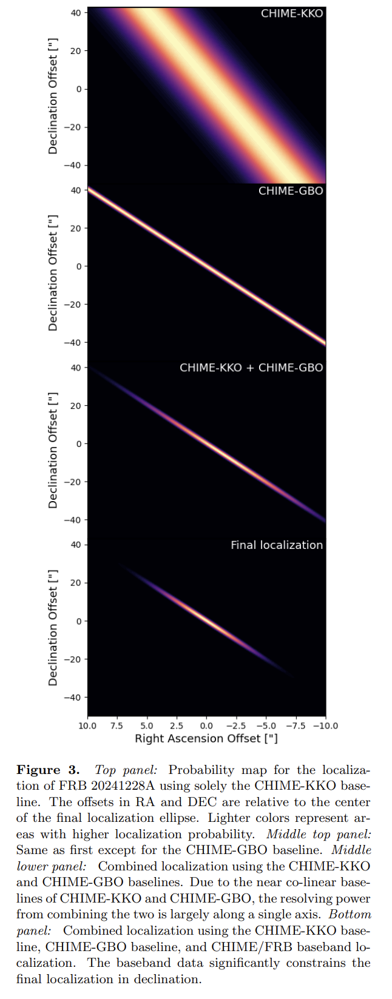

## 2025-06-02

1. [Physics beyond the Standard Model with the DSA-2000](https://arxiv.org/abs/2505.23892)

   > Radio, DSA, Prediction, Survey

   讨论DSA-2000建成后在探测**超出标准模型的物理现象**的潜力。

   1. **轴子暗物质转换:**
      - **机制:** 文章研究了轴子暗物质在脉冲星磁层中的转换机制，提出了两种探测轴子的方法：一是通过轴子暗物质转换产生的无线电信号，二是通过轴子云产生的无线电信号。
      - **预测:** 预测DSA-2000将能够探测到质量范围在2.9-8.3微电子伏特之间的轴子，并对QCD轴子参数空间进行约束。
   2. **暗光子超辐射:**
      - **机制:** 文章探讨了通过黑洞超辐射产生的暗光子信号，分析了其电磁特征。
      - **预测:** 预测DSA-2000将能够在暗光子质量范围为6×10^-14至5×10^-13电子伏特之间探测到暗光子，并对其混合参数进行约束。
   3. **脉冲星计时阵列:**
      - **机制:** 文章讨论了利用脉冲星计时阵列（PTA）探测暗物质亚结构和第五力的可能性。
      - **预测:** 预计DSA-2000将发现约130颗新的毫秒脉冲星，这将使对暗物质亚结构和第五力的约束提高一个数量级。
   4. **快速射电暴的中微子质量测量:**
      - **机制:** 文章介绍了如何利用快速射电暴的色散测量来打破弱引力透镜观测中的重子反馈退耦，从而改进中微子质量的宇宙学推断。
      - **预测:** 预计通过这种方法可以将中微子质量的约束提高三倍。

2. [The Northern Cross Fast Radio Burst project: V. Search for transient radio emission from Galactic magnetars](https://arxiv.org/abs/2505.24049)

   > Fast Radio Burst, Magnetar, Observation

   使用位于意大利Medicina的Northern Cross射电望远镜对7个磁星进行长时间观测，没有找到任何爆发，限制磁星设点信号的爆发事件率<46 / yr。

   

3. [Photometric redshift estimation for emission line galaxies of DESI Legacy Imaging Surveys by CNN-MLP](https://arxiv.org/abs/2505.24175)

   > Galaxy, Spectrum, Deep Learning

   提出了一种结合卷积神经网络（CNN）和多层感知机（MLP）的混合模型（CNN-MLP），用于提高暗能量光谱仪（DESI）遗产成像调查中发射线星系（ELGs）的光度红移估计精度。

   

## 2025-06-03

1. [Testing the Young FRB Progenitor Hypothesis: A Crossmatch of Catalog-1 CHIME Bursts with Historic Local Universe Supernovae](https://arxiv.org/abs/2506.01238)

   > Fast Radio Burst, Statistics

   交叉匹配CHIME的FRB和近邻宇宙中的历史超新星（CCSNe），只有FRB 20190412B和SN 2009gi对通过了自洽性测试，有待进一步研究。

   

2. [Probing Cosmic Curvature with Fast Radio Bursts and DESI DR2](https://arxiv.org/abs/2506.01504)

   > Fast Radio Burst, Cosmology

   使用FRB+DESI DR2来约束宇宙曲率$\Omega_k$，结果表明，当前数据在1σ水平上与空间平坦的宇宙一致，但存在对封闭宇宙的轻微偏好。

3. [Applying Vision Transformers on Spectral Analysis of Astronomical Objects](https://arxiv.org/abs/2506.00294)

   > Galaxy, Spectrum, Deep Learning

   [spectromer](https://github.com/astromer-science/spectromer)先将光谱画成图像，然后在[facebook/dino-vitb16](https://github.com/facebookresearch/dino)的基础上进行微调，并在其基础上添加自定义的回归头进行红移估计。对于分类任务，添加了分类头（如恒星/星系/类星体识别）。

## 2025-06-04

1. [The Growing Impact of Unintended Starlink Broadband Emission on Radio Astronomy in the SKA-Low Frequency Range](https://arxiv.org/abs/2506.02831)

   > Astronomy, Radio, RFI

   SKA-Low原型站EDA2在29天内捕获了约7600万张全天空图像，覆盖了SKA-Low频段范围内的多个频率。

   - 共检测到112,534个星链卫星的信号，涉及1,806颗独特的星链卫星。
   - 在73.00-74.60 MHz和150.05-153.00 MHz频段内检测到大量星链卫星的辐射信号，表明这些卫星在这些受保护频段内的辐射活动。
   - 宽带辐射的XX和YY极化通量密度表现出反相关特性，表明其辐射特性随时间变化。
   - 检测到星链卫星反射地面FM广播信号的现象，特别是在99.70 MHz频段。

   

   星链卫星的意外电磁辐射对射电天文学观测构成了显著干扰。

2. [An Exploratory Framework for Future SETI Applications: Detecting Generative Reactivity via Language Models](https://arxiv.org/abs/2506.02730)

   > SETI, Deep Learning

   把`人类语言`（来自LibriVox语料库的英语口语数据）、`鲸鱼叫声`（来自SanctSound被动声学数据集的座头鲸叫声）、`鸟鸣`（来自Xeno-Canto平台的Phylloscopus trochilus鸟鸣）、`白色噪声`（使用Python的NumPy模块生成的合成白色噪声），转换成梅尔声谱后展开成一维向量，用GPT-2进行训练，计算不同类别的声音的`Semantic Induction Potential`， 鲸鱼和鸟类的叫声比白色噪声触发了更高的SIP分数，而人类语言只触发了中等反应。

   结果表明，语言模型可以检测到数据中的潜在结构，即使这些数据没有传统的语义，为SETI提供了一种新的检测策略。

## 2025-06-05

1. [Do they repeat? Monitoring 36 non-repeating FRBs with FAST](https://arxiv.org/abs/2506.03564)

   > Fast Radio Burst, Observation

   用FAST在2021年对CHIME Catalog中的36个非重复暴（基于Hashimoto2020的物理参数和Chen2022的机器学习方法进行筛选）进行了每个10分钟的观测，没找到信号，对这些FRB的事件率进行了限制。

2. [A Correlation Between FRB Dispersion Measure and Foreground Large-Scale Structure](https://arxiv.org/abs/2506.04186)

   > Fast Radio Burst, Cosmology

   研究FRB的DM与大尺度结构的关系。

   

   - **方法一：** 搜索星系数量密度与FRBs DM之间的相关性。通过计算沿FRBs视线方向的星系数量密度，并将其与FRBs的DM进行比较，以量化星系数量密度与DM之间的关系。
     - 星系数量密度与FRBs DM之间存在显著正相关关系，支持了DM主要由IGM贡献的观点。
   - **方法二：** 堆叠分析，测量前景星系的影响参数与平均过量DM之间的关系。通过堆叠所有FRBs-星系对的数据，获得空间信息，了解电离气体在星系晕周围的分布情况。
     - 堆叠分析显示，在Mpc尺度上存在过量DM，进一步支持了DM主要由IGM贡献的观点。

3. [Constraining the Baryon Fraction in the Intergalactic Medium with 92 localized Fast Radio Bursts](https://arxiv.org/abs/2506.03536)

   > Fast Radio Burst, Cosmology

   利用快速射电暴（FRBs）来约束星系际介质（IGM）中的重子分数（$f_{\rm IGM}$），以解决宇宙中缺失重子的问题。结果表明，IGM中的重子分数在$f_{\rm IGM}$0.8到0.9范围内，支持大多数缺失重子存在于弥散IGM中的观点。

4. [Exploring selection biases in FRB dispersion-galaxy cross-correlations with magnetohydrodynamical simulations](https://arxiv.org/abs/2506.03258)

   > Fast Radio Burst, Simulation, Statistics

   使用IllustrisTNG300-1模拟来研究预期观测选择效应对FRB色散-星系位置交叉相关的影响。

   - **宿主星系性质**：FRB样本对宿主星系的性质（如SFR分布）不敏感，交叉相关测量结果一致。
   - **光学后续选择效应**：对暗宿主星系的FRB进行选择不会显著影响交叉相关信号。
   - **宿主DM**：宿主DM的贡献增加了交叉相关测量的方差，但不会引入显著偏差。
   - **DM依赖选择效应**：DM依赖选择效应会显著降低交叉相关信号的幅度。例如，去除DM最大的5% FRB会使交叉相关幅度在角尺度小于1000时下降超过50%。
   - **散射效应**：散射效应对交叉相关信号的影响不显著，但在高红移FRB样本中可能需要进一步研究。

## 2025-06-06

1. [Constraints on the progenitor models of fast radio bursts from population synthesis with the first CHIME/FRB catalog](https://arxiv.org/abs/2506.04986)

   > Fast Radio Burst, Statistics

   基于CHIME的FRB表格研究FRB是否直接追踪宇宙恒星形成历史（SFH）或需要延迟。结果表明，SFH模型和延迟SFH模型均未被数据排除，支持FRBs主要源自年轻恒星群体（如通过核心坍缩超新星形成的磁星）的观点。

2. [Fast Luminous Extragalactic Transients in the VLA Sky Survey: Implications for the rates of Accretion-Induced Collapse Events, Fast Blue Optical Transients and Gamma Ray Burst Afterglows](https://arxiv.org/abs/2506.04522)

   > Transient, Survey

   在VLA的巡天项目VLASS的三期观测数据，搜索在第二期检测到但在第一期和第三期未检测到的瞬变源。覆盖赤纬-40度以北的天空区域，每期观测间隔约三年。发现了六种快速明亮的河外瞬变源，并对其进行了分类和体积发生率的估算。

   

3. [Single-pulse-based interstellar scintillation studies of RRATs](https://arxiv.org/abs/2506.04532)

   > Radio, Transient, RRAT, Scintillation

   通过单脉冲观测成功研究了RRATs的星际闪烁特性，并推导出其横向速度。

   

## 2025-06-09

1. [Detection of multiple X-ray quasi-periodic oscillations in IGR J19294+1816 with Insight-HXMT](https://arxiv.org/pdf/2506.05771)

   > High Energy, QPO

   使用[HEASOFT/Powspec](https://heasarc.gsfc.nasa.gov/xanadu/xronos/examples/powspec.html)对IGR J19294+1816做准周期性分析。python中 [Stingray](https://github.com/StingraySoftware/stingray)有类似的功能实现，以及[pycwt](https://github.com/regeirk/pycwt)做小波分析。

   

2. [Correlation of Burst Behaviour with Magnetar Age](https://arxiv.org/abs/2506.05910)

   > Magnetar, Statistics

   磁星的爆发行为与其年龄密切相关，年轻磁星由于内部磁场的高应力和大范围的应力区域，表现出更多的高能量爆发；而老磁星由于磁场衰减和应力区域的减少，表现出较少的低能量爆发。

   

3. [The polarization of strongly lensed point-like radio sources](https://arxiv.org/abs/2506.05772)

   > Transient, Radio, Polarization, Theory, Gravitational Lensing

   研究强引力透镜下的偏振现象，特别是磁化介质引起的双折射效应及其对光传播路径的影响。

   - 在弱磁场下，几何延迟和几何旋转与法拉第旋转具有相似的频率依赖性，且其幅度更大。
   - 在强磁场下，等离子体介质中的偏转角度较小，放大曲线出现复杂的结构，两种偏振模式的图像可能会分裂。

## 2025-06-10

1. [A Python client for the ATLAS API](https://arxiv.org/abs/2506.06403)

   > Astronomy, Software

   小行星地球撞击最后警报系统（The Asteroid Terrestrial-impact Last Alert System, ATLAS）是一个全天光学天空观测系统，其观测周期为 24 至 48 小时。[atlasapiclient](https://github.com/HeloiseS/atlasapiclient)是可以接入ATLAS数据的PythonAPI。

2. [100,000 Crab giant pulses at 215 MHz detected with an SKA-Low prototype station](https://arxiv.org/abs/2506.07422)

   > Pulsar, Observation, Statistics

   SKA-Low原型站EDA2对Crab的观测，观测频率再200-231.25MHz，时间分辨率0.96768ms。

   - **巨脉冲样本:** 总共检测到约95000个巨脉冲，这是迄今为止在低频段报道的最大样本。

     

   - **流量分布:** 巨脉冲的流量分布可以用单一幂律描述，幂律指数为-3.17±0.02。主脉冲和中间脉冲的流量分布指数分别为-3.13±0.02和-3.59±0.06。

     

   - **散射展宽时间:** 散射展宽时间与色散测量值呈强正相关，相关系数约为0.7。散射展宽时间的频谱指数为-3.6±0.1。

     

   - **频率依赖性:** 观测到的最大光谱亮度接近一些重复FRBs的最弱脉冲。

3. [The FAST Globular Cluster Pulsar Survey (GC FANS)](https://arxiv.org/abs/2506.07970)

   > Pulsar, Observation

   FAST对41个球状星团在2017-2025年之间的观测，从其中14个球状星团中找到60个脉冲星，其中55个是毫秒脉冲星，34个是双星系统，M71D是一颗具有大特征年龄的双中子星系统（DNS），可能是在GC早期演化过程中形成的。

   对FAST天区内的GC脉冲星样本进行了统计分析，发现大多数GC的脉冲星种群类似于银河系盘中的MSP种群，可能是由于较低的恒星密度。

4. [Mapping the Spatial Distribution of Fast Radio Bursts within their Host Galaxies](https://arxiv.org/abs/2506.06453)

   > Fast Radio Burst, Galaxy, Statistics

   研究ASKAP定位的37个FRB在其宿主星系中的空间分布。

   

   - 大多数FRBs的位置与其宿主星系的恒星盘面一致，表明这些FRBs可能与大质量恒星的形成有关。
   - 尽管一些FRBs与旋臂结构相关联，但大多数FRBs的位置并不强烈依赖于高恒星形成效率。
   - 仅有少数FRBs倾向于起源于球状星团，这表明磁星的形成可能通过动态通道发生。

   

5. [A Novel Fine Spectral Structure of Solar Radio Bursts with Periodic Beaded Stripes Observed by CBSm of CMP-II](https://arxiv.org/abs/2506.06819)

   > Solar, Flare, Observation

   子午工程二期的茶山宽带太阳射电频谱仪（CBSm）观测太阳，看到了频谱上的周期性珠状条纹结构。条纹的漂移率通常为-1到-10 MHz/s，持续时间约0.4-0.7秒，周期约0.5-0.8秒。珠状结构的周期约为0.1秒，频率间隔约为0.8 MHz，带宽约为0.6 MHz。通过DART数据，发现射电源位于活动区AR 13664的亮化环上方，磁场拓扑结构复杂，存在显著的剪切运动。

   

   提出了基于双等离子体共振（DPR）不稳定性的新机制来解释周期性条纹的形成，认为辐射源自UH波通过模式转换产生，UH波由高能电子的DPR不稳定性激发。珠状结构归因于低频磁流体动力学（MHD）波对UH波增长的调制。未来将通过更多的类似事件分析和数值模拟，进一步理解波的增长和调制发射过程。

6. [ASKAP-EMU radio continuum detection of planetary nebula NGC 5189: the "Infinity" nebula](https://arxiv.org/abs/2506.06768)

   > Galaxy, Radio, Observation

   ASKAP对NGC 5189的射电连续谱测量结果，通过Hubble Space Telescope（HST）的Wide Field Camera 3（WFC3）图像与ASKAP-EMU图像的射电轮廓进行对比，发现射电形态与光学形态高度一致，特别是内层两个气体包层的轮廓对齐，这些包层被认为是低电离结构，是围绕中心Wolf-Rayet星的post-common-envelope PNe的特征。

   

7. [Searching for Historical Extragalactic Optical Transients Associated with Fast Radio Bursts](https://arxiv.org/abs/2506.06420)

   > Fast Radio Burst, MultiWavelength

   使用CHIME-KKO系统和文献中的FRBs样本，结合TNS数据库中的光学瞬变目录，通过红移、位置、时间一致性来找FRB与超新星的关联。

   

   在83个CHIME-KKO FRBs中没有发现显著的位置或红移关联，唯一的例外是与FRB 20180916B相关的潜在光学对应物AT 2020hur。模拟结果显示，在CHIME/FRB Outrigger的检测率下，需要约22,700个FRBs才能产生一个偶然的FRB-SN匹配。

8. [A giant planet transiting a 0.2 solar mass host star](https://arxiv.org/abs/2506.07931)

   > Stellar, Variable, Exoplanet

   报道了围绕一颗质量为0.207太阳质量的恒星TOI-6894发现的一颗巨型行星TOI-6894 b。

   - **行星特性**：TOI-6894 b的质量为0.168木星质量，半径为0.855木星半径，密度较低，可能含有12地球质量的金属。
   - **轨道特性**：行星的轨道周期为3.37天，轨道偏心率为0.029，宿主恒星的有效温度为3007K。
   - **大气特征**：行星的大气主要由甲烷化学主导，预计其传输光谱特征将显著高于其他行星。

   

## 2025-06-11

1. [Measurement of the Dispersion Galaxy Cross-Power Spectrum with the Second CHIME/FRB Catalog](https://arxiv.org/abs/2506.08932)

   > Fast Radio Burst, Statistics

   使用CHIME/FRB第二版目录中的2873个FRB与DESI的星系数据进行相关，测量FRB色散度与星系的角交叉功率谱。通过将背景FRBs的色散与前景星系的位置进行交叉相关，可以研究等离子体和星系在0.1到50 Mpc尺度上的相对空间分布，这些分布受到星系形成反馈过程的强烈影响。

   结果显示，在5.1sigma显著性水平上首次明确检测到了由于宇宙结构引起的FRB色散度的空间相关性。

2. [Unlocking the hidden potential of pulsar astronomy](https://arxiv.org/abs/2506.08056)

   > Pulsar, Astronomy, Review

   探讨了脉冲星在天文学和基础物理学之外的社会和工业领域的扩展应用。

   1. **脉冲星检测**：
      - **检测挑战**：脉冲星具有低通量密度、信号色散和周期性等特点，检测难度较大。
      - **观测系统**：描述了适合检测脉冲星的最紧凑观测系统，指出相对简单和小型的接收系统可以检测到最亮的脉冲星Vela。
      - **灵敏度计算**：使用辐射计方程估算不同系统的灵敏度，并展示了不同系统温度下的最小可检测通量密度。
   2. **定位和导航**：
      - **应用潜力**：脉冲星作为银河系内的天体，不受人类干扰，适用于全球尺度的导航和定位。
      - **技术实现**：介绍了基于脉冲星的时间和位置测量方法，展示了如何通过观测多个脉冲星来确定三维位置。
      - **实际案例**：讨论了Insight-HXMT卫星和SEXTANT项目中的脉冲星导航应用。
   3. **时间和频率确定及同步**：
      - **观测系统**：描述了脉冲星观测中使用的精确时间系统，如氢脉泽和GPS同步。
      - **时间标准**：讨论了如何利用脉冲星观测来提取和验证时间标准，以及如何通过多台望远镜之间的时间同步来实现高精度的时间传递。
   4. **空间天气监测**：
      - **应用方法**：通过观测脉冲星的色散测量（DM）和旋转测量（RM）来研究太阳风和日冕物质抛射（CME）。
      - **数据收集**：展示了如何利用脉冲星观测来补充现有的太阳风和CME测量方法，提供独立的数据支持。
   5. **随机数生成**：
      - **应用潜力**：脉冲星的信号波动可以用于生成随机数序列，适用于需要高安全性和不可预测性的应用场景。
      - **技术实现**：讨论了如何从脉冲星的强度波动中提取随机数序列，并展示了如 何通过多台望远镜验证生成的随机数序列。
   6. **数据处理和算法开发**：
      - **数据集利用**：介绍了利用脉冲星搜索数据集进行机器学习和量子计算算法的开发。
      - **实际应用**：展示了如何利用这些数据集训练量子机器学习算法，并探索其在其他领域的应用潜力。
   7. **仪器校准和新设备调试**：
      - **校准方法**：利用脉冲星的稳定脉冲轮廓和偏振特性来校准射电望远镜系统和校准场。
      - **实际应用**：展示了如何通过观测脉冲星来校准天线极化和波束形状。
   8. **公共参与和教育**：
      - **教育价值**：脉冲星观测具有教育和艺术价值，可以通过实时观测和数据集提供科学发现的机会。
      - **实际案例**：介绍了通过Einstein at Home项目向公众介绍脉冲星的工作。

3. [AstroQ: Automated Scheduling of Cadenced Astronomical Observations](https://arxiv.org/abs/2506.08195)

   > Astronomy, Software

   [AstroQ](https://github.com/jluby127/AstroQ)用于调度具有不同节奏需求和可访问性约束的观测任务。

4. [Observatory Science with eXTP](https://arxiv.org/abs/2506.08367)

   > High Energy, Instrument

   增强型X射线时变和偏振（eXTP）望远镜的天文观测科学，该望远镜计划于2030年发射，旨在研究天体物理学中的极端条件和现象。观测目标包括

   - **耀星**：研究恒星耀斑和日冕物质抛射（CMEs），特别是M矮星的超级耀斑。
   - **超新星遗迹和脉冲星风星云**：研究磁湍流和放大机制，以及粒子加速过程。
   - **激变变星**：研究物质吸积到白矮星的过程及其混合机制。
   - **X射线双星**：研究低质量X射线双星和中质量黑洞的存在。
   - **超亮X射线源**：研究中间质量黑洞和强磁场的影响。
   - **活动星系核**：研究喷流的形成和粒子加速机制。
   - **基于脉冲星的定位和时间保持**：利用毫秒脉冲星进行自主定位和时间保持。

## 2025-06-12

1. [Can repeating and non-repeating FRBs be drawn from the same population?](https://arxiv.org/abs/2506.09138)

   > Fast Radio Burst, Statistics

   统计重复和非重复FRB的数密度，是一个统一的幂律分布，认为是相同起源。发现重复暴的比例仅在提高灵敏度或增加曝光时间时轻微上升。这种微弱的依赖关系可能会被误认为并非所有 FRB 都会重复。

## 2025-06-13

1. [Discovery and Localization of the Swift-Observed FRB 20241228A in a Star-forming Host Galaxy](https://arxiv.org/abs/2506.10961)

   > Fast Radio Burst, Galaxy, Observation, Localization

   CHIME Outriggers对FRB 20241228A进行了探测和定位，在一个恒星形成星系中，ra / 14h25m32.58s， dec / 12d01m30.15s，红移为0.1614。

   

   CHIME/FRB在2024年12月28日探测到FRB 20241228A，实时信噪比大于50。约112秒后，Neil Gehrels Swift天文台的X射线望远镜（XRT）对源进行了观测，这是迄今为止对非重复FRB的最快跟进。

2. [Searching for radio pulses from radio-quiet gamma-ray pulsars with FAST](https://arxiv.org/abs/2506.10565)

   > Pulsar, Observation

   采用周期性搜索和单脉冲搜索的方法，利用FAST对22个“射电宁静”伽马射线脉冲星进行观测。成功探测到PSR J1813-1246的射电脉冲信号，对其他21个脉冲星未探测到射电信号。

   

## 2025-06-16

