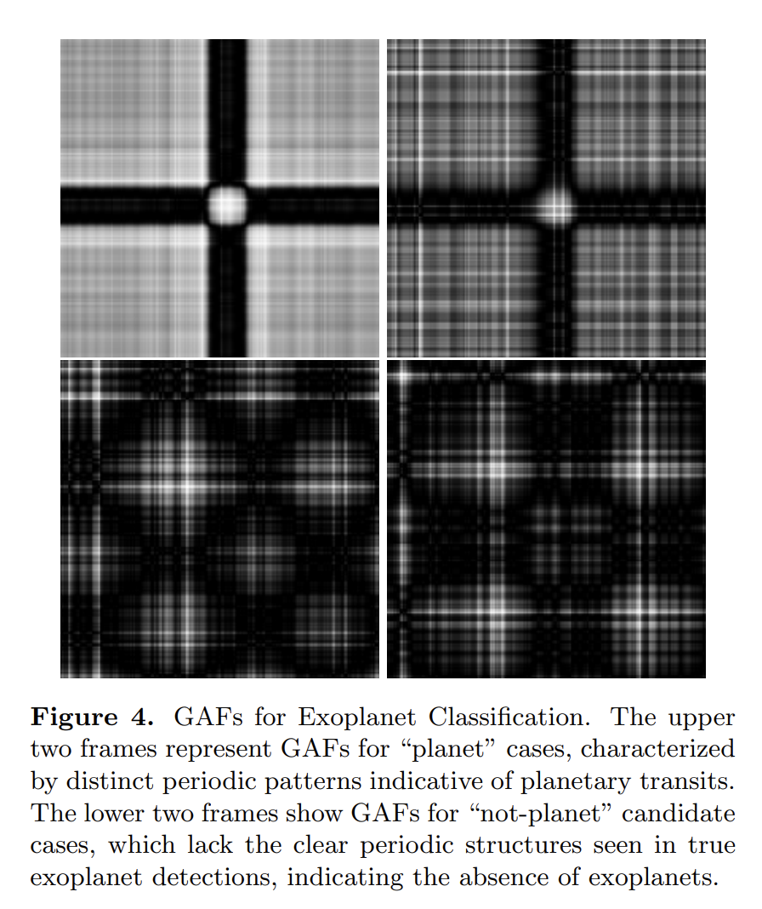

## 2025-06-02

1. [Physics beyond the Standard Model with the DSA-2000](https://arxiv.org/abs/2505.23892)

   > Radio, DSA, Prediction, Survey

   讨论DSA-2000建成后在探测**超出标准模型的物理现象**的潜力。

   1. **轴子暗物质转换:**
      - **机制:** 文章研究了轴子暗物质在脉冲星磁层中的转换机制，提出了两种探测轴子的方法：一是通过轴子暗物质转换产生的无线电信号，二是通过轴子云产生的无线电信号。
      - **预测:** 预测DSA-2000将能够探测到质量范围在2.9-8.3微电子伏特之间的轴子，并对QCD轴子参数空间进行约束。
   2. **暗光子超辐射:**
      - **机制:** 文章探讨了通过黑洞超辐射产生的暗光子信号，分析了其电磁特征。
      - **预测:** 预测DSA-2000将能够在暗光子质量范围为6×10^-14至5×10^-13电子伏特之间探测到暗光子，并对其混合参数进行约束。
   3. **脉冲星计时阵列:**
      - **机制:** 文章讨论了利用脉冲星计时阵列（PTA）探测暗物质亚结构和第五力的可能性。
      - **预测:** 预计DSA-2000将发现约130颗新的毫秒脉冲星，这将使对暗物质亚结构和第五力的约束提高一个数量级。
   4. **快速射电暴的中微子质量测量:**
      - **机制:** 文章介绍了如何利用快速射电暴的色散测量来打破弱引力透镜观测中的重子反馈退耦，从而改进中微子质量的宇宙学推断。
      - **预测:** 预计通过这种方法可以将中微子质量的约束提高三倍。

2. [The Northern Cross Fast Radio Burst project: V. Search for transient radio emission from Galactic magnetars](https://arxiv.org/abs/2505.24049)

   > Fast Radio Burst, Magnetar, Observation

   使用位于意大利Medicina的Northern Cross射电望远镜对7个磁星进行长时间观测，没有找到任何爆发，限制磁星设点信号的爆发事件率<46 / yr。

   

3. [Photometric redshift estimation for emission line galaxies of DESI Legacy Imaging Surveys by CNN-MLP](https://arxiv.org/abs/2505.24175)

   > Galaxy, Spectrum, Deep Learning

   提出了一种结合卷积神经网络（CNN）和多层感知机（MLP）的混合模型（CNN-MLP），用于提高暗能量光谱仪（DESI）遗产成像调查中发射线星系（ELGs）的光度红移估计精度。

   

## 2025-06-03

1. [Testing the Young FRB Progenitor Hypothesis: A Crossmatch of Catalog-1 CHIME Bursts with Historic Local Universe Supernovae](https://arxiv.org/abs/2506.01238)

   > Fast Radio Burst, Statistics

   交叉匹配CHIME的FRB和近邻宇宙中的历史超新星（CCSNe），只有FRB 20190412B和SN 2009gi对通过了自洽性测试，有待进一步研究。

   

2. [Probing Cosmic Curvature with Fast Radio Bursts and DESI DR2](https://arxiv.org/abs/2506.01504)

   > Fast Radio Burst, Cosmology

   使用FRB+DESI DR2来约束宇宙曲率$\Omega_k$，结果表明，当前数据在1σ水平上与空间平坦的宇宙一致，但存在对封闭宇宙的轻微偏好。

3. [Applying Vision Transformers on Spectral Analysis of Astronomical Objects](https://arxiv.org/abs/2506.00294)

   > Galaxy, Spectrum, Deep Learning

   [spectromer](https://github.com/astromer-science/spectromer)先将光谱画成图像，然后在[facebook/dino-vitb16](https://github.com/facebookresearch/dino)的基础上进行微调，并在其基础上添加自定义的回归头进行红移估计。对于分类任务，添加了分类头（如恒星/星系/类星体识别）。

## 2025-06-04

1. [The Growing Impact of Unintended Starlink Broadband Emission on Radio Astronomy in the SKA-Low Frequency Range](https://arxiv.org/abs/2506.02831)

   > Astronomy, Radio, RFI

   SKA-Low原型站EDA2在29天内捕获了约7600万张全天空图像，覆盖了SKA-Low频段范围内的多个频率。

   - 共检测到112,534个星链卫星的信号，涉及1,806颗独特的星链卫星。
   - 在73.00-74.60 MHz和150.05-153.00 MHz频段内检测到大量星链卫星的辐射信号，表明这些卫星在这些受保护频段内的辐射活动。
   - 宽带辐射的XX和YY极化通量密度表现出反相关特性，表明其辐射特性随时间变化。
   - 检测到星链卫星反射地面FM广播信号的现象，特别是在99.70 MHz频段。

   

   星链卫星的意外电磁辐射对射电天文学观测构成了显著干扰。

2. [An Exploratory Framework for Future SETI Applications: Detecting Generative Reactivity via Language Models](https://arxiv.org/abs/2506.02730)

   > SETI, Deep Learning

   把`人类语言`（来自LibriVox语料库的英语口语数据）、`鲸鱼叫声`（来自SanctSound被动声学数据集的座头鲸叫声）、`鸟鸣`（来自Xeno-Canto平台的Phylloscopus trochilus鸟鸣）、`白色噪声`（使用Python的NumPy模块生成的合成白色噪声），转换成梅尔声谱后展开成一维向量，用GPT-2进行训练，计算不同类别的声音的`Semantic Induction Potential`， 鲸鱼和鸟类的叫声比白色噪声触发了更高的SIP分数，而人类语言只触发了中等反应。

   结果表明，语言模型可以检测到数据中的潜在结构，即使这些数据没有传统的语义，为SETI提供了一种新的检测策略。

## 2025-06-05

1. [Do they repeat? Monitoring 36 non-repeating FRBs with FAST](https://arxiv.org/abs/2506.03564)

   > Fast Radio Burst, Observation

   用FAST在2021年对CHIME Catalog中的36个非重复暴（基于Hashimoto2020的物理参数和Chen2022的机器学习方法进行筛选）进行了每个10分钟的观测，没找到信号，对这些FRB的事件率进行了限制。

2. [A Correlation Between FRB Dispersion Measure and Foreground Large-Scale Structure](https://arxiv.org/abs/2506.04186)

   > Fast Radio Burst, Cosmology

   研究FRB的DM与大尺度结构的关系。

   

   - **方法一：** 搜索星系数量密度与FRBs DM之间的相关性。通过计算沿FRBs视线方向的星系数量密度，并将其与FRBs的DM进行比较，以量化星系数量密度与DM之间的关系。
     - 星系数量密度与FRBs DM之间存在显著正相关关系，支持了DM主要由IGM贡献的观点。
   - **方法二：** 堆叠分析，测量前景星系的影响参数与平均过量DM之间的关系。通过堆叠所有FRBs-星系对的数据，获得空间信息，了解电离气体在星系晕周围的分布情况。
     - 堆叠分析显示，在Mpc尺度上存在过量DM，进一步支持了DM主要由IGM贡献的观点。

3. [Constraining the Baryon Fraction in the Intergalactic Medium with 92 localized Fast Radio Bursts](https://arxiv.org/abs/2506.03536)

   > Fast Radio Burst, Cosmology

   利用快速射电暴（FRBs）来约束星系际介质（IGM）中的重子分数（$f_{\rm IGM}$），以解决宇宙中缺失重子的问题。结果表明，IGM中的重子分数在$f_{\rm IGM}$0.8到0.9范围内，支持大多数缺失重子存在于弥散IGM中的观点。

4. [Exploring selection biases in FRB dispersion-galaxy cross-correlations with magnetohydrodynamical simulations](https://arxiv.org/abs/2506.03258)

   > Fast Radio Burst, Simulation, Statistics

   使用IllustrisTNG300-1模拟来研究预期观测选择效应对FRB色散-星系位置交叉相关的影响。

   - **宿主星系性质**：FRB样本对宿主星系的性质（如SFR分布）不敏感，交叉相关测量结果一致。
   - **光学后续选择效应**：对暗宿主星系的FRB进行选择不会显著影响交叉相关信号。
   - **宿主DM**：宿主DM的贡献增加了交叉相关测量的方差，但不会引入显著偏差。
   - **DM依赖选择效应**：DM依赖选择效应会显著降低交叉相关信号的幅度。例如，去除DM最大的5% FRB会使交叉相关幅度在角尺度小于1000时下降超过50%。
   - **散射效应**：散射效应对交叉相关信号的影响不显著，但在高红移FRB样本中可能需要进一步研究。

## 2025-06-06

1. [Constraints on the progenitor models of fast radio bursts from population synthesis with the first CHIME/FRB catalog](https://arxiv.org/abs/2506.04986)

   > Fast Radio Burst, Statistics

   基于CHIME的FRB表格研究FRB是否直接追踪宇宙恒星形成历史（SFH）或需要延迟。结果表明，SFH模型和延迟SFH模型均未被数据排除，支持FRBs主要源自年轻恒星群体（如通过核心坍缩超新星形成的磁星）的观点。

2. [Fast Luminous Extragalactic Transients in the VLA Sky Survey: Implications for the rates of Accretion-Induced Collapse Events, Fast Blue Optical Transients and Gamma Ray Burst Afterglows](https://arxiv.org/abs/2506.04522)

   > Transient, Survey

   在VLA的巡天项目VLASS的三期观测数据，搜索在第二期检测到但在第一期和第三期未检测到的瞬变源。覆盖赤纬-40度以北的天空区域，每期观测间隔约三年。发现了六种快速明亮的河外瞬变源，并对其进行了分类和体积发生率的估算。

   

3. [Single-pulse-based interstellar scintillation studies of RRATs](https://arxiv.org/abs/2506.04532)

   > Radio, Transient, RRAT, Scintillation

   通过单脉冲观测成功研究了RRATs的星际闪烁特性，并推导出其横向速度。

   

## 2025-06-09

1. [Detection of multiple X-ray quasi-periodic oscillations in IGR J19294+1816 with Insight-HXMT](https://arxiv.org/pdf/2506.05771)

   > High Energy, QPO

   使用[HEASOFT/Powspec](https://heasarc.gsfc.nasa.gov/xanadu/xronos/examples/powspec.html)对IGR J19294+1816做准周期性分析。python中 [Stingray](https://github.com/StingraySoftware/stingray)有类似的功能实现，以及[pycwt](https://github.com/regeirk/pycwt)做小波分析。

   

2. [Correlation of Burst Behaviour with Magnetar Age](https://arxiv.org/abs/2506.05910)

   > Magnetar, Statistics

   磁星的爆发行为与其年龄密切相关，年轻磁星由于内部磁场的高应力和大范围的应力区域，表现出更多的高能量爆发；而老磁星由于磁场衰减和应力区域的减少，表现出较少的低能量爆发。

   

3. [The polarization of strongly lensed point-like radio sources](https://arxiv.org/abs/2506.05772)

   > Transient, Radio, Polarization, Theory, Gravitational Lensing

   研究强引力透镜下的偏振现象，特别是磁化介质引起的双折射效应及其对光传播路径的影响。

   - 在弱磁场下，几何延迟和几何旋转与法拉第旋转具有相似的频率依赖性，且其幅度更大。
   - 在强磁场下，等离子体介质中的偏转角度较小，放大曲线出现复杂的结构，两种偏振模式的图像可能会分裂。

## 2025-06-10

1. [A Python client for the ATLAS API](https://arxiv.org/abs/2506.06403)

   > Astronomy, Software

   小行星地球撞击最后警报系统（The Asteroid Terrestrial-impact Last Alert System, ATLAS）是一个全天光学天空观测系统，其观测周期为 24 至 48 小时。[atlasapiclient](https://github.com/HeloiseS/atlasapiclient)是可以接入ATLAS数据的PythonAPI。

2. [100,000 Crab giant pulses at 215 MHz detected with an SKA-Low prototype station](https://arxiv.org/abs/2506.07422)

   > Pulsar, Observation, Statistics

   SKA-Low原型站EDA2对Crab的观测，观测频率再200-231.25MHz，时间分辨率0.96768ms。

   - **巨脉冲样本:** 总共检测到约95000个巨脉冲，这是迄今为止在低频段报道的最大样本。

     

   - **流量分布:** 巨脉冲的流量分布可以用单一幂律描述，幂律指数为-3.17±0.02。主脉冲和中间脉冲的流量分布指数分别为-3.13±0.02和-3.59±0.06。

     

   - **散射展宽时间:** 散射展宽时间与色散测量值呈强正相关，相关系数约为0.7。散射展宽时间的频谱指数为-3.6±0.1。

     

   - **频率依赖性:** 观测到的最大光谱亮度接近一些重复FRBs的最弱脉冲。

3. [The FAST Globular Cluster Pulsar Survey (GC FANS)](https://arxiv.org/abs/2506.07970)

   > Pulsar, Observation

   FAST对41个球状星团在2017-2025年之间的观测，从其中14个球状星团中找到60个脉冲星，其中55个是毫秒脉冲星，34个是双星系统，M71D是一颗具有大特征年龄的双中子星系统（DNS），可能是在GC早期演化过程中形成的。

   对FAST天区内的GC脉冲星样本进行了统计分析，发现大多数GC的脉冲星种群类似于银河系盘中的MSP种群，可能是由于较低的恒星密度。

4. [Mapping the Spatial Distribution of Fast Radio Bursts within their Host Galaxies](https://arxiv.org/abs/2506.06453)

   > Fast Radio Burst, Galaxy, Statistics

   研究ASKAP定位的37个FRB在其宿主星系中的空间分布。

   

   - 大多数FRBs的位置与其宿主星系的恒星盘面一致，表明这些FRBs可能与大质量恒星的形成有关。
   - 尽管一些FRBs与旋臂结构相关联，但大多数FRBs的位置并不强烈依赖于高恒星形成效率。
   - 仅有少数FRBs倾向于起源于球状星团，这表明磁星的形成可能通过动态通道发生。

   

5. [A Novel Fine Spectral Structure of Solar Radio Bursts with Periodic Beaded Stripes Observed by CBSm of CMP-II](https://arxiv.org/abs/2506.06819)

   > Solar, Flare, Observation

   子午工程二期的茶山宽带太阳射电频谱仪（CBSm）观测太阳，看到了频谱上的周期性珠状条纹结构。条纹的漂移率通常为-1到-10 MHz/s，持续时间约0.4-0.7秒，周期约0.5-0.8秒。珠状结构的周期约为0.1秒，频率间隔约为0.8 MHz，带宽约为0.6 MHz。通过DART数据，发现射电源位于活动区AR 13664的亮化环上方，磁场拓扑结构复杂，存在显著的剪切运动。

   

   提出了基于双等离子体共振（DPR）不稳定性的新机制来解释周期性条纹的形成，认为辐射源自UH波通过模式转换产生，UH波由高能电子的DPR不稳定性激发。珠状结构归因于低频磁流体动力学（MHD）波对UH波增长的调制。未来将通过更多的类似事件分析和数值模拟，进一步理解波的增长和调制发射过程。

6. [ASKAP-EMU radio continuum detection of planetary nebula NGC 5189: the "Infinity" nebula](https://arxiv.org/abs/2506.06768)

   > Galaxy, Radio, Observation

   ASKAP对NGC 5189的射电连续谱测量结果，通过Hubble Space Telescope（HST）的Wide Field Camera 3（WFC3）图像与ASKAP-EMU图像的射电轮廓进行对比，发现射电形态与光学形态高度一致，特别是内层两个气体包层的轮廓对齐，这些包层被认为是低电离结构，是围绕中心Wolf-Rayet星的post-common-envelope PNe的特征。

   

7. [Searching for Historical Extragalactic Optical Transients Associated with Fast Radio Bursts](https://arxiv.org/abs/2506.06420)

   > Fast Radio Burst, MultiWavelength

   使用CHIME-KKO系统和文献中的FRBs样本，结合TNS数据库中的光学瞬变目录，通过红移、位置、时间一致性来找FRB与超新星的关联。

   

   在83个CHIME-KKO FRBs中没有发现显著的位置或红移关联，唯一的例外是与FRB 20180916B相关的潜在光学对应物AT 2020hur。模拟结果显示，在CHIME/FRB Outrigger的检测率下，需要约22,700个FRBs才能产生一个偶然的FRB-SN匹配。

8. [A giant planet transiting a 0.2 solar mass host star](https://arxiv.org/abs/2506.07931)

   > Stellar, Variable, Exoplanet

   报道了围绕一颗质量为0.207太阳质量的恒星TOI-6894发现的一颗巨型行星TOI-6894 b。

   - **行星特性**：TOI-6894 b的质量为0.168木星质量，半径为0.855木星半径，密度较低，可能含有12地球质量的金属。
   - **轨道特性**：行星的轨道周期为3.37天，轨道偏心率为0.029，宿主恒星的有效温度为3007K。
   - **大气特征**：行星的大气主要由甲烷化学主导，预计其传输光谱特征将显著高于其他行星。

   

## 2025-06-11

1. [Measurement of the Dispersion Galaxy Cross-Power Spectrum with the Second CHIME/FRB Catalog](https://arxiv.org/abs/2506.08932)

   > Fast Radio Burst, Statistics

   使用CHIME/FRB第二版目录中的2873个FRB与DESI的星系数据进行相关，测量FRB色散度与星系的角交叉功率谱。通过将背景FRBs的色散与前景星系的位置进行交叉相关，可以研究等离子体和星系在0.1到50 Mpc尺度上的相对空间分布，这些分布受到星系形成反馈过程的强烈影响。

   结果显示，在5.1sigma显著性水平上首次明确检测到了由于宇宙结构引起的FRB色散度的空间相关性。

2. [Unlocking the hidden potential of pulsar astronomy](https://arxiv.org/abs/2506.08056)

   > Pulsar, Astronomy, Review

   探讨了脉冲星在天文学和基础物理学之外的社会和工业领域的扩展应用。

   1. **脉冲星检测**：
      - **检测挑战**：脉冲星具有低通量密度、信号色散和周期性等特点，检测难度较大。
      - **观测系统**：描述了适合检测脉冲星的最紧凑观测系统，指出相对简单和小型的接收系统可以检测到最亮的脉冲星Vela。
      - **灵敏度计算**：使用辐射计方程估算不同系统的灵敏度，并展示了不同系统温度下的最小可检测通量密度。
   2. **定位和导航**：
      - **应用潜力**：脉冲星作为银河系内的天体，不受人类干扰，适用于全球尺度的导航和定位。
      - **技术实现**：介绍了基于脉冲星的时间和位置测量方法，展示了如何通过观测多个脉冲星来确定三维位置。
      - **实际案例**：讨论了Insight-HXMT卫星和SEXTANT项目中的脉冲星导航应用。
   3. **时间和频率确定及同步**：
      - **观测系统**：描述了脉冲星观测中使用的精确时间系统，如氢脉泽和GPS同步。
      - **时间标准**：讨论了如何利用脉冲星观测来提取和验证时间标准，以及如何通过多台望远镜之间的时间同步来实现高精度的时间传递。
   4. **空间天气监测**：
      - **应用方法**：通过观测脉冲星的色散测量（DM）和旋转测量（RM）来研究太阳风和日冕物质抛射（CME）。
      - **数据收集**：展示了如何利用脉冲星观测来补充现有的太阳风和CME测量方法，提供独立的数据支持。
   5. **随机数生成**：
      - **应用潜力**：脉冲星的信号波动可以用于生成随机数序列，适用于需要高安全性和不可预测性的应用场景。
      - **技术实现**：讨论了如何从脉冲星的强度波动中提取随机数序列，并展示了如 何通过多台望远镜验证生成的随机数序列。
   6. **数据处理和算法开发**：
      - **数据集利用**：介绍了利用脉冲星搜索数据集进行机器学习和量子计算算法的开发。
      - **实际应用**：展示了如何利用这些数据集训练量子机器学习算法，并探索其在其他领域的应用潜力。
   7. **仪器校准和新设备调试**：
      - **校准方法**：利用脉冲星的稳定脉冲轮廓和偏振特性来校准射电望远镜系统和校准场。
      - **实际应用**：展示了如何通过观测脉冲星来校准天线极化和波束形状。
   8. **公共参与和教育**：
      - **教育价值**：脉冲星观测具有教育和艺术价值，可以通过实时观测和数据集提供科学发现的机会。
      - **实际案例**：介绍了通过Einstein at Home项目向公众介绍脉冲星的工作。

3. [AstroQ: Automated Scheduling of Cadenced Astronomical Observations](https://arxiv.org/abs/2506.08195)

   > Astronomy, Software

   [AstroQ](https://github.com/jluby127/AstroQ)用于调度具有不同节奏需求和可访问性约束的观测任务。

4. [Observatory Science with eXTP](https://arxiv.org/abs/2506.08367)

   > High Energy, Instrument

   增强型X射线时变和偏振（eXTP）望远镜的天文观测科学，该望远镜计划于2030年发射，旨在研究天体物理学中的极端条件和现象。观测目标包括

   - **耀星**：研究恒星耀斑和日冕物质抛射（CMEs），特别是M矮星的超级耀斑。
   - **超新星遗迹和脉冲星风星云**：研究磁湍流和放大机制，以及粒子加速过程。
   - **激变变星**：研究物质吸积到白矮星的过程及其混合机制。
   - **X射线双星**：研究低质量X射线双星和中质量黑洞的存在。
   - **超亮X射线源**：研究中间质量黑洞和强磁场的影响。
   - **活动星系核**：研究喷流的形成和粒子加速机制。
   - **基于脉冲星的定位和时间保持**：利用毫秒脉冲星进行自主定位和时间保持。

## 2025-06-12

1. [Can repeating and non-repeating FRBs be drawn from the same population?](https://arxiv.org/abs/2506.09138)

   > Fast Radio Burst, Statistics

   统计重复和非重复FRB的数密度，是一个统一的幂律分布，认为是相同起源。发现重复暴的比例仅在提高灵敏度或增加曝光时间时轻微上升。这种微弱的依赖关系可能会被误认为并非所有 FRB 都会重复。

## 2025-06-13

1. [Discovery and Localization of the Swift-Observed FRB 20241228A in a Star-forming Host Galaxy](https://arxiv.org/abs/2506.10961)

   > Fast Radio Burst, Galaxy, Observation, Localization

   CHIME Outriggers对FRB 20241228A进行了探测和定位，在一个恒星形成星系中，ra / 14h25m32.58s， dec / 12d01m30.15s，红移为0.1614。

   

   CHIME/FRB在2024年12月28日探测到FRB 20241228A，实时信噪比大于50。约112秒后，Neil Gehrels Swift天文台的X射线望远镜（XRT）对源进行了观测，这是迄今为止对非重复FRB的最快跟进。

2. [Searching for radio pulses from radio-quiet gamma-ray pulsars with FAST](https://arxiv.org/abs/2506.10565)

   > Pulsar, Observation

   采用周期性搜索和单脉冲搜索的方法，利用FAST对22个“射电宁静”伽马射线脉冲星进行观测。成功探测到PSR J1813-1246的射电脉冲信号，对其他21个脉冲星未探测到射电信号。

   

## 2025-06-16

1. [Discovery of an HI 21 cm absorption system at z=2.327 with CHIME](https://arxiv.org/abs/2506.11269)

   > HI, Galaxy, Observation

   CHIME探测到红移为2.327的射电源NVSS J164725+375218的HI吸收。

   

2. [A nanosecond-duration radio pulse originating from the defunct Relay 2 satellite](https://arxiv.org/abs/2506.11462)

   > Transient, Radio, RFI

   ASKAP在2024年6月13日探测到一个持续时间为30纳秒、平均流量至少为300 kJy的射电脉冲，色散值为$2.26\times10^{-5}\,\rm pc/cm^3$，与电离层模型一致。通过分析近场时间延迟，确定脉冲源为已退役的Relay 2卫星。

   

   假设带宽为336 MHz，计算得入射功率为 $10^{-11}\,\rm W/m^2$。脉冲在大部分频率上是线偏振的，但在800 MHz和1 GHz附近变为100%圆偏振。

   

3. [A Hyperactive FRB Pinpointed in an SMC-Like Satellite Host Galaxy](https://arxiv.org/abs/2506.11915)

   > Fast Radio Burst, Galaxy

   使用EVN对FRB20240114A进行定位，使用GTC看星系光谱。

   

   FRB 20240114A定位在一个低金属丰度的矮星系中，距离核约0.5kpc，红移为z=0.1300。其宿主星系是一个更大星系系统的卫星星系，类似于小麦哲伦云绕银河系运行的情况。

   通过对FRB的DM进行分析，发现主要贡献来自于前景晕，这解释了该FRB异常高的DM值。发现FRB

## 2025-06-17

1. [Statistical Machine Learning for Astronomy -- A Textbook](https://arxiv.org/abs/2506.12230)

   > Astronomy, Machine Learning, Statistics

   丁源森写的统计的书，示例代码在[statml](https://github.com/tingyuansen/statml)。

2. [SpaceTrack-TimeSeries: Time Series Dataset towards Satellite Orbit Analysis](https://arxiv.org/abs/2506.13034)

   > Astronomy, Machine Learning, Satellite

   随着航空航天技术的快速发展和低地球轨道（LEO）卫星星座的大规模部署，天文观测和深空探索面临的挑战日益显著。研究需求包括高精度轨道数据、卫星定位分析、星座配置和深空卫星动力学的综合分析。

   [SpaceTrack-TimeSeries](https://github.com/sjtugzx/SpaceTrack-TimeSeries)从Space-Track平台收集TLE数据和Starlink星历数据。

3. [PEARLS: Twenty-One Transients Found in the Three-Epoch NIRCam Observations in the Continuous Viewing Zone of the James Webb Space Telescope](https://arxiv.org/abs/2506.12175)

   > Transient

   JWST发现的21个暂现源，并通过光谱分析确认了其中一个为Ia型超新星。

   

## 2025-06-18

1. [Deep learning inference with the Event Horizon Telescope II. The Zingularity framework for Bayesian artificial neural networks](https://arxiv.org/abs/2506.13875)

   > VLBI, Deep Learning, EHT

   [Zingularity](https://gitlab.com/mjanssen2308/zingularity)使用Tensorflow Probability库，结合TFRecord数据格式和Horovod分布式深度学习框架，处理EHT的数据。

   

2. [Detecting fast-variation pulsations in solar hard X-ray and radio emissions](https://arxiv.org/abs/2506.14433)

   > Solar, Flare, Periodicity

   分析了2025年1月19日发生在NOAA 13959活动区的一次C级太阳耀斑。

   

   通过FFT和Morlet小波分析方法，检测到约1秒的QPPs。快速变化的QPPs可能与非热电子的周期性加速有关，这些电子由间歇性磁重联加速。1秒的周期可能由电流环和磁岛的合并不稳定性调制。

   

3. [Large Language Models -- the Future of Fundamental Physics?](https://arxiv.org/abs/2506.14757)

   > Astronomy, Deep Learning, LLM

   探讨了大型语言模型（LLMs）在基础物理学中的应用潜力，特别是其在处理和分析SKA（Square Kilometer Array）数据方面的能力。使用Qwen2.5在[21cmFASTv3](https://doi.org/10.21105/joss.02582)的Lightcone数据的基础上实现参数回归和生成。

4. [SETI@home: Data Acquisition and Front-End Processing](https://arxiv.org/abs/2506.14718)

   > SETI

   SETI@home项目通过互联网将时间域数据分发给全球超过一百万台志愿者计算机进行分析。

   - 项目使用相干积分技术，将数据变换使得漂移信号的功率集中在单个离散傅里叶变换（DFT）bin中。相干搜索覆盖了±100Hz/s范围内的123000个多普勒漂移率。
   - 数据主要来自阿雷西博天文台的L波段平坦馈源和ALFA接收器，观测时间从1999年到2006年，总计386天。数据记录了2.5MHz带宽的信号，采样率为2.5Msps，每个样本为2位复数。
   - 寻找不同类型的型号（尖峰、高斯、脉冲、三重脉冲和自相关），识别出数十亿次检测，去掉RFI后，剩下2000万个候选信号。

   

5. [FAST Pulsar Database: II. Scattering profiles of 122 Pulsars](https://arxiv.org/abs/2506.14519)

   > Pulsar, Observation, Scattering

   GPPS观测的122颗脉冲星的散射特征。发现旋臂后面的脉冲星由于密度波动较大，显示出更强的散射效应。另外，脉冲星的偏振位置角也在散射轮廓尾部趋于平坦。

   

6. [Multiple machine-learning as a powerful tool for the star clusters analysis](https://arxiv.org/abs/2506.13951)

   > Stellar, Cluster, Machine Learning

   使用多种机器学习方法分析星团。

   - 使用Gaia-EDR3数据，结合多种机器学习算法（如pyUPMASK、ASteCA、Kmeans、GMM和HDBSCAN）进行星团分析。这些算法分别用于确定成员星概率和开放星团参数。
   - 结合肘部法、t-SNE、Kmeans和GMM算法将归一化数据分为6个簇，验证了C21的结果。

## 2025-06-19

1. [Detection of over 37,000 giant pulses per hour from PSR J1823-3021A with UHF baseband observations from MeerKAT](https://arxiv.org/abs/2506.14887)

   > Pulsar, Giant Pulse, Observation, Statistics

   PSR J1823-3021A是球状星团NGC 6624中发现的毫秒脉冲星。

   使用MeerKAT望远镜的PTUSE后端，在2023年7月对PSR J1823-3021A进行了约50分钟的基带观测，中心频率为816 MHz，带宽为544 MHz，使用5.3微秒的时间分辨率进行分析。以信噪比阈值为7，巨脉冲事件率超过37000每小时，比L波段的探测率高13.5倍。

   

   巨脉冲能量分布是米绿，谱指数分布是高斯型，到达时间是泊松分布，整体偏振度较低，散射时标平均值为5.5微秒。

2. [Revealing Limitation in the Standard Cosmological Model: A Redshift-Dependent Hubble Constant from Fast Radio Bursts](https://arxiv.org/abs/2506.14947)

   > Fast Radio Burst, Cosmology

   使用114个定位了的FRB，通过ANN（输入+两个隐藏->输出）拟合DM-z的关系，发现哈勃常数随红移增加而显著减小。

   

3. [Astronomical Cardiology: A Search For Heartbeat Stars Using Gaia and TESS](https://arxiv.org/abs/2506.14869)

   > Stellar, Variable

   从Gaia DR3目录中选取了181,529个单线光谱双星（SB1）和5,376个双线光谱双星（SB2）作为样本，从TESS中获取光变曲线，使用Lomb-Scargle周期图和Phase dispersion minimization（PDM）识别Heartbeat Stars。

   最终识别出112个新的HB系统，其中包括4个由Solanki等人（2025）发现的系统。使用Kumar等（1995）的解析模型对心跳星的光变曲线进行拟合，测量了它们的轨道周期、偏心率、倾角和近星点角。

   

   ---

   Phase Dispersion Minimization（PDM）是一种用于不规则时间序列寻找周期信号的非参数方法，最早由 Stellingwerf（1978）提出。它的核心思想是：对于一个假设周期 $P$，将观测数据折叠（fold）到相位上，检验数据在各相位区间内的离散程度（dispersion），并以**最小化相位内离散**作为最佳周期的判据。

   对于时间序列（时间-测量值-测量误差）进行数据预处理（若序列存在长时漂移，可先用多项式拟合或高通滤波去除趋势，以免影响周期检索），使用不同的周期进行折叠
   $$
     \phi_i = \frac{t_i \bmod P}{P},\quad 0 \le \phi_i < 1
   $$
   将$(\phi_i, x_i)$ 对按 $\phi_i$ 排序，后分bin，计算箱内方差，对第 $j$ 个箱，包含 $N_j$ 个点，箱内方差
   $$
     s_j^2 = \frac{1}{N_j - 1}\sum_{i\in\mathrm{bin}_j} (x_i - \bar{x}_j)^2,
     \quad \bar{x}_j = \frac{1}{N_j}\sum_{i\in\mathrm{bin}_j} x_i
   $$
   总样本方差

   $$
     s^2 = \frac{1}{N - 1}\sum_{i=1}^N (x_i - \bar{x})^2,
     \quad \bar{x} = \frac{1}{N}\sum_{i=1}^N x_i
   $$
   最后计算相位离散统计量 $\Theta$

   $$
     \Theta(P) = \frac{\displaystyle\sum_{j=1}^M (N_j - 1)\,s_j^2}{(N - 1)\,s^2}
   $$

   **当 $\Theta$ 趋近于 0，表示折叠后的光变曲线在各相位箱内高度集中，周期 $P$ 更有可能正确；当 $\Theta$ 趋近于 1，则与随机噪声无异。**

   绘制 $\Theta(P)$ 曲线，找到局部极小值对应的 $P$ 值。可以用 Monte Carlo 重抽样或 “随机相位打乱” 来估计极小值的显著性。在极小值附近细化周期网格，或用曲线拟合（如多项式拟合 $\Theta(P)$ 曲线）来获得更高分辨率的最佳周期。

   PDM的加权与改进方法

   * **误差加权**：在方差计算中引入测量误差权重 $w_i = 1/\sigma_i^2$。
   * **自适应分箱**：令每箱点数大致相等，以平衡信噪比与相位分辨率。
   * **滑动窗口**：使用重叠分箱或滑动平均减少峰值虚假噪声。
   * **多周期检测**：检测到一个周期后，可剔除对应频率成分，再对残差进行二次检索。

   ---

## 2025-06-20

今日停更。

## 2025-06-23

1. [Real-time Broadband RFI Excision for the Upgraded GMRT](https://arxiv.org/abs/2506.17131)

   > Radio, RFI, uGMRT

   通过计算每个天线极化的奈奎斯特采样时间序列的中位数绝对偏差（MAD），得到MAD的中位数（MoM），标记超过阈值的部分为RFI。

2. [IIb or not IIb: A Catalog of ZTF Kilonova Imposters](https://arxiv.org/abs/2506.15900)

   > Variable, Stellar, Classification

   ZTF观测到的光学暂现源（FOTs）中有一些千新星（KNe），实际上是其他类型的暂现源。这里通过暂现源光度分析（包括计算上升和衰减速率、峰值颜色和半高全宽等指标），以便在没有光谱数据的情况下看它们是否真的是KNe。

   通过光度学分析，可以有效地识别和排除许多KNe的冒名者。尽管没有一个单一的指标可以完全区分所有类型的暂现源，但通过结合多种指标，可以提高识别KNe候选者的准确性。

3. [Identifying Ring Galaxies in DESI Legacy Imaging Surveys Using Machine Learning Methods](https://arxiv.org/abs/2506.16090)

   > Galaxy, Classification, Deep Learning

   用两遍Swin Transformer来分类环星系，第一遍二分类区分环星系/非环星系，第二遍对环星系进一步分类环星系和螺旋星系、棒旋螺旋星系。

   

4. [Can AI Dream of Unseen Galaxies? Conditional Diffusion Model for Galaxy Morphology Augmentation](https://arxiv.org/abs/2506.16233)

   > Galaxy, Deep Learning

   在训练好的SD-v1.5模型基础上，是用Galaxy Zoo 2数据集（该数据集包含志愿者标注的视觉特征和星系图像对）进行全参数微调。模型用于增强机器学习训练数据中的星系形态多样性，以解决天文学中大规模调查数据集的代表性不足问题。

   

5. [Exoplanet Classification through Vision Transformers with Temporal Image Analysis](https://arxiv.org/abs/2506.16597)

   > Exoplanet, Light Curve, Deep Learning

   将开普勒的光变曲线转换为Gramian Angular Fields（GAFs）和Recurrence Plots（RPs），然后是用ViT进行分类，发现是用RPs效果好。

   ---

   **Recurrence Plot (RP)**

   Recurrence Plot（复现图、复现图谱）是一种可视化方法，用于揭示动态系统（尤其是时间序列）在相空间中轨迹的“复现”性质。它将一维时间序列嵌入到多维相空间，通过比较相空间中任意两时刻的状态向量之间的距离，绘制出一个二维图像。

   - 给定时间序列 $\{x_t\}_{t=1}^N$，选取嵌入维度$m$和时间延迟$\tau$，构造状态向量

     $\mathbf{X}_i=\left[x_i,x_{i+\tau},x_{i+2\tau}, \cdots, x_{i+(m-1)\tau}\right], i=1,\cdots, N-(m-1)\tau$

   - 计算所有状态向量两两间的距离（通常选用欧氏距离）

     $d_{i,j}=\|\mathbf{X}_i-\mathbf{X}_j\|_2$

   - 根据阈值 $\varepsilon$ 构造二值矩阵

     $R_{i,j}=\left\{\begin{aligned}
     &1, &d_{i,j}\le\varepsilon\\
     &0, &d_{i,j}>\varepsilon\\
     \end{aligned}\right.$

   - 在二维平面上，若 Ri,j=1R_{i,j}=1 则绘制一个点，否则留空。

   - RP 能揭示周期性、趋势、突变等动态特征；可进一步计算定量指标（如复现率 RR、熵 ENTR、最长对角线长度 Lmax 等）进行分析。通过观察复现图的局部结构，可识别时间序列中的异常点或突变时刻。

     

   ------

   **Gramian Angular Field (GAF)**
    Gramian Angular Field（格拉姆角场）是一种将时间序列转换为图像的方法，主要用于利用图像处理或深度学习模型（如卷积神经网络）对时间序列进行分类、回归等任务。它通过角度编码和 Gram 矩阵的概念，将一维序列映射到二维图像空间。

   - 归一化到$[-1, 1]$

   - 角度编码$\phi_t=\arccos(\tilde x_t), \tilde x_t=\cos(\phi_t), \phi_t\in[0, \pi]$

   - Gram矩阵

     - **Gramian Angular Summation Field (GASF)**

       ${\rm GASF}_{i,j}=\cos(\phi_i+\phi_j)=\tilde x_i\tilde x_j-\sqrt{1-\tilde x_i^2}\sqrt{1-\tilde x_j^2}$

     - **Gramian Angular Difference Field (GADF)**

       ${\rm GADF}_{i,j}=\sin(\phi_i-\phi_j)=\tilde x_j\sqrt{1-\tilde x_i^2}-\tilde x_i\sqrt{1-\tilde x_j^2}$

   - **保留时序依赖**：通过角度运算与 Gram 矩阵，既保留了原始数值信息，也编码了时间点间的全局相互作用。**适配深度学习**：生成的图像可以直接作为 CNN 的输入，捕捉空间纹理特征，用于分类、聚类、预测等。**适用范围**：在心电信号分析、故障检测、气象预报、金融市场预测等多种时序领域获得成功。

     

   ---

## 2025-06-24

1. [Identifying Long Radio Transients with Accompanying X-Ray Emission as Disk-Jet Precessing Black Holes: The Case of ASKAP J1832-0911](https://arxiv.org/abs/2506.17389)

   > Transient, Theory, LPT

   ASKAP J1832-0911是一个LPT，认为其可能是中等质量黑洞吸积盘进动和Blandford-Znajek喷流引起的，而不是磁星或白矮星模型。

2. [Comparative analysis of machine learning techniques for feature selection and classification of Fast Radio Bursts](https://arxiv.org/abs/2506.18854)

   > Fast Radio Burst, Statistics, Machine Learning

   在CHIME/FRB目录的几个主要参数，结合PCA、t-SNE、k-means、HDBSCAN、谱聚类等方法进行重复/非重复FRB分类，结果表明，t-SNE+ Spectral Clustering在包含所有特征的配置下表现最佳。

   

3. [Identifying Anomalous DESI Galaxy Spectra with a Variational Autoencoder](https://arxiv.org/abs/2506.17376)

   > Galaxy, Spectrum, Deep Learning, Anomaly Detection

   是用VAE对DESI的光谱进行降维和重建，找异常光谱。

## 2025-06-25

1. [FRB 20250316A: A Brilliant and Nearby One-Off Fast Radio Burst Localized to 13 parsec Precision](https://arxiv.org/abs/2506.19006)

   > Fast Radio Burst, Observation

   CHIME探测到FRB20250316A，并使用Outriggers进行定位。流量有1.2kJy，色散为161.82，没有PRS。

   

2. [James Webb Space Telescope Observations of the Nearby and Precisely-Localized FRB 20250316A: A Potential Near-IR Counterpart and Implications for the Progenitors of Fast Radio Bursts](https://arxiv.org/abs/2506.19007)

   > Fast Radio Burst, Galaxy, Observation

   JWST对FRB20250316A的观测，在FRB定位区域内发现了一个微弱的光源（NIR-1），其F150W2绝对星等约为-2.5 mag，距离FRB定位中心约40 mas。

   

   通过对比NIR-1的亮度和颜色，排除了其作为球状星团、年轻星团、红超巨星、红巨星、孤立磁星、超新星遗迹或脉冲星风星云的可能性。NIR-1的亮度与红巨星或大质量主序星相符，但由于大质量主序星的寿命较短，这种解释的可能性较低。NIR-1可能是FRB 20250316A的前身星的伴星，或者是一个尘埃回声。如果NIR-1是尘埃回声，预计它会在未来的观测中逐渐变暗。

## 2025-06-26

1. [Symbiotic star candidates in Gaia Data Release 3](https://arxiv.org/abs/2506.20505)

   > Stellar, Machine Learning

   共生星是双星系统，由冷巨星和热致密伴星组成，对理解恒星演化具有重要意义。然而，已确认的共生星数量远低于理论预测。

   从SIMBAD数据库中识别出已知的共生星，使用随机森林分类器，结合Gaia数据中的距离、光度、颜色和天梯测量信息，训练一个分类器来识别共生星候选体。成功识别出1674个共生星候选体，并从中筛选出25个高潜力候选体。

## 2025-06-27

1. [The Low Mass Dwarf Host Galaxy of Non-Repeating FRB 20230708A](https://arxiv.org/abs/2506.20774)

   > Fast Radio Burst, Galaxy, Observation

   VLT对12个ASKAP探测到FRB的宿主星系的光谱观测。发现FRB 20230708A的宿主星系是一个低光度、低金属丰度的信息，也是迄今为止已知的最暗非重复FRB宿主星系，其光度比之前报道的最暗非重复FRB宿主星系低约3倍。

   

2. [Radio emission from flaring stars and brown dwarfs](https://arxiv.org/abs/2506.21169)

   > Radio, Stellar, Light Curve

   使用GaiaDR2中的褐矮星目录，和Seli et al (2025)的耀发变星的目录，在VLASS中搜索对应的射电发射。结果没有发现褐矮星的射电辐射，在耀星样本中发现了 55 个射电对应体，其中七个有同时的 TESS 观测。并且光学耀斑的发生与射电变化之间没有明显的联系。

   

3. [The Rayleigh Criterion: Resolution Limits of Astronomical Periodograms](https://arxiv.org/abs/2506.20864)

   > Periodicity, Method

   将经典光学中的 Rayleigh 判据（两个信号要可分辨，频率差需大于观测时基线的倒数）推广到天文周期图分析中，给出分辨两正弦信号所需的最小频率间隔$|f_1-f_2|\ge2R=\frac{2}{T}$（$T$ 为观测时基线）。

   **要发现一个振荡信号，其频率必须大于$2R$，否则无法与零频分开，并且对周期图的过度插值并不能提高真正的分辨率。**

   - 在不均匀抽样下，同一正弦信号可能在 Lomb–Scargle 周期图中被错误地分裂成两峰，但它们的间隔小于 $2R$，属于同一信号的泄露伪像。

     

   - 即使将频率网格密度提高几十倍，也无法将间隔小于 $2R$ 的双信号分开，频域分辨率受限于观测时基线。

     

   - 通过改变总观测时长 $T$，只有在 $T\ge 2/P$（即频率 $f>2R$）时，周期图才能准确分出接近的两个振荡。

     

## 2025-06-30

1. [Constraining the Faint-End Slope of the FRB Energy Function Using CHIME/FRB Catalog-1 and Local Volume Galaxies](https://arxiv.org/abs/2506.21753)

   > Fast Radio Burst, Statistics

   将CHIME的FRB与Local Volume中的星系（从HECATE目录中选择21Mpc以内的495个星系）的位置进行相关，未发有关联的FRB和星系。

   在此基础上，使用HECATE目录中的恒星形成率（SFR）和恒星质量（SM）数据，约束FRB能量分布的暗端。SFR模型和SM模型的$\gamma$约束结果一致，表明FRB群体可能由亮、宇宙学爆发主导。

2. [Quantifying Radio Source Morphology](https://arxiv.org/abs/2506.21906)

   > Radio, Galaxy, Method, Morphology

   对射电星系的形态进行量化，定义了ABCDE（不对称性、模糊性、集中性、无序性和延伸性）和源度量（两个叶瓣之间的不对称性和角度）。发现大多数度量之间是独立的，相关系数在-0.01到0.3之间，除了不对称性和比率不对称性和无序性与延伸性。

