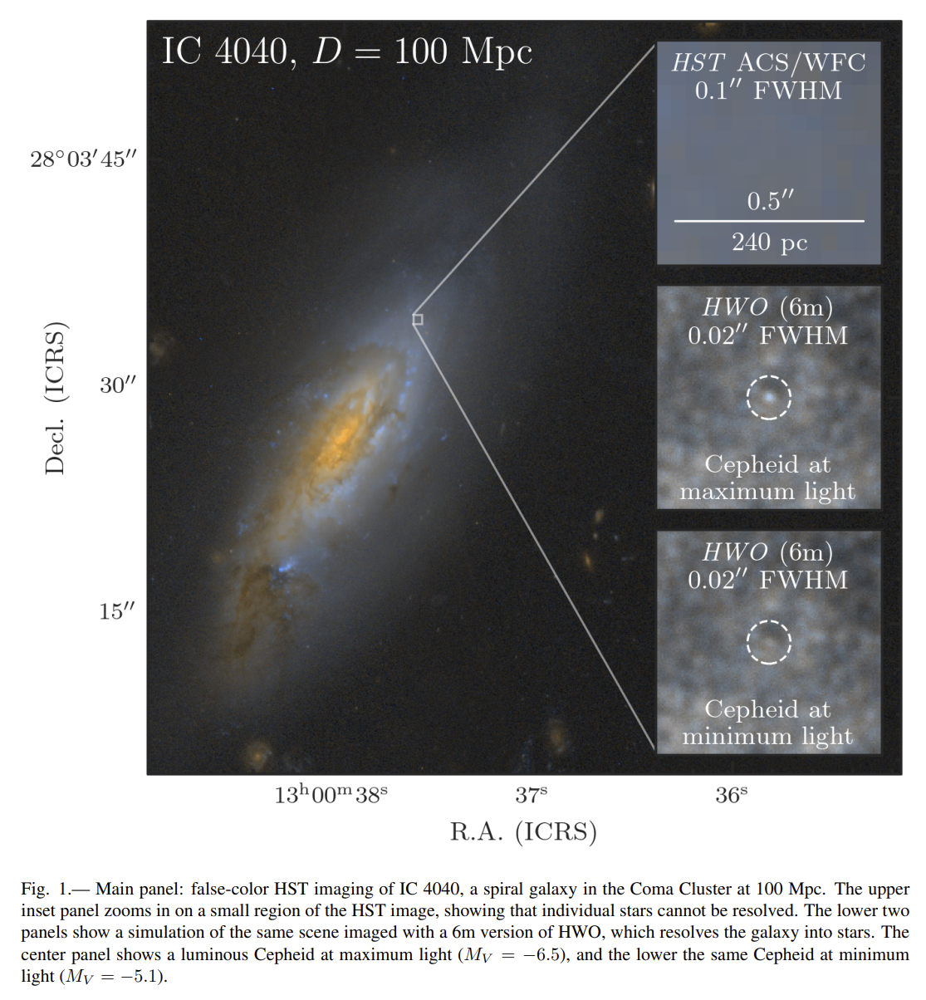
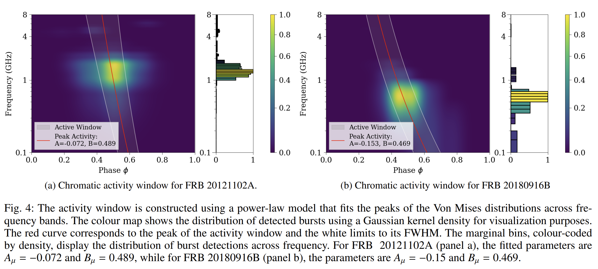

## 2025-07-01

1. [Constraining the Origin of FRB 20121102A's Persistent Radio Source with Long-Term Radio Observations](https://arxiv.org/abs/2506.23861)

   > Fast Radio Burst, PRS, Observation

   uGMRT在2023年对FRB121102的PRS的观测，结合了其他望远镜的数据。发现PRS在L波段和745MHz的流量没有显著的长期变化，其流量变化完全可以由星际闪烁解释，在400MHz没有探测到PRS。

   

   磁星风星云模型和超星云模型在解释PRS的长期演化时存在困难，而低光度活动星系核模型则与观测结果较为一致。

2. [An investigation into correlations between FRB and host galaxy properties](https://arxiv.org/abs/2506.23403)

   > Fast Radio Burst, Galaxy, Statistics

   统计ASKAP的FRB与宿主星系属性的关系。

   - 发现散射时间尺度与恒星面密度、质量加权年龄和气体相金属丰度显著相关。致密的宿主星系可能具有更多的电离物质，导致更强的散射。

     

   - RM与宿主星系的光盘轴比b/a之间存在强反相关，表明边缘朝向的宿主星系可能使FRB通过更多的星系介质，从而增加RM值。

     

   - 圆极化分数与宿主星系的有效半径呈弱负相关，但这一结果主要受一个数据点的影响。

     

## 2025-07-02

1. [The radiative subpulse modulation and spectral features of PSR B1929+10 with the whole pulse phase emission](https://arxiv.org/abs/2507.00610)

   > Pulsar, Observation

   FAST对PSR B1929+10的观测，发现其在整个360°经度范围内都有辐射，表明其为全经度辐射脉冲星。

   平均脉冲轮廓中至少检测到15个辐射成分。强辐射成分（主脉冲和中间脉冲）的光谱指数较平，小于1.7；而弱辐射成分的光谱指数较陡，大于2.3。

   在单脉冲中检测到窄带辐射特征和线性偏振位置角（PPA）的频繁跳变。通过旋转矢量模型（RVM）拟合观测到的PPA变化，得到脉冲星的倾角α为55.62°，撞击角β为53.47°。

2. [An outer-disk SX Phe variable star in Rubin Data Preview 1](https://arxiv.org/abs/2507.00192)

   > Variable, Stellar, Light Curve, Periodicity

   在LSST Data Preview 1中发现一颗SX Phoenicis型脉动变星。

   

   计算DP1数据g和r波段的StetsonJ、IQR和Chi2值，使用IsolationForest进行异常检测，筛选出前10个异常对象。使用[Psearch](https://github.com/AbhijitSaha/Psearch)结合Lomb-Scargle周期图和相位离散最小化（2025-06-19/3）来找周期，最终确定了一颗周期为0.0767天（1.841小时）的变星，其g和r波段的脉动幅度分别为0.60和0.38星等。

   Psearch中实现了另一种周期搜索的方法，Lafler–Kinman，使用不同周期对光变曲线$(t_i,m_i)$进行折叠
   $$
   \phi_i=\frac{t_i\mod P}{P}
   $$
   然后按照相位进行排序，计算散度统计量
   $$
   \Theta(P)=\frac{\sum_{i=1}^N(m_{i+1}-m_i)^2+(m_1-m_N)^2}{\sum_{i=1}^N(m_i-\bar m)^2}
   $$
   相邻相位点差异越小，折线越平滑，$\Theta$越小。真实周期对应其最小值。

   - Lafler–Kinman 不分箱，直接按相位连成一条“折线”，度量这条折线的“长度”或“弯曲程度”。适合数据点较少、但噪声不太严重的情况。
   - PDM 则先把相位区间分箱，对每个箱内的离散度做统计，对箱大小和箱数比较敏感，但对异常点和采样不均匀更鲁棒一些。

3. [A period-increasing oscillation signal in a long gamma-ray burst](https://arxiv.org/abs/2507.00873)

   > High Energy, Periodicity, QPO

   在长伽马射线暴GRB131122B中观测到的一个周期逐渐增加的振荡信号。从Fermi/GBM、Swift/BAT和CGRO/BATSE等探测器记录的光曲线中视觉筛选GRB，使用0.2Hz和2.0Hz两个特征频率+Tukey窗口对光变曲线进行带通滤波，对滤波后的光曲线进行WWZ变换，发现频率随时间递减。

   

## 2025-07-03

1. [Calibrating DM_IGM - z relation using host galaxies of FRBs](https://arxiv.org/abs/2507.01270)

   > Fast Radio Burst, Statistics, Cosmology

   通过SED+Sersic拟合FRB宿主星系的参数，发现河外部分DM与sSFR正相关，根据此来校准Macquart（DM-z）关系。

   

2. [LIGHTS. A robust technique to identify galaxy edges](https://arxiv.org/abs/2507.01085)

   > Galaxy, Method

   提出一种稳健的找星系边缘的方法。通过SED或者颜色组合推导出星系的表面质量密度图，然后做密度图的二阶导，找到曲率变化最小的点，作为星系边缘。

   

3. [Meteoroid stream identification with HDBSCAN unsupervised clustering algorithm](https://arxiv.org/abs/2507.01501)

   > Meteoroid, Machine Learning

   CAMS流星体轨道数据库v3.0，包含471,582条流星轨道记录。定义了三种输入特征向量用于聚类：

   - **LUTAB向量**：基于CAMS查找表的四个参数，包括太阳黄道经度、太阳中心黄道辐射坐标、地球中心速度和辐射纬度。
   - **ORBIT向量**：基于五个日心轨道元素，包括近日点距离、偏心率、倾角、升交点和近地点角。
   - **GEO向量**：基于六个地球中心参数，包括太阳黄道经度、升交点余弦、升交点正弦、辐射余弦、辐射正弦和地球中心速度除以72。

   使用HDBSCAN进行聚类，使用轮廓系数、归一化互信息（NMI）和F1分数评估聚类性能，并通过主成分分析（PCA）支持分析。结果使用GEO向量时，HDBSCAN确认了39个流星体流，其中21个与CAMS高度匹配；使用ORBIT向量时，识别出30个流星体流，其中13个匹配度高。

   

4. [SpecCLIP: Aligning and Translating Spectroscopic Measurements for Stars](https://arxiv.org/abs/2507.01939)

   > Stellar, Spectrum, Deep Learning

   SpecCLIP用于解决恒星光谱分析中的对齐和翻译问题。在LAMOST低分辨率光谱上进行预训练，经过6个自注意力层处理后，得到一个768维的标记嵌入。Gaia XP光谱则使用一个简单的多层感知器（MLP）自编码器进行预训练。然后使用CLIP的方法进行对比学习。预测恒星参数。

   

## 2025-07-04

1. [Multi-year Polarimetric Monitoring of Four CHIME-Discovered Repeating Fast Radio Bursts with FAST](https://arxiv.org/abs/2507.02355)

   > Fast Radio Burst, Observation

   冯毅的文章，FAST观测4个重复FRB的偏振。

2. [Envisioning the Distance Ladder in the Era of the Habitable Worlds Observatory](https://arxiv.org/abs/2507.02056)

   > Stellar, Cosmology

   在哈勃常数测量中，利用即将推出的宜居世界天文台（Habitable Worlds Observatory, HWO）构建一个两步距离阶梯的可能性，以消除对Ia型超新星的依赖，并实现1%精度的H0测量。

   

   HWO将能够在100 Mpc的距离上探测到Cepheid变星，并通过测量其周光关系来精确确定距离。

3. [H.E.S.S. programme searching for VHE gamma rays associated with FRBs](https://arxiv.org/abs/2507.02143)

   > Fast Radio Burst, High Energy

   H.E.S.S.（高能立体系统）项目对快速射电暴（FRBs）的观测研究，旨在寻找与这些高能、短寿命的射电爆发相关的甚高能（VHE）伽马射线。给出了上限。

   

4. [Image Marker](https://arxiv.org/abs/2507.02153)

   > Astronomy, Software

   [Image Marker](https://github.com/andikisare/imgmarker)是一个多功能、高效的图像标记工具。

   

## 2025-07-07

今日停更

## 2025-07-08

1. [Siberian radioheliograph image classification using ensemble of CLIP, EfficientNet and CatBoost models](https://arxiv.org/abs/2507.04211)

   > Solar, Deep Learning, Radio

   [SRH](https://github.com/EgorovYaroslav/SRH)使用深度学习对西伯利亚射电日像仪(SRH)图像进行分类。使用CLIP「通过文本提示自动标注数据，进行零样本图像分类，"photo of a circle"表示"GOOD"，"photo of noise"表示"BAD"」、EfficientNet-B0和CatBoost分别进行图像分类，最后将EfficientNet、CLIP和CatBoost模型的预测结果结合到一个轻量级的前馈神经网络（FFNN）中，形成一个集成分类器。

   

2. [Discoveries of fine structures and secondary pulses in coherent radio emission from a magnetic massive star](https://arxiv.org/abs/2507.03882)

   > Stellar, Radio, Flare, Observation

   MeerKAT对B恒星 HD 142990 在800-1670MHz波段的观测。

   

   发现了次级脉冲，可能是由于恒星磁层中的传播效应引起的。

   

   发现了精细结构，其起源则需要进一步的高时间分辨率和宽带观测来揭示。这一关测揭示了主序射电脉冲星（MRP）的复杂射电脉冲特性。

   

3. [CHIME/FRB Discovery of an Unusual Circularly Polarized Long-Period Radio Transient with an Accelerating Spin Period](https://arxiv.org/abs/2507.05139)

   > LPT, Transient, Observation

   CHIME发现长周期暂现源（LPT）CHIME J1634+44，该源具有841秒的脉冲周期和4206秒的次级周期，后一周期可能与双星活动有关。是首个已知发射完全圆偏振射电暴的LPT，也是首个表现出显著自旋加速的LPT（周期导数为负值$\dot P--9.03\times10^{-12}s/s$）。

   

   坐标(RA, Dec) = (16h34m29.96s±0.5", +44d50m13.5s±1.1")，色散22，峰值流量密度0.42-12 Jy，持续时间70-1100ms，Swift/XRT未检测到对应源排除了活跃磁星的可能性。

4. [Strongly polarised radio pulses from a new white-dwarf-hosting long-period transient](https://arxiv.org/abs/2507.05078)

   > LPT, Transient, Observation

   LOFAR发现ILT J163430+445010，跟上一篇CHIME发现的LPT是同一个源，通过LOFAR两米巡天（LoTSS）对Stokes V暂现源的盲搜发现的。检测到19个脉冲，每个脉冲的总极化分数约为100%，脉冲持续时间不超过10秒。

   在紫外（GALEX MIS）和光学（UNIONS）巡天中检测到微弱的对应体，结合GALEX和UNIONS数据，拟合得到白矮星的有效温度范围为15000K到33000K，质量大于0.78太阳质量。

   

   每五个周期后产生两个脉冲，间隔两到三个周期的等待时间。可能是双星系统中5:2或5:3自旋-轨道共振的结果，伴星（可能是超冷矮星或另一颗白矮星）诱导白矮星产生射电辐射。

5. [First detection of Circular Polarization in radio continuum towards a Massive Protostar](https://arxiv.org/abs/2507.04913)

   > Stellar, Radio, Observation

   首次在大质量原恒星IRAS 18162-2048的射电连续谱中检测到圆偏振，并提出两种可能的发射机制：回旋同步辐射和法拉第转换。假设回旋同步辐射是主要原因，估计原恒星附近的磁场强度为20-35 G。

   

6. [Introduction to the China Space Station Telescope (CSST)](https://arxiv.org/abs/2507.04618)

   > Instrument, Review, Optical

   CSST科学综述，设计寿命10年。CSST采用离轴三反射镜消像散(TMA)光学系统，主镜直径2米，焦距28米。

   **主要科学目标**

   1. 宇宙学
      - 测量宇宙演化历史，揭示暗能量观测特性
      - 测量不同尺度的暗物质宇宙结构，测试暗物质理论
      - 通过弱引力透镜、星系团、重子声学振荡(BAO)等精确测量宇宙学参数
      - 研究引力理论和宇宙大尺度结构
   2. 星系和活动星系核(AGN)
      - 测量不同红移星系的结构参数
      - 构建大样本AGN，研究黑洞与宿主星系的共同演化
      - 研究星系形态多样性和演化过程
   3. 银河系和近邻星系
      - 研究银河系和近邻星系的结构、形成和演化
      - 研究星际介质(ISM)和星系生态系统
      - 精确测量暗物质分布和质量
   4. 恒星
      - 研究恒星形成、结构和演化
      - 探测致密天体(如中子星、黑洞)和恒星活动
   5. 系外行星
      - 直接成像邻近类木行星和原行星盘
      - 探测银河系中心方向的系外行星
      - 研究行星形成和演化
   6. 太阳系天体
      - 探索太阳系小天体的空间分布和物理化学性质
      - 发现新小行星、彗星等

   **配备了五种科学仪器**

   1. 巡天相机(SC)
      - 主焦平面探测器：30个9k×9k CCD
      - 7个测光成像波段(NUV,u,g,r,i,z,y)和3个无缝光谱波段(GU,GV,GI)
      - 空间分辨率：0.074"/像素
      - 视场：1.72平方度(全视场)，1.1平方度(主成像区)
      - 计划进行17,500平方度宽视场和400平方度深视场巡天
   2. 多通道成像仪(MCI)
      - 分为近紫外、光学蓝和光学红三个通道
      - 每个通道使用CCD覆盖7.5'×7.5'视场
      - 角尺寸：0.05"/像素
      - 主要用于建立高精度流量校准星表和进行极深场观测
   3. 积分视场光谱仪(IFS)
      - 视场≥6"×6"
      - 空间分辨率~0.2"
      - 光谱范围：0.35-1μm，分辨率R≥1000
      - 主要用于研究星系中心区域、强引力透镜等
   4. 冷行星成像日冕仪(CPI-C)
      - 对比度成像≥10⁻⁸(600-900nm)
      - 内工作角(IWA)≤0.55"(633nm)
      - 主要用于搜索邻近类太阳恒星周围的成熟类木行星和超级地球
   5.  太赫兹光谱仪(TS)
      - 频率范围：0.41-0.51 THz
      - 瞬时带宽(IBW)>1 GHz
      - 主要用于探测天体化学成分和星际介质

   **多种观测模式**

   - 17,500平方度宽视场巡天(测光和光谱)
   - 400平方度深视场巡天
   - 9平方度超深场(UDF)观测
   - 300平方角分极深场(XDF)观测
   - 目标机会(ToO)观测

   

7. [Chromatic activity window of periodic FRBs: FRB 20121102A and FRB 20180916B](https://arxiv.org/abs/2507.04609)

   > Fast Radio Burst, Period, Periodicity, Statistics

   统计FRB121102和180916的周期在不同频率下的表现。发现

   - **FRB 20180916B**：活动窗口在高频下开始较早且变窄，符合之前的发现。
   - **FRB 20121102A**：活动窗口在高频下开始较早但变宽，这是一种新发现的色散行为。

   

8. [RRAT-like behaviour of PSR B0656+14 observed with I-LOFAR](https://arxiv.org/abs/2507.04518)

   > Pulsar, Observation

   LOFAR对PSR B0656+14的观测，在低频下表现出高度可变、无记忆的发射特性，类似于某些RRATs。需要异常大量的脉冲才能达到轮廓稳定性，反映了其发射机制的复杂性。流量密度分布呈现混合行为(对数正态+幂律)，单脉冲谱指数变化显著。尽管DM测量精度高(14.053±0.005 pc cm⁻³)，但仍不足以用于太阳风研究。

   

9. [Crowded Field Photometry with Rubin: Exploring 47 Tucanae with Data Preview 1](https://arxiv.org/abs/2507.03228)

   > Stellar, Cluster

   利用Vera C. Rubin天文台的Data Preview 1（DP1）数据对球状星团47 Tucanae（47 Tuc）进行拥挤场测光分析。尽管当前的摄影测量管道在密集区域存在局限性，但通过强制摄影测量方法，可以显著扩展对星团内部区域的探测。最终通过**diaForcedSource**，恢复了14744个可能的47 Tucanae成员。

   

10. [Continued radio observations of the persistent radio source associated with FRB20190520B provides insights into its origin](https://arxiv.org/abs/2507.03113)

    > Fast Radio Burst, PRS, Observation

    对FRB190520的PRS的观测，PRS在1.5 GHz和3 GHz波段呈现缓慢衰减（约4年），叠加间歇性增亮和变暗现象。低于1 GHz的观测（uGMRT数据）表明存在光谱截断（700 MHz–1.3 GHz），可能由同步自吸收导致。

    

    结合磁星风星云模型和闪烁效应模型，估计PRS的年龄约为53年，尺寸的下限为> 0.52 pc。

11. [Radio Morphology of Gamma-ray Sources -- II. Giant Radio Galaxies](https://arxiv.org/abs/2507.03105)

    > Galaxy, High Energy

    巨型射电源(GRGs)在γ射线波段的特性。GRGs是活动星系核(AGN)宿主相对论性喷流的产物，其投影长度超过0.7 Mpc。这些天体对于理解射电源的演化及其与周围环境的相互作用至关重要。

    研究通过低分辨率射电巡天数据，成功识别并研究了16个伽马射线星系，揭示了其在伽马射线波段的辐射特性和射电形态的多样性。

    

## 2025-07-09

1. [Localisation and host galaxy identification of new Fast Radio Bursts with MeerKAT](https://arxiv.org/abs/2507.05982)

   > Fast Radio Burst, Galaxy, Localization

   MeerKAT射电望远镜对15个新的非重复FRB的定位，并成功识别了其中11个的宿主星系，红移范围从0.32到0.85，展示了MeerKAT对高红移FRB的敏感性。

   

2. [What ZTF Saw Where Rubin Looked: Anomaly Hunting in DR23](https://arxiv.org/abs/2507.06217)

   > Stellar, Variable, Machine Learning

   使用**PineForest算法**「基于主动学习的改进版Isolation Forest，通过专家反馈迭代优化异常排名」在[light-curve](https://github.com/light-curve/light-curve-python)提取的参数上，在ZTF与LSSTComCam重叠观测区域中系统性地搜索天文异常现象，发现了6个新的变星。

## 2025-07-10

1. [Denoising radio pulses from air showers using machine-learning methods](https://arxiv.org/abs/2507.06688)

   > Radio, Deep Learning

   使用Encoder-Decoder对来自宇宙射线空气簇射（EAS）的无线电脉冲进行降噪的研究。

   

   该方法在SNR>4时去噪效率超过95%，同时保持误报率在控制范围内，并保留了信号的峰值位置和幅度。

   

2. [The Distribution of Atomic Hydrogen in the Host Galaxies of FRBs](https://arxiv.org/abs/2507.06594)

   > Fast Radio Burst, Galaxy, Statistics

   对14个FRB宿主星系的HI观测，揭示了其扰动和不对称性的趋势。通过多种不对称性指标，识别出6个宿主星系存在显著的扰动，4个未发现扰动，3个需要进一步观测。扰动与未扰动的宿主星系比例为11:4。

   

3. [Astro-COLIBRI: A Comprehensive Platform for Real-Time Multi-Messenger Astrophysics](https://arxiv.org/abs/2507.06616)

   > Astronomy, Transient, Software

   [Astro-COLIBRI](https://astro-colibri.com/)是一个为实时多信使天体物理学设计的综合平台，旨在解决现代时域和多信使(TDAMM)天体物理学面临的数据洪流挑战。该平台由法国CEA巴黎萨克雷大学IRFU研究所的团队开发，能够处理来自伽马射线暴(GRBs)、快速射电暴(FRBs)、恒星耀斑、新星和超新星等多种瞬变现象的警报，同时整合高能中微子和引力波等新型宇宙信使的数据。

   

4. [Measuring cosmic baryon density with FRB and GW data](https://arxiv.org/abs/2507.06841)

   > Fast Radio Burst, Cosmology

   结合快速射电暴（FRB）和引力波（GW）数据来精确测量宇宙重子密度。

   

5. [Model-independent observational constraints with fast radio bursts](https://arxiv.org/abs/2507.06975)

   > Fast Radio Burst, Cosmology

   利用快速射电暴（FRBs）作为宇宙学探针，通过两种模型无关的方法（人工神经网络重建和宇宙学参数化）来约束宇宙学参数。

6. [Ray-tracing Fast Radio Bursts Through IllustrisTNG: Cosmological Dispersion Measures from Redshift 0 to 5.5](https://arxiv.org/abs/2507.07090)

   > Fast Radio Burst, Cosmology

   通过宇宙学数值模拟研究了快速射电暴（FRB）的色散测量（DM）在宇宙大尺度结构的分布，还生成了全天空DM图。

   

7. [The Nineteenth Data Release of the Sloan Digital Sky Survey](https://arxiv.org/abs/2507.07093)

   > Survey, Review

   斯隆数字化巡天（SDSS）的第五次代（SDSS-V）的第一次重要的数据发布。DR19包含了来自SDSS-V三大科学“映射器”（MWM、BHM和LVM）的新数据。

   包括光学BOSS光谱和近红外APOGEE光谱，覆盖了从银河系到本地星系团的广泛天体。可以通过[Zora](https://dr19.sdss.org/zora)在线查看。

   

## 2025-07-11

1. [Imaging-Spectroscopic diagnosis of the Giant Sloshing Spiral in the Virgo Cluster with the Einstein Probe Follow-up X-ray Telescope](https://arxiv.org/abs/2507.07412)

   > High Energy, Galaxy

   使用爱因斯坦探针的FXT对Virgo星系团进行的深度观测研究，揭示了该星系团中一个巨大的气体晃动螺旋结构。螺旋结构具有低温、低熵和高密度的特点，支持了由小并合事件引起的气体摆动机制。

   

2. [Detecting Galactic Rings in the DESI Legacy Imaging Surveys with Semi-Supervised Deep Learning](https://arxiv.org/abs/2507.07552)

   > Galaxy, Deep Learning

   提出了一种名为[GC-SWGAN](https://github.com/zjluo-code/GC-SWGAN-Rings)「结合了半监督生成对抗网络SGAN和带梯度惩罚的Wasserstein GAN」的半监督深度学习模型，用于从DESI Legacy Imaging Surveys(DESI-LS)的高分辨率图像中识别盘状星系的环状结构。

   

3. [Circular polarization of fast radio bursts by asymmetric erosion in longitudinally magnetized plasma](https://arxiv.org/abs/2507.07561)

   > Fast Radio Burst, Theory

   研究了快射电暴在磁星磁层中传播时产生圆偏振的物理机制。通过一维粒子模拟研究了强射电波在纵向磁化电子主导等离子体中的非线性传播，发现磁场可以显著改变LCP和RCP脉冲的侵蚀速率，从而生成圆偏振模式。

4. [Constraining the origin of the long term periodicity of FRB 20180916B with Polarization Position Angle](https://arxiv.org/abs/2507.07651)

   > Fast Radio Burst, Periodicity, Polarization

   通过对FRB 20180916B的偏振位置角进行详细测量和分析，揭示了其短时间尺度和长时间尺度的变化特性。

   FRB 20180916B的PA在短时间尺度内（小于四小时）的变化范围不超过7度。在活动周期内，PA的变化率约为每小时1度，表明存在显著的日内变化。

   

5. [Evaluating Retrieval-Augmented Generation Agents for Autonomous Scientific Discovery in Astrophysics](https://arxiv.org/abs/2507.07155)

   > Astronomy, LLM

   提出了[CosmoPaperQA](https://github.com/CMBAgents/cmbagent)和[SciRag](https://github.com/CMBAgents/scirag)框架，用于解决天体物理学中RAG代理的系统评估问题。

   - **CosmoPaperQA:** 构建了一个包含105个专家验证的问题-答案对的基准数据集。该数据集从五篇高影响力的天体物理学文献中提取问题，涵盖了观测、理论和计算方面的现代宇宙学研究。

   - **Sci Rag:** 开发了一个模块化框架，用于系统地集成和基准测试多种RAG代理。该框架支持商业API（如OpenAI Assistant和VertexAI Assistant）、混合架构（如ChromaDB与OpenAI/Gemini嵌入模型）、学术工具（如PaperQA2）和搜索增强系统（如Perplexity）。

     

   人类评估结果显示，使用OpenAI嵌入和生成模型的RAG代理表现最佳，准确率达到91.4%。

   

## 2025-07-14

1. [SN 2023ixf: The Closest Supernova of the Decade](https://arxiv.org/abs/2507.08078)

   > Supernovae, Review

   SN 2023ixf于2023年5月18日在M101（6.85Mpc）爆发，这是过去十年距离我们最近的超新星。这篇文章总结了对这个超新星的多波段观测。

   

2. [A survey for radio pulsars and transients in the 10 pc region around Sgr A*](https://arxiv.org/abs/2507.08534)

   > Transient, Survey

   用Effelsberg在Sgr A*周围10pc的区域进行暂现源搜索，观测频段4-8GHz，搜索脉冲星（PuslarX）、单脉冲（TransientX）和线偏振搜索。只检测到已知脉冲星PSR J1746-2850，和来自磁星SGR J1745-2900的单脉冲。

   

3. [Einstein Probe discovery of the short period intermediate polar EP J115415.8-501810](https://arxiv.org/abs/2507.08304)

   > Transient, High Energy, Observation

   EP探测到X射线暂现源EP240309a，后续光学观测这个你认为它是一个灾变变星，自转周期为238.2s、轨道周期3.76小时的白矮星。这里报道EP的后续观测，在0.3-2keV检测到231s的周期，2-10keV没有明显脉冲。ASKAP和MWA的观测没有射电信号。

   

## 2025-07-15

1. [Bridging Literature and the Universe Via A Multi-Agent Large Language Model System](https://arxiv.org/abs/2507.08958)

   > Cosmology, LLM

   [SimAgents](https://github.com/xwzhang98/SimAgents)通过双智能体协作，自动化宇宙学模拟的参数配置和初步分析，从而加速物理学研究。

   - **Physics Agent**：利用宇宙学领域知识从论文中提取参数（如宇宙学常数、模拟盒子大小、红移等）。
   - **Software Agent**：根据软件用户手册验证参数的覆盖范围和有效性，生成符合格式要求的参数文件。

   

## 2025-07-16

1. [Mapping Diffuse Radio Sources Using TUNA: A Transformer-Based Deep Learning Approach](https://arxiv.org/abs/2507.11320)

   > Deep Learning, Galaxy, Radio

   用Transformer实现的Unet，用于射电图像中弥漫射电源的检测和分割。

   

## 2025-07-17

1. [Galaxy image simplification using Generative AI](https://arxiv.org/abs/2507.11692)

   > Galaxy, Deep Learning

   [galaxy-image-simplification-using-genai](https://github.com/SaiTeja-Erukude/galaxy-image-simplification-using-genai)，通过两阶段cGAN「**初级cGAN**：U-Net生成器+PatchGAN判别器结构，将原始星系图像转换为带白色臂线标记的图像。**后处理cGAN**：修复断裂臂线，采用迭代优化（5次迭代效果最佳）」，将复杂星系图像转换为"骨架化"简化形式。

   

2. [On the Fast-radio-burst-associated X-ray Bursts: Inverse Compton Scattering of Radio Photons by an Extreme Pair Flow During Magnetosphere Activities](https://arxiv.org/abs/2507.12405)

   > Fast Radio Burst, Theory

   提出了一种模型来解释FRB 200428及其关联XRB的光谱和时间特征。假设外磁层中的快速磁场演化生成一个大规模的低频脉冲，FRB光子被极端对流向量场中的相对论电子散射，产生高能X射线。

   

## 2025-07-18

1. [(Exhaustive) Symbolic Regression and model selection by minimum description length](https://arxiv.org/abs/2507.13033)

   > Astronomy, Symbolic Regression

   当前符号回归有两大问题，一个是随机搜索算法可能错过优质函数，成功率未知；另一个是使用Pareto判断复杂性度量标准主观且不一致。这里使用穷举符号回归[ESR](https://github.com/DeaglanBartlett/esr)+最小描述长度MDL来拟合数据。

2. [Astro-MoE: Mixture of Experts for Multiband Astronomical Time Series](https://arxiv.org/abs/2507.12611)

   > Light Curve, Deep Learning

   `Astro-MoE`用于动态处理多波段天文时间序列。模型采用仅编码器的Transformer结构，引入稀疏MoE层。

   在扩展的LSST天文时间序列分类挑战（ELAsTiCC-1）的第一轮数据和PanSTARRS1的第二版光曲线数据上，使用掩码重构目标进行预训练，每步随机选择90%的光曲线，其中30%的输入标记被掩码，30%被替换为随机值，剩余40%保持不变。

   

3. [The vanishing of the long photometric cycle in AU Monocerotis](https://arxiv.org/abs/2507.12559)

   > Variable, Periodicity

   AU Monocerotis的轨道周期在过去几十年内保持稳定，最近发现约417天的长周期信号在Ic和Z波段的原始光变曲线中仍然存在，但在V波段的数据中逐渐减弱并最终消失，同时出现了约280天的短周期信号。这是第二个观测到长周期突然消失的双周期变星系统。

   

4. [Einstein Probe Discovery of EP J182730.0-095633: A New Black Hole X-ray Binary Candidate in Faint Outburst?](https://arxiv.org/abs/2507.12876)

   > High Energy, Observation

   报告了爱因斯坦探测器发现的一个新的X射线暂现源EP J182730.0-095633。很可能是一个新的黑洞X射线双星系统，基于以下证据

   1. X射线能谱在整个爆发期间保持稳定（Γ~2），这与中子星系统在低光度时的软化趋势不同
   2. 射电-X射线光度关系符合黑洞X射线双星在硬态的特征
   3. 检测到的mHz QPO信号与已知黑洞系统中的低频QPO类似
   4. 近红外-射电光度比与黑洞系统一致

   [stingray](https://github.com/StingraySoftware/stingray)可以用来计算PDS功率谱。

## 2025-07-21

1. [ASKAP J144834-685644: a newly discovered long period radio transient detected from radio to X-rays](https://arxiv.org/abs/2507.13453)

   > Transient, LPT

   ASKAP发现了周期1.5小时的暂现源ASKAP J1448-6856，从射电到X射线多波段都有辐射。射电谱指数很陡，在1.5GHz以上出现频谱截断。ASKAP J1448-6856可能是一个近边缘向磁白矮星双星系统，但其射电发射机制仍不确定。

   

## 2025-07-22

1. [A prolific repeating fast radio burst source and a crisis of the magnetar model](https://arxiv.org/abs/2507.14707)

   > Fast Radio Burst, Observation

   FAST对FRB20240114A的观测，能量分布。

2. [Searching for periodic signals and quasi-periodic oscillations from an extremely active cycle of FRB 20240114A](https://arxiv.org/abs/2507.14708)

   > Fast Radio Burst, Observation, Periodicity

   FAST对FRB20240114A的观测，准周期，没有同样的准周期。

3. [Investigating FRB 20240114A with FAST: Morphological Classification and Drifting Rate Measurements in a Burst-Cluster Framework](https://arxiv.org/abs/2507.14711)

   > Fast Radio Burst, Morphology

   FAST对FRB20240114A的观测，形态学，有一些向上漂移的爆发。

4. [Decadal evolution of a repeating fast radio burst source](https://arxiv.org/abs/2507.15790)

   > Fast Radio Burst, Observation

   FAST对FRB121102的观测，DM下降。

5. ['Setting Fire to the Last Forest': Project West Ford and the Mobilization of the Astronomical Community 1958-1965](https://arxiv.org/abs/2507.14714)

   > Astronomy

   Project West Ford是1960年代初期美国军方的一项实验，旨在通过在轨道上部署数亿个铜制偶极子(dipole)创建**人工电离层**，作为核战争情况下微波无线电传播的备用系统。

   Project Echo(1960-1964)使用直径30米的镀铝聚酯薄膜气球作为被动反射器，1960年8月15日实现了首次卫星中继的电话通话，1962年4月首次中继直播电视信号。

   这项研究将PWF与现代大型卫星星座对天文研究的潜在影响进行了对比，展示了科学界如何应对空间活动对其工作的威胁。

   

6. [Frabjous: Deep Learning Fast Radio Burst Morphologies](https://arxiv.org/abs/2507.14854)

   > Fast Radio Burst, Morphology, Deep Learning

   `Frabjous`使用[simpulse](https://github.com/kmsmith137/simpulse)生成六种主要FRB形态数据

   

   1. **Type I**：单成分、宽带幂律谱。
   2. **Type II**：单成分、高斯谱，部分覆盖观测带宽。
   3. **Type III**：单成分、窄带高斯谱（带宽<25%）。
   4. **Type IV**：多成分爆发，各成分光谱相似。
   5. **Type V**：多成分爆发，呈现向下漂移模式。
   6. **Type VI**：受衍射模式启发的多峰结构（远旁瓣探测）。

   用普通卷积做分类，在模拟数据上效果好，真实数据分类准确率只有50%。

7. [A unified model for long-period radio transients and white dwarf binary pulsars](https://arxiv.org/abs/2507.15352)

   > LPT, Transient, Theory

   LPTs是新发现的银河系射电源，具有分钟至小时的周期性和高度偏振的脉冲（持续秒至分钟），其现象学与已知天体（如射电磁星或白矮星双星）存在差异。

   两个LPTs（ILT J1101+5521和GLEAM-X J0704-37）已被确认为同步化的白矮星-M矮星双星（极星），而AR Sco和J1912-44则表现为非同步化的短周期脉冲。

   提出几何模型：当白矮星的磁极在轨道平面内扫过伴星（M矮星）的星风时，触发射电辐射。辐射由沿磁力线加速的相对论粒子产生，形成与白矮星磁矩对齐的准直射电束。

8. [A new long period radio transient: Discovery of pulses repeating every 1.16 hours from ASKAP J175534.9-252749.1](https://arxiv.org/abs/2507.14448)

   > Transient, LPT, Observation

   探测到ASKAP J175534.9-252749.1是一个周期为1.16小时的新的长周期暂现源，所有观测到的脉冲都呈现单峰结构，大致呈高斯形状。周期4186.3285s，DM733，RM962。2023年ASKAP脉冲的偏振角变化符合旋转矢量模型，2024年ASKAP脉冲的偏振角平坦，2024年MeerKAT脉冲的偏振角弯曲，但不符合RVM预期。

   

   可能是**白矮星+红矮星双星系统**、**自转-轨道共振系统**等。

## 2025-07-23

1. [A Unified Volumetric Rate-Energy Relation from Magnetar Radio Bursts to Fast Radio Bursts](https://arxiv.org/abs/2507.16365)

   > Fast Radio Burst, Statistics

   看到SGR1935、CHIME非重复FRB和FRB180916在1e29-1e42 erg的范围内是同一个幂律分布，指数为1.31。因此认为河外FRB和磁星同一起源。

   

2. [Stellar Mass-Dispersion Measure Correlations Constrain Baryonic Feedback in Fast Radio Burst Host Galaxies](https://arxiv.org/abs/2507.16816)

   > Fast Radio Burst, Galaxy, Statistics

   选择低红移的FRB和其宿主星系，发现宿主星系的DM与其恒星质量成反比。

   

3. [Investigating Interacting Dark Energy Models Using Fast Radio Burst Observations](https://arxiv.org/abs/2507.16308)

   > Fast Radio Burst, Cosmology

   FRB的DM约束暗能量。当前FRB数据对暗能量-暗物质相互作用的约束能力有限，相互作用参数与零一致，与标准ΛCDM模型相符。

4. [Applying multimodal learning to Classify transient Detections Early (AppleCiDEr) I: Data set, methods, and infrastructure](https://arxiv.org/abs/2507.16088)

   > Transient, Deep Learning, Classification

   使用测光数据、图像截取、元数据和光谱多模态数据做变源分类。

   

5. [Betelgeuse, the Prototypical Red Supergiant](https://arxiv.org/abs/2507.15966)

   > Stellar, Review

   回顾了参宿四（Betelgeuse）这颗典型红超巨星的最新研究成果。

   

   变暗是由恒星表面的一次大规模质量抛射事件引起，长时间的光度和径向速度数据的分析，研究表明Betelgeuse可能拥有一个质量较小的伴星，这可能是导致其周期性亮度变化的原因之一。

## 2025-07-24

1. [Multi-modal encoder-decoder neural network for forecasting solar wind speed at L1](https://arxiv.org/abs/2507.17298)

   > Solar, Deep Learning

   基于编码器-解码器神经网络的框架，用于预测未来四天的太阳风速。

   

2. [Estimating the baryon fraction in the IGM from well-localized FRBs and DESI data](https://arxiv.org/abs/2507.17693)

   > Fast Radio Burst, Cosmology

   用快速射电暴结合其他观测数据来约束星际介质中的重子分数(fIGM)。

3. [A first measurement of baryonic feedback with Fast Radio Bursts](https://arxiv.org/abs/2507.17742)

   > Fast Radio Burst, Cosmology

   利用快速射电暴，对宇宙学中小尺度结构中的重子反馈效应进行了约束。FRB首次独立约束重子反馈，支持强反馈场景。
   $$
   \mathcal{D}^{\mathstrut}_\mathrm{LSS}(\hat{\boldsymbol{x}},z) = \mathcal{A}  \int_0^z   \frac{1+z'}{E(z')} f^{\mathstrut}_\mathrm{IGM} (z^\prime) \big[1+\delta^{\mathstrut}_\mathrm{e}(\hat{\boldsymbol{x}},z')\big] \mathrm{d} z'
   $$
   其中
   $$
   \mathcal{A}:= \frac{3 \Omega_\mathrm{b0} \chi_\mathrm{H}}{8 \uppi G m_\mathrm{p}}\chi_\mathrm{e}
   $$
   
4. [Do Multi-Structural One-Off FRBs Trace Similar Cosmology History with Repeaters?](https://arxiv.org/abs/2507.17708)

   > Fast Radio Burst, Statistics

   朱禹豪的文章，重复暴的事件率红移演化与恒星形成率无相似性。

5. [A narrowband burst from FRB 20190520B simultaneously observed by FAST and Parkes](https://arxiv.org/abs/2507.17696)

   > Fast Radio Burst, Observation

   朱禹豪的文章，FAST和Parkes探测到同一个爆发。

## 2025-07-25

1. [From Extraterrestrial Microbes to Alien Intelligence: Rebalancing Astronomical Research Priorities](https://arxiv.org/abs/2507.17790)

   > Astronomy, SETI

   65%的美国人和58.2%的受访天文学家相信外星智慧生命的存在，但是宜居世界天文台计划在未来二十年将获得超过100亿美元的资金，而外星智慧生命研究几乎没有获得联邦资助。

## 2025-07-28

1. [Refined Constraints on the Hubble Constant from Localized FRBs with Assessment of Systematic Effects](https://arxiv.org/abs/2507.18946)

   > Fast Radio Burst, Cosmology

   使用高银纬的定位的FRB限制哈勃常数。

2. [NASA Exoplanet Exploration Program (ExEP) Science Gap List](https://arxiv.org/abs/2507.18665)

   > Exoplanet, Review

   关于2025年外行星探索计划（ExEP）科学差距列表的详细报告，旨在识别和解决当前和外行星探测任务中的关键科学差距。

   

## 2025-07-29

1. [Gravitational lensing of fast radio bursts: prospects for probing microlens populations in lensing galaxies](https://arxiv.org/abs/2507.20305)

   > Fast Radio Burst, Theory, Lensing

   FRB由于其高事件率，是研究引力透镜效应的理想目标。通过观测强透镜FRB的微图像，可以约束透镜内的微透镜质量函数。研究表明，低恒星密度的星系透镜系统更适合探测次级微透镜种群，而高恒星密度会增加微图像数量，使得区分不同微透镜种群变得更加困难。

2. [A Systematic Search for AGN Flares in ZTF Data Release 23](https://arxiv.org/abs/2507.20232)

   > AGN, Light Curve

   使用高斯过程建模ZTF的AGN光变曲线，使用Matern-1/2协方差函数，定义统计量评估耀斑显著性。最终构建了两个AGN耀斑目录：AGN耀斑粗略目录（AGNFCC）和AGN耀斑精细目录（AGNFRC）。AGNFCC包含28,504个耀斑事件，AGNFRC包含1,984个高置信度耀斑事件。

3. [Comparing Quantum Machine Learning Approaches in Astrophysical Signal Detection](https://arxiv.org/abs/2507.19505)

   > Astronomy, Machine Learning, GRB

   通过量子机器学习（QML）方法来提高伽马射线暴（GRB）信号检测的效率和准确性。

   - **数据编码:** 将经典数据转换为量子态，编码方法包括幅度编码（数据编码为量子态的幅度）、角度编码、数据重上传（通过多层量子电路重复编码数据）、量子指纹（通过压缩和映射数据到量子态，保留数据的核心特征）。
   - **量子电路设计:** 量子核方法（通过量子电路计算数据点之间的内积，用于支持向量机等算法）、量子神经网络（利用参数化量子电路（PQC）构建量子版本的神经网络）

   QML在量子硬件上可能具有速度优势，但当前模拟环境下经典ML更快。

## 2025-07-30

1. [A Dormant Captured Oort Cloud Comet Awakens: (18916) 2000 OG44](https://arxiv.org/abs/2507.21324)

   > Planetary Science, Comet

   在小行星(18916) 2000 OG44(也被称为1977 SD)上观测到的活动现象，这颗天体此前被报告为灭绝彗星或具有彗星轨道的小行星。观测发现该天体在2023年7月24日和26日显示出指向反太阳和反运动方向的细长尾巴。

   

## 2025-07-31

1. [A Decentralized Framework for Radio-interferometric Image Reconstruction](https://arxiv.org/abs/2507.22128)

   > Radio, Method

   通过空间频率分区和分布式协同重建，显著提升了射电干涉成像的吞吐量，尤其适用于SKA级大数据场景。

