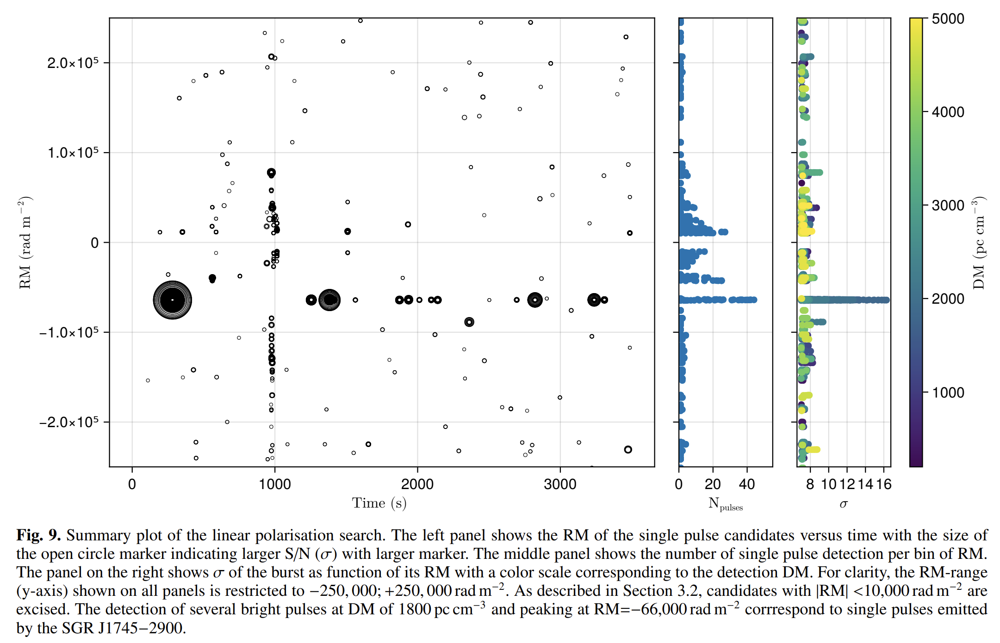

## 2025-07-01

1. [Constraining the Origin of FRB 20121102A's Persistent Radio Source with Long-Term Radio Observations](https://arxiv.org/abs/2506.23861)

   > Fast Radio Burst, PRS, Observation

   uGMRT在2023年对FRB121102的PRS的观测，结合了其他望远镜的数据。发现PRS在L波段和745MHz的流量没有显著的长期变化，其流量变化完全可以由星际闪烁解释，在400MHz没有探测到PRS。

   

   磁星风星云模型和超星云模型在解释PRS的长期演化时存在困难，而低光度活动星系核模型则与观测结果较为一致。

2. [An investigation into correlations between FRB and host galaxy properties](https://arxiv.org/abs/2506.23403)

   > Fast Radio Burst, Galaxy, Statistics

   统计ASKAP的FRB与宿主星系属性的关系。

   - 发现散射时间尺度与恒星面密度、质量加权年龄和气体相金属丰度显著相关。致密的宿主星系可能具有更多的电离物质，导致更强的散射。

     

   - RM与宿主星系的光盘轴比b/a之间存在强反相关，表明边缘朝向的宿主星系可能使FRB通过更多的星系介质，从而增加RM值。

     

   - 圆极化分数与宿主星系的有效半径呈弱负相关，但这一结果主要受一个数据点的影响。

     

## 2025-07-02

1. [The radiative subpulse modulation and spectral features of PSR B1929+10 with the whole pulse phase emission](https://arxiv.org/abs/2507.00610)

   > Pulsar, Observation

   FAST对PSR B1929+10的观测，发现其在整个360°经度范围内都有辐射，表明其为全经度辐射脉冲星。

   平均脉冲轮廓中至少检测到15个辐射成分。强辐射成分（主脉冲和中间脉冲）的光谱指数较平，小于1.7；而弱辐射成分的光谱指数较陡，大于2.3。

   在单脉冲中检测到窄带辐射特征和线性偏振位置角（PPA）的频繁跳变。通过旋转矢量模型（RVM）拟合观测到的PPA变化，得到脉冲星的倾角α为55.62°，撞击角β为53.47°。

2. [An outer-disk SX Phe variable star in Rubin Data Preview 1](https://arxiv.org/abs/2507.00192)

   > Variable, Stellar, Light Curve, Periodicity

   在LSST Data Preview 1中发现一颗SX Phoenicis型脉动变星。

   

   计算DP1数据g和r波段的StetsonJ、IQR和Chi2值，使用IsolationForest进行异常检测，筛选出前10个异常对象。使用[Psearch](https://github.com/AbhijitSaha/Psearch)结合Lomb-Scargle周期图和相位离散最小化（2025-06-19/3）来找周期，最终确定了一颗周期为0.0767天（1.841小时）的变星，其g和r波段的脉动幅度分别为0.60和0.38星等。

   Psearch中实现了另一种周期搜索的方法，Lafler–Kinman，使用不同周期对光变曲线$(t_i,m_i)$进行折叠
   $$
   \phi_i=\frac{t_i\mod P}{P}
   $$
   然后按照相位进行排序，计算散度统计量
   $$
   \Theta(P)=\frac{\sum_{i=1}^N(m_{i+1}-m_i)^2+(m_1-m_N)^2}{\sum_{i=1}^N(m_i-\bar m)^2}
   $$
   相邻相位点差异越小，折线越平滑，$\Theta$越小。真实周期对应其最小值。

   - Lafler–Kinman 不分箱，直接按相位连成一条“折线”，度量这条折线的“长度”或“弯曲程度”。适合数据点较少、但噪声不太严重的情况。
   - PDM 则先把相位区间分箱，对每个箱内的离散度做统计，对箱大小和箱数比较敏感，但对异常点和采样不均匀更鲁棒一些。

3. [A period-increasing oscillation signal in a long gamma-ray burst](https://arxiv.org/abs/2507.00873)

   > High Energy, Periodicity, QPO

   在长伽马射线暴GRB131122B中观测到的一个周期逐渐增加的振荡信号。从Fermi/GBM、Swift/BAT和CGRO/BATSE等探测器记录的光曲线中视觉筛选GRB，使用0.2Hz和2.0Hz两个特征频率+Tukey窗口对光变曲线进行带通滤波，对滤波后的光曲线进行WWZ变换，发现频率随时间递减。

   

## 2025-07-03

1. [Calibrating DM_IGM - z relation using host galaxies of FRBs](https://arxiv.org/abs/2507.01270)

   > Fast Radio Burst, Statistics, Cosmology

   通过SED+Sersic拟合FRB宿主星系的参数，发现河外部分DM与sSFR正相关，根据此来校准Macquart（DM-z）关系。

   

2. [LIGHTS. A robust technique to identify galaxy edges](https://arxiv.org/abs/2507.01085)

   > Galaxy, Method

   提出一种稳健的找星系边缘的方法。通过SED或者颜色组合推导出星系的表面质量密度图，然后做密度图的二阶导，找到曲率变化最小的点，作为星系边缘。

   

3. [Meteoroid stream identification with HDBSCAN unsupervised clustering algorithm](https://arxiv.org/abs/2507.01501)

   > Meteoroid, Machine Learning

   CAMS流星体轨道数据库v3.0，包含471,582条流星轨道记录。定义了三种输入特征向量用于聚类：

   - **LUTAB向量**：基于CAMS查找表的四个参数，包括太阳黄道经度、太阳中心黄道辐射坐标、地球中心速度和辐射纬度。
   - **ORBIT向量**：基于五个日心轨道元素，包括近日点距离、偏心率、倾角、升交点和近地点角。
   - **GEO向量**：基于六个地球中心参数，包括太阳黄道经度、升交点余弦、升交点正弦、辐射余弦、辐射正弦和地球中心速度除以72。

   使用HDBSCAN进行聚类，使用轮廓系数、归一化互信息（NMI）和F1分数评估聚类性能，并通过主成分分析（PCA）支持分析。结果使用GEO向量时，HDBSCAN确认了39个流星体流，其中21个与CAMS高度匹配；使用ORBIT向量时，识别出30个流星体流，其中13个匹配度高。

   

4. [SpecCLIP: Aligning and Translating Spectroscopic Measurements for Stars](https://arxiv.org/abs/2507.01939)

   > Stellar, Spectrum, Deep Learning

   SpecCLIP用于解决恒星光谱分析中的对齐和翻译问题。在LAMOST低分辨率光谱上进行预训练，经过6个自注意力层处理后，得到一个768维的标记嵌入。Gaia XP光谱则使用一个简单的多层感知器（MLP）自编码器进行预训练。然后使用CLIP的方法进行对比学习。预测恒星参数。

   

## 2025-07-04

1. [Multi-year Polarimetric Monitoring of Four CHIME-Discovered Repeating Fast Radio Bursts with FAST](https://arxiv.org/abs/2507.02355)

   > Fast Radio Burst, Observation

   冯毅的文章，FAST观测4个重复FRB的偏振。

2. [Envisioning the Distance Ladder in the Era of the Habitable Worlds Observatory](https://arxiv.org/abs/2507.02056)

   > Stellar, Cosmology

   在哈勃常数测量中，利用即将推出的宜居世界天文台（Habitable Worlds Observatory, HWO）构建一个两步距离阶梯的可能性，以消除对Ia型超新星的依赖，并实现1%精度的H0测量。

   

   HWO将能够在100 Mpc的距离上探测到Cepheid变星，并通过测量其周光关系来精确确定距离。

3. [H.E.S.S. programme searching for VHE gamma rays associated with FRBs](https://arxiv.org/abs/2507.02143)

   > Fast Radio Burst, High Energy

   H.E.S.S.（高能立体系统）项目对快速射电暴（FRBs）的观测研究，旨在寻找与这些高能、短寿命的射电爆发相关的甚高能（VHE）伽马射线。给出了上限。

   

4. [Image Marker](https://arxiv.org/abs/2507.02153)

   > Astronomy, Software

   [Image Marker](https://github.com/andikisare/imgmarker)是一个多功能、高效的图像标记工具。

   

## 2025-07-07

今日停更

## 2025-07-08

1. [Siberian radioheliograph image classification using ensemble of CLIP, EfficientNet and CatBoost models](https://arxiv.org/abs/2507.04211)

   > Solar, Deep Learning, Radio

   [SRH](https://github.com/EgorovYaroslav/SRH)使用深度学习对西伯利亚射电日像仪(SRH)图像进行分类。使用CLIP「通过文本提示自动标注数据，进行零样本图像分类，"photo of a circle"表示"GOOD"，"photo of noise"表示"BAD"」、EfficientNet-B0和CatBoost分别进行图像分类，最后将EfficientNet、CLIP和CatBoost模型的预测结果结合到一个轻量级的前馈神经网络（FFNN）中，形成一个集成分类器。

   

2. [Discoveries of fine structures and secondary pulses in coherent radio emission from a magnetic massive star](https://arxiv.org/abs/2507.03882)

   > Stellar, Radio, Flare, Observation

   MeerKAT对B恒星 HD 142990 在800-1670MHz波段的观测。

   

   发现了次级脉冲，可能是由于恒星磁层中的传播效应引起的。

   

   发现了精细结构，其起源则需要进一步的高时间分辨率和宽带观测来揭示。这一关测揭示了主序射电脉冲星（MRP）的复杂射电脉冲特性。

   

3. [CHIME/FRB Discovery of an Unusual Circularly Polarized Long-Period Radio Transient with an Accelerating Spin Period](https://arxiv.org/abs/2507.05139)

   > LPT, Transient, Observation

   CHIME发现长周期暂现源（LPT）CHIME J1634+44，该源具有841秒的脉冲周期和4206秒的次级周期，后一周期可能与双星活动有关。是首个已知发射完全圆偏振射电暴的LPT，也是首个表现出显著自旋加速的LPT（周期导数为负值$\dot P--9.03\times10^{-12}s/s$）。

   

   坐标(RA, Dec) = (16h34m29.96s±0.5", +44d50m13.5s±1.1")，色散22，峰值流量密度0.42-12 Jy，持续时间70-1100ms，Swift/XRT未检测到对应源排除了活跃磁星的可能性。

4. [Strongly polarised radio pulses from a new white-dwarf-hosting long-period transient](https://arxiv.org/abs/2507.05078)

   > LPT, Transient, Observation

   LOFAR发现ILT J163430+445010，跟上一篇CHIME发现的LPT是同一个源，通过LOFAR两米巡天（LoTSS）对Stokes V暂现源的盲搜发现的。检测到19个脉冲，每个脉冲的总极化分数约为100%，脉冲持续时间不超过10秒。

   在紫外（GALEX MIS）和光学（UNIONS）巡天中检测到微弱的对应体，结合GALEX和UNIONS数据，拟合得到白矮星的有效温度范围为15000K到33000K，质量大于0.78太阳质量。

   

   每五个周期后产生两个脉冲，间隔两到三个周期的等待时间。可能是双星系统中5:2或5:3自旋-轨道共振的结果，伴星（可能是超冷矮星或另一颗白矮星）诱导白矮星产生射电辐射。

5. [First detection of Circular Polarization in radio continuum towards a Massive Protostar](https://arxiv.org/abs/2507.04913)

   > Stellar, Radio, Observation

   首次在大质量原恒星IRAS 18162-2048的射电连续谱中检测到圆偏振，并提出两种可能的发射机制：回旋同步辐射和法拉第转换。假设回旋同步辐射是主要原因，估计原恒星附近的磁场强度为20-35 G。

   

6. [Introduction to the China Space Station Telescope (CSST)](https://arxiv.org/abs/2507.04618)

   > Instrument, Review, Optical

   CSST科学综述，设计寿命10年。CSST采用离轴三反射镜消像散(TMA)光学系统，主镜直径2米，焦距28米。

   **主要科学目标**

   1. 宇宙学
      - 测量宇宙演化历史，揭示暗能量观测特性
      - 测量不同尺度的暗物质宇宙结构，测试暗物质理论
      - 通过弱引力透镜、星系团、重子声学振荡(BAO)等精确测量宇宙学参数
      - 研究引力理论和宇宙大尺度结构
   2. 星系和活动星系核(AGN)
      - 测量不同红移星系的结构参数
      - 构建大样本AGN，研究黑洞与宿主星系的共同演化
      - 研究星系形态多样性和演化过程
   3. 银河系和近邻星系
      - 研究银河系和近邻星系的结构、形成和演化
      - 研究星际介质(ISM)和星系生态系统
      - 精确测量暗物质分布和质量
   4. 恒星
      - 研究恒星形成、结构和演化
      - 探测致密天体(如中子星、黑洞)和恒星活动
   5. 系外行星
      - 直接成像邻近类木行星和原行星盘
      - 探测银河系中心方向的系外行星
      - 研究行星形成和演化
   6. 太阳系天体
      - 探索太阳系小天体的空间分布和物理化学性质
      - 发现新小行星、彗星等

   **配备了五种科学仪器**

   1. 巡天相机(SC)
      - 主焦平面探测器：30个9k×9k CCD
      - 7个测光成像波段(NUV,u,g,r,i,z,y)和3个无缝光谱波段(GU,GV,GI)
      - 空间分辨率：0.074"/像素
      - 视场：1.72平方度(全视场)，1.1平方度(主成像区)
      - 计划进行17,500平方度宽视场和400平方度深视场巡天
   2. 多通道成像仪(MCI)
      - 分为近紫外、光学蓝和光学红三个通道
      - 每个通道使用CCD覆盖7.5'×7.5'视场
      - 角尺寸：0.05"/像素
      - 主要用于建立高精度流量校准星表和进行极深场观测
   3. 积分视场光谱仪(IFS)
      - 视场≥6"×6"
      - 空间分辨率~0.2"
      - 光谱范围：0.35-1μm，分辨率R≥1000
      - 主要用于研究星系中心区域、强引力透镜等
   4. 冷行星成像日冕仪(CPI-C)
      - 对比度成像≥10⁻⁸(600-900nm)
      - 内工作角(IWA)≤0.55"(633nm)
      - 主要用于搜索邻近类太阳恒星周围的成熟类木行星和超级地球
   5.  太赫兹光谱仪(TS)
      - 频率范围：0.41-0.51 THz
      - 瞬时带宽(IBW)>1 GHz
      - 主要用于探测天体化学成分和星际介质

   **多种观测模式**

   - 17,500平方度宽视场巡天(测光和光谱)
   - 400平方度深视场巡天
   - 9平方度超深场(UDF)观测
   - 300平方角分极深场(XDF)观测
   - 目标机会(ToO)观测

   

7. [Chromatic activity window of periodic FRBs: FRB 20121102A and FRB 20180916B](https://arxiv.org/abs/2507.04609)

   > Fast Radio Burst, Period, Periodicity, Statistics

   统计FRB121102和180916的周期在不同频率下的表现。发现

   - **FRB 20180916B**：活动窗口在高频下开始较早且变窄，符合之前的发现。
   - **FRB 20121102A**：活动窗口在高频下开始较早但变宽，这是一种新发现的色散行为。

   

8. [RRAT-like behaviour of PSR B0656+14 observed with I-LOFAR](https://arxiv.org/abs/2507.04518)

   > Pulsar, Observation

   LOFAR对PSR B0656+14的观测，在低频下表现出高度可变、无记忆的发射特性，类似于某些RRATs。需要异常大量的脉冲才能达到轮廓稳定性，反映了其发射机制的复杂性。流量密度分布呈现混合行为(对数正态+幂律)，单脉冲谱指数变化显著。尽管DM测量精度高(14.053±0.005 pc cm⁻³)，但仍不足以用于太阳风研究。

   

9. [Crowded Field Photometry with Rubin: Exploring 47 Tucanae with Data Preview 1](https://arxiv.org/abs/2507.03228)

   > Stellar, Cluster

   利用Vera C. Rubin天文台的Data Preview 1（DP1）数据对球状星团47 Tucanae（47 Tuc）进行拥挤场测光分析。尽管当前的摄影测量管道在密集区域存在局限性，但通过强制摄影测量方法，可以显著扩展对星团内部区域的探测。最终通过**diaForcedSource**，恢复了14744个可能的47 Tucanae成员。

   

10. [Continued radio observations of the persistent radio source associated with FRB20190520B provides insights into its origin](https://arxiv.org/abs/2507.03113)

    > Fast Radio Burst, PRS, Observation

    对FRB190520的PRS的观测，PRS在1.5 GHz和3 GHz波段呈现缓慢衰减（约4年），叠加间歇性增亮和变暗现象。低于1 GHz的观测（uGMRT数据）表明存在光谱截断（700 MHz–1.3 GHz），可能由同步自吸收导致。

    

    结合磁星风星云模型和闪烁效应模型，估计PRS的年龄约为53年，尺寸的下限为> 0.52 pc。

11. [Radio Morphology of Gamma-ray Sources -- II. Giant Radio Galaxies](https://arxiv.org/abs/2507.03105)

    > Galaxy, High Energy

    巨型射电源(GRGs)在γ射线波段的特性。GRGs是活动星系核(AGN)宿主相对论性喷流的产物，其投影长度超过0.7 Mpc。这些天体对于理解射电源的演化及其与周围环境的相互作用至关重要。

    研究通过低分辨率射电巡天数据，成功识别并研究了16个伽马射线星系，揭示了其在伽马射线波段的辐射特性和射电形态的多样性。

    

## 2025-07-09

1. [Localisation and host galaxy identification of new Fast Radio Bursts with MeerKAT](https://arxiv.org/abs/2507.05982)

   > Fast Radio Burst, Galaxy, Localization

   MeerKAT射电望远镜对15个新的非重复FRB的定位，并成功识别了其中11个的宿主星系，红移范围从0.32到0.85，展示了MeerKAT对高红移FRB的敏感性。

   

2. [What ZTF Saw Where Rubin Looked: Anomaly Hunting in DR23](https://arxiv.org/abs/2507.06217)

   > Stellar, Variable, Machine Learning

   使用**PineForest算法**「基于主动学习的改进版Isolation Forest，通过专家反馈迭代优化异常排名」在[light-curve](https://github.com/light-curve/light-curve-python)提取的参数上，在ZTF与LSSTComCam重叠观测区域中系统性地搜索天文异常现象，发现了6个新的变星。

## 2025-07-10

1. [Denoising radio pulses from air showers using machine-learning methods](https://arxiv.org/abs/2507.06688)

   > Radio, Deep Learning

   使用Encoder-Decoder对来自宇宙射线空气簇射（EAS）的无线电脉冲进行降噪的研究。

   

   该方法在SNR>4时去噪效率超过95%，同时保持误报率在控制范围内，并保留了信号的峰值位置和幅度。

   

2. [The Distribution of Atomic Hydrogen in the Host Galaxies of FRBs](https://arxiv.org/abs/2507.06594)

   > Fast Radio Burst, Galaxy, Statistics

   对14个FRB宿主星系的HI观测，揭示了其扰动和不对称性的趋势。通过多种不对称性指标，识别出6个宿主星系存在显著的扰动，4个未发现扰动，3个需要进一步观测。扰动与未扰动的宿主星系比例为11:4。

   

3. [Astro-COLIBRI: A Comprehensive Platform for Real-Time Multi-Messenger Astrophysics](https://arxiv.org/abs/2507.06616)

   > Astronomy, Transient, Software

   [Astro-COLIBRI](https://astro-colibri.com/)是一个为实时多信使天体物理学设计的综合平台，旨在解决现代时域和多信使(TDAMM)天体物理学面临的数据洪流挑战。该平台由法国CEA巴黎萨克雷大学IRFU研究所的团队开发，能够处理来自伽马射线暴(GRBs)、快速射电暴(FRBs)、恒星耀斑、新星和超新星等多种瞬变现象的警报，同时整合高能中微子和引力波等新型宇宙信使的数据。

   

4. [Measuring cosmic baryon density with FRB and GW data](https://arxiv.org/abs/2507.06841)

   > Fast Radio Burst, Cosmology

   结合快速射电暴（FRB）和引力波（GW）数据来精确测量宇宙重子密度。

   

5. [Model-independent observational constraints with fast radio bursts](https://arxiv.org/abs/2507.06975)

   > Fast Radio Burst, Cosmology

   利用快速射电暴（FRBs）作为宇宙学探针，通过两种模型无关的方法（人工神经网络重建和宇宙学参数化）来约束宇宙学参数。

6. [Ray-tracing Fast Radio Bursts Through IllustrisTNG: Cosmological Dispersion Measures from Redshift 0 to 5.5](https://arxiv.org/abs/2507.07090)

   > Fast Radio Burst, Cosmology

   通过宇宙学数值模拟研究了快速射电暴（FRB）的色散测量（DM）在宇宙大尺度结构的分布，还生成了全天空DM图。

   

7. [The Nineteenth Data Release of the Sloan Digital Sky Survey](https://arxiv.org/abs/2507.07093)

   > Survey, Review

   斯隆数字化巡天（SDSS）的第五次代（SDSS-V）的第一次重要的数据发布。DR19包含了来自SDSS-V三大科学“映射器”（MWM、BHM和LVM）的新数据。

   包括光学BOSS光谱和近红外APOGEE光谱，覆盖了从银河系到本地星系团的广泛天体。可以通过[Zora](https://dr19.sdss.org/zora)在线查看。

   

## 2025-07-11

1. [Imaging-Spectroscopic diagnosis of the Giant Sloshing Spiral in the Virgo Cluster with the Einstein Probe Follow-up X-ray Telescope](https://arxiv.org/abs/2507.07412)

   > High Energy, Galaxy

   使用爱因斯坦探针的FXT对Virgo星系团进行的深度观测研究，揭示了该星系团中一个巨大的气体晃动螺旋结构。螺旋结构具有低温、低熵和高密度的特点，支持了由小并合事件引起的气体摆动机制。

   

2. [Detecting Galactic Rings in the DESI Legacy Imaging Surveys with Semi-Supervised Deep Learning](https://arxiv.org/abs/2507.07552)

   > Galaxy, Deep Learning

   提出了一种名为[GC-SWGAN](https://github.com/zjluo-code/GC-SWGAN-Rings)「结合了半监督生成对抗网络SGAN和带梯度惩罚的Wasserstein GAN」的半监督深度学习模型，用于从DESI Legacy Imaging Surveys(DESI-LS)的高分辨率图像中识别盘状星系的环状结构。

   

3. [Circular polarization of fast radio bursts by asymmetric erosion in longitudinally magnetized plasma](https://arxiv.org/abs/2507.07561)

   > Fast Radio Burst, Theory

   研究了快射电暴在磁星磁层中传播时产生圆偏振的物理机制。通过一维粒子模拟研究了强射电波在纵向磁化电子主导等离子体中的非线性传播，发现磁场可以显著改变LCP和RCP脉冲的侵蚀速率，从而生成圆偏振模式。

4. [Constraining the origin of the long term periodicity of FRB 20180916B with Polarization Position Angle](https://arxiv.org/abs/2507.07651)

   > Fast Radio Burst, Periodicity, Polarization

   通过对FRB 20180916B的偏振位置角进行详细测量和分析，揭示了其短时间尺度和长时间尺度的变化特性。

   FRB 20180916B的PA在短时间尺度内（小于四小时）的变化范围不超过7度。在活动周期内，PA的变化率约为每小时1度，表明存在显著的日内变化。

   

5. [Evaluating Retrieval-Augmented Generation Agents for Autonomous Scientific Discovery in Astrophysics](https://arxiv.org/abs/2507.07155)

   > Astronomy, LLM

   提出了[CosmoPaperQA](https://github.com/CMBAgents/cmbagent)和[SciRag](https://github.com/CMBAgents/scirag)框架，用于解决天体物理学中RAG代理的系统评估问题。

   - **CosmoPaperQA:** 构建了一个包含105个专家验证的问题-答案对的基准数据集。该数据集从五篇高影响力的天体物理学文献中提取问题，涵盖了观测、理论和计算方面的现代宇宙学研究。

   - **Sci Rag:** 开发了一个模块化框架，用于系统地集成和基准测试多种RAG代理。该框架支持商业API（如OpenAI Assistant和VertexAI Assistant）、混合架构（如ChromaDB与OpenAI/Gemini嵌入模型）、学术工具（如PaperQA2）和搜索增强系统（如Perplexity）。

     

   人类评估结果显示，使用OpenAI嵌入和生成模型的RAG代理表现最佳，准确率达到91.4%。

   

## 2025-07-14

1. [SN 2023ixf: The Closest Supernova of the Decade](https://arxiv.org/abs/2507.08078)

   > Supernovae, Review

   SN 2023ixf于2023年5月18日在M101（6.85Mpc）爆发，这是过去十年距离我们最近的超新星。这篇文章总结了对这个超新星的多波段观测。

   

2. [A survey for radio pulsars and transients in the 10 pc region around Sgr A*](https://arxiv.org/abs/2507.08534)

   > Transient, Survey

   用Effelsberg在Sgr A*周围10pc的区域进行暂现源搜索，观测频段4-8GHz，搜索脉冲星（PuslarX）、单脉冲（TransientX）和线偏振搜索。只检测到已知脉冲星PSR J1746-2850，和来自磁星SGR J1745-2900的单脉冲。

   

3. [Einstein Probe discovery of the short period intermediate polar EP J115415.8-501810](https://arxiv.org/abs/2507.08304)

   > Transient, High Energy, Observation

   EP探测到X射线暂现源EP240309a，后续光学观测这个你认为它是一个灾变变星，自转周期为238.2s、轨道周期3.76小时的白矮星。这里报道EP的后续观测，在0.3-2keV检测到231s的周期，2-10keV没有明显脉冲。ASKAP和MWA的观测没有射电信号。

   

## 2025-07-15

1. [Bridging Literature and the Universe Via A Multi-Agent Large Language Model System](https://arxiv.org/abs/2507.08958)

   > Cosmology, LLM

   [SimAgents](https://github.com/xwzhang98/SimAgents)通过双智能体协作，自动化宇宙学模拟的参数配置和初步分析，从而加速物理学研究。

   - **Physics Agent**：利用宇宙学领域知识从论文中提取参数（如宇宙学常数、模拟盒子大小、红移等）。
   - **Software Agent**：根据软件用户手册验证参数的覆盖范围和有效性，生成符合格式要求的参数文件。

   

## 2025-07-16

1. [Mapping Diffuse Radio Sources Using TUNA: A Transformer-Based Deep Learning Approach](https://arxiv.org/abs/2507.11320)

   > Deep Learning, Galaxy, Radio

   用Transformer实现的Unet，用于射电图像中弥漫射电源的检测和分割。

   

## 2025-07-17

