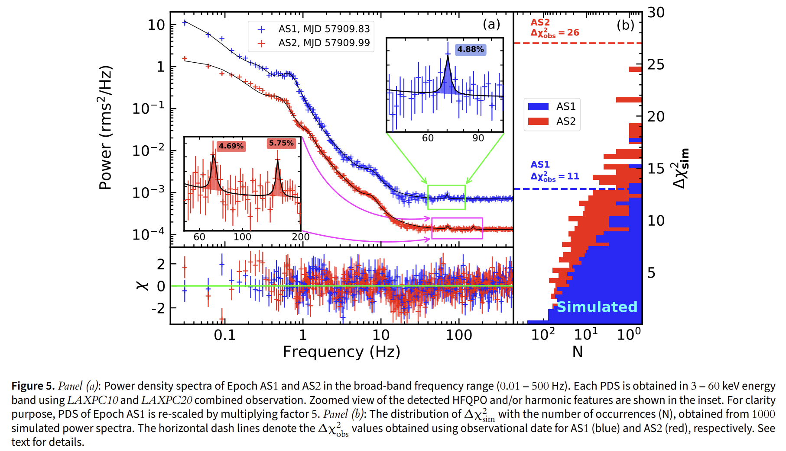
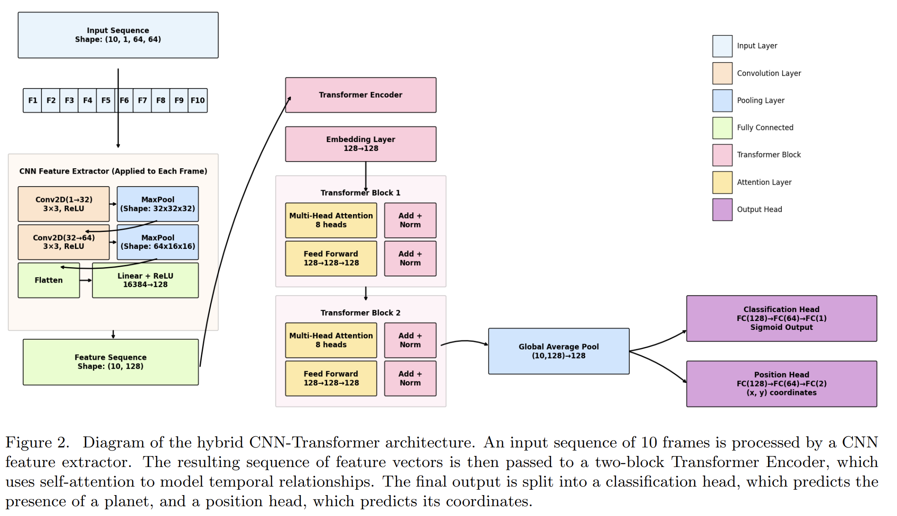

## 2025-08-01

1. [A Comprehensive Study of the Energy and Redshift Distributions of the Fast Radio Burst Population Based on the First CHIME/FRB Catalog](https://arxiv.org/abs/2507.23122)

   > Fast Radio Burst, Statistics

   对CHIME的FRB Catalog进行统计，发现FRB的红移分布追踪SFH，能量分布是Schechter函数，幂律指数-1.49，且能量分布没有红移演化。

2. [MeerKAT 1.3 GHz Observations of the Wide Angle Tail Radio Galaxy J1712-2435](https://arxiv.org/abs/2507.23463)

   > Radio, Galaxy, Observation

   2020年4月25日使用MeerKAT阵列，对宽角尾射电星系(WAT)J1712-2435进行了高分辨率(7.5角秒)的全偏振观测，覆盖856-1712 MHz频段。

   

   J1712-2435的内喷流在接近100 kpc处突然扩散成羽状结构，外部环境对其形态有显著影响。

3. [Echoes in Different Tempo: Long-Term Monitoring of Crab Echoes with CHIME](https://arxiv.org/abs/2507.23201)

   > Pulsar, Transient, Giant Pulse

   蟹状星云脉冲星的射电信号会因星云中电离物质的透镜效应产生延迟的回波（echoes），表现为脉冲轮廓中的附加成分，与星云中丝状结构的等离子体透镜相关。

   

   CHIME每天扫过Crab，每日记录15分钟基带数据（约680 GB/天），通过触发机制保存亮脉冲（共830天，35万+脉冲），以每日最亮脉冲为参考，通过互相关对齐单个脉冲，消除时间抖动（误差<1时间采样）。

   - 通过对齐和堆叠后的脉冲轮廓，可以清晰地看到回声事件在观测期间广泛存在。
   - 回声事件的延迟随时间呈抛物线演化，表明它们是由**等离子体透镜**效应引起的。
   - 部分回声事件的延迟在不同频率下表现出显著差异，表明存在额外的色散效应。与复杂FRB相似，支持等离子体透镜是FRB色散形态的可能机制之一。

   

## 2025-08-04

1. [Noise Reduction Method for Radio Astronomy Single Station Observation Based on Wavelet Transform and Mathematical Morphology](https://arxiv.org/abs/2508.00386)

   > Radio, Noise

   对去除背景噪声后的信号进行二维离散小波变换，并对小波系数进行阈值处理以有效去除干扰成分。

2. [A 50 s quasi-periodic oscillation in the early X-ray afterglow of GRB 220711B](https://arxiv.org/abs/2508.00278)

   > High Energy, QPO

   报道了GRB 220711B早期X射线余辉中发现的准周期振荡（QPO）信号，频率约为0.02 Hz。

   

## 2025-08-05

1. [A fast radio burst from the first 3 billion years of the Universe](https://arxiv.org/abs/2508.01648)

   > Fast Radio Burst, Galaxy, Observation

   MeerKAT探测到FRB20240304B，DM为2458.2，定位在红移2.148的年轻、低金属度的矮星系中。FRB视线穿过室女座星系团和一个前景星系群，分辨贡献了235和33的DM值，线偏振度49%，RM-55.6。

   

   首次将FRB探测扩展到z>2的宇宙时期，倾向于年轻的磁星起源，低金属度环境有利于大质量恒星形成，进而形成磁星。

2. [Discovery and dynamics of a Sedna-like object with a perihelion of 66 au](https://arxiv.org/abs/2508.02162)

   > Planetary Science

   通过FOSSIL II项目发现了一个新的Sedna-like天体"Ammonite"(2023 KQ14)，这是第四个被确认的Sedna-like天体。

   

## 2025-08-06

1. [Fast radio bursts as cosmic lightning](https://arxiv.org/abs/2508.03620)

   > Fast Radio Burst, Theory

   提出了一种新的快速射电暴（FRB）生成模型，将其归因于致密天体（如黑洞）吸积盘中积累电荷的突然放电。

2. [Investigation on deep learning-based galaxy image translation models](https://arxiv.org/abs/2508.03291)

   > Galaxy, Deep Learning

   使用SDSS+CFHTLS的星系图像对做翻译，分别使用Swin Transformer、SRGAN、Capsule network和Diffusion model。结果表明，Swin Transformer在重建星系全局结构方面表现最佳，其他模型稳定性差了一点。

   

## 2025-08-07

1. [The First Radio-Bright Off-Nuclear TDE 2024tvd Reveals the Fastest-Evolving Double-Peaked Radio Emission](https://arxiv.org/abs/2508.03807)

   > Radio, TDE

   AT 2024tvd是首个在光学巡天中发现，并具有双峰射电光变曲线的非核区潮汐瓦解事件。

   

   通过VLA、ALMA、ATA、AMI-LA和SMA等多台射电望远镜进行了首次多历元宽带射电和毫米波监测，第一个耀斑在光学发现后的131天达到峰值，第二个耀斑在194天出现，表现出极快的上升和下降速率。单个喷流无法解释。

## 2025-08-08

1. [A Deep VLA Search for a Persistent Radio Counterpart to the One-off FRB 20250316A](https://arxiv.org/abs/2508.05552)

   > Fast Radio Burst, PRS

   VLA观测FRB20250316A，没看到PRS。

   

2. [Hubble constant constraint using 117 FRBs with a more accurate probability density function for DMdiff](https://arxiv.org/abs/2508.05161)

   > Fast Radio Burst, Cosmology

   用FRB的DM测量哈勃常数，精细化修改了DMdiff的似然函数，测量到哈勃常数为66.9+-6。

3. [CLARA: A Modular Framework for Unsupervised Transit Detection Using TESS Light Curves](https://arxiv.org/abs/2508.04722)

   > Stellar, Light Curve, Machine Learning

   [CLARA](https://github.com/googleboy-byte/CLARA)使用**无监督随机森林（URF）**对TESS的光变曲线进行分类，其中**URF-4**（合成注入）最优平衡（召回率36.6%，精度1.3%）。

## 2025-08-11

1. [CLAPP: The CLASS LLM Agent for Pair Programming](https://arxiv.org/abs/2508.05728)

   > LLM, Cosmology

   [CLAPP](https://github.com/santiagocasas/clapp/)是一个专门为宇宙学研究者设计的AI编程助手，旨在帮助研究人员更高效地使用爱因斯坦-玻尔兹曼求解器[CLASS](https://github.com/lesgourg/class_public)，用于计算宇宙微波背景各向异性和大尺度结构观测值。

   

   使用AG2打包了多个LLM（包括GPT4.1、Gemini-2.5-pro等），结合RAG，给出CLASS画图的代码，示例包括绘制CMB温度功率谱、中微子质量对物质功率谱的抑制效应。

2. [Fast Radio Bursts from non-resonant Alfvén waves and synchrotron maser emission in the magnetar wind](https://arxiv.org/abs/2508.05840)

   > Fast Radio Burst, Theory

   提出了一种基于磁星（magnetar）风中非共振阿尔芬波与相对论性等离子体相互作用引发同步辐射脉泽（SME）产生FRB的模型。模型支持FRB高线偏振，但无法解释少数FRB的偏振角快速变化。

3. [Fast radio bursts by stellar wind microlensing of a faint background source](https://arxiv.org/abs/2508.05947)

   > Fast Radio Burst, Theory, Lensing

   传统引力透镜理论认为光线会因引力向质量聚集处弯曲，而等离子体透镜效应（如恒星风）会导致光线**远离**透镜（恒星）。

   前景恒星以典型速度（300 km/s）穿过背景射电源视线时，等离子体微透镜可在毫秒级时间内将稳态射电源放大≥200倍，表现为FRB。全天约80次/天，仅占观测FRB总数的1-2%，不影响FRB整体各向同性分布。若透镜为双星系统，成员周期性穿过视线可触发重复爆发，爆发间隔（小时至天）与恒星风密度波动功率谱一致（需密度比太阳风高数倍）。

## 2025-08-12

1. [Pushchino Multibeam Pulsar Search. VIII. Pulsar with a period of 40.9~s in observations of the LPA LPI](https://arxiv.org/abs/2508.06983)

   > Pulsar, Observation

   长周期脉冲星J0311+1402（周期P=40.9秒）前在分米波段被发现，但其低频辐射特性、周期性及单脉冲行为尚不明确。用俄罗斯的LPA望远镜数据，结合快速折叠算法（FFA）和单脉冲搜索技术，对J0311+1402进行周期性辐射和单脉冲检测。

   FFA分析未检测到周期性信号，表明脉冲星可能具有极高的消零比例。在米波段表现为典型的RRAT，辐射呈高度间歇性，与分米波段的连续辐射模式形成对比。

2. [No Metallicity Preference in Fast Radio Burst Host Galaxies](https://arxiv.org/abs/2508.07688)

   > Fast Radio Burst, Galaxy, Statistics

   发现 FRB 宿主星系的金属丰度范围很广，并且大体上与星系形成星系群体的 SFR 加权质量-金属丰度关系一致。FRB形成不依赖金属丰度，意味着第金属丰度的高红移星系中也能形成。

3. [Large Model Driven Solar Activity AI Forecaster: A Scalable Dual Data-Model Framework](https://arxiv.org/abs/2508.06892)

   > Solar, Deep Learning

   提出了太阳活动AI预报器，用于解决太阳耀斑预测问题。

   **情境感知模块（SPNet）**：该模块通过多模态变换器动态整合多种类型的太阳图像（如磁图、EUV图像、Hα图像），识别并映射关键太阳特征（如活动区、日冕洞、丝状物），生成每日太阳情境感知地图。

   **深入分析工具（IATools）**：该模块对SPNet生成的太阳情境感知地图进行分析，自动计算各种物理参数（如磁中性线R值、Hale磁性类型、McIntosh形态分类、耀斑指数FI），并提供太阳活动的定量描述和历史爆发信息。

   **耀斑预测模块（FPNet）**：该模块基于SPNet和IATools的数据和分析结果，构建端到端模型，提供全盘和各个活动区的强耀斑（≥M级）的概率预测和二元预测。

   

## 2025-08-13

1. [Possible detection of HFQPOs associated with 'unknown' variability class of GRS 1915+105](https://arxiv.org/abs/2508.08594)

   > High Energy, Periodicity, QPO

   GRS 1915+105表现出极其复杂的时间变化特性，已有15种已知的变异类别，但在某些时间段内，源可能会展示出不同于这些类别的行为。

   

   研究了GRS 1915+105在2017年6月期间的光谱时间特性，发现了一种新的“未知”变异类别（特征是低计数“凹陷”和相邻的“爆发”状特征交替出现，形成均匀的“C”形分布），并探测到可能的HFQPOs特征（频率分别为71 Hz和152 Hz）。

   

## 2025-08-14

1. [Studying Exoplanets in the Radio from the Moon](https://arxiv.org/abs/2508.09222)

   > Exoplanet, Radio, Instrument

   电离层阻挡了来自类地行星和类海王星系外行星的预期低频信号（<10 MHz）。月球射电观测任务（如LuSEE-Night）将通过周期叠加和Lomb-Scargle周期图分析技术，提升对微弱射电信号的探测能力。FarView和FARSIDE等未来月球射电阵列将进一步扩展探测范围，覆盖从类地行星到气态巨行星的多种系外行星系统，并首次实现统计性研究。

   

2. [Machine Learning for Exoplanet Detection: A Comparative Analysis Using Kepler Data](https://arxiv.org/abs/2508.09689)

   > Machine Learning, Variable, Light Curve

   评估各种机器学习方法在Kepler光变曲线上的性能，随机森林表现最优，K近邻次之，决策树和逻辑回归过拟合。[SMOTE](https://imbalanced-learn.org/stable/references/generated/imblearn.over_sampling.SMOTE.html)（Synthetic Minority Over-sampling Technique used for over-sampling）可以提升模型的分类能力。

3. [New Metrics for Identifying Variables and Transients in Large Astronomical Surveys](https://arxiv.org/abs/2508.09441)

   > Transient, Method

   高斯过程回归提供了一种无需预设光变曲线形状的通用方法，能够有效表征射电光变曲线的变异性。其超参数（尤其是σ_M32和σ_SE）可作为变源和暂现源的强判别指标，性能优于传统统计量。该方法适用于多波段巡天数据，未来可扩展至其他大规模时域巡天项目（如LSST和SKA）。https://github.com/shihchingfu/fu2025_transients_gp

## 2025-08-15

1. [Arecibo Wow! II: Revised Properties of the Wow! Signal from Archival Ohio SETI Data](https://arxiv.org/abs/2508.10657)

   > SETI, Radio

   再分析Wow!信号。从1977年8月13日至17日的打印输出中提取数据，并使用OCR工具将其转换为数字格式，并结合历史校准源和现代射电天文数据库（如HI4PI和NVSS）进行交叉验证。

   - 通过高斯拟合和望远镜指向校准，将信号的赤经精度提高到±3秒，并确定了两个可能的来源区域ra=19h25m02s±3s或19h27m55s±3s，dec=-26°57′±20′
   - 重新校准后，信号的峰值通量密度超过250 Jy，显著高于此前估计的54-212 Jy。
   - 修正后的频率为1420.726±0.005 MHz，对应径向速度为-84 km/s（蓝移），表明信号可能源自银河系内的高速中性氢（HI）云或其他天体物理现象。
   - 通过分析卫星轨道、太阳活动及仪器内部噪声，排除了人为或自然干扰的可能性。

   确认了小型冷氢云可以产生类似于Wow!信号的窄带信号，这可能表明它们有共同的起源。

   

2. [Teaching LLMs to Speak Spectroscopy](https://arxiv.org/abs/2508.10075)

   > Spectrum, LLM

   从SDSS DR16中选取3,000个星系光谱（红移范围0<z<0.5）作为训练集，1,000个作为验证集。使用LORA在LLaMA-3.1-8B上进行微调，直接将光谱流量的数字当作token输入（例如[4.56,7.54, 11.2]变为"4|5|6, 7|5|4, 1|1|2|0"）。

   测试结果表明，模型预测红移接近专用光谱模型的性能，在AstroBench上保留85.2%的问答性能，通用任务保留89.4%，证明其语言和科学推理能力未显著退化。

3. [The Southern-sky MWA Rapid Two-metre (SMART) pulsar survey -- III. A census of millisecond pulsars at 154 MHz](https://arxiv.org/abs/2508.10330)

   > Pulsar, Survey

   利用澳大利亚默奇森宽场阵列（MWA）的“南天快速两米巡天”（SMART）项目数据，对赤纬低于+30°的154颗MSP进行观测。通过电压捕获系统（VCS）记录原始电压数据，并采用相干消色散和极化合成技术处理数据。观测频段为139-170 MHz（中心频率154.24 MHz），时间分辨率达781 ns。通过RM合成和RM-CLEAN算法分析偏振特性，结合电离层校正模型（SPINIFEX）分离星际介质与电离层对RM的贡献。

   共检测到40颗MSP，其中11颗为首次在300 MHz以下被探测到（如PSRs J0125-2327、J1543-5149）。

   

## 2025-08-18

1. [Search of RRATs on declinations from +42 to +55 with a neural network](https://arxiv.org/abs/2508.11462)

   > Transient, Deep Learning

   基于俄罗斯Pushchino射电天文台的大型相控阵（LPA）望远镜的PUMPS巡天数据，使用最简单的神经网络识别动态频谱中的色散延迟信号。

   

   神经网络成功检测到15颗已知脉冲星的弱脉冲（部分S/N < 5）和3个新的RRATs（J0101+46、J0841+46、J2053+50），DM范围7.2-59.9，脉冲宽度20-300ms。

## 2025-08-19

1. [Tera-Hertz Counterparts to Fast Radio Bursts from Coherent Cherenkov Radiation by Tilted Bunches](https://arxiv.org/abs/2508.11736)

   > Fast Radio Burst, Theory

   相干切伦科夫辐射（CChR）可能产生FRB，如果是这样的机制，FRB可能存在THz对应体。

2. [How many stars form in compact clusters in the local Milky Way?](https://arxiv.org/abs/2508.12788)

   > Stellar, Cluster, Statistics

   基于Hunt & Reffert（2024，HR24）提供的致密疏散星团样本，估算恒星形成面密度率，结果显著高于以往研究，支持聚集形成模型作为银河系局部恒星形成的主要模式。

3. [Rings around giant planets and smaller bodies](https://arxiv.org/abs/2508.11963)

   > Planetary Science, Review

   总结了太阳系内巨行星和小天体的环系统特征，探讨了它们的起源和演化过程。研究表明，不同行星环系统的特征差异显著，其形成和维持机制也各不相同。

   

   **土星环系统**：土星环主要由水冰组成，厚度较薄，约为10米。环中的粒子在低速度下相互碰撞，形成自引力尾流结构。

   **天王星环系统**：天王星环包括密集的窄环和尘埃环。窄环的轨道周期与附近卫星的轨道周期存在共振关系，尘埃环中可能存在未被发现的小卫星。

   **木星环系统**：木星环主要由微米级尘埃粒子组成，分为晕环、主环、Amalthea环和Thebe环。环中的尘埃粒子受到太阳风和Poynting-Robertson拖曳的影响，不断被辐射和扩散。

   **海王星环系统**：海王星环主要由尘埃粒子组成，光学深度较小，约为0.1。环中的粒子同样受到太阳风和Poynting-Robertson拖曳的影响，不断被辐射和扩散。

   **小天体环系统**：Chariklo、Haumea和Quaoar等小天体也拥有环系统。这些环系统的形成机制可能与卫星的潮汐破坏、碰撞或彗星撞击有关。

4. [Magnetars in Binaries as the Engine of Actively Repeating Fast Radio Bursts](https://arxiv.org/abs/2508.12119)

   > Fast Radio Burst, Theory

   双星系统中的对齐磁星是活跃重复FRB的主要引擎，其几何构型和伴星相互作用可合理解释观测到的无周期性、RM演化多样性及高重复率等特征。

   

## 2025-08-20

1. [Multiwavelength Observations of the Apparently Non-repeating FRB 20250316A](https://arxiv.org/abs/2508.13999)

   > Fast Radio Burst, Observation

   多波段观测FRB20250316A，非重复暴，EP发现附近有X射线源，但是偏了7角秒，应该对不上。

   

2. [A τ-DM relation for FRB hosts?](https://arxiv.org/abs/2508.13317)

   > Fast Radio Burst, Galaxy, Statistics

   探讨了通过测量FRB的散射时间来推断宿主DM及其红移的可能性。尽管$\tau$和DM之间可能有联系，但由于银河系DM值、中间晕和宇宙大尺度结构的波动，这种关系在观测数据中难以测量。

3. [Hyperactive Magnetar Eruptions: Giant Flares, Baryon Ejections, and FRBs](https://arxiv.org/abs/2508.13419)

   > Fast Radio Burst, Theory

   提出双极扩散驱动的磁星爆发模型统一解释了巨型耀斑、重子抛射和FRB的物理关联。数值模拟证实磁场环迁移与物质抛射的可行性，并预测多波段辐射特征。

## 2025-08-21

1. [Breaking the Baryon Density - Hubble Constant Degeneracy in Fast Radio Burst Applications with Associated Gravitational Waves](https://arxiv.org/abs/2508.14434)

   > Fast Radio Burst, Cosmology

   利用GW-FRB联合事件的DM和DL数据，并结合独立FRB的DM-z测量结果，对H0和Ωb进行联合约束。模拟结果表明，当前一代引力波探测器（如LIGO-Virgo-KAGRA网络）的观测数据难以提供有意义的约束。

   未来的第三代引力波探测器（如爱因斯坦望远镜和Cosmic Explorer）将能够利用这一方法，为哈勃常数的独立测量提供重要数据，并进一步检验当前宇宙学模型中的“哈勃张力”问题。

2. [Surya: Foundation Model for Heliophysics](https://arxiv.org/abs/2508.14112)

   > Solar, Deep Learning

   [Surya](https://github.com/NASA-IMPACT/Surya)是一个包含3.66亿参数的时空Transformer模型，通过太阳动力学观测台（SDO）的8个大气成像仪（AIA）通道和5个日震与磁成像仪（HMI）产品进行预训练，任务为高分辨率太阳图像预测。

3. [Machine learning revolution for exoplanet direct imaging detection: transformer architectures](https://arxiv.org/abs/2508.14508)

   > Exoplanet, Deep Learning

   在JWST模拟图像时间序列中，结合CNN特征提取器与Transformer编码器，利用时序信息建模行星在观测序列中的相干运动特征。模型通过两个任务头输出：分类（行星存在概率）和回归（行星位置坐标）。

   

   

4. [Parkes transient events: II. Pulsar single pulses database containing raw data segment](https://arxiv.org/abs/2508.14403)

   > Transient, Pulsar, Statistics

   对Parkes在1997-2001年之间的单脉冲进行验证，做统计。

   最终数据库包含165,592个单脉冲，来自363个已知的脉冲星，脉冲星的单脉冲辐射在不同观测期间表现出显著的变化。例如，J1602-5100在一个10天的观测期间内，事件率变化了两个数量级。

## 2025-08-22

1. [Long-term simultaneous 2.25/8.60~GHz monitoring of the newly-discovered repeating FRB~20240114A](https://arxiv.org/abs/2508.15615)

   > Fast Radio Burst, Observation

   上海天马望远镜对FRB20240114A的1年观测，在2.2-2.3GHz（S波段）和8.2-9.0GHz（X波段）的观测，在2.25 GHz检测到155次爆发，而在8.60 GHz未检测到任何爆发，表明该源在低频段更活跃。爆发宽度中值为3 ms，窄于低频观测结果；等待时间分布峰值约1019秒，符合泊松过程。

   

2. [Single Epoch Measurements of Dispersion Measure Gradients Towards PSR B0834+06](https://arxiv.org/abs/2508.15270)

   > Pulsar, Scintillation

   脉冲星色散量（Dispersion Measure, DM）的演化研究对于高精度计时实验和天体测量至关重要。然而，传统DM监测方法受限于观测时间分辨率和单视线探测能力，难以捕捉星际介质（ISM）中小尺度DM变化。本研究提出了一种基于脉冲星闪烁测量（scintillometry）的新方法，利用多路径传播效应同时探测多条视线上的DM梯度，从而克服传统方法的局限性。

   

## 2025-08-25

1. [New method for subtraction of common background fluctuation for radio camera: Chunked Principal Component Analysis method](https://arxiv.org/abs/2508.16155)

   > Machine Learning

   [Chunked PCA](https://github.com/pranshu-mandal/Chunked_PCA)用于天文成像中背景涨落的去除。步骤包括

   1.通过初步PCA或中值滤波识别源信号所在像素； 2.将数据分块并标记每个块内的“空白天空”像素；3. 对每个块内的空白天空像素应用PCA计算共同模式；4. 将共同模式从所有像素的数据中扣除；5. 通过拼接所有块的数据得到最终清理后的结果。

## 2025-08-26

1. [Crustal Quakes Spark Magnetospheric Blasts: Imprints of Realistic Magnetar Crust Oscillations on the Fast Radio Burst Signal](https://arxiv.org/abs/2508.18033)

   > Fast Radio Burst, Theory, Simulation

   通过三维相对论性电阻性FFE模拟磁层响应，将星壳表面运动作为边界条件，研究磁层波的激发与非线性演化。发现星壳活动与磁层扰动的全局耦合动力学，表明星震触发的非线性磁层波能产生丰富的观测现象（如激波、电流片和QPOs），但能量转换效率较低。

2. [A Target Search for Fast Radio Bursts Associated with Two Fast Blue Optical Transients: AT2018cow and CSS161010](https://arxiv.org/abs/2508.17656)

   > Fast Radio Burst, Multiwavelength

   快速蓝色光学暂现源（FBOTs）是一类具有高光度、快速演化和蓝色光谱特征的极端暂现天体，其中心引擎可能由新生磁星驱动，并与快速射电暴（FRBs）存在潜在关联。使用FAST对两个邻近的FBOTs（AT2018cow和CSS161010）进行了深度射电观测，没探测到信号，给出流量限制。

3. [RRAT J2325-0530: A Rotating Radio Transient with an Atypical Waiting-time Distribution](https://arxiv.org/abs/2508.17657)

   > Pulsar, Transient, Observation

   FAST对RRAT J2325-0530的观测，单脉冲的等待时间分布符合形状参数k≥1的威布尔分布，表明发射过程具有准随机性，且“开启窗口”（on-window）略长于自转周期。

4. [Solar Observation with MeerKAT: Demonstration of Technical Readiness and Initial Science Highlight](https://arxiv.org/abs/2508.17983)

   > Solar, Radio, Observation

   MeerKAT太阳图像与SDO/AIA的EUV图像形态高度一致，验证了校准和成像流程的可靠性。UHF波段可捕获大尺度日冕结构，而L波段在高频端因基线限制存在部分流量缺失。

   

## 2025-08-27

1. [The Atacama Cosmology Telescope: Release of A databaSe of millimeTeR ObservatioNs of Asteroids Using acT (ASTRONAUT)](https://arxiv.org/abs/2508.18300)

   > Asteroids, Software

   [ASTRONAUT](https://github.com/ACTCollaboration/ASTRONAUT)托管于亚马逊云存储服务（AWS S3），包含170颗小行星的观测时间、归一化通量、通量误差和权重因子。数据以FITS文件格式存储，并支持用户通过Python脚本或Jupyter Notebook进行查询和分析。此外，团队还提供了示例代码和教程，指导用户如何生成小行星的光变曲线。

## 2025-08-28

1. [Probe the missing baryons in cosmic filaments with Fast Radio Bursts](https://arxiv.org/abs/2508.19861)

   > Fast Radio Burst, Cosmology

   使用FRB的DM结合DESI的数据，通过DisPerSE算法识别宇宙纤维结构，并分析FRB视线是否穿过这些纤维结构。通过比较穿过（“Pass”组）与未穿过（“NoPass”组）纤维结构的FRB的DM-红移关系差异，推断纤维结构中的重子含量。

   结果发现，纤维结构中的重子质量分数随红移下降，支持纤维结构是“缺失重子”的重要储存场所。

2. [Identification of Strongly Lensed Gravitational Wave Events Using Squeeze-and-Excitation Multilayer Perceptron Data-efficient Image Transformer](https://arxiv.org/abs/2508.19311)

   > Gravitational Wave, Deep Learning

   通过ViT对引力波做分类。

   

   - 提出了一种名为Squeeze-and-Excitation Multilayer Perceptron Data-efficient Image Transformer（SEMD）的深度学习模型，基于Vision Transformers（ViT），结合了Squeeze-and-Excitation（SE）通道注意力机制和多层感知器（MLP）。SE模块用于敏感地提取幅度差异，MLP用于增强局部形态特征的区分能力。
   - 时间域的GW信号通过Q变换转换为时频表示，生成时间-频率谱图对。对于透镜事件，选择每个多重图像中最亮的两个谱图进行垂直拼接；对于非透镜事件，从不同的独立事件中随机选择两个组合成合成图像对。
   - 实验结果表明，该模型在不同探测器灵敏度和物理条件下均表现出良好的泛化能力

3. [FRB 20200428 and potentially associated hard X-ray bursts: Maser emission and synchrotron radiation of electrons in a weakly magnetized plasma?](https://arxiv.org/abs/2508.19315)

   > Fast Radio Burst, Theory

   提出了一种基于弱磁化等离子体团的等离子体同步辐射脉泽（maser）和电子同步辐射的模型，以解释FRB 20200428及其可能的X射线暴关联。

4. [On Ultra-long Period (53.8 min) Pulsar ASKAP J1935+2148: Coherent Radio Emission Triggered by Local Superstrong Magnetic Reconnection](https://arxiv.org/abs/2508.19801)

   > LPT, Theory

   近年来发现的八颗超长周期脉冲星（ULPPs）的周期（76秒至2.9小时）远超普通脉冲星（0.016秒至23.5秒），其起源、自转演化及辐射机制仍存在诸多未解之谜。

   

   本文以周期为53.8分钟的ASKAP J1935+2148（ASKAP J1935）为例，探究其超长周期的形成机制，并提出其射电辐射可能由局域超强磁场的重联过程触发。

## 2025-08-29

1. [Cosmo-Learn: code for learning cosmology using different methods and mock data](https://arxiv.org/abs/2508.20971)

   > Cosmology, Software

   [Cosmo-Learn](https://github.com/reggiebernardo/cosmo_learn)旨在模拟宇宙学数据并利用现代统计和机器学习方法进行推断。该工具支持多种宇宙学观测数据的模拟，包括宇宙计时器（CC）、Ia 型超新星（SNe Ia）、重子声学振荡（BAO）、红移空间畸变（RSD）和引力波亮警报（GW bright sirens），并提供了多种学习和推断方法，如马尔可夫链蒙特卡洛（MCMC）、遗传算法（GA）、高斯过程（GP）、贝叶斯岭回归（BRR）和人工神经网络（ANN）。

2. [Using Symbolic Regression to Emulate the Radial Fourier Transform of the Sérsic profile for Fast, Accurate and Differentiable Galaxy Profile Fitting](https://arxiv.org/abs/2508.20266)

   > Galaxy, Symbolic Regression

   [pysersic](https://github.com/pysersic/pysersic/tree/sersic_fourier_emulator)基于符号回归（Symbolic Regression）的仿真方法，通过数值计算Sérsic轮廓的径向傅里叶变换（Hankel变换），并训练符号回归模型（使用pysr包）生成高效、可微的近似表达式。

   

