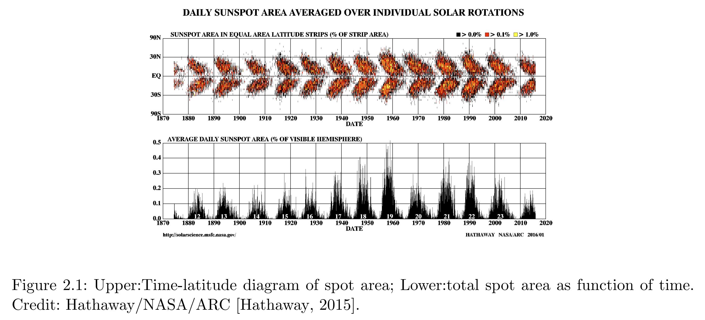
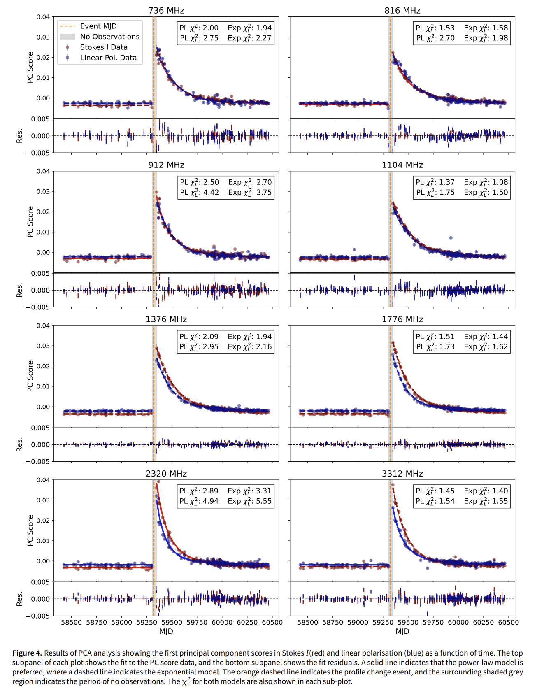

## 2025-09-01

1. [How does feedback affect the star formation histories of galaxies?](https://arxiv.org/abs/2508.21152)

   > Galaxy, Star Formation

   研究恒星反馈和AGN反馈如何影响星系的形成历史（SFH）。

   

   星系SFHs的形状由宇宙学、反馈和重子循环共同决定，其中恒星反馈主导早期演化，AGN反馈调控晚期淬灭。反馈效应可通过重子分数和黑洞质量等状态变量间接反映，为观测约束反馈强度提供了新途径。尽管不同模型的反馈实现方式不同，但SFH形状与物理变量之间的关系具有普适性，表明其背后存在统一的物理机制。

## 2025-09-02

今日停更

## 2025-09-03

1. [LOFAR constraints on the repetition & environments of CHIME FRBs](https://arxiv.org/abs/2509.01688)

   > Fast Radio Burst, Observation

   LOFAR对CHIME的33个已知重复FRB源、10个候选重复源以及430个非重复FRB源进行了系统性搜索。观测总时长分别为473小时（LOTAAS）和252小时（针对性观测）。

   

   没有探测到爆发，FRB 20201124A表现出正的统计频谱指数，表明其低频活动率低于高频，与典型的相干辐射预期（负频谱指数）相反。

## 2025-09-04

1. [Radio Astronomy in the Era of Vision-Language Models: Prompt Sensitivity and Adaptation](https://arxiv.org/abs/2509.02615)

   > Radio, Astronomy, LLM

   评估视觉语言模型（VLMs）在射电星系形态分类任务中的表现。使用NVSS和FIRST数据集中的729个训练图像和104个测试图像，这些图像由专家标注为Fanaroff-Riley类型I（FR-I）和II（FR-II），在QwenVL上进行微调。

   LoRA微调后，Qwen2-VL-7B错误率降至3.1%，接近领域专用模型AstroVFM（1.9%），且仅需145标注样本即超越从头训练的ResNet。

   

2. [Revised classification of the CHIME fast radio bursts with machine learning](https://arxiv.org/abs/2509.02645)

   > Fast Radio Burst, Machine Learning

   在CHIME的FRB目录（第一版及2023版）的基础上，使用其中的10个参数，通过降维聚类的方式研究哪些参数对FRB分类最重要。结果表明，静坐标系频率宽度（Δν）和峰值频率（νₚ）是主导聚类结构的最重要特征。

   

## 2025-09-05

1. [Deciphering galaxy images using machine vision](https://arxiv.org/abs/2509.03640)

   > Galaxy, Deep Learning

   使用VAE将星系图像压缩到35个特征，然后使用PCA降维，区分不同形态类型的星系。结果表明，存在一个最优的特征数量范围（约10-12个），可以捕捉99.9%的方差。

   

2. [Using Deep Learning to Identify Artificial Satellite Trails in Multi-band Photometric Astronomical Images](https://arxiv.org/abs/2509.04081)

   > Satellite, Deep Learning

   用UNet识别光学图像中的卫星。

   

## 2025-09-08

1. [A milliarcsecond localization associates FRB 20190417A with a compact, luminous persistent radio source and an extreme magneto-ionic environment](https://arxiv.org/abs/2509.05174)

   > Fast Radio Burst, Galaxy, Localization

   EVN对FRB20190417A进行了25次观测，实现了毫角秒级别的精确定位。定位在一个低金属丰度的矮星系中，红移z=0.12817，PRS的物理尺度<23.1pc，射电光度为7.4e28 erg/s/Hz，宿主星系贡献DM高达1212.0pc/cc，是目前已知FRB中最大的宿主DM贡献。

   

   宿主星系具有较高的比恒星形成率（~2.3 × 10⁻⁸ yr⁻¹），与SLSNe-I和长伽马暴的宿主星系类似，支持其可能源于大质量、快速自转的前身星。

2. [OrbDot: A Python package for studying the secular evolution of exoplanet orbits](https://arxiv.org/abs/2509.04531)

   > Exoplanet, Planetary Science, Software

   [OrbDot](https://github.com/simonehagey/orbdot)用于研究系外行星轨道长期演化的Python软件包。

3. [High-resolution Giant Metrewave Radio Telescope HI 21cm imaging of the host galaxy of FRB 20250316A](https://arxiv.org/abs/2509.04563)

   > Fast Radio Burst, Galaxy

   GMRT对FRB20250316A的宿主星系的HI观测。对NGC4141进行了7小时的高分辨率HI 21cm观测，覆盖1260–1460 MHz频段，空间分辨率达0.48–8.0 kpc。

   

   发现该星系西南部的Hi分布存在扰动，且存在高密度的Hi区域。SDSS光谱显示该区域低金属丰度，形成率较高。这些结果表明，NGC4141最近可能通过合并或吸积获得了贫金属气体，触发了西南部的恒星暴发活动。此次合并事件可能还引发了星系盘内的其他恒星形成活动，导致了FRB20250316A的前身恒星的形成。

## 2025-09-09

1. [A Spatial Gap in the Sky Distribution of Fast Radio Burst Detections Coinciding with Galactic Plasma Overdensities](https://arxiv.org/abs/2509.06721)

   > Fast Radio Burst, ISM

   CHIME/FRB Catalog 2中发现的FRB探测空间分布中的一个显著“探测缺口”（detection gap），该缺口与银河系内的电离气体过密区（如天鹅座X区域）重合。

   

   通过非均匀泊松过程模型，计算了缺口区域内FRB零探测的概率，发现其显著性达4.2σ，表明缺口并非偶然现象。缺口区域的散射时间尺度在600MHz达到31.87ms，可以把信号散射到CHIME探测阈值以下。

   

   110个FRB视线与已知H II区域交叉，但其散射时间尺度未显著高于非交叉视线，可能因CHIME对高度散射FRB的选择偏差。

   

2. [Repeating vs. Non-Repeating FRBs: A Deep Learning Approach To Morphological Characterization](https://arxiv.org/abs/2509.06208)

   > Fast Radio Burst, Statistics

   CHIME/FRB Catalog 2，包含4545个FRB事件，其中3564个为非重复暴，981个为重复暴。通过ConvNext模型，在这些事件的图像上进行训练，准确率85%。

   

   此外，模型在fitburst生成的合成数据上也表现出良好的性能，进一步揭示了FRB形态特征与分类结果之间的关系。例如，窄频带且时间宽度较大的FRB更可能被归类为重复暴，而多子脉冲的周期性特征与非重复暴相关。

3. [A long period transient search method for the Murchison Widefield Array](https://arxiv.org/abs/2509.06315)

   > LPT, Method

   MWA探测长周期暂现源的方法。

   步骤包括：从观测数据中减去天空模型，形成图像立方体，应用三种滤波器来检测不同时间尺度和脉冲形态的瞬变候选体

   - **Spike滤波器**：检测短时间尺度的尖峰信号。
   - **时间相关高斯（TCG）滤波器**：检测宽度约为10秒的高斯形状脉冲。
   - **均方根（RMS）滤波器**：检测高度变化的随机源。

   生成一个布尔图，标记出任何一种滤波器超过阈值的区域。然后使用3×3的连通矩阵检测岛屿，并为每个岛屿分配有效的TCG、Spike和RMS标志。将检测到的岛屿与GLEAM目录进行交叉匹配，以标记闪烁的已知源。

   

   最终有7个候选者被确认为真实瞬变，包括一个新的LPT GLEAM-X J0704-37和一个新的脉冲星PSR J0031-57。

4. [A Deep SETI Search for Technosignatures in the TRAPPIST-1 System with FAST](https://arxiv.org/abs/2509.06310)

   > SETI, Radio

   TRAPPIST-1系统因其拥有多个位于宜居带内的类地行星而成为地外智慧生命（SETI）搜索的重要目标。FAST对其观测没有找到技术特征信号。

   

5. [Long-term monitoring of a dynamically new comet C/2020 V2 (ZTF)](https://arxiv.org/abs/2509.05902)

   > Comet, Planetary Science

   彗星C/2020 V2（ZTF）是一颗动态新长周期彗星（Dynamically New Comet, DNC），首次进入内太阳系。长时间的观测发现其具有典型的碳组成和尘埃丰富的特征，其物理化学性质在轨道演化过程中表现稳定。研究结果表明，这类动态新彗星在早期轨道阶段可能已具备均匀的组成，支持其形成于太阳系早期均匀混合的区域。

   

6. [FAST Observations of the Microstructure in Interpulse Pulsars](https://arxiv.org/abs/2509.05957)

   > Pulsar, Periodicity

   通过FAST研究了四颗具有中间脉冲的脉冲星（PSRs J0953+0755、J0627+0706、J0826+2637和J1946+1805）的微结构特性。首次在中间脉冲中成功探测到微结构，并发现微结构普遍存在。重新确认了中子星群体中微结构周期与自转周期的幂律关系：
   $$
   P\mu({\rm ms})=(1.337\pm0.114)\times P({\rm s})^{1.063\pm0.038}
   $$
   

7. [Probing baryonic feedback and cosmology with 3 x 2-point statistic of FRBs and galaxies](https://arxiv.org/abs/2509.05866)

   > Fast Radio Burst, Cosmology

   本研究提出了一种基于3x2点相关统计的方法，结合FRB色散测量（DM）与星系数密度场的角功率谱分析。FRB与星系的3x2点联合分析能够有效区分重子反馈与宇宙学效应，弥补了传统星系巡天在非线性尺度上的不足。尽管FRB样本的散粒噪声限制了其单独约束能力，但结合星系数据后，该方法可为下一代巡天（如SKA、CHORD）提供互补的观测策略，实现反馈模型的高精度和宇宙学参数的联合约束。

   

8. [Solar Interior](https://arxiv.org/abs/2509.05401)

   > Solar, Review

   太阳内部动力学研究通过多学科交叉，逐步揭示了磁场生成、输运和浮现的物理机制。尽管在三维发电机模型、子午环流深层结构及磁通量浮现的精细过程等方面仍存在挑战，观测技术的进步（如SDO/HMI、Hinode等）与数值模拟的结合为未来研究提供了方向。理解这些过程对预测太阳活动周期及空间天气效应具有重要意义。

   

9. [PowerBin: Fast Adaptive Data Binning with Centroidal Power Diagrams](https://arxiv.org/abs/2509.06903)

   > Astronomy, Software

   现代天文学观测（如积分场光谱）产生的大规模数据集通常需要自适应分箱（adaptive binning）以提高信噪比（S/N），从而确保模型拟合的可靠性。然而，现有的Voronoi分箱方法及其变体存在两个主要问题：计算复杂度高（通常为O(N²)），难以处理现代天文调查中的大规模数据；且可能生成非凸或不连通的箱体，影响空间分辨率。

   [PowerBin](https://pypi.org/project/powerbin/)基于最优传输理论（optimal transport）和质心功率图（Centroidal Power Diagram, CPD）框架，解决了传统方法的局限性。

   

## 2025-09-10

1. [Constraining Baryon Fractions in Galaxy Groups and Clusters with the First CHIME/FRB Outrigger](https://arxiv.org/abs/2509.07097)

   > Fast Radio Burst, Cosmology

   利用CHIME/FRB Outrigger样本中三个FRB的观测数据，结合星系群和星系团的密度模型，探讨了重子分数在低质量星系群中的分布及其与现有X射线观测结果的对比。

2. [An all-sky 3D dust map Based on Gaia and LAMOST](https://arxiv.org/abs/2509.07640)

   > ISM

   LAMOST DR11提供了恒星大气参数（有效温度、表面重力、金属丰度），结合Gaia XP合成的B/V波段测光数据，计算了约460万颗恒星的消光值，典型精度为~0.01 mag。通过自适应多分辨率天空分区方法（HEALPix），将天空划分为不同分辨率的视向（3.4′至58′），并采用参数化模型对每条视向的消光-距离关系进行建模。模型考虑了局部气泡（Local Bubble）、弥散星际介质（DIM）和潜在分子云的贡献，从而构建了银河系的三维尘埃消光图。

   

3. [A Machine Learning empowered search for Sub-Minute Optical Transient Events with the Deeper, Wider, Faster programme](https://arxiv.org/abs/2509.07592)

   > Transient, Optical, Machine Learning

   亚分钟级光学瞬变事件（持续时间小于1分钟）的系统性研究尚未开展，这类事件可能揭示新的天体物理现象（如快速射电暴的光学对应体或恒星耀发）。

   使用CNN对Deeper, Wider, Faster (DWF) 巡天数据的图像差分进行分类，筛选暂现源。对5,477个高分候选体进行人工检查，最终选出2个高质量候选体。

   **DWF040654.511-544056.411**：可能具有宿主星系，g波段星等20.25±0.05。**DWF041117.877-542554.144**：无宿主星系，g波段星等20.55±0.04，可能为银河系内事件（如恒星耀发）。

   

## 2025-09-11

1. [Discovery of a z~0.8 Ultra Steep Spectrum Radio Halo in the MeerKAT-South Pole Telescope Survey](https://arxiv.org/abs/2509.08062)

   > Radio, Galaxy

   使用MeerKAT UHF波段（0.58 - 1.09 GHz）对SPT-CLJ2337-5942星系团进行观测，该星系团由南极望远镜（SPT）在100平方度深场中发现。观测时间为116小时，使用32k相关器模式，每个指向观测约1小时，达到每指向深度为10uJy/beam。

   在SPT-CLJ2337-5942星系团中心发现了一个扩展的弥散射电辐射，最大线性尺寸（LLS）约为800千秒差距，具有复杂的形态，分类为射电晕。谱指数1.76，表明其为超高陡谱射电晕（USSRH）。

   

## 2025-09-12

1. [Magnetic fields in galactic environments probed by Fast Radio Bursts](https://arxiv.org/abs/2509.08896)

   > Fast Radio Burst, Galaxy, Magnetic Field

   分析14个定位FRB的观测RM，推断FRB宿主星系及其前景星系晕中的总磁场强度。结果表明，前景星系晕的磁场贡献在分析未来FRB样本时不可忽视。

   

2. [Unraveling the emission mechanism powering long period radio transients from interacting white dwarf binaries via kinetic plasma simulations](https://arxiv.org/abs/2509.09057)

   > LPT, Theory, Simulation

   由白矮星-M型矮星双星系统相互作用驱动的长周期射电瞬变源（ULPTs，如GLEAM-X J0704-37和ILTJ1101+5521）的辐射机制，证明了电子回旋脉泽不稳定性（ECMI）的可行性，在现实的WD-MD条件下，ECMI可以达到高的能量转换效率，并且辐射主要为线性偏振。

3. [Magnetic White Dwarf -- M Dwarf Binaries in Pre-polar Phase as Special Population of Long-Period Radio Transients](https://arxiv.org/abs/2509.09224)

   > LPT, Theory

   杨元培的文章。最近ILT J1101+5521 和 GLEAM-X J0704-37，已被确认源自白矮星（WD）- M 矮星（MD）双星系统，提出至少部分 LPTs 源自处于`pre-polar phase`阶段的 WD - MD 双星系统。

## 2025-09-15

1. [Encyclopedia of Astrophysics: The Expanding Universe](https://arxiv.org/abs/2509.09954)

   > Cosmology, Review

   总结了宇宙膨胀的理论基础，包括宇宙学原理、距离和速度的计算、以及加速膨胀的动力学，讨论了相关的观测现象和理论挑战。

   - **宇宙学原理**：宇宙学原理认为宇宙在大尺度上是均匀和各向同性的，这意味着我们并不处于一个特殊的位置。这一原理是现代宇宙学的基础，并得到了大规模观测的支持。
   - **哈勃-勒梅特定律**：哈勃-勒梅特定律指出，星系的退行速度与其距离成正比，即v=Hd。这一关系是宇宙均匀膨胀的直接结果，并且退行速度可以超过光速而不违反相对论，因为这些速度不是相对于任何惯性参考系的。
   - **弗里德曼方程**：弗里德曼方程描述了宇宙膨胀率随时间的变化。这些方程可以从广义相对论推导出来，但在大多数情况下，也可以使用牛顿力学进行近似计算，因为宇宙非常稀薄，处于弱引力场状态。
   - **宇宙的密度和压力**：不同成分（如物质、辐射和暗能量）对宇宙膨胀的影响不同。物质的能量密度随尺度因子*a*的变化为$\rho_M\propto a^{-3}$，辐射为$\rho_R\propto a^{-4}$，而暗能量（如宇宙常数）的能量密度保持不变。
   - **宇宙的命运**：根据当前的标准模型（ΛCDM），宇宙将继续加速膨胀，最终进入一个“大冻结”状态，即宇宙将无限膨胀并逐渐冷却。其他可能的命运包括大挤压、大反弹、大撕裂等。

## 2025-09-16

1. [Neural networks in the search for fast radio bursts with RATAN-600](https://arxiv.org/abs/2509.11215)

   > Fast Radio Burst, Search, Deep Learning

   [EfficientNet1D_FRB](https://github.com/DKudryavtsev/EfficientNet1D_FRB)使用1D卷积的EfficientNet，用于在RATAN-600的少数通道时间序列中搜索FRBs。

   

2. [Revealing Event Rate of Repeating Fast Radio Bursts](https://arxiv.org/abs/2509.12016)

   > Fast Radio Burst, Statistics

   研究高于/低于1GHz的FRB随红移的变化。发现高低频率FRB的光度分布和事件率演化模式不同，且重复FRB的事件率在红移*z*<1时显著高于SFR。

3. [YOLO-CIANNA: Galaxy detection with deep learning in radio data: II. Winning the SKA SDC2 using a generalized 3D-YOLO network](https://arxiv.org/abs/2509.12082)

   > Galaxy, Radio, Deep Learning

   使用3DYOLO做三维射电星系检测。

   

## 2025-09-17

1. [Who Uses Whose Telescopes? Analyzing the Knowledge Geography and Research Dominance of Global Astronomical Facilities](https://arxiv.org/abs/2509.12551)

   > Astronomy, Statistics

   研究了全球天文设施的地理分布、使用情况和领导地位。使用自然语言处理技术从出版物摘要和致谢中提取设施实体，并将142,000篇使用设施的论文与533个设施匹配。定义了

   - **设施库存（Stock）**：一个国家托管的设施数量。
   - **设施使用（Usage）**：在年份t内承认使用位于国家c的设施的出版物数量。
   - **影响（Impact）**：基于引用的指标，包括h指数和每篇论文的平均引用次数。
   - **效率（Efficiency）**：设施使用论文数与托管设施数的比率。
   - **领导（Leadership）**：第一作者和对应作者的论文总数。
   - **参与（Participation）**：非第一、非对应作者的论文比例。

   发现：使用和影响高度集中在少数几个设施中心、科学领导力比获取或使用更加不平等、主办和领导力往往分离——智利和南非等国家的中介作用很大，但并未相应获得领导地位。

   

2. [A high fraction of close massive binary stars at low metallicity](https://arxiv.org/pdf/2509.12828)

   > Stellar, Binary, Statistics

   现有研究表明，在高金属丰度环境下，大多数大质量恒星至少有一个紧密的恒星伴侣。然而，对于低金属丰度环境，特别是高红移星系中的大质量恒星，其双星性质的约束仍然不足。

   这篇论文通过多历元径向速度测量，研究了小麦哲伦云中大质量O型恒星的双星性质，发现即使在低金属丰度环境下，大质量恒星的紧密双星系统也是普遍存在的。

   

## 2025-09-18

1. [Searching for radio emission from radio quiet magnetars with MeerKAT](https://arxiv.org/abs/2509.14043)

   > Magnetar, Fast Radio Burst, Radio, Observation

   使用MeerKAT对13个射电宁静磁星进行了观测，搜索了单脉冲、周期脉冲和PRS，都没有探测。

   

## 2025-09-19

1. [LOFAR 58 MHz Legacy Survey of the 3CRR Catalog](https://arxiv.org/abs/2509.15115)

   > Radio, Catalog, Observation

   首次在超低频（58 MHz）下对3CRR目录中的所有射电源进行了高分辨率成像，提供了独立的流量密度测量和高质量的低频射电图像。

   

2. [Gaia DR3 Variable White Dwarfs vetted by ZTF](https://arxiv.org/abs/2509.15133)

   > Stellar, White Dwarf, Variable

   利用Gaia DR3和ZTF DR23数据，识别并分类了1423个变白矮星候选，其中864个有ZTF时间序列，141个呈现显著周期性。通过无监督聚类技术，将这些对象分类为已知类别，包括3个ZZ Ceti星、15个GW Vir星、1个V777 Her星和24个WD-MS双星。

## 2025-09-22

1. [Evidence for a brief appearance of gamma-ray periodicity after a compact star merger](https://arxiv.org/abs/2509.15824)

   > High Energy, Theory

   在GRB 230307A中检测到一个909赫兹的伽马射线周期性信号，这可能表明该事件的中心引擎是一个快速旋转的中子星（毫秒磁星）。

   

2. [The Thousand-Pulsar-Array programme on MeerKAT -- XVIII. Complex sub-pulse modulation patterns, bi-drifting and mode changing of nine radio pulsars](https://arxiv.org/abs/2509.15949)

   > Pulsar, Observation

   在MeerKAT单脉冲调查中发现的九颗射电脉冲星的子脉冲调制模式，揭示了这些脉冲星复杂的漂移方向变化、双漂移和模式转换现象。

   

## 2025-09-23

1. [A HyperFlash and ÈCLAT view of the local environment and energetics of the repeating FRB 20240619D](https://arxiv.org/abs/2509.16374)

   > Fast Radio Burst, Observation

   使用那几个荷兰的25m的望远镜观测FRB 20240619D。500个小时探测到217次爆发，DM变了0.41，RM增加了80，观测到两个闪烁屏。

   最亮的爆发中，观察到子爆发之间的DM变化，可能是由于等离子体透镜效应或可变发射高度引起的。

   

## 2025-09-24

1. [Ultra-Wideband Polarimetry of the April 2021 Profile Change Event in PSR J1713+0747](https://arxiv.org/abs/2509.18972)

   > Pulsar, Observation

   研究了毫秒脉冲星（MSP）PSR J1713+0747在2021年4月发生的显著脉冲轮廓变化事件。研究分析了Stokes I和线偏振残差的主成分得分，PCA分析显示，事件发生后，主成分得分（PC1）显著增加，随后逐渐衰减。

   

   事件的发生更可能是由于脉冲星磁层内的变化，而不是星际介质中的传播效应。轮廓变化事件后，脉冲轮廓并未完全恢复到原始状态，表明可能存在长期的渐近恢复过程或脉冲星磁场的重新配置。

2. [VLA Observations at 6 and 19 GHz of a Complete Sample of Radio Loud Quasars with redshifts between 2.5 and 5.28: II. Sample definition, radio images, and analysis](https://arxiv.org/abs/2509.18380)

   > Radio, Galaxy

   红移在2.5到5.28之间的射电噪类星体的高分辨率观测。

   

   论文展示了113个高红移类星体的样本，包括它们的红移、位置、形态类型、通量密度等。大多数类星体显示出与光学位置重合的紧凑射电源。提供了48个显著解析的类星体的图像，分析了它们的结构特性，如双射电源、喷流等。讨论了核心频谱指数的分布，发现高频端的频谱变陡，可能是由于辐射损失所致。

   

## 2025-09-25

1. [Nulling baryonic feedback in weak lensing surveys using cross-correlations with fast radio bursts](https://arxiv.org/abs/2509.19514)

   > Fast Radio Burst, Cosmology

   重子反馈通过改变小尺度上的物质功率谱，复杂化了宇宙剪切功率谱的解释，并限制了现有数据的约束能力。通过使用弱引力透镜剪切图和快速射电暴（FRB）色散测量的交叉相关来抵消重子反馈的影响。

2. [Vacuum birefringence in the polarized X-ray emission of a radio magnetar](https://arxiv.org/abs/2509.19446)

   > Magnetar, High Energy

   量子电动力学（QED）理论预测，在超强磁场中，量子真空会变得双折射，导致不同偏振模式的光子传播速度不同。

   使用成像X射线偏振探测器（IXPE）对射电磁星1E 1547.0-5408进行相位和能量分辨的X射线偏振测量。在2-3 keV能段，偏振度达到最大值59±5%，在某些旋转相位下甚至接近80%。在4-8 keV能段，偏振度降低至40±11%。支持真空双折射的存在。

   

3. [Radio Galaxy Zoo EMU: Harnessing Citizen Science and AI to Advance Open Science Catalogues](https://arxiv.org/abs/2509.19787)

   > Galaxy, Deep Learning

   使用澳大利亚平方公里阵列探路者（ASKAP）望远镜的演化宇宙图（EMU）巡天数据，选择了6,230个扩展源，这些源的形态复杂性从简单到高度不规则不等。

   

   - 优先对高图像复杂性的源进行分类，复杂性通过粗粒度的Kolmogorov测度量化。选择具有更高复杂性值的6'x6'图像切片，确保志愿者看到最具挑战性的形态。结合投影角大小和复杂性，进一步优化源的选择。
   - 志愿者标记相关的射电组件，识别宿主星系，并分配简单的描述性形态标签。这些标签基于语义分类法，简化为一组约10个标签，如“沙漏”、“弯曲”、“追踪宿主星系”。
   - 随着项目的进展，主动学习循环将公民科学结果整合到训练集中，允许迭代改进AI管道。最终输出将输入到EMUCAT目录中，生成更完整和可靠、可用于科学研究的目录。

## 2025-09-26

1. [Einstein@Home Searches for Gamma-ray Pulsars in the Inner Galaxy](https://arxiv.org/abs/2509.21307)

   > Pulsar, Observation

   费米大视场望远镜（Fermi-LAT）在银河系中心附近发现了一个神秘的GeV伽马射线辐射过剩现象。这种现象可能由银河系核球中的未解析脉冲星群，特别是毫秒脉冲星（MSPs）的发射所解释。

   使用Einstein@Home分布式志愿计算系统对银河系中心附近的伽马射线脉冲星进行的搜索。使用Fermi-LAT探测到的伽马射线光子到达时间，结合估计的到达方向，作为Einstein@Home脉冲星搜索的输入。

   在55个候选源中，发现了4个新的伽马射线脉冲星，包括一个孤立的MSP和一个与银河系中心角分离最小的脉冲星（0.93°），均位于银河系盘面内，不太可能是解释银河系中心伽马射线过剩现象的MSPs群体成员。

   

   在已知的射电脉冲星数据库中搜索了新发现的脉冲星的射电波束，但未发现任何射电对应物。对两个脉冲星进行了MeerKAT成像观测，也未发现显著的点源。
   

2. [Plasma lens with frequency-dependent dispersion measure effects on fast radio bursts](https://arxiv.org/abs/2509.20424)

   > Fast Radio Burst, Lensing

   FRB穿过等离子体时，透镜效应会使DM随频率变化。提出了一个频率依赖的色散测量（DM）的幂律模型$DM=A\nu^\gamma+B$，其中$\gamma$是频率指数。

   对FRB 180814.J0422+73的子脉冲进行分析，发现其峰值通量密度随中心频率降低而减小，符合频率依赖的放大效应。

   

3. [Constraints on an optical counterpart for the long-period radio transient GPM J1839-10](https://arxiv.org/abs/2509.20438)

   > LPT, Multiwavelength

   使用HiPERCAM多色测光仪对GPM J1839-10进行光学观测，未能直接检测到白矮星，但数据中存在与射电周期谐波相关的周期性信号，支持白矮星场景的假设。

   

4. [Discovery of Two Highly Scattered Pulsars from Image-Based Circular Polarization Searches with the Australian SKA Pathfinder](https://arxiv.org/abs/2509.20611)

   > Pulsar, Discovery, Observation

   在ASKAP圆偏振图像中发现两个高度散射的脉冲星。

   

5. [Millisecond Pulsar Discoveries in an Image-based MeerKAT Survey of the Galactic Bulge](https://arxiv.org/abs/2509.20614)

   > Pulsar, Discovery, Observation

   通过MeerKAT对银河系中心及周围区域的成像调查，发现并确认新的脉冲星，特别是毫秒脉冲星（MSPs）。研究的核心问题是探索银河系中心区域的脉冲星种群，以澄清该区域GeV辐射过剩的起源。
   在16个圆形偏振候选源中，检测到9个脉冲星，这些脉冲星的旋转周期在2.46毫秒到85.85毫秒之间，DM值在18.4到329.4 pc/cc之间。六个新发现的脉冲星中有四个显示出明显的轨道调制迹象，表明它们可能处于双星系统中。

   

## 2025-09-29

