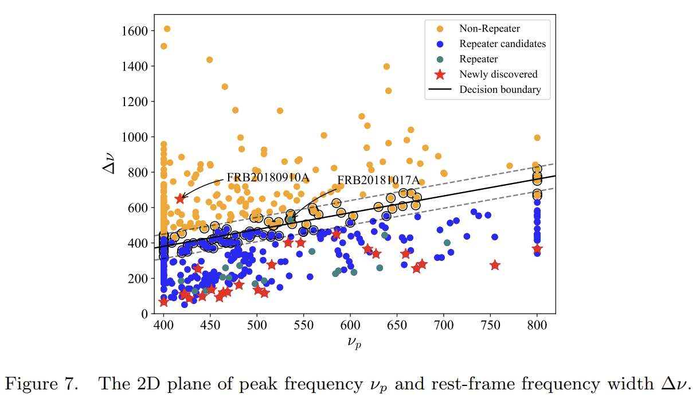

## 2025-09-01

1. [How does feedback affect the star formation histories of galaxies?](https://arxiv.org/abs/2508.21152)

   > Galaxy, Star Formation

   研究恒星反馈和AGN反馈如何影响星系的形成历史（SFH）。

   

   星系SFHs的形状由宇宙学、反馈和重子循环共同决定，其中恒星反馈主导早期演化，AGN反馈调控晚期淬灭。反馈效应可通过重子分数和黑洞质量等状态变量间接反映，为观测约束反馈强度提供了新途径。尽管不同模型的反馈实现方式不同，但SFH形状与物理变量之间的关系具有普适性，表明其背后存在统一的物理机制。

## 2025-09-02

今日停更

## 2025-09-03

1. [LOFAR constraints on the repetition & environments of CHIME FRBs](https://arxiv.org/abs/2509.01688)

   > Fast Radio Burst, Observation

   LOFAR对CHIME的33个已知重复FRB源、10个候选重复源以及430个非重复FRB源进行了系统性搜索。观测总时长分别为473小时（LOTAAS）和252小时（针对性观测）。

   

   没有探测到爆发，FRB 20201124A表现出正的统计频谱指数，表明其低频活动率低于高频，与典型的相干辐射预期（负频谱指数）相反。

## 2025-09-04

1. [Radio Astronomy in the Era of Vision-Language Models: Prompt Sensitivity and Adaptation](https://arxiv.org/abs/2509.02615)

   > Radio, Astronomy, LLM

   评估视觉语言模型（VLMs）在射电星系形态分类任务中的表现。使用NVSS和FIRST数据集中的729个训练图像和104个测试图像，这些图像由专家标注为Fanaroff-Riley类型I（FR-I）和II（FR-II），在QwenVL上进行微调。

   LoRA微调后，Qwen2-VL-7B错误率降至3.1%，接近领域专用模型AstroVFM（1.9%），且仅需145标注样本即超越从头训练的ResNet。

   

2. [Revised classification of the CHIME fast radio bursts with machine learning](https://arxiv.org/abs/2509.02645)

   > Fast Radio Burst, Machine Learning

   在CHIME的FRB目录（第一版及2023版）的基础上，使用其中的10个参数，通过降维聚类的方式研究哪些参数对FRB分类最重要。结果表明，静坐标系频率宽度（Δν）和峰值频率（νₚ）是主导聚类结构的最重要特征。

   

## 2025-09-05

1. [Deciphering galaxy images using machine vision](https://arxiv.org/abs/2509.03640)

   > Galaxy, Deep Learning

   使用VAE将星系图像压缩到35个特征，然后使用PCA降维，区分不同形态类型的星系。结果表明，存在一个最优的特征数量范围（约10-12个），可以捕捉99.9%的方差。

   

2. [Using Deep Learning to Identify Artificial Satellite Trails in Multi-band Photometric Astronomical Images](https://arxiv.org/abs/2509.04081)

   > Satellite, Deep Learning

   用UNet识别光学图像中的卫星。

   

## 2025-09-08

1. [A milliarcsecond localization associates FRB 20190417A with a compact, luminous persistent radio source and an extreme magneto-ionic environment](https://arxiv.org/abs/2509.05174)

   > Fast Radio Burst, Galaxy, Localization

   EVN对FRB20190417A进行了25次观测，实现了毫角秒级别的精确定位。定位在一个低金属丰度的矮星系中，红移z=0.12817，PRS的物理尺度<23.1pc，射电光度为7.4e28 erg/s/Hz，宿主星系贡献DM高达212.0pc/cc，是目前已知FRB中最大的宿主DM贡献。

   

   宿主星系具有较高的比恒星形成率（~2.3 × 10⁻⁸ yr⁻¹），与SLSNe-I和长伽马暴的宿主星系类似，支持其可能源于大质量、快速自转的前身星。

2. [OrbDot: A Python package for studying the secular evolution of exoplanet orbits](https://arxiv.org/abs/2509.04531)

   > Exoplanet, Planetary Science, Software

   [OrbDot](https://github.com/simonehagey/orbdot)用于研究系外行星轨道长期演化的Python软件包。

3. [High-resolution Giant Metrewave Radio Telescope HI 21cm imaging of the host galaxy of FRB 20250316A](https://arxiv.org/abs/2509.04563)

   > Fast Radio Burst, Galaxy

   GMRT对FRB20250316A的宿主星系的HI观测。对NGC4141进行了7小时的高分辨率HI 21cm观测，覆盖1260–1460 MHz频段，空间分辨率达0.48–8.0 kpc。

   

   发现该星系西南部的Hi分布存在扰动，且存在高密度的Hi区域。SDSS光谱显示该区域低金属丰度，形成率较高。这些结果表明，NGC4141最近可能通过合并或吸积获得了贫金属气体，触发了西南部的恒星暴发活动。此次合并事件可能还引发了星系盘内的其他恒星形成活动，导致了FRB20250316A的前身恒星的形成。

## 2025-09-09

