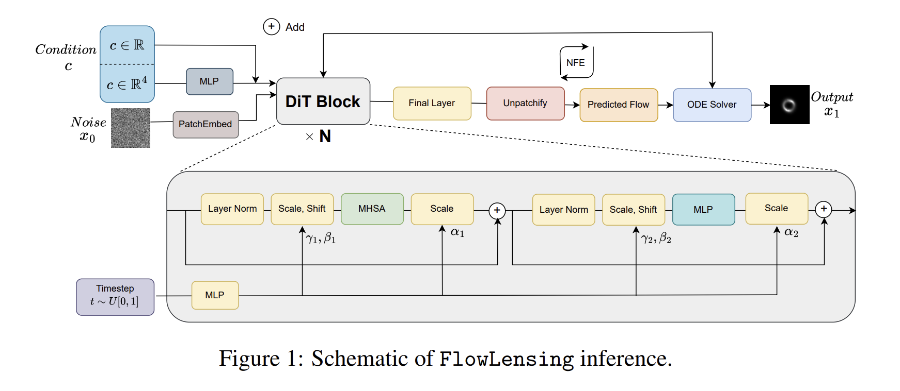

## 2025-10-01

1. [AI-assisted Advanced Propellant Development for Electric Propulsion](https://arxiv.org/abs/2509.26567)

   > Astronomy, Deep Learning

   使用多层感知器（MLP）、长短期记忆网络（LSTM）和双向长短期记忆网络（Bi-LSTM），输入分子指纹（ECFPs），成功预测了化学化合物的电离和碎片化模式，包括电离能量、最小出现能量、相关离子质量和质谱。

2. [A fast powerful X-ray transient from tidal disruption of a white dwarf](https://arxiv.org/abs/2509.25877)

   > High Energy, Observation, TDE

   研究了由中等质量黑洞（IMBH）潮汐破坏白矮星（WD）产生的快速强大的X射线瞬变现象。

   

   EP250702a的X射线光变曲线显示了一个初始的“瞬时辐射”阶段，随后是一个快速的衰减阶段，通量在20天内下降了五个数量级。结合观测数据和模型拟合，研究认为EP250702a最可能的解释是由IMBH潮汐破坏WD引起的喷流TDE事件。

3. [Is the Peculiar Galactic Center Transient Swift J174610.4-290018 A Recurrent Nova?](https://arxiv.org/abs/2509.26446)

   > High Energy, Transient

   研究了银河系中心（Galactic Center, GC）的一个特殊瞬变X射线源Swift J174610.4-290018，通过Chandra的存档数据研究Swift J174610在2024年之前的长期变异性，发现2005年可能有一次爆发。

   

   该源的光谱特性、时变特性以及与RS Oph的相似性强烈支持其为一个周期性新星的假设。特别是2005年和2024年的两次爆发以及宁静状态下的光谱特性与周期性新星的特性相符。

## 2025-10-02

1. [AstroMMBench: A Benchmark for Evaluating Multimodal Large Language Models Capabilities in Astronomy](https://arxiv.org/abs/2510.00063)

   > Astronomy, LLM

   `AstroMMBench`包含621个多选题，包括六个天体物理领域。作为基准测试对25种不同的MLLMs进行测试，结果表明开源的Ovis2-34B总体准确率最高。

   

   

2. [Faraday Depolarization Study of a Radio Galaxy Using LOFAR Two-metre Sky Survey: Data Release 2](https://arxiv.org/abs/2510.00440)

   > Polarization, Galaxy

   对LOFAR巡天LoTSS DR2中的射电星系ILTJ012215.21+254334.8进行了消偏振分析，其RM为-47，通过QU拟合，发现需要三部分才能拟合其RM，包括一个旋转薄分量（RM - 0.3，仪器泄漏）和两个外部法拉第色散天体物理发射分量。

   

   结果表明，低频射电星系的去极化需要多分量建模，其驱动因素是磁离子介质中的湍流和不均匀性。

## 2025-10-03

1. [Identifying tidal disruption events among radio transient galaxies](https://arxiv.org/abs/2510.01773)

   > Galaxy, Radio,Transient

   在VLA的巡天VLASS中发现的24个射电变源。

   

   提出了W3/射电诊断图作为区分由潮汐破坏事件引起的射电瞬变和由AGN引起的射电瞬变的工具。

   

2. [Enhancing the development of Cherenkov Telescope Array control software with Large Language Models](https://arxiv.org/abs/2510.01299)

   > Astronomy, LLM

   基于LLM开发了Agent，用于协助切伦科夫望远镜阵列观测站 (CTAO) 控制与数据采集软件 (ACADA) 的工程和运行。[Awesome-Agent-Papers](https://github.com/luo-junyu/Awesome-Agent-Papers)

   

3. [RAD@home discovery of extragalactic radio rings and odd radio circles: clues to their origins](https://arxiv.org/abs/2510.01999)

   > Galaxy, Discovery

   通过RAD@home公民科学协作组织的努力，发现了三个新的河外射电源，这些射电源展示了射电环的多样性，并为理解其形成机制提供了新的观测约束。

   

## 2025-10-06

1. [Unveiling Dynamics and Variability in Open Clusters: Insights from a Comprehensive Analysis of Six Galactic Clusters](https://arxiv.org/abs/2510.02462)

   > Stellar, Cluster, Kinematicks

   使用Gaia DR3数据和TESS光变曲线数据，揭示六个银河系开放星团（NGC 2204, NGC 2660, NGC 2262, Czernik 32, Pismis 18, 和 NGC 2437）的动力学。

   发现所有星团都沿着近圆形的轨道运动，偏心率在0.02到0.10之间，垂直偏离在132pc以内，表明它们被困在银河系的薄盘中。

   

## 2025-10-07

1. [Galaxy Model Subtraction with a Convolutional Denoising Autoencoder](https://arxiv.org/abs/2510.04957)

   > Galaxy, Deep Learning

   [DAE](https://github.com/rongrong00/galaxy-denoising-autoencoder)使用自编码器减除光学图像中的星系平滑光。

   

2. [Vision-Based CNN Prediction of Sunspot Numbers from SDO/HMI Images](https://arxiv.org/abs/2510.03473)

   > Solar, Deep Learning

   用CNN从SDO/HMI的太阳图像中推理黑子数量。

   

3. [Signatures of Galactic Expansion in Gaia DR3: Implications for the JWST Early-Galaxy Puzzle](https://arxiv.org/abs/2510.03688)

   > Stellar, Kinematics, Galaxy

   JWST对年龄低于10亿年的星系观测表明，星系组装的时间尺度比标准模型预测更短。可能是AGN加速了星系形成。

   

   通过Gaia DR3数据挑选银心附近5kpc的恒星，分割成27个扇区，结果发现其中21个扇区表现出向外运动，速度在3-50km/s，表明银河系在向外膨胀。可能反映了活动星系核驱动的反馈作用。

4. [A type II solar radio burst without a coronal mass ejection association](https://arxiv.org/abs/2510.04586)

   > Solar, Flare

   II型太阳射电爆发通常与日冕物质抛射（CME）产生的冲击波有关。文章介绍了2023年11月2日的一次II型暴，但是没有CME。

   在这次爆发前有一次M1.6的耀斑，以及EUV波段观测到了一个向外扩展的扰动，此次II型暴可能跟它们有关。

   

5. [Interactive High-Performance Visualization for Astronomy and Cosmology](https://arxiv.org/abs/2510.04665)

   > Astronomy, Software

   [VisIVO](https://visivo.readthedocs.io/en/latest/)在HPC环境中使用Jupyter实现3D可视化。

   

6. [BGRem: A background noise remover for astronomical images based on a diffusion model](https://arxiv.org/abs/2510.04718)

   > Astronomy, Deep Learning

   [BGRem](https://github.com/RNicolaas/BGRem)基于扩散模型的天文图像背景噪声去除工具，在光学数据和Gamma射线数据上做训练。

   

7. [Large Language Models Achieve Gold Medal Performance at International Astronomy & Astrophysics Olympiad](https://arxiv.org/abs/2510.05016)

   > Astronomy, LLM

   选择了五种最先进的LLMs（GPT-5、Gemini 2.5 Pro、OpenAI o3、Claude-4.1-Opus和Claude-4-Sonnet），评估他们在国际天文和天体物理奥林匹克竞赛（IOAA）考试中的表现。

   

   - 在理论考试中，GPT-5和Gemini 2.5 Pro在2022年、2023年和2025年的考试中分别获得93.0%、89.6%、86.8%和83.0%、85.6%、86.8%的得分，显著高于其他模型。
   - 在数据分析考试中，GPT-5的平均得分为88.5%，而其他模型的得分在48%到76%之间。

## 2025-10-08

1. [StarEmbed: Benchmarking Time Series Foundation Models on Astronomical Observations of Variable Stars](https://arxiv.org/abs/2510.06200)

   > Stellar, Variable, Deep Learning

   时间序列基础模型（TSFMs）在商业、金融、电力和交通数据等领域表现出色，但它们并未在天文观测数据上进行训练。

   [StarEmbed](https://github.com/skai-institute/StarEmbed)整理了40,000个专家标记的ZTF光变曲线，评估了TSFMs（MOIRAI、Chronos「亚马逊时序大模型」、Chronos-Bolt）在zero-shot的天文时间序列的表现。结果表现[Chronos](https://github.com/amazon-science/chronos-forecasting)模型在无监督聚类、监督分类上表现良好，Chronos-Bolt-tiny在异常检测表现不错。

   

2. [Estimation of intrinsic fast radio burst width and scattering distributions from CRAFT data](https://arxiv.org/abs/2510.05654)

   > Fast Radio Burst, Statistics

   根据ASKAP的CRAFT熏天中发现的29个FRB，统计宽度和散射指标分布。发现散射时标是对数均匀分布，宽度是高斯分布。

3. [Interpreting anomaly detection of SDSS spectra](https://arxiv.org/abs/2510.05235)

   > Spectrum, Deep Learning, Anomaly Detection

   使用[VAE+LIME/Local Interpretable Model-agnostic Explanations](https://github.com/ed-ortizm/Interpreting-Anomaly-Detection-in-SDSS-Spectra)在SDSS光谱数据上训练。异常分数（MSE）可以识别出强发射线星系、异常连续谱和数据伪影。通过LIME解释权重，验证了异常检测结果与天文直觉的一致性。例如，强发射线星系的异常分数由[OIII]和Hα峰驱动，而数据伪影则由高频噪声驱动。

4. [Gamma-ray Bursts](https://arxiv.org/abs/2510.05297)

   > High Energy, Review

   伽马射线暴（GRBs）的性质、起源及其在天体物理学和宇宙学中的应用。

   

## 2025-10-09

1. [Phase-resolved optical spectroscopy of the rapidly varying white dwarf ZTF 1851+1714](https://arxiv.org/abs/2510.06331)

   > White Dwarf, Spectrum, LPT

   ZTF 1851+1714可能是一个类似于AR Scorpii的白矮星脉冲星，有12.37分钟的自转周期，在X射线波段也有辐射。
   

   使用Nordic Optical Telescope的ALFOSC仪器进行低分辨率长缝光谱观测，不同波段和流量积分也都有相同的周期，其光度变化可以由吸积帘模型模型解释，物质沿着白矮星的磁力线被引导到磁极。

2. [A Giant Peanut-shaped Ultra-High-Energy Gamma-Ray Emitter Off the Galactic Plane](https://arxiv.org/abs/2510.06786)

   > High Energy, Observation

   通过LHAASO观测数据发现了一个位于银河系高银纬区域的巨大超高能伽马射线发射源，形态类似于一个巨大的“花生”。

3. [Revealing the Temporally Stable Bimodal Energy Distribution of FRB 20121102A with a Tripled Burst Set from AI Detections](https://arxiv.org/abs/2510.07002)

   > Fast Radio Burst, Deep Learning, Observation

   跟华为合作的文章，算法+从FRB121102中找到一些弱信号。

4. [AppleCiDEr II: SpectraNet -- A Deep Learning Network for Spectroscopic Data](https://arxiv.org/abs/2510.07215)

   > Spectrum, Transient, Deep Learning

   用1D卷积实现光谱分类和红移预测。

   

5. [Textual interpretation of transient image classifications from large language models](https://arxiv.org/abs/2510.06931)

   > Transient, LLM, Deep Learning

   使用Google的Gemini-1.5-pro-002进行光学变源的分类。提供15个样本，每隔样本包含三张图片（目标图像、参考图像、残差图像），并附有专家天文学家撰写的描述性文本。

   

   在Pan-STARRS（1.8米望远镜）、MeerLICHT（0.65米）和ATLAS（0.5米）的数据集上推理的准确率可以做到93%。

## 2025-10-10

1. [A broadband study of FRB20240114A with the Effelsberg 100-m radio telescope](https://arxiv.org/abs/2510.08367)

   > Fast Radio Burst, Observation

   Effelsberg用超宽带对FRB20240114A的观测，在1.3-6.0GHz探测到700个爆发。

   爆发持续时间与发射频率的关系较弱，分数带宽在所有频率范围内大致保持恒定。事件率在2 GHz附近达到峰值。

   

2. [Emergent Denoising of SDSS Galaxy Spectra Through Unsupervised Deep Learning](https://arxiv.org/abs/2510.08411)

   > Spectrum, Deep Learning

   使用AutoEncoder对SDSS的光谱进行降噪，跟**Butterworth滤波**进行对比。

   无监督自编码器可以作为提高SDSS训练集信噪比的实用工具，并且能够泛化到未见过的光谱。

   

3. [Mephisto: Self-Improving Large Language Model-Based Agents for Automated Interpretation of Multi-band Galaxy Observations](https://arxiv.org/abs/2510.08354)

   > Galaxy, SED, Software

   [Mephisto](https://zenodo.org/records/15589045)一个基于LLMs的多代理协作框架，通过树搜索进行有目的的推理，并通过自我对弈积累知识，实现SED拟合。

   

   Mephisto成功分析了詹姆斯·韦伯太空望远镜发现的“小红点”星系，独立识别出两种主要假设：被尘埃遮蔽的活动星系核和被尘埃遮蔽的恒星爆发星系。

   

4. [FlowLensing: Simulating Gravitational Lensing with Flow Matching](https://arxiv.org/abs/2510.07878)

   > Gravitational Lensing, Deep Learning

   通过流匹配生成引力透镜。

   

5. [An Introduction to Mars Terraforming, 2025 Workshop Summary](https://arxiv.org/abs/2510.07344)

   > Planetary Science

   2025年绿色火星研讨会的介绍文档，主要探讨了如何通过“地球化”（terraforming）将火星改造成适合人类居住的星球。

   

## 2025-10-13

1. [Generalized Distributions of Host Dispersion Measures in the Fast Radio Burst Cosmology](https://arxiv.org/abs/2510.09463)

   > Fast Radio Burst, Cosmology

   使用125个定位的FRB测量哈勃常数。改变DMhost的分布可以让H0的测量结果可以与Planck 2018和SH0ES的结果一致。

2. [Foundation Models for Astrobiology: Paper I -- Workshop and Overview](https://arxiv.org/abs/2510.08636)

   > Astrobiology, LLM

   探讨了基础模型（Foundation Models, FMs）在天体生物学中的应用潜力，并提出了一个多模态的天体生物学基础模型的开发框架。

   整合不同数据模态（如分子、地质、化学等）以检测生命迹象、开发一个专门的天体生物学任务模型（AMM），用于任务设计和操作阶段的决策支持、开发一个基于大型语言模型（LLM）的文本接口（AB-Chat），用于整合和检索天体生物学文献和数据。

   

## 2025-10-14

1. [Revisiting FRB 20121102A: milliarcsecond localisation and a decreasing dispersion measure](https://arxiv.org/abs/2510.11352)

   > Fast Radio Burst, Observation

   EVN对FRB121102的重定位，位置跟原来一致，跟PRS横向差12pc，且PRS在毫角秒的尺度上的亮度与更大角度尺度上的测量结果一致，表明PRS仍然紧凑。

   

   使用NRT探测到18个爆发，结合之前的观测，发现FRB 20121102A的DM在过去五年中下降了约25 pc/cc。

   

2. [Slitless Spectroscopy Source Detection Using YOLO Deep Neural Network](https://arxiv.org/pdf/2510.10922)

   > Spectrum, Deep Learning, Object Detection

   使用YOLOv8检测CSST无缝光谱中的天体源，对于天体密集区域，裁切放大以提高检测完备度。

   

3. [Fisher Matrix for Beginners](https://arxiv.org/abs/2510.09683)

   > Astronomy, Method

   Fisher信息矩阵提供了一种在不进行实际数据分析的情况下，预测实验精度的有效方法。通过构建模型、计算Fisher矩阵并求逆，可以得到模型参数的协方差矩阵，从而评估不同实验设计的优劣。

4. [Fast radio bursts shed light on direct gravity test on cosmological scales](https://arxiv.org/abs/2510.11022)

   > Fast Radio Burst, Cosmology

   利用FRBs的色散测量（DM）作为物质过密度$\delta_m$的代理，从而测量宇宙学尺度上的引力常数$G_{\rm light}$。

5. [Deep Learning in Astrophysics](https://arxiv.org/abs/2510.10713)

   > Astronomy, Deep Learning, Review

   丁元森写的深度学习在天文中的应用的综述，展示了其在数据处理、模拟推断、异常检测和自主研究中的潜力。

   

## 2025-10-15

1. [The PHANGS-MUSE/HST-Halpha Nebulae Catalogue](https://arxiv.org/abs/2510.11778)

   > Nebulae, Catalog

   通过高分辨率的哈勃空间望远镜（HST）和MUSE积分场光谱仪（IFS）成像数据，解析附近星系中的离子化星云。构建了一个包含5177个空间分辨星云的目录，其中4882个被分类为HII区域。将3349个HII区域与PHANGS-HST恒星关联目录中的恒星群体关联，发现中位年龄约为3百万年。

   

## 2025-10-16

1. [Simulation-Based Pretraining and Domain Adaptation for Astronomical Time Series with Minimal Labeled Data](https://arxiv.org/abs/2510.12958)

   > Light Curve, Deep Learning

   基于分类器的架构，并结合对比学习和对抗性目标进行增强，在ZTF和LSST的模拟数据上进行训练，生成光变曲线。结果表明，在分类、红移估计和异常检测的任务重，few-shot表现出非常好的性能。

   

   

## 2025-10-17

1. [StarStream: Automatic detection algorithm for stellar streams](https://arxiv.org/abs/2510.14929)

   > Stellar, Cluster, Software

   [StarStream](https://github.com/ybillchen/StarStream)基于物理启发模型的恒星流自动检测算法。通过混合模型来区分流成员和背景恒星、使用粒子喷射算法生成围绕前身球状星团的模拟流，、通过高斯核密度估计（KDE）估计流和背景的PDF、通过优化混合模型来最大化对数似然函数，得到最佳拟合的流和背景概率密度。在银纬度|b| > 30 度的范围内实现了至少 65%的纯度和完整性。

2. [Extracting latent representations from X-ray spectra. Classification, regression, and accretion signatures of Chandra sources](https://arxiv.org/abs/2510.14102)

   > High Energy, Deep Learning

   使用钱德拉源目录（CSC）中点源的X射线光谱（包含约25,000个光谱，其中约3,200个光谱具有已知类别标签），训练自编码器。

   在光谱重构、分类和回归任务中表现出色

   - 在AGN和恒星质量致密天体的二分类任务中，平衡准确率提高到约69%
   - AGN和YSO在潜在空间中占据两个不同的区域，尽管存在一些混淆，但潜在空间能够编码一些物理属性，如硬度比
   - 使用潜在空间作为输入的Huber回归模型在预测物理参数方面表现出色，特别是硬度比和氢柱密度
   - 符号回归结果显示，某些潜在维度与X射线通量的非线性组合（如硬度比）显著相关

## 2025-10-20

1. [HyperAIRI: a plug-and-play algorithm for precise hyperspectral image reconstruction in radio interferometry](https://arxiv.org/abs/2510.15198)

   > Radio, Interferometry, Method

   `HyperAIRI`用于射电干涉测量中光谱图像重建的即插即用（PnP）算法。

   

   在射电干涉测量中，傅里叶采样模式随观测频率变化，低频通道具有较低的空间分辨率但较高的灵敏度，高频通道则相反。`HyperAIRI`基于幂律光谱模型，假设射电发射的连续同步辐射随频率平滑变化，通量密度按幂律缩放。采用前向-后向算法结构（FB），交替进行数据保真步骤和正则化步骤。去噪器通过学习到的深度神经网络（DNN）实现，输入包括当前通道图像估计、相邻通道图像估计和光谱指数图，输出为去噪后的图像。

2. [Magnetic fields in planetary nebulae detected through non-thermal radio continuum emission](https://arxiv.org/abs/2510.15571)

   > Radio, Observation, Nebula

   行星状星云的射电连续谱发射主要是热辐射，非热辐射（如同步辐射）较为罕见。1960年代以来，科学家们一直在寻找行星状星云中的非热辐射，直到2015年才在IRAS 15103-5754中首次发现。

   通过LOFAR在144 MHz频率下观测北半球的行星状星云样本。在30个PNe中发现了非热射电辐射，这些PN的光谱指数均低于-0.1。大多数PN是双极的，表明它们可能源自双星系统。

   

## 2025-10-21

1. [Discovery of 30 Galactic radio transient pulsars with MeerTRAP](https://arxiv.org/abs/2510.17723)

   > Transient, Radio, Pulsar, Observation

   MeerTRAP单脉冲搜索找到30个河内暂现源，9个精确定位，14个测量周期121ms到7.623s。

   

2. [A Brief History of Inference in Astronomy](https://arxiv.org/abs/2510.17433)

   > Astronomy, Review

   总结了天文学中推理方法的历史演变。线性回归、贝叶斯推理、期望最大EM、MCMC、近似贝叶斯ABC、Amortized inference（梯度下降神经网络）。

   

3. [Order-by-order Modeling of Exoplanet Radial Velocity Data](https://arxiv.org/abs/2510.16139)

   > Exoplanet, Method, Light Curve

   通过多波段的径向速度拟合系外行星轨道参数，代码在[这里](https://github.com/langfzac/obo-paper)。测试了三种方法，对多波段数据进行加权平均后再拟合、对多波段数据分别拟合不同的开普勒轨道后对参数加权平均、对多波段数据拟合同一个模型加jitter。后两者的拟合要比第一个好。

4. [Graph-Based Light-Curve Features for Robust Transient Classification](https://arxiv.org/abs/2510.17721)

   > Transient, Deep Learning, Classification

   将光变曲线映射为三种可见性图视图：水平可见性图（HVG）、有向可见性图（DHVG）和加权可见性图（W-HVG），并从中提取网络描述符，做分类。

   1. **可见性图构建**:**水平可见性图（HVG）**: 两个观测点之间如果所有中间点的值都小于这两个点中较低的一个，则认为它们是相互可见的。HVG不依赖于采样时间的间隔，且对严格单调变换具有不变性。**有向可见性图（DHVG）**: 通过将有向可见性关系向前时间定向，编码时间不对称性。每个无向HVG边变为一个从较早到较晚观测点的单向弧。**加权可见性图（W-HVG）**: 在HVG或DHVG的基础上，附加边权重以反映振幅对比或测量不确定性。
   2. **网络描述符提取**:**度统计**: 包括平均度、度标准差和度偏度等。**聚类和模体**: 包括无向聚类系数均值、三角形计数和小子图频率等。**同配性**: 包括皮尔逊度-度同配性和有向同配性变体。**路径/效率**: 包括全局效率和巨分量上的平均最短路径长度。**谱摘要**: 包括邻接矩阵和拉普拉斯矩阵的主导特征值、谱半径和代数连通性。**加权统计**: 包括节点强度、差异、加权聚类和强度矩。

   使用MANTRA参考数据集，包含八类天文瞬变事件：超新星（SN）、激变变星（CV）、活动星系核（AGN）、高自行速度恒星（HPM）、耀变体、恒星耀斑（Flare）、其他类（Other）和非瞬变类（Non-Tr.）。

   

## 2025-10-22

1. [Deep Synoptic Array Science: Searching for Long Duration Radio Transients with the DSA-110](https://arxiv.org/abs/2510.18136)

   > LPT, Instrument

   介绍了Deep Synoptic Array（DSA-110）的Not-So-Fast Radio Burst（NS-FRB）搜索方法，对1.4GHz图像搜134毫秒到160.8秒的单脉冲。图像数据经过中值减法、去色散和盒式滤波处理，计算信噪比（S/N），通过CNN排除RFI。

   

2. [AION-1: Omnimodal Foundation Model for Astronomical Sciences](https://arxiv.org/abs/2510.17960)

   > Astronomy, LLM

   [AION](https://github.com/PolymathicAI/AION/)是一个用于天文科学的多模态基础模型。

   对来自五个大规模调查（Legacy Survey, Hyper Suprime-Cam, Sloan Digital Sky Survey, Dark Energy Spectroscopic Instrument, Gaia）的数据进行预处理。

   - 对于图像数据，使用了子采样的线性投影和自编码器进行降维，然后使用有限尺度量化（FSQ）进行离散化。对于光谱数据，使用了卷积神经网络（ConvNeXt-V2）进行特征提取，然后使用Look-up-Free Quantizer（LFQ）进行量化。对于标量数据，直接进行高斯归一化和等宽分箱。

   基于Transformer的编码器-解码器框架，通过在所有可用的模态上随机掩码输入并重建掩码内容来进行训练。AION-1在多个下游任务中展示了强大的性能，包括星系和恒星属性估计、星系形态分类、相似性检索、星系图像分割和光谱超分辨率。

   

3. [4 Second and 169 Second Rotation of Two Isolated, Ultramassive, Strongly Magnetic White Dwarfs](https://arxiv.org/abs/2510.18044)

   > White Dwarf, Observation

   通过对SDSS J1557+0411和PG 1312+099的观测，发现了已知第二和第三快的孤立旋转白矮星，二者的周期分别是168.94秒和83.72秒，支持了强磁场白矮星可能是由双简并系统合并形成的理论。

   

## 2025-10-23

1. [Application and development of advanced mathematical tools for population and time series analysis in pulsar astrophysics](https://arxiv.org/abs/2510.19434)

   > Pulsar, Machine Learning, Thesis

   一个博士论文，使用最小生成树+PCA对脉冲星和FRB种群进行分类。

   

2. [Fast Radio Bursts](https://arxiv.org/abs/2510.19143)

   > Fast Radio Burst, Review

   探讨了快速射电暴的发现、性质、能量学、亮度、识别、来源、重复与非重复特性、发射过程、环境以及相关理论模型。

3. [Exoplanetary radio emission predictions and detectability in the SKA era](https://arxiv.org/abs/2510.19776)

   > Exoplanet, Radio

   从系外行星百科全书中提取1259颗系外行星的数据，包括行星质量、恒星质量、半径、有效温度和距离等参数。使用RBL模型估算系外行星的射电辐射功率和特征频率，考虑恒星风的速度、行星的旋转速率和磁场强度等因素。

   对上面的数据和计算结果，使用随机森林进行回归，使用行星质量、半径、轨道半长轴和地球-行星距离作为特征，预测射电辐射的通量和特征频率。

   最终确定了248颗系外行星在SKA的观测范围内。其中，58颗行星的发射频率在SKA-Low频段（50-350 MHz），69颗在SKA-Mid频段（0.35-1.76 GHz和4.6-15.4 GHz）。

   

## 2025-10-24

1. [Doubling the Number of Blue Large-Amlitude Pulsators: Final Results of Searches for BLAPs in the OGLE Inner Galactic Bulge Fields](https://arxiv.org/abs/2510.20823)

   > Variable, Periodicity

   在OGLE（光学引力透镜实验）内银河系核球场中发现的88个新的蓝大振幅脉动星（BLAPs），使已知BLAPs的总数几乎翻倍，达到近200个。

   BLAPs是一类新发现的短周期（≤80分钟）大振幅脉动变星，其起源和性质尚不明确。新发现的BLAPs的脉动周期范围为5到76分钟，其中最短的周期为5.36分钟（OGLE-BLAP-153），最长的周期为76.36分钟（OGLE-BLAP-181）。光变曲线形态多样，包括经典的锯齿形、带有额外峰或凹陷的形态。

   

## 2025-10-27

1. [Spectroscopic Classification of Extragalactic Transients from CRTS](https://arxiv.org/abs/2510.20989)

   > Transient, Survey, Supernovae

   Catalina实时瞬变调查（CRTS）在2007年至2019年间发现了多于16,000个瞬变候选体，CRTS发现的最常见瞬变事件是超新星，其中约50%为Ia型超新星。此外，还发现了大量I型和II型超新星，以及由于周围介质相互作用而具有发射特征的超新星（如IIn型超新星）。

## 2025-10-28

1. [Solar flare forecasting with foundational transformer models across image, video, and time-series modalities](https://arxiv.org/abs/2510.23400)

   > Solar, Deep Learning

   使用Transformer进行太阳耀斑预测。图像数据使用SigLIP2，视频数据使用VideoMAE，时间序列使用Moirai2。结果表明，尽管图像和视频模型能够捕捉到磁场的静态和动态特征，但时间序列模型在预测性能上表现最佳，特别是在利用辐射度的时间演化信息方面。

   

## 2025-10-29

1. [In Search of the Unknown Unknowns: A Multi-Metric Distance Ensemble for Out of Distribution Anomaly Detection in Astronomical Surveys](https://arxiv.org/abs/2510.23702)

   > Light Curve, Machine Learning

   [DiMMAD](https://github.com/sidchaini/dimmad/)使用多种距离度量来计算特征点之间的距离。对于每个测试对象，计算其与所有已知类别的距离，并使用两种聚合统计量（类聚合：最小/中位数；度量聚合：中位数）来生成最终的多度量异常评分。

   

   结果表明，DiMMAD在分布外（类间）异常检测表现可以，在稀有内部分布（类内）异常检测表现不如iForest。

2. [New Trends in Astrophysical Self-Organized Criticality](https://arxiv.org/abs/2510.23825)

   > Astronomy, Statistics, Review, SOC

   对ADS中关于SOC文章的总结。多种现象符合SOC的表现，包括：太阳耀斑的面积、峰值电子温度、峰值电子密度和能量、等待时间 / 太阳光球层、色球层事件大小分布 / 日冕物质抛射等待时间 / 恒星耀斑大小分布 / 脉冲星Glitch、GRB、SGR。

## 2025-10-30

1. [Place of the Radcliffe Wave in the Local System](https://arxiv.org/abs/2510.25570)

   > Radcliffe Wave, Review

   综述了Radcliffe波的研究进展，特别是其在分子云、星际尘埃、年轻恒星和开放星团中的分布和运动。通过多种方法和分析手段，揭示了Radcliffe波的主要特性和可能的形成机制。研究表明，Radcliffe波的形成可能与银河系磁场的Parker不稳定性有关，且其存在对恒星形成过程有重要影响。

## 2025-10-31

1. [Pulsar Detection with Deep Learning](https://arxiv.org/abs/2510.25774)

   > Pulsar, Deep Learning, Thesis

   用GAN生成模拟脉冲星信号，用CNN在presto折叠图上进行分类识别脉冲星候选。

2. [A Natural Language Interface for Efficient Data Retrieval in SDSS](https://arxiv.org/abs/2510.25953)

   > Astronomy, Catalog, LLM

   [SDSS_Agent](https://github.com/tamhanepd/SDSS_Agent/)用自然语言-SQL语言对微调Phi-2，旨在用自然语言生成查询SDSS数据集的SQL语句。

   

