## 2025-11-03

1. [IrisML: Neural Posterior Estimation for the Spectral Energy Distribution fitting](https://arxiv.org/abs/2510.26964)

   > Astronomy, SED, Deep Learning

   通过Transformer将测光滤镜、观测亮度和测量不确定性压缩为一个固定大小的表示，然后使用**Masked Autoregressive Flow**估计待定参数（如温度、金属丰度）的条件概率分布。

   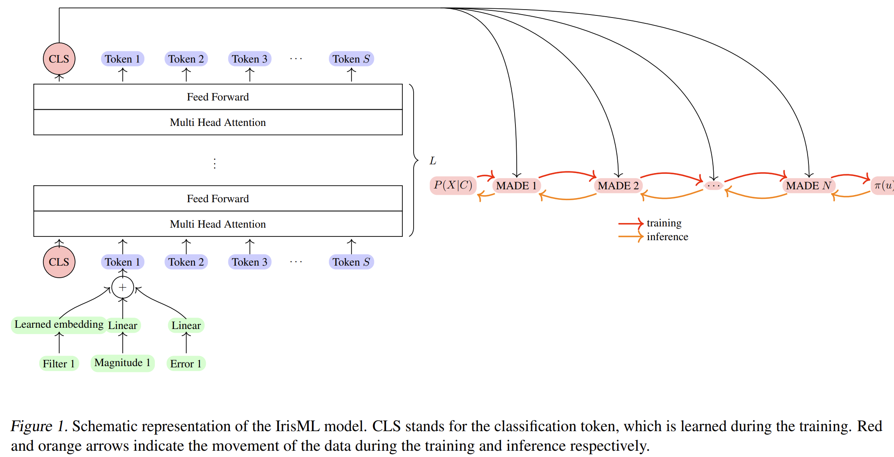

## 2025-11-04

1. [The Variable Universe with the Gaia mission and AI methods](https://arxiv.org/abs/2511.00147)

   > Astronomy, Deep Learning

   Gaia使用深度学习找变源。

   DR1包含有限天空区域的3,194个源（两个类）；DR2有550,737颗变星（9个可变性（子）类型）；DR3列出了1050万变量（24 + 可变性（子）类型，包括950万变星和100万变AGN），还识别出250万星系。

   为DR4开发了3个VAE，分别对不同的盖亚数据产品（BP和RP平均分光光度测量、折叠的G光变曲线、光变曲线的DMDT表示）进行训练，得到15个潜在变量，用于异常检测、聚类和分类。

   [**GaiaVari+**](https://www.gaiavari.space/)是在Zooniverse平台上的公民科学项目，旨在对盖亚DR3中的部分可变源进行分类，分类依赖于基本的天文图，如时间序列、折叠光变曲线、HR/颜色 - 星等图以及在银河系中的位置。

2. [Unveiling the distribution and redshift dependence of host galaxy dispersion measures using localized fast radio bursts](https://arxiv.org/abs/2511.01195)

   > Fast Radio Burst, Galaxy, Statistics

   对FRB的星系进行统计，发现DMhost和红移有正相关。

   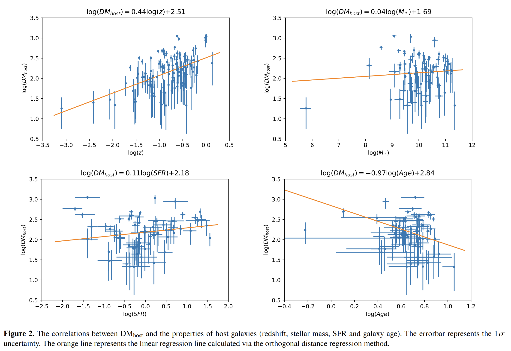

3. [ATCAT: Astronomical Timeseries CAusal Transformer](https://arxiv.org/abs/2511.00614)

   > Light Curve, Deep Learning

   [ATCAT](https://atcat.click/)使用Transformer在ELAsTiCC v1数据集上进行训练和评估，该数据集是LSST时间序列数据的现实模拟，提高了分类准确率。

   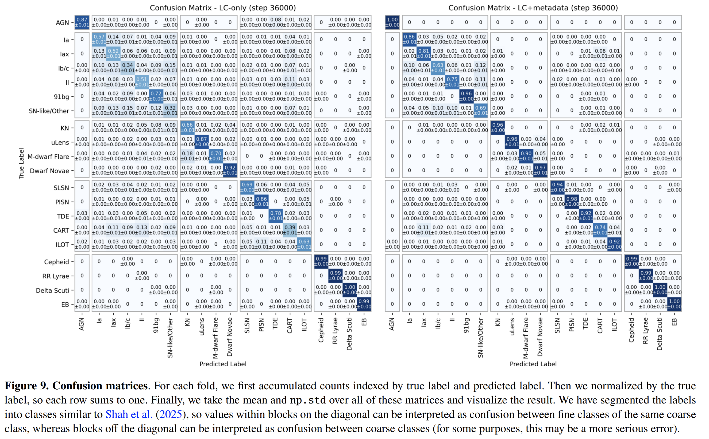

4. [BOOM and Babamul: a real-time, multi-survey, optical alert broker system operating at scale](https://arxiv.org/abs/2511.00164)

   > Astronomy, Transient, Software

   [BOOM](https://github.com/boom-astro/boom)是一个专注于实时联合多个设备警报流的分析框架，依赖于非关系型 MongoDB 数据库，结合 Valkey 内存处理队列和 Kafka 集群进行消息共享。

   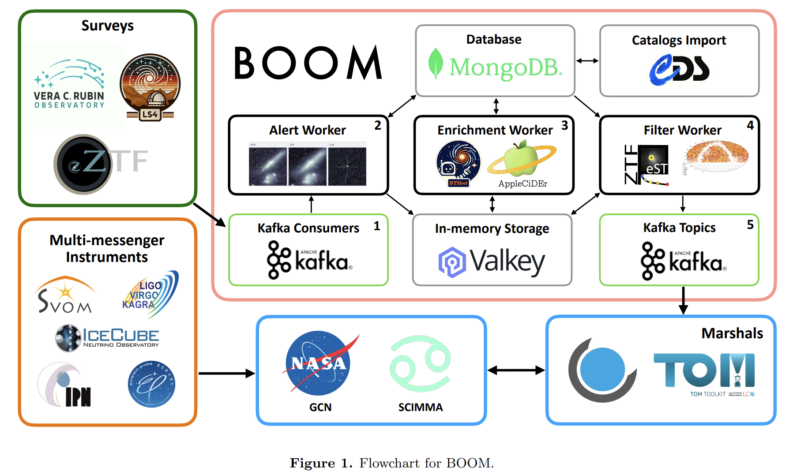

5. [Deconvolution for Large Astronomical Surveys: A Study of the Scaled Gradient Projection Method on Zwicky Transient Facility Data](https://arxiv.org/abs/2511.00148)

   > Astronomy, Optical, Method

   使用Scaled Gradient Projection (SGP)算法对Zwicky Transient Facility (ZTF)数据的单波段去卷积。

   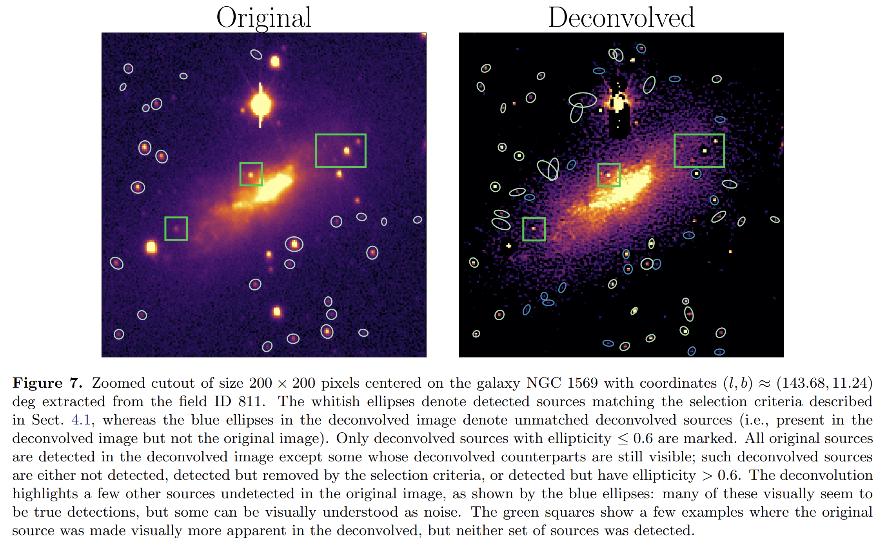

## 2025-11-05

1. [Using Deep Learning for Robust Classification of Fast Radio Bursts](https://arxiv.org/abs/2511.02634)

   > Fast Radio Burst, Deep Learning, Classification

   用监督变分自编码器sVAE，输入CHIME探测到的FRB的参数，结合FRB是否重复的信息，对FRB进行监督分类。

   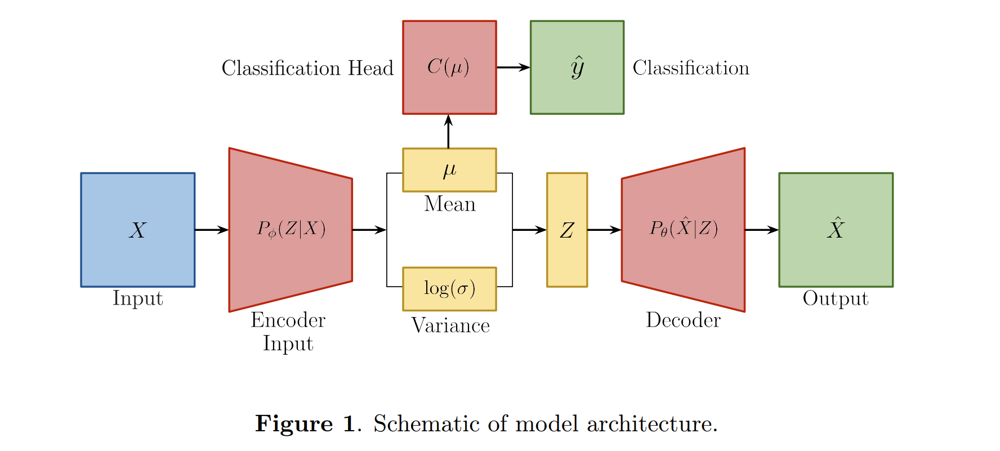

2. [Measurement of angular cross-correlation between the cosmological dispersion measure and the thermal Sunyaev--Zeldovich effect](https://arxiv.org/abs/2511.02155)

   > Fast Radio Burst, ISM

   研究了快速射电暴（FRBs）的色散测量（DMs）与热Sunyaev-Zeldovich（tSZ）效应的 Compton y 参数之间的角向交叉相关性。通过结合DMs和tSZ效应，可以分离出星系际介质（IGM）和中间星系团中的气体密度和温度。

3. [ASTROFLOW: A Real-Time End-to-End Pipeline for Radio Single-Pulse Searches](https://arxiv.org/abs/2511.02328)

   > Fast Radio Burst, Software

   [AstroFlow](https://github.com/lintian233/astroflow)用YOLOv11n从Time-DM图中检测FRB。

## 2025-11-06

1. [Exploring the spectral characteristics of the periodic burster 4U 1323-62: Type-I X-ray burst and persistent emission](https://arxiv.org/abs/2511.03172)

   > Transient, High Energy

   4U 1323-62最初由Uhuru和Ariel V任务在1970年代发现，有周期性的发射，被分类为具有爆发特性的中子星。通过NuSTAR观测4U 1323-62的持续辐射和I型X射线爆发的光谱特性。研究发现持续辐射被很好地描述为吸收的热康普顿化模型。

   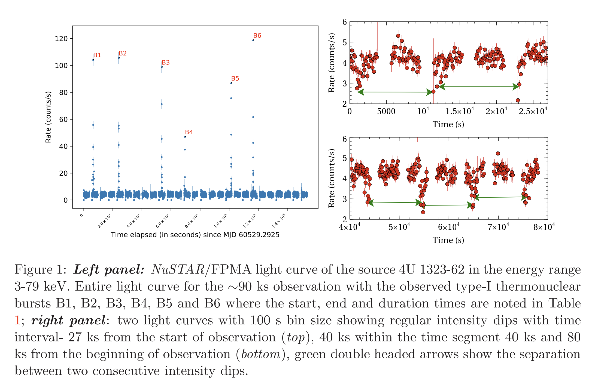

## 2025-11-07

1. [Cutana: A High-Performance Tool for Astronomical Image Cutout Generation at Petabyte Scale](https://arxiv.org/abs/2511.04429)

   > Astronomy, Software

   [Cutana](https://github.com/ESA/Cutana)用于在天文学图像中生成大规模的图像切块。使用欧几里得快速数据发布1（Q1）中的数据进行测试，该数据集包含63.1平方度内的3000万个源。在8个图块、1个FITS文件和200,000个源的配置下，单线程Cutana的执行速度比Astropy快2.90倍，每秒处理878.3个切块，而Astropy为303.1个。

   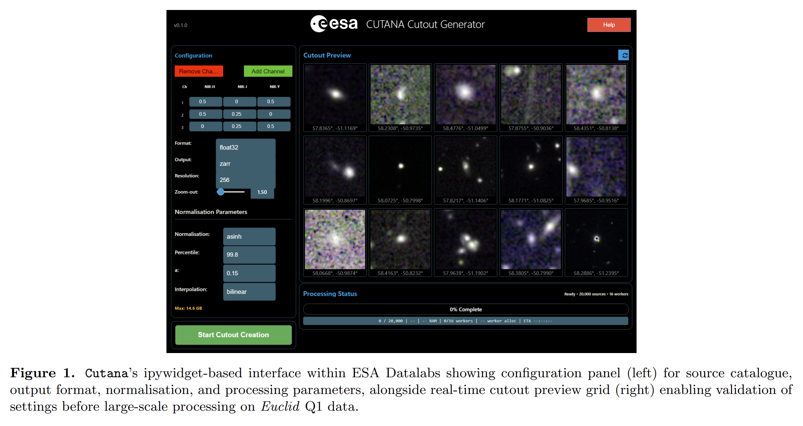

2. [Discovery of a 9.67-s pulsar in an ultraluminous X-ray source in NGC 4631 with XMM-Newton](https://arxiv.org/abs/2511.04282)

   > Pulsar, Transient, High Energy

   使用XMM-Newton的EPIC探测器对NGC 4631星系进行观测，使用Rayleigh（Z2）测试在0.147-1000秒的周期范围内进行搜索，在X-8中发现了周期为9.6652±0.0002秒的脉动，自转加速率为$(-9.6\pm0.5)\times10^{-8}s/s$，表明该紧凑天体为中子星。

## 2025-11-10

1. [HiSAXy: A fast methodology for solar wind structure identification in millions of time series](https://arxiv.org/abs/2511.04759)

   > Time Series, Method, Machine Learning

   `HiSAXy`结合了索引符号聚合近似（iSAX）和HDBSCAN，识别时间序列中的模式簇。与单独使用iSAX和HDBSCAN相比，HiSAXy在识别更大簇的同时，不牺牲簇内自相似性。

   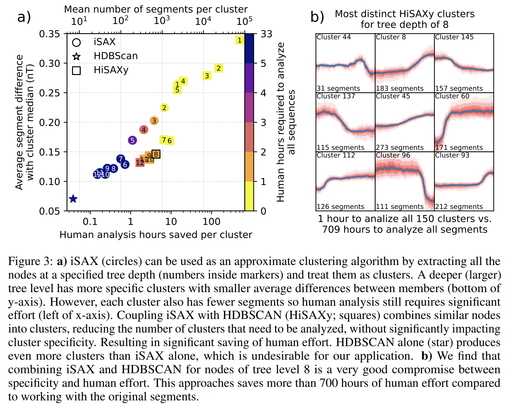

2. [Unsupervised Discovery of High-Redshift Galaxy Populations with Variational Autoencoders](https://arxiv.org/abs/2511.05439)

   > Galaxy, Deep Learning

   使用VAE来分析高红移星系的光谱数据。数据来自DAWN JWST Archive，选取红移大于4的星系，共2743个对象。对光谱数据进行去红移处理，重采样到静止波长，并进行归一化和arcsinh变换，以保留连续谱和发射线的信息。

   通过VAE重建光谱，提取潜空间变量，通过UMAP降维和GMM聚类，识别出12个星系群体，包括**淬灭/后星暴星系（SB）**、**莱曼-α发射体（LAEs）**、**极端发射线星系（EELGs）**、**高红移星系（High-z）**、**小红点（LRDs）**。

   

3. [Detecting FRB by DANCE: a method based on DEnsity ANalysis and Cluster Extraction](https://arxiv.org/abs/2511.04966)

   > Fast Radio Burst, Software

   [DANCE](https://github.com/Yuanao/DANCE_v-test)使用小波变换去除RFI，通过DBSCAN聚类提取FRB信号。

   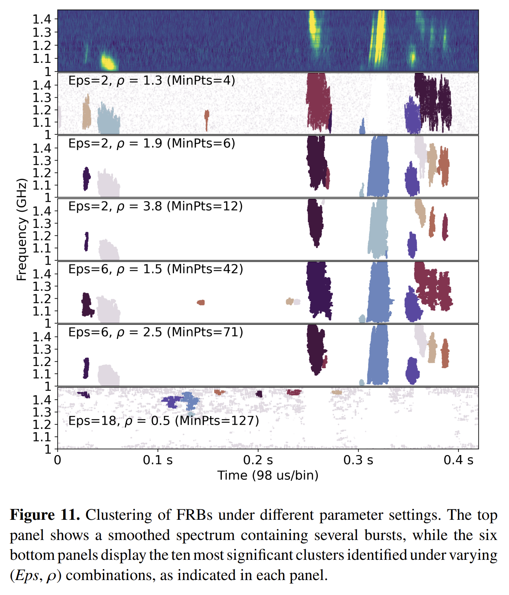

4. [Unusual periodic modulation in the radio emission of the methane dwarf binary WISEP J101905.63+652954.2](https://arxiv.org/abs/2510.25475)

   > White Dwarf, Periodicity, Radio

   使用LOFAR观测甲烷矮星双星系统WISEP J101905.63+652954.2（简称J1019+65）的射电辐射，找到两个不寻常的周期性信号，分别是约3小时和约0.787小时。其中一个可能是另一个棕矮星的旋转周期。需要进一步的红外观测来确认这一假设。

   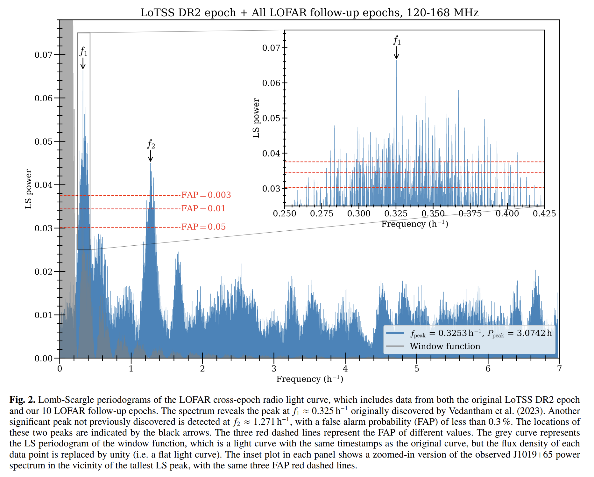

## 2025-11-11

1. [Formation Channels of Magnetars](https://arxiv.org/abs/2511.06554)

   > Magnetar, Theory

   通过种群合成模拟研究了磁星的形成通道，发现尽管大多数磁星作为孤立对象被观测到，但很大一部分来自双星系统的演化。双星演化通道，特别是双星破坏和潮汐自转加速，是主要的磁星形成途径。

   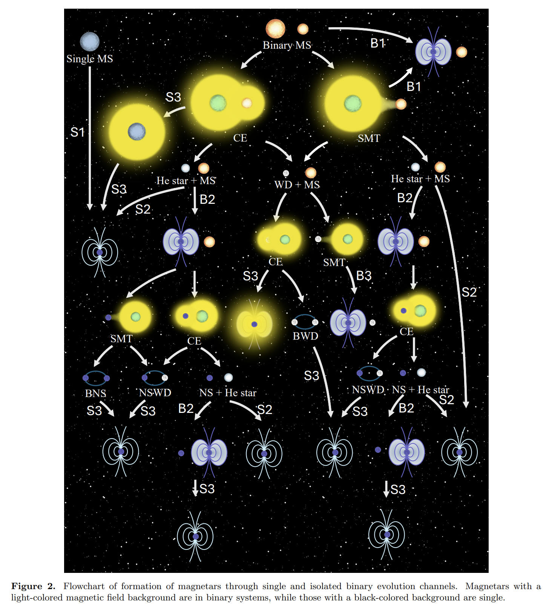

2. [MeerKAT observations of the spiral galaxy NGC 2997 in the S band. Detection of high dynamo modes](https://arxiv.org/abs/2511.06317)

   > Galaxy, Radio, Observation

   使用MeerKAT的S波段接收机对NGC 2997进行全偏振观测，揭示了星系中的复杂磁场结构。

   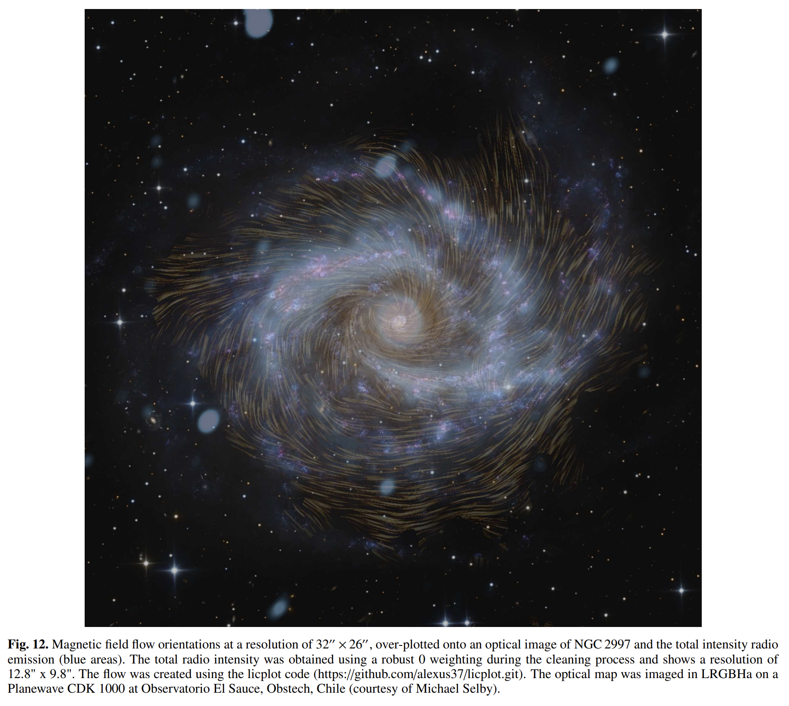

## 2025-11-12

1. [Probing Supernovae through gravitational wave entropy](https://arxiv.org/abs/2511.08010)

   > Gravitational Wave, Entropy

   对引力波信号进行分类，寻找核心坍缩超新星的引力波信号。

   数据有三种，分别是时域$X(t)$，短时傅里叶变化谱$S(t, f)$和连续小波变化$W(t, f)$，将图或者时间序列归一化成概率分布
   $$
   p_{t, f}=\frac{T(t, f)}{\sum_{t, f}T(t, f)}
   $$
   计算了四种熵

   - Shannon 熵：$-\sum p_i\log p_i$
   - Rényi 熵（阶数 α 可调）：$1/(1-\alpha)\log\sum p_i^\alpha$，对集中/稀疏分布更敏感，特别适合时频平面复杂度衡量。
   - Tsallis 熵（参数 q）：$(1-\sum p_i^q)/(q-1)$
   - 指数熵：$\sum p_ie^{1-p_i}$，把概率大的格点权得更重、对集中度变化也很灵敏。

   对全部数据计算一个全局熵，然后将时间轴、频率/尺度轴分块或滑窗，每块单独算熵，再对这些值做统计汇总（如均值、标准差、分位数、最小/最大等），把这些统计量拼成特征向量。

   使用k-最近邻（k-NN）、支持向量机（SVM）、随机森林（RF）、逻辑回归（LR）、朴素贝叶斯（NB）和极端梯度提升（XGBoost）进行分类，通过GridSearchCV进行超参数调优，确保模型的最佳性能。

   结果发现CWT + Rényi 熵在分类表现上最好。

2. [An Overview of Exocomets](https://arxiv.org/abs/2511.08270)

   > Comet, Review

   探讨了外彗星（exocomets）的定义、观测和研究现状。

## 2025-11-13

1. [Search for host galaxies of unlocalized Fast Radio Bursts in the SDSS IV catalog](https://arxiv.org/abs/2511.08960)

   > Fast Radio Burst, Galaxy, Statistics

   从文献中整理了已确认有宿主星系的FRBs，并从中排除了与星系团相关的FRBs和宿主定位较差的FRBs。最终得到了112个已确认红移的FRBs。

   根据这些已知红移的FRB，用不同的模型拟合DM-z（线性、对数抛物线、幂律、三者组合）。使用SDSS IV目录中的星系数据，计算每个未知红移的FRB与星系之间的角度偏移，并使用上述四种模型来预测FRBs的红移。

   

2. [JW-Flare: Accurate Solar Flare Forecasting Method Based on Multimodal Large Language Models](https://arxiv.org/abs/2511.08970)

   > Solar Flare, LLM

   `JW-Flare`基于Qwen2 VL-7B-Instruct进行监督微调，通过微调太阳活动区的文本物理参数和磁场图像来实现耀斑识别。

   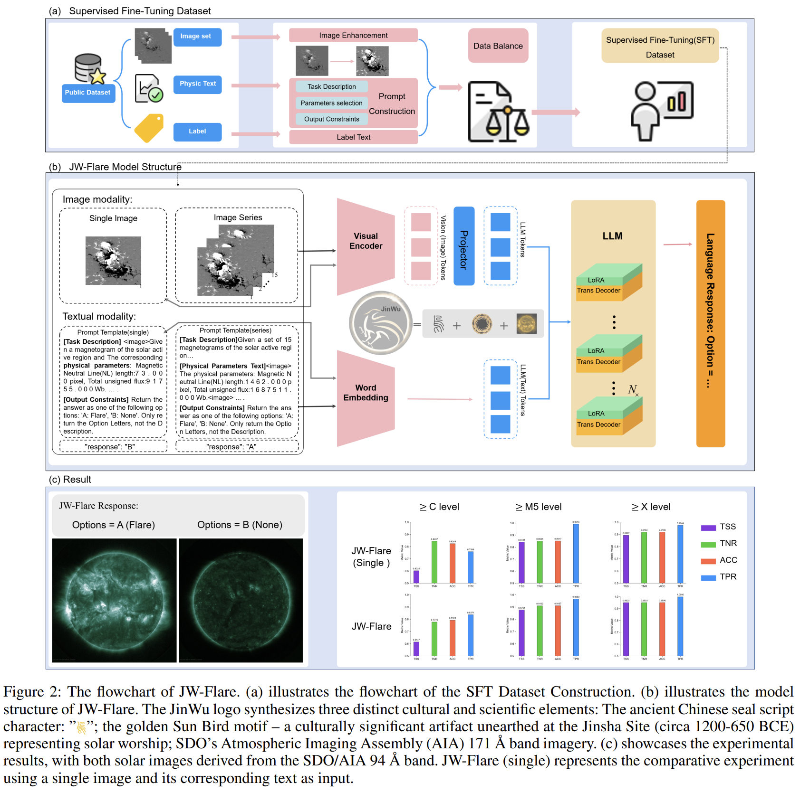

## 2025-11-14

1. [Searching for Long-Period Radio Transients in ASKAP EMU Data with 10-Second Imaging](https://arxiv.org/abs/2511.09770)

   > Transient, LPT, Survey

   ASKAP的演化宇宙图（EMU）巡天数据，覆盖南天极区域，中心频率为943.5 MHz，带宽为288 MHz，光谱分辨率为1 MHz。每个字段的观测时间为10小时，每10秒记录一次可见度数据。

   选择了20个EMU字段，覆盖总天数为750平方度，观测时间为200小时。这些字段位于银河系平面，纬度绝对值小于10度（因为大多数已知的孤立LPTs都靠近银河平面）。

   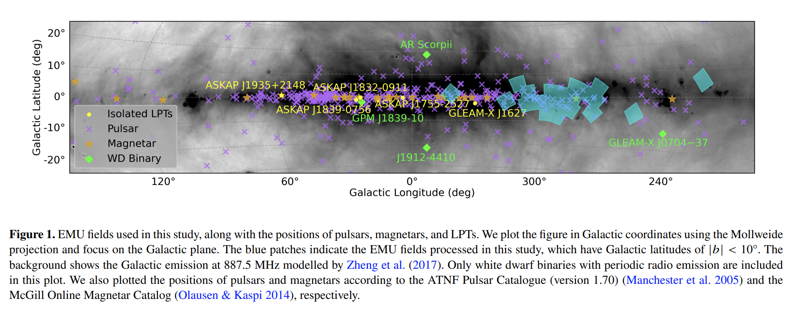

   在200小时的观测数据中，发现了六个瞬变源，其中三个通过与SIMBAD数据库的交叉匹配和手动检查动态光谱进一步确认。这些瞬变源与六颗恒星相关联，至少有一个瞬变源在射电波段是首次被探测到。

   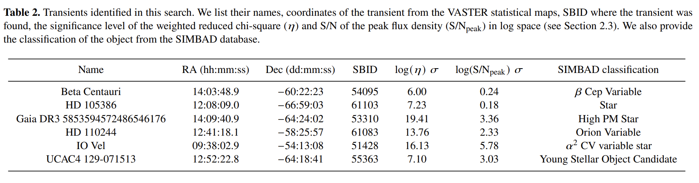

   这些瞬变源的峰值信噪比在14.6 mJy到3000 mJy之间，脉冲宽度从几分钟到几小时不等。所有瞬变源都表现出强圆偏振，部分瞬变源还表现出线性偏振。

   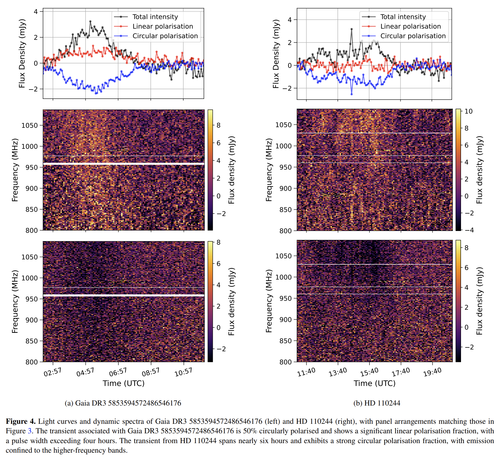

## 2025-11-17

1. [Practical Author Name Disambiguation under Metadata Constraints: A Contrastive Learning Approach for Astronomy Literature](https://arxiv.org/abs/2511.10722)

   > Astronomy, Deep Learning

   文献中普遍存在姓名歧义，无法准确的讲工作和具体的某个人联系起来。这里使用`Siamese`神经网络，使用出版物的元数据（作者姓名、标题、摘要），将消歧任务表征为相似性学习问题。

   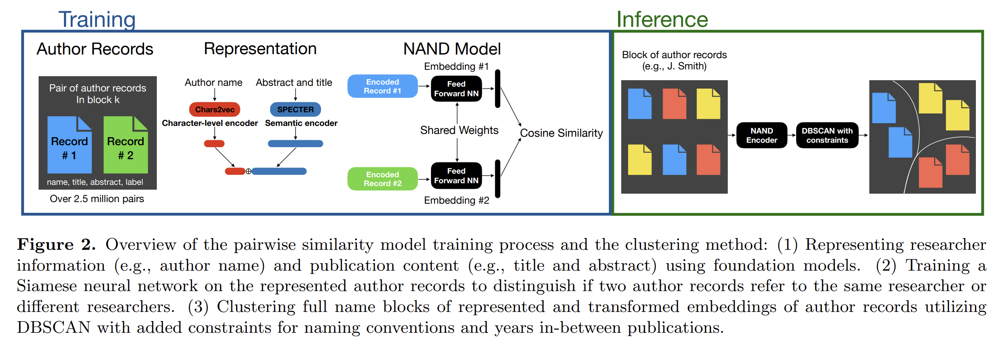

   构建了大规模[物理学 ORCiD 关联数据集](https://zenodo.org/records/11489161)，通过交叉匹配 NASA/ADS 出版物 ORCiD 来评估神经作者姓名消歧器。模型在成对消歧中达到高达 94%的准确率，在将出版物聚类到其研究者身份中时超过 95%的 F1 分数。

2. [Evolutionary Map of the Universe: A pilot survey to detect high Galactic latitude pulsars in variance images with ASKAP](https://arxiv.org/abs/2511.10886)

   > Transient, Radio, Survey, Pulsar

   在ASKAP的宇宙演化地图 EMU巡天数据中，使用方差成像凸显变源，搜索高银纬脉冲星。脉冲星可以通过独特的星际闪烁特征在连续谱图像中与其他点状射电源区分开来。

   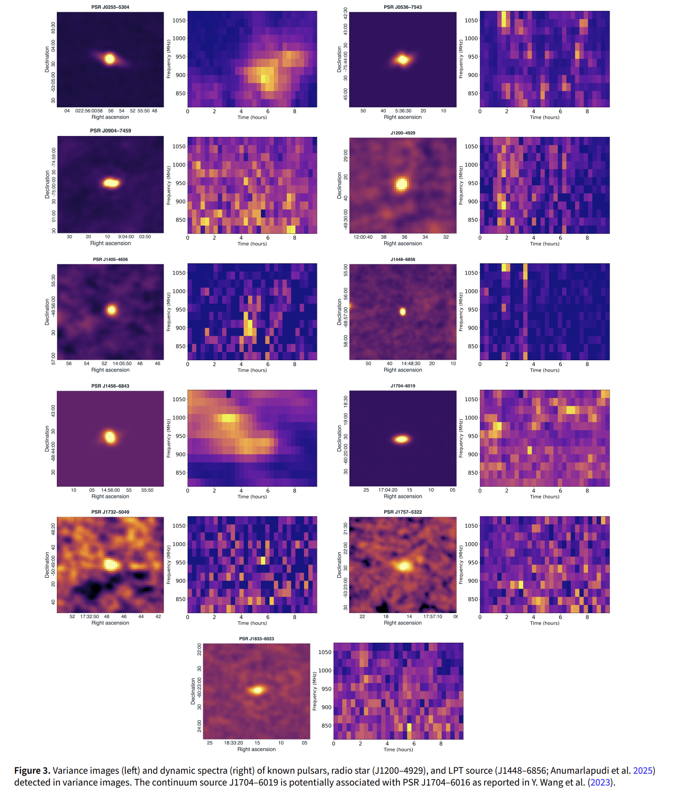

   在约 480 平方度的调查区域内检测到的 59,800 个致密射电源中，识别出 20 个变化剧烈的源。其中，9 个是已知脉冲星，1 个是已知射电星，1 个是超长周期源，3 个是射电星候选源，其余 6 个是脉冲星候选源。

## 2025-11-18

1. [High-impact Scientific Software in Astronomy and its creators](https://arxiv.org/abs/2511.12195)

   > Astronomy, Review, Software

   [统计了3432个天文软件](https://github.com/deepthought-initiative/architects-of-modern-astronomy)，使用论文引用量作为影响力指标。发现一半的开发工作是美国相关机构进行的，大量高影响力的工具是个人领导。下图使用[matplotlib-extra](https://github.com/chenyulue/matplotlib-extra)画的。

   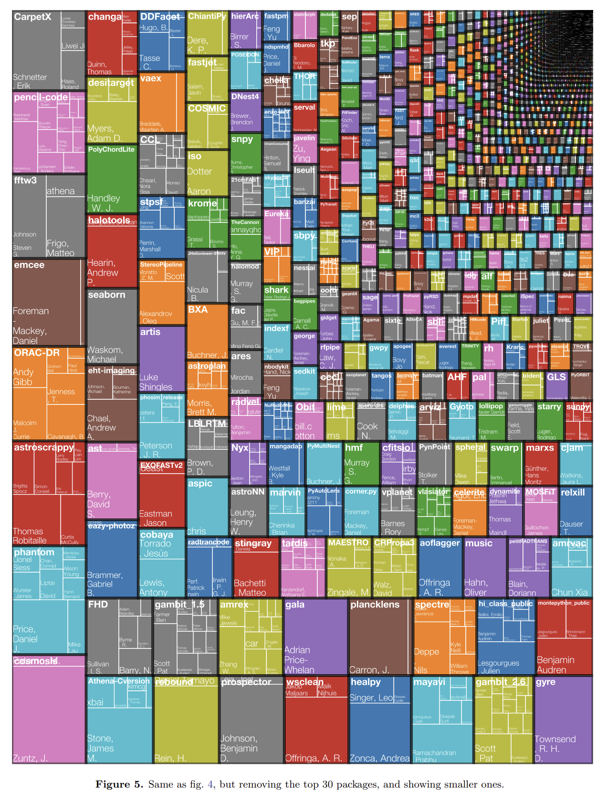

2. [AstroMLab 5: Structured Summaries and Concept Extraction for 400,000 Astrophysics Papers](https://arxiv.org/abs/2511.12353)

   > Astronomy, Deep Learning

   [AstroMLab 5](https://github.com/tingyuansen/astro-ph_knowledge_graph)天文知识图谱。使用arXiv从1992年到2025年7月的408590篇astro-ph文章，提取`背景、动机、方法、结果、解释、启示`的结构化摘要，构成了一个包含3.8 百万篇论文-概念关联的数据集，并为所有概念提供了语义嵌入。

   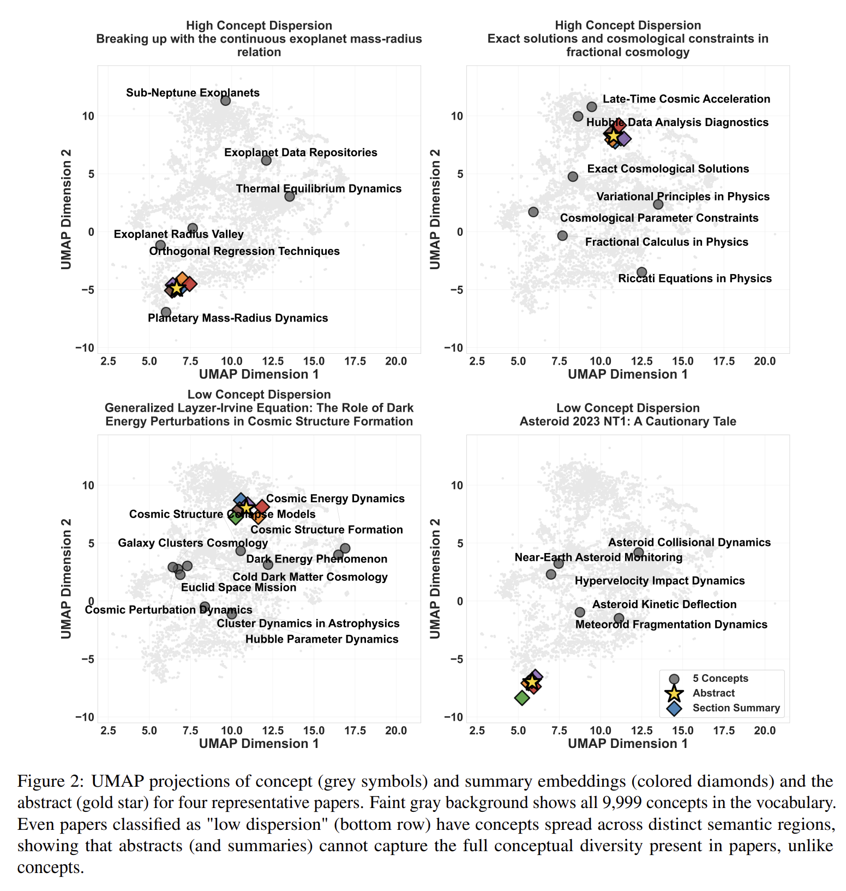

3. [From Images to Physics: Probabilistic Inference of Galaxy Parameters and Emission Lines via VAE & Normalizing Flows](https://arxiv.org/abs/2511.12737)

   > Galaxy, Deep Learning

   使用归一化流（VAE-Normalizing Flow）从 SDSS gri成像和测光数据中推断星系属性和发射线流量。

   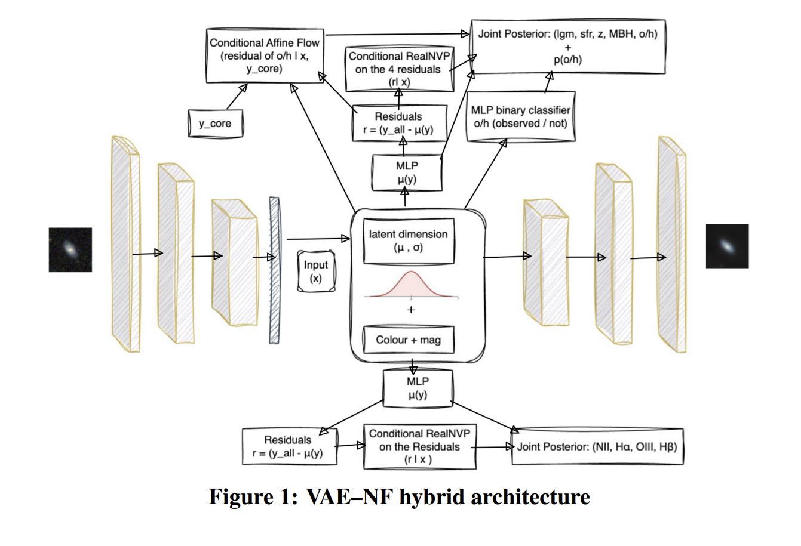

4. [Kosmos: An AI Scientist for Autonomous Discovery](https://arxiv.org/abs/2511.02824)

   > LLM

   [Kosmos](https://github.com/jimmc414/Kosmos)和[kosmos-figures](https://github.com/EdisonScientific/kosmos-figures)通过LLM实现科学发现。

## 2025-11-19

1. [Low-energy Radio Bursts from Magnetar XTE J1810-197: Implications for Fast Radio Bursts](https://arxiv.org/abs/2511.13856)

   > Fast Radio Burst, Magnetar

   GBT在300 MHz 至 6.15 GHz的频率范围内，对磁星 XTE J1810-197进行了4.5年242次观测，探测到超过97000个爆发。XTE J1810-197 在脉冲星状和巨脉冲星状发射状态之间快速切换，并且像 XTE J1810-197 这样的磁星仍然是可行的 FRB 发射源，以能量与 FRB 相当的巨脉冲形式发射。

2. [The Dawes Review 13: A New Look at The Dynamic Radio Sky](https://arxiv.org/abs/2511.10785)

   > Radio, Transient, LPT, Review

   对时间尺度从秒到年量级的暂现源巡天的总结。

   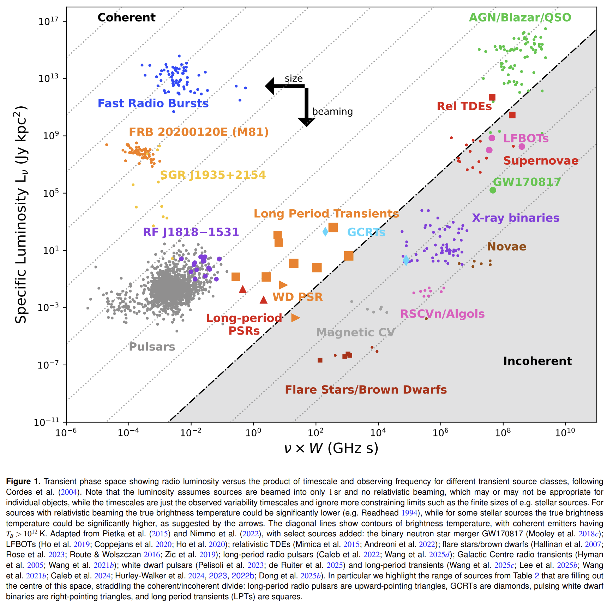

## 2025-11-20

1. [Tidal Disruption Events](https://arxiv.org/abs/2511.14911)

   > TDE, Review

   黑洞撕裂恒星产生TDE事件，光变在周-月的时间尺度上发生，光变曲线取决于黑洞的性质，可以约束超大质量黑洞质量函数的下限。

   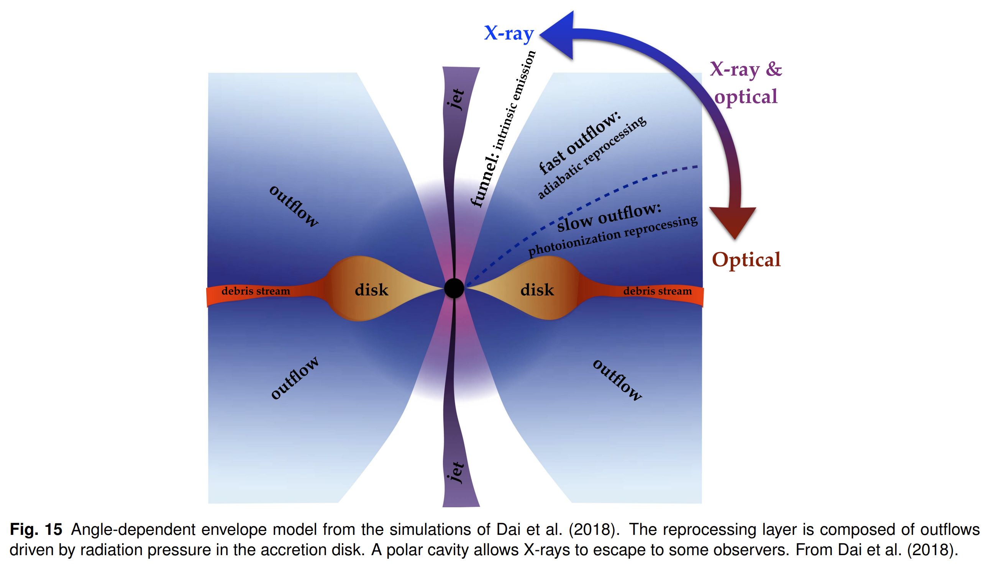

2. [Advancing Identification method of Gamma-Ray Bursts with Data and Feature Enhancement](https://arxiv.org/abs/2511.15470)

   > GRB, Deep Learning

   通过合成GRB数据，训练一维CNN来从光变曲线中找GRB。

   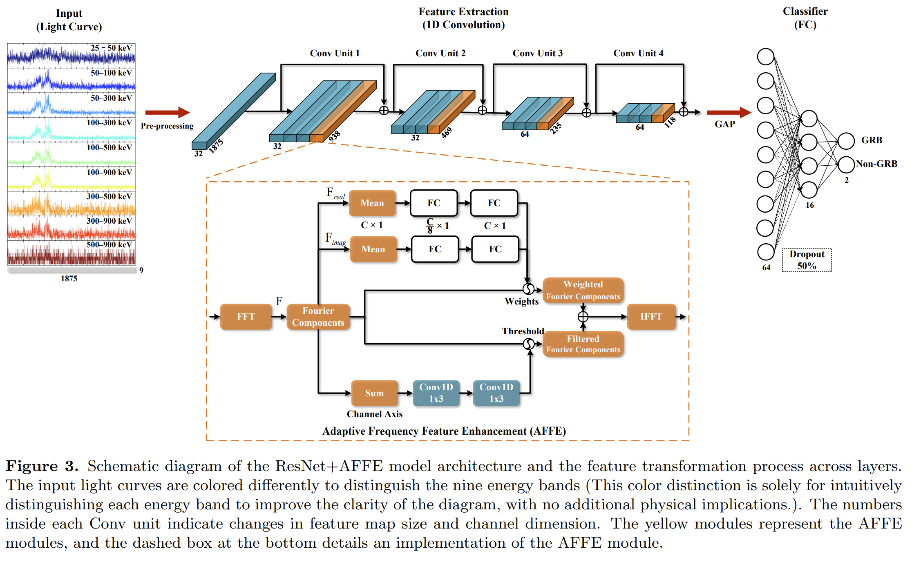

   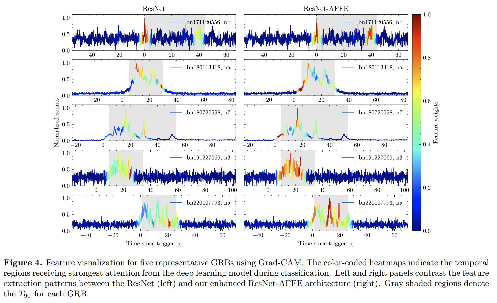

## 2025-11-21

1. [Decoding the Radio Sky: Bayesian Ensemble Learning and SVD-Based Feature Extraction for Automated Radio Galaxy Classification](https://arxiv.org/abs/2511.15788)

   > Galaxy, Machine Learning, Classification

   通过奇异值分解（SVD）提取特征，加上多个分类器（逻辑回归、支持向量机、LightGBM、多层感知器）打包集成对射电星系进行分类。

   

## 2025-11-24

1. [Quantifying the impact of selection effects on FRB DM-z relation cosmological inference](https://arxiv.org/abs/2511.16850)

   > Fast Radio Burst, Cosmology

   观测到的FRB会有选择效应，包括设备灵敏度、DM搜索效率、FRB源群体等效应。这里通过前向模拟FRB群体，研究选择效应对DM-z关系的影响。

   发现在小样本（100个FRB）时，影响小于0.8sigma，意味着当前的宇宙学研究还是稳健的。当样本比较大时（1e4个FRB），巡天对不同DM的搜索效率会导致3sigma的偏差。

   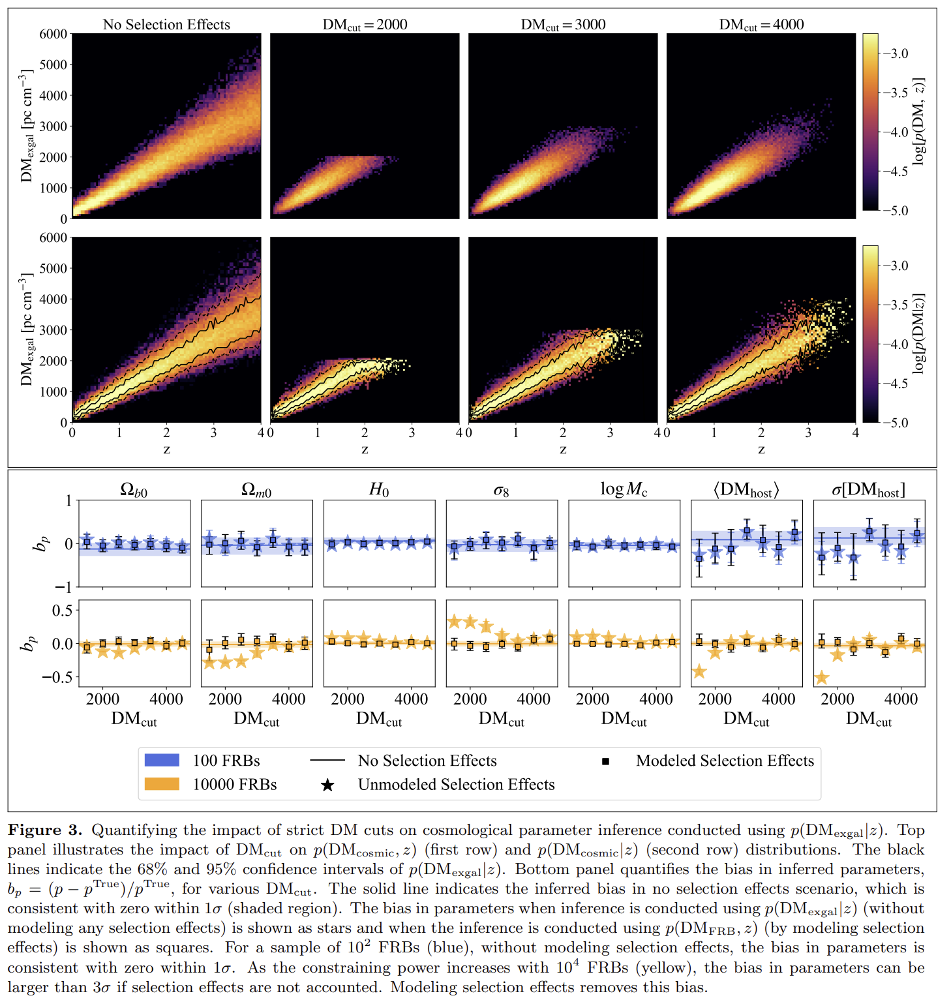

## 2025-11-25

