## 2025-12-01

1. [The Parkes Observatory Pulsar Data Archive](https://arxiv.org/abs/2511.22702)

   > Pulsar, Survey

   Parkes在过去三十年中的脉冲星观测数据档案，包含400多个项目的200万份文件。介绍了档案的当前状态，并提供了关于这些数据集的获取、分析、数据处理、可视化、保存和传播的信息。

   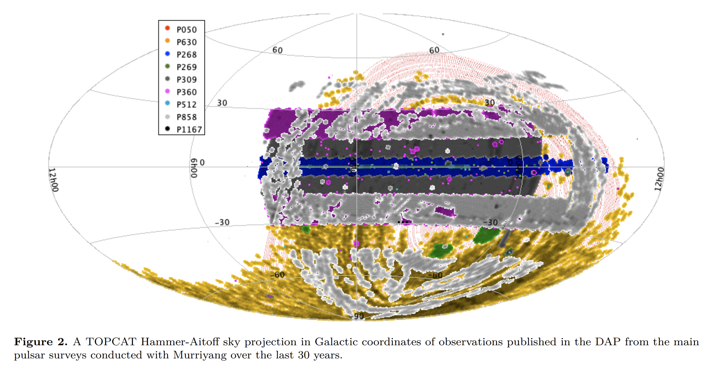

## 2025-12-02

1. [Non-detection of FAST and Parkes follow-up observation for 27 Parkes discovered FRBs](https://arxiv.org/abs/2512.01281)

   > Fast Radio Burst, Observation

   对Parkes探测到的27个非重复FRB进行FAST的观测，没探测到爆发，给个事件率上限。

2. [Nested Sampling for ARIMA Model Selection in Astronomical Time-Series Analysis](https://arxiv.org/abs/2512.01929)

   > Light Curve, Method, Periodicity

   自回归积分移动平均（ARIMA）模型提供了通用的参数化，描述时间序列的随机变化。结合嵌套采样算法，在自回归（AR）和移动平均（MA）阶数的网格上进行模型选择，并能高效地推断所选模型的参数。

## 2025-12-03

1. [Padé Approximants for Fast Radio Bursts Diffuse Dispersion Measure](https://arxiv.org/abs/2512.02357)

   > Fast Radio Burst, Cosmology

   为平坦宇宙、$\Lambda\rm CDM$、$\omega\rm CDM$推导了DM的近似公式，在$0.01\le z\le2$、$0.2\le\Omega_m\le1.0$、$-3.0\le\omega\le-0.5$范围内表现良好。
   $$
   {\rm DM}_{\rm diff} = \frac{{\rm DM}_{\rm diff}^c}{\sqrt{\Omega_m}}  \Bigg( \Phi \big[ x(0, \Omega_m) \big] - \sqrt{1+z} \cdot \Phi \big[ x(z, \Omega_m) \big]  \Bigg) <= \Lambda{\rm CDM}
   $$

2. [A Statistical Analysis of Fluence and Energy Distributions of Non-repeating Fast Radio Bursts Detected by CHIME](https://arxiv.org/abs/2512.02588)

   > Fast Radio Burst, Statistics

   用 CHIME 的 415 个非重复 FRB 做了系统统计，发现它们在流量、DM、红移和能量分布上都表现出明显的多段 / 多成分结构。

3. [Search for persistent radio emission towards selected localised Fast Radio Burst positions using the MeerKAT Telescope](https://arxiv.org/abs/2512.02693)

   > Fast Radio Burst, PRS, Observation

   目前有4个FRB对应PRS（FRB20121102A、FRB20190417A、FRB20190520B 和 FRB20240114A/存疑）。用MeerKAT对25个FRB进行观测，这里介绍了其中三个的结果。

   - FRB 20221106有一个射电源，总流量在 **0.48–0.54 mJy** 左右，分辨率不足，无法区分是宿主星系的射电信号还是PRS。

     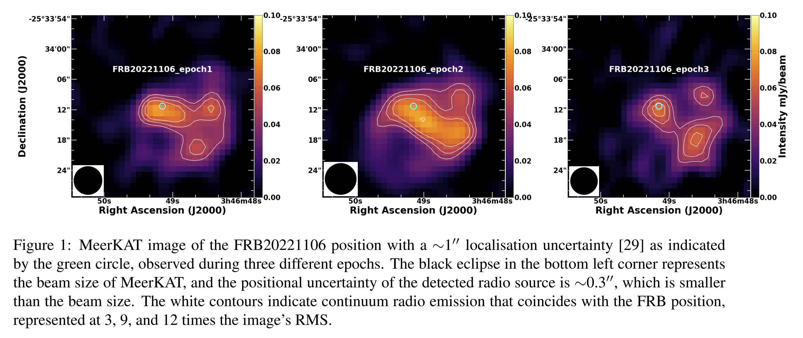

   - FRB 20181112有一个弱信号，总流量从约 **0.066 mJy** 降到 **0.024 mJy**，FRB 位置完全落在射电源内部，且重合显著。

     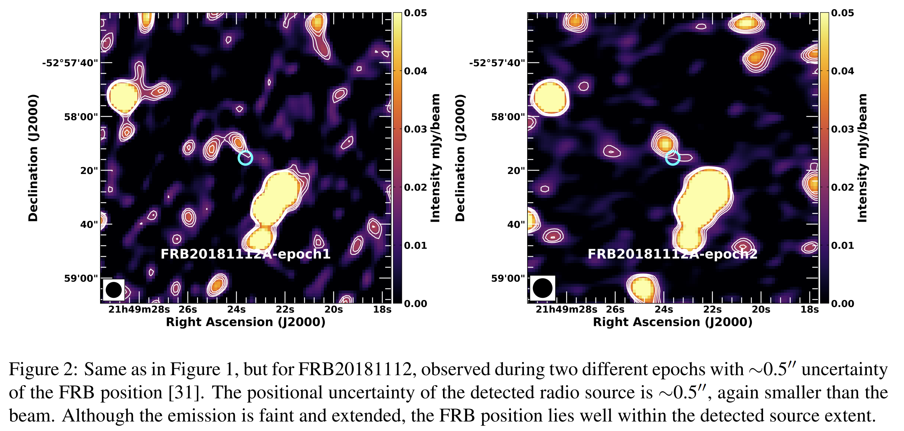

   - FRB 20190102没有PRS，给出上限。

4. [The role of the galaxy stellar mass function in determining the cosmological distribution of astrophysical transients with applications to fast radio bursts and merging binary black holes](https://arxiv.org/abs/2512.02642)

   > Fast Radio Burst, Statistics, Cosmology

   做 FRB / 合并黑洞这类宇宙瞬变体的“总体统计”时，不能只用一条随红移变化的“宇宙平均恒星形成率曲线”，还必须把“哪一类星系在产这些东西”通过星系恒星质量函数（SMF）显式放进去，否则会系统低估/误判它们的形成效率和红移分布。

## 2025-12-04

1. [Radio Detection of a Local Little Red Dot](https://arxiv.org/abs/2512.03331)

   > Galaxy, Radio, LRD

   JWST 在高红移发现了大量“小红点”星系（LRDs），这些极其致密、光谱呈 V 型且 X 射线与射电都很弱的星系，其能量来源一直在 IMBH/SMBH 强吸积模型 vs. 极端大质量恒星团模型之间摇摆。作者认为，由于高红移 LRD 太远且难以在射电波段探测，不如先在本地宇宙寻找“Local LRD”类比体，于是选择了光谱性质与 LRD 相似的两个紧致矮星系 J1025+1402 和 J1047+0739。

   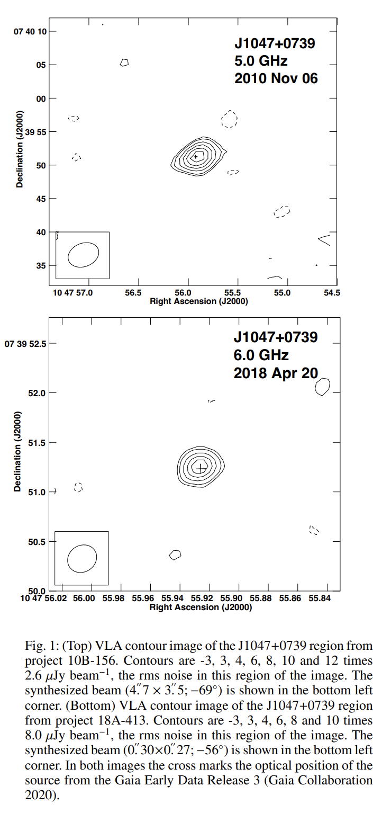

   在 VLA C 阵 5 GHz（2010 年）和 A 阵 6 GHz（2018 年）的档案观测中，均清晰探测到 J1047+0739 的紧致射电辐射，流量从 ~43 μJy 增长到 ~117 μJy，一颗极亮射电超新星（或其再增亮）就足以解释观测到的射电辐射和时变性。

2. [Statistical and Temporal Analysis of Multi-component Burst-clusters from the Repeating FRB 20190520B](https://arxiv.org/abs/2512.03591)

   > Fast Radio Burst, QPO

   从190520的一个爆发中探测准周期。

   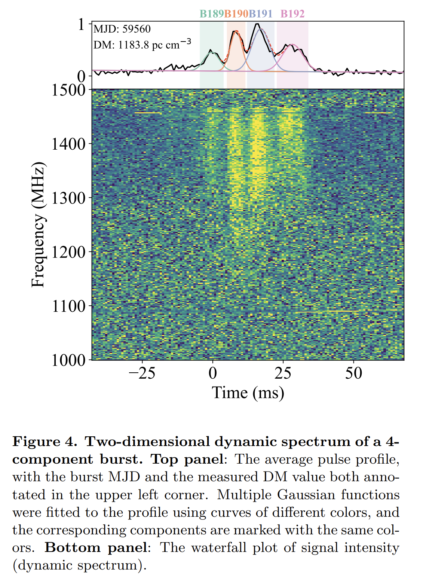

3. [Large Language Models for Limited Noisy Data: A Gravitational Wave Identification Study](https://arxiv.org/abs/2512.04031)

   > LLM, Gravitational Wave

   用少量引力波数据在LLM上做微调，很少的训练就能做到97.4%的准确率，额外加入56万条模拟样本不会提升在真实数据上的表现。

## 2025-12-05

1. [Minuet: A Diffusion Autoencoder for Compact Semantic Compression of Multi-Band Galaxy Images](https://arxiv.org/abs/2512.04145)

   > Galaxy, Deep Learning

   [Minuet](https://github.com/alexandergagliano/Minuet)使用基于Transformer的AutoEncoder输出的扩散模型进行图像重建，实现星系特征提取与高保真度的概率性重建。在提取的特征上，构建了一个条件流来生成基于 SED 的红移、恒星质量和恒星形成速率的后验分布。

   

2. [Machine Phenomenology: A Simple Equation Classifying Fast Radio Bursts](https://arxiv.org/abs/2512.04204)

   > Fast Radio Burst, Machine Learning, Symbolic Regression

   以 FRB 为例，先用深度学习和 SHAP 从 CHIME Catalog 1 的 48 个观测量里选出 6 个最关键参数，再用 Buckingham–π 量纲分析构造无量纲组合，最后交给符号回归去搜索一条能把 FRB 分成两个高斯族的简单判别方程。
   $$
   \Theta_{\rm NDR}=(\nu_p-\Delta\nu)^{0.3}\Delta t^{0.3}+\frac{\nu_p}{0.3\Delta\nu}+\alpha
   $$

## 2025-12-08

1. [A Persistently Active Fast Radio Burst source Embedded in an Expanding Supernova Remnant](https://arxiv.org/abs/2512.05448)

   > Fast Radio Burst, Observation

   190520色散下降。

2. [A new Gaia census of OB associations within 1 kpc](https://arxiv.org/abs/2512.05854)

   > Star Cluster, Statistics

   OB 星协是恒星形成和银河结构的原始示踪器。使用Gaia数据，在太阳1kpc以内的范围内，找到了25000个O型和B型恒星，使用HDBSCAN最终生成了57个OB星协目录。发现其中41个OB星协在至少一个方向上表现出显著的膨胀模式，膨胀模式是各项异性的。

   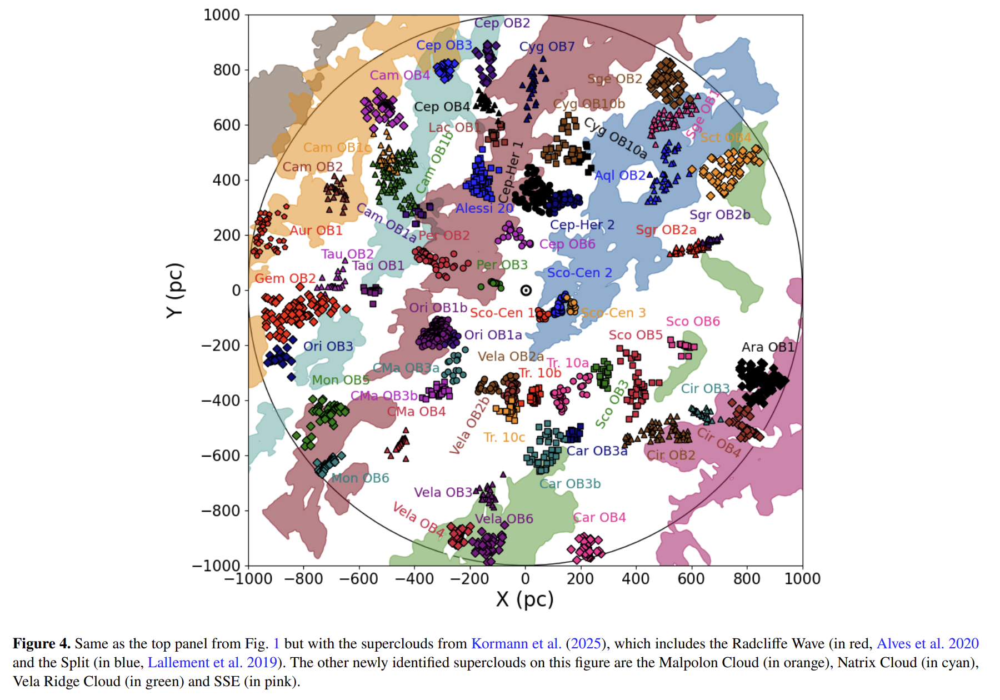

   把OB星协在3D空间位置中跟Radcliffe Wave进行匹配，之前已经有工作表明 Radcliffe Wave 被 **年轻恒星、开放星团和分子云**所追踪；这篇文章补充说明：**大量大质量 OB 协会也沿着 Radcliffe Wave 排布**。

   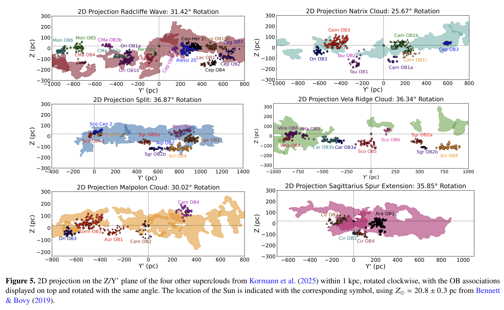

## 2025-12-09

1. [Evidence of young magnetars in massive binary embedded in a supernova remnant as sources of active fast radio bursts](https://arxiv.org/abs/2512.07140)

   > Fast Radio Burst, Theory

   从FRB190520的色散下降认为周围存在超新星遗迹，同时对比FRB121102和FRB190417的RM变化，认为重复FRB是在SNR中的年轻磁星+大质量伴星的双星系统。

   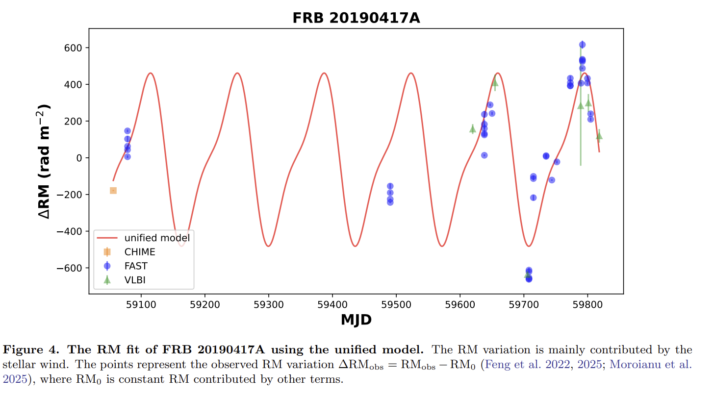

2. [Back-End System of BURSTT](https://arxiv.org/abs/2512.07300)

   > Fast Radio Burst, Transient, Instrument

   BURSTT的后端介绍，通过RFSoC完成波束合成，在CPU集群进行消色散和脉冲搜索（使用的CHIME的bonsai算法进行单脉冲搜索）。在$60^\circ\times120^\circ$超大视场上实现实时波束合成、通道化和消色散搜索，并触发基带数据记录。已经可以探测到Crab的巨脉冲和PSR B0329+54的单脉冲。

   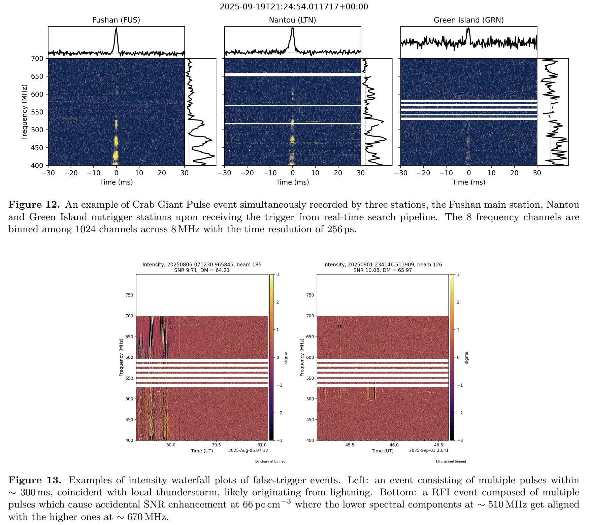

3. [Revealing Hidden Repeaters in the CHIME/FRB Catalog: Semi-Supervised Insights into the Fast Radio Burst Population](https://arxiv.org/abs/2512.06316)

   > Fast Radio Burst, Statistics, Machine Learning

   基于 CHIME/FRB Catalog 与 Blinkverse 数据库，构建了一套半监督机器学习框架，用于在表面非重复FRB 中挖掘隐藏的重复源。结合UMAP降维，使用随机森林、SVM、逻辑回归、AdaBoost、Gradient Boost在有标签的已知重复源/非重复源和大量无标签事件上迭代训练。

   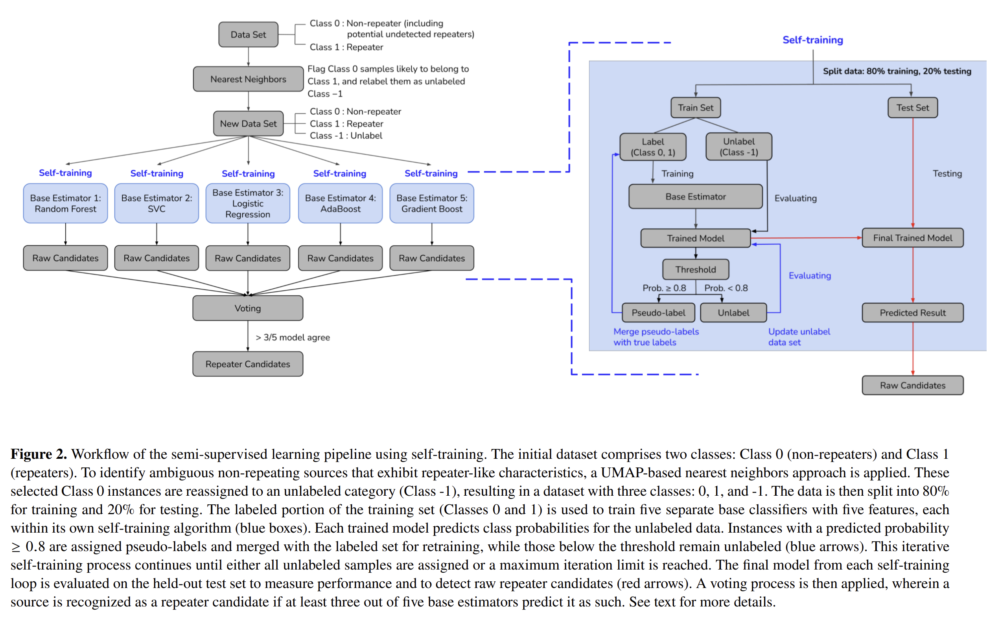

   结果表明色散量 DM、峰值频率和辐射量是区分重复源与非重复源的主导特征，模型识别出 36 个额外的重复候选，并指出“重复 vs 非重复”的差异可能既包含物理起源，也包含观测偏差。

   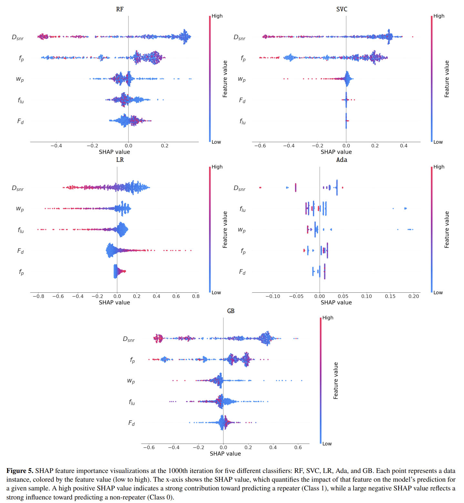

4. [FIP-TOI: Fast Imaging Pipeline for Pulsar Localisation with a Transient-Oriented Radio Astronomical Imager](https://arxiv.org/abs/2512.06254)

   > Radio, Transient, Software

   [FIP-TOI](https://github.com/egbdfX/SVDimager)用于干涉阵中射电暂现源的快速成像。基于奇异值分解（SVD）并在 NVIDIA GPU 上并行实现，专门针对短时间尺度、多快照宽视场成像中的 w-term 问题进行优化，实现比传统 WSClean 成像器约快十倍的定位速度（4K×4K 图像）。

## 2025-12-10

1. [Machine learning classification of baseband data of CHIME FRBs](https://arxiv.org/abs/2512.08308)

   > Fast Radio Burst, Statistics, Machine Learning

   在 12 个已知重复源和 128 个“非重复”事件组成的 baseband 样本中，作者利用 16 个物理参数进行聚类，最终在 122 个标记为非重复的 FRB 中识别出 15 个重复源候选，同时将 31 个之前工作提出的重复候选重新归类为更像非重复的事件。

   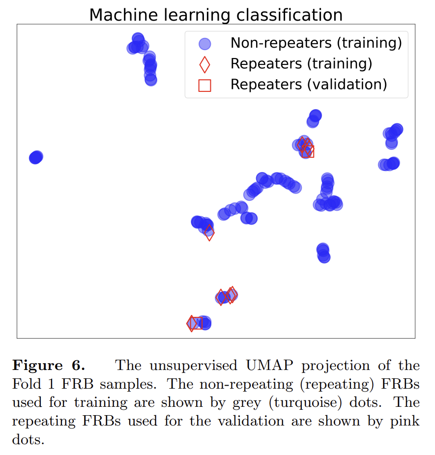

   这 15 个候选中有 14 个与以往的候选列表重合，1 个是新发现，而且其中一例后来被 CHIME/FRB 证实为真正的重复源。

2. [The Milky Way Imaging Scroll Painting Survey: Data Release 1 ](https://arxiv.org/abs/2512.08260)

   > Radio, Survey

   银河画卷[数据释放](https://doi.org/10.57760/sciencedb.27351)。

   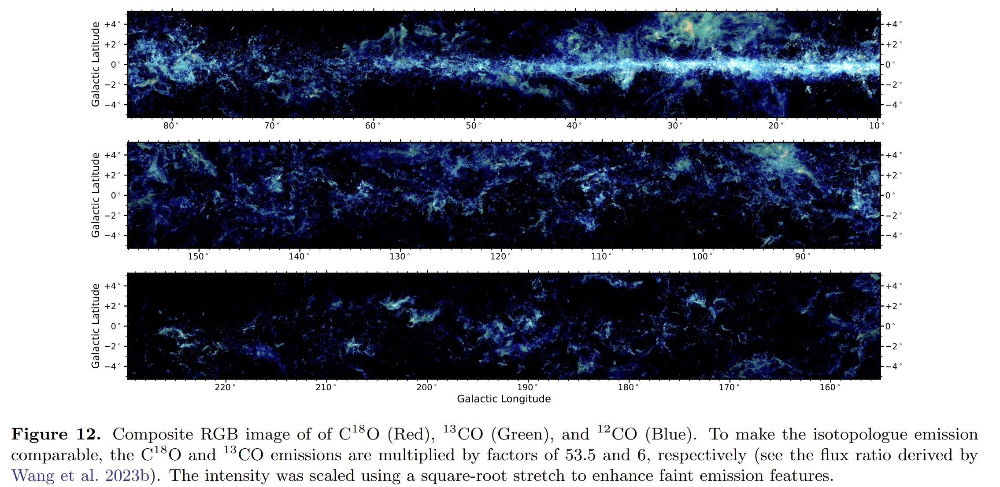

## 2025-12-11

1. [Discovery of the redback millisecond pulsar PSR J1728-4608 with ASKAP](https://arxiv.org/abs/2512.09339)

   > ASKAP, Pulsar, Observation

   ASKAP发现新的 redback 脉冲星，PSR J1728-4608，周期2.86ms，轨道周期5.05小时。对食变机制的建模表明，同步吸收是造成无线电波段观测到的食变的主要原因。

## 2025-12-12

1. [Irregularity in Active Fast Radio Burst Repeaters and Magnetar Periodic Radio Pulses: Time, Energy, and Frequency Analyses](https://arxiv.org/abs/2512.10249)

   > Fast Radio Burst, Statistics

   Shotaro使用我们的方法统计FRB和磁星的另一个工作。

2. [The Space-Based Time-Domain Revolution in Astrophysics](https://arxiv.org/abs/2512.10002)

   > Light Curve, Time Domain, Review

   回顾了过去 20 年里 **空间时间域光度测量**（CoRoT、Kepler/K2、TESS 等）如何通过连续、高精度的光变曲线，改变从恒星物理到银河、河外天体和太阳系在内的几乎所有天体物理分支，包括恒星震荡、对流与颗粒噪声、恒星自转与磁活动、耀发和年轻恒星、双星、银河考古、黑洞与中子星、爆发现象、活动星系核、潮汐瓦解事件以及小行星和行星大气等方面。

## 2025-12-15

1. [The energy structure function of fast radio bursts supports a stochastic origin model](https://arxiv.org/abs/2512.11283)

   > Fast Radio Burst, Statistics

   FRB能量结构函数

2. [Type II and Type III Solar Radio Burst Classification Using Transfer Learning](https://arxiv.org/abs/2512.11487)

   > Solar Flare, Deep Learning

   从 e-Callisto 射电动态谱中标注了太阳耀斑的II型暴和III型暴，使用迁移学习微调多种模型（VGGNet-19、MobileNetV2、ResNet-152、DenseNet-201、YOLOv8），其中YOLOv8效果最好。

## 2025-12-16

1. [Pre-training vision models for the classification of alerts from wide-field time-domain surveys](https://arxiv.org/abs/2512.11957)

   > Time Domain, Light Curve, Deep Learning

   在不同预训练策略上比较天文图像分类的效果。结果发现，在Galaxy Zoo星系图像上预训练比ImageNet预训练或从零训练效果好，标准模型结构比自建CNN效果好。

   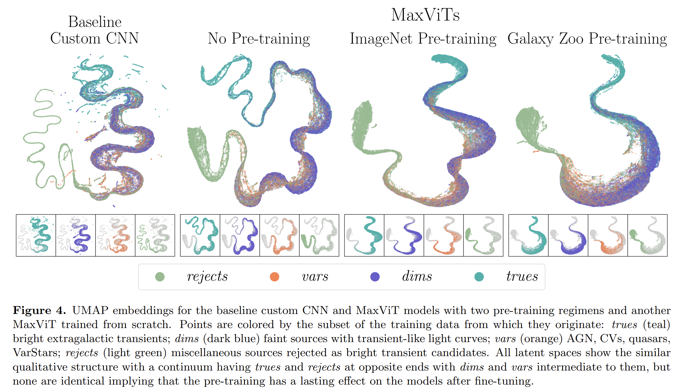

2. [The automation of optical transient discovery and classification in Rubin-era time-domain astronomy](https://arxiv.org/abs/2512.11959)

   > Time Domain, Light Curve, Instrument, Review

   LSST正在加速瞬变源的发现速度，光学时域天文学需要工作流程的自动化。

   当前巡天普遍采用`图像差分 → 告警流 → broker → 过滤 → 人工扫描 → 光谱随访`的架构，ML 在 real/bogus 判别上已能做到 99% 准确率，但每个新巡天都要重新标注数据、训练模型，成本很高。目前过度依赖 PLAsTiCC / ELAsTiCC 等模拟数据、缺乏统一基准，导致不同模型难以公平比较。

   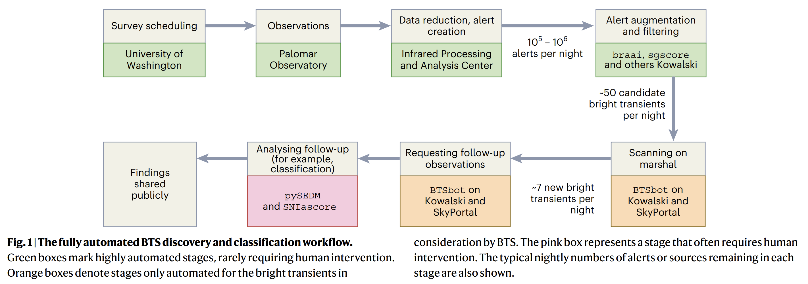

3. [The MeerKLASS UHF On-the-Fly Continuum Survey -- Data Release I](https://arxiv.org/abs/2512.11964)

   > Radio, Survey

   MeerKAT大面积巡天项目MeerKLASS的首次数据发布，在816MHz的连续谱图像，12个小时的观测800平方度的观测区域。识别出95483个射电源。

   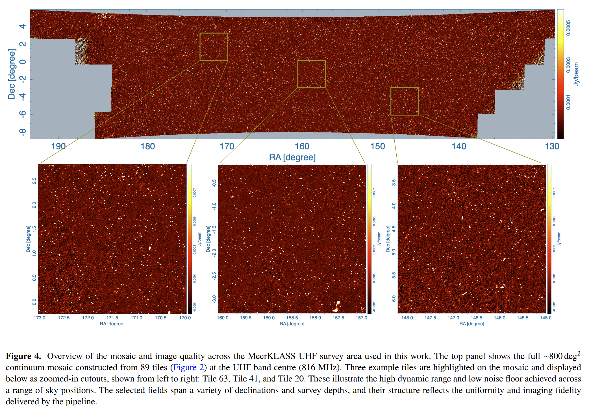

4. [Detection of Partial Coherence due to Multipath Propagation for FRB 20220413B with CHIME/FRB](https://arxiv.org/abs/2512.11969)

   > Fast Radio Burst, Lensing

   当 FRB 信号经过星际或星系际等离子体时，会出现多径传播、散射和透镜效应。使用CHIME基带数据， 对FRB 20220413B 进行逐频道的电场相关和强度相关分析，以寻找频率间距大于常规散射带宽时仍然存在的相关性，这类信号被视为“部分相干”的证据。

   尽管爆发形态可以通过等离子体透镜进行建模，但时间延迟相关中存在的相干特征与共同散射屏幕的预期相符但不是相干等离子体透镜。

   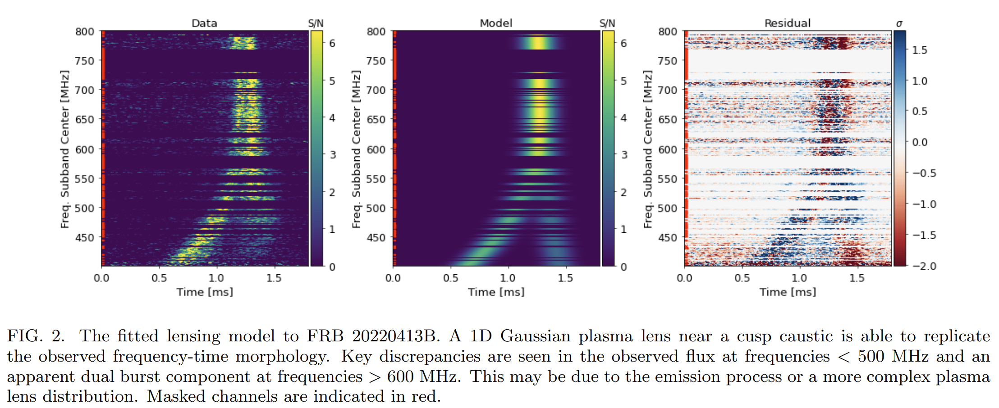

5. [Semantic search for 100M+ galaxy images using AI-generated captions](https://arxiv.org/abs/2512.11982)

   > Galaxy, LLM

   在 Galaxy Zoo-DECaLS 上，用 VLM（如 GPT-4.1-mini）给完全未标注的星系图像自动写天文学风格的描述，选出性价比最好的模型+提示词，大规模生成 25 万多张图像的说明文字，然后用这些描述来训练一个 CLIP 式的检索模型 [AION-Search](https://github.com/NolanKoblischke/AION-Search)。

   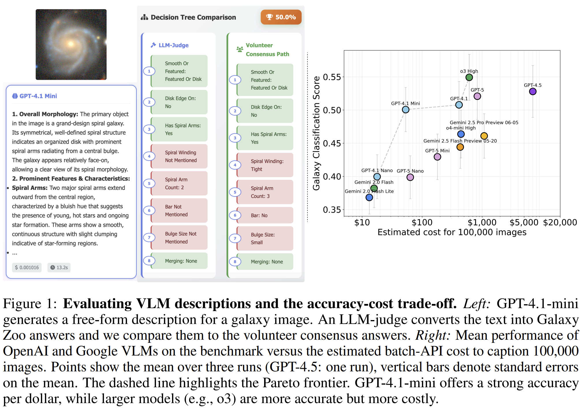

   在“螺旋星系、并合星系、强引力透镜”三类科学目标上，AION-Search 用纯文本查询就能零样本检索出结果，明显优于各种自监督相似度检索基线，再加一层 GPT-4.1 复查重排后（用 GPT-4.1 按是不是强引力透镜打 1–10 分，然后按得分重排），强透镜在 top-100 里的召回几乎翻倍。

6. [NICER Magnetar Burst Catalog](https://arxiv.org/abs/2512.12291)

   > Magnetar, Catalog

   基于约 8 年的 NICER 观测，系统搜寻并整理了磁星的短时 X 射线爆发，构建了一个统一的爆发目录。在 23 个磁星源的观测中识别出 1130 个短爆发，对每个爆发给出了持续时间、能量通量、光谱参数等物理量，并指出样本中 SGR 1935+2154 占主导。

   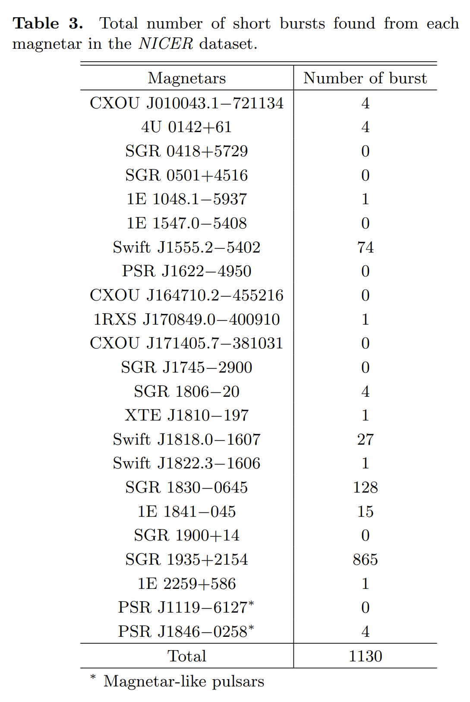

7. [The disk precession in a Be star-magnetar binary and its application to the rotation measure of FRB 20201124A](https://arxiv.org/abs/2512.12995)

   > Fast Radio Burst, Theory

   假设 FRB 20201124A  来自一颗磁星，而它与一颗带有致密盘的 Be 星构成双星系统，并考虑盘平面与轨道平面存在一定倾角，因此盘会发生进动。通过对磁星磁层、恒星风以及 Be 盘的电子密度和磁场结构建模，计算观测视线所穿过物质对 RM 的贡献，并随时间（轨道相位 + 盘进动相位）演化，解释FRB 20201124A 随时间大幅变化的RM。

   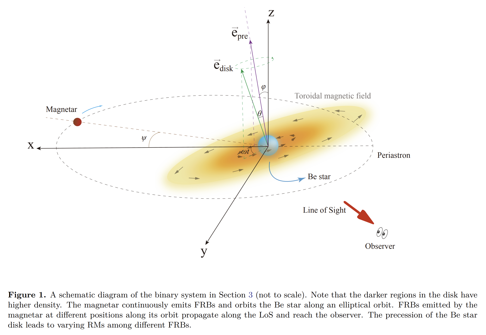

   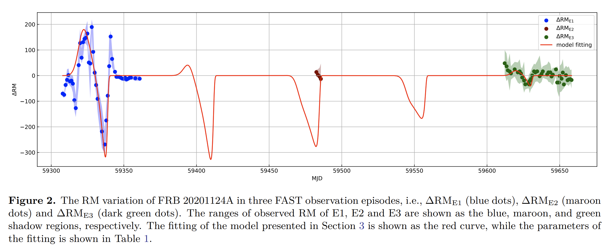

8. [Super-resolving Herschel - a deep learning based deconvolution and denoising technique](https://arxiv.org/abs/2512.13353)

   > Radio, Deep Learning

   使用Spitzer 24 μm 与 SPIRE 多波段图像作为输入，使用Swin-Unet进行图像降噪。

   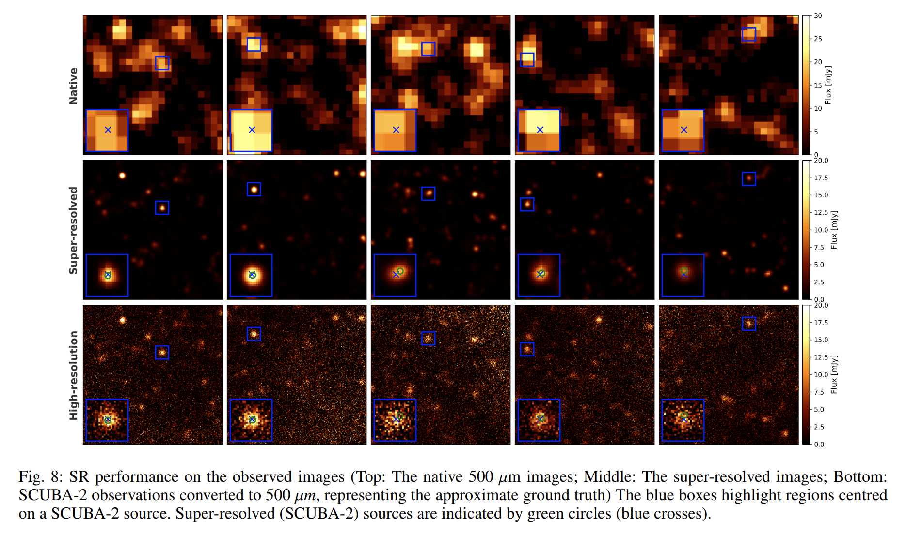

9. [Multiband neural network classification of ZTF light curves as LSST proxies](https://arxiv.org/abs/2512.13395)

   > Light Curve, Deep Learning

   使用ZTF的g和r波段的光变曲线，经过相位折叠后画图，作为输入，加上周期等数值特征作为额外输入，对 5 类变星（经典 / Ⅱ型造父变星、δ Scuti、食双星、RR Lyrae）进行监督学习。在验证集上达到 ~95.6% 的准确率。

   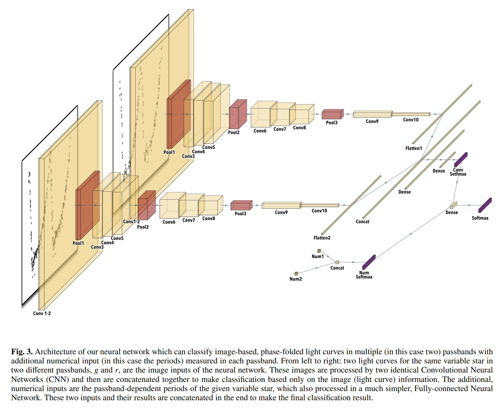

10. [Unveiling the white dwarf in the eclipsing polar HU Aquarii](https://arxiv.org/abs/2512.13489)

    > White Dwarf, Observation

    极向星是没有吸积盘的磁性 CV 系统，吸积物质沿磁场直接落在白矮星表面。HU Aqr 是一颗亮且被广泛研究的食极向星，而在以往高 / 中吸积态下，强烈的吸积辐射会掩盖白矮星本体。

    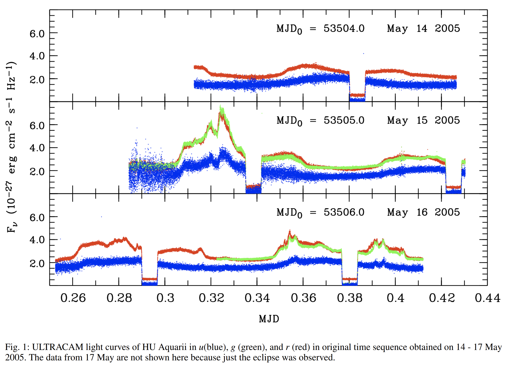

    利用 VLT 上的 ULTRACAM 在 HU Aquarii （轨道周期0868203980天）低吸积态时获得的 u、r 双波段高速测光数据，第一次清晰测量到其白矮星食的各个接触点，精确测得白矮星质量和轨道倾角。

11. [Identification of periodicities with arbitrary shapes in AGN light curves](https://arxiv.org/abs/2512.13688)

    > Light Curve, Gaussian Process, Periodicity, Method

    MBHB（超大质量黑洞双星）在 AGN 里可能通过多种机制

    - circumbinary 盘间歇供给 → 类“锯齿”或爆发型周期；
    - 多普勒增亮（尤其是圆轨道 + 恒定吸积）→ 近似正弦；
    - 互相的引力透镜 → 尖锐的周期性峰值。

    产生光变周期，除了最理想的多普勒增亮场景，多数物理机制都不会给出简洁的正弦波，而是怪形状的周期。当前大多数搜索（尤其是巡天预选）都基于 Lomb–Scargle 周期图，本质假设信号像正弦，导致对复杂波形的周期检出率很差。

    用**通用周期核**来在 AGN 光变曲线中寻找任意形状的周期信号，相比 Lomb–Scargle 周期图和余弦核 GP，它能找回更多的周期信号，尤其是在锯齿形、对称爆发型等非正弦周期情况下。

## 2025-12-17

1. [Detection and characterisation of submm transient sources with a large single-dish telescope](https://arxiv.org/abs/2512.13924)

   > Transient, White Paper, Instrument

   综述了亚毫米波段暂现源（submm transients）的主要种类和科学价值，包括

   银河内

   - 爆发恒星（flaring stars），典型持续时间 < 3 天
   - 原恒星/原行星盘，因吸积率变化出现月–年的亮度变化
   - 行星/小行星等太阳系天体，在亚毫米波段表现为快速移动的暂现源

   河外

   - GRBs、超新星（SNe）、潮汐撕裂事件（TDEs）、fast blue optical transients（FBOTs）、变源 AGN 等，光变时间尺度多为周–月，在 mm/submm 波段有重要诊断能力。

   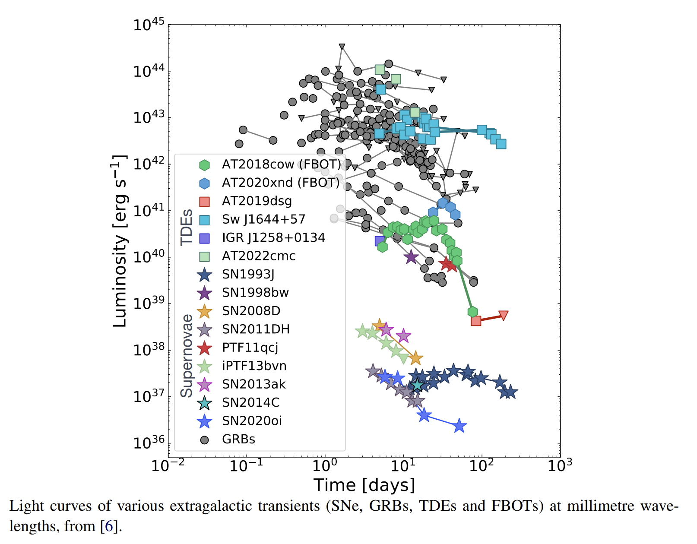

   讨论了现有/即将运行的 CMB 望远镜（如 ACT、SPT、Simons Observatory）在发现 submm 暂现源上的能力，并指出要进行深入表征和发现更暗弱的群体，需要一台大口径、视场大、频带宽的单碟望远镜。

2. [INTEGRAL IBIS catalog of magnetar bursts](https://arxiv.org/abs/2512.14356)

   > Magnetar, Catalog

   基于 INTEGRAL 卫星 IBIS 仪器 20 多年的存档数据，对 34 个磁星及候选体进行了系统搜索，构建了一个包含 1349 个爆发现象的磁星 burst 目录。

   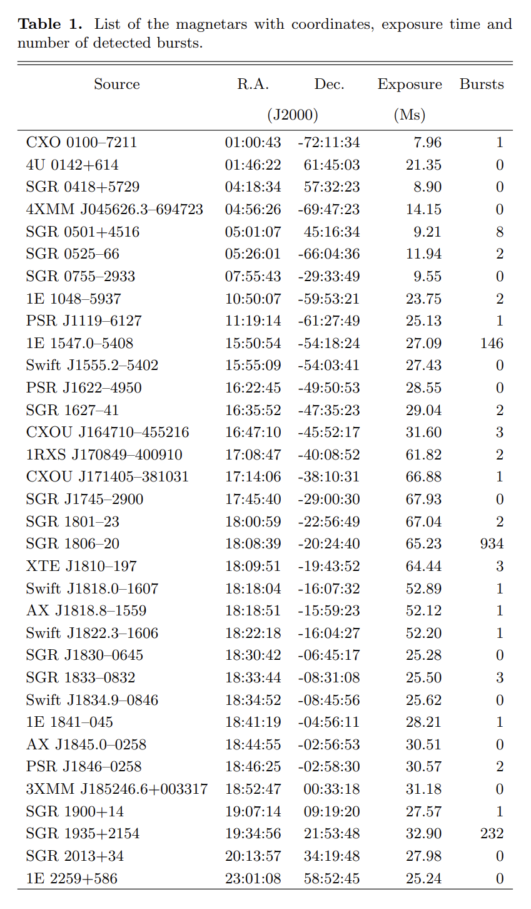

3. [Multi-messenger and time-domain astronomy in the 2040s](https://arxiv.org/abs/2512.14546)

   > Time Domain, Review, White Paper

   面向 2040 年代的多信使与时域天文学白皮书，评估 GW、中微子、电磁多波段等即将上线的重大设施，将如何构建一个高频率的多波段触发生态。

   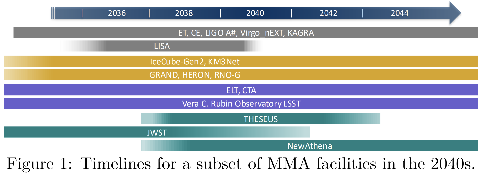

   ::: tip 按科学主题列出了 2040s MMA 要攻克的关键问题

   1. **Chemical Evolution & Nucleosynthesis**
      - 利用成百上千个 BNS/NSBH 事件的 GW 信息（率、质量分布、延迟时间）+ tens–hundreds 个 kilonova 的 UVOIR 光谱（Sr, Ce, Te 线等），
      - 追踪宇宙历史中 r 过程元素的产生，确定其中有多少来自致密并合而非其他途径。
   2. **Jet Physics**
      - GW 给出距离与倾角约束；
      - 光学–射电–TeV 的光变与偏振+高分辨成像给出喷流结构、Lorentz 因子、磁化程度、能量耗散位置等，
      - 从而区分不同喷流启动机制、检验中央引擎模型。
   3. **Cosmic Particle Acceleration**
      - 联合高能中微子+γ+射电/光学，锁定宇宙线加速器，区分 hadronic vs leptonic 渠道；
      - 研究喷流在宇宙反馈中的作用。
   4. **Stellar Evolution & Supernovae**
      - GW 合并率 + EM 宿主性质，约束双星演化路径；
      - 对于罕见的银河系核心坍缩 SN：GW 追踪内部非对称、ν 光曲线追踪核心条件、EM 追踪抛射物组成与激波传播。
   5. **Supermassive Black Holes and Cosmology**
      - LISA 提供合并 SMBH 的提前数周–数月预警，但定位仍是 10–1000 deg² 量级，需要大视场光学/近红外光谱巡天去找对应 AGN 变光；[arXiv](https://arxiv.org/pdf/2512.14546)
      - 大量明亮标准警报事件可将 H_0 和暗能量状态方程测到亚百分点精度，并利用 GW 传播性质测试修正引力；
      - 高能中微子的能量依赖到达时间还能强约束洛伦兹不变性。
   6. **Dense Matter EOS**
      - BNS / NSBH 并合中的潮汐形变、post-merger 振荡频率等，可精细约束致密物质 EoS，搜索从 hadronic 到夸克物质的相变迹象。

   :::

4. [Attention-Based Preprocessing Framework for Improving Rare Transient Classification](https://arxiv.org/abs/2512.14644)

   > Transient, Optical, Deep Learning

   光学暂现源样本不均衡（SN 有几千个，SLSN-I 只有 87 个，TDE 只有 64 个）、图像有坏点、大量前景背景源，导致CNN分类性能不行。

   这里通过ResNet挑出坏图像，用结构相似性（SSIM）修复，然后用阈值+DBSCAN保留瞬变源和它的宿主，把其他亮源和无关像素用噪声填充。通过三种方式补样本：使用GP建模光变曲线，移动到不同红移、光变+遮罩交叉配对、focal loss偏向稀有类别。来让CNN真正学会看暂现源。

   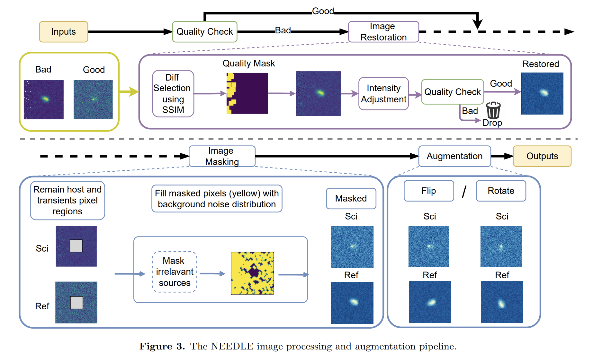

## 2025-12-18

1. [An updated efficient galaxy morphology classification model based on ConvNeXt encoding with UMAP dimensionality reduction](https://arxiv.org/abs/2512.15137)

   > Galaxy, Deep Learning

   科大搞的一个星系形态分类工具`USmorph`，这里改进了一下，把原来的 USmorph 无监督模块升级成“ConvNeXt特征提取 + UMAP降维”的两段式框架，用迁移学习获得更强的形态表征。

   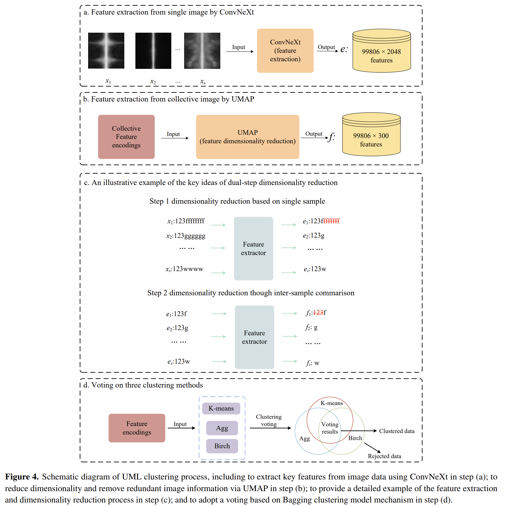

2. [Spectroscopic Alerts for the Time-Domain Era](https://arxiv.org/abs/2512.15555)

   > Time Domain, Spectrum

   未来 LSST 等巡天每年会产生1e9 级别的光变源告警，但全球光谱跟进能力只有1e4-1e5，存在巨大缺口。提出spectroscopic alerts（新发射/吸收分量、离化态快速变化、速度结构演化等）这一概念，即由光谱自身的实时演化来触发告警，让光谱本身成为发现通道，而不只是光度跟进工具。

3. [The Galactic White Dwarf Population](https://arxiv.org/abs/2512.14763)

   > White Paper, White Dwarf

   Gaia的白矮星普查揭示 HR 图中的复杂结构（如 A/B/Q 分支及其他异常序列），同时也暴露出大气成分、谱演化、结晶、磁场、并合通道等关键未解问题。要解读这些结构必须依赖高质量光谱来获得 Teff、log g 等，从而推导质量、冷却年龄、光度函数等基本量。

   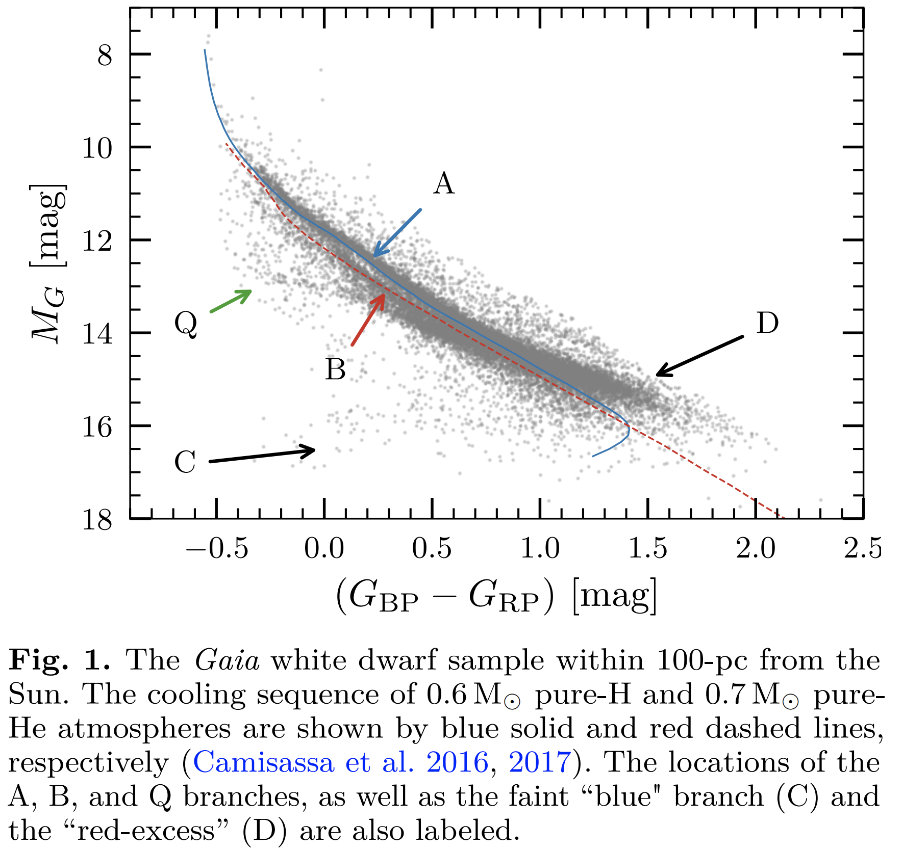

   文章提出需要大规模多目标巡天光谱能力：在 10–15m 级望远镜上做低分辨率 R~2000–5000 覆盖到 G~23–25，以及对更亮目标做高分辨率 R~10,000–40,000，以在几年时间里完成百万级样本的无偏光谱普查。

4. [White Dwarf Binaries: Probes of Future Astrophysics](https://arxiv.org/abs/2512.14800)

   > White Paper, White Dwarf

   白矮星双星可同时约束双星演化（共同包层、角动量损失）、低频引力波前景（双白矮主导的银河前景噪声）、以及 Ia 型超新星前身通道。

   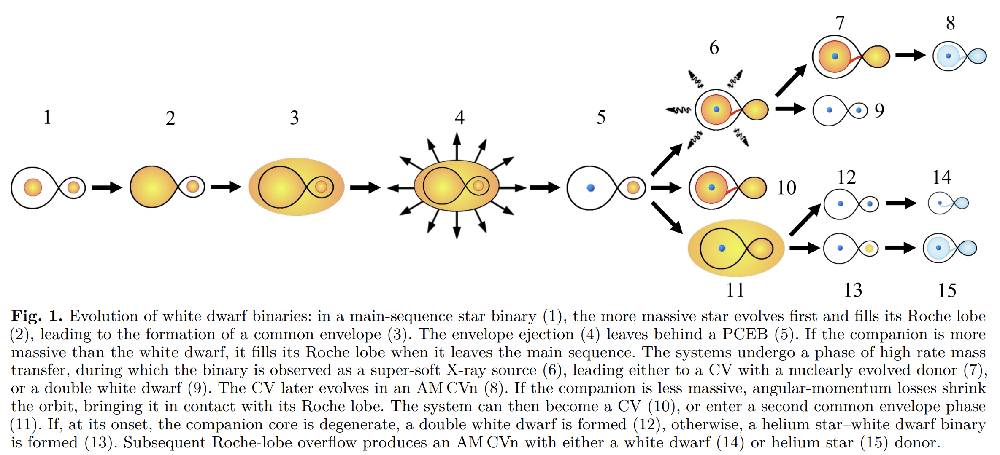

   对 LSST 发现且现有设施难以覆盖的紧致白矮双星（到 G<23）做系统的识别光谱与相位分辨（phase-resolved）观测，从而得到轨道周期、径向速度、质量等核心参数。

   文章给出明确技术需求：高复用（一次观测成千上万目标）、大口径 >8m、短曝光 1–5min 仍能 SNR≳5、低分辨率通道 R≈5000 且宽波段 300–2500nm、高分辨率通道 R>20,000 覆盖巴耳末系，并建议配备 IFU 用于环境/壳层结构研究。

## 2025-12-19

1. [Radio frequency interference identification using eigenvalue decomposition for multi-beam observations](https://arxiv.org/abs/2512.16278)

   > Radio, RFI

   `mRAID` 对多波束观测的互相关矩阵做特征值分解，用本征值结构来自动识别 RFI。

   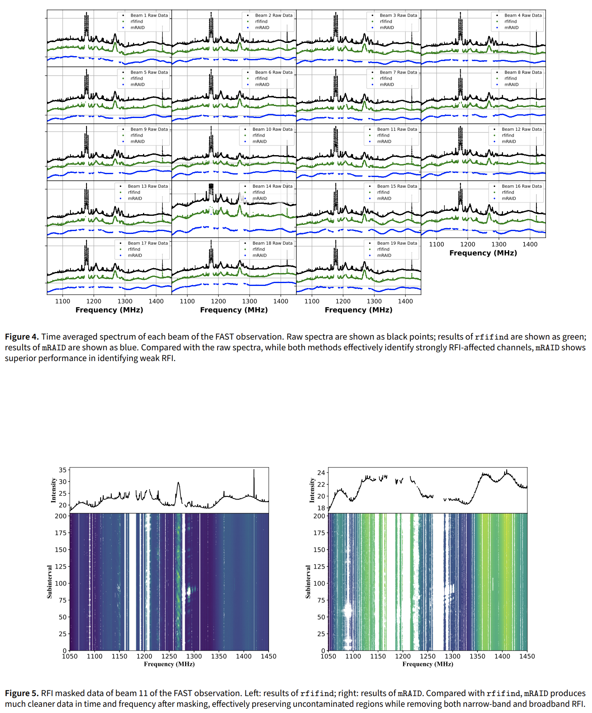

   首先为每个时间子积分和频道构造多束数据的互相关矩阵，然后对其进行特征值分解：若存在 RFI，占主导的本征模会显著偏离纯噪声的统计预期。通过对特征值谱设定阈值，该方法可以快速标记出受干扰的时间–频率单元。

2. [Inferring the Intrinsic Energy Function of FRB 20220912A](https://arxiv.org/abs/2512.16122)

   > Fast Radio Burst, Statistics

   研究FAST带宽选择效应对能量分布的影响。

   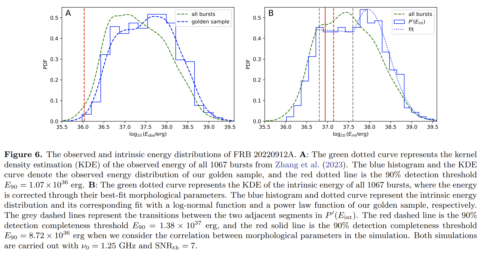

3. [Pulsar Science with the SKA Observatory](https://arxiv.org/abs/2512.16152)

   > Pulsar, SKA, White Paper

   SKA 脉冲星专题特刊的引言文章，概述 SKA-Low 和 SKA-Mid 望远镜的关键性能与观测模式。对特刊中 11 篇脉冲星科学论文逐一做了概览（致密物质状态方程、强场引力检验、引力波探测、星际介质与磁场、脉冲星风和高能物理等）。

## 2025-12-22

