## 2026-01-01

1. [Machine-learning approaches to dispersion measure estimation for fast radio bursts](https://arxiv.org/abs/2512.24003)

   > Fast Radio Burst, Deep Learning

   用CNN-LSTM从FRB的动态谱回归DM。

   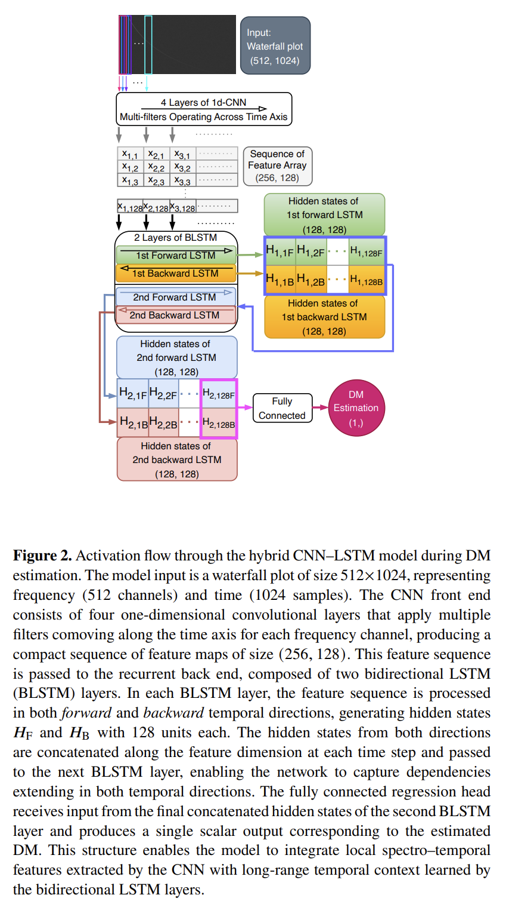

2. [Searching for Periodicity in FRB 20240114A](https://arxiv.org/abs/2512.24936)

   > Fast Radio Burst, Statistics, Periodicity

   对FRB20240114A事件最多的那天，3196个爆发序列找周期，没找到。

3. [Multi-Frequency Study of FRB20201124A with the uGMRT](https://arxiv.org/abs/2512.24978)

   > Fast Radio Burst, Observation

   uGMRT对FRB20201124A在2021年5月的观测，爆发在频段4（550-950 MHz）和频段5（1060-1460 MHz）中均被探测到，最后一次频段 5 爆发发生在5月24日，而频段4的活动持续到5月28日。 

   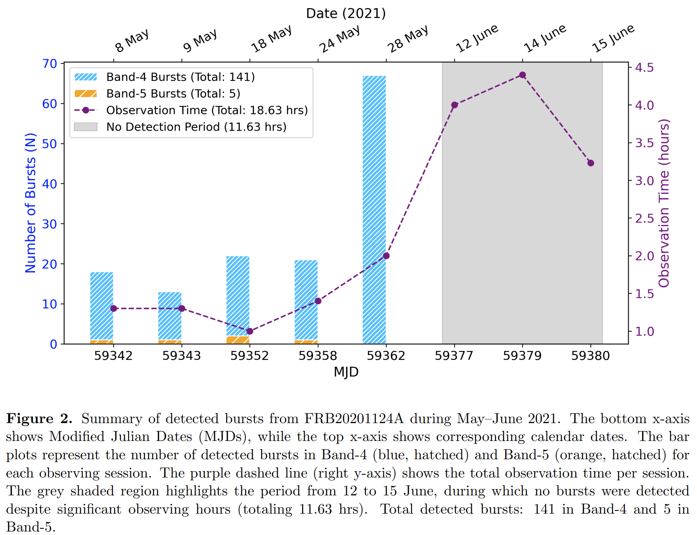

4. [AstroReview: An LLM-driven Multi-Agent Framework for Telescope Proposal Peer Review and Refinement](https://arxiv.org/abs/2512.24754)

   > Astronomy, LLM

   `AstroReview`多智能体审望远镜观测申请，按照三步（科学新颖性/价值、可行性/产出、元评审与可靠性核查），能以 87% 准确率识别真实被接收的 proposal。

   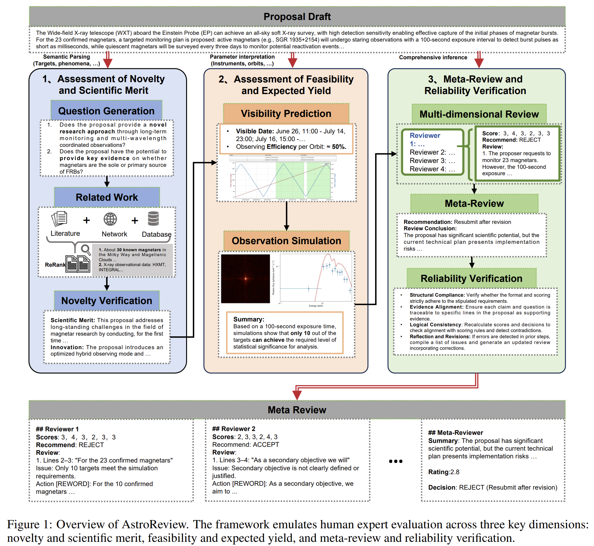

## 2026-01-02

今日停更

## 2026-01-05

1. [Covertly Active Comet (139359) 2001 ME1](https://arxiv.org/abs/2601.00060)

   > Comet, Observation

   作者把 SOHO 日冕仪在 2018-11-18 拍到的一颗“未知彗星”，追认成近地小行星 (139359) 2001 ME1，并指出它在近日点附近其实存在尘埃活动。

   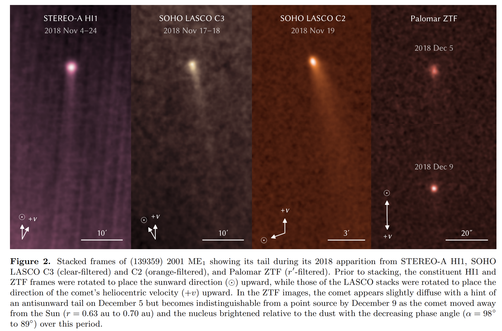

2. [Mass-loaded magnetic explosions in the context of Magnetar Giant Flares and Fast Radio Bursts](https://arxiv.org/abs/2601.00441)

   > Fast Radio Burst, Theory

   构建了一类“相对论、球对称、含质量负载（mass-loaded）的磁爆炸”自相似解，用来描述磁星附近的爆发现象。高密高压更像磁星巨耀斑、低质量负载更像与 FRB 相关的磁主导事件。

## 2026-01-06

1. [JWST observations of three long-period AM CVn binaries: detection of the donors and hints of magnetically truncated disks](https://arxiv.org/abs/2601.00945)

   > White Dwarf, JWST, Spectrum

   JWST/NIRSpec对三个长周期、掩星型AM CVn双星，Gaia14aae、SRGeJ0453和ZTFJ1637的高时间分辨率红外光谱观测结果，这些系统的轨道周期为 50-62 分钟。可能由白矮星磁场导致，并据此估计表面磁场强度约 30–100 kG。

2. [Website with interactive visualization of multivariate astronomical time series](https://arxiv.org/abs/2601.00975)

   > Time Series

   [voxastro](https://lc-dev.voxastro.org/)面向天文多波段光变曲线的交互式网站，主打海量光变数据的快速浏览、对比与解读。

   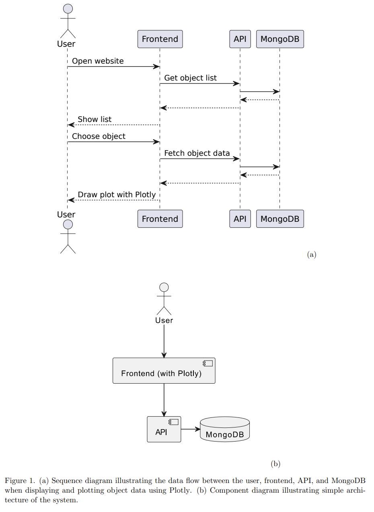

3. [Hunting for "Oddballs" with Machine Learning: Detecting Anomalous Exoplanets Using a Deep-Learned Low-Dimensional Representation of Transit Spectra with Autoencoders](https://arxiv.org/abs/2601.02324)

   > Exoplanet, Deep Learning

   用自编码器把透射光谱压缩到低维潜空间，并在这个潜空间里做异常检测，目标是找出“化学组成很不寻常”的系外行星大气（以 CO₂ 为例）。结论是在潜空间做异常检测几乎在所有噪声水平都更强。

   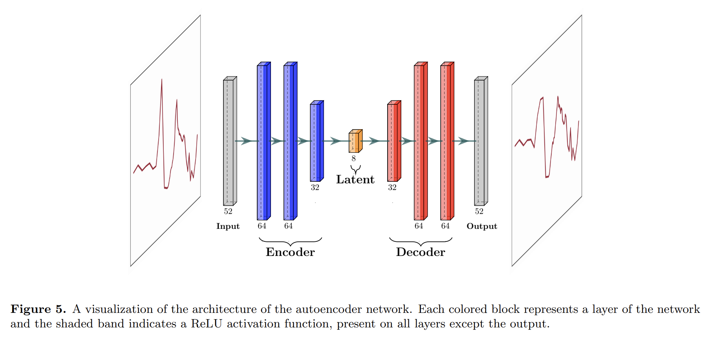

## 2026-01-07

1. [Super-Orbital Variations in Magnetar Rotation Measure Arising from the Precession of Companion Star: Implications for FRB 20220529](https://arxiv.org/abs/2601.02734)

   > Fast Radio Burst, Theory

   为解释 FRB 20220529 的 RM 强烈变化与部分翻转，提出伴星的自转轴/磁轴会围绕轨道轴发生进动，从而让观测到的RM出现超越轨道周期的超轨道(super-orbital)结构。

   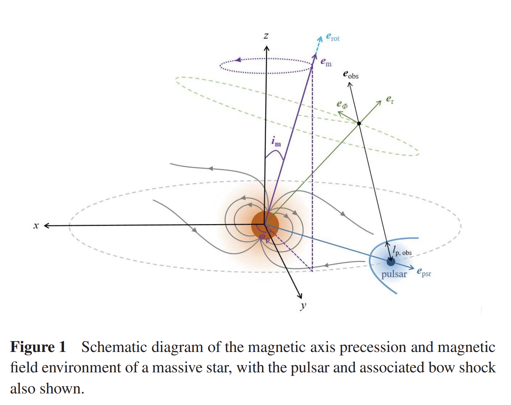

2. [Investigating the Anisotropy of Dispersion Measure Contribution from the Galactic Halo by Using Fast Radio Bursts](https://arxiv.org/abs/2601.02849)

   > Fast Radio Burst, DM

   把银河系晕（CGM/halo）对 FRB 的色散量贡献${\rm DM}_{\rm halo}(l,b)$用球谐展开表示，从而在全天空上直接重建其分布并检验各向异性。

   结果显示 DM_halo 存在显著偶极各向异性：指向约$l=130^\circ, b=+5^\circ$ 且该方向 ${\rm DM}_{\rm halo}(l,b)\approx63\pm9{\rm pc /cm^3}$，比全天平均高约$2.6\sigma$。
   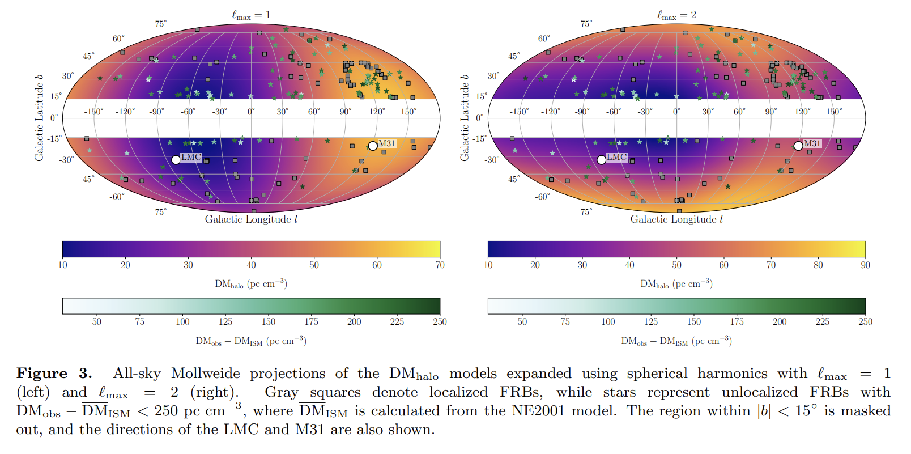

3. [Predictability of bursts of a recurrent nova using topological data analysis and machine learning](https://arxiv.org/abs/2601.02403)

   > Supernovae, Machine Learning

   把 RS Ophiuchi（RS Oph）的光变曲线切成固定长度的时间窗，并按**爆发前一年/爆发后衰减期/两次爆发之间**做监督标签。对每个时间窗，先用 **ordinal partition network** 做嵌入，再用扩散距离构造过滤，计算持久同调得到 persistence diagram，并做多种 TDA 特征化。

   发现 **persistence landscape** 表现最好：测试集平均准确率约0.846，且**爆发前**类召回率约 0.958，可用于判断未来一年是否将爆发。

## 2026-01-08

1. [Evidence for a Damped Millisecond Quasi-Periodic Structure in a Fast Radio Burst](https://arxiv.org/abs/2601.03950)

   > Fast Radio Burst, Periodicity, Statistics

   非重复 FRB 20190122C中看到由8 个相隔约1ms的子脉冲（1kHz的QPO）组成的脉冲列，并且从最亮分量之后振幅呈指数衰减。将其解释为磁层阻尼振荡（如 Alfvén 波相关过程），据此估算表面磁场约$10^{12}G$、特征自转周期约1s，并认为“无频漂 + 指数阻尼”不支持并合驱动起源。

   

2. [MARVEL: A Multi Agent-based Research Validator and Enabler using Large Language Models](https://arxiv.org/abs/2601.03436)

   > Astronomy, LLM

   大型科学合作（以 LIGO/引力波为例）会产生海量、格式多样的资料（论文、技术文档、博士论文、电子 logbook 等），知识分散导致重复劳动与检索困难。

   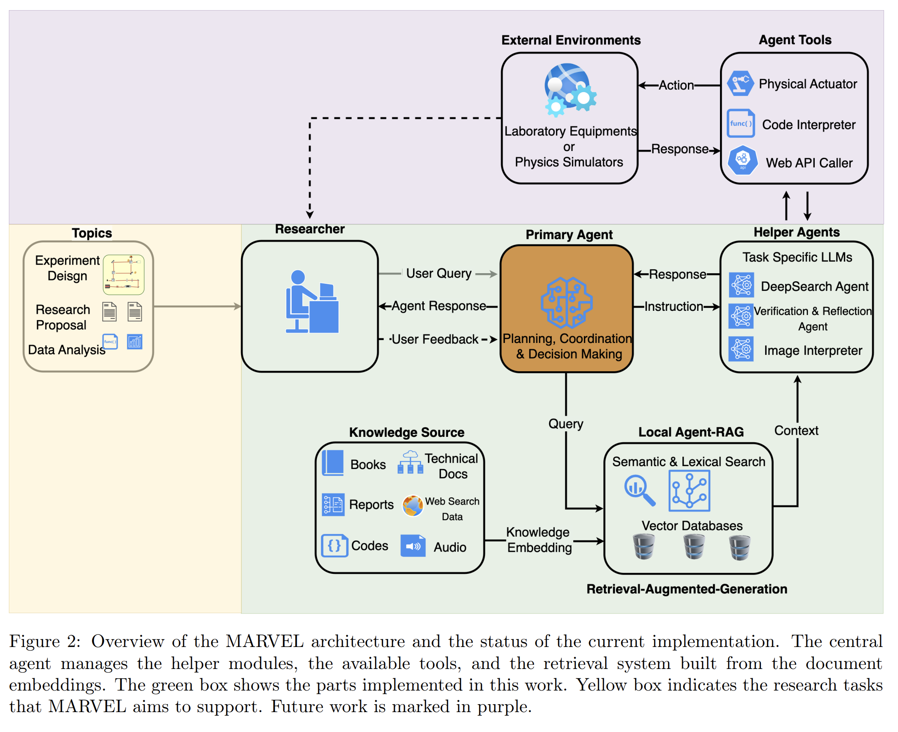

   [MARVEL](https://ligogpt.mit.edu/marvel/)用一个中央协调 agent + 多个 helper agents 的方式组织工作流。先做意图识别/必要澄清，再决定用哪些数据源与工具检索、重排、核验、生成报告。

## 2026-01-09

1. [Studies in Astronomical Time Series Analysis: The Double Lomb-Scargle Periodogram and Super Resolution](https://arxiv.org/abs/2601.04552)

   > Time Series, Periodicity, Method

   [double_periodogram](https://github.com/swagner-astro/double_periodogram)实现了一个双频（多频）Lomb–Scargle，用来处理由两个（或更多）独立正弦分量构成的时间序列模型。

   **超分辨率**部分展示了当两条频率分量非常接近、单频 periodogram 无法分开时，双频框架仍可能把它们区分开；并提示要实现这种效果，需要对双频网格进行足够的过采样。

   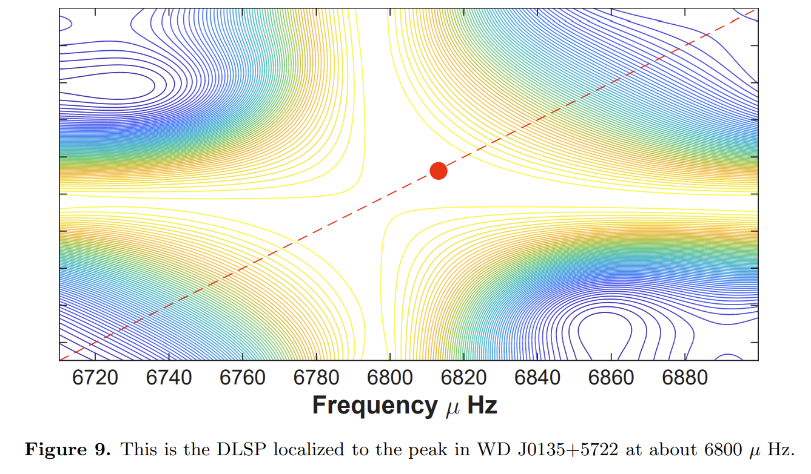

## 2026-01-12

1. [I can see your halo: Constraining the Milky Way halo DM with FRB population studies](https://arxiv.org/abs/2601.05496)

   > Fast Radio Burst, Galaxy, DM

   用98个高银纬（>20）的FRB，以及其中32个相关的红移，来约束银晕贡献的DM。 

   在统计框架下同时拟合银晕DM和若干未知的FRB种群参数（如宿主DM分布、能量函数、谱指数、随宇宙演化等），并用MCMC做全似然推断，给出平均银晕DM=68，且没有证据明显偏向某个特定的晕模型。

   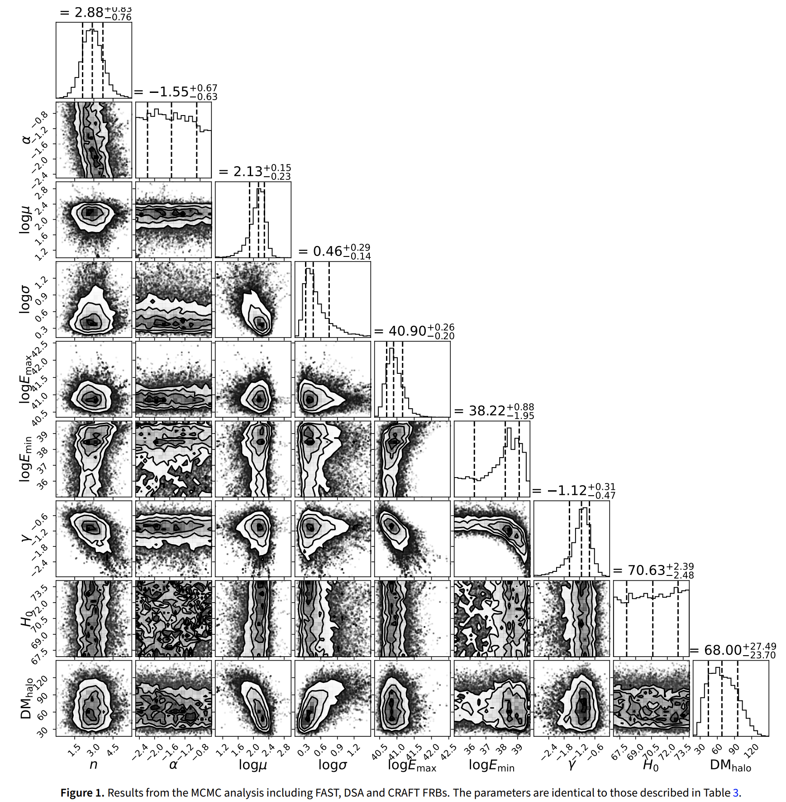

2. [GALFITools: A Python library to enhance GALFIT usage in galaxy image modeling](https://arxiv.org/abs/2601.05291)

   > Astronomy, Software, Galaxy

   [GALFITools](https://github.com/canorve/GALFITools)一个围绕经典星系拟合软件GALFIT的 Python 工具库，用来把跑 GALFIT 前后的杂活自动化。

## 2026-01-13

1. [VLBI Observations of SN 2012au Reveal a Compact Radio Source a Decade Post Explosion](https://arxiv.org/abs/2601.06278)

   > Radio, Supernovae

   VLBI 在核心坍缩后8–13 年对 SN 2012au （ra=12h54m52.18s, dec=-10d14m50.2s）做了高角分辨率射电观测，发现了一个致密射电源，符合十年尺度的PWN的模型。搜了FRB，没找到。

   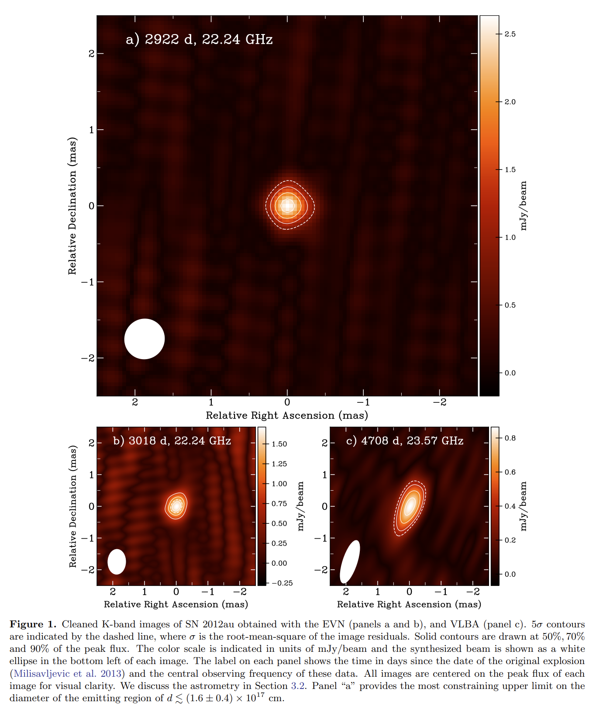

2. [Brahe: A Modern Astrodynamics Library for Research and Engineering Applications](https://arxiv.org/abs/2601.06452)

   > Astronomy, Satellite, Software

   [brahe](https://github.com/duncaneddy/brahe)一个现代开源轨道动力学库，计算卫星轨道，实现包括大气阻力、太阳光压、日月三体摄动、以及 SGP4 在内的常用传播与力模型。

3. [The Energy-Duration Relationship in Astrophysical Self-Organized Criticality Systems](https://arxiv.org/abs/2601.06277)

   > Astronomy, Statistics, SOC

   在标准FD-SOC假设下，SOC系统中，事件的持续时间与能量的关系$T\propto E^{0.8}$。文献中这一关系幂律指数的弥散主要来自时间跨度不足导致的截断偏差与小样本系统误差，而不是物理机制本身不同，并给出k与持续时间动态范围$q_T=\log(T_{\rm max}/T_{\rm min})$的经验关系来解释这种偏差。

4. [Isochrone Fitting of Galactic Globular Clusters -- VII. NGC1904 (M79), NGC4372, and revision of NGC288, NGC362, NGC5904 (M5), NGC6205 (M13), and NGC6218 (M12)](https://arxiv.org/abs/2601.07555)

   > Stellar, Statistics

   使用[DSED](https://rcweb.dartmouth.edu/stellar/)和[BaSTI](http://basti-iac.oa-abruzzo.inaf.it/isocs.html)的等龄线拟合了星团的各种颜色-星等图（CMD）。

## 2026-01-14

1. [Evaluating the effectiveness of radio frequency interference removal algorithms for single pulse searches](https://arxiv.org/abs/2601.08351)

   > Radio, RFI, Transient

   测试不同RFI消除方法对单脉冲搜索的影响。

   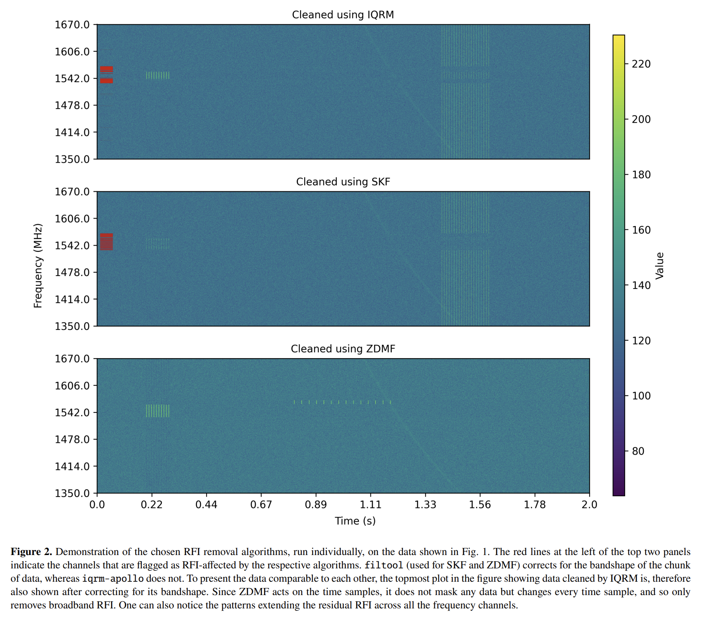

2. [Quantifying Symmetry: Transformation Information for Planetary Nebulae and Supernova Remnants](https://arxiv.org/abs/2601.07913)

   > ISM, Method

   对行星状星云和超新星遗迹的图像，旋转不同角度计算KL散度，量化对称性。展示该分数能把 Ia 型与核坍缩遗迹在 X 射线样本上分成不同族群。

   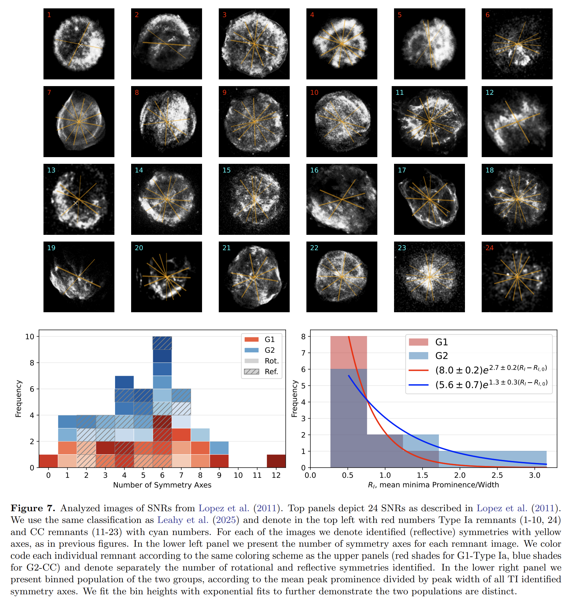

3. [An eclipsing 8.56 minute orbital period mass-transferring binary](https://arxiv.org/abs/2601.07925)

   > White Dwarf, Binary, Light Curve

   在Gaia 白矮星候选的ATLAS光变中做周期搜寻，发现一颗极端超短周期（8.56分钟）的食双星质量转移系统，ATLAS J1013−4516（AM CVn 类）。

   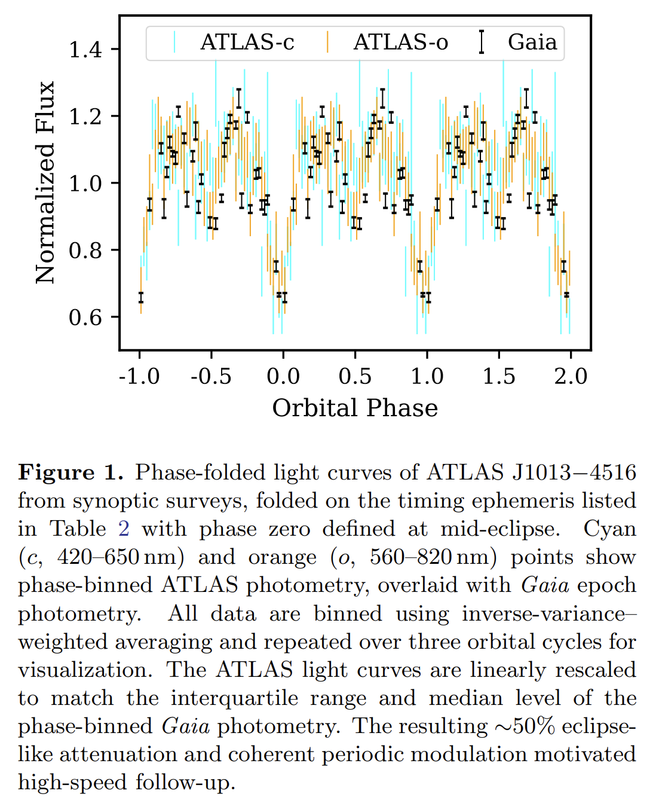

## 2026-01-15

1. [The Second CHIME/FRB Catalog of Fast Radio Bursts](https://arxiv.org/abs/2601.09399)

   > Fast Radio Burst, Catalog

   [CHIME Catalog2](http://www.chime-frb.ca/catalog2) 在 2018-07-25 到 2023-09-15 期间观测到的 **4539** 个 FRB 事件（来自 **3641** 个源，其中 **83** 个已知重复源贡献 **981** 次爆发）。

## 2026-01-16

1. [CLiMB: A Domain-Informed Novelty Detection Clustering Framework for Scientific Discovery](https://arxiv.org/abs/2601.09768)

   > Astronomy, Machine Learning

   [CLiMB](https://github.com/LorenzoMonti/CLiMB)先用受约束的 K-Bound 把已知类稳稳“钉住”，再对剩余未分配数据用密度聚类去挖掘任意形状的新簇。在 Gaia DR3 的 RR Lyrae 银河考古数据上，他们报告了已知结构恢复的 ARI=0.829，且在“清理”已知结构后识别出 Shiva、Shakti 与 Galactic Disk 等特征。

   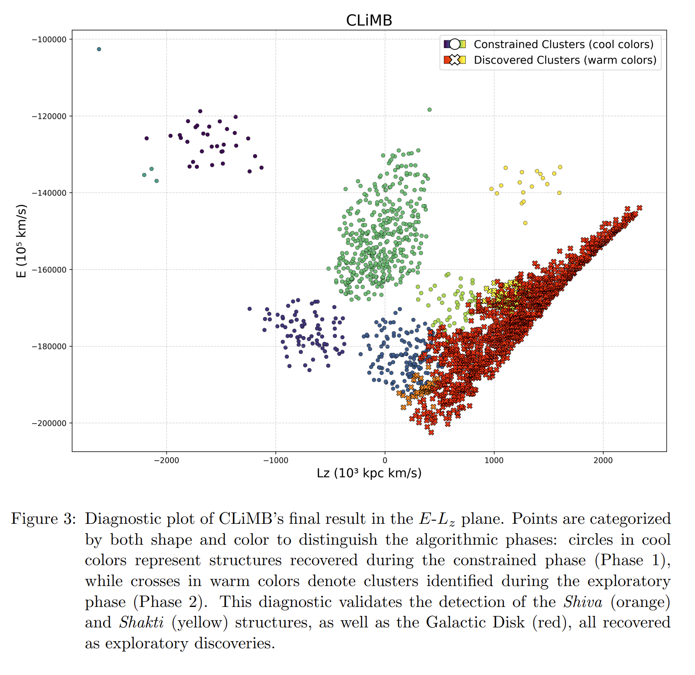

2. [What Understanding Means in AI-Laden Astronomy](https://arxiv.org/abs/2601.10038)

   > Astronomy, Machine Learning

   强调天文学的知识生产很大程度受观测创新与数据获取瓶颈牵引，单靠对既有数据做更强的计算推理，很难自动推出新的基础物理。

3. [A Highly Magnetic Ultra Massive White Dwarf with a 23-minute Rotation Period](https://arxiv.org/abs/2601.10188)

   > White Dwarf, Observation

   对TMTS J00063798+3104160 (J0006)的光学观测，是自转周期为23分钟的白矮星。

   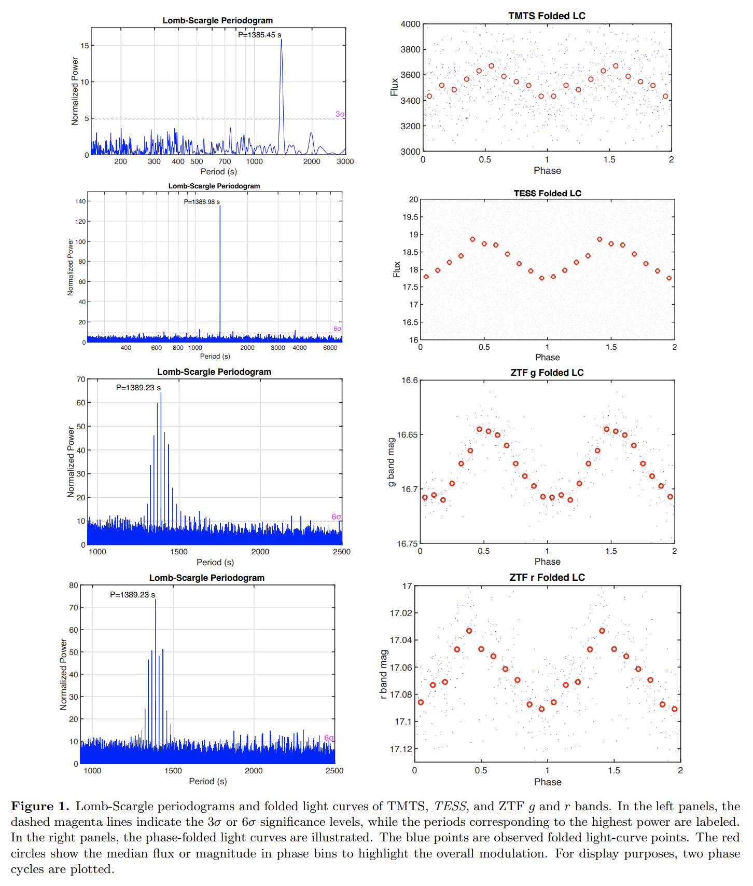

4. [Long Period Transients (LPTs): a comprehensive review](https://arxiv.org/abs/2601.10393)

   > LPT, Review

   对长周期暂现源的综述：LPT是秒到分钟级的周期性射电爆发，周期从分钟到小时，强偏振且活动具有间歇性，并指出目前已识别约 12 个此类源。

   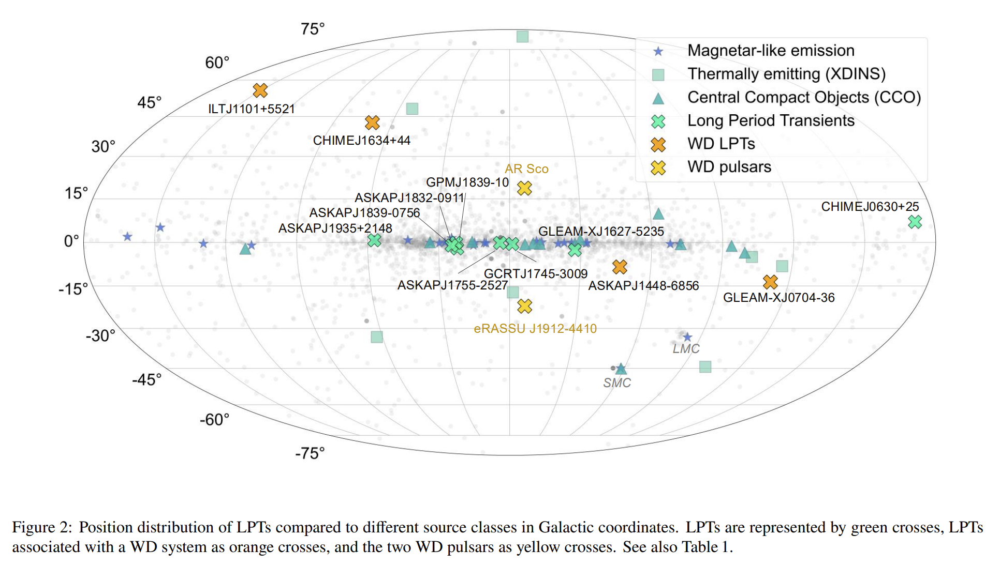

## 2026-01-19

