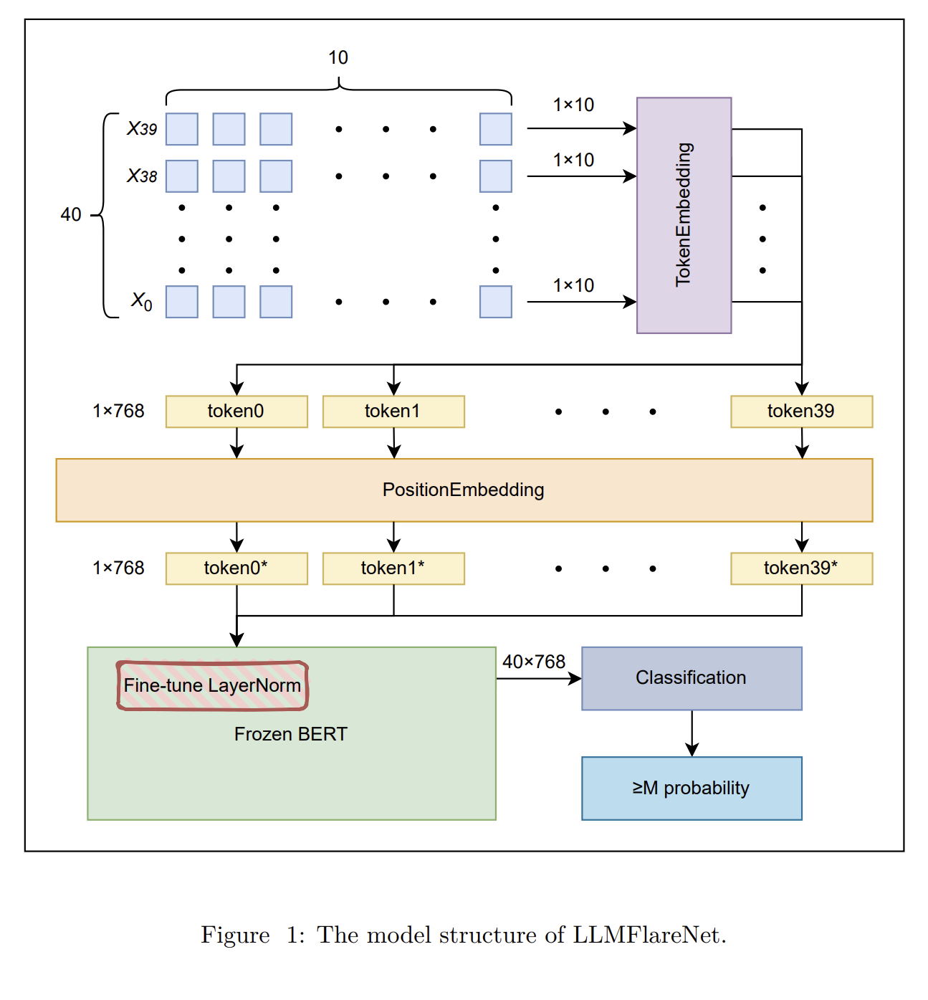
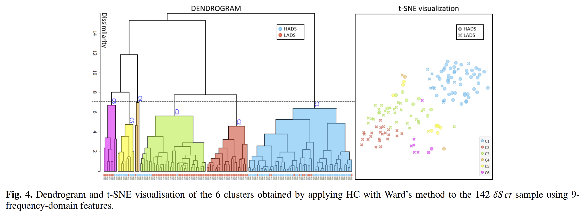
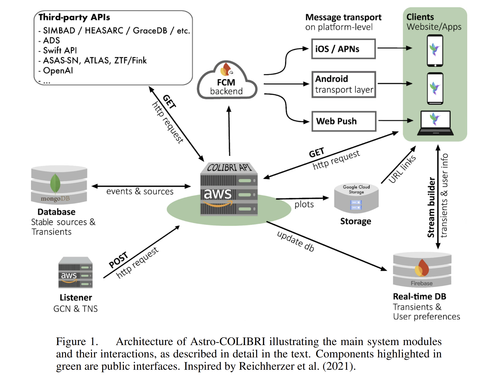
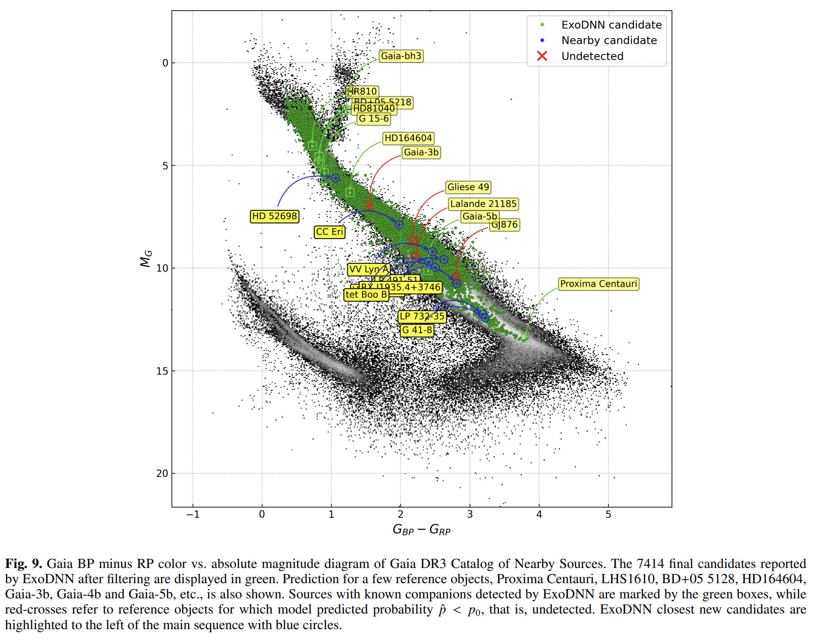
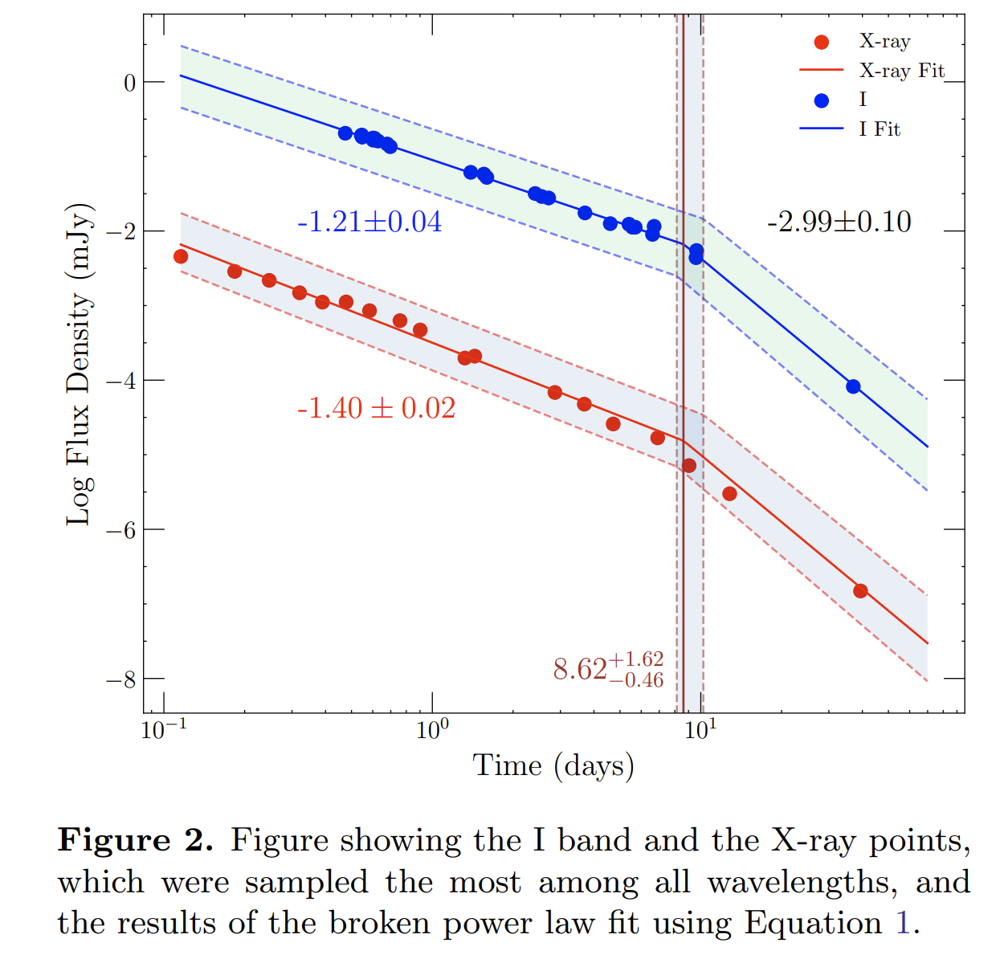

## 2026-02-02

1. [Operational Solar Flare Forecasting System Using an Explainable Large Language Model](https://arxiv.org/abs/2601.22811)

   > Solar Flare, LLM

   `LLMFlareNet`把预训练语言模型当作通用的序列计算引擎来处理非语言时间序列。

   数据来自 SDO/HMI 的 SHARP 产品，输入是每个活动区在过去 24 小时内的 10 个物理特征参数序列；他们每 36 分钟取一个样本，所以 24 小时对应 40 个时间步，每个时间步是 10 维特征。

   模型结构上，先用 TokenEmbedding（Conv1D）把每个时间窗映射到 768 维 token，再加 PositionalEmbedding 保留顺序，然后把整段 token 序列送入冻结的 BERT，最后把输出展平接线性层加 Sigmoid 得到**≥M 级耀斑发生概率**。

   

## 2026-02-03

1. [Machine learning for understanding pulsating stars I: the non-linear phenomenon in δ Scuti stars](https://arxiv.org/abs/2602.01344)

   > Variable, Stellar, Machine Learning

   使用 Ward 链接法的层次聚类（HC），来分析由 CoRoT、Kepler 和 TESS 等空间望远镜观测的142颗 $\delta$ Scuti 星样本。关注频域特征，包括基频和泛音模式，以及谐波、和频和差频等非线性特征.

   聚类过程的结果表明，当前的基于振幅的分类（HADS/LADS）与使用频域特征识别的聚类存在部分一致性。然而，该研究发现了额外的子群，表明存在更多非线性效应，这些效应无法仅通过振幅来捕捉。

   

2. [Astro-COLIBRI: An Innovative Platform for Real-Time Multi-Messenger Astrophysics](https://arxiv.org/abs/2602.02058)

   > Astronomy, Transient, Software

   [Astro-COLIBRI](https://astro-colibri.com/)面向时域与多信使天体物理的实时事件汇聚与随访决策平台。把来自多种告警流的事件统一格式化，按用户订阅规则过滤并推送，同时给出每个事件的上下文信息、可视化与观测条件评估。

   

3. [X-ray counterparts to stellar MeerKAT Galactic-plane compact radio sources](https://arxiv.org/abs/2602.02054)

   > Radio, High Energy

   把 MeerKAT 银盘面致密射电源与 ROSAT 全天巡天和 eROSITA eRASS1 的软 X 射线星表做交叉匹配，找出同时有射电与 X 射线辐射的恒星样本。

   识别出 137 个同时被射电与 X 射线探测到的恒星源，整体样本位于经典 Güdel–Benz 关系下方，提示该关系更像上包络线，并且频率差异导致的射电增强会显著影响偏离程度。

## 2026-02-04

1. [ExoDNN: Boosting exoplanet detection with artificial intelligence. Application to Gaia Data Release 3](https://arxiv.org/abs/2602.02910)

   > Stellar, Deep Learning, Binary

   用 Gaia DR3 的天体测量拟合质量统计量作为输入，训练了一个监督学习的深度神经网络 ExoDNN，用来识别**单星解不合适，可能存在未分辨伴星**的源。

   

2. [Line-Intensity Mapping](https://arxiv.org/abs/2602.03011)

   > ISM, Cosmology, Review

   关于线强度映射 LIM 的长篇综述，系统梳理 LIM 的基本框架，科学问题谱系，信号建模与统计量，以及数据分析方法。总结了可用的谱线示踪物与物理起源，讨论了包括 21 cm，CO，[CII]，Lyα 等在不同红移区间的可观测性与科学产出，并强调与其他巡天的交叉相关潜力。

   

## 2026-02-05

1. [An Afterglow Study of the "New Year's Burst" GRB 220101A](https://arxiv.org/abs/2602.04660)

   > GRB, Statistics

   结合从软 X 射线到 6 GHz 的多波段数据，对 GRB 220101A进行了详细的宽波段余辉研究。X射线与光学余辉在约9天出现明显折点，折点后的衰减斜率接近3.0，属于已知长暴里非常陡的折后衰减之一。暗示了标准模型存在问题或 GRB 爆炸的可能空腔。

   

## 2026-02-06

1. [First Detailed MeerKAT Imaging Spectroscopy of a Solar Flare](https://arxiv.org/abs/2602.05282)

   > Solar Flare, Radio, Observation

   用 MeerKAT 对一次 GOES M1.3 级太阳耀斑做了高保真射电成像光谱观测，在分米波段同时看清强相干爆发和较弱的非相干辐射。

   

## 2026-02-09

