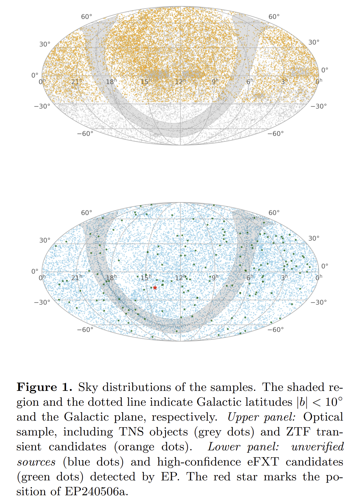
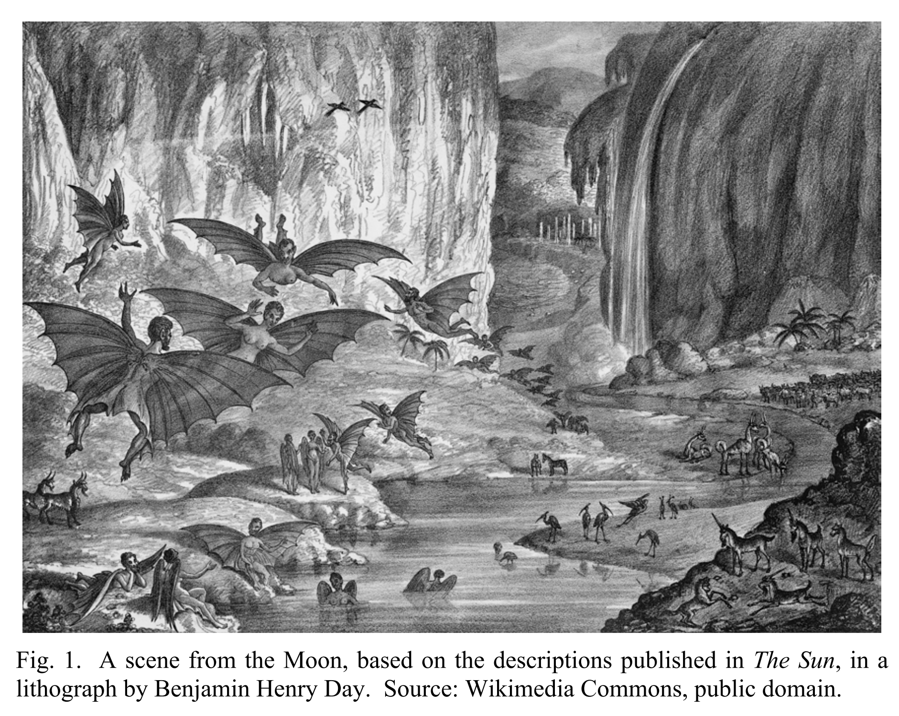
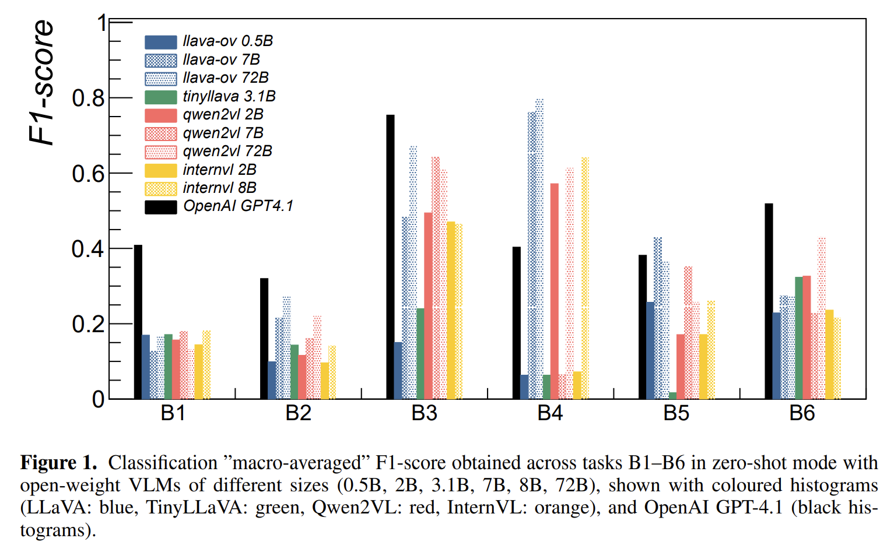
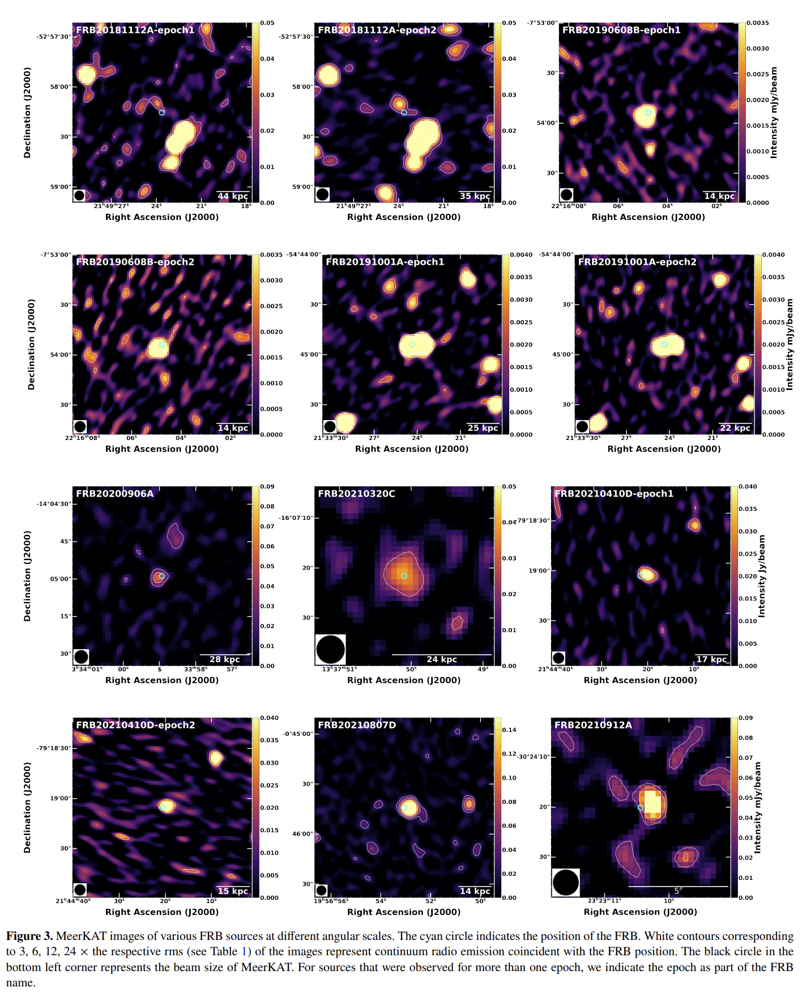
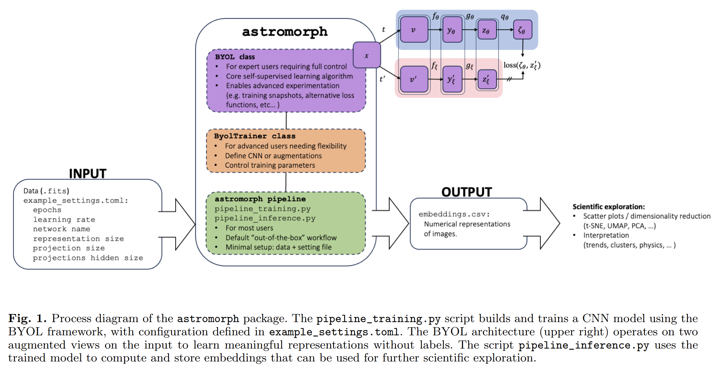
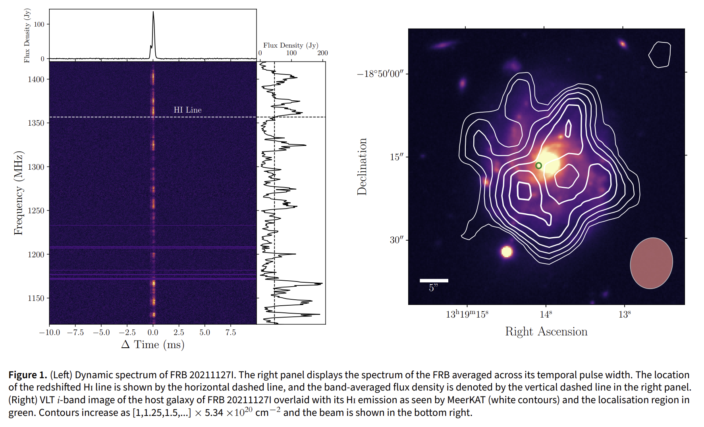
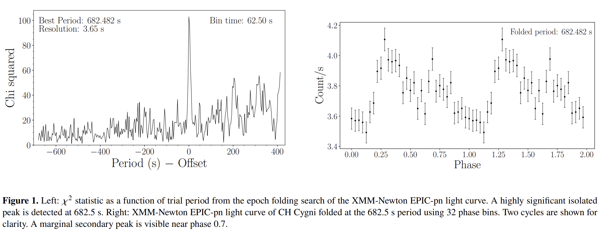
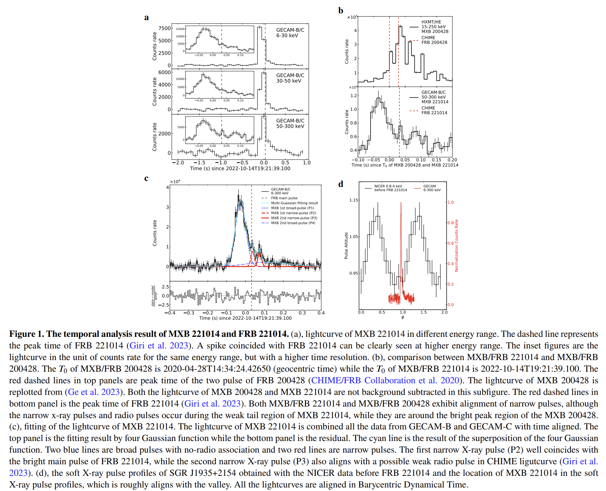
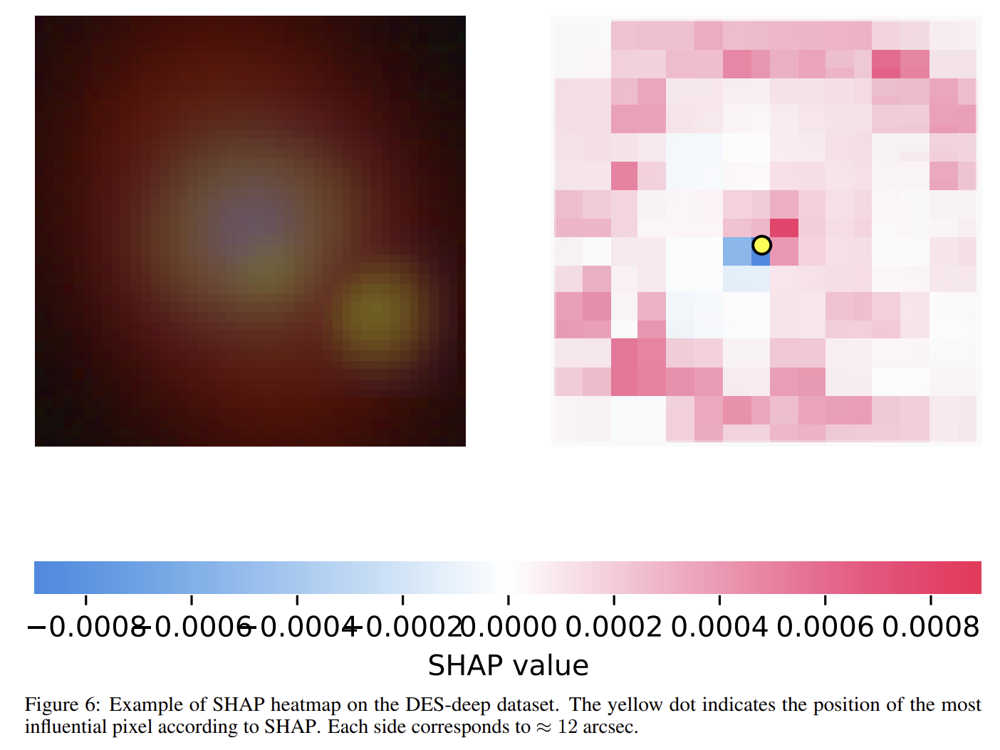
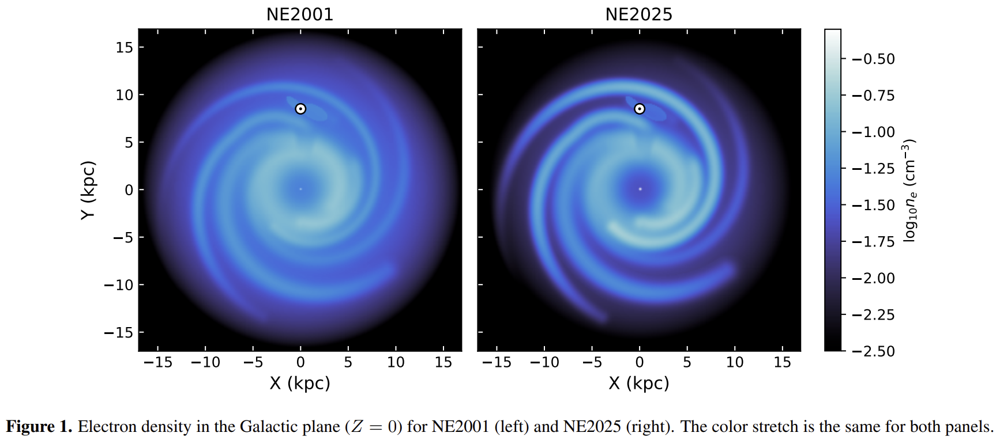

## 2026-02-02

1. [Operational Solar Flare Forecasting System Using an Explainable Large Language Model](https://arxiv.org/abs/2601.22811)

   > Solar Flare, LLM

   `LLMFlareNet`把预训练语言模型当作通用的序列计算引擎来处理非语言时间序列。

   数据来自 SDO/HMI 的 SHARP 产品，输入是每个活动区在过去 24 小时内的 10 个物理特征参数序列；他们每 36 分钟取一个样本，所以 24 小时对应 40 个时间步，每个时间步是 10 维特征。

   模型结构上，先用 TokenEmbedding（Conv1D）把每个时间窗映射到 768 维 token，再加 PositionalEmbedding 保留顺序，然后把整段 token 序列送入冻结的 BERT，最后把输出展平接线性层加 Sigmoid 得到**≥M 级耀斑发生概率**。

   

## 2026-02-03

1. [Machine learning for understanding pulsating stars I: the non-linear phenomenon in δ Scuti stars](https://arxiv.org/abs/2602.01344)

   > Variable, Stellar, Machine Learning

   使用 Ward 链接法的层次聚类（HC），来分析由 CoRoT、Kepler 和 TESS 等空间望远镜观测的142颗 $\delta$ Scuti 星样本。关注频域特征，包括基频和泛音模式，以及谐波、和频和差频等非线性特征.

   聚类过程的结果表明，当前的基于振幅的分类（HADS/LADS）与使用频域特征识别的聚类存在部分一致性。然而，该研究发现了额外的子群，表明存在更多非线性效应，这些效应无法仅通过振幅来捕捉。

   

2. [Astro-COLIBRI: An Innovative Platform for Real-Time Multi-Messenger Astrophysics](https://arxiv.org/abs/2602.02058)

   > Astronomy, Transient, Software

   [Astro-COLIBRI](https://astro-colibri.com/)面向时域与多信使天体物理的实时事件汇聚与随访决策平台。把来自多种告警流的事件统一格式化，按用户订阅规则过滤并推送，同时给出每个事件的上下文信息、可视化与观测条件评估。

   

3. [X-ray counterparts to stellar MeerKAT Galactic-plane compact radio sources](https://arxiv.org/abs/2602.02054)

   > Radio, High Energy

   把 MeerKAT 银盘面致密射电源与 ROSAT 全天巡天和 eROSITA eRASS1 的软 X 射线星表做交叉匹配，找出同时有射电与 X 射线辐射的恒星样本。

   识别出 137 个同时被射电与 X 射线探测到的恒星源，整体样本位于经典 Güdel–Benz 关系下方，提示该关系更像上包络线，并且频率差异导致的射电增强会显著影响偏离程度。

## 2026-02-04

1. [ExoDNN: Boosting exoplanet detection with artificial intelligence. Application to Gaia Data Release 3](https://arxiv.org/abs/2602.02910)

   > Stellar, Deep Learning, Binary

   用 Gaia DR3 的天体测量拟合质量统计量作为输入，训练了一个监督学习的深度神经网络 ExoDNN，用来识别**单星解不合适，可能存在未分辨伴星**的源。

   

2. [Line-Intensity Mapping](https://arxiv.org/abs/2602.03011)

   > ISM, Cosmology, Review

   关于线强度映射 LIM 的长篇综述，系统梳理 LIM 的基本框架，科学问题谱系，信号建模与统计量，以及数据分析方法。总结了可用的谱线示踪物与物理起源，讨论了包括 21 cm，CO，[CII]，Lyα 等在不同红移区间的可观测性与科学产出，并强调与其他巡天的交叉相关潜力。

   

## 2026-02-05

1. [An Afterglow Study of the "New Year's Burst" GRB 220101A](https://arxiv.org/abs/2602.04660)

   > GRB, Statistics

   结合从软 X 射线到 6 GHz 的多波段数据，对 GRB 220101A进行了详细的宽波段余辉研究。X射线与光学余辉在约9天出现明显折点，折点后的衰减斜率接近3.0，属于已知长暴里非常陡的折后衰减之一。暗示了标准模型存在问题或 GRB 爆炸的可能空腔。

   

## 2026-02-06

1. [First Detailed MeerKAT Imaging Spectroscopy of a Solar Flare](https://arxiv.org/abs/2602.05282)

   > Solar Flare, Radio, Observation

   用 MeerKAT 对一次 GOES M1.3 级太阳耀斑做了高保真射电成像光谱观测，在分米波段同时看清强相干爆发和较弱的非相干辐射。

   

## 2026-02-09

1. [An Archival Optical Counterpart Search for Extragalactic Fast X-Ray Transients Discovered by Einstein Probe](https://arxiv.org/abs/2602.06321)

   > High Energy, Multi Wavelength

   对EP的X射线暂现源找光学对应体。将EP240506a与光学暂现源AT 2024ofs关联起来，并用VLT光谱给出宿主星系红移 z≈0.12，同时结合多波段早期数据判断其光度与演化符合核坍缩超新星起源。

   

## 2026-02-10

1. [Imagining the Alien: Human Projections and Cognitive Limitations](https://arxiv.org/abs/2602.07284)

   > SETI

   回顾了人类长期以来对外星生命的想象史，指出这些形象往往来自地球生命形态与人类文化心理的映射。

   

   文中用多个案例说明这种映射如何在宗教叙事，伪发现与科幻母题中反复出现，并把它解释为个体与集体层面的认知局限。

   文章进一步讨论了更偏数据驱动的技术迹象搜索，以及快速演化的 AI 可能如何帮助我们减少人类中心偏差，从而改进对高级外星智能的设想与搜索策略。

2. [Toward Vision-Language Assistants for Radio Astronomical Source Analysis](https://arxiv.org/abs/2602.07469)

   > Radio, LLM

   测试开源与商用视觉语言模型在六个射电天文图像任务（弥散结构检测，形态分类，扩展射电星系识别，成像伪影检测，图像复杂度判别，以及 FR I 与 FR II 等射电星系形态二分类）上的零样本能力。

   结果表明，微调后做任务能力变强，但是导致多模态能力下降，纯视觉模型仍然显著更强。

   

3. [A MeerKAT search for persistent radio sources towards twenty-five localised Fast Radio Bursts](https://arxiv.org/abs/2602.07716)

   > Fast Radio Burst, PRS

   MeerKAT对25个定位FRB搜索PRS，在1.28GHz找到14个射电源，12个没有（其中一个观测3次，2次有，1次没有）。结合X射线数据，认为射电源更像恒星形成区，致密与否还需要更高分辨率的观测。

   

   目前有PRS的源有，FRB20121102A、FRB20190520B、FRB20190417A、FRB20240114A。另外，FRB20201124A的PRS亮度低，像恒星形成区。

## 2026-02-11

1. [astromorph: Self-supervised machine learning pipeline for astronomical morphology analysis](https://arxiv.org/abs/2602.09223)

   > Astronomy, Deep Learning

   [astromorph](https://github.com/onsala-space-observatory/astromorph)用BYOL自监督表征学习，把天文图像压缩到形态嵌入空间，从而支持相似样本检索、聚类和可视化探索。

   

2. [Talking with the Latents -- how to convert your LLM into an astronomer](https://arxiv.org/abs/2602.09670)

   > Astronomy, LLM

   LLM很难从恒星光谱直接推理。这里先用一个已经很擅长处理光谱的基础模型，把光谱压成一段高维 latent 特征，然后训练一个很轻量的MLP，把 2048 维的 latent 映射成 K 个伪 token 的 embedding，跟文字拼在一起，送进 LLM 生成答案。

   从巡天管线里拿到恒星参数（比如有效温度 Teff、表面重力 log g、金属丰度 [Fe/H]），把这些参数喂给 teacher（文中用 Gemini 2.5 flash 生成），让它以天文学家的口吻写一段不超过 50 词的描述；训练的 student 是 Llama 1B、Llama 8B、Qwen 32B 这些更小的 LLM，但它们在训练时并不是直接看参数，而是看由光谱基础模型从真实光谱提取出的 latent。

   

## 2026-02-12

1. [The indiscriminate adoption of AI threatens the foundations of academia](https://arxiv.org/abs/2602.10165)

   > Astronomy, LLM

   用vibe coding和多智能体式研究流程举例，强调速度提升背后会带来可解释性与可复现性下降，以及错误更难被发现的问题。

2. [Why do we do astrophysics?](https://arxiv.org/abs/2602.10181)

   > Astronomy, LLM

   在 LLM 能参与科研的背景下，写了一份白皮书来梳理天体物理学的目标、规范与价值。

   用一组“points of agreement”来回答“什么算天体物理”。核心标准很清晰：一个项目只要在研究宇宙时产出科学新颖性，也就是做出新的测量、新的解释或预测、方法改进、发现新对象，并且和现有文献里的重要问题发生联系，它就算“在做天体物理”。

3. [Constraining the Evolution of the HI Spin Temperature with Fast Radio Bursts](https://arxiv.org/abs/2602.10328)

   > Fast Radio Burst, Galaxy, HI

   用 FRB 作为背景光源搜索宿主星系的 HI 吸收线。

   

   用 ASKAP 的 FRB 20211127I 配合 MeerKAT 的 HI 发射观测做概念验证，给出积分光学厚度的上限，并据此得到 Tspin 的下限约 26 K。

4. [A 682-second X-ray Periodicity in CH Cygni: Evidence for a Magnetic White Dwarf](https://arxiv.org/abs/2602.10511)

   > White Dwarf, High Energy

   在 XMM Newton 的 X 射线光变中发现 CH Cyg 存在显著的 682.5 s 相干周期信号。文章把该周期解释为白矮星自转周期，从而为 CH Cyg 含磁白矮星提供直接证据，并指出它将成为继 R Aqr 之后第二个确认存在 X 射线脉动的共生星系统。

   

5. [GECAM discovery of the second FRB-associated Magnetar X-ray Burst from SGR J1935+2154](https://arxiv.org/abs/2602.10895)

   > Fast Radio Burst, Magnetar

   报告 GECAM 在 2022 年 10 月 14 日探测到来自 SGR J1935+2154 的一次明亮磁星 X 射线暴，并与 CHIME 和 GBT 记录到的 FRB 事件对应起来。

   

## 2026-02-14

1. [DeepRed: an architecture for redshift estimation](https://arxiv.org/abs/2602.11281)

   > Galaxy, Redshift, Deep Learning

   `DeepRed`用多种现代视觉网络从天文图像里直接回归红移，覆盖星系，引力透镜，引力透镜超新星等不同形态目标。还用 SHAP 做可解释性可视化与定量定位评估，验证模型关注区域与目标位置一致。

   

2. [NE2025: An Updated Electron Density Model for the Galactic Interstellar Medium](https://arxiv.org/abs/2602.11838)

   > ISM, Fast Radio Burst, Pulsar

   NE2005

   

## 2026-02-17

