## 2026-02-02

1. [Operational Solar Flare Forecasting System Using an Explainable Large Language Model](https://arxiv.org/abs/2601.22811)

   > Solar Flare, LLM

   `LLMFlareNet`把预训练语言模型当作通用的序列计算引擎来处理非语言时间序列。

   数据来自 SDO/HMI 的 SHARP 产品，输入是每个活动区在过去 24 小时内的 10 个物理特征参数序列；他们每 36 分钟取一个样本，所以 24 小时对应 40 个时间步，每个时间步是 10 维特征。

   模型结构上，先用 TokenEmbedding（Conv1D）把每个时间窗映射到 768 维 token，再加 PositionalEmbedding 保留顺序，然后把整段 token 序列送入冻结的 BERT，最后把输出展平接线性层加 Sigmoid 得到**≥M 级耀斑发生概率**。

   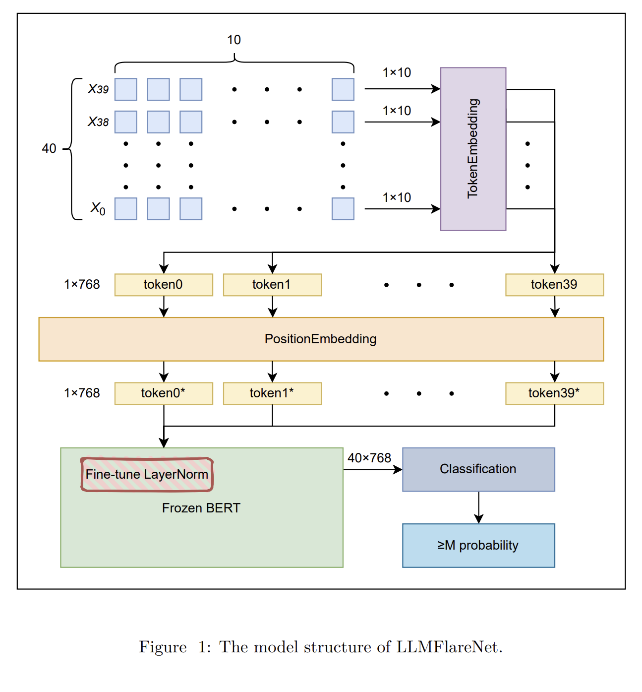

## 2026-02-03

1. [Machine learning for understanding pulsating stars I: the non-linear phenomenon in δ Scuti stars](https://arxiv.org/abs/2602.01344)

   > Variable, Stellar, Machine Learning

   使用 Ward 链接法的层次聚类（HC），来分析由 CoRoT、Kepler 和 TESS 等空间望远镜观测的142颗 $\delta$ Scuti 星样本。关注频域特征，包括基频和泛音模式，以及谐波、和频和差频等非线性特征.

   聚类过程的结果表明，当前的基于振幅的分类（HADS/LADS）与使用频域特征识别的聚类存在部分一致性。然而，该研究发现了额外的子群，表明存在更多非线性效应，这些效应无法仅通过振幅来捕捉。

   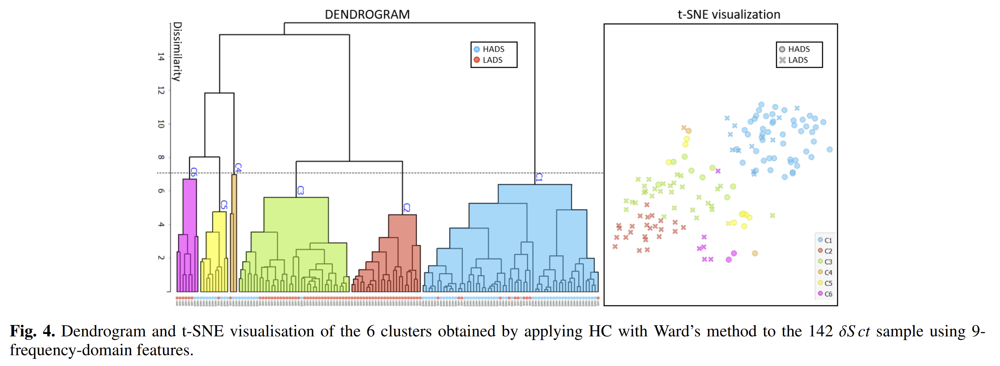

2. [Astro-COLIBRI: An Innovative Platform for Real-Time Multi-Messenger Astrophysics](https://arxiv.org/abs/2602.02058)

   > Astronomy, Transient, Software

   [Astro-COLIBRI](https://astro-colibri.com/)面向时域与多信使天体物理的实时事件汇聚与随访决策平台。把来自多种告警流的事件统一格式化，按用户订阅规则过滤并推送，同时给出每个事件的上下文信息、可视化与观测条件评估。

   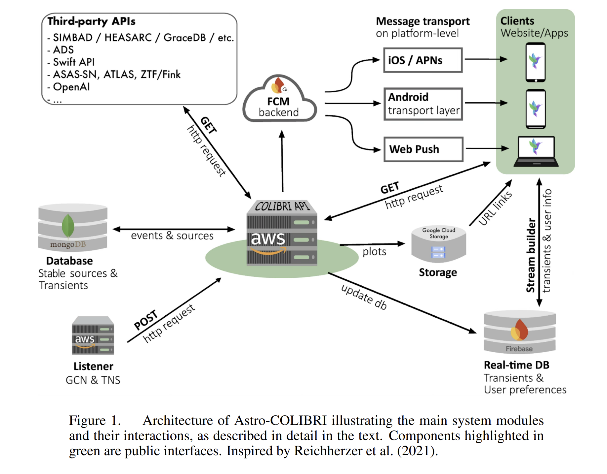

3. [X-ray counterparts to stellar MeerKAT Galactic-plane compact radio sources](https://arxiv.org/abs/2602.02054)

   > Radio, High Energy

   把 MeerKAT 银盘面致密射电源与 ROSAT 全天巡天和 eROSITA eRASS1 的软 X 射线星表做交叉匹配，找出同时有射电与 X 射线辐射的恒星样本。

   识别出 137 个同时被射电与 X 射线探测到的恒星源，整体样本位于经典 Güdel–Benz 关系下方，提示该关系更像上包络线，并且频率差异导致的射电增强会显著影响偏离程度。

## 2026-02-04

1. [ExoDNN: Boosting exoplanet detection with artificial intelligence. Application to Gaia Data Release 3](https://arxiv.org/abs/2602.02910)

   > Stellar, Deep Learning, Binary

   用 Gaia DR3 的天体测量拟合质量统计量作为输入，训练了一个监督学习的深度神经网络 ExoDNN，用来识别**单星解不合适，可能存在未分辨伴星**的源。

   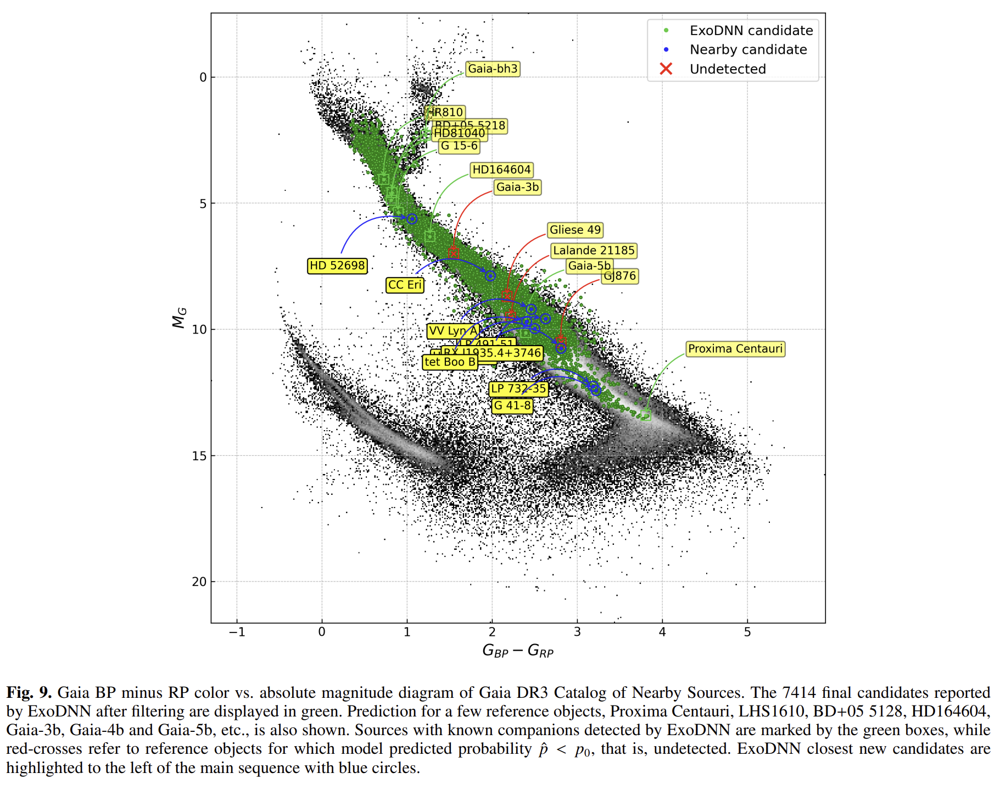

2. [Line-Intensity Mapping](https://arxiv.org/abs/2602.03011)

   > ISM, Cosmology, Review

   关于线强度映射 LIM 的长篇综述，系统梳理 LIM 的基本框架，科学问题谱系，信号建模与统计量，以及数据分析方法。总结了可用的谱线示踪物与物理起源，讨论了包括 21 cm，CO，[CII]，Lyα 等在不同红移区间的可观测性与科学产出，并强调与其他巡天的交叉相关潜力。

   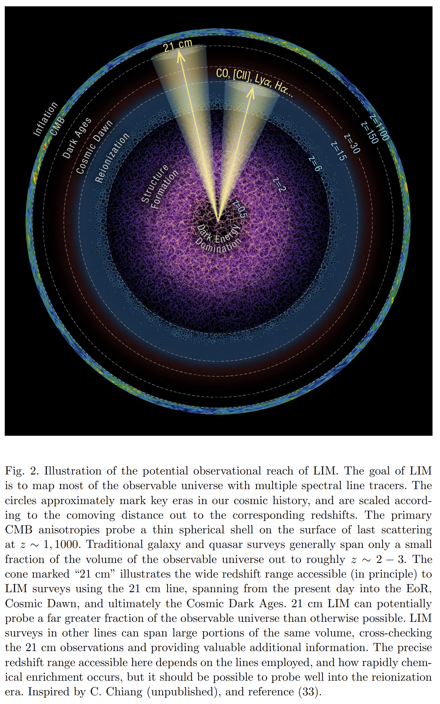

## 2026-02-05

1. [An Afterglow Study of the "New Year's Burst" GRB 220101A](https://arxiv.org/abs/2602.04660)

   > GRB, Statistics

   结合从软 X 射线到 6 GHz 的多波段数据，对 GRB 220101A进行了详细的宽波段余辉研究。X射线与光学余辉在约9天出现明显折点，折点后的衰减斜率接近3.0，属于已知长暴里非常陡的折后衰减之一。暗示了标准模型存在问题或 GRB 爆炸的可能空腔。

   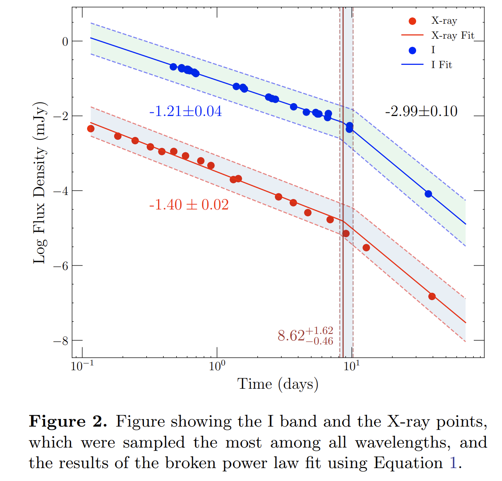

## 2026-02-06

1. [First Detailed MeerKAT Imaging Spectroscopy of a Solar Flare](https://arxiv.org/abs/2602.05282)

   > Solar Flare, Radio, Observation

   用 MeerKAT 对一次 GOES M1.3 级太阳耀斑做了高保真射电成像光谱观测，在分米波段同时看清强相干爆发和较弱的非相干辐射。

   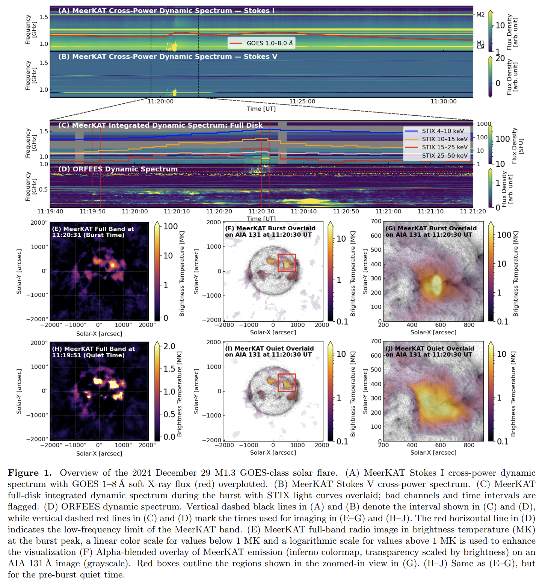

## 2026-02-09

1. [An Archival Optical Counterpart Search for Extragalactic Fast X-Ray Transients Discovered by Einstein Probe](https://arxiv.org/abs/2602.06321)

   > High Energy, Multi Wavelength

   对EP的X射线暂现源找光学对应体。将EP240506a与光学暂现源AT 2024ofs关联起来，并用VLT光谱给出宿主星系红移 z≈0.12，同时结合多波段早期数据判断其光度与演化符合核坍缩超新星起源。

   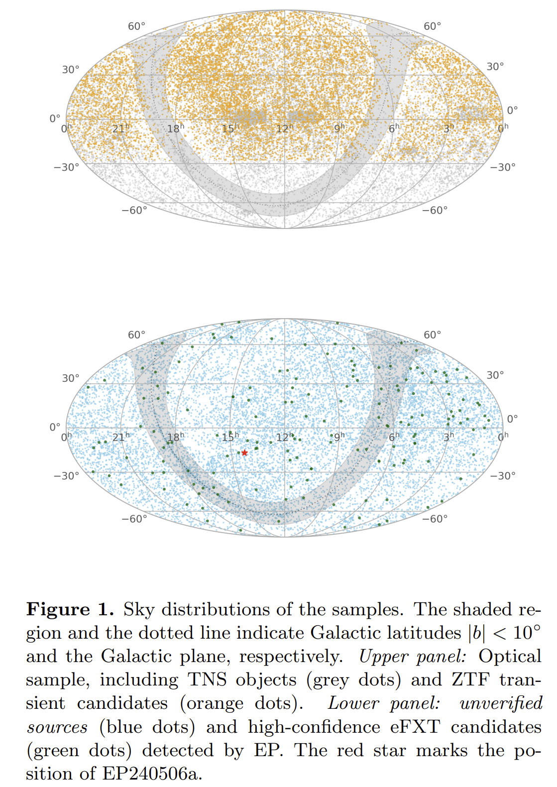

## 2026-02-10

1. [Imagining the Alien: Human Projections and Cognitive Limitations](https://arxiv.org/abs/2602.07284)

   > SETI

   回顾了人类长期以来对外星生命的想象史，指出这些形象往往来自地球生命形态与人类文化心理的映射。

   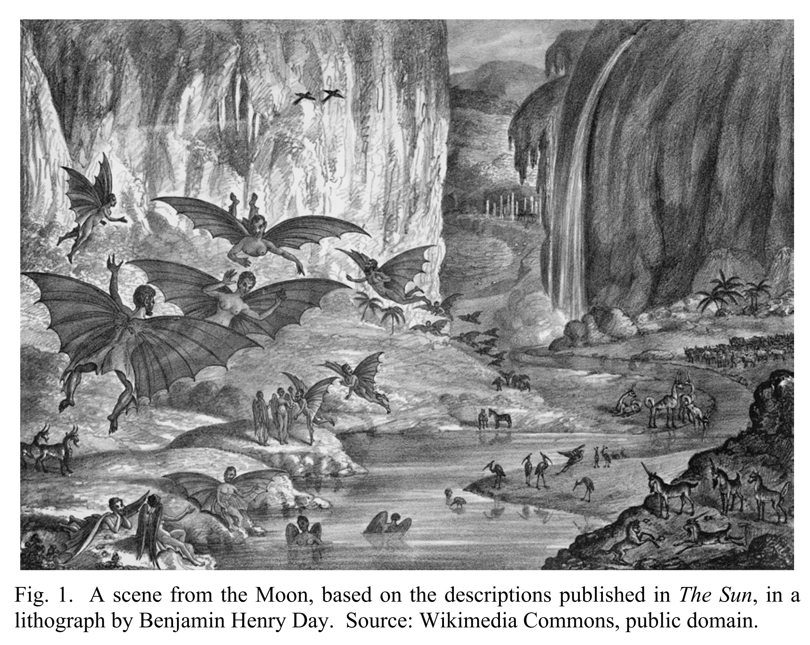

   文中用多个案例说明这种映射如何在宗教叙事，伪发现与科幻母题中反复出现，并把它解释为个体与集体层面的认知局限。

   文章进一步讨论了更偏数据驱动的技术迹象搜索，以及快速演化的 AI 可能如何帮助我们减少人类中心偏差，从而改进对高级外星智能的设想与搜索策略。

2. [Toward Vision-Language Assistants for Radio Astronomical Source Analysis](https://arxiv.org/abs/2602.07469)

   > Radio, LLM

   测试开源与商用视觉语言模型在六个射电天文图像任务（弥散结构检测，形态分类，扩展射电星系识别，成像伪影检测，图像复杂度判别，以及 FR I 与 FR II 等射电星系形态二分类）上的零样本能力。

   结果表明，微调后做任务能力变强，但是导致多模态能力下降，纯视觉模型仍然显著更强。

   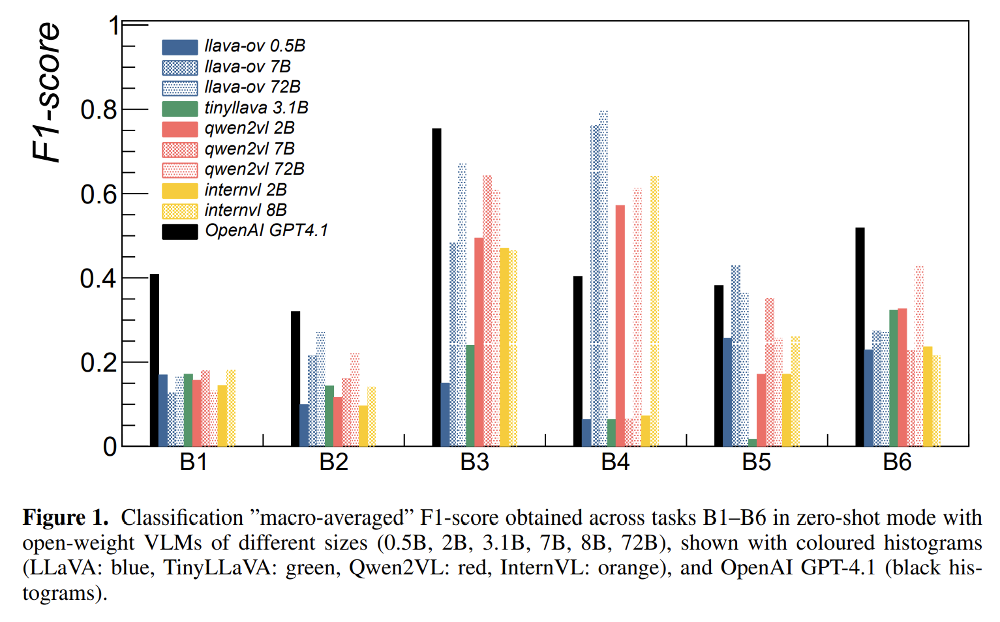

3. [A MeerKAT search for persistent radio sources towards twenty-five localised Fast Radio Bursts](https://arxiv.org/abs/2602.07716)

   > Fast Radio Burst, PRS

   MeerKAT对25个定位FRB搜索PRS，在1.28GHz找到14个射电源，12个没有（其中一个观测3次，2次有，1次没有）。结合X射线数据，认为射电源更像恒星形成区，致密与否还需要更高分辨率的观测。

   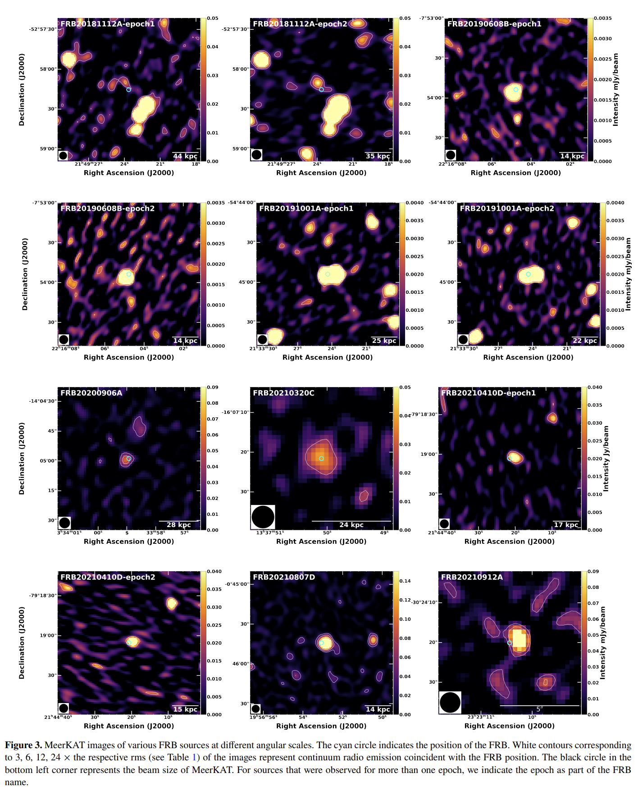

   目前有PRS的源有，FRB20121102A、FRB20190520B、FRB20190417A、FRB20240114A。另外，FRB20201124A的PRS亮度低，像恒星形成区。

## 2026-02-11

1. [astromorph: Self-supervised machine learning pipeline for astronomical morphology analysis](https://arxiv.org/abs/2602.09223)

   > Astronomy, Deep Learning

   [astromorph](https://github.com/onsala-space-observatory/astromorph)用BYOL自监督表征学习，把天文图像压缩到形态嵌入空间，从而支持相似样本检索、聚类和可视化探索。

   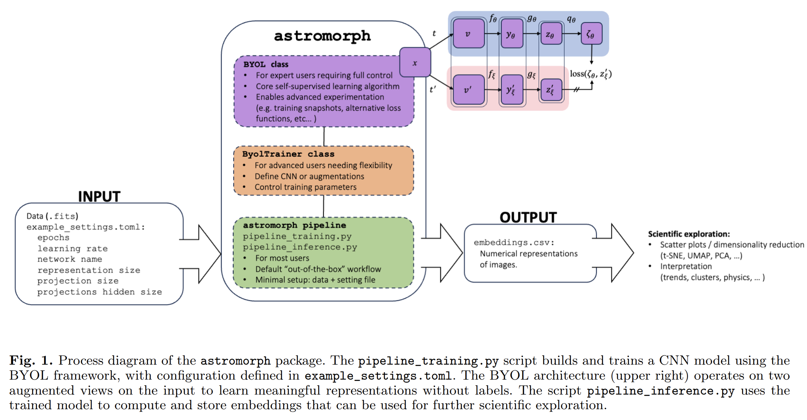

2. [Talking with the Latents -- how to convert your LLM into an astronomer](https://arxiv.org/abs/2602.09670)

   > Astronomy, LLM

   LLM很难从恒星光谱直接推理。这里先用一个已经很擅长处理光谱的基础模型，把光谱压成一段高维 latent 特征，然后训练一个很轻量的MLP，把 2048 维的 latent 映射成 K 个伪 token 的 embedding，跟文字拼在一起，送进 LLM 生成答案。

   从巡天管线里拿到恒星参数（比如有效温度 Teff、表面重力 log g、金属丰度 [Fe/H]），把这些参数喂给 teacher（文中用 Gemini 2.5 flash 生成），让它以天文学家的口吻写一段不超过 50 词的描述；训练的 student 是 Llama 1B、Llama 8B、Qwen 32B 这些更小的 LLM，但它们在训练时并不是直接看参数，而是看由光谱基础模型从真实光谱提取出的 latent。

   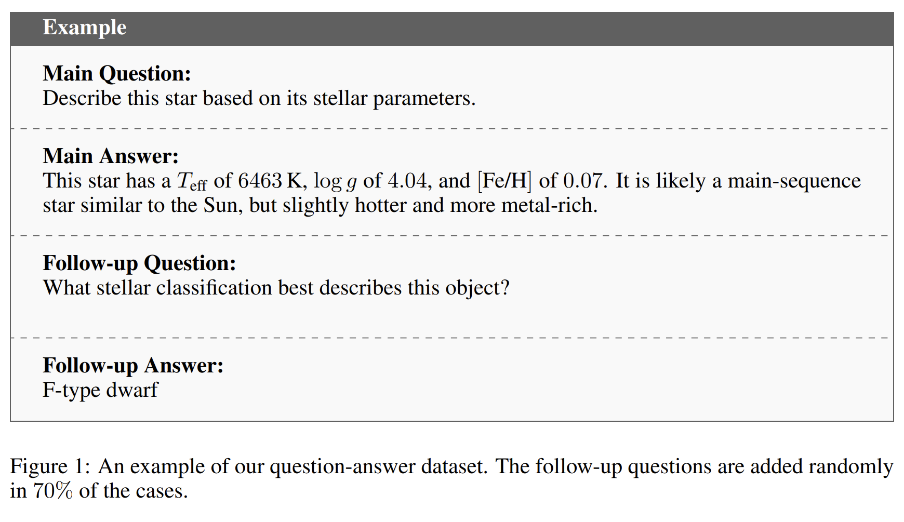

## 2026-02-12

1. [The indiscriminate adoption of AI threatens the foundations of academia](https://arxiv.org/abs/2602.10165)

   > Astronomy, LLM

   用vibe coding和多智能体式研究流程举例，强调速度提升背后会带来可解释性与可复现性下降，以及错误更难被发现的问题。

2. [Why do we do astrophysics?](https://arxiv.org/abs/2602.10181)

   > Astronomy, LLM

   在 LLM 能参与科研的背景下，写了一份白皮书来梳理天体物理学的目标、规范与价值。

   用一组“points of agreement”来回答“什么算天体物理”。核心标准很清晰：一个项目只要在研究宇宙时产出科学新颖性，也就是做出新的测量、新的解释或预测、方法改进、发现新对象，并且和现有文献里的重要问题发生联系，它就算“在做天体物理”。

3. [Constraining the Evolution of the HI Spin Temperature with Fast Radio Bursts](https://arxiv.org/abs/2602.10328)

   > Fast Radio Burst, Galaxy, HI

   用 FRB 作为背景光源搜索宿主星系的 HI 吸收线。

   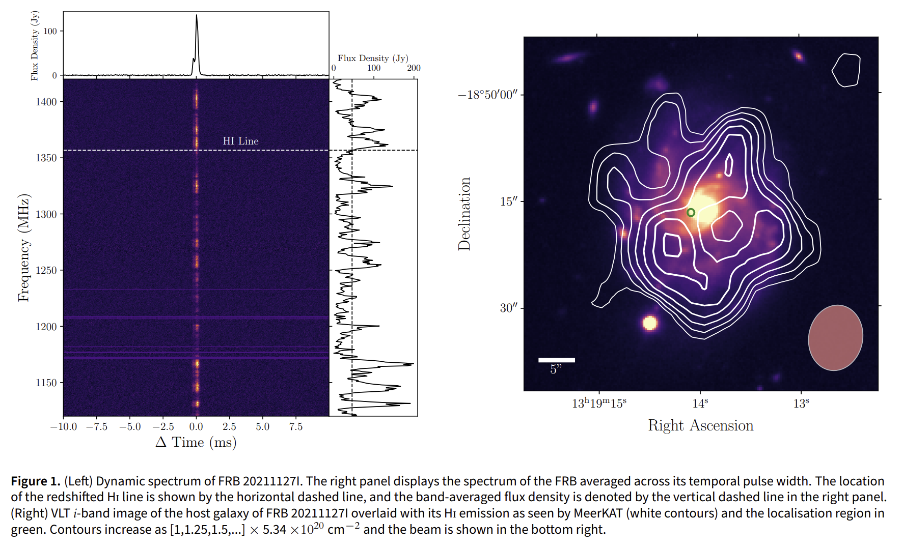

   用 ASKAP 的 FRB 20211127I 配合 MeerKAT 的 HI 发射观测做概念验证，给出积分光学厚度的上限，并据此得到 Tspin 的下限约 26 K。

4. [A 682-second X-ray Periodicity in CH Cygni: Evidence for a Magnetic White Dwarf](https://arxiv.org/abs/2602.10511)

   > White Dwarf, High Energy

   在 XMM Newton 的 X 射线光变中发现 CH Cyg 存在显著的 682.5 s 相干周期信号。文章把该周期解释为白矮星自转周期，从而为 CH Cyg 含磁白矮星提供直接证据，并指出它将成为继 R Aqr 之后第二个确认存在 X 射线脉动的共生星系统。

   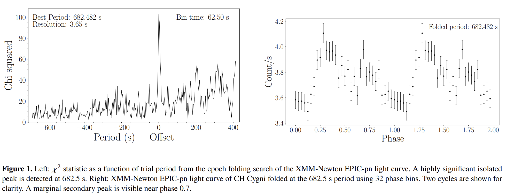

5. [GECAM discovery of the second FRB-associated Magnetar X-ray Burst from SGR J1935+2154](https://arxiv.org/abs/2602.10895)

   > Fast Radio Burst, Magnetar

   报告 GECAM 在 2022 年 10 月 14 日探测到来自 SGR J1935+2154 的一次明亮磁星 X 射线暴，并与 CHIME 和 GBT 记录到的 FRB 事件对应起来。

   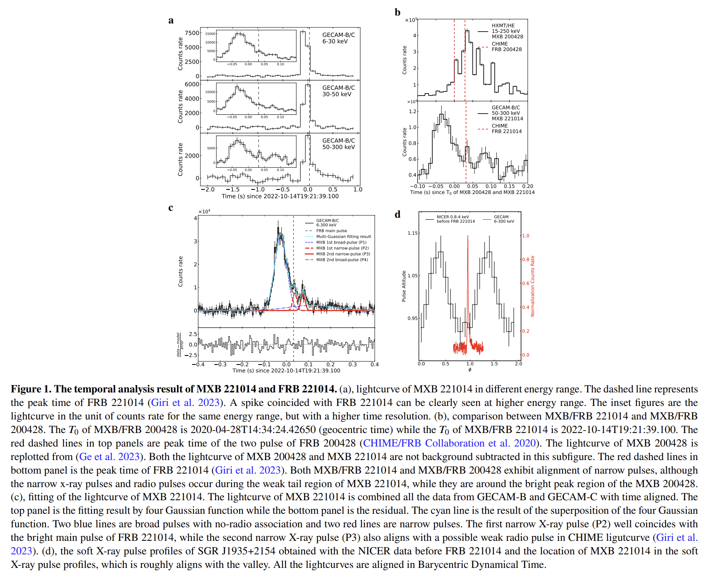

## 2026-02-13

1. [DeepRed: an architecture for redshift estimation](https://arxiv.org/abs/2602.11281)

   > Galaxy, Redshift, Deep Learning

   `DeepRed`用多种现代视觉网络从天文图像里直接回归红移，覆盖星系，引力透镜，引力透镜超新星等不同形态目标。还用 SHAP 做可解释性可视化与定量定位评估，验证模型关注区域与目标位置一致。

   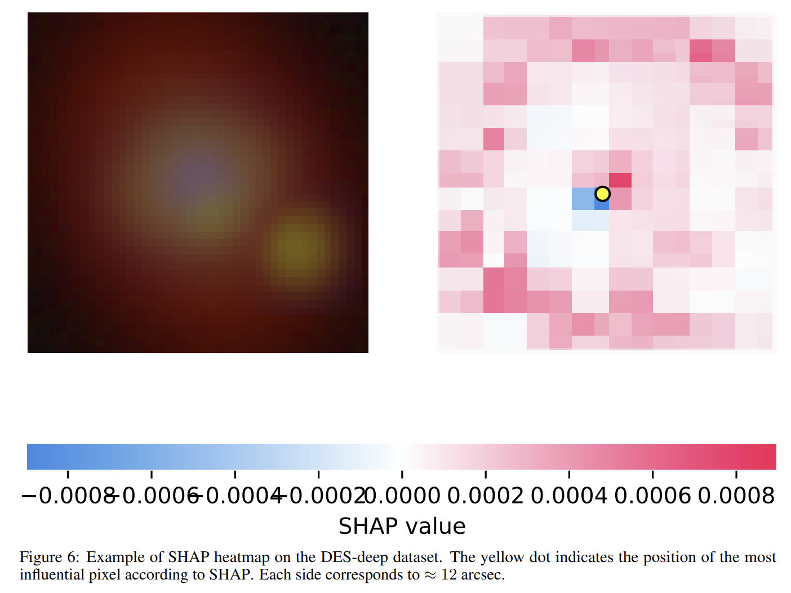

2. [NE2025: An Updated Electron Density Model for the Galactic Interstellar Medium](https://arxiv.org/abs/2602.11838)

   > ISM, Fast Radio Burst, Pulsar

   NE2005

   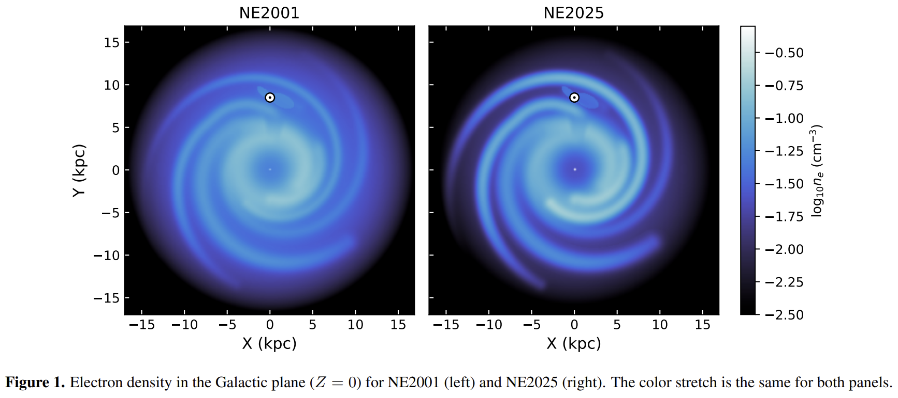

## 2026-02-16

1. [Astrophysics Wrapped 2025: Year-in-Review of Every Astrophysics arXiv Paper from 2025](https://arxiv.org/abs/2602.12303)

   > Astronomy, Review

   统计2025年astro-ph的文章，用到的最多的望远镜，每个国家出现的最多的目录。

   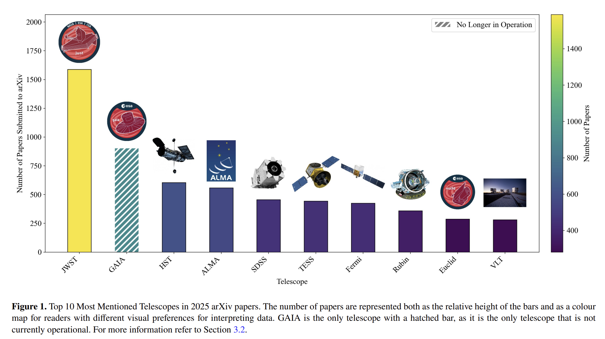

   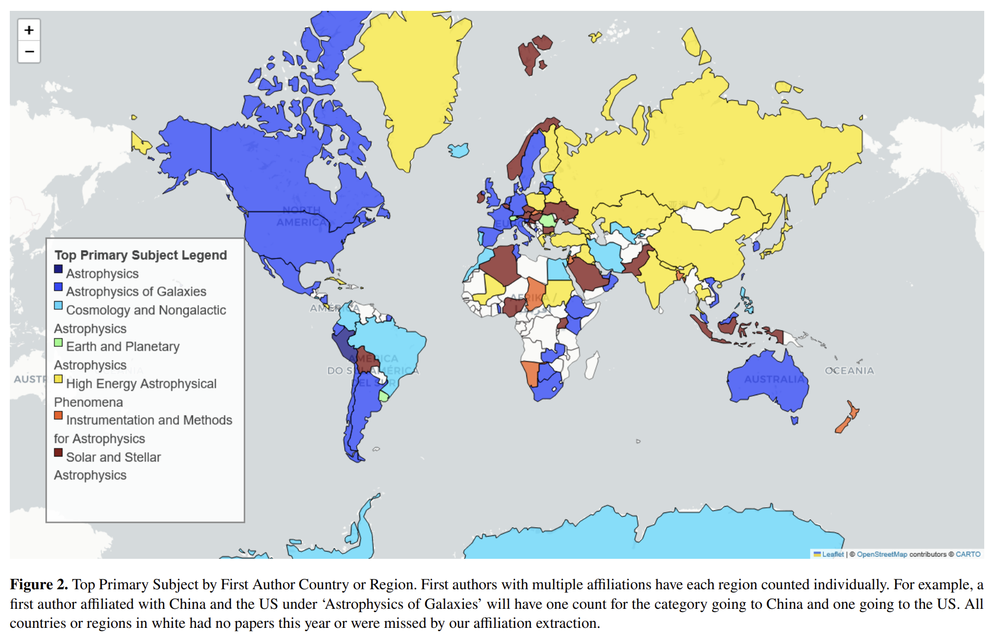

2. [CHIME/Slow overview and pilot survey: A new backend to search for second-duration radio transients with the CHIME telescope](https://arxiv.org/abs/2602.12793)

   > Instrument, LPT

   CHIME/Slow，用来做秒级暂现源的后端。用约17天的归档数据做先导巡天，探测到9个爆发事件，其中包含一个新的非重复源以及来自已知高活跃重复源 FRB 20220912A 的 8 个爆发。

   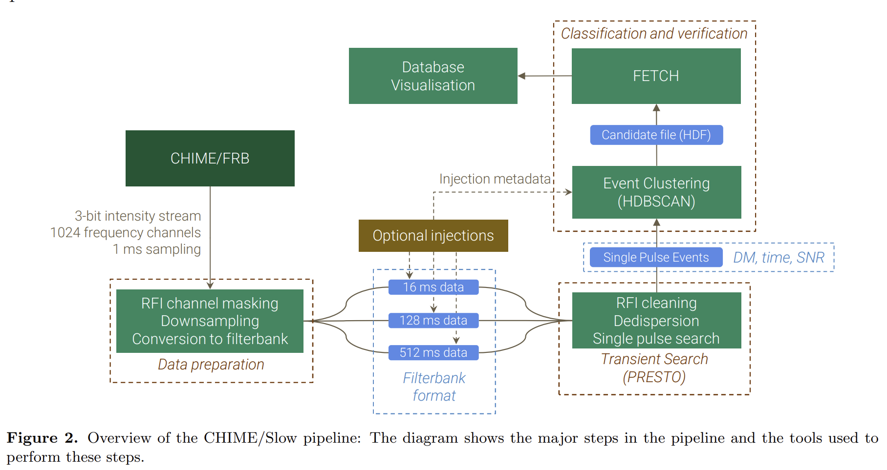

3. [Anomaly Hunter for Alerts (AHA): Anomaly Detection in the ZTF Transient Alert Stream](https://arxiv.org/abs/2602.12955)

   > Transient, Anomaly Detection

   在 ZTF 的实时告警流中，针对三种告警数据模态训练三个自编码器，包括对象特征表、三联图像切片、以及光变曲线，做异常事件排序与筛选。在 25 天的在线运行里筛出 87 个值得后续跟进的异常超新星候选，且不同模态检出的异常集合重叠很小。

## 2026-02-17

1. [Detection of Cyclotron Absorption in the Radio Emission of GPM 1839-10](https://arxiv.org/abs/2602.13742)

   > Transient, LPT, Observation

   FAST观测GPM J1839-10，看到正交偏振模式（OPM）变换与偏振度下降相关联，支持多模态非相干叠加导致的消偏振。

   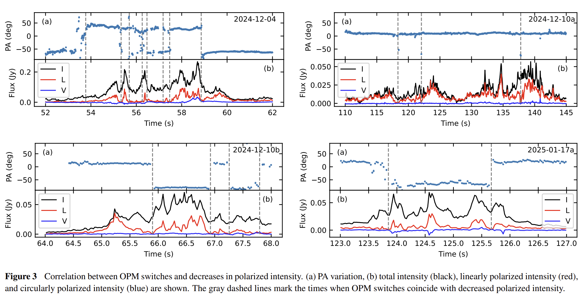

2. [Predicting New Concept-Object Associations in Astronomy by Mining the Literature ](https://arxiv.org/abs/2602.14335)

   > Astronomy, LLM

   [Astro Link Forecasting](https://github.com/JinchuLi2002/astro-link-forecasting)从 astro-ph 全量语料构建“概念–天体对象”的知识图谱，然后把问题定义为时间预测任务，在多个时间截断点上预测未来会出现的“概念–对象新关联”，并提出统一的推理期概念相似度平滑来缓解聚类概念的语义重叠。

   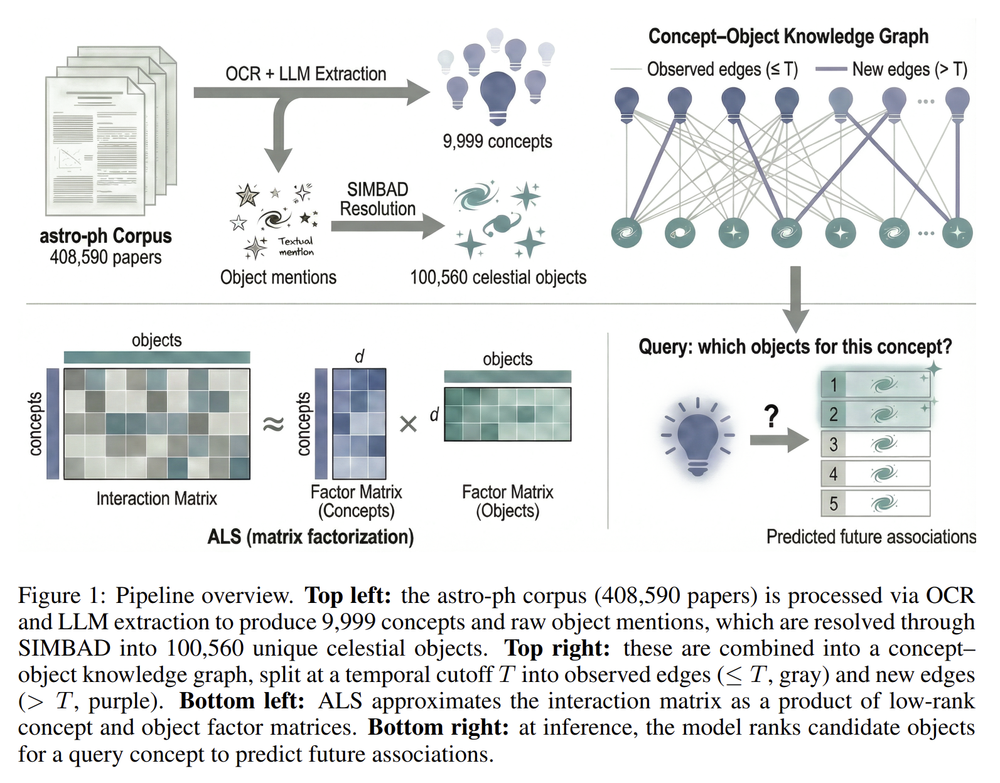

3. [Estimation of neutron star mass and radius of FRB 20240114A by identification of crustal oscillations](https://arxiv.org/abs/2602.14353)

   > Fast Radio Burst, Theory

   把 FRB 20240114A 报告的准周期振荡（QPO）解释为中子星地壳扭转振荡模，并结合核物质饱和性质的实验约束来反推致密星结构参数。

## 2026-02-18

1. [Well-being and career instability across genders in the Spanish Astronomical Society](https://arxiv.org/abs/2602.15085)

   > Astronomy

   对西班牙天文学会（SEA）的研究人员做了一次覆盖面较广的问卷调查，系统评估了幸福感，职业满意度与家庭与工作的协调情况，并按性别与职业阶段做了对比分析。

   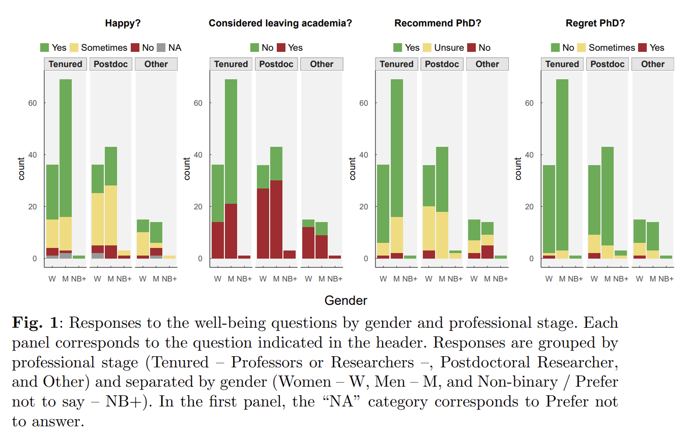

   结果显示，职业不稳定，家庭与工作难以兼顾，以及发表压力等因素与较低的幸福感和更强的离开学界意愿高度相关。“获得tenure前做博士后年限随时间增长”呈现职业稳定性在长期变差。

## 2026-02-19

1. [A targeted machine learning approach for detecting diffuse radio emission with Astronomaly: Protege](https://arxiv.org/abs/2602.15930)

   > Galaxy, Radio, Deep Learning, Anomaly Detection

   把BYOL这类自监督方法用从射电切图里抽特征，并结合 Astronomaly 里的 PROTEGE 框架做迭代式的人机协同标注与重排序，把“疑似弥散源”排到前面。

   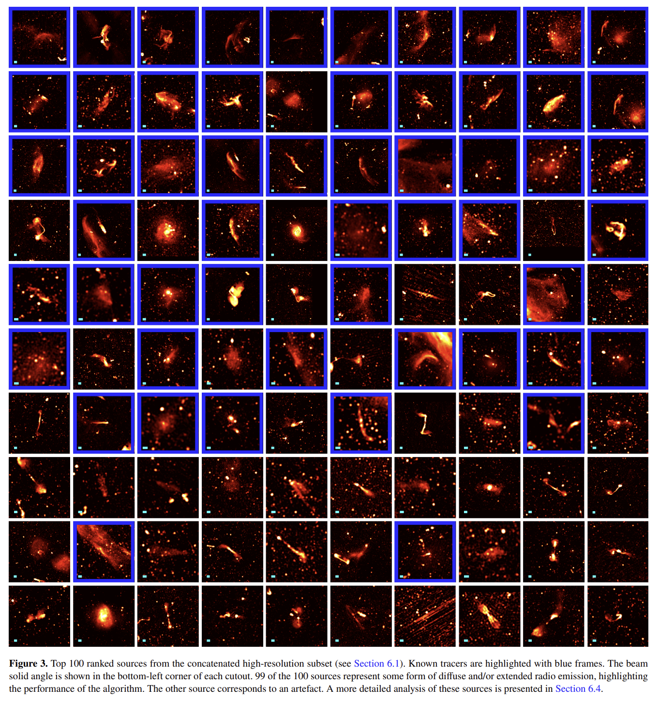

2. [A fast radio burst cyclone in technicolour: evidence of plasma lensing](https://arxiv.org/abs/2602.16409)

   > Fast Radio Burst, Observation

   Parkes超宽带对FRB20240114A的观测，认为FRB的谱时变化与**前景等离子体透镜放大**一致，并用极端散射事件 ESE 的高斯透镜模型去拟合爆发率随时间的变化。

   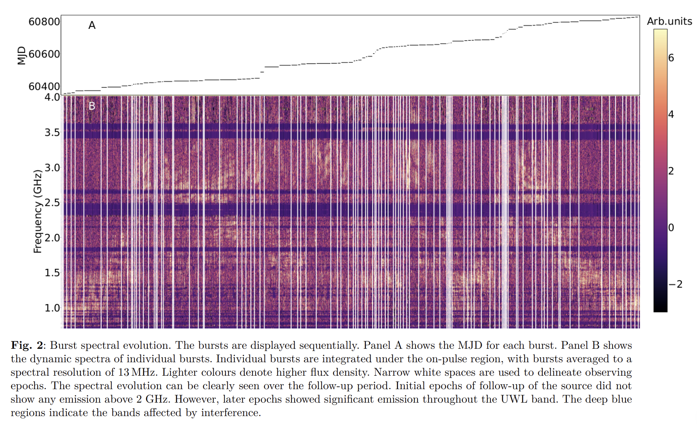

3. [The LOFAR Two-metre Sky Survey: VII. Third Data Release](https://arxiv.org/abs/2602.15949)

   > LOFAR, Survey, Catalog

   发布 LoTSS 的第三次数据发布 DR3，给出覆盖北天大部分区域的 120–168 MHz 连续谱拼接图与超大规模源表。

   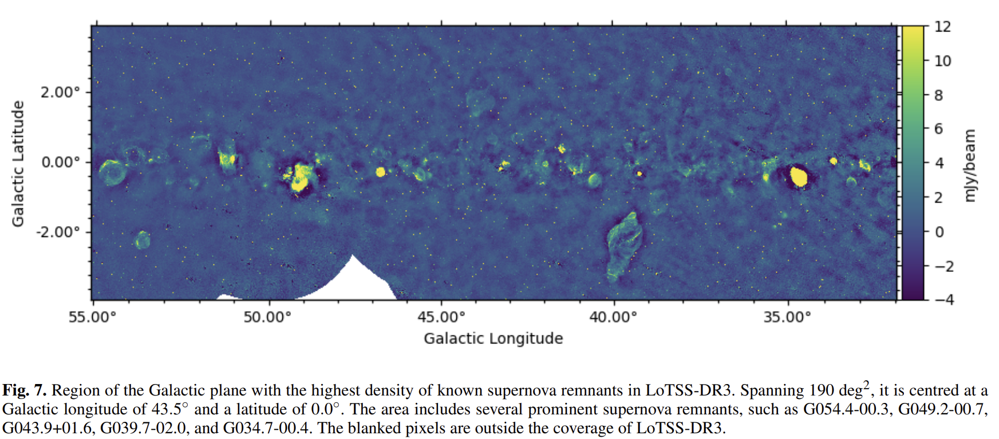

## 2026-02-20

1. [A positive period derivative in the quasi-periodic eruptions of ZTF19acnskyy](https://arxiv.org/abs/2602.16776)

   > Transient, Period

   在 QPE 源 ZTF19acnskyy 里首次直接测到了周期导数，周期在平滑变长，pdot=1.7e-2 d/d。评估了多类物理解释，但这些方案都无法把观测到的周期增长完整自洽地解释掉。

   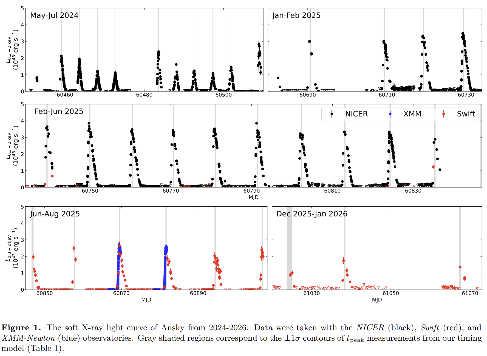

2. [Testing the cosmic distance-duality relation with localized fast radio bursts: a cosmological model-independent study ](https://arxiv.org/abs/2602.16869)

   > Fast Radio Burst, Cosmology

   使用定位的FRB，用ANN建立红移和DM之间的关系，然后预测哈勃常数，发现跟Ia型超新星给出的结果没有显著偏离。

   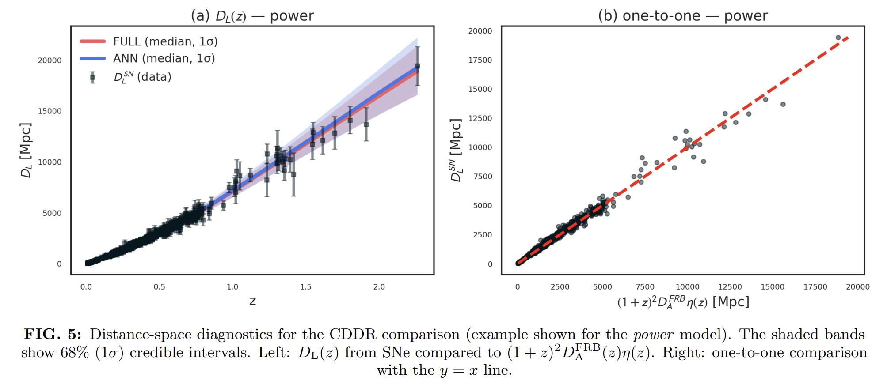

3. [Kolmogorov analysis of pulsar TOA](https://arxiv.org/abs/2602.17188)

   > Pulsar, Statistics

   把 Kolmogorov stochasticity parameter（KSP）用于 NANOGrav 的 68 颗脉冲星 TOA 数据白噪声分量，量化随机性程度。

   发现不同脉冲星的白噪声随机性存在明显不均一性，并且随机性随时间变化，提示可能存在非平稳的物理或系统过程影响计时。

   ::: tip KSP

   在这篇文章里，Kolmogorov stochasticity parameter（KSP）用一组样本的经验累计分布函数和某个参考的理论累计分布函数之间的最大偏差来定义。先给定理论分布的 CDF
   $F(x)\equiv \Pr(X\le x)$。对观测样本 $x_1,\ldots,x_n$ 定义经验 CDF
   $$
   F_n(x)\equiv \frac{1}{n}\sum_{i=1}^{n}\mathbf{1}{x_i\le x}.
   $$
   然后定义一元 Kolmogorov 距离
   $$
   D_n \equiv \sup_{x\in \mathbb{R}} |F_n(x)-F(x)|.
   $$
   KSP 就是它的缩放形式
   $$
   \lambda_n \equiv \sqrt{n},D_n ;=; \sqrt{n}\sup_{x\in \mathbb{R}} |F_n(x)-F(x)|.
   $$
   文中还提醒，在零假设 $X_1,\ldots,X_n\sim F$ 且 $F$ 连续时，$\lambda_n$ 的分布函数收敛到 Kolmogorov 的极限分布
   $$
   \Phi(\lambda)=\sum_{k=-\infty}^{+\infty}(-1)^k e^{-2k^2\lambda^2},\quad \Phi(0)=0.
   $$

   :::

4. [Deeper detection limits in astronomical imaging using self-supervised spatiotemporal denoising](https://arxiv.org/abs/2602.17205)

   > JWST, Deep Learning

   [ASTERIS](https://github.com/freemercury/ASTERIS_THU)一种自监督的时空去噪算法，把多次曝光的时序与空间信息联合起来抑制相关噪声。在保持 PSF 与测光准确度的同时，ASTERIS 能在 90% 完整度与纯度标准下把探测极限推进约 1 等。

   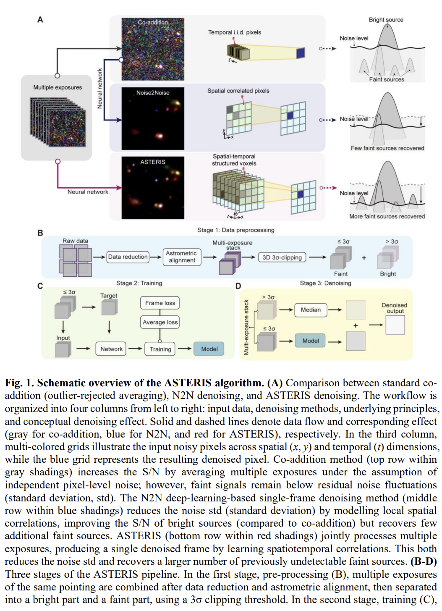

5. [The CGM with local universe FRBs: evidence of strong AGN feedback in a massive elliptical galaxy](https://arxiv.org/abs/2602.16781)

   > Fast Radio Burst, ISM, Cosmology

   选择5个local宇宙中的FRB，其宿主星系的DM可忽略，来限制每个晕中 CGM 的质量。发现其中一个FRB，唯一一个大质量椭圆宿主星系，已经失去了其重子。该星系显示出过去 AGN 活动的证据，这与星系团尺度晕中强 AGN 反馈的图像一致。

   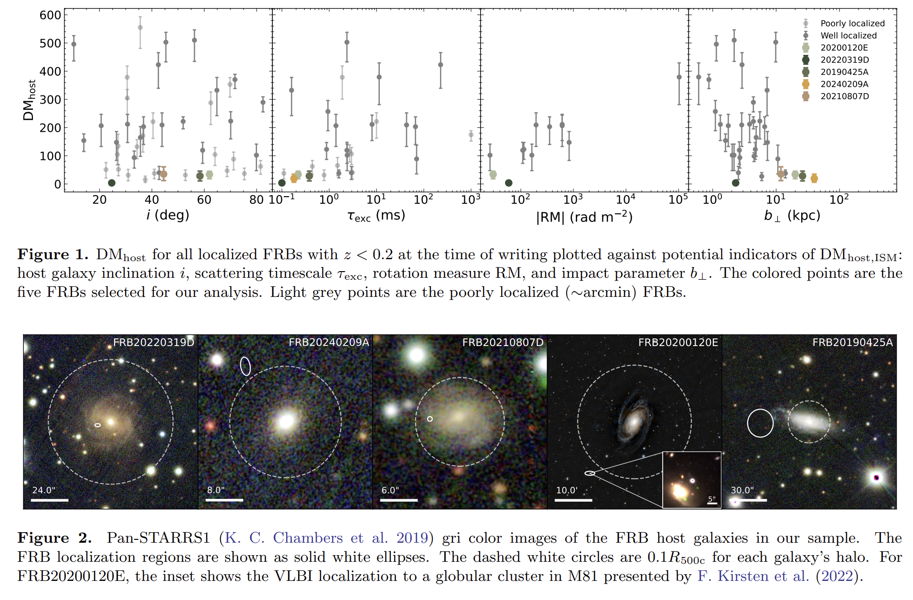

## 2026-02-23

