## 2026-03-02

1. [Constraining the mass of the M31 ionized baryon Halo using CHIME/FRB Catalog 2](https://arxiv.org/abs/2602.23749)

   > Fast Radio Burst, ISM

   把 FRB 当作穿过星系晕的“电离气体探针”，用 CHIME/FRB Catalog 2 里 171 条穿过 M31 晕区的视线，和 684 条对照视线比较色散量 DM，来估计仙女座 CGM 的电离气体柱密度。

   结果显示，M31 很可能把相当一部分宇宙学预期的重子预算藏在弥散、热的、已电离的 CGM 里。

## 2026-03-03

1. [FRB scattering statistics through the CGM are sensitive to morphology and intermittency](https://arxiv.org/abs/2603.00336)

   > Fast Radio Burst, ISM

   提出一个可观测量TDF，用一组穿过同一个前景晕的FRB散射时间尺度分布来刻画小尺度CGM结构。TDF的形状对冷CGM云团的几何形态很敏感，比如球状、丝状、片状会给出显著不同的分布尾部与结构，从而可用大量视线统计去反推亚秒差距尺度的CGM形态与间歇性。

   

2. [Fast Radio Bursts in the Era of the Vera C. Rubin Observatory’s Legacy Survey of Space and Time](https://arxiv.org/abs/2603.00371)

   > Fast Radio Burst, Cosmology

   评估LSST识别FRB宿主星系的能力。只用 Rubin 进行一次观测，也能识别出 ASKAP 探测到的 65% 的 FRB 宿主星系；而最终 10 年叠加的图像将识别出 MeerKAT 探测到的 81% 的 FRB 宿主星系。

3. [Deep learning-based astronomical multimodal data fusion: A comprehensive review](https://arxiv.org/abs/2603.00699)

   > Astronomy, Deep Learning, LLM, Review

   梳理了天文领域用深度学习做多模态数据融合的动机、数据形态、方法路线与应用场景。

   

## 2026-03-04

1. [A signal dedispersion algorithm for imaging-based transient searches](https://arxiv.org/abs/2603.02931)

   > Astronomy, Dispersion Measure, Transient, Method

   [STRIDE](https://github.com/PaCER-BLINK-Project/dedispersion)从高时间分辨率和频率分辨率的干涉图像中生成逐像素去色散时间序列。

   

2. [Evidence for a Delayed UV Counterpart to X-ray Quasi-periodic Eruptions in Ansky](https://arxiv.org/abs/2603.02517)

   > High Energy, QPO, Observation

   报告了 Ansky 这个 QPE 源中，首个与 X-ray 准周期爆发相耦合、可重复出现的 UV 对应体。

   

## 2026-03-05

1. [Long-term activity cycles in planetary M stars observed with SOPHIE](https://arxiv.org/abs/2603.03643)

   > Stellar, Period

   使用 13 年左右的 SOPHIE 高分辨率光谱，同时跟踪 Hα 指标和 Mount Wilson S-index，再结合 TESS 光变数据做短期活动分析。结果显示，GJ 617A 存在约 4.8 年的长期活动周期，GJ 411 也有几年量级的长期变化，但这些周期都和已报道行星周期对不上，因此更像恒星磁活动信号，不像伪造出来的行星探测结果。

## 2026-03-06

1. [AstroInspect: a web-based system to organize, assess, and visually inspect astronomical objects](https://arxiv.org/abs/2603.04713)

   > Astronomy, Software

   [AstroInspect](https://astroinspect.github.io/)允许用户上传天体目录，然后按天球坐标自动拉取图像（包括SDSS、Legacy Surveys、S-PLUS 等巡天）、光谱和测光信息，把原本分散在多个平台的数据放到一个统一界面里。

   

## 2026-03-09

1. [Long-Integration Magnetar Burst Observatory (LIMBO): Instrument Summary and Early FRB Rate Constraints](https://arxiv.org/abs/2603.05603)

   > Fast Radio Burst, Instrument

   LIMBO是UCBerkeley的一个4.3m天线，在1475MHz中心的250MHz带宽上搜索FRB，探测阈值是43Jyms。在2023年5-8月对SGR1935进行了833小时的观测，探测到12个事件，估计事件率是$R(\ge65{{\rm Jyms}})=112.3/{\rm yr}$。

   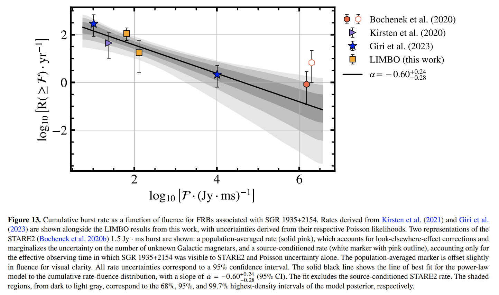

2. [SwinYNet: A Transformer-based Multi-Task Model for Accurate and Efficient FRB Search](https://arxiv.org/abs/2603.05958)

   > Fast Radio Burst, Software, Search

   [SwinYNet](https://github.com/expnn/SwinYNet)使用transformer进行FRB搜索。

3. [Search for Periodic Radio Signals from Double Neutron Star System Companions Using the Fast Folding Algorithm](https://arxiv.org/abs/2603.06150)

   > Pulsar, Search, Method

   用[riptide](https://github.com/v-morello/riptide)的FFA搜脉冲星。

4. [Data-Driven Trends and Subpopulations in the Gravitational Wave Binary Black Hole Merger Population with UMAP](https://arxiv.org/abs/2603.06566)

   > Gravitational Wave, Machine Learning

   用UMAP在Gravitational-Wave Transient Catalog (GWTC)上使用，将 BBH 群体划分为四个清晰分离的亚群，划分依据主要是其主质量和次质量成分，以及一个异常事件GW190521-030229。

   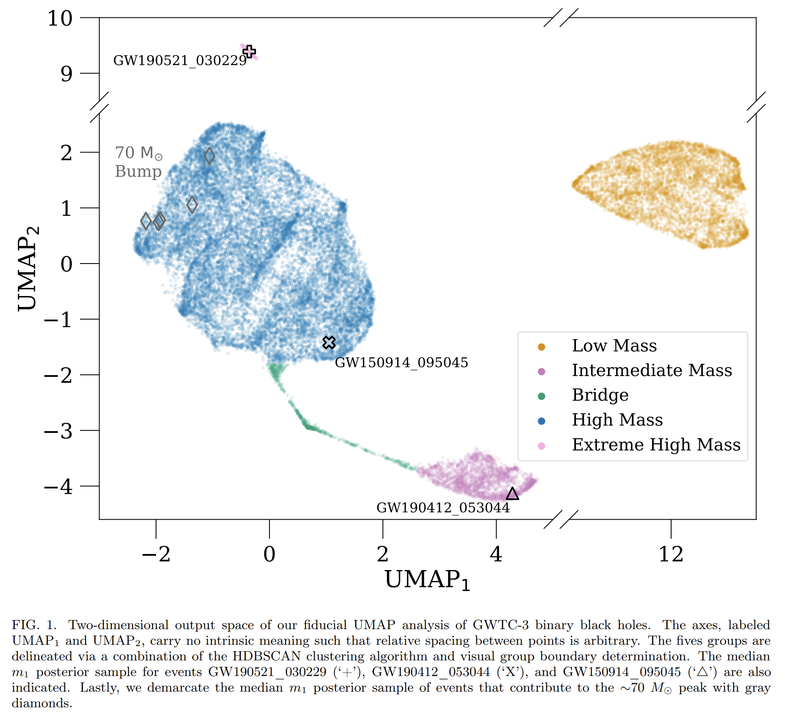

## 2026-03-10

1. [Different polarized components of the quasar 3C 286 revealed by FAST](https://arxiv.org/abs/2603.06983)

   > Radio, Stellar, Observation

   FAST在2019到2023年对3C 286的观测，发现 Stokes I 和 U 的闪烁几乎同步，Stokes Q 的变化更随机，并且相对 I 存在约 2.8 秒时延。基于这些差异，他们推断 3C 286 的不同偏振辐射来自不同区域，主要对应核心与西南喷流，同时还估计出太阳风速度约 637 km/s。

   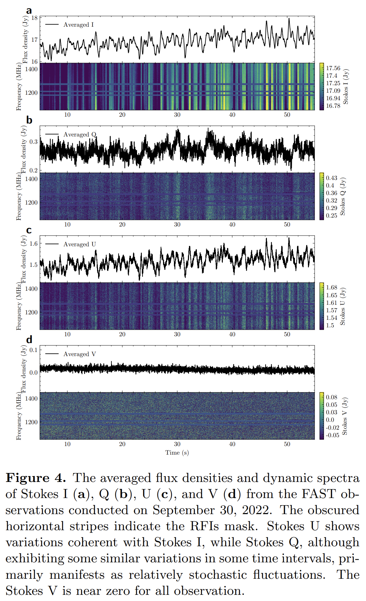

2. [Probing the Dispersion and Rotation Measure Contributions from Supernova Remnants in Fast Radio Burst Source Environments with 1D SNR Simulation](https://arxiv.org/abs/2603.07012)

   > Fast Radio Burst, Theory

   用一维超新星遗迹 HD+NEI 模拟，研究年轻磁星周围 SNR 对 FRB DM和RM的贡献。冲击区对 DM 的贡献通常很小，主导 DM 演化的是未受冲击的抛射物，但冲击区仍可能产生很大的 RM。

3. [Flux Variations of Fast Radio Bursts and Their Persistent Radio Sources: Evidence for a Shared Progenitor](https://arxiv.org/abs/2603.07123)

   > Fast Radio Burst, Statistics, PRS

   发现 FRB 20190520B 与 FRB 20240114A 的 PRS 流量密度，和同时期的 burst-energy proxy 在周到月尺度上存在正相关。

   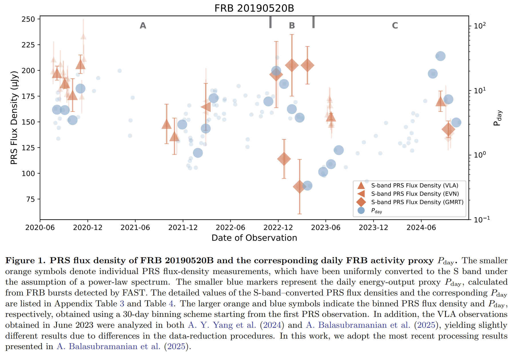

4. [Discovery of a 36-minute long-period transient ASKAP J142431.2-612611](https://arxiv.org/abs/2603.07857)

   > LPT, Observation

   ASKAP探测到长周期暂现源ASKAP J142431.2-612611，周期36分钟，在8天内探测到辐射，后来消失。没有光学和红外对映体。100%偏振，偏振演化沿庞加莱球上的大圆轨迹变化。

   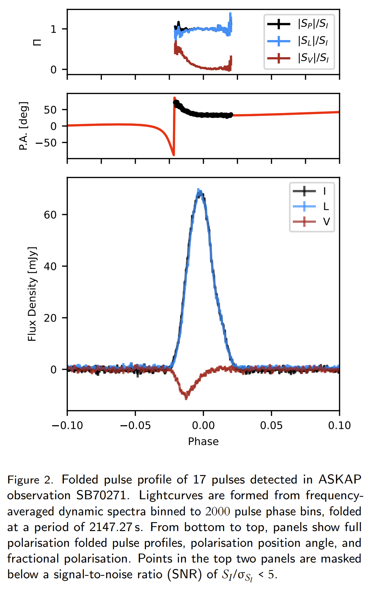

5. [Double White Dwarf Mergers as Progenitors of Long-Period Transients](https://arxiv.org/abs/2603.08416)

   > LPT, Theory, White Dwarf

   部分长周期暂现源可能来自双白矮星并合后的高速自转强磁白矮星。针对 GLEAM-X J1627−5235 建模，认为其性质可以由质量约 1.3 个太阳质量、半径约 2500 km、磁场约 10^9 G 的碳氧白矮星解释，并给出约 572 Myr 的转动年龄。

6. [A GPU-Accelerated Transient Detection Pipeline for DECam Time-Domain Surveys](https://arxiv.org/abs/2603.08593)

   > Transient, Method, Optical

   应用在DECam上的GPU加速的瞬变源探测。以 GPU 版 [SFFT](https://github.com/thomasvrussell/sfft) 做图像差分，再接 CNN 的 real-bogus 分类，完备率超过 99%，同时可剔除约 96% 的减法伪迹，单次 DECam 曝光处理时间约 50 秒。

   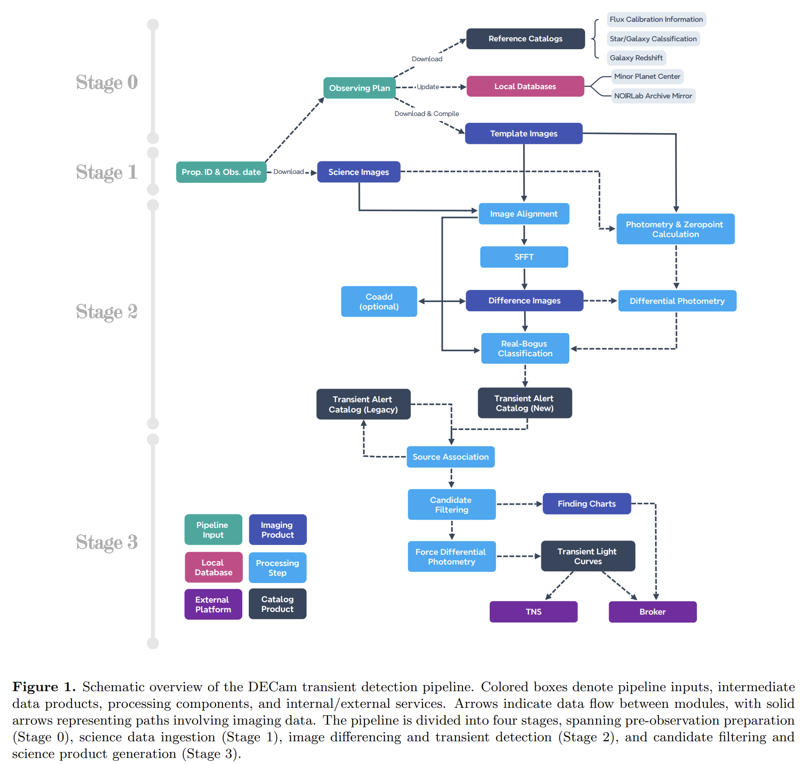

7. [To What Extent Are Star Cluster Ages Encoded in Their Environments? Exploring the Spatial Distribution of Age-Related Information with PHANGS-HST Imaging and Convolutional Neural Networks](https://arxiv.org/abs/2603.07289)

   > Stellar, Cluster, Deep Learning

   用 PHANGS-HST 五波段图像训练 CNN，证明模型可以直接从图像 cutout 中恢复星团年龄。发现年龄信息并不只来自星团本身的颜色和中心亮度，**周围环境结构也包含可测的年龄线索**，尤其在最年轻和最老的星团中更明显。

   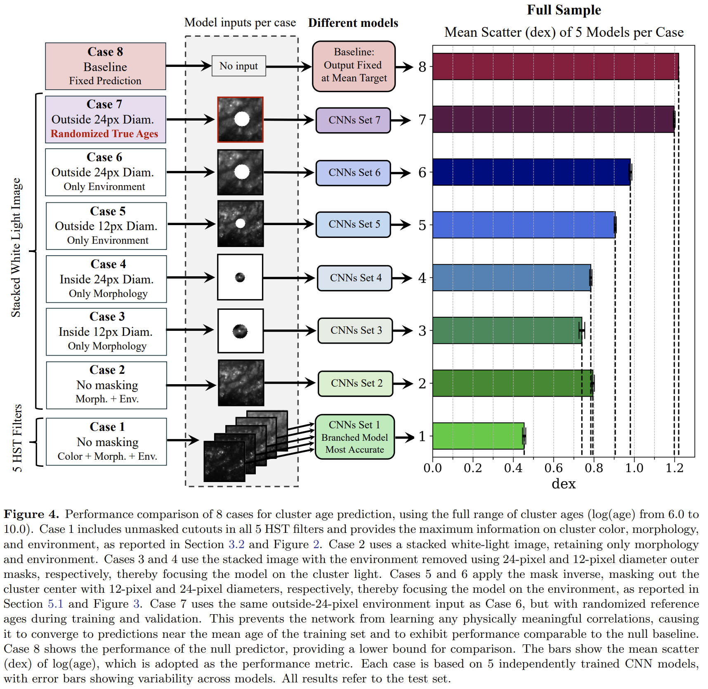

## 2026-03-11

1. [Correcting Ionospheric Faraday Rotation for the VLA and MeerKAT](https://arxiv.org/abs/2603.09001)

   > Radio, Polarimetry, Calibration

   用月球偏振观测来检验VLA和MeerKAT的电离层RM修正精度。论文比较了两类做法

   - 一类是基于全球VTEC图和薄层电离层近似的传统方法。会系统性高估IFRM，在VLA上通常偏高约0.5到1.1 rad/m²，在MeerKAT上也有约0.3 rad/m²量级的系统偏差
   - 另一类是用附近GNSS台站原始数据做局域建模的ALBUS。可以把精度做到约0.1 rad/m²

2. [Supernova scores for active anomaly detection](https://arxiv.org/abs/2603.09762)

   > Supernova, Anomaly Detection, Time Domain

   给主动异常检测加一个“超新星分数”SN-score，用监督分类器去引导PineForest在海量时域数据里更快找到超新星样目标。作者用ZTF Bright Transient Survey里已确认的超新星训练二分类器，在ZTF DR23上得到约0.98的ROC-AUC，然后把这个SN-score作为额外特征接入主动异常检测。这样做能明显加快发现SN-like候选体，同时还保留对其他异常源的发现能力。实际应用里，他们在ZTF DR23里找到了7个此前未报告的超新星候选、1个AGN候选、1个异常银河系变星，还识别出两个宿主星系中的多次超新星事件。

## 2026-03-12

1. [The FAST Discovery of a binary millisecond pulsar PSR J1647-0156B (M12B) with a candidate cross matching algorithm](https://arxiv.org/abs/2603.10347)

   > Pulsar, Globular Cluster, Search Method

   提出一个脉冲星候选体交叉匹配算法，把同一天区多次观测中的候选体按自转周期和DM做聚类筛选。用这个方法在FAST的球状星团数据里发现了新毫秒脉冲星M12B，它的自转周期约2.76 ms，DM约42.70 pc/cc，处在约0.53天的双星轨道中。

2. [Mass measurements of the double neutron star system PSR J0641+0448](https://arxiv.org/abs/2603.10788)

   > Pulsar, Neutron Star, Timing

   报告FAST GPPS巡天发现的双中子星系统PSR J0641+0448，并通过高精度定时测量它的质量。这个脉冲星自转周期约25.7 ms，处在3.73天、偏心率0.145的轨道中。结果支持双中子星系统里“第二颗中子星质量与轨道偏心率相关”的图景。

   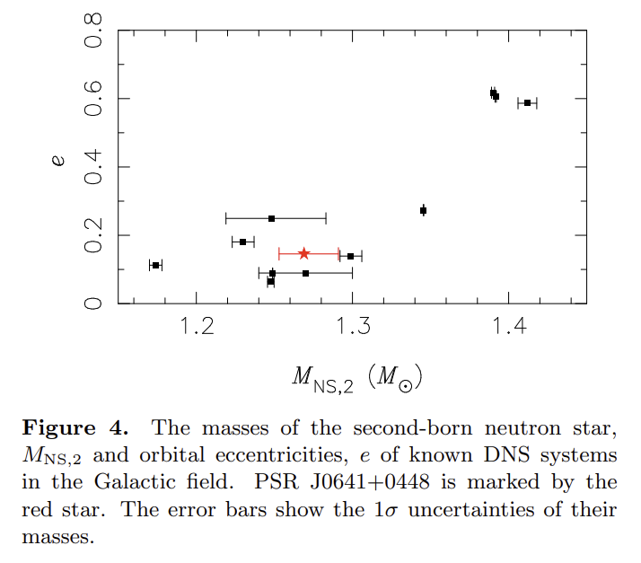

3. [Searching for Magnetic White Dwarfs in LAMOST DR10](https://arxiv.org/abs/2603.11004)

   > White Dwarf, Magnetic Field, Spectroscopy

   在LAMOST DR10里系统搜索磁白矮星。把LAMOST光谱和Gaia EDR3白矮星候选体、以及已有SDSS磁白矮星目录做交叉匹配，再用Balmer线和He线的Zeeman splitting来识别磁场并估计磁场强度。最终在LAMOST DR10里识别出63个孤立磁白矮星，其中32个是新发现，测得的表面磁场从几个MG一直到几十MG。

   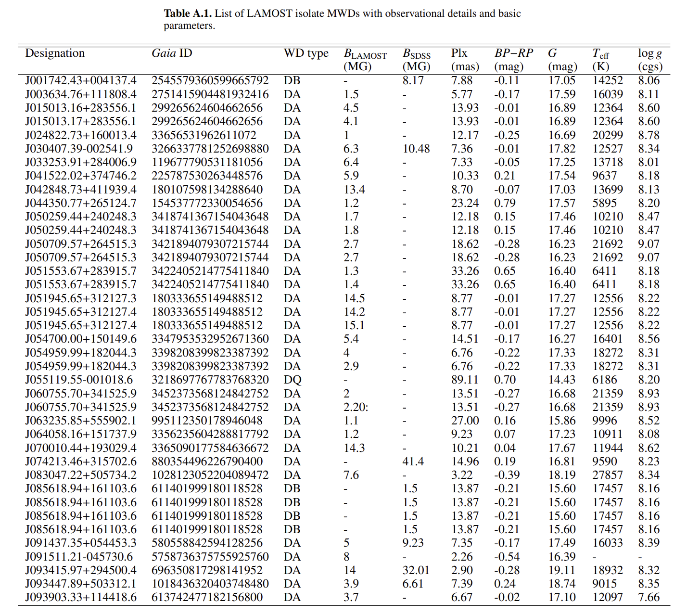

4. [Extended Radio Galaxies in EMU: A Comparative Look at Source-Finding Techniques](https://arxiv.org/abs/2603.10579)

   > Radio Galaxy, Survey, Source Finding

   比较EMU巡天里三种扩展射电源自动搜索方法的表现，包括DRAGNHunter、coarse-grained complexity和RG-CAT。作者把这三种方法应用到EMU的GAMA09区域，想看它们各自擅长找什么类型的扩展射电源。结果发现，三种方法合起来几乎能覆盖这个区域里的大多数扩展源，但彼此找到的样本重叠并不高，只有375个源被三种方法同时找到。

   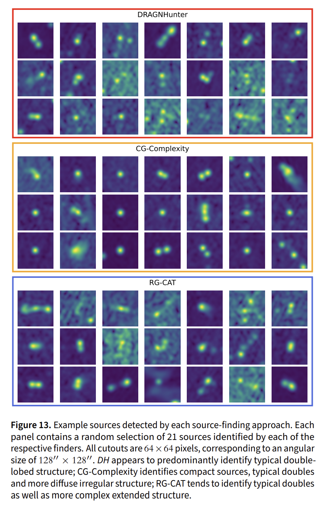

## 2026-03-13

1. [Post-processing Probabilistic Forecasts of the Solar Wind by Data Mining Similar Scenarios](https://arxiv.org/abs/2603.11284)

   > Solar, Space Weather, Forecast

   给太阳风速预报加上概率分布和误差条。在ADAPT-WSA这类原本只给单值预报的模型外面，又套了一层基于“相似历史情形”的后处理。具体做法是把未来几天的模型预报，加上最近12小时的观测和预报，拼成一个“情景向量”，再去历史数据库里找最相似的样本，用这些邻居拟合偏斜正态分布，得到带不确定性的预报。

   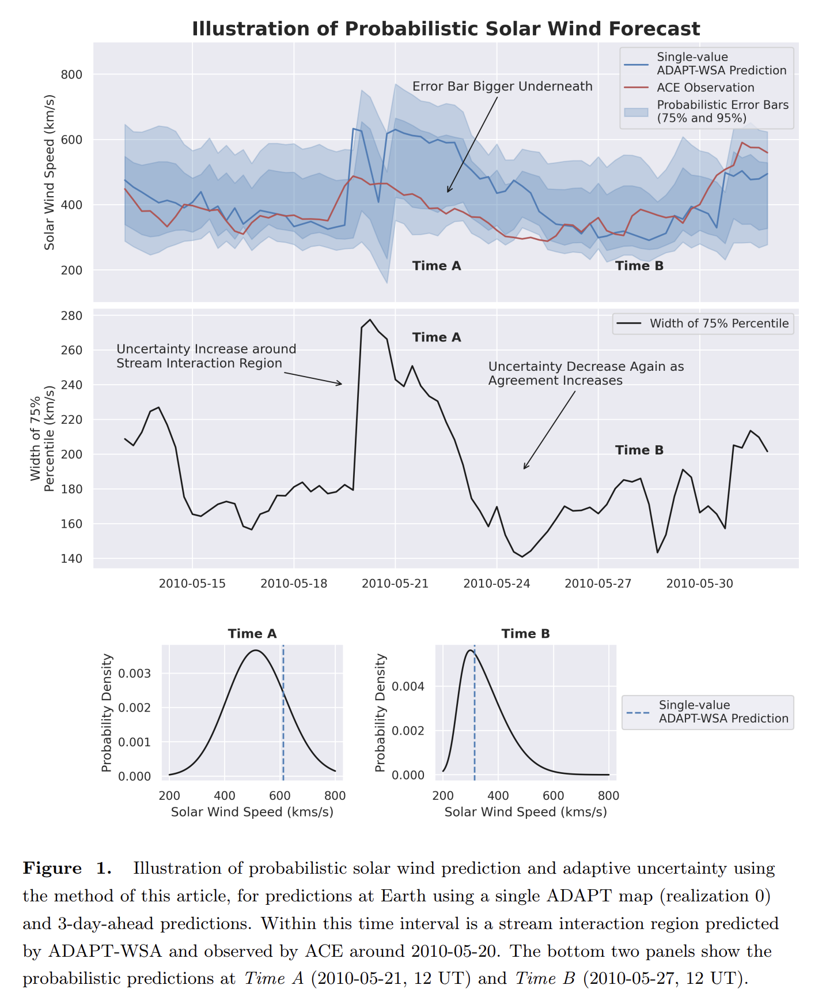

2. [50-250 MHz Pulsar Census with an SKA-Low prototype station: Spectra and Polarization](https://arxiv.org/abs/2603.11553)

   > Pulsar, Low Frequency, Polarization

   用SKA-Low原型台站EDA2做了一次南天低频脉冲星普查，频率覆盖50到250 MHz。观测了240个目标，探测到120颗脉冲星，其中23颗是首次在150 MHz以下被探测到，5颗首次在100 MHz以下被探测到。论文给出了这些脉冲星在五个子频段上的平均脉冲轮廓和流量，还改进了110颗脉冲星的DM测量，典型修正量约0.1 pc/cc，并在40颗脉冲星上测到显著法拉第旋转。光谱方面，他们发现幂律谱的平均谱指数约为$-1.78\pm0.17$，还有52颗脉冲星在低频出现turnover。

3. [Constraints on Axion-Photon Mixing from Fast Radio Burst Dispersion Measures](https://arxiv.org/abs/2603.11657)

   > Fast Radio Burst, Axion, Cosmology

   假设FRB来自高磁场中子星，利用轴子光子混合会给色散量增加额外贡献这一点，去约束轴子质量和耦合常数。统计显著性没有超过2σ，所以更合适的理解是给出了保守约束，而不是发现了轴子光子混合信号。

## 2026-03-16

1. [Gravitational self-lensing of Fast Radio Bursts in neutron star magnetospheres: II. Applications to strong repeaters and the CHIME population](https://arxiv.org/abs/2603.12386)

   > Fast Radio Burst, Gravitational Lensing, Theory

   把中子星磁层内自引力透镜模型拿去和FAST重复暴源、以及CHIME总体样本做比较。发现FRB 20121102A的双峰能量分布可以用两个热点来解释，要求自转轴、视线和热点位置都非常对齐，夹角大致在2°以内；FRB 20201124A和FRB 20220912A也支持类似几何。文中还指出，自转轴进动可以解释FRB 20121102A能量分布的长期演化和一段时间的消失，而把模型推广到随机取向的宇宙学总体后，也能较好复现CHIME样本的距离分布和流量分布。

   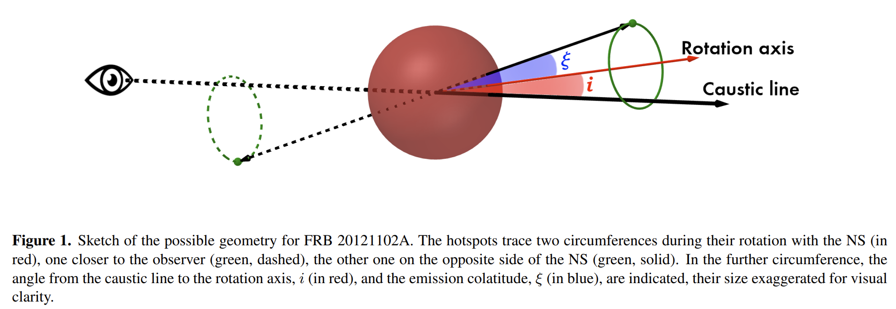

2. [The influence of plasma lensing magnification to the luminosity function of fast radio bursts](https://arxiv.org/abs/2603.12691)

   > Fast Radio Burst, Plasma Lensing, Theory

   研究等离子体透镜会怎样扭曲FRB的光度函数。作者在多透镜平面上放置高斯气体团块，测试不同电子密度分布和两种本征光度函数模型。结果表明，等离子体透镜一方面会把一部分源压到探测阈值以下，比例大约在1%到15%之间；另一方面又会把少数事件放大到异常明亮的高光度端，因此会给FRB总体统计带来系统偏差。论文还指出，这种效应和自由电子密度功率谱有关，但宿主星系或银河系内的散射会削弱这种透镜效应。

## 2026-03-17

1. [The extinction distances for over a thousand planetary nebulae with Gaia measurements](https://arxiv.org/abs/2603.15139)

   > Planetary Nebula, Distance, Gaia

   用 Gaia DR3 的恒星消光-距离关系来给行星状星云测距离，结合改进的 blue-edge 方法和 extinction-jump 模型，构建了一个包含 1066 个 PN 的均一样本。

## 2026-03-18

1. [Optimising the FRB Search Pipeline for the Northern Cross Radio Telescope](https://arxiv.org/abs/2603.16345)

   > Fast Radio Burst, Pipeline, Radio Telescope

   给 Northern Cross 的 FRB 搜索流水线做参数优化。作者往真实噪声 filterbank 数据里注入人工 FRB 脉冲，系统扫描 Heimdall 里的 DM tolerance、boxcar filter 宽度和 gulp size，比较不同配置下的检出精度和运行速度。结果表明，FRB 搜索里灵敏度和吞吐率之间有很明显的 trade-off，不能只盯着单个指标调参；他们找到了一个经验最优配置，既能较稳地恢复注入信号，又能在单块 GPU 上轻松满足实时处理需求。

2. [Explainable machine learning workflows for radio astronomical data processing](https://arxiv.org/abs/2603.16350)

   > Radio Astronomy, Machine Learning, Explainability

   讨论怎么把“可解释机器学习”引进射电天文数据处理流程。作者把模糊推理和深度学习结合起来，用 Takagi-Sugeno-Kang fuzzy system 处理射电干涉测量里 direction-dependent calibration 的离群源选择问题，目标是在保持自动化效果的同时，让天文学家能看懂模型为什么这么选。模拟结果显示，这种带 fuzzy input layer 的模型，性能和纯数据驱动方法差不多，在高噪声下可能更稳；同时还能识别冗余输入、发现训练样本覆盖不足的情形，并判断哪些输入特征真正重要。 

3. [Metastable helium in the thermosphere](https://arxiv.org/abs/2509.14499)

   > Atmosphere, SPHEREx, Helium

   SPHEREx 在 commissioning 数据里看到的 1.083 um 亮发射线，其实是地球高层热层里的 He I 1.0833 um 三重线，来自亚稳态氦对太阳光子的共振散射。

## 2026-03-19

1. [A Mass Transferring Brown Dwarf Binary on a 57 Minute Orbit](https://arxiv.org/abs/2603.17038)

   > Brown Dwarf, Binary, Accretion

   发现一个正在稳定传质的褐矮星双星系统 ZTF J1239+8347，轨道周期只有 57.41 分钟。作者用 ZTF 的高振幅短周期光变先把它捞出来，再结合 Gaia 视差和光学/近红外光谱，推断吸积热点温度约 8904 K，吸积星大气温度约 1500 K。这个系统看起来是 direct-impact accretor，更像极短周期双白矮星里的直接撞击吸积，而不是普通CV。

   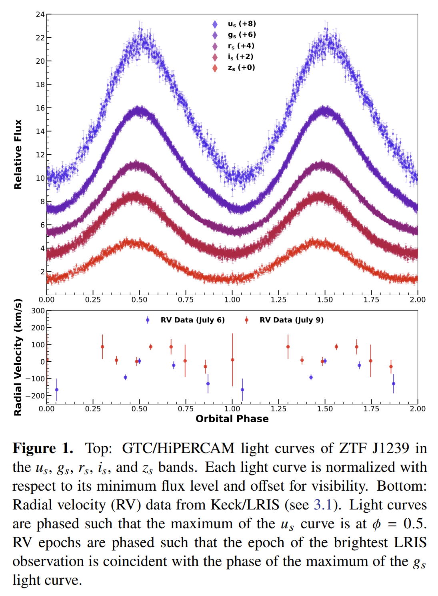

2. [Scatter in the Relation between Persistent Radio Source Luminosity and Fast Radio Burst Rotation Measure: A Window into Circum-burst Environments](https://arxiv.org/abs/2603.17615)

   > Fast Radio Burst, Persistent Radio Source, Environment

   研究重复FRB对应的持续射电源（PRS）光度和爆发RM之间关系里的弥散，想用弥散成都来约束FRB周围星云的演化。从五个已确认的 FRB-PRS 系统出发，建立 $L_\nu \propto R^\epsilon |{\rm RM}|$ 的标度关系，并用残差统计约束组合演化指数 $\alpha|\epsilon| = 1.5 \pm 0.7$。这个结果不太支持 Sedov-Taylor 阶段的 SNR、SNR/ISM 自由膨胀阶段的反向激波、以及由衰减脉冲星风驱动的老 PWN；反而更接近年轻、快速膨胀的星云，比如自由膨胀阶段的前向激波或近似恒定风驱动的年轻 PWN。

   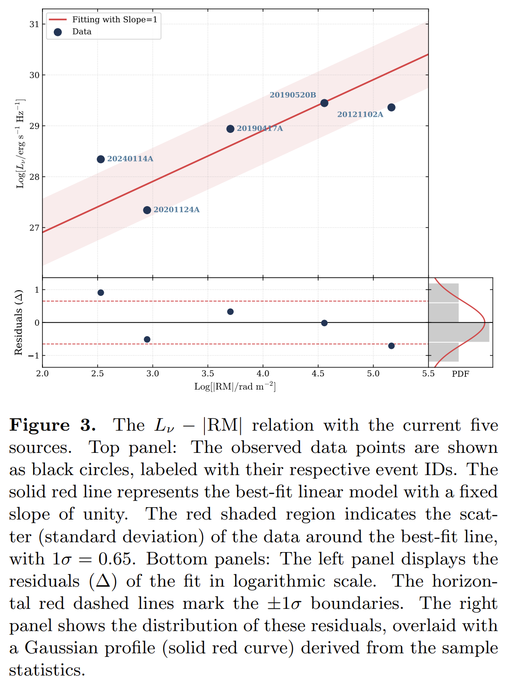

## 2026-03-20

1. [Discovery of Bimodal Drift Rate Structure in FRB 20240114A: Evidence for Dual Emission Regions](https://arxiv.org/abs/2603.18109)

   > Fast Radio Burst, Statistics, Machine Learning

   对 FAST 观测到的重复暴 FRB 20240114A 的 233 个 upward-drifting burst cluster 做无监督聚类，用 UMAP + HDBSCAN 在 8 维特征空间里找子类。

   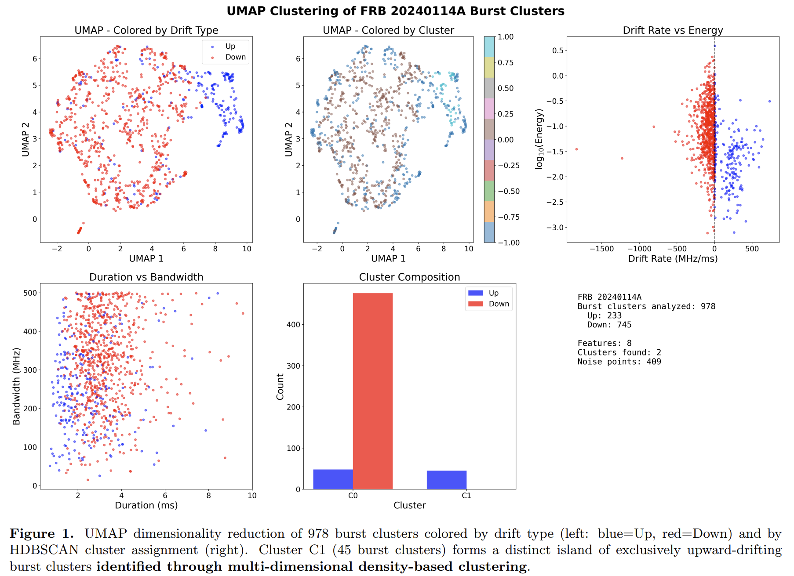

   识别出一个由 45 个 burst cluster 组成的极端子样本 C1，它们的平均 drift rate 比其余 upward-drifting 事件高约 2.5 倍（245.6 vs 98.1 MHz/ms），同时峰值频率更低、持续时间更短。进一步用 GMM、Ashman’s D 和 gap analysis 检验后，发现这个 bimodality 在只保留单峰 U1 事件时仍然成立，因此不像是分类定义带来的假信号。

   作者把它解释为磁层里可能存在两个空间分离的辐射区，分别产生不同 drift rate 的 upward-drifting bursts。

2. [Setting SAIL: Leveraging Scientist-AI-Loops for Rigorous Visualization Tools](https://arxiv.org/abs/2603.18145)

   > Astronomy, LLM, Visualization

   提出一个 Scientist-AI-Loop（SAIL）工作流，核心想法是把科学逻辑和代码实现拆开：研究者负责物理假设、边界条件和科学正确性，LLM 负责快速写交互式前端和可视化代码。

   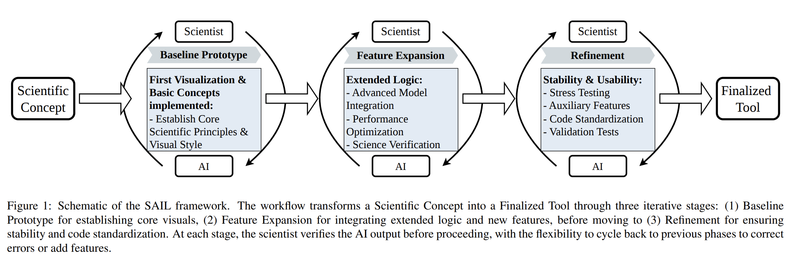

   这种人机回路能把原本要花很久的交互工具开发压缩到几天内，同时尽量避免“代码能跑但科学上不对”的问题。文章用两个浏览器端案例来演示这个流程，一个是引力透镜可视化工具，另一个是大尺度结构形成 sandbox。

3. [Learning to See Sharper: A Physics-Informed Artificial Intelligence Framework for Super-Resolving Galaxy Spectra](https://arxiv.org/abs/2603.18357)

   > Galaxy, Spectroscopy, Deep Learning

   用深度学习做星系光谱的 super-resolution，把低分辨率 JWST/NIRSpec prism 光谱增强到接近中分辨率 grating 光谱的效果。训练集来自 JADES 的 1187 组配对观测，覆盖 1–5 μm；模型分三步，先做初步超分，再估红移，最后用 physics-informed 的残差模块去恢复发射线形状和连续谱细节。

   测试结果表明，模型能把 [O II]、Hβ、[O III]、Hα 等关键诊断线的信噪比明显提高，还能把 prism 里本来混在一起的 [O III] 双线和 Hβ 分开。

   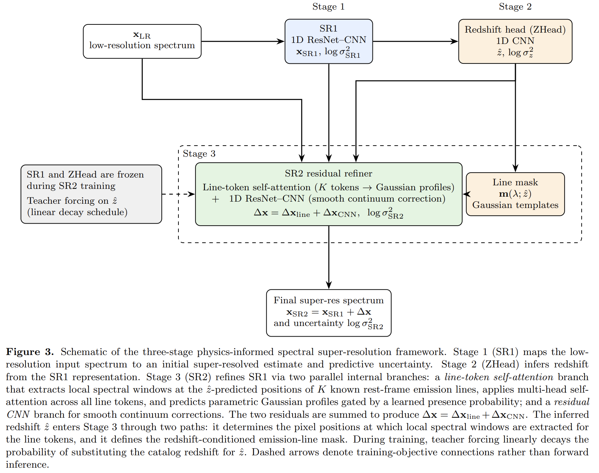

4. [A systematic search for physical associations between fast radio bursts and astrophysical transients](https://arxiv.org/abs/2603.18487)

   > Fast Radio Burst, Transient, Bayesian Inference

   系统搜索 FRB 和其他高能暂现源之间的物理关联，样本包括 3765 个 FRB（第二版 CHIME/FRB catalog 加上 124 个有红移的精确定位 FRB）。

   建立了一个 3D Bayesian 框架，同时考虑角距离、定位误差和红移约束，来计算 FRB-AT 候选对的关联概率。交叉匹配后找到了 14 对 FRB-光学暂现源候选和 15 对 FRB-GRB 候选；其中之前就有人提过的 FRB 20180916B 和 AT 2020hur 关联概率达到 0.9998，而另一个常被讨论的 FRB 20190309A 和短暴 GRB 060502B 只有 0.83，不够显著。

   总体结论是：除了已知那一例，没有新的统计显著 FRB-AT 关联被找到；小角距离本身不够，真正关键的是高精度定位。 

## 2026-03-23

