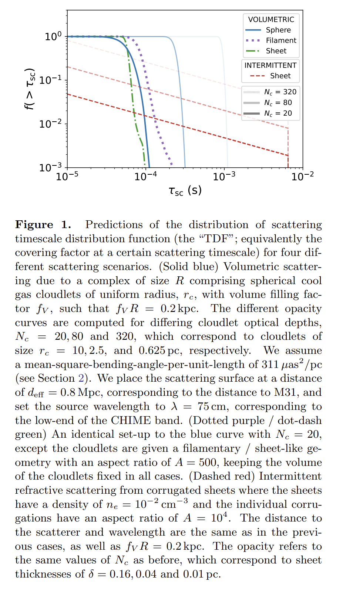
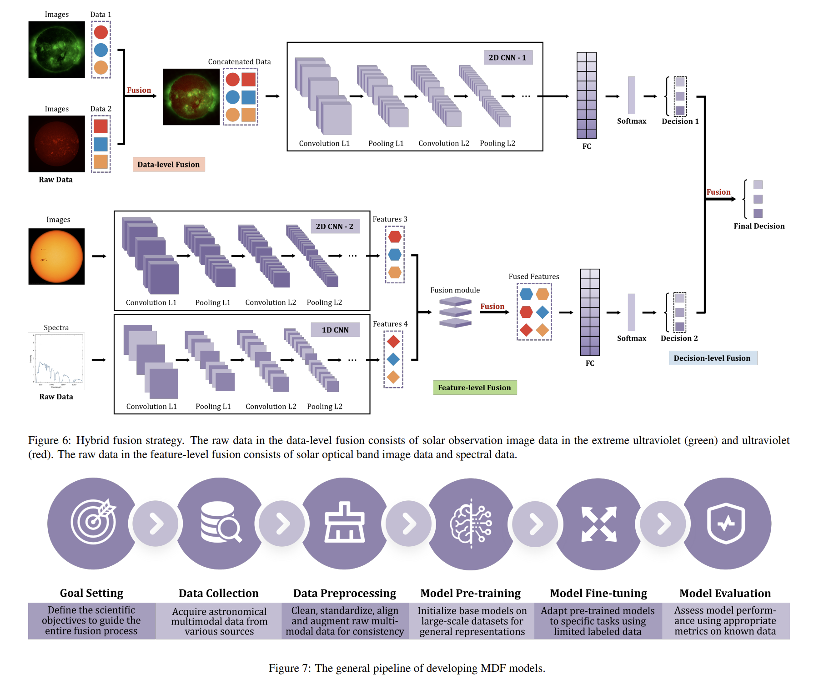
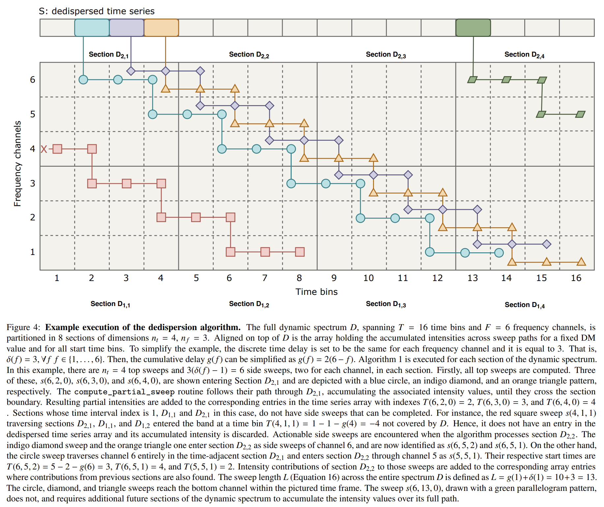
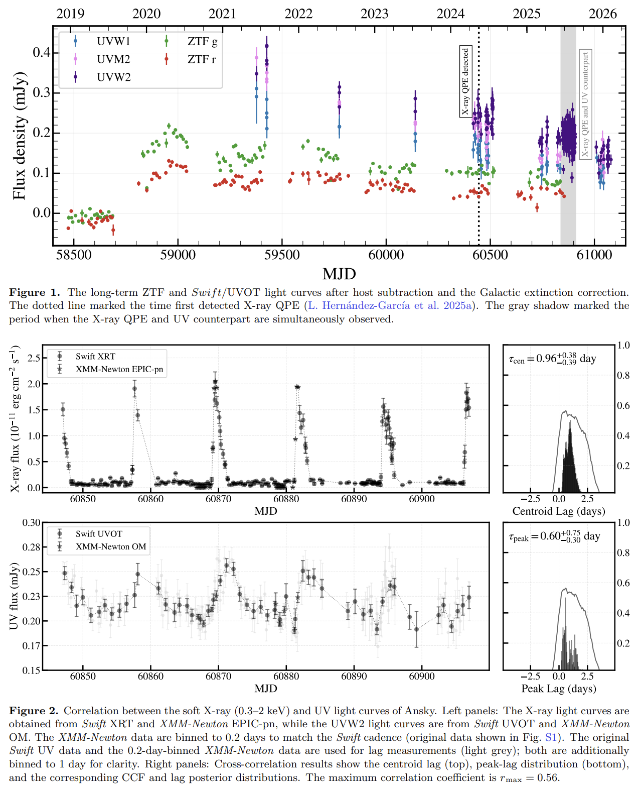
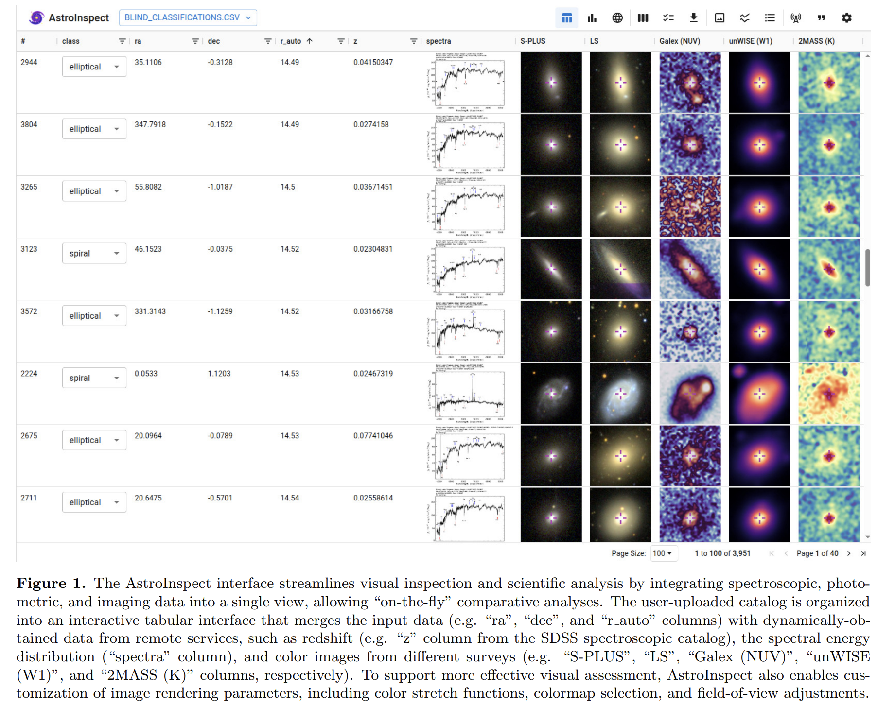

## 2026-03-02

1. [Constraining the mass of the M31 ionized baryon Halo using CHIME/FRB Catalog 2](https://arxiv.org/abs/2602.23749)

   > Fast Radio Burst, ISM

   把 FRB 当作穿过星系晕的“电离气体探针”，用 CHIME/FRB Catalog 2 里 171 条穿过 M31 晕区的视线，和 684 条对照视线比较色散量 DM，来估计仙女座 CGM 的电离气体柱密度。

   结果显示，M31 很可能把相当一部分宇宙学预期的重子预算藏在弥散、热的、已电离的 CGM 里。

## 2026-03-03

1. [FRB scattering statistics through the CGM are sensitive to morphology and intermittency](https://arxiv.org/abs/2603.00336)

   > Fast Radio Burst, ISM

   提出一个可观测量TDF，用一组穿过同一个前景晕的FRB散射时间尺度分布来刻画小尺度CGM结构。TDF的形状对冷CGM云团的几何形态很敏感，比如球状、丝状、片状会给出显著不同的分布尾部与结构，从而可用大量视线统计去反推亚秒差距尺度的CGM形态与间歇性。

   

2. [Fast Radio Bursts in the Era of the Vera C. Rubin Observatory’s Legacy Survey of Space and Time](https://arxiv.org/abs/2603.00371)

   > Fast Radio Burst, Cosmology

   评估LSST识别FRB宿主星系的能力。只用 Rubin 进行一次观测，也能识别出 ASKAP 探测到的 65% 的 FRB 宿主星系；而最终 10 年叠加的图像将识别出 MeerKAT 探测到的 81% 的 FRB 宿主星系。

3. [Deep learning-based astronomical multimodal data fusion: A comprehensive review](https://arxiv.org/abs/2603.00699)

   > Astronomy, Deep Learning, LLM, Review

   梳理了天文领域用深度学习做多模态数据融合的动机、数据形态、方法路线与应用场景。

   

## 2026-03-04

1. [A signal dedispersion algorithm for imaging-based transient searches](https://arxiv.org/abs/2603.02931)

   > Astronomy, Dispersion Measure, Transient, Method

   [STRIDE](https://github.com/PaCER-BLINK-Project/dedispersion)从高时间分辨率和频率分辨率的干涉图像中生成逐像素去色散时间序列。

   

2. [Evidence for a Delayed UV Counterpart to X-ray Quasi-periodic Eruptions in Ansky](https://arxiv.org/abs/2603.02517)

   > High Energy, QPO, Observation

   报告了 Ansky 这个 QPE 源中，首个与 X-ray 准周期爆发相耦合、可重复出现的 UV 对应体。

   

## 2026-03-05

1. [Long-term activity cycles in planetary M stars observed with SOPHIE](https://arxiv.org/abs/2603.03643)

   > Stellar, Period

   使用 13 年左右的 SOPHIE 高分辨率光谱，同时跟踪 Hα 指标和 Mount Wilson S-index，再结合 TESS 光变数据做短期活动分析。结果显示，GJ 617A 存在约 4.8 年的长期活动周期，GJ 411 也有几年量级的长期变化，但这些周期都和已报道行星周期对不上，因此更像恒星磁活动信号，不像伪造出来的行星探测结果。

## 2026-03-06

1. [AstroInspect: a web-based system to organize, assess, and visually inspect astronomical objects](https://arxiv.org/abs/2603.04713)

   > Astronomy, Software

   [AstroInspect](https://astroinspect.github.io/)允许用户上传天体目录，然后按天球坐标自动拉取图像（包括SDSS、Legacy Surveys、S-PLUS 等巡天）、光谱和测光信息，把原本分散在多个平台的数据放到一个统一界面里。

   

## 2026-03-09

