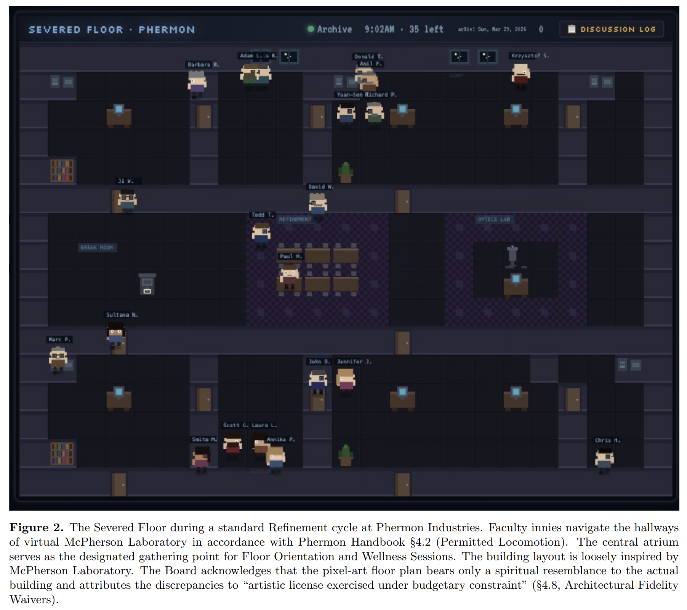
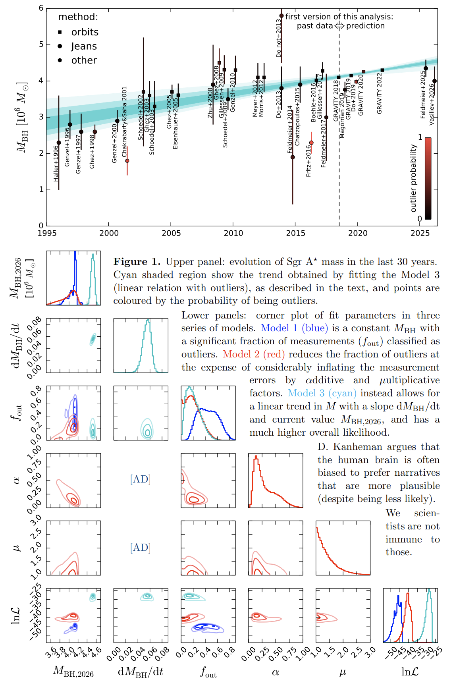
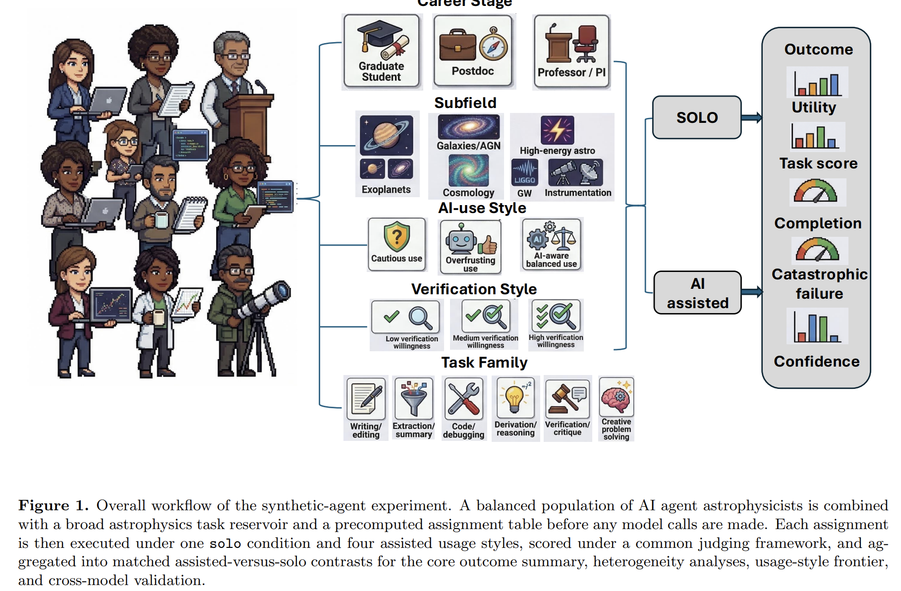
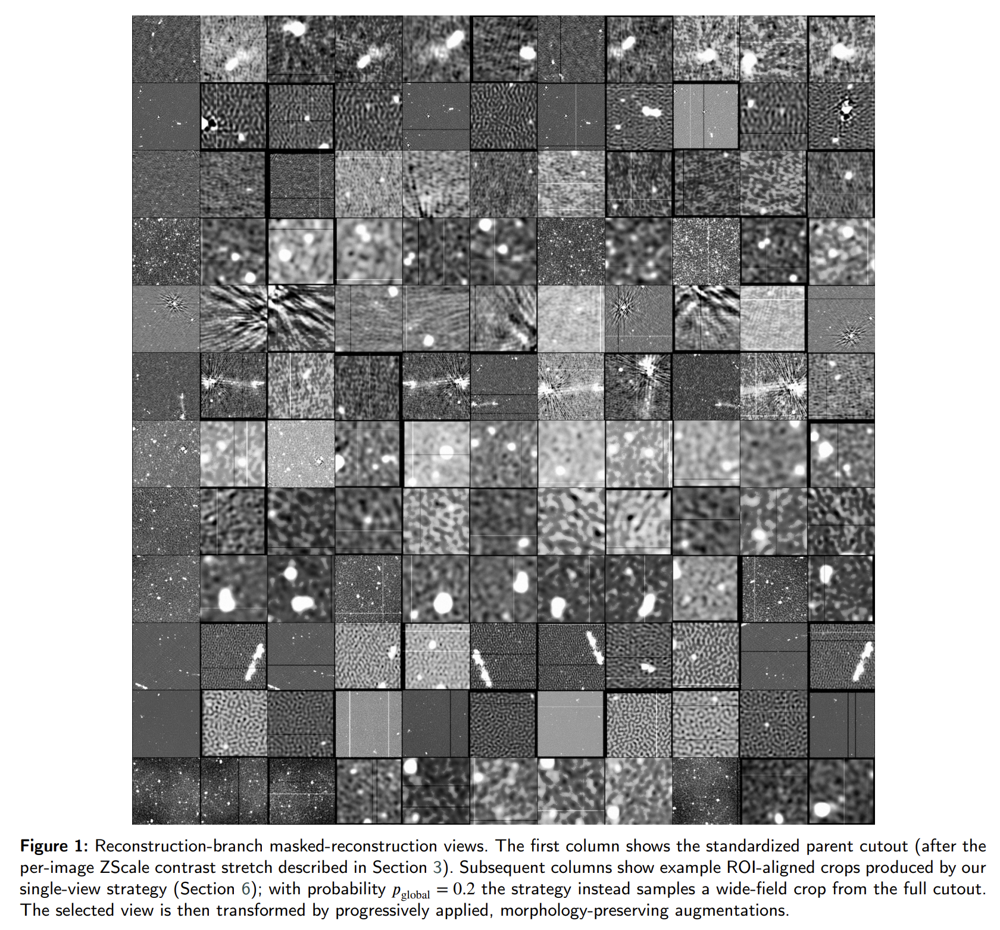
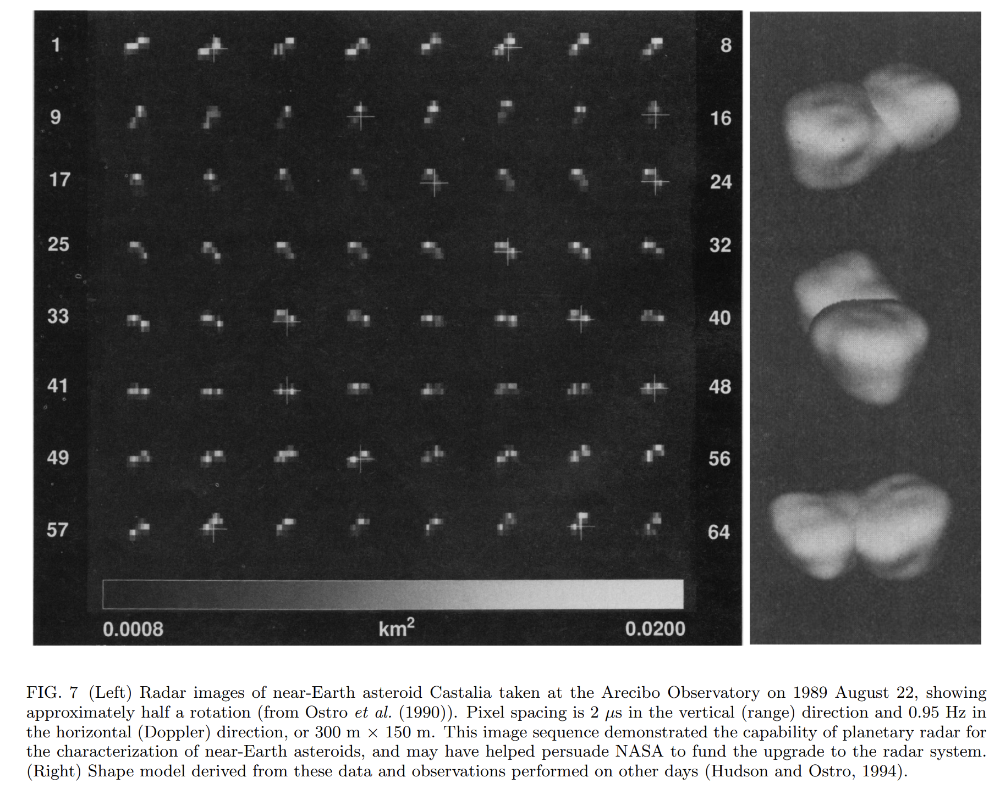
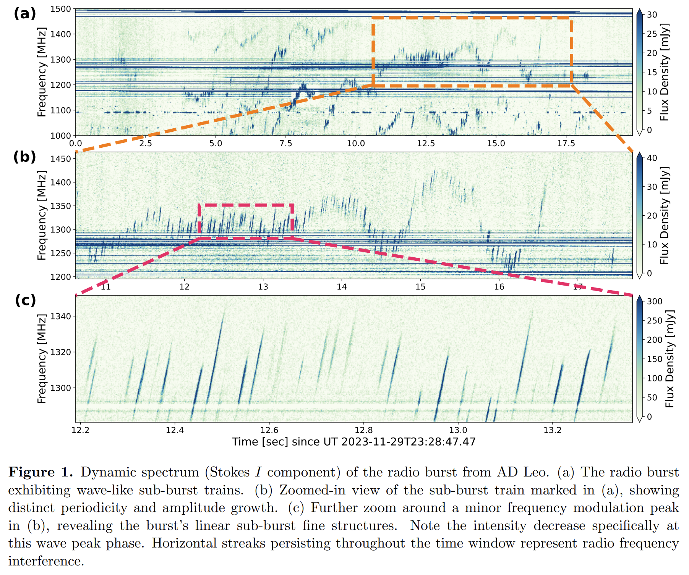
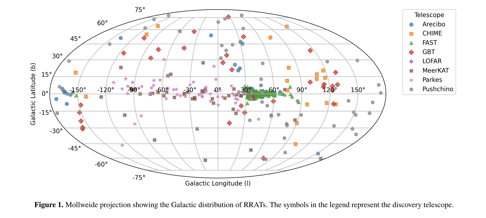
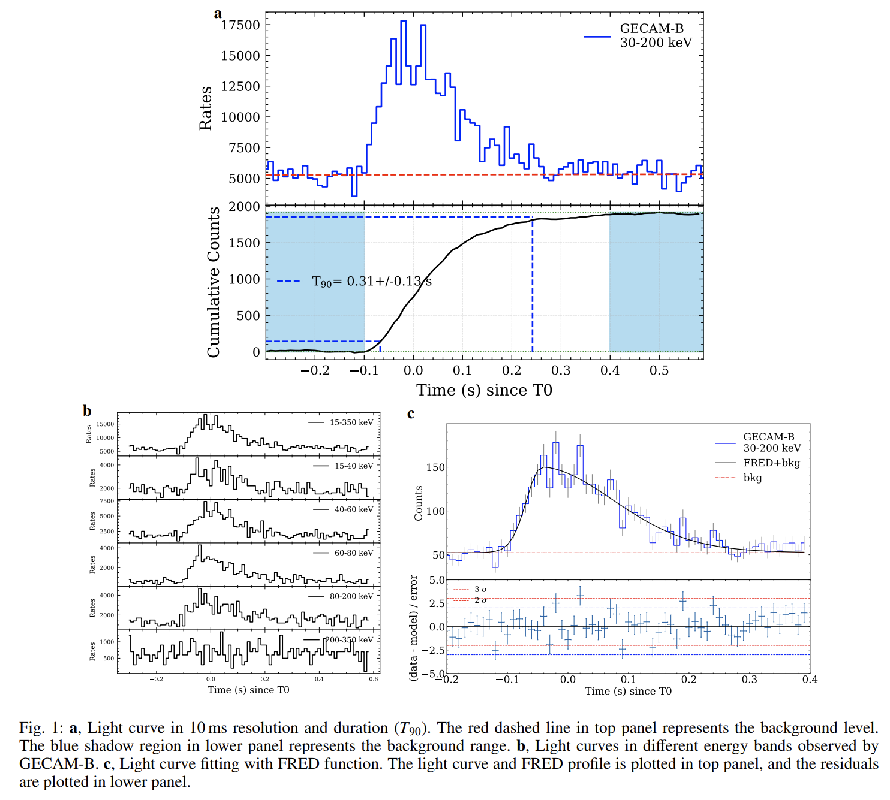

## 2026-04-01

1. [Your Outie Is a Wonderful Astronomer: Macrodata Refinement of the Astro-ph ArXiv Feed at Phermon Industries](https://arxiv.org/abs/2603.29771)

   > Astronomy, ArXiv, April Fools

   一篇把每天读 astro-ph 新论文这件事写成**宏观数据精炼**的愚人节论文。作者提出 [Severed Floor](https://tingyuansen.github.io/severed-floor/) 框架：研究者先做 severance，把自己切成负责上班读 arXiv 的 innie 和不必再操心 astro-ph feed 的 outie；再让这些 innie 在一个像素风虚拟楼层里按专长分论文、讨论图表、写总结邮件。论文甚至说系统已经部署，21 位天文学系成员已经被 severed，并且所有 session 都有回放归档。基本就是把日常文献跟读，包装成一套企业化、戏仿式的论文流水线。

   

2. [Milky Way evolution on a human timescale](https://arxiv.org/abs/2603.29503)

   > Milky Way, Galaxy Dynamics, April Fools

   也是一篇愚人节风格论文。作者假装利用几十年的银河系监测数据，去研究银河系在“人类时间尺度”上的演化，并声称银心黑洞质量、银河棒图样速度、以及太阳到银心距离，都在短短几十年里发生了“惊人的快速演化”。这篇显然是在反讽天文学里“我们只能看到一个时间切片，却总想研究长期演化”这个基本困境。

   

3. [Survey of compact sources for pulsars and exotic objects -- I. Overview and initial discoveries](https://arxiv.org/abs/2603.28885)

   > Pulsar, Radio Survey, Compact Source

   介绍基于射电图像先选候选体、再做脉冲搜索的 SCOPE 巡天。作者用 GMRT 和 GBT 跟进了 31 个致密且陡谱的射电源，报告发现了两颗毫秒脉冲星：J1840+1102 和 J1827-0849。前者是一颗 1.6 ms 的 MSP，位于 Scutum-Centaurus 臂边缘；后者则是此前以为“射电宁静”的伽马脉冲星对应体。论文同时也对整批样本做了形态分类和谱分析，想说明 image-based pulsar survey 也是找脉冲星的一条有效路子。

4. [AI Cosplaying as Astrophysicists: A Controlled Synthetic-Agent Study of AI-Assisted Astrophysical Research Workflows](https://arxiv.org/abs/2603.29039)

   > Astronomy, LLM, Workflow

   用“合成研究者”系统评估 LLM 到底能不能真的提升天体物理研究工作流。作者没有直接做人类实验，而是模拟了 144 个不同职业阶段、不同 AI 使用习惯的 synthetic researchers，在 2592 个日常科研任务上比较单干和 4 种 AI 辅助策略，总共跑出 12960 个 episode。结果是：没有任何一种 AI 辅助策略能在所有任务上都赢过不使用 AI；效果高度依赖任务类型、使用方式以及“研究者”本身。整体结论比较务实：AI 在抽取、创意和批判类任务上可能有帮助，但在推导密集的物理任务上仍然很脆弱。

   

5. [STRADAViT: Towards a Foundational Model for Radio Astronomy through Self-Supervised Transfer](https://arxiv.org/abs/2603.29660)

   > Radio Astronomy, Deep Learning, Foundation Model

   做了一个面向射电天文学图像的自监督 ViT 预训练框架 [STRADAViT](https://huggingface.co/ISSA-ML/stradavit-base)，目标是把不同巡天、不同成像流程下的射电源形态表征统一起来。作者把 MeerKAT、ASKAP、LOFAR/LoTSS 和 SKA 的 512×512 cutout 混在一起继续预训练，再在 MiraBest、LoTSS DR2 和 Radio Galaxy Zoo 上测试迁移效果。

   

   结果显示，两阶段 continued pretraining 的版本整体最好，在线性探测和大多数 fine-tuning 设定下都优于原始初始化；相对强基线 DINOv2，增益不是全面碾压，但在 LoTSS DR2、RGZ DR1 等任务上仍有稳定提升。

## 2026-04-02

1. [Planetary Radar at the Arecibo Observatory](https://arxiv.org/abs/2604.00332)

   > Planetary Radar, Solar System, Review

   一篇 Arecibo 行星雷达的综述，系统回顾了 Gregorian upgrade 之后这套设施对太阳系研究带来的提升。升级后灵敏度提高了约 20 倍，使它在 1997–2020 年间观测到 889 个近地小行星和彗星，而此前 30 年总共只有 40 个；同时还能穿透金星和 Titan 的大气、看进水星和月球的阴影区、并探测月球和火星浅表层。文章按天体类型总结了它在水星极区冰、金星表面、月球火山与撞击坑、火星、土星环和 Titan、以及近地小天体形状、自转、双星结构、Yarkovsky/YORP 效应等方面的关键贡献。Arecibo 行星雷达曾经是太阳系雷达观测里独一档的设施，而现在没有现役或已规划设备能完全替代它。

   

2. [FAST Observations of Wave-like Structures in the Radio Dynamic Spectrum of AD Leo](https://arxiv.org/abs/2604.00457)

   > Stellar Radio Burst, M Dwarf, MHD Wave

   用 FAST 高时间和高频率分辨率观测 AD Leo 的射电暴，在动态谱里发现了带有波状包络的 sub-burst train。作者看到这些窄带、短时长子暴的中心频率、频率漂移率和流量会同时以 1.53 s 的周期调制，其中中心频率与漂移率大致同相、与流量大致反相，而且频率调制振幅还会以约 2.4 s 的 e-folding 时间增长。

   

3. [The RRATalog: a Galactic census of rotating radio transients](https://arxiv.org/abs/2604.01203)

   > Pulsar, RRAT, Population

   构建了一个包含 335 个 RRAT 的最新目录 RRATalog，并基于 4 个 Parkes 巡天里较均一的 RRAT 样本，结合观测选择效应做银河系 RRAT 总体建模。结果表明，RRAT 的径向分布和普通脉冲星相近，但光度函数更陡，幂律指数约为 $\alpha\approx-1.3$；如果只看峰值光度高于 30 mJy kpc$^2$ 且波束指向地球的源，可观测 RRAT 数量约为 $34000\pm1600$，而考虑低光度端 turnover 后，总可观测数量应小于约 7 万个。再加上 beaming 修正，作者估计银河系 RRAT 总数小于约 50 万，对应诞生率小于约每世纪 1.4 个，与银河系核塌缩超新星率并不冲突。论文整体支持一个图景：RRAT 不是必须单独起源的一类怪源，更可能是偏长周期、偏演化后期的中子星群体。

   

## 2026-04-03

1. [The Real and Pseudo Dispersion Measures of FRB 20220912A](https://arxiv.org/abs/2604.01825)

   > Fast Radio Burst, Dispersion Measure, Microshot

   测量FRB20220912A的窄脉冲的DM，说明microshot 和亮窄 burst 是测真实 DM 的好工具，而很多日常 DM 拟合值其实混进了 burst 形态本身带来的假 DM。

2. [GECAM discovery of a peculiar magnetar X-ray burst (MXB 221120) from SGR J1935+2154 associated with a fast radio burst](https://arxiv.org/abs/2604.02261)

   > Magnetar, Fast Radio Burst, X-ray Burst

   报告 SGR J1935+2154 的一次特殊 X 射线暴 MXB 221120，并指出它和一次 FRB 相关联。这个事件由 GECAM-B 在 2022-11-20 触发，同时 KM40m 也探测到了和它时间相关的射电脉冲。光谱方面，这篇最特别的结果是：MXB 221120 的时间积分谱最好由单黑体拟合，温度 $kT\approx18.6$ keV，因此它成了 SGR J1935+2154 里第一例呈现热谱的 FRB 相关 MXB。

   

## 2026-04-06

