## 2026-04-01

1. [Your Outie Is a Wonderful Astronomer: Macrodata Refinement of the Astro-ph ArXiv Feed at Phermon Industries](https://arxiv.org/abs/2603.29771)

   > Astronomy, ArXiv, April Fools

   一篇把每天读 astro-ph 新论文这件事写成**宏观数据精炼**的愚人节论文。作者提出 [Severed Floor](https://tingyuansen.github.io/severed-floor/) 框架：研究者先做 severance，把自己切成负责上班读 arXiv 的 innie 和不必再操心 astro-ph feed 的 outie；再让这些 innie 在一个像素风虚拟楼层里按专长分论文、讨论图表、写总结邮件。论文甚至说系统已经部署，21 位天文学系成员已经被 severed，并且所有 session 都有回放归档。基本就是把日常文献跟读，包装成一套企业化、戏仿式的论文流水线。

   

2. [Milky Way evolution on a human timescale](https://arxiv.org/abs/2603.29503)

   > Milky Way, Galaxy Dynamics, April Fools

   也是一篇愚人节风格论文。作者假装利用几十年的银河系监测数据，去研究银河系在“人类时间尺度”上的演化，并声称银心黑洞质量、银河棒图样速度、以及太阳到银心距离，都在短短几十年里发生了“惊人的快速演化”。这篇显然是在反讽天文学里“我们只能看到一个时间切片，却总想研究长期演化”这个基本困境。

   

3. [Survey of compact sources for pulsars and exotic objects -- I. Overview and initial discoveries](https://arxiv.org/abs/2603.28885)

   > Pulsar, Radio Survey, Compact Source

   介绍基于射电图像先选候选体、再做脉冲搜索的 SCOPE 巡天。作者用 GMRT 和 GBT 跟进了 31 个致密且陡谱的射电源，报告发现了两颗毫秒脉冲星：J1840+1102 和 J1827-0849。前者是一颗 1.6 ms 的 MSP，位于 Scutum-Centaurus 臂边缘；后者则是此前以为“射电宁静”的伽马脉冲星对应体。论文同时也对整批样本做了形态分类和谱分析，想说明 image-based pulsar survey 也是找脉冲星的一条有效路子。

4. [AI Cosplaying as Astrophysicists: A Controlled Synthetic-Agent Study of AI-Assisted Astrophysical Research Workflows](https://arxiv.org/abs/2603.29039)

   > Astronomy, LLM, Workflow

   用“合成研究者”系统评估 LLM 到底能不能真的提升天体物理研究工作流。作者没有直接做人类实验，而是模拟了 144 个不同职业阶段、不同 AI 使用习惯的 synthetic researchers，在 2592 个日常科研任务上比较单干和 4 种 AI 辅助策略，总共跑出 12960 个 episode。结果是：没有任何一种 AI 辅助策略能在所有任务上都赢过不使用 AI；效果高度依赖任务类型、使用方式以及“研究者”本身。整体结论比较务实：AI 在抽取、创意和批判类任务上可能有帮助，但在推导密集的物理任务上仍然很脆弱。

   

5. [STRADAViT: Towards a Foundational Model for Radio Astronomy through Self-Supervised Transfer](https://arxiv.org/abs/2603.29660)

   > Radio Astronomy, Deep Learning, Foundation Model

   做了一个面向射电天文学图像的自监督 ViT 预训练框架 [STRADAViT](https://huggingface.co/ISSA-ML/stradavit-base)，目标是把不同巡天、不同成像流程下的射电源形态表征统一起来。作者把 MeerKAT、ASKAP、LOFAR/LoTSS 和 SKA 的 512×512 cutout 混在一起继续预训练，再在 MiraBest、LoTSS DR2 和 Radio Galaxy Zoo 上测试迁移效果。

   

   结果显示，两阶段 continued pretraining 的版本整体最好，在线性探测和大多数 fine-tuning 设定下都优于原始初始化；相对强基线 DINOv2，增益不是全面碾压，但在 LoTSS DR2、RGZ DR1 等任务上仍有稳定提升。

## 2026-04-02

1. [Planetary Radar at the Arecibo Observatory](https://arxiv.org/abs/2604.00332)

   > Planetary Radar, Solar System, Review

   一篇 Arecibo 行星雷达的综述，系统回顾了 Gregorian upgrade 之后这套设施对太阳系研究带来的提升。升级后灵敏度提高了约 20 倍，使它在 1997–2020 年间观测到 889 个近地小行星和彗星，而此前 30 年总共只有 40 个；同时还能穿透金星和 Titan 的大气、看进水星和月球的阴影区、并探测月球和火星浅表层。文章按天体类型总结了它在水星极区冰、金星表面、月球火山与撞击坑、火星、土星环和 Titan、以及近地小天体形状、自转、双星结构、Yarkovsky/YORP 效应等方面的关键贡献。Arecibo 行星雷达曾经是太阳系雷达观测里独一档的设施，而现在没有现役或已规划设备能完全替代它。

   

2. [FAST Observations of Wave-like Structures in the Radio Dynamic Spectrum of AD Leo](https://arxiv.org/abs/2604.00457)

   > Stellar Radio Burst, M Dwarf, MHD Wave

   用 FAST 高时间和高频率分辨率观测 AD Leo 的射电暴，在动态谱里发现了带有波状包络的 sub-burst train。作者看到这些窄带、短时长子暴的中心频率、频率漂移率和流量会同时以 1.53 s 的周期调制，其中中心频率与漂移率大致同相、与流量大致反相，而且频率调制振幅还会以约 2.4 s 的 e-folding 时间增长。

   

3. [The RRATalog: a Galactic census of rotating radio transients](https://arxiv.org/abs/2604.01203)

   > Pulsar, RRAT, Population

   构建了一个包含 335 个 RRAT 的最新目录 RRATalog，并基于 4 个 Parkes 巡天里较均一的 RRAT 样本，结合观测选择效应做银河系 RRAT 总体建模。结果表明，RRAT 的径向分布和普通脉冲星相近，但光度函数更陡，幂律指数约为 $\alpha\approx-1.3$；如果只看峰值光度高于 30 mJy kpc$^2$ 且波束指向地球的源，可观测 RRAT 数量约为 $34000\pm1600$，而考虑低光度端 turnover 后，总可观测数量应小于约 7 万个。再加上 beaming 修正，作者估计银河系 RRAT 总数小于约 50 万，对应诞生率小于约每世纪 1.4 个，与银河系核塌缩超新星率并不冲突。论文整体支持一个图景：RRAT 不是必须单独起源的一类怪源，更可能是偏长周期、偏演化后期的中子星群体。

   

## 2026-04-03

1. [The Real and Pseudo Dispersion Measures of FRB 20220912A](https://arxiv.org/abs/2604.01825)

   > Fast Radio Burst, Dispersion Measure, Microshot

   测量FRB20220912A的窄脉冲的DM，说明microshot 和亮窄 burst 是测真实 DM 的好工具，而很多日常 DM 拟合值其实混进了 burst 形态本身带来的假 DM。

2. [GECAM discovery of a peculiar magnetar X-ray burst (MXB 221120) from SGR J1935+2154 associated with a fast radio burst](https://arxiv.org/abs/2604.02261)

   > Magnetar, Fast Radio Burst, X-ray Burst

   报告 SGR J1935+2154 的一次特殊 X 射线暴 MXB 221120，并指出它和一次 FRB 相关联。这个事件由 GECAM-B 在 2022-11-20 触发，同时 KM40m 也探测到了和它时间相关的射电脉冲。光谱方面，这篇最特别的结果是：MXB 221120 的时间积分谱最好由单黑体拟合，温度 $kT\approx18.6$ keV，因此它成了 SGR J1935+2154 里第一例呈现热谱的 FRB 相关 MXB。

   

## 2026-04-06

1. [Cosmological Constraints from GW-FRB Associations without Redshift Measurements for LIGO-Virgo and Cosmic Explorer](https://arxiv.org/abs/2604.03163)

   > Fast Radio Burst, Gravitational Wave, Cosmology

   研究引力波和FRB关联事件在没有红移测量时，能不能直接用引力波给出的光度距离 + FRB给出的DM来做宇宙学约束。作者建立了一个不依赖红移的框架，并比较了当前的LIGO-Virgo和未来的Cosmic Explorer，还测试了不同IGM DM分布模型、以及是否计入宿主星系DM的影响。结论是现在的LV灵敏度还不够，基本给不出有意义的约束；但CE时代即使没有光谱红移，也能比较稳地同时约束宇宙学参数和宿主星系DM参数，所以GW-FRB联合有机会变成一类新的精密宇宙学探针。 

## 2026-04-07

1. [The VLBI spectrum of the persistent radio source associated with FRB 20190417A](https://arxiv.org/abs/2604.03429)

   > Fast Radio Burst, Persistent Radio Source, VLBI

   用 EVN 在 5 和 8 GHz 对两个重复暴 FRB 的候选持续射电源做 VLBI 观测，想确认这些源是不是毫角秒尺度上的致密非热源。

   - 在 FRB 20190417A 位置上于 5 GHz 探测到一个 unresolved 的致密源，流量约 $150\pm45,\mu$Jy，而 8 GHz 没有探测到；结合 1.4 GHz 的 VLBI 数据，得到谱指数 $\alpha=-0.19\pm0.29$，基本是平谱。这个源的亮温 $T_b\gtrsim10^{6-7}$ K，说明确实是非热辐射，而且它落在已有的 $L_\nu–|RM|$ 关系上，支持持续射电源来自年轻星云或前向激波的解释。

     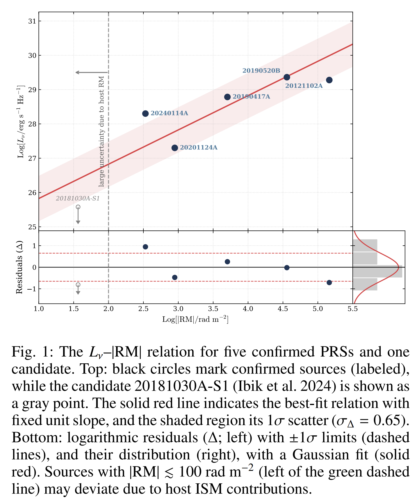

   - 对 FRB 20181030A，则只给出了 5 和 8 GHz 的上限。

2. [LensAgent: A Self Evolving Agent for Autonomous Physical Inference of Sub-galactic Structure.](https://arxiv.org/abs/2604.03691)

   > Strong Lensing, LLM, Dark Matter Subhalo

   提出一个不用训练数据的 LLM agent 框架 [LensAgent](https://github.com/Leo-Fengxt/LensAgent)，目标是自动完成强引力透镜里的质量分布重建和亚结构搜索。它把高层逻辑推理和确定性的物理建模工具绑在一起，用 agent loop 在模型族选择、参数优化和残差驱动的 subhalo 搜索之间反复迭代，并显式结合光谱运动学来缓解 mass-sheet degeneracy。作者把它应用到 20 个 SLACS Grade A 强透镜上，想说明这种“自进化”的 agent 架构有机会把原本高度依赖专家手工拟合的流程自动化，从而服务 LSST 和 Euclid 时代的大样本透镜宇宙学。

3. [Dispersion Measure Distribution of Unlocalized Fast Radio Bursts as a Probe of the Hubble Constant](https://arxiv.org/abs/2604.03769)

   > Fast Radio Burst, Cosmology, Hubble Constant

   不再依赖 FRB 的宿主星系定位和红移，而是直接利用**未定位 FRB 的 DM 分布**来约束哈勃常数。作者从 CHIME Catalog II 里选了 2124 个没定位FRB，建模观测 DM 分布中银河系、宿主星系和宇宙学传播的贡献，得到 $H_0=73.8^{+14.0}_{-12.3}\ {\rm km\ s^{-1}\ Mpc^{-1}}$，1σ 精度大约 18%。

4. [FRB Searches with the Irish LOFAR Station](https://arxiv.org/abs/2604.03283)

   > Fast Radio Burst, LOFAR, Low Frequency

   报告 I-LOFAR 用高频天线在 2020–2022 年间对 6 个已知 FRB 源做低频搜索的结果，总观测时长 218 小时，但在 200 MHz 以下没有找到可信的单脉冲信号。目标包括 SGR 1935+2154、FRB 20180916A、FRB 20190303A、FRB 20200120E 等。文章本质上是一篇 null-result 报告：一方面说明这些源在 I-LOFAR 灵敏度下没有稳定可见的低频爆发，另一方面把相应的相干去色散 filterbank 数据保留下来，供以后做归档研究。

5. [From NVSS to RACS: Identifying truly Compact and Steep spectrum Radio sources](https://arxiv.org/abs/2604.04577)

   > Radio Survey, Pulsar, Steep Spectrum

   用 RACS 的更高分辨率和更好灵敏度，重新检查一批在 TGSS 里致密、但在 NVSS 里没探测到的陡谱射电源候选。作者对 171 个源做图像域形态刻画后，发现其中 66 个确实是致密源，87 个其实是弥散/展宽源，另外 18 个在 RACS 和 NVSS 都没探测到，意味着谱可能陡到 $\alpha<-2$。在那 66 个致密源里，又有 34 个的谱指数比-1.5更陡。论文的核心结论是：过去很多超陡谱致密源其实是被 NVSS 在银盘附近较差的成像质量误判了；现在借助 RACS，可以更干净地筛出真正值得跟进的脉冲星、HzRG 或其他特殊射电源候选。

6. [Fast Radio Burst Dispersion Measure–Timing Cross-Correlations: Bias Self-Calibration and Primordial Non-Gaussianity Constraints](https://arxiv.org/abs/2604.04897)

   > Fast Radio Burst, Cosmology, Primordial Non-Gaussianity

   这篇研究 FRB 的 DM 场怎样拿来约束原初非高斯性 $f_{\rm NL}$，并解决 IGM 电子 bias $b_e$ 和 PNG 信号之间的退化问题。作者提出把 FRB 的 DM 场与多条视线上的 Shapiro timing delay 做互相关 $C_\ell^{D\Delta t}$：DM 追踪的是 $b_e\delta_m$，而 timing delay 直接追踪引力势、与天体物理 bias 无关，因此交叉谱可以内部自校准电子 bias。Fisher 预报表明，把这个交叉谱并入联合分析后，$\sigma(b_e^0)$ 和 $\sigma(f_{\rm NL})$ 都能明显改善，恢复到接近“已知 bias”时的理想水平。也就是说，这篇是在给 FRB 宇宙学加一个 bias self-calibration 方案，让 DM 统计更有机会碰到 inflation 留下的 PNG 信号。

## 2026-04-08

1. [Accurate polarization calibration of FAST spectral data for measurements of Zeeman splittings of OH megamasers in IRAS 02524+2046](https://arxiv.org/abs/2604.05392)

   > OH Megamaser, Polarization, Zeeman Splitting

   给FAST的19波束接收机做了一个适用于 1050–1450 MHz 的Mueller matrix偏振定标方案，把圆偏振标定精度做到约0.01% - 0.08%，明显优于只靠注入参考信号时大约0.2%的残余泄漏。定标星暴星系 IRAS 02524+2046 的OH megamaser观测，发现这个源的OH线比以前认识的更复杂：1667 MHz 发射可能跨越从 $v_{\rm helio}\sim54750$ 到 $\sim53580\ {\rm km,s^{-1}}$ 的宽速度范围，而且总功率谱里混在一起的一些窄线成分，能在圆偏振谱里被分辨出来。最终拟合出 10 个显著的 Zeeman splitting 分量，对应原位磁场大约从 -24.5 mG 到 +20.6 mG，其中大多数是正值。

   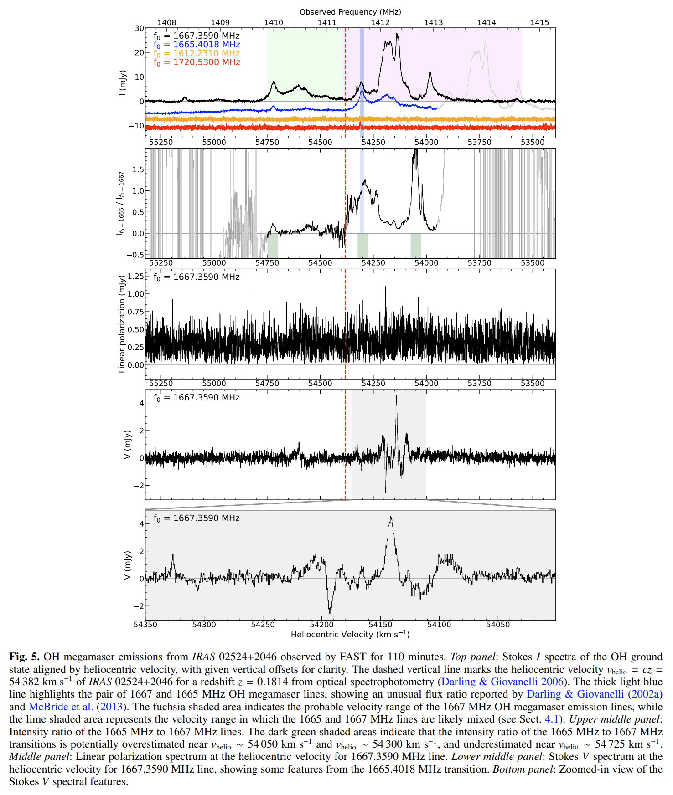

2. [Great Walls of Cosmic Baryons in the Northern Sky](https://arxiv.org/abs/2604.05093)

   > Fast Radio Burst, Baryons, Large-Scale Structure

   用第二版 CHIME/FRB catalog 里的几千个 FRB，直接在北天做额外 DM天空分布图，想看看局域大尺度结构里的重子会不会在 FRB 的色散量里留下空间各向异性。在北天发现了一个最显著的 DM 过量区，位于大约 $\alpha\approx12^{\rm h}$, $\delta\approx55^\circ$，尺度约 $30^\circ$，比全局平均高出约 $150\ {\rm pc\ cm^{-3}}$，显著性超过 $4\sigma$，他们把它叫做 Wall 1；另外在 $\alpha\approx2^{\rm h}$, $\delta\approx45^\circ$ 还有一个更弱的 Wall 2。Wall 1 和 Ursa Major supercluster 一带在空间上对得上，Wall 2 则和 Perseus-Pisces supercluster 有对应关系。作者还检查了 Galactic DM 模型、银河系 halo 各向异性、抽样和 jackknife 等影响，认为这些都不足以解释 Wall 1 的信号。

   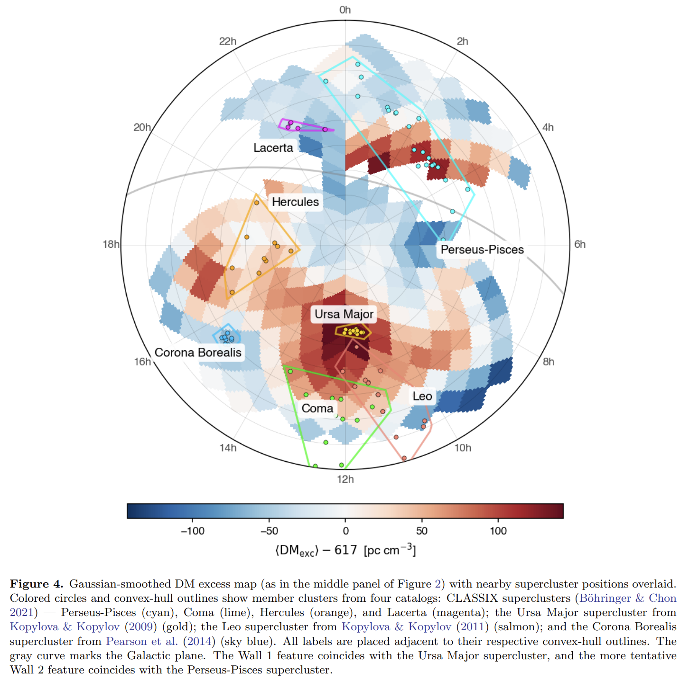

## 2026-04-09

1. [No Period Change in Two Long-Period AM CVn Binaries](https://arxiv.org/abs/2604.06460)

   > AM CVn, Binary, Gravitational Wave

   对两颗长周期 AM CVn 食双星 YZ LMi 和 Gaia14aae 做长期测量，检验它们的轨道周期变化。两者的轨道周期分别约为 28.3 分钟和 49.7 分钟，观测基线分别从 2006 年和 2015 年开始。结果发现，这两个系统的 $ \dot P $ 在 $2\sigma$ 内都与 0 一致。这说明在这些较长周期的 AM CVn 系统里，并没有看到比引力波辐射强很多的额外角动量损失。

2. [Euclid Quick Data Release (Q1) AgileLens: A scalable CNN-based pipeline for strong gravitational lens identification](https://arxiv.org/abs/2604.06648)

   > Strong Lensing, CNN, Euclid

   这篇文章给 Euclid Q1 数据做了一个端到端的强引力透镜自动搜索流水线 AgileLens。流程从 VIS catalog 出发，先剔除点源、对前景透镜星系施加 $I_E\le 24$ 的星等切，再做像素级伪影/噪声过滤，构建 96×96 cutout，并把 VIS 和 NISP 合成为保留 VIS 形态、同时体现 NISP 颜色对比的彩图。模型方面，作者比较了 6 种紧凑 CNN，最后发现改造过的 VGG16 最好；再经过 3 轮迭代微调后，对最终模型排前 4000 的候选做人工分级，得到 441 个 Grade A/B 候选透镜，其中 311 个和已有 Q1 强透镜目录重合，另外还新增了 130 个此前未报告的 A/B 候选。整体上，这篇是在说明：用一个相对轻量、可扩展的 CNN 流程，就能在 Euclid 这样的超大样本里高效捞出强透镜，并且足够容易扩展到后续更大面积的数据发布。

3. [LightCurveLynx: Forward Modeling of Time-Domain Surveys with Application to ZTF SN Ia DR2](https://arxiv.org/abs/2604.07134)

   > Supernova, Simulation, Time Domain

   发布一个面向时域巡天的端到端前向模拟框架 [LightCurveLynx](https://github.com/mi-dai/lightcurvelynx_ztf_sims)，用来生成真实感较强的光变曲线模拟。这个 Python 框架是模块化的：可以从参数先验、物理模型、观测时刻与波段、观测效应到噪声模型一路往前推。作者用它做了一个 ZTF SN Ia DR2 的 Ia 型超新星模拟样本，并把模拟结果和真实数据做了细致比较。结果显示，模拟和观测在参数分布上吻合得很好，Kullback-Leibler divergence 大约在 0.01–0.02。

## 2026-04-10

1. [Detection and Evolution of Linear Polarization of the Galactic Center Transient MAXI J1744-294](https://arxiv.org/abs/2604.07431)

   > Polarization, X-ray Binary, Radio, Transient, Observation

   报告银河中心暂现源 MAXI J1744−294 的首次射电线偏振探测，并跟踪了 2025-04-04 到 04-09 四个历元的偏振演化。作者在 33 和 43 GHz 上拟合 Stokes (Q, U) 后，得到一个共同的法拉第屏,约为 $RM=-63606^{+844}_{-861}\ {\rm rad\ m^{-2}}$，是银河系里已知第三大的 RM。这个值和银河中心磁星 PSR J1745−2900 很接近，因此支持 MAXI J1744 确实位于银河中心区域、受 Sgr A* 引力束缚。作者还在 4 月 6 日看到一个额外的偏振分量，对应再多一个约 $-6000\ {\rm rad\ m^{-2}}$ 的 RM；如果把它解释成喷流里的短寿命 knot，其局域磁场大约是 15–30 G。

   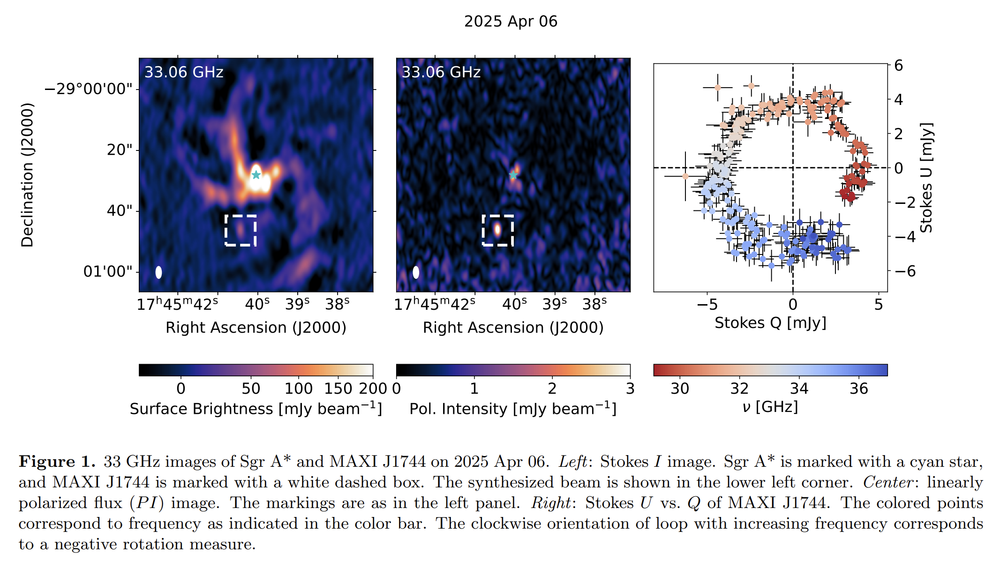

2. [ASTRAFier: A Novel and Scalable Transformer-based Stellar Variability Classifier](https://arxiv.org/abs/2604.07437)

   > Stellar, Variable, Transformer, TESS, Deep Learning

   提出一个新的恒星变源分类模型 [ASTRAFier](https://github.com/jeraud/TESS-Transformer)，把 Transformer、BiLSTM 和 CNN 结合起来，输入原始时序光变而不依赖手工特征工程。作者分别在 Kepler 和 TESS 光变上训练和验证，分类准确率达到 94.26% 和 88.22%。同时，他们把模型实际部署到 TESS sectors 14、15、26 的约 280 万条 QLP 光变上，并发布了对应的变星候选目录。

   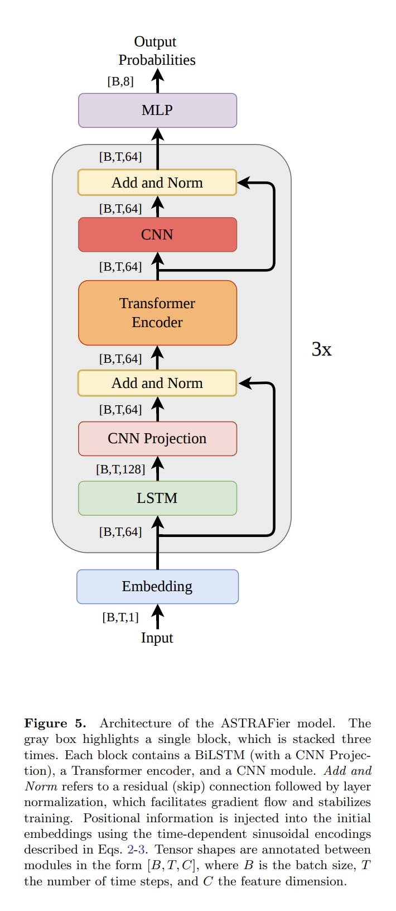

3. [The ZTF-ULTRASAT experiment: Characterizing the non-transients in ULTRASAT’s high cadence survey](https://arxiv.org/abs/2604.07573)

   > ULTRASAT, High-cadence Survey, Variable Star

   为了给 ULTRASAT 的高频次紫外巡天做准备，作者用 ZTF 做了一个三晚的模拟实验，观测了 5 个靠近 ULTRASAT 北天高频次场的区域，测试未来 transient 搜索里会被什么“非暂现源”污染。实时筛选一共捞出 7 个候选，其中 5 个其实是持续变源，另外 2 个是伪警报。再结合 ZTF 的 SCoPe 变源分类结果，作者发现这里面有 3 个是短周期、高振幅的 RR Lyrae，另外 2 个表现出 flare 行为。结论很直接：高频次巡天里，短时标高振幅变星很容易伪装成 transient alert，因此最好在 real-time 过滤里结合已有的机器学习变源目录，提前把这类污染压下去。

4. [The Stack Search Tests on FAST Data: Discovery of Six Faint Isolated Millisecond Pulsars in NGC 6517 and NGC 7078 (M15)](https://arxiv.org/abs/2604.08268)

   > Millisecond Pulsar, Globular Cluster, Search Method

   用 FAST 的多历元数据做 power spectrum stacking，在 NGC 6517 里找到 4 颗新 MSP（NGC 6517S–V），周期约 3.68–6.02 ms；在 M15 里找到 2 颗（M15M 和 M15N），周期约 4.83 和 9.28 ms。M15N、NGC 6517U 和 NGC 6517V 用普通 PRESTO 频域搜索和 FFA 都没找出来。

   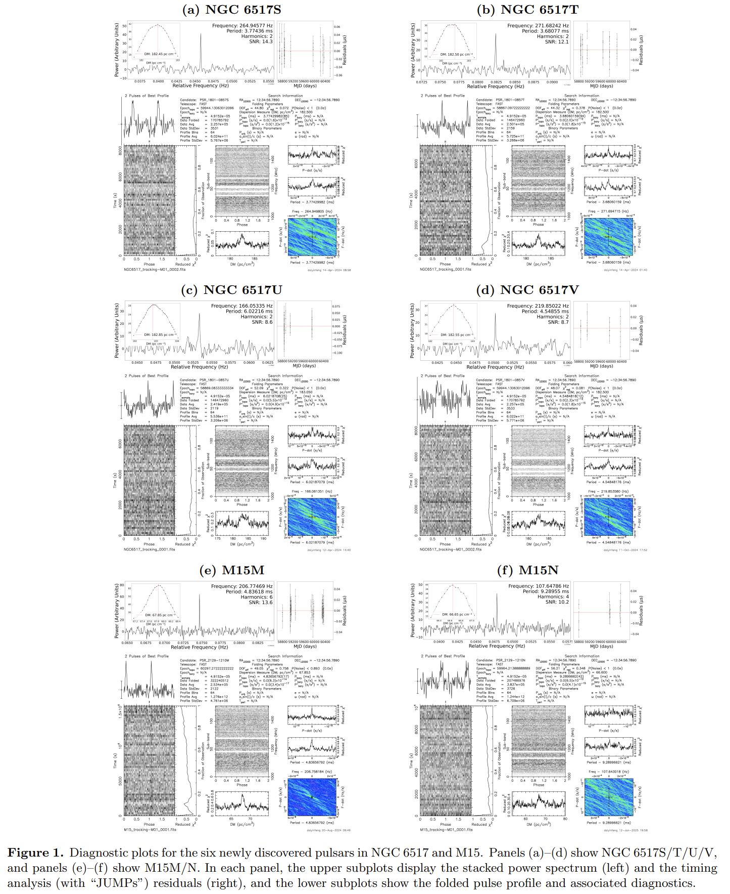

5. [Expansion kinematics of young clusters. III. The kiloparsec sample](https://arxiv.org/abs/2604.08422)

   > Young Cluster, Gaia, Kinematics

   用 Gaia DR3 五参数天体测量加上校准过的径向速度，系统研究 23 个距离 1 kpc 内、年龄小于 60 Myr 的年轻星团的空间结构和膨胀运动。作者发现，大多数年轻星团在中心区域更平滑，但稀疏外层的层级结构可以存活到 10 Myr 以上；同时，多数样本在天球面上都显示出明显膨胀，而且常常是各向异性的，这种各向异性在 30 Myr 以上的星团里仍然常见。由膨胀得到的运动学年龄和等时线年龄在小于 10 Myr 的年轻样本里通常一致，但很多年龄更老的星团显示出明显更年轻的运动学年龄。作者据此认为，这些星团大多不是由致密、单块的团簇简单膨胀而来，而更可能一开始就带有显著的空间和运动学子结构。

   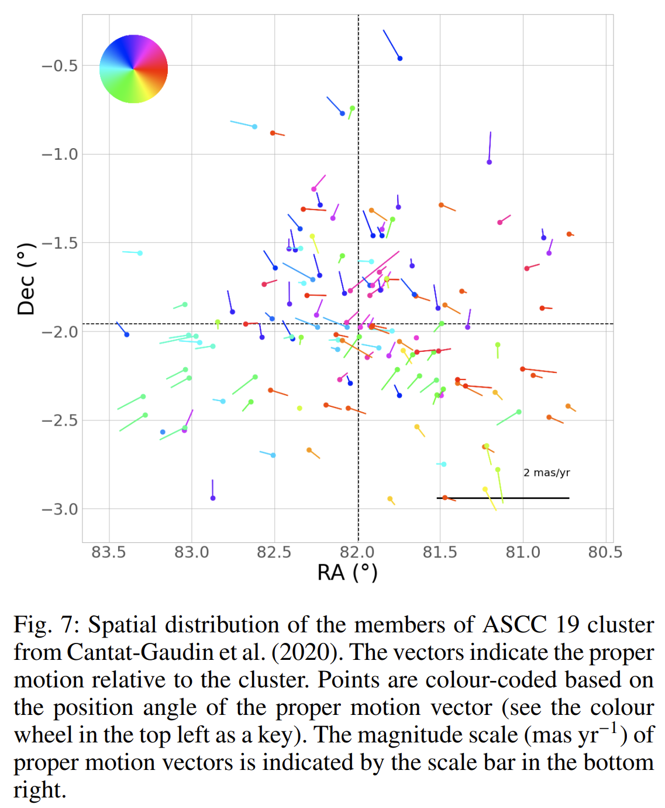

## 2026-04-13

1. [Radio Astronomy with the Arecibo 305m Telescope: In Contemporaneous Context](https://arxiv.org/abs/2604.08775)

   > Radio, Arecibo, Review

   文章按时间梳理了 Arecibo 在类星体时代早期射电源定位、月掩星和行星际闪烁、脉冲星与双中子星、HI 与 OH 谱线、毫秒脉冲星与系外行星、Gregorian upgrade 之后的高频观测、ALFA 巡天、SETI、VLBI 等方面的关键贡献。

2. [The Northern High Time Resolution Universe pulsar survey III. Single-pulse search continuation, follow-up observations, and initial results](https://arxiv.org/abs/2604.09080)

   > Pulsar, Single-pulse Search, FRB

   继续处理北天 HTRU 巡天里的 single-pulse 数据，目前搜索完成度约 21%，并给出了第一批结果。最亮眼的发现是 Effelsberg 100 米望远镜的第一例 FRB 20110220A，最优 DM 约 501.0 pc cm$^{-3}$，宽度 $11.9\pm3.5$ ms，流量约 $0.6\pm0.1$ Jy ms。除此之外，作者还拿到了 RRAT J2028+28 的首个 L 波段探测、发现了一颗新的 RRAT J0404+53，并找到了 8 组新的 single-pulse train 和 272 个很暗的孤立 single-pulse 候选。

   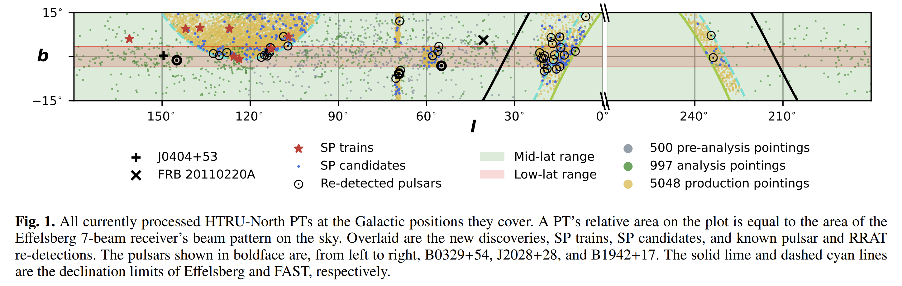

3. [Radio Monitoring Campaign of Active Repeater FRB 20220912A with CHIME](https://arxiv.org/abs/2604.09098)

   > Fast Radio Burst, Repeater, Monitoring

   用 CHIME/Pulsar 对高活跃重复暴 FRB 20220912A 做了约 1.5 年的长期监测，累计约 200 小时，分析了 400–800 MHz 里 828 个 burst。结果显示，这个源在发现后大约 10 周内一直很活跃，并且等待时间分布是双峰的。环境演化方面，他们报告了一个 2.3σ 的 DM 线性增加趋势，约 $1.4\pm0.6\ {\rm pc\ cm^{-3}\ yr^{-1}}$，但 RM 没看到显著变化。

   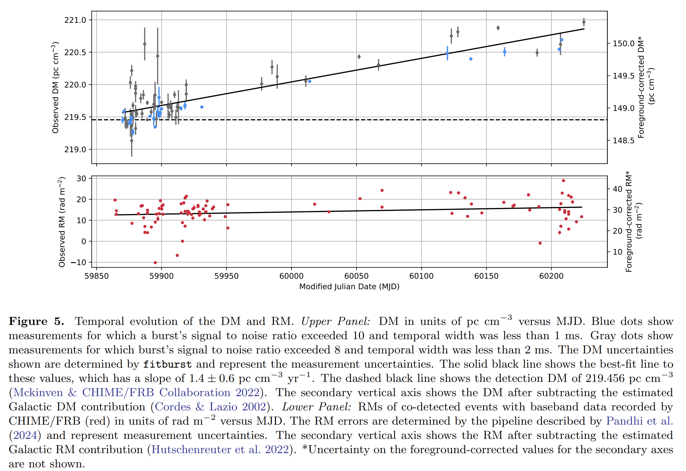

4. [Long-period transiting exoplanets: advances in detection and characterization](https://arxiv.org/abs/2604.09254)

   > Exoplanet, Transit, Review

   这是一篇关于长周期凌星系外行星的综述，重点讲过去几年在“怎么找”和“怎么做深入刻画”上的进展。相比容易发现但受恒星强烈照射的 hot Jupiter，长周期的 warm/temperate planets 更接近形成和迁移后的原始状态，因此对理解行星形成、盘迁移和轨道演化更关键。

   内容上主要包括：TESS 时代的 monotransit/duotransit 搜索方法、单次凌星如何结合恒星密度去估轨道周期、后随光谱与测光如何补全质量和半径，以及这些长周期行星在内部结构、整体金属丰度、大气成分、卫星和行星环搜索方面的科学价值。

5. [Machine Learning as a Transformative Tool for (Exo-)Planetary Science](https://arxiv.org/abs/2604.09152)

   > Exoplanet, Planetary Science, Machine Learning, Review

   这是一篇综述性质的章节，讨论机器学习怎样在行星科学和系外行星科学里变成方法学层面的基础工具。作者把应用大致分成三类挑战

   - sequence modelling，比如处理径向速度和光变这类一维时序数据
   - pattern recognition，比如用卷积网络做图像和空间模式提取、异常检测、无监督聚类
   - generative models 和 emulator-based Bayesian analysis，比如给行星内部结构、形成演化和数值模拟做快速代理模型。

   文章的重点不是提出单个新算法，而是总结 NCCR PlanetS 团队在这些方向上的代表性做法，并说明 ML 正在如何改变异构、大规模、高维数据以及高代价物理模型的处理方式。

## 2026-04-14

1. [Learning What’s Real: Disentangling Signal and Measurement Artifacts in Multi-Sensor Data, with Applications to Astrophysics](https://arxiv.org/abs/2604.09787)

   > Astronomy, Foundation Model, Representation Learning

   把“不同仪器看到的同一个天体”当成天然自监督配对，可以学到更接近真实物理的表征。作者用同一个星系被不同巡天重复观测的数据，训练一个 dual-encoder + counterfactual generation 模型：一个编码器学物理本征信息，另一个编码器学仪器系统学和噪声，再通过条件生成去重建目标图像。文章用 DESI Legacy Imaging Survey 和 HSC 的星系图像做例子，说明这种表示学习可以支持跨仪器的 counterfactual 图像生成、去除测量混淆后的参数推断，以及仪器无关的相似源检索。

   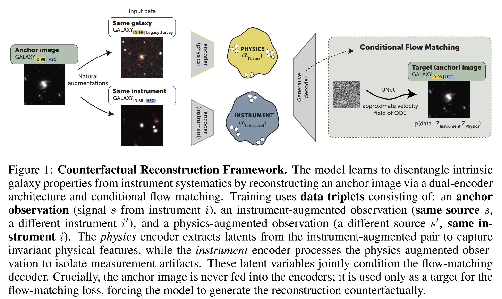

2. [To understand the radiative processes of pulsars and fast radio bursts with the FAST](https://arxiv.org/abs/2604.09987)

   > Pulsar, Fast Radio Burst, Review

   这是一篇围绕 FAST 观测成果展开的综述，核心目标是借助 FAST 近年来在脉冲星和 FRB 上的突破，重新审视**相干射电辐射机制**这个老问题。文章一方面总结了 FAST 在银河面脉冲星巡天、RRAT、毫秒脉冲星、单脉冲行为、偏振和脉冲形态等方面的关键结果；另一方面也回顾了 FAST 对重复暴 FRB 的高灵敏度观测，强调 pulsar 和 FRB 两类源在单脉冲现象学上的相似性，为统一理解相干辐射物理提供了新视角。

3. [Daily Predictions of F10.7 and F30 Solar Indices with Deep Learning](https://arxiv.org/abs/2604.10045)

   > Solar, Space Weather, Deep Learning

   提出一个深度学习模型 [SINet](https://nature.njit.edu/solardb/)，做太阳 F10.7 和 F30 指数的**日尺度中期预报**，预报时长覆盖 1 到 60 天。作者使用 NOAA 以及 Toyokawa/Nobeyama 的历史数据训练模型，并把它和 5 种相关的统计或深度学习方法比较。结果显示，SINet 在 F10.7 预测上整体优于这些基线；同时它也是作者所称的第一种针对 F30 的深度学习预测方法。到第 60 天时，SINet 对 F10.7 和 F30 的平均 MAPE 分别约为 10.1% 和 9.5%。

   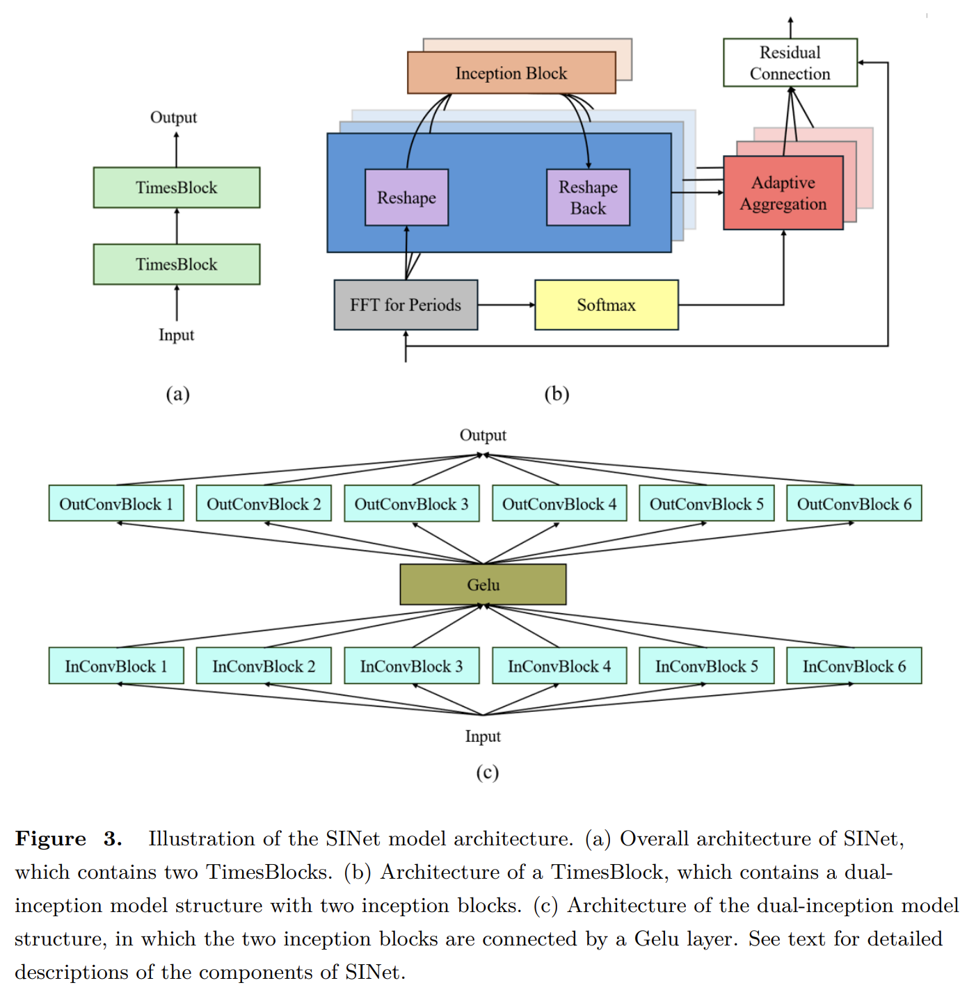

4. [A Multi-modal Fusion Network for Star-Galaxy Classification from CSST Simulated Datasets](https://arxiv.org/abs/2604.10086)

   > Galaxy, Classification, Deep Learning, CSST

   用 CSST 模拟数据做星/系分类，并把**图像**和**测光 catalog** 两种模态融合进一个网络里。作者构建了一个包含 32,371 颗恒星和 93,525 个星系的数据集，用 ResNet-50 处理图像，用 BiLSTM 处理 catalog 特征，再在高层做特征融合。结果显示，经过 50 个 epoch 训练后，模型对星系和恒星的 recall 分别达到 99.81% 和 99.66%。作者还专门检查了数据增强和多模态融合的作用，并指出这个模型对暗弱天体和高红移星系也仍然有较高准确率。

5. [Joint Observation of SGR J1935+2154 with Insight-HXMT and KM40m during the active episode of October 2022](https://arxiv.org/abs/2604.10131)

   > Magnetar, Fast Radio Burst, X-ray Burst

   报告 2022 年 10 月 SGR J1935+2154 活跃期里，Insight-HXMT 和 KM40m 的联合观测结果。作者在两台设备重叠观测时间内一共找到了 60 个 magnetar X-ray burst，但只探测到 1 个射电脉冲；其中 2022-10-21 的一个 X 射线暴（MXB 221021）和这个射电脉冲在时间上相关联。论文强调，这个关联事件的形态与此前著名的 MXB/FRB 200428 很不一样，而且系统比较后发现，和没有射电对应体的普通 MXB 相比，MXB 221021 在时域和能谱性质上也有一些特别之处。核心意思是：磁星不是每次 X 射线暴都会伴随射电暴，而“会出射电”的那一类 X 射线暴可能本身就有不同的物理条件。

   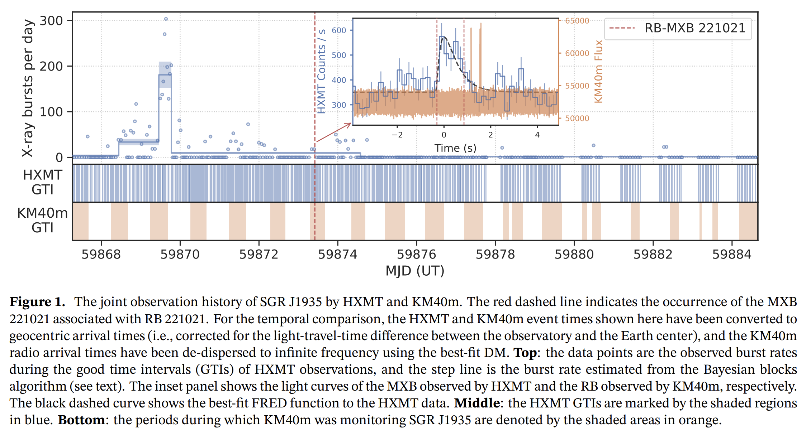

6. [Searching for Gamma Ray Bursts associated with CHIME Fast Radio bursts](https://arxiv.org/abs/2604.10629)

   > Fast Radio Burst, Gamma-Ray Burst, Association

   系统搜索 CHIME 第二版 FRB catalog 和 Swift GRB 之间是否存在时空关联。和以前只用位置误差椭圆不同，这篇直接用了 CHIME 提供的**完整 localization probability maps** 来做空间交叉匹配，因此先找到了 130 对候选体；再加上红移一致性要求后，缩减到 45 对；最后再施加一个有物理动机的时间顺序条件——要求长暴在前、短暴在后——只剩 26 对。作者用 Monte Carlo 模拟评估后发现，这些候选的总体过量并没有统计显著性，各个 localization confidence level 上的分布也和随机结果一致。结论就是：目前还看不到可靠的 FRB–GRB 总体关联信号，但这个问题很可能被定位误差和大量偶然重合淹没了。

7. [A Falsifiable Timing Test for the Double-White-Dwarf Model of Long-Period Transients](https://arxiv.org/abs/2604.11317)

   > LPT, White Dwarf Binary, Timing, Theory

   针对新近出现的长周期射电暂现源（LPT），提出一个可证伪的**双白矮星模型计时检验**。作者以 CHIME/ILT J1634+44 为例：它有 841 s 的短周期、4206 s 的长周期调制，以及显著的负周期导数，这些性质让超紧致双星解释很有吸引力。如果把 841 s 看成轨道钟、4206 s 看成 spin-orbit beat，那么这个长周期调制就不再是自由参数，而必须和轨道周期、自转周期一起随引力波损失、磁耗散和潮汐相互作用共同演化。文章估计，对 J1634 这类参数，beat 周期漂移大约有 $|\dot P_b|\sim10^{-10}\ {\rm s,s^{-1}}$，对应一年内 O-C 漂移可达几十秒。也就是说，只要后续把短周期、长周期及其导数都量准，就能对超紧致双白矮星起源做一个非常直接的 timing falsification test。

   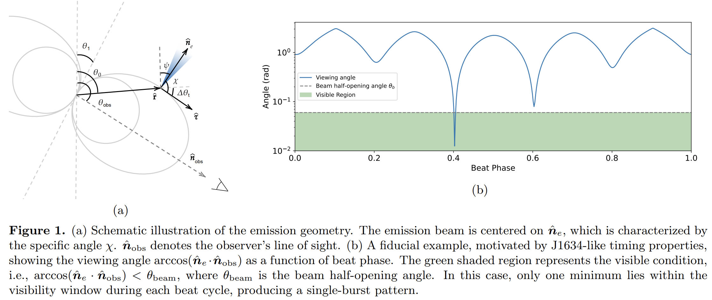

## 2026-04-15

1. [A sample of short-lived Galactic radio transients from ASKAP VAST](https://arxiv.org/abs/2604.11881)

   > Transient, ASKAP, White Dwarf Binary, Survey

   用 ASKAP 的 VAST 巡天在银河平面里系统搜索射电暂现源，最终新找到 6 个和以往 GCRT/GRT 类似的 Galactic radio transients。结合档案数据后，作者认为这些源大致可分成两类：一类是分钟级、脉冲式的 sporadic radio emission；另一类是持续数周的 flare-like outburst。论文进一步把短时变那一类和已有的 optically bright long-period radio transients 联系起来，猜测它们可能来自宽轨道白矮星双星；而长时标爆发那一类，则可能和被尘埃遮挡的白矮星双星爆发现象有关。

   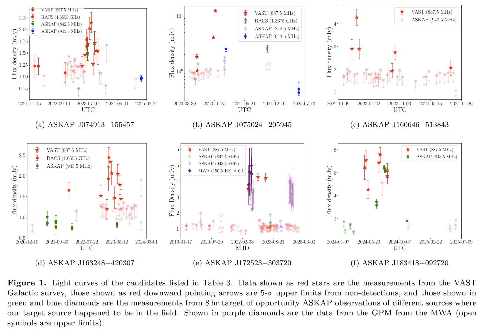

2. [Probing Collapsed Dark Matter Halos with Fast Radio Bursts](https://arxiv.org/abs/2604.12189)

   > Fast Radio Burst, Dark Matter, Gravitational Lensing

   这篇文章提出用 FRB 的强引力透镜效应来探测 **core-collapsed SIDM halo**。如果暗物质有自相互作用，halo 在经历 gravothermal core collapse 之后会形成比标准 CDM 更陡的中心密度分布，这会增大透镜截面，并让 FRB 多像之间的时间延迟更长。

3. [FRTSearch: Unified Detection and Parameter Inference of Fast Radio Transients using Instance Segmentation](https://arxiv.org/abs/2604.12344)

   > Fast Radio Burst, Deep Learning

   [FRTSearch](https://github.com/BinZhang109/FRTSearch)用Mask R-CNN分割动态谱中的DM信号曲线，配合 IMPIC 算法把几何轨迹坐标反推出 DM 和 ToA。结果显示，在 FAST-FREX 基准上，FRTSearch 的 recall 达到 98.0%，相比 PRESTO 的误报数降低了 99.9% 以上，同时处理速度最高快到 13.9 倍；无需重训就成功检出了 ASKAP 的 19 个测试 FRB。

   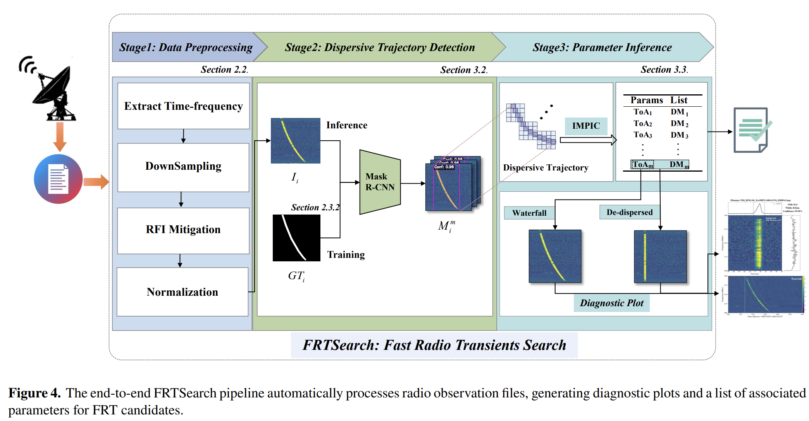

4. [Gravitational Gertsenshtein–Zel’dovich mechanism for the Association between GW190425 and FRB 20190425A](https://arxiv.org/abs/2604.12775)

   > Fast Radio Burst, Gravitational Wave, Magnetar, Theory

   针对 GW190425 和 FRB 20190425A 那个 2.5 小时延迟的候选关联，提出一个替代于 “supramassive neutron star collapse” 的新物理机制。作者设想：在双中子星并合点约 2.5 光时之外，恰好有一颗 magnetar。并合产生的 kHz 引力波先到达这颗磁星，在其强磁场里通过 Gertsenshtein–Zel’dovich 效应转化成 kHz 电磁波；然后这些低频电磁波再被相对论粒子做逆康普顿散射，提升到 GHz 波段，形成观察到的 FRB。地球直接先收到 GW，另一束 GW 传播到磁星后再“转手”生成 FRB，所以自然得到约 2.5 小时延迟。

   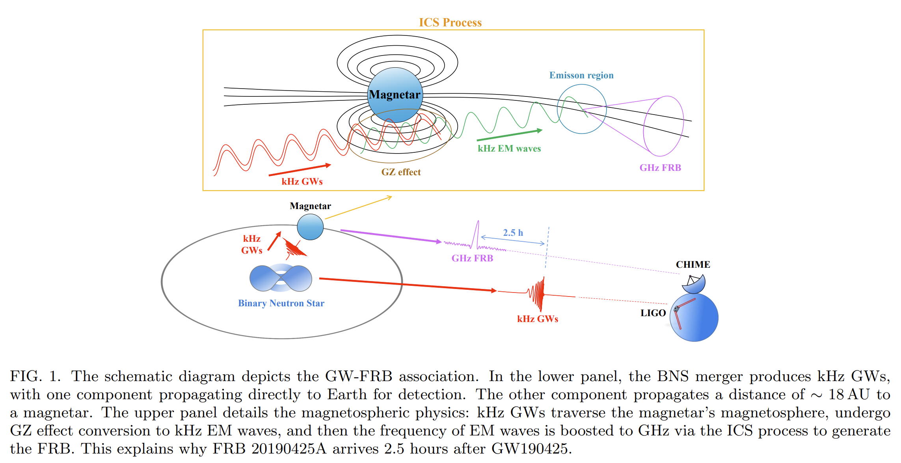

5. [The spectrum of the persistent radio source associated with FRB 20190417A](https://arxiv.org/abs/2604.12791)

   > Fast Radio Burst, Persistent Radio Source, Spectrum

   这篇文章系统测量了 FRB 20190417A 对应持续射电源的宽频谱，频率覆盖从 144 MHz 到 6 GHz。作者结合 uGMRT、VLA、VLASS 和 LoTSS 数据发现，这个 PRS 在 GHz 频段基本服从幂律谱，1–6 GHz 的谱指数约为 $\alpha = 0.20 \pm 0.05$，但在 144 MHz 没有探测到，因此把低频 turn-over 频率限制在 >370 MHz（95% 置信度）。这意味着它是一个相对平坦谱、并且在低频发生自吸收或吸收截断的源。作者将其与 magneto-ionic nebula 尤其是年轻 flaring magnetar 在超新星抛射物后方吹起的 nebula 模型进行比较，认为这种解释是相容的；在 multi-zone magnetar wind nebula 图景下，他们估计该源年龄 t<250 年、半径 R<0.4 pc。

   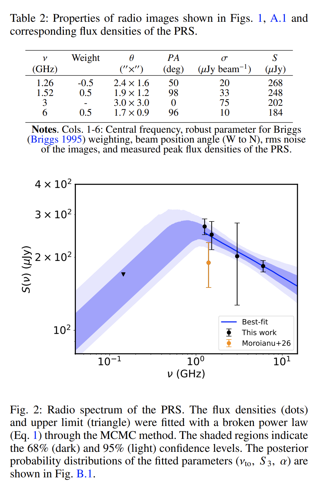

## 2026-04-16

1. [BROOM: a python package for model-independent analysis of microwave astronomical data](https://arxiv.org/abs/2604.14088)

   > CMB, Component Separation, Software

   发布一个做微波天文数据盲源分离的 Python 包 [BROOM](https://github.com/alecarones/broom)，核心是把各种 ILC / NILC / GILC 一类的 minimum-variance 方法系统化，既能重建 CMB、SZ 和 foreground moments，也能做微波天空模拟、估计残余前景污染、计算角功率谱。

   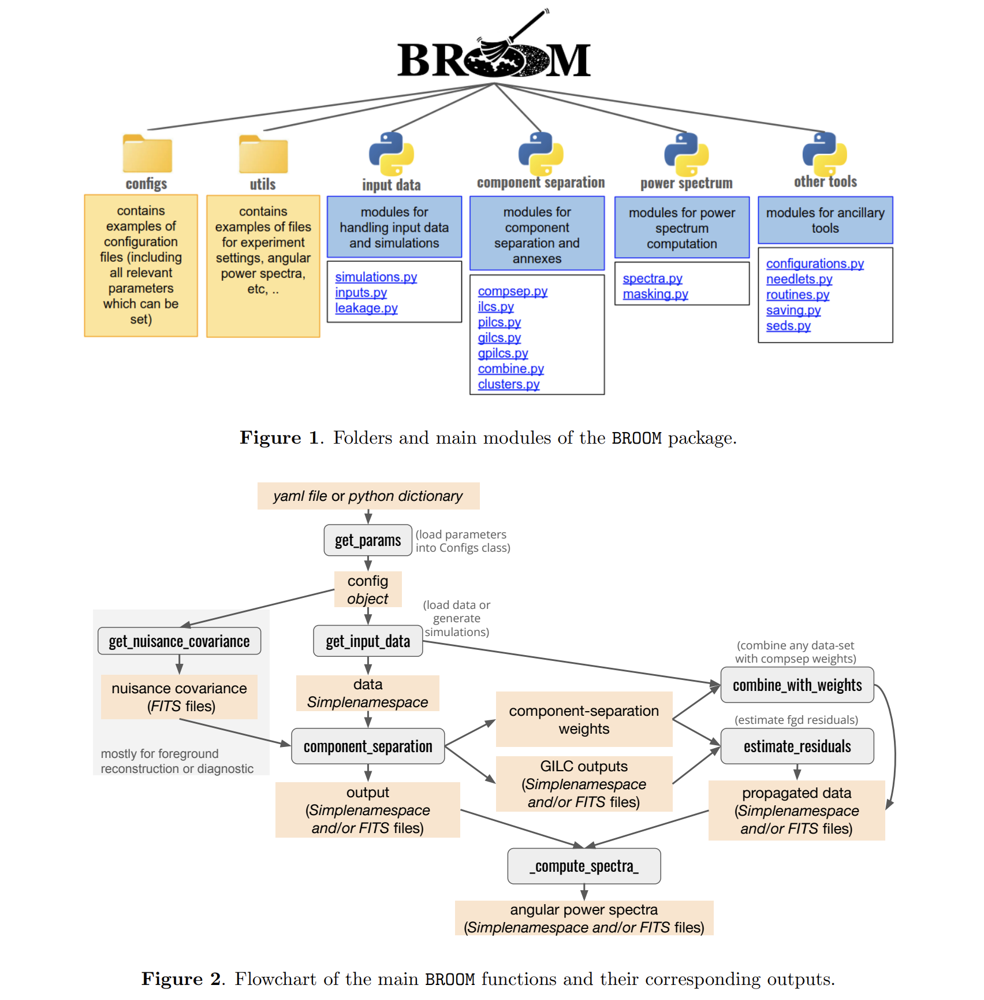

2. [The 256-antenna Coherent All-Sky Monitor](https://arxiv.org/abs/2604.13903)

   > Fast Radio Burst, Radio Instrumentation, Aperture Array

   介绍正在 OVRO 部署的 256 天线 Coherent All-Sky Monitor（CASM-256），工作在 375–500 MHz，是一个大视场、全数字、实时 GPU 处理的低频 aperture array。它的目标很明确：用大约 (10^4) 平方度的视场和较高点源灵敏度，系统寻找本地宇宙 FRB、银河系 FRB analog、脉冲星 giant pulse 以及长周期射电暂现源，并已经展示了前两打天线的 on-sky 数据和实时 FRB 搜索流水线。文章还特别强调这套思路的可扩展性，认为未来扩展到上万天线后，有机会探测到百万级 FRB。

   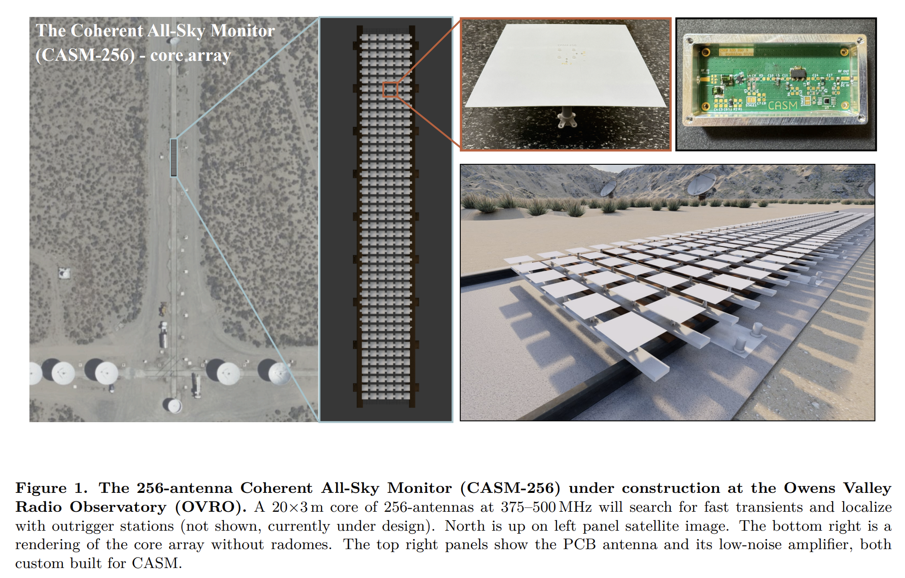

3. [Requiem for a belt: A spatial and kinematical reinterpretation of Gould’s Belt in light of Gaia](https://arxiv.org/abs/2604.13225)

   > Gaia, Gould’s Belt, Local Structure

   用 Gaia DR3 的年轻大质量恒星和近邻年轻星团重新审视 Gould’s Belt，结论相当直接：它不像一个真实存在的、统一的、倾斜膨胀旋转环，而更像是几个星团家族——主要是 αPer、Cr135、M6 和 γVel——在本地银河环境里碰巧排成的一个 3D asterism。作者指出，经典上归因于 Gould’s Belt 的扩张、旋转和整体运动，可以由这些 cluster families 的叠加、太阳反射运动以及对 LSR 的历史假设来解释，而它那条著名的倾斜几何则很大程度上来自 Radcliffe Wave 的起伏。换句话说，这篇是在给 “Gould’s Belt 是一个物理结构” 这件事写悼词。

   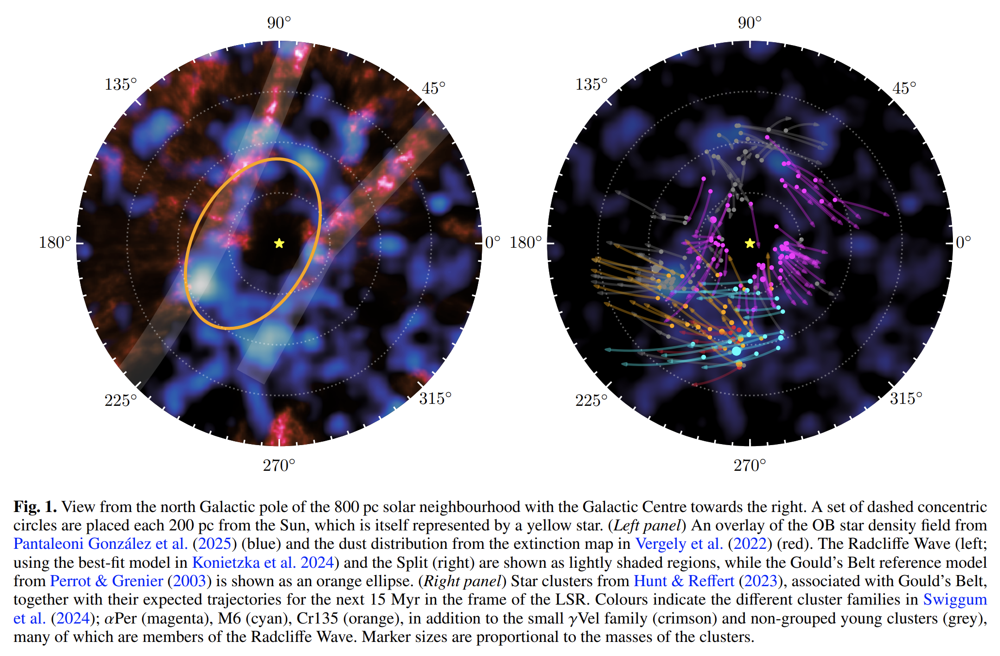

4. [An Information-Theoretic Metric for Transient Classification and Novelty Detection](https://arxiv.org/abs/2604.13207)

   > Rubin, Transient Classification, Information Theory

   提出一个面向 Rubin/LSST 时域科学的新 metric，用信息论里的 cross-entropy 去量化**一个新瞬变在已知瞬变总体里到底有多意外**。作者把 LSST 夜间 triplet 观测映射到离散的 observable phase space，再比较新观测和已知 transient population 的经验分布，从而同时服务几个问题：不同瞬变类之间的可分性、观测策略和 alert pipeline 的优化、稀有/新奇源的发现，以及后随资源该优先分给谁。

   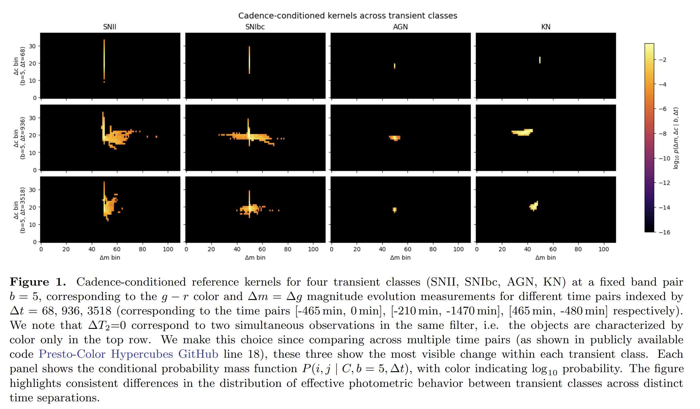

5. [Secular Brightness Trends of Starlink and OneWeb Satellites](https://arxiv.org/abs/2604.13145)

   > Satellite, Light Pollution, Survey Monitoring

   用 MMT9 机器人台站在 2021–2026 年间积累的约 160 万条卫星测光，研究 Starlink 和 OneWeb 在运营轨道上的长期亮度变化。结果是：Starlink VisorSat 在这五年里显著变亮了约 0.6 等，对应约每年 0.122 等；OneWeb 则显著变暗了约 0.4 等，对应约每年 0.078 等；而 Starlink V1.5 也有变亮趋势，但统计上不显著。

   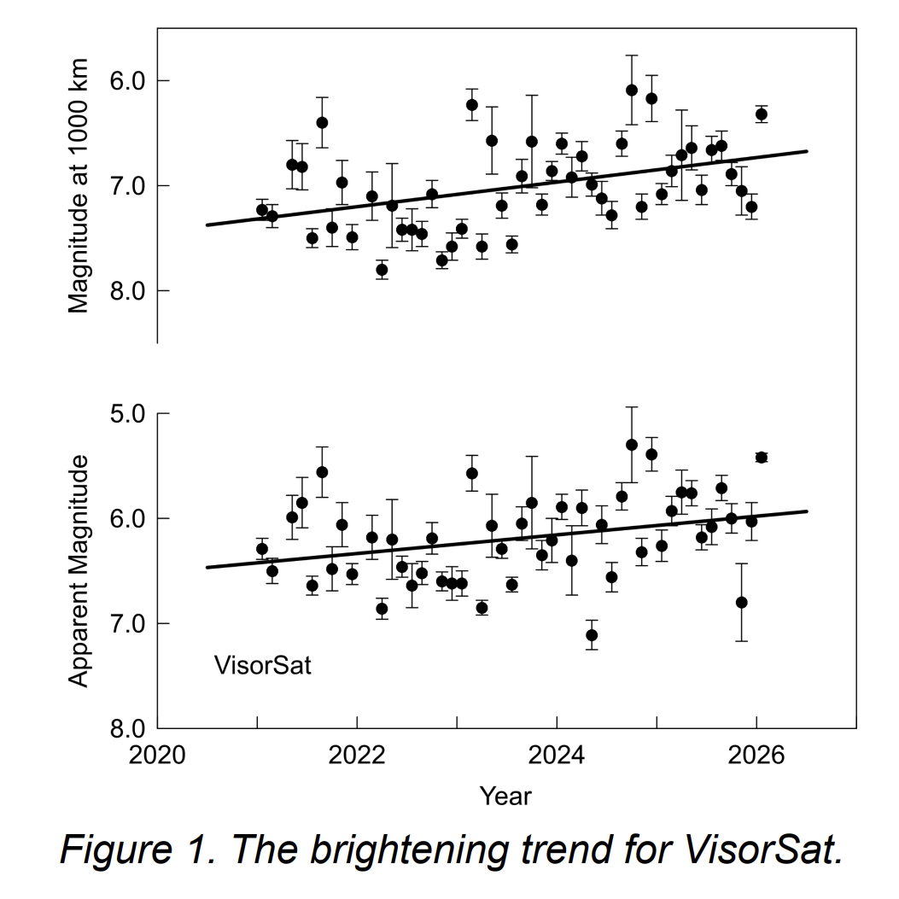

## 2026-04-17

1. [A fast X-ray transient with chromatic flares: signatures of violent collisions induced by late-time central engine reactivation](https://arxiv.org/abs/2604.14341)

   > Fast X-ray Transient, Central Engine, Shell Collision

   报告 Einstein Probe 发现的一例明亮河外快 X 射线暂现源 EP250302a，红移 z=1.131。后随阶段出现了一个针状的 X 射线 flare，同时光学波段却表现为更平滑的再增亮。作者据此认为，这很像两团相对论壳层在晚期发生了剧烈碰撞，其中 X 射线的尖锐 flare 和光学的平滑 bump 反映了不同辐射区和不同碰撞动力学；而这种 violent shell collision 又强烈暗示中心引擎在晚期被重新激活。

   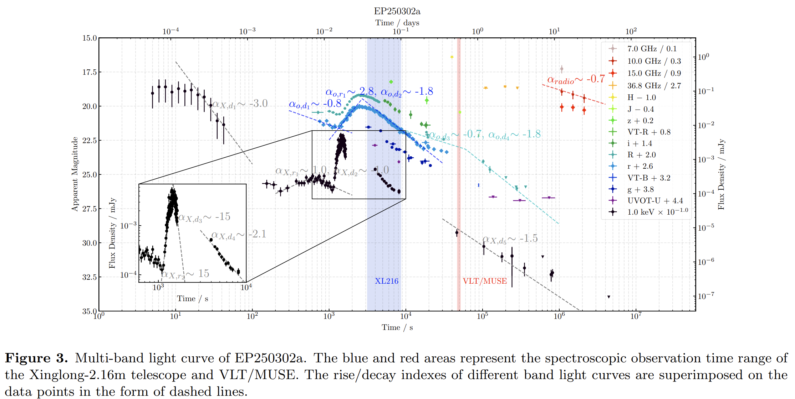

2. [Closing the Observational Gap in Cosmic Dynamics: AI-Enabled Reconstruction of the Universe’s Vorticity and Rotational Flow Morphology](https://arxiv.org/abs/2604.14653)

   > Cosmology, Vorticity, AI Reconstruction

   这篇文章尝试直接从 SDSS 星系分布里重建宇宙大尺度结构的三维速度场和涡度场，目标是补上“宇宙旋转流形态一直难以直接观测”的缺口。作者用 $\Lambda$CDM 模拟训练一个 U-Net 类深度网络，再把它应用到 SDSS DR7 星系数据上，恢复出 cluster、filament、void 里的 coherent vortical structures 和 spiral-like flows。重建结果给出的速度场、涡度场功率谱都与 $\Lambda$CDM 预测统计一致，而且用这个速度场去消除 redshift-space distortion 之后，星系聚类信号也变得接近各向同性。

   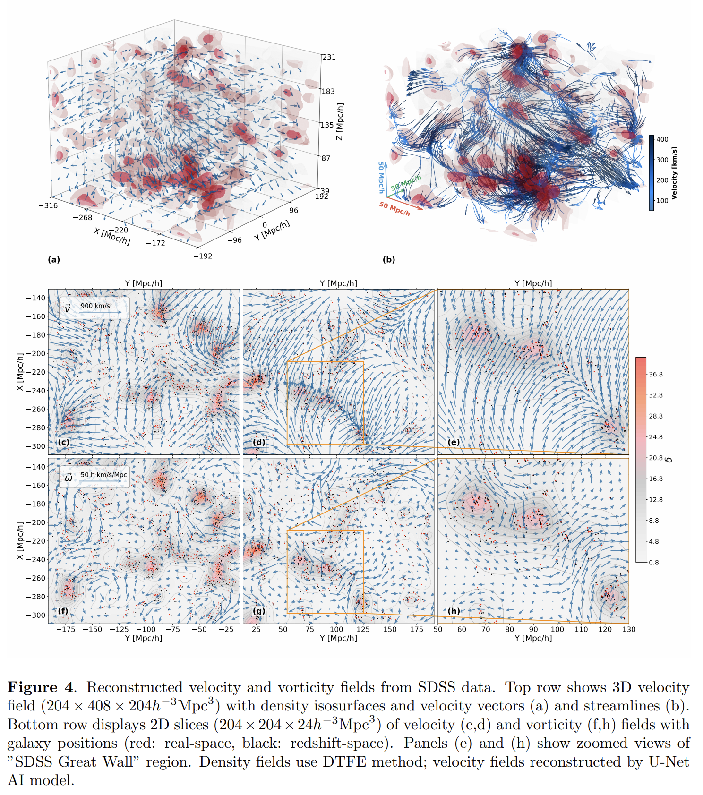

3. [A Generalized Algorithmic Framework for Detecting Faraday Rotation Measure Flares in Repeating Fast Radio Bursts](https://arxiv.org/abs/2604.15012)

   > Fast Radio Burst, Rotation Measure, Algorithm

   重复暴的 RM 演化可以很平滑、也可以很混乱，再加上观测时间采样很不均匀，所以很难把真正短时、局域的 magneto-ionic 结构穿越事件，与一般性的长期漂移或随机波动区分开。为此，他们设计了一个自适应时间窗、稳健基线估计和显著性评分结合的 pipeline，用来统一识别和刻画 RM flare。把这套方法应用到 15 个 RM 有明显变化的重复暴之后，结果发现高置信 RM flare 其实非常罕见，只有 FRB 20220529A 在标准参数下显示出统计显著的事件，其他活跃源更多表现为本征大幅波动或长期 secular evolution。

## 2026-04-20

