## 2026-05-01

1. [The Solar System Notification Alert Processing System (SNAPS): Public access to SNAPS data and products](https://arxiv.org/abs/2604.27420)

   > Solar System, Asteroid, Tool, Database

   [SNAPS](https://snaps.nau.edu/) 是面向太阳系移动天体的下游 alert broker，用于接收 ZTF 和未来 LSST 经 ANTARES 转发的已知移动天体警报，并公开对象观测、轨道信息、邮票图像和派生性质。系统只处理已知小行星、彗星等移动源，不负责新天体发现或轨道链接。

   当前网页支持按编号、临时编号或 packed designation 查询对象，返回 ZTF/LSST 观测、MPC 轨道参数、$H$ 星等、相位曲线、光变周期、振幅和颜色等产品；观测较多的目标还可在浏览器中查看图像、运行 Lomb Scargle 周期搜索、保存收藏和笔记。后续接口计划包括批量 API、异常天体 Kafka 流、跨目录查询和按物理性质筛选。

2. [First Detection of Faraday Rotation in a Gamma-Ray Burst Afterglow: Low Polarization and High Rotation Measure in GRB 260310A Reveal Jet Magnetic Structure and Environment](https://arxiv.org/abs/2604.27480)

   > Gamma Ray Burst, Polarization, Faraday Rotation, Observation

   GRB 260310A 的 VLA 11–25 GHz 偏振观测给出了首个厘米波 GRB 余辉偏振探测和首个 GRB 环境中的RM测量。观测发生在触发后约 19.2 天，结合公开多波段 GCN 测光，正向激波用于解释光学和 X 射线，射电部分用结构化喷流反向激波模型 [rsjetstruct](https://github.com/rohdog2003/rsjetstruct) 拟合。

   偏振度从 25 GHz 的约 $3.18\%$ 降到 11 GHz 的约 $0.69\%$，低频去偏振更符合同步自吸收影响。观测RM为 $RM=-6250\pm70\ {\rm rad\ m^{-2}}$，换算到 GRB 红移为 $RM_{\rm int}=-8300\pm90\ {\rm rad\ m^{-2}}$；银河系和星系际介质贡献不足以解释该值，更可能来自大质量恒星前身周围的致密磁化 HII 区。较低的高频偏振度也指向小尺度斑块状磁场，而非全局有序喷流磁场。

   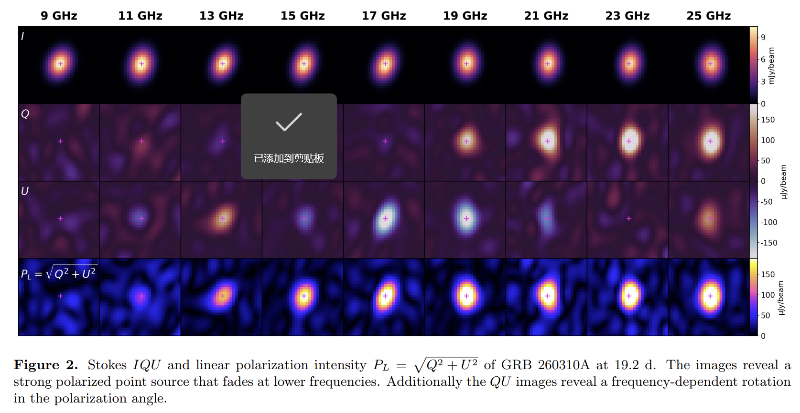

3. [An Extended Evaluation Split for DeepSpaceYoloDataset](https://arxiv.org/abs/2604.27593)

   > Astronomy, Deep Learning, Dataset, Object Detection

   DeepSpaceYoloDataset 新增 `test2026` 评估集，用于检验深空天体检测模型在智能望远镜图像上的泛化能力；数据集在 [Zenodo](https://doi.org/10.5281/zenodo.8387070) 发布。新增部分包含 335 张高分辨率 RGB 图像，来自 Stellina 和 Vespera 在法国、比利时、卢森堡的观测，目标包括星系、星云和星团。

   图像通过 Python、OpenCV、Pillow 和 Astroalign 对齐叠加，并用 MakeSense 以 YOLO 格式标注。完整数据集扩展到 5031 张图像；YOLO5m、YOLO8m、YOLO11m、YOLO12m 在原测试集和 `test2026` 上的 mAP 排名发生变化，说明新增测试集包含更复杂的分辨率、视场和观测条件，更适合作为深空目标检测的稳健性基准。

   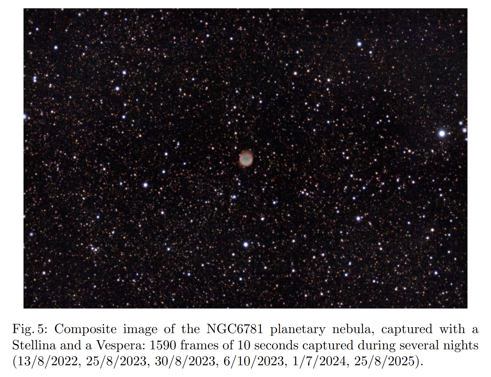

4. [The Large Array Survey Telescope—Pipeline. II. Image Subtraction and Transient Detection](https://arxiv.org/abs/2604.27921)

   > Transient, Survey, Pipeline, Image Subtraction

   LAST 巡天管线的第二部分负责从 Pipeline I 产生的 $20\times20$ 秒合并图像中进行实时差分成像和暂现源检测，相关软件生态使用 [AstroPack](https://github.com/EranOfek/AstroPack)。流程包括参考图像配准、ZOGY 差分、显著性图像构建、$|S|\ge5\sigma$ 候选提取、孔径和 PSF 测光，以及对坏像素、条纹、傅里叶振铃、PSF 异常、已知变星、恒星和太阳系天体的确定性过滤。

   调试数据和注入测试显示，标准参考图像下单历元极限星等约 20.3 mag，深参考图像可到约 20.7 mag。约 $4\times10^7$ 个初始检测经过过滤后降到约 $0.01\ {\rm deg^{-2}}$ 的候选密度，$S\ge7.5\sigma$ 时纯度超过 90%；单历元效率约 80%，较好条件下约 87%。主要损失来自配准裁剪和 PSF 重建限制，后续改进集中在参考图像配准、PSF 建模和可能的机器学习分类。

5. [On the polarization position angle jumps in FRB 20240114A](https://arxiv.org/abs/2604.28012)

   > Fast Radio Burst, Polarization, Observation

   FRB 20240114A 的 190 个爆发被用于研究偏振位置角在毫秒到小时尺度上的跳变。数据来自 Nançay Radio Telescope 的 1.1–1.8 GHz 全 Stokes 高时间分辨率观测和 Effelsberg 100 m 望远镜的 1.3–1.5 GHz 观测，覆盖约一年和 12 个历元，并测量 RM、线偏振、圆偏振和时间分辨位置角。

   RM 整体稳定，典型值在约 340–387 ${\rm rad\ m^{-2}}$ 范围内，未显示明显内禀 RM 演化；约 81% 的爆发具有 $L/I>0.8$ 的高线偏振，圆偏振通常较弱。位置角可在 10–15 ms 到数小时内随机变化，跳变量可接近 $90^\circ$，但没有明显偏好正负方向或精确正交跳变。稳定 RM 与随机 PPA 跳变的组合不支持单一固定磁层发射区，更倾向于多个活动发射区或双折射模式耦合、广义法拉第旋转、磁层传播、等离子体透镜等传播效应。
   
   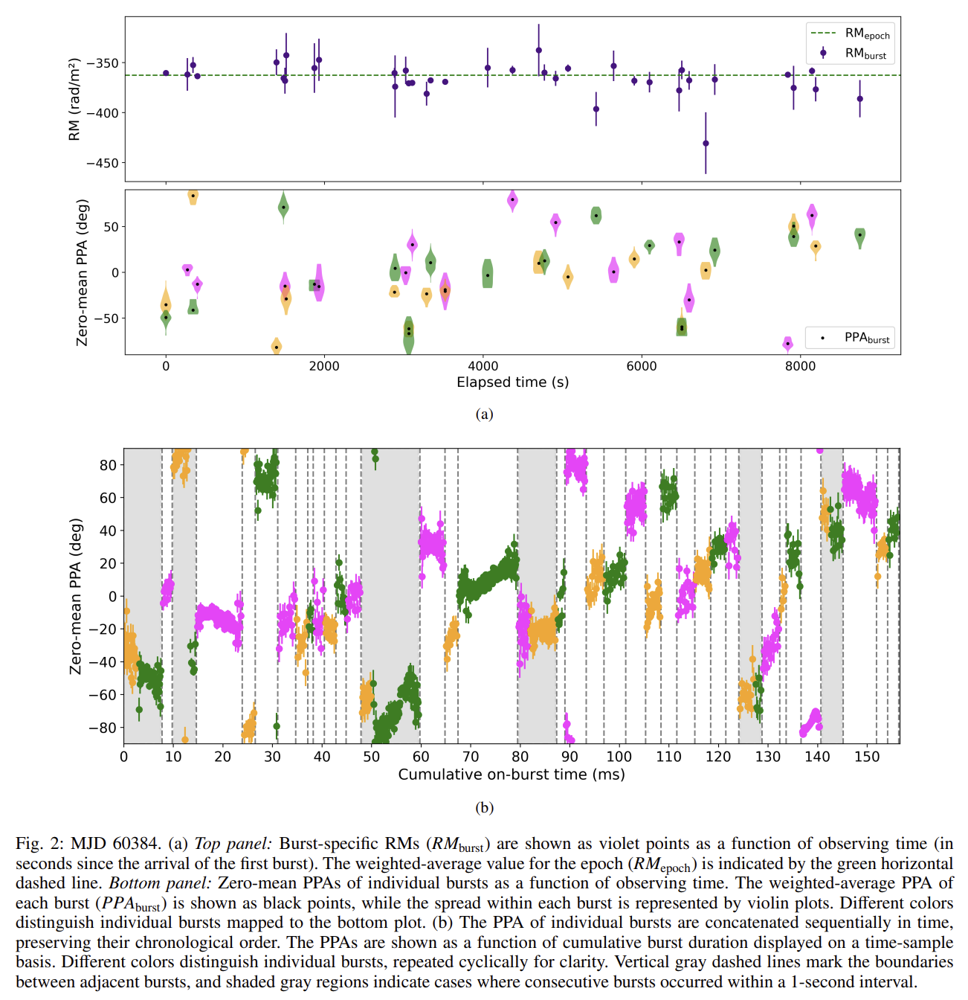

## 2026-05-04

1. [Random Polarization Position Angle Behaviors across Bursts of Repeating Fast Radio Bursts](https://arxiv.org/abs/2605.00372)

   > Fast Radio Burst, Polarization, Periodicity, FAST

   重复 FRB 爆发内部的偏振位置角通常近似平坦，但不同爆发之间会明显变化；问题集中在这些 PA 序列是否隐藏中子星自转或双星轨道周期。FAST FRB Key Science Project 的 4 组大样本偏振数据被用于检验这一点，包括 FRB 20201124A 的两个活跃期、FRB 20220912A 和 FRB 20240114A；低于 SNR 50 的爆发被剔除，PA 在扣除法拉第旋转后组成非均匀时间序列。

   Lomb Scargle periodogram 在 $10$ ms 到 $10^7$ ms 的周期范围内没有找到可信周期信号，单日活跃观测和 PA 群体统计的折叠搜索也没有显著调制；最强峰可由爆发序列的采样窗口和爆发内部结构造成的 aliasing 解释。各源的 PA 分布近似稳定的高斯分布，但均值和宽度随源不同。传统 RVM 被扩展为动态磁层版本：有效磁轴在不同爆发中受随机扰动而游走，使 PA 在爆发间随机变化，同时保持围绕局部磁层区域的稳定统计分布。这种框架更自然解释了重复 FRB 中缺乏 PA 周期性、但仍呈现类磁星偏振行为的现象。

   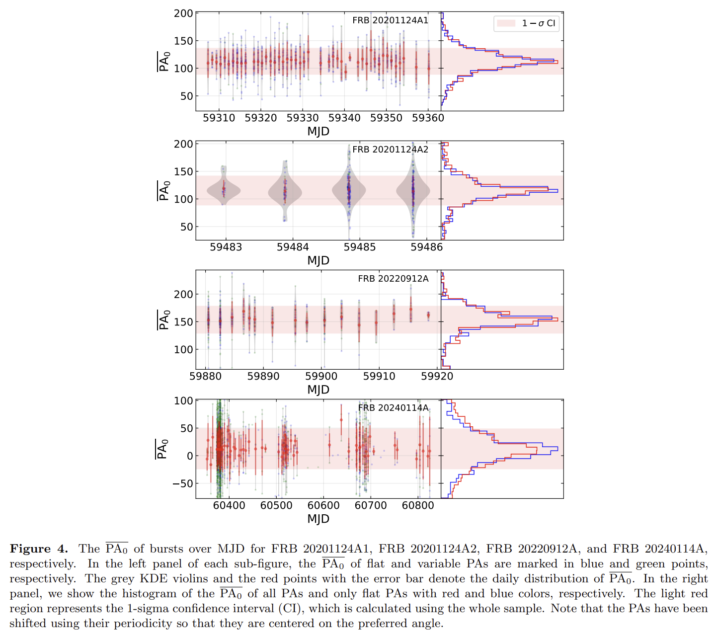

2. [A bright wideband radio burst from the isolated neutron star 2XMM J104608.7-594306](https://arxiv.org/abs/2605.00720)

   > Neutron Star, Radio Transient, Polarization, Observation

   热辐射孤立中子星 2XMM J104608.7-594306 的 Murriyang/Parkes UWL 后随观测发现第二个相干射电爆发，说明这类原本被认为射电安静的 XDINS/CCO 候选体也可能偶发射电爆发。观测在 2025 年 4 月到 11 月累计 36 小时，UWL 覆盖 704–4032 MHz，时间分辨率 $256\,\mu$s，单脉冲搜索围绕标称 $DM=98.41\ {\rm pc\ cm^{-3}}$ 进行，并结合 FFA/PRESTO 周期搜索排查常规周期性辐射。

   新爆发的结构最大化色散量为 $DM=99.40\pm0.07\ {\rm pc\ cm^{-3}}$，旋转量为 $RM=-49.3\pm0.2\ {\rm rad\ m^{-2}}$，发射覆盖整个 UWL 带宽，谱指数 $\alpha=-2.18\pm0.16$。爆发含多个子结构，典型微结构尺度约 1.1 ms，但没有严格周期性；线偏振和圆偏振比例分别为 $54\%$ 和 $22\%$，PA 中出现类似脉冲星的正交跳变。Murriyang 爆发比 14 个月前 MeerKAT 探测到的首个爆发亮约两个数量级，峰值光度高于多数脉冲星并接近 SGR 1935+2154 的亮爆发，支持磁层相干辐射机制可在更宽的磁场强度和射电光度范围内工作。

   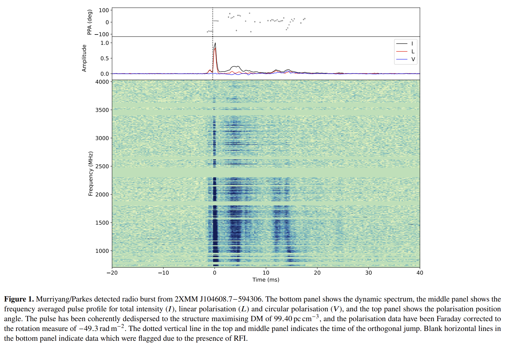

## 2026-05-05

1. [Constraints on the baryon density from fast radio bursts using a non-parametric reconstruction of the Hubble parameter](https://arxiv.org/abs/2605.01990)

   > Fast Radio Burst, Cosmology, Baryon, Method

   利用 130 个已定位 FRB 的色散量约束物理重子密度 $\Omega_{\rm b}h^2$，同时拟合宿主星系对 $DM$ 的贡献。星系际介质的平均 $DM$ 依赖宇宙膨胀史，这里用 cosmic chronometer 的 35 个 $H(z)$ 测量训练 [ReFANN](https://github.com/Guo-Jian-Wang/refann.git)，先独立重构 $H(z)$，再在 FRB 似然中联合推断 $\{\Omega_{\rm b}h^2,e^\mu,\sigma_{\rm host}\}$；宿主星系 $DM$ 被建模为 log normal 分布，推断使用 nested sampling。

   真实样本给出 $\Omega_{\rm b}h^2=0.02236\pm0.00090$，$e^\mu=178.15^{+16.51}_{-16.97}\ {\rm pc\ cm^{-3}}$，$\sigma_{\rm host}=0.794^{+0.064}_{-0.067}$，与 BBN 和 Planck 的中心值只差约 $0.05\%$。包含 2000 个事件的模拟 FRB catalog 将 $\Omega_{\rm b}h^2$ 不确定度降到约 $0.8\%$，说明更大、更干净的定位 FRB 样本可以成为低红移重子密度的独立探针，但精度仍取决于宿主环境、IGM scatter 和选择效应建模。

   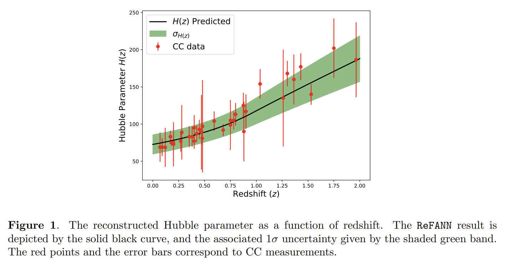

2. [Baryons in the Darkest Sites of the Universe](https://arxiv.org/abs/2605.01994)

   > Fast Radio Burst, Cosmology, Cosmic Void, Baryon

   宇宙空洞内部的重子含量通过 FRB 色散量直接测量。分析将 3455 条 CHIME/FRB 视线与 SDSS BOSS 的约 1200 个 $0.2<z<0.7$ 空洞叠加交叉相关，利用 FRB 的 $DM$ 作为自由电子柱密度探针；空洞模型使用 ZOBOV 目录、有效宇宙方法和均匀密度空洞近似，气体剖面通过 [BaryonForge](https://github.com/DhayaaAnbajagane/BaryonForge) 中的 BCEmu prescription 计算。

   空洞中心方向出现 $3.2\sigma$ 的 $DM$ deficit，并在 $R\sim R_{\rm eff}$ 附近回到宇宙平均水平，符合自由电子在空洞内部欠密的图像。有效宇宙模型得到 $\alpha_v=1.80\pm0.87$，均匀密度模型得到 $\delta_{\rm e,v}=-0.58\pm0.30$，对应空洞内部平均电子密度约为宇宙平均的 $0.42\pm0.30$。结合已有 tSZ 空洞叠加结果，空洞气体温度约 $T_{\rm e}\lesssim(1.1\pm0.7)\times10^6$ K，指向 warm hot 弥散气体相；未来 CHORD、DSA、SKA 与 DESI、LSST、Euclid 等样本可把这种方法扩展到重子欠密的层析测量。

3. [The first detection of an atmosphere on a trans-Neptunian object beyond Pluto](https://arxiv.org/abs/2605.02243)

   > Solar System, TNO, Occultation, Atmosphere, Observation

   2002 XV93 是半径约 250 km 的 plutino，此前这类小型 TNO 通常被认为难以长期保持大气。2024 年 1 月 10 日的恒星掩星由日本多站观测完成，包括 Kyoto 20 cm 望远镜、Kiso 1.05 m Schmidt 望远镜和 Fukushima 25 cm 民间观测站；Kyoto 与 Kiso 给出两条正掩星 chord，Kiso 和 Fukushima 的边缘光变显示大气折射造成的渐进变暗，而非单纯 Fresnel diffraction 或恒星角直径效应。

   Kiso 光变用球对称、Pluto like 温度反转层的静水平衡大气模型和 ray tracing 拟合，分别测试纯 CH4 与 N2 主导两种成分假设。两种模型都能明显优于无大气模型，最佳半径为 $244\pm4$ km，表面压强分别为 $124^{+15}_{-12}$ nbar 和 $177^{+18}_{-19}$ nbar，约为 Pluto 当前表面压强的 1/50 到 1/100。结果说明亚 1000 km TNO 也可能短暂拥有稀薄大气；表面挥发物升华难以长期维持该大气，更可能与低水平 cryovolcanic outgassing 或近期小天体撞击产生的短寿命挥发物有关。

   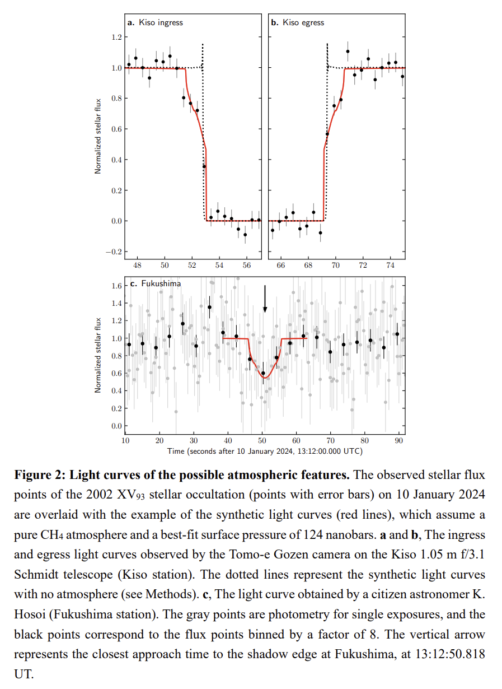

4. [PDRS : A Linear $\mathcal{O}(N)$ Algorithm for Segmentation of High-Activity Regions in Irregularly Sampled Time Series](https://arxiv.org/abs/2605.02843)

   > Time Domain, Method, Tool, AGN

   [PDRS](https://github.com/zerozole/Peak_Driven_Region_Segmentation) 是用于不规则采样时间序列的高活动区段检测算法，针对 ZTF、LSST 这类大规模时域巡天中 Bayesian Blocks 加 hill climbing 的 $\mathcal{O}(N^2)$ 成本问题。算法先按统计显著的局部峰值播种候选区域，再用 gradient aware multi source BFS 扩展，随后执行 saddle point merging 和 median based filtering，以线性 $\mathcal{O}(N)$ 时间提取持续的 flux excess。

   测试使用 ZTF DR23 的 AGN 光变和 SDSS Stripe 82 quasar 光变。对 ZTF AGN，典型参数包括 $\sigma_{\rm thresh}=2$、$r_{\rm saddle}=0.2$、$N_{\rm min}=3$、$w_{\rm smooth}=7$、$\sigma_{\rm region}=0.5$、$\Delta t_{\rm max}=60$ 天；SDSS Stripe 82 因采样更稀疏和信号更弱，使用较低峰值阈值和更长时间间隔。PDRS 找到的高活动区与 Bayesian Blocks 标记的候选 flare 相近，但对 penalty 参数不敏感，也较少把静止背景噪声过分切分，适合作为大规模光变筛选的快速预处理步骤。

   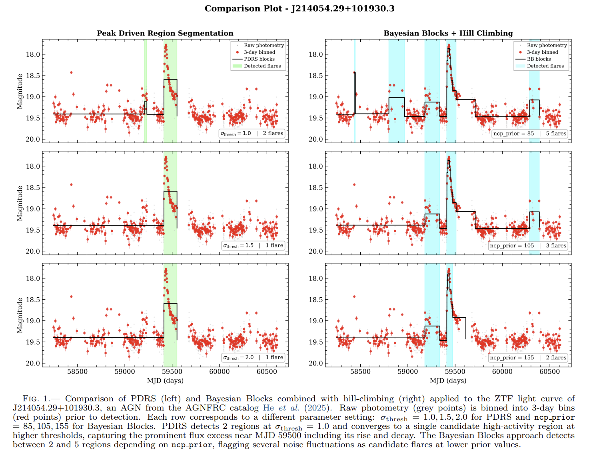

5. [Role of General Users in the Lifecycle of Scientific Software](https://arxiv.org/abs/2605.02870)

   > Radio Astronomy, Software, Tool

   CASA 的生命周期被用作科学软件如何吸收普通用户反馈的案例。[CASA](https://casa.nrao.edu/) 是射电天文开源数据处理软件，支持 VLA、ALMA、Nobeyama 45m 以及其他干涉阵、单碟和 VLBI 数据；自 CASA 6 起同时提供 Python 包和传统 tar 包，核心代码和资源位于 [GitHub](https://github.com/casangi) 与 [Bitbucket](https://open-bitbucket.nrao.edu/projects/CASA/repos/casa6/browse)，官方文档在 [CASA Docs](https://casadocs.readthedocs.io)。

   CASA 约每三个月滚动发布一次，开发优先级由内部望远镜运行需求、ALMA/VLA/VLBA 等利益相关方、CASA User Liaison 和 NRAO Users Committee 的 DMS Panel 共同输入。普通用户的作用主要体现在长期软件健康度：例如推动可靠性测试、Mac OS 支持、VLBI 支持、单碟和干涉数据联合反卷积等非短期运行需求。面对有限支持资源，CASA 采用 `casa-feedback@nrao.edu`、文档、测试矩阵、指南和公告列表来平衡用户支持与开发负担；随着 ALMA WSU 和 ngVLA 带来更高数据率，CASA 将逐步转向维护模式，RADPS 成为下一代射电数据处理系统。

## 2026-05-06

1. [A Multi-Survey Machine-Readable Corpus of Milky Way Globular Cluster Parameters for Retrieval-Augmented Generation Applications](https://arxiv.org/abs/2605.03099)

   > Globular Cluster, Dataset, RAG, LLM

   Milky Way Globular Cluster Corpus v1.3.1 是面向 RAG 和传统定量分析的银河系球状星团机器可读语料库，数据在 [Zenodo](https://doi.org/10.5281/zenodo.19907766)。语料覆盖 174 个银河系球状星团，整合 Harris 2010 光度和结构参数、Vasiliev & Baumgardt 2021 Gaia EDR3 自行、Baumgardt et al. 2023 N-body 质量和轨道参数、Schiavon et al. 2024 APOGEE DR17 化学丰度，共 17,438 个非空数据点，提供 JSONL、嵌套 JSON 和 82 列 CSV。

   数据清洗重点放在名称解析、类型标准化、null 语义和 provenance。每个数据块保留来源引用、DOI/URL 和方法说明，缺失值区分为观测不可达、survey 覆盖缺口或目录年代差异。覆盖率为 Harris 157/174、Gaia 170/174、Baumgardt 154/174、APOGEE 72/174；JSONL 可作为向量检索中的完整星团记录，CSV 可用于 core collapse 分类、Sagittarius stream 成员识别、轨道建模、化学标记和跨 survey 系统误差检查。

2. [Utilizing Dispersion Measure of Fast Radio Bursts to Probe the Intergalactic Medium Turbulence](https://arxiv.org/abs/2605.03253)

   > Fast Radio Burst, IGM, Turbulence, Simulation

   FRB 的 $DM$ 被用于测量星系际介质湍流的结构函数。样本合并 CHIME/FRB Catalog 2 和此前公开 FRB，共 3738 个有 $DM$ 的独立源，扣除银河系 ISM 贡献并剔除 $DM>3000\ {\rm pc\ cm^{-3}}$ 以及 Galactic magnetar FRB 200428。结构函数按不同 $DM$ 上限子样本计算，用于降低源距离分布宽造成的统计偏差。

   对照样本来自 CROCODILE 宇宙学模拟；使用 100 cMpc/$h$ box 的气体和电离网格，构建 50,000 条非旋转周期 light cone 视线，相关流程在 [ARCOS](https://github.com/zhaojosephzhang/ARCOS) 的 FALCON 模块中实现。大角尺度 $\theta\gtrsim1^\circ$ 上观测结构函数与模拟一致并趋于平台；小角尺度 $\theta\lesssim0.5^\circ$ 上出现接近二维 Kolmogorov 湍流的 $\theta^{5/3}$ 标度，推得 IGM 湍流外尺度约 $L_i\approx3.8-7.4$ Mpc，保守范围约 $1.9-9.2$ Mpc。当前小角尺度 FRB 对数仍不足，亚角秒定位 FRB 样本才能把该 Kolmogorov-like cascade 变成稳健测量。

3. [StreakMind: AI detection and analysis of satellite streaks in astronomical images with automated database integration](https://arxiv.org/abs/2605.03429)

   > Satellite, Deep Learning, Tool, Observation

   StreakMind 是面向天文图像中卫星、空间碎片和近地天体线状 streak 的自动检测、几何重建、跨帧关联和数据库入库管线。数据来自 La Sagra Observatory L98 的 Celestron C14+Fastar 观测，包含 2055 张真实 FITS 图像；人工标注出 765 条 streak 后，又向真实图像注入 280 张合成长 streak 图像，形成 2335 张手工加合成训练数据。检测模型采用预训练 YOLO11 oriented bounding box，FITS 转 PNG 后生成像素坐标 OBB 标注。

   流程在检测后加入亮星 diffraction spike 过滤、沿主轴的光度增强延长、端点估计、跨帧几何外推和关联，再把结果转为 MPC-style 记录。卫星识别通过 Project Pluto Sat_ID 外部星历，采用 $1^\circ$ 搜索半径、offset 过滤和两组件 Gaussian confidence score，最终写入 SQLite 关系数据库。独立测试集上 precision 为 94%、recall 为 97%；短中等长度 streak 的检测和 OBB 重建稳定，超长 streak 仍可检测，但需要额外光度后处理改善几何范围。当前识别层主要面向人工卫星和空间碎片，NEO 自动确认和更完整测光模块属于后续扩展。

4. [Searching For Fast Radio Transients And Radio Pulsars Using SPOTLIGHT](https://arxiv.org/abs/2605.03531)

   > Fast Radio Burst, Pulsar, Pipeline, GMRT

   [SPOTLIGHT](https://spotlight.ncra.tifr.res.in/) 是 GMRT 上面向 FRB 和射电脉冲星的多波束 GPU/HPC 搜索系统，通过约 2000 个 post correlation phased array beams 覆盖单碟主波束视场，波束时间分辨率约 1.3 ms，并保留可用于实时成像定位的 visibilities。目标是在 300–1460 MHz 频段进行 commensal、targeted 和 open sky 搜索，三年运行预期可探测并定位约 300 个 FRB。

   暂现源管线把 beamformer 输出写入共享内存环形缓冲区：TEL_SHM 保存约 8 s 数据，FRB_SHM 扩展为约 402.65 s，以供 [AstroAccelerate](https://github.com/AstroAccelerateOrg/astro-accelerate) 和 [candies](https://github.com/astrogewgaw/candies) 实时处理。处理包括 [gptool](https://github.com/chowdhuryaditya/gptool) RFI 缓解、$0-2000\ {\rm cm^{-3}\ kpc}$ 试探 $DM$ 去色散、boxcar 单脉冲搜索、DM-time 和 RA-Dec 聚类、[FETCH](https://github.com/devanshkv/fetch) 候选分类，以及用 [arachne](https://github.com/astrogewgaw/arachne) 向 8-bit GMRT 实时数据注入模拟 FRB 做端到端测试。脉冲星管线包括 [Pulscan](https://github.com/jack-white1/pulscan) 快速周期搜索、AstroAccelerate 离线 FDAS、去色散、running median 去红噪、重采样修正周期导数、folding 和 [GH-VFDT](https://github.com/scienceguyrob/GHVFDT) 分类。实时多波束暂现源管线已经过测试并接近运行部署，脉冲星搜索仍需 GPU folding、folded profile 单脉冲搜索和与 PRESTO/RIPTIDE 的系统性能对比。

## 2026-05-07

1. [Overview of the New Hubble Spectroscopic Legacy Archive](https://arxiv.org/abs/2605.04167)

   > Hubble, Spectroscopy, Archive, Tool

   新版 HSLA 面向 HST 的 COS 和 STIS 光谱，目标是把 MAST 中公开或重新定标的一维光谱自动合并成按天体组织的 legacy archive。目标关联使用坐标、proper motion、Phase II 目标信息和 2″ 匹配规则，分类结合 SIMBAD、NED、NASA Exoplanet Archive 和观测申请文本，并映射到三层天文分类体系。2025 年运行版本使用截至 2025-06-25 的数据识别出 6712 个目标，为每个目标生成按观测模式、COS FUV lifetime position 以及跨模式 abutted quicklook 组织的 coadded spectra，同时保留 metadata、provenance 和 trailer 文件。

   随机检查 100 个目标后，目标关联和坐标准确度约 94%，分类和命名准确度高于 86%；与输入 x1d 光谱和 CALSPEC 标准星的比较显示，多数 COS/STIS 模式保留了输入数据的绝对和相对流量定标精度。HSLA 可通过 MAST Portal、HST Mission Search 和 astroquery 访问，coadd 代码与 HASP/HSLA wrapper 已在 Space Telescope GitHub 组织公开，并提供 notebook 支持 crowded field、变量源、径向速度变化、COS blue modes LSF 差异、STIS E1 wavelength offset 等需要人工判断的 custom coadd 场景。

2. [AGILE detection of transient γ-ray emission from the region of the supergiant fast X-ray transient source IGR J17354-3255](https://arxiv.org/abs/2605.04818)

   > High Energy, Gamma Ray, SFXT, Observation

   利用 2007–2024 年 AGILE consolidated archive 搜索 IGR J17354-3255 区域的 0.1–10 GeV 快速伽马耀发，评估未知瞬变源 AGL J1736-3250 与 supergiant fast X-ray transient 的物理关联。AGILE/GRID 数据采用 FM3.119 filter、H0025 IRF、BUILD25 Science Tools 和 `agilepy` 做 binned multi-source likelihood，源模型包含 AGL J1736-3250 及 21 个邻近 2AGL 源，并结合 Swift 与 INTEGRAL 的 X-ray 数据做轨道相位比较；数据、high level maps 和 notebooks 在 [AGILE_detection_AGLJ1736-3250](https://github.com/AGILESCIENCE/AGILE_detection_AGLJ1736-3250.git)。

   共检出 19 个 one-day γ-ray flaring bins，重复耀发的 post-trial 显著性约 6.04σ；堆叠 19 次耀发达到 11σ，定位与 IGR J17354-3255 一致，光子谱指数为 $2.10\pm0.11$，平均 0.1–10 GeV 光子流量为 $(1.89\pm0.27)\times10^{-6}\ {\rm ph\ s^{-1}\ cm^{-2}}$。多数日尺度耀发的光子集中在 2–6 小时窗口，符合低 duty cycle 的瞬变行为；8/19 次耀发集中在轨道相位 0.4375–0.5000，约对应 apastron 附近，机会概率约 $8.65\times10^{-6}$。Swift/INTEGRAL 的 X-ray 相位曲线更平滑并接近 periastron 增强，AGILE γ-ray 活动更像随机亮耀发，支持 AGL J1736-3250 与 IGR J17354-3255 可能相关，但高能辐射区或机制不同，仍需要 Fermi-LAT 深分析、射电观测和更具体的 SFXT 高能辐射模型检验。
   
   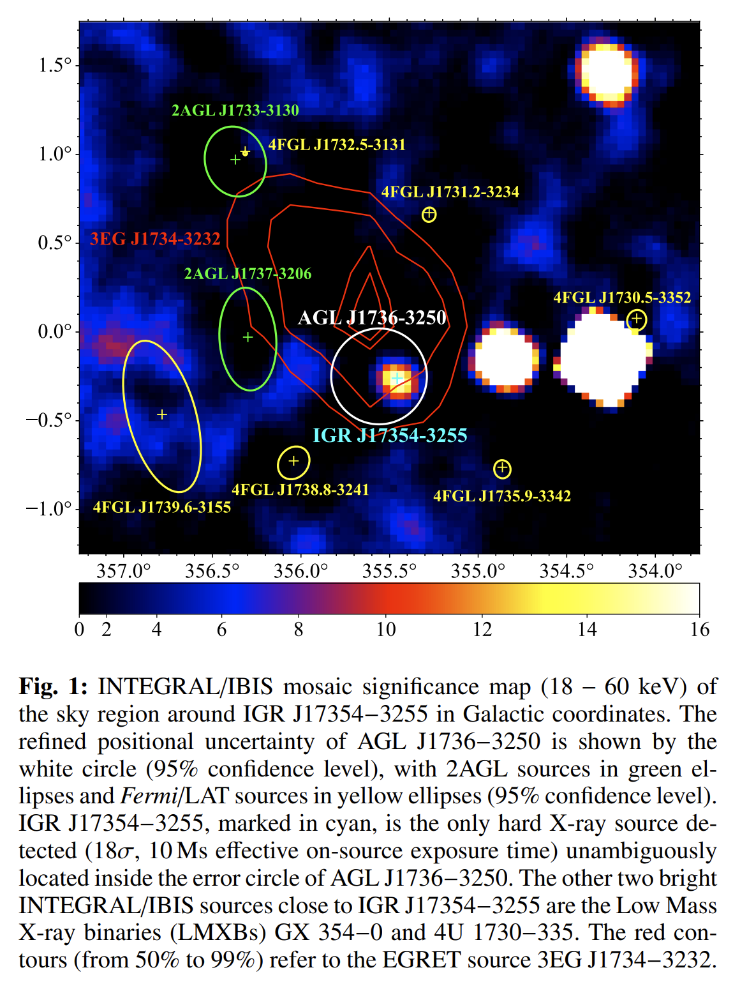

## 2026-05-08

1. [Multi-wavelength outburst activity from EP J174942.2-384834: a very faint X-ray transient discovered by Einstein Probe](https://arxiv.org/abs/2605.05303)

   > X Ray, Transient, Black Hole, Observation

   围绕 Einstein Probe 在 2025 年 3 月发现的 Galactic transient EP J174942.2-384834，结合 EP、NICER、NuSTAR、Swift、SVOM、ATLAS、SALT 和 MeerKAT 的 X-ray、optical、UV、radio 数据做多波段跟踪。7 个月内出现两次主要 outburst 和一次 rebrightening，X-ray luminosity 变化超过三个数量级；光谱长期保持 hard state，$Γ\simeq1-2$，可由 very soft seed photons 的 thermal Comptonization 描述，没有显著热盘成分。optical/UV 与 X-ray 同步增亮并呈 blue continuum 和宽 Balmer 吸收，radio 未检出，整体支持它是一个 very faint X-ray transient black hole candidate，但吸积体类型仍需后续静默态和新 outburst 观测确认。

   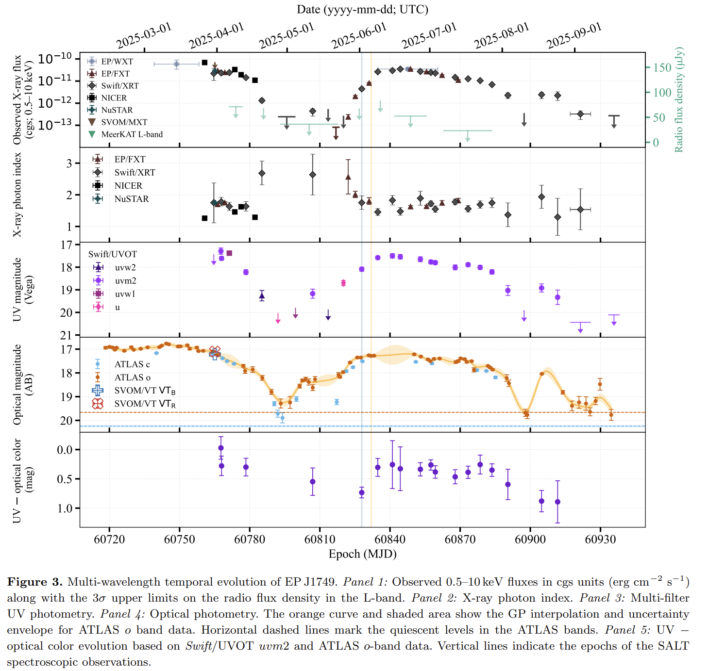

2. [Stellar rotation and binaries in open clusters with Gaia DR3](https://arxiv.org/abs/2605.05313)

   > Gaia, Open Cluster, Stellar Rotation, Binary

   利用 Gaia DR3 的 rotational broadening、rotation period，以及文献中的近百万个银河系 open cluster 成员星，建立超过 70 万颗成员星、近 6000 个星团的样本，研究主序、binary sequence、blue straggler、eMSTO、红巨星等族群的自转行为。结果包含 4.4 万多颗有自转刻画的恒星、近 5.7 万个变量源和 2.2 万多个双星；eMSTO 或 split MS 星团增至约 100 个，质量高于 $10^3 M_\odot$ 的星团大多显示 eMSTO；blue straggler 总样本接近 2000 个，其中约 75% 的对象转速高于 40 km s$^{-1}$，快速自转的红巨星和亚巨星更可能与近期双星相互作用有关。

3. [A useful representation of TESS light curves](https://arxiv.org/abs/2605.05324)

   > TESS, Time Series, Method, Tool

   面向 TESS 大规模 light curve 探索，构造一种不依赖标签和显式 period 输入的低维表示。light curve 先转成 quantile graph 或 scattering transform 特征，再经 PCA 压缩并映射到 self organizing map；约 1500 组模型配置比较后，选用紧凑的 quantile graph 方案，并应用到约 150 万条 TESS 2-minute cadence light curves。该表示主要按 variability amplitude、signal to noise、characteristic timescale 和 morphology 组织样本，重复观测中的同一目标通常落在 SOM 的相邻区域，说明捕捉到较稳定的源性质；交互工具在 [tess-l8.space](http://tess-l8.space)。

   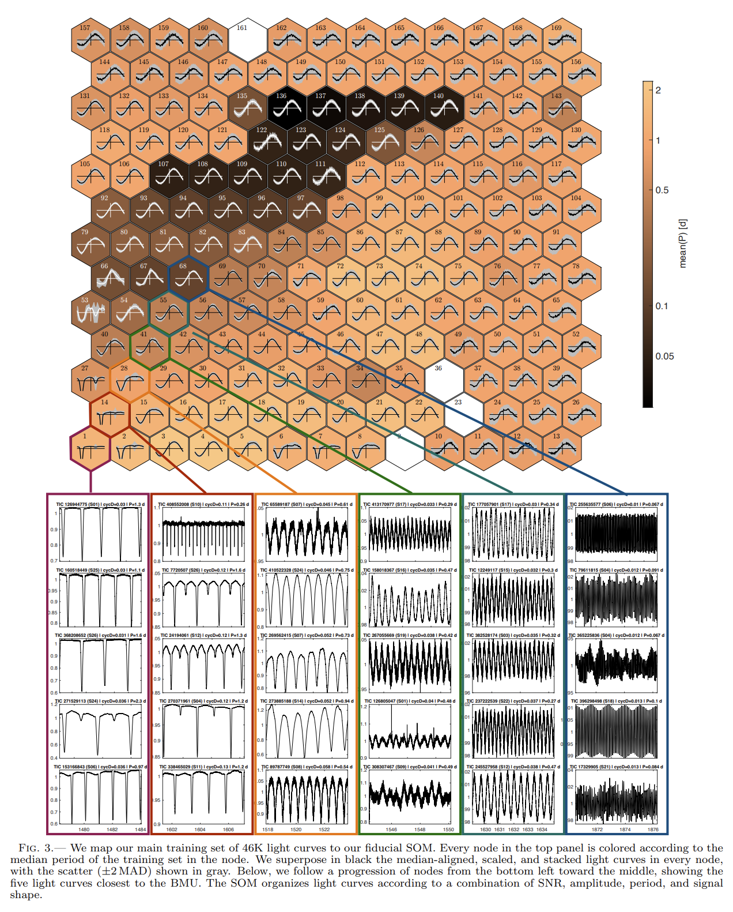

4. [Computer Vision Methods for Frequency Analysis of RFI in Radio Astronomy Data](https://arxiv.org/abs/2605.05342)

   > Radio, RFI, Computer Vision, Method

   针对 radio astronomy 中弱信号被 RFI 污染的问题，提出不预设 RFI 类型的 STFT image segmentation 清洗流程。GBT 对 PSR J1713+0747 的数据被按频率通道做 STFT，STFT magnitude 当作图像处理，用 GMM segmentation 和 energy based MAD threshold 生成 RFI mask，再 inverse transform 回到时域并进入标准 pulsar search pipeline。以单脉冲 S/N 衡量，raw data 为 19.59，Spectral Kurtosis 最优约 22.85，GMM segmentation 达 30.54，GMM 加 energy threshold 在较宽阈值范围内保持约 30 的 S/N，说明时频图像分割可更稳健地分离结构化 RFI。

   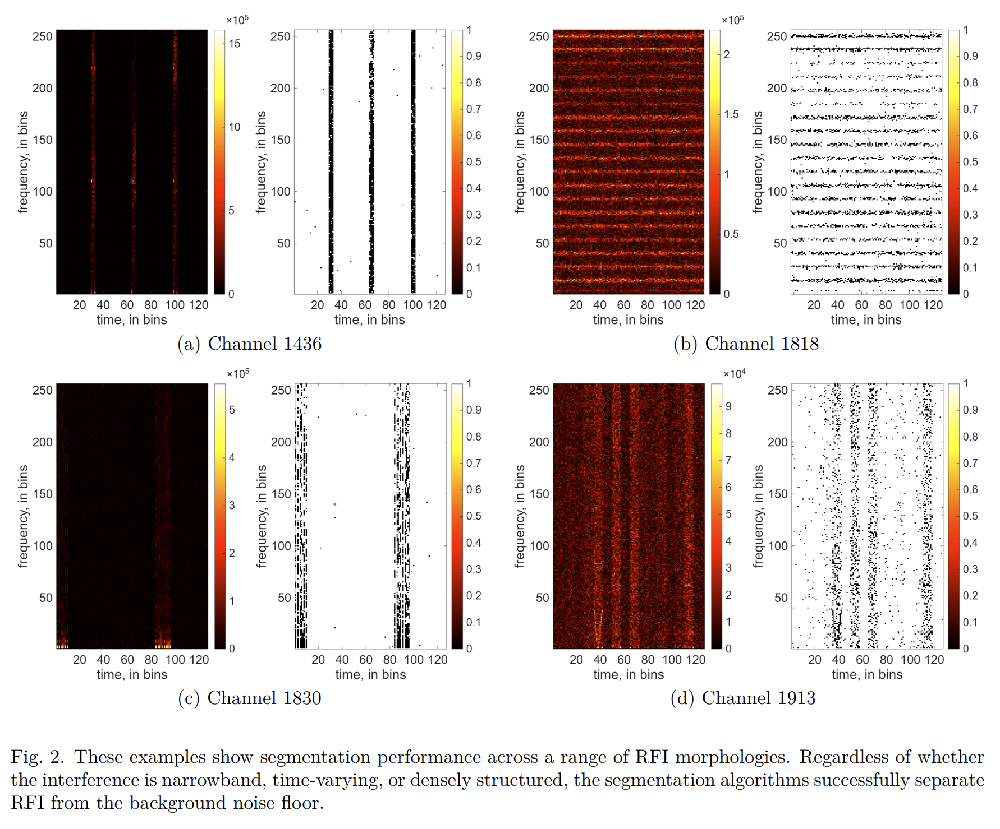

5. [AstroAlertBench: Evaluating the Accuracy, Reasoning, and Honesty of Multimodal LLMs in Astronomical Classification](https://arxiv.org/abs/2605.05573)

   > Astronomy, LLM, Benchmark, Time Domain

   [AstroAlertBench](https://astroalertbench.com) 面向 time domain astronomy 的 alert triage，使用 1500 个 ZTF first detection alerts，输入包含 science、reference、difference 三联图和 19 个 alert metadata，评估多模态 LLM 的 metadata grounding、scientific rationale 和五类分层分类：bogus、asteroid、supernova、AGN、variable star。13 个闭源和开权重模型中，Claude Opus 4.7 think 的 5-class accuracy 最高，为 $60.60\pm1.26\%$，GPT-5.4 high-think 和 Kimi K2.5 think 随后；主要盲点是 AGN 与 variable star 混淆，以及部分模型在 asteroid 上崩溃。高准确率不等于可靠自评，许多模型给出高 confidence 但无法识别自身错误；数据集和代码在 [Hugging Face](https://huggingface.co/datasets/AnonymousUser16384/AstroAlertBench) 与 [GitHub](https://github.com/LLM-for-Astronomy/AstroAlertBench)。

   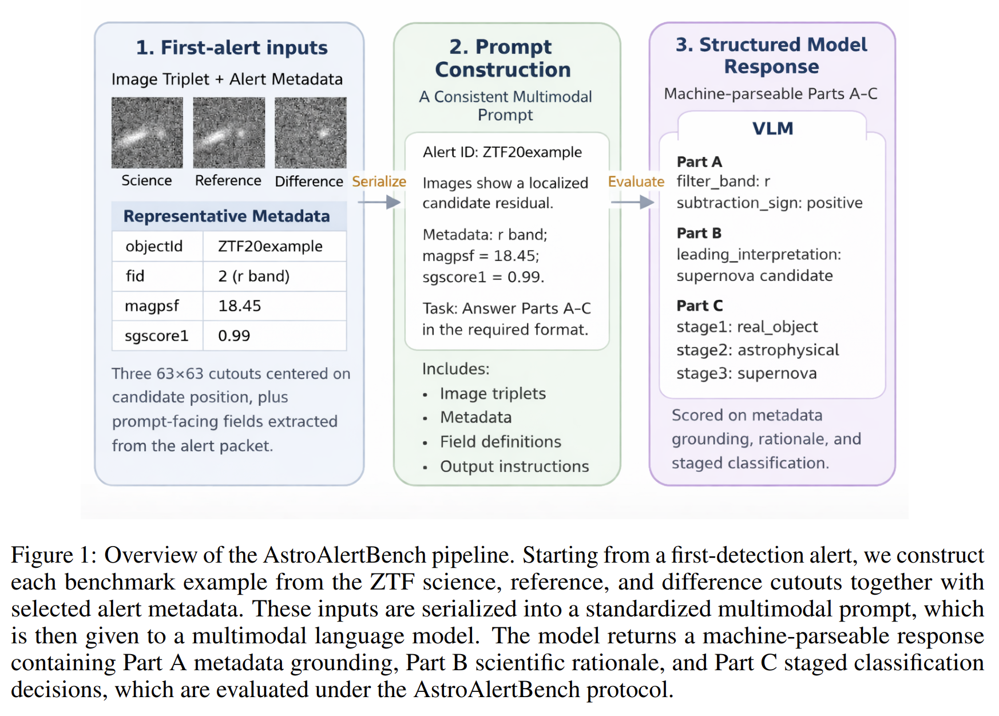

6. [Fifteen new millisecond pulsars in 47 Tucanae](https://arxiv.org/abs/2605.06492)

   > Pulsar, Globular Cluster, MeerKAT, Observation

   使用 MeerKAT/TRAPUM 对 47 Tucanae 进行两轮不同 cadence 的深度搜索，利用多 coherent beams 覆盖星团，并通过 RFI cleaning、PRESTO/Pulsar Miner 搜索、period acceleration 和多波束定位处理强 scintillation 带来的间歇探测问题。共发现 15 个新的 millisecond pulsars，其中 3 个孤立、12 个双星，使 47 Tuc 已知 pulsar 数增至 42 个，cluster binary fraction 增至 69%。亮点包括可能对应 2002 年 HST optical MSP candidate 的 47 Tuc af，以及 47 Tuc 中目前独特的 eccentric binary pulsar 47 Tuc ai；还重新定位了若干缺少 timing solution 的已知 pulsar，包括与 MeerKAT continuum source 位置一致的 47 Tuc V。
   
   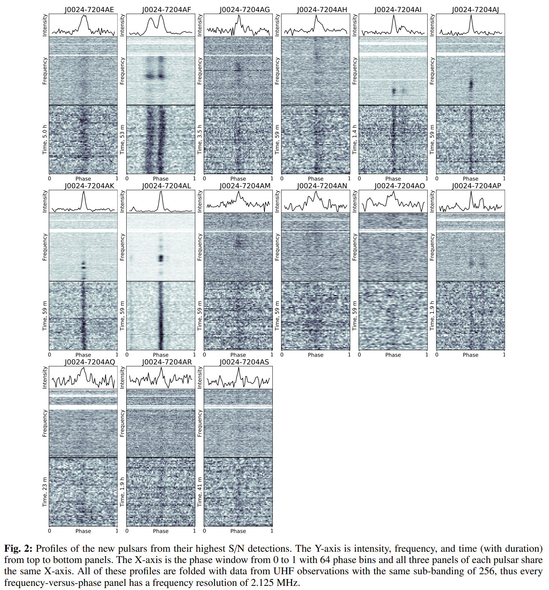

## 2026-05-11

