## 2026-05-01

1. [The Solar System Notification Alert Processing System (SNAPS): Public access to SNAPS data and products](https://arxiv.org/abs/2604.27420)

   > Solar System, Asteroid, Tool, Database

   [SNAPS](https://snaps.nau.edu/) 是面向太阳系移动天体的下游 alert broker，用于接收 ZTF 和未来 LSST 经 ANTARES 转发的已知移动天体警报，并公开对象观测、轨道信息、邮票图像和派生性质。系统只处理已知小行星、彗星等移动源，不负责新天体发现或轨道链接。

   当前网页支持按编号、临时编号或 packed designation 查询对象，返回 ZTF/LSST 观测、MPC 轨道参数、$H$ 星等、相位曲线、光变周期、振幅和颜色等产品；观测较多的目标还可在浏览器中查看图像、运行 Lomb Scargle 周期搜索、保存收藏和笔记。后续接口计划包括批量 API、异常天体 Kafka 流、跨目录查询和按物理性质筛选。

2. [First Detection of Faraday Rotation in a Gamma-Ray Burst Afterglow: Low Polarization and High Rotation Measure in GRB 260310A Reveal Jet Magnetic Structure and Environment](https://arxiv.org/abs/2604.27480)

   > Gamma Ray Burst, Polarization, Faraday Rotation, Observation

   GRB 260310A 的 VLA 11–25 GHz 偏振观测给出了首个厘米波 GRB 余辉偏振探测和首个 GRB 环境中的RM测量。观测发生在触发后约 19.2 天，结合公开多波段 GCN 测光，正向激波用于解释光学和 X 射线，射电部分用结构化喷流反向激波模型 [rsjetstruct](https://github.com/rohdog2003/rsjetstruct) 拟合。

   偏振度从 25 GHz 的约 $3.18\%$ 降到 11 GHz 的约 $0.69\%$，低频去偏振更符合同步自吸收影响。观测RM为 $RM=-6250\pm70\ {\rm rad\ m^{-2}}$，换算到 GRB 红移为 $RM_{\rm int}=-8300\pm90\ {\rm rad\ m^{-2}}$；银河系和星系际介质贡献不足以解释该值，更可能来自大质量恒星前身周围的致密磁化 HII 区。较低的高频偏振度也指向小尺度斑块状磁场，而非全局有序喷流磁场。

   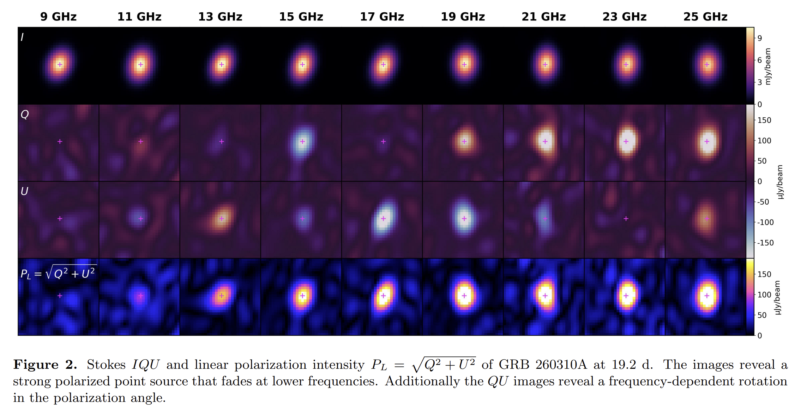

3. [An Extended Evaluation Split for DeepSpaceYoloDataset](https://arxiv.org/abs/2604.27593)

   > Astronomy, Deep Learning, Dataset, Object Detection

   DeepSpaceYoloDataset 新增 `test2026` 评估集，用于检验深空天体检测模型在智能望远镜图像上的泛化能力；数据集在 [Zenodo](https://doi.org/10.5281/zenodo.8387070) 发布。新增部分包含 335 张高分辨率 RGB 图像，来自 Stellina 和 Vespera 在法国、比利时、卢森堡的观测，目标包括星系、星云和星团。

   图像通过 Python、OpenCV、Pillow 和 Astroalign 对齐叠加，并用 MakeSense 以 YOLO 格式标注。完整数据集扩展到 5031 张图像；YOLO5m、YOLO8m、YOLO11m、YOLO12m 在原测试集和 `test2026` 上的 mAP 排名发生变化，说明新增测试集包含更复杂的分辨率、视场和观测条件，更适合作为深空目标检测的稳健性基准。

   

4. [The Large Array Survey Telescope—Pipeline. II. Image Subtraction and Transient Detection](https://arxiv.org/abs/2604.27921)

   > Transient, Survey, Pipeline, Image Subtraction

   LAST 巡天管线的第二部分负责从 Pipeline I 产生的 $20\times20$ 秒合并图像中进行实时差分成像和暂现源检测，相关软件生态使用 [AstroPack](https://github.com/EranOfek/AstroPack)。流程包括参考图像配准、ZOGY 差分、显著性图像构建、$|S|\ge5\sigma$ 候选提取、孔径和 PSF 测光，以及对坏像素、条纹、傅里叶振铃、PSF 异常、已知变星、恒星和太阳系天体的确定性过滤。

   调试数据和注入测试显示，标准参考图像下单历元极限星等约 20.3 mag，深参考图像可到约 20.7 mag。约 $4\times10^7$ 个初始检测经过过滤后降到约 $0.01\ {\rm deg^{-2}}$ 的候选密度，$S\ge7.5\sigma$ 时纯度超过 90%；单历元效率约 80%，较好条件下约 87%。主要损失来自配准裁剪和 PSF 重建限制，后续改进集中在参考图像配准、PSF 建模和可能的机器学习分类。

5. [On the polarization position angle jumps in FRB 20240114A](https://arxiv.org/abs/2604.28012)

   > Fast Radio Burst, Polarization, Observation

   FRB 20240114A 的 190 个爆发被用于研究偏振位置角在毫秒到小时尺度上的跳变。数据来自 Nançay Radio Telescope 的 1.1–1.8 GHz 全 Stokes 高时间分辨率观测和 Effelsberg 100 m 望远镜的 1.3–1.5 GHz 观测，覆盖约一年和 12 个历元，并测量 RM、线偏振、圆偏振和时间分辨位置角。

   RM 整体稳定，典型值在约 340–387 ${\rm rad\ m^{-2}}$ 范围内，未显示明显内禀 RM 演化；约 81% 的爆发具有 $L/I>0.8$ 的高线偏振，圆偏振通常较弱。位置角可在 10–15 ms 到数小时内随机变化，跳变量可接近 $90^\circ$，但没有明显偏好正负方向或精确正交跳变。稳定 RM 与随机 PPA 跳变的组合不支持单一固定磁层发射区，更倾向于多个活动发射区或双折射模式耦合、广义法拉第旋转、磁层传播、等离子体透镜等传播效应。
   
   

## 2026-05-04

1. [Random Polarization Position Angle Behaviors across Bursts of Repeating Fast Radio Bursts](https://arxiv.org/abs/2605.00372)

   > Fast Radio Burst, Polarization, Periodicity, FAST

   重复 FRB 爆发内部的偏振位置角通常近似平坦，但不同爆发之间会明显变化；问题集中在这些 PA 序列是否隐藏中子星自转或双星轨道周期。FAST FRB Key Science Project 的 4 组大样本偏振数据被用于检验这一点，包括 FRB 20201124A 的两个活跃期、FRB 20220912A 和 FRB 20240114A；低于 SNR 50 的爆发被剔除，PA 在扣除法拉第旋转后组成非均匀时间序列。

   Lomb Scargle periodogram 在 $10$ ms 到 $10^7$ ms 的周期范围内没有找到可信周期信号，单日活跃观测和 PA 群体统计的折叠搜索也没有显著调制；最强峰可由爆发序列的采样窗口和爆发内部结构造成的 aliasing 解释。各源的 PA 分布近似稳定的高斯分布，但均值和宽度随源不同。传统 RVM 被扩展为动态磁层版本：有效磁轴在不同爆发中受随机扰动而游走，使 PA 在爆发间随机变化，同时保持围绕局部磁层区域的稳定统计分布。这种框架更自然解释了重复 FRB 中缺乏 PA 周期性、但仍呈现类磁星偏振行为的现象。

   

2. [A bright wideband radio burst from the isolated neutron star 2XMM J104608.7-594306](https://arxiv.org/abs/2605.00720)

   > Neutron Star, Radio Transient, Polarization, Observation

   热辐射孤立中子星 2XMM J104608.7-594306 的 Murriyang/Parkes UWL 后随观测发现第二个相干射电爆发，说明这类原本被认为射电安静的 XDINS/CCO 候选体也可能偶发射电爆发。观测在 2025 年 4 月到 11 月累计 36 小时，UWL 覆盖 704–4032 MHz，时间分辨率 $256\,\mu$s，单脉冲搜索围绕标称 $DM=98.41\ {\rm pc\ cm^{-3}}$ 进行，并结合 FFA/PRESTO 周期搜索排查常规周期性辐射。

   新爆发的结构最大化色散量为 $DM=99.40\pm0.07\ {\rm pc\ cm^{-3}}$，旋转量为 $RM=-49.3\pm0.2\ {\rm rad\ m^{-2}}$，发射覆盖整个 UWL 带宽，谱指数 $\alpha=-2.18\pm0.16$。爆发含多个子结构，典型微结构尺度约 1.1 ms，但没有严格周期性；线偏振和圆偏振比例分别为 $54\%$ 和 $22\%$，PA 中出现类似脉冲星的正交跳变。Murriyang 爆发比 14 个月前 MeerKAT 探测到的首个爆发亮约两个数量级，峰值光度高于多数脉冲星并接近 SGR 1935+2154 的亮爆发，支持磁层相干辐射机制可在更宽的磁场强度和射电光度范围内工作。

   

## 2026-05-05

1. [Constraints on the baryon density from fast radio bursts using a non-parametric reconstruction of the Hubble parameter](https://arxiv.org/abs/2605.01990)

   > Fast Radio Burst, Cosmology, Baryon, Method

   利用 130 个已定位 FRB 的色散量约束物理重子密度 $\Omega_{\rm b}h^2$，同时拟合宿主星系对 $DM$ 的贡献。星系际介质的平均 $DM$ 依赖宇宙膨胀史，这里用 cosmic chronometer 的 35 个 $H(z)$ 测量训练 [ReFANN](https://github.com/Guo-Jian-Wang/refann.git)，先独立重构 $H(z)$，再在 FRB 似然中联合推断 $\{\Omega_{\rm b}h^2,e^\mu,\sigma_{\rm host}\}$；宿主星系 $DM$ 被建模为 log normal 分布，推断使用 nested sampling。

   真实样本给出 $\Omega_{\rm b}h^2=0.02236\pm0.00090$，$e^\mu=178.15^{+16.51}_{-16.97}\ {\rm pc\ cm^{-3}}$，$\sigma_{\rm host}=0.794^{+0.064}_{-0.067}$，与 BBN 和 Planck 的中心值只差约 $0.05\%$。包含 2000 个事件的模拟 FRB catalog 将 $\Omega_{\rm b}h^2$ 不确定度降到约 $0.8\%$，说明更大、更干净的定位 FRB 样本可以成为低红移重子密度的独立探针，但精度仍取决于宿主环境、IGM scatter 和选择效应建模。

   

2. [Baryons in the Darkest Sites of the Universe](https://arxiv.org/abs/2605.01994)

   > Fast Radio Burst, Cosmology, Cosmic Void, Baryon

   宇宙空洞内部的重子含量通过 FRB 色散量直接测量。分析将 3455 条 CHIME/FRB 视线与 SDSS BOSS 的约 1200 个 $0.2<z<0.7$ 空洞叠加交叉相关，利用 FRB 的 $DM$ 作为自由电子柱密度探针；空洞模型使用 ZOBOV 目录、有效宇宙方法和均匀密度空洞近似，气体剖面通过 [BaryonForge](https://github.com/DhayaaAnbajagane/BaryonForge) 中的 BCEmu prescription 计算。

   空洞中心方向出现 $3.2\sigma$ 的 $DM$ deficit，并在 $R\sim R_{\rm eff}$ 附近回到宇宙平均水平，符合自由电子在空洞内部欠密的图像。有效宇宙模型得到 $\alpha_v=1.80\pm0.87$，均匀密度模型得到 $\delta_{\rm e,v}=-0.58\pm0.30$，对应空洞内部平均电子密度约为宇宙平均的 $0.42\pm0.30$。结合已有 tSZ 空洞叠加结果，空洞气体温度约 $T_{\rm e}\lesssim(1.1\pm0.7)\times10^6$ K，指向 warm hot 弥散气体相；未来 CHORD、DSA、SKA 与 DESI、LSST、Euclid 等样本可把这种方法扩展到重子欠密的层析测量。

3. [The first detection of an atmosphere on a trans-Neptunian object beyond Pluto](https://arxiv.org/abs/2605.02243)

   > Solar System, TNO, Occultation, Atmosphere, Observation

   2002 XV93 是半径约 250 km 的 plutino，此前这类小型 TNO 通常被认为难以长期保持大气。2024 年 1 月 10 日的恒星掩星由日本多站观测完成，包括 Kyoto 20 cm 望远镜、Kiso 1.05 m Schmidt 望远镜和 Fukushima 25 cm 民间观测站；Kyoto 与 Kiso 给出两条正掩星 chord，Kiso 和 Fukushima 的边缘光变显示大气折射造成的渐进变暗，而非单纯 Fresnel diffraction 或恒星角直径效应。

   Kiso 光变用球对称、Pluto like 温度反转层的静水平衡大气模型和 ray tracing 拟合，分别测试纯 CH4 与 N2 主导两种成分假设。两种模型都能明显优于无大气模型，最佳半径为 $244\pm4$ km，表面压强分别为 $124^{+15}_{-12}$ nbar 和 $177^{+18}_{-19}$ nbar，约为 Pluto 当前表面压强的 1/50 到 1/100。结果说明亚 1000 km TNO 也可能短暂拥有稀薄大气；表面挥发物升华难以长期维持该大气，更可能与低水平 cryovolcanic outgassing 或近期小天体撞击产生的短寿命挥发物有关。

   

4. [PDRS : A Linear $\mathcal{O}(N)$ Algorithm for Segmentation of High-Activity Regions in Irregularly Sampled Time Series](https://arxiv.org/abs/2605.02843)

   > Time Domain, Method, Tool, AGN

   [PDRS](https://github.com/zerozole/Peak_Driven_Region_Segmentation) 是用于不规则采样时间序列的高活动区段检测算法，针对 ZTF、LSST 这类大规模时域巡天中 Bayesian Blocks 加 hill climbing 的 $\mathcal{O}(N^2)$ 成本问题。算法先按统计显著的局部峰值播种候选区域，再用 gradient aware multi source BFS 扩展，随后执行 saddle point merging 和 median based filtering，以线性 $\mathcal{O}(N)$ 时间提取持续的 flux excess。

   测试使用 ZTF DR23 的 AGN 光变和 SDSS Stripe 82 quasar 光变。对 ZTF AGN，典型参数包括 $\sigma_{\rm thresh}=2$、$r_{\rm saddle}=0.2$、$N_{\rm min}=3$、$w_{\rm smooth}=7$、$\sigma_{\rm region}=0.5$、$\Delta t_{\rm max}=60$ 天；SDSS Stripe 82 因采样更稀疏和信号更弱，使用较低峰值阈值和更长时间间隔。PDRS 找到的高活动区与 Bayesian Blocks 标记的候选 flare 相近，但对 penalty 参数不敏感，也较少把静止背景噪声过分切分，适合作为大规模光变筛选的快速预处理步骤。

   

5. [Role of General Users in the Lifecycle of Scientific Software](https://arxiv.org/abs/2605.02870)

   > Radio Astronomy, Software, Tool

   CASA 的生命周期被用作科学软件如何吸收普通用户反馈的案例。[CASA](https://casa.nrao.edu/) 是射电天文开源数据处理软件，支持 VLA、ALMA、Nobeyama 45m 以及其他干涉阵、单碟和 VLBI 数据；自 CASA 6 起同时提供 Python 包和传统 tar 包，核心代码和资源位于 [GitHub](https://github.com/casangi) 与 [Bitbucket](https://open-bitbucket.nrao.edu/projects/CASA/repos/casa6/browse)，官方文档在 [CASA Docs](https://casadocs.readthedocs.io)。

   CASA 约每三个月滚动发布一次，开发优先级由内部望远镜运行需求、ALMA/VLA/VLBA 等利益相关方、CASA User Liaison 和 NRAO Users Committee 的 DMS Panel 共同输入。普通用户的作用主要体现在长期软件健康度：例如推动可靠性测试、Mac OS 支持、VLBI 支持、单碟和干涉数据联合反卷积等非短期运行需求。面对有限支持资源，CASA 采用 `casa-feedback@nrao.edu`、文档、测试矩阵、指南和公告列表来平衡用户支持与开发负担；随着 ALMA WSU 和 ngVLA 带来更高数据率，CASA 将逐步转向维护模式，RADPS 成为下一代射电数据处理系统。

## 2026-05-06

1. [A Multi-Survey Machine-Readable Corpus of Milky Way Globular Cluster Parameters for Retrieval-Augmented Generation Applications](https://arxiv.org/abs/2605.03099)

   > Globular Cluster, Dataset, RAG, LLM

   Milky Way Globular Cluster Corpus v1.3.1 是面向 RAG 和传统定量分析的银河系球状星团机器可读语料库，数据在 [Zenodo](https://doi.org/10.5281/zenodo.19907766)。语料覆盖 174 个银河系球状星团，整合 Harris 2010 光度和结构参数、Vasiliev & Baumgardt 2021 Gaia EDR3 自行、Baumgardt et al. 2023 N-body 质量和轨道参数、Schiavon et al. 2024 APOGEE DR17 化学丰度，共 17,438 个非空数据点，提供 JSONL、嵌套 JSON 和 82 列 CSV。

   数据清洗重点放在名称解析、类型标准化、null 语义和 provenance。每个数据块保留来源引用、DOI/URL 和方法说明，缺失值区分为观测不可达、survey 覆盖缺口或目录年代差异。覆盖率为 Harris 157/174、Gaia 170/174、Baumgardt 154/174、APOGEE 72/174；JSONL 可作为向量检索中的完整星团记录，CSV 可用于 core collapse 分类、Sagittarius stream 成员识别、轨道建模、化学标记和跨 survey 系统误差检查。

2. [Utilizing Dispersion Measure of Fast Radio Bursts to Probe the Intergalactic Medium Turbulence](https://arxiv.org/abs/2605.03253)

   > Fast Radio Burst, IGM, Turbulence, Simulation

   FRB 的 $DM$ 被用于测量星系际介质湍流的结构函数。样本合并 CHIME/FRB Catalog 2 和此前公开 FRB，共 3738 个有 $DM$ 的独立源，扣除银河系 ISM 贡献并剔除 $DM>3000\ {\rm pc\ cm^{-3}}$ 以及 Galactic magnetar FRB 200428。结构函数按不同 $DM$ 上限子样本计算，用于降低源距离分布宽造成的统计偏差。

   对照样本来自 CROCODILE 宇宙学模拟；使用 100 cMpc/$h$ box 的气体和电离网格，构建 50,000 条非旋转周期 light cone 视线，相关流程在 [ARCOS](https://github.com/zhaojosephzhang/ARCOS) 的 FALCON 模块中实现。大角尺度 $\theta\gtrsim1^\circ$ 上观测结构函数与模拟一致并趋于平台；小角尺度 $\theta\lesssim0.5^\circ$ 上出现接近二维 Kolmogorov 湍流的 $\theta^{5/3}$ 标度，推得 IGM 湍流外尺度约 $L_i\approx3.8-7.4$ Mpc，保守范围约 $1.9-9.2$ Mpc。当前小角尺度 FRB 对数仍不足，亚角秒定位 FRB 样本才能把该 Kolmogorov-like cascade 变成稳健测量。

3. [StreakMind: AI detection and analysis of satellite streaks in astronomical images with automated database integration](https://arxiv.org/abs/2605.03429)

   > Satellite, Deep Learning, Tool, Observation

   StreakMind 是面向天文图像中卫星、空间碎片和近地天体线状 streak 的自动检测、几何重建、跨帧关联和数据库入库管线。数据来自 La Sagra Observatory L98 的 Celestron C14+Fastar 观测，包含 2055 张真实 FITS 图像；人工标注出 765 条 streak 后，又向真实图像注入 280 张合成长 streak 图像，形成 2335 张手工加合成训练数据。检测模型采用预训练 YOLO11 oriented bounding box，FITS 转 PNG 后生成像素坐标 OBB 标注。

   流程在检测后加入亮星 diffraction spike 过滤、沿主轴的光度增强延长、端点估计、跨帧几何外推和关联，再把结果转为 MPC-style 记录。卫星识别通过 Project Pluto Sat_ID 外部星历，采用 $1^\circ$ 搜索半径、offset 过滤和两组件 Gaussian confidence score，最终写入 SQLite 关系数据库。独立测试集上 precision 为 94%、recall 为 97%；短中等长度 streak 的检测和 OBB 重建稳定，超长 streak 仍可检测，但需要额外光度后处理改善几何范围。当前识别层主要面向人工卫星和空间碎片，NEO 自动确认和更完整测光模块属于后续扩展。

4. [Searching For Fast Radio Transients And Radio Pulsars Using SPOTLIGHT](https://arxiv.org/abs/2605.03531)

   > Fast Radio Burst, Pulsar, Pipeline, GMRT

   [SPOTLIGHT](https://spotlight.ncra.tifr.res.in/) 是 GMRT 上面向 FRB 和射电脉冲星的多波束 GPU/HPC 搜索系统，通过约 2000 个 post correlation phased array beams 覆盖单碟主波束视场，波束时间分辨率约 1.3 ms，并保留可用于实时成像定位的 visibilities。目标是在 300–1460 MHz 频段进行 commensal、targeted 和 open sky 搜索，三年运行预期可探测并定位约 300 个 FRB。

   暂现源管线把 beamformer 输出写入共享内存环形缓冲区：TEL_SHM 保存约 8 s 数据，FRB_SHM 扩展为约 402.65 s，以供 [AstroAccelerate](https://github.com/AstroAccelerateOrg/astro-accelerate) 和 [candies](https://github.com/astrogewgaw/candies) 实时处理。处理包括 [gptool](https://github.com/chowdhuryaditya/gptool) RFI 缓解、$0-2000\ {\rm cm^{-3}\ kpc}$ 试探 $DM$ 去色散、boxcar 单脉冲搜索、DM-time 和 RA-Dec 聚类、[FETCH](https://github.com/devanshkv/fetch) 候选分类，以及用 [arachne](https://github.com/astrogewgaw/arachne) 向 8-bit GMRT 实时数据注入模拟 FRB 做端到端测试。脉冲星管线包括 [Pulscan](https://github.com/jack-white1/pulscan) 快速周期搜索、AstroAccelerate 离线 FDAS、去色散、running median 去红噪、重采样修正周期导数、folding 和 [GH-VFDT](https://github.com/scienceguyrob/GHVFDT) 分类。实时多波束暂现源管线已经过测试并接近运行部署，脉冲星搜索仍需 GPU folding、folded profile 单脉冲搜索和与 PRESTO/RIPTIDE 的系统性能对比。

## 2026-05-07

1. [Overview of the New Hubble Spectroscopic Legacy Archive](https://arxiv.org/abs/2605.04167)

   > Hubble, Spectroscopy, Archive, Tool

   新版 HSLA 面向 HST 的 COS 和 STIS 光谱，目标是把 MAST 中公开或重新定标的一维光谱自动合并成按天体组织的 legacy archive。目标关联使用坐标、proper motion、Phase II 目标信息和 2″ 匹配规则，分类结合 SIMBAD、NED、NASA Exoplanet Archive 和观测申请文本，并映射到三层天文分类体系。2025 年运行版本使用截至 2025-06-25 的数据识别出 6712 个目标，为每个目标生成按观测模式、COS FUV lifetime position 以及跨模式 abutted quicklook 组织的 coadded spectra，同时保留 metadata、provenance 和 trailer 文件。

   随机检查 100 个目标后，目标关联和坐标准确度约 94%，分类和命名准确度高于 86%；与输入 x1d 光谱和 CALSPEC 标准星的比较显示，多数 COS/STIS 模式保留了输入数据的绝对和相对流量定标精度。HSLA 可通过 MAST Portal、HST Mission Search 和 astroquery 访问，coadd 代码与 HASP/HSLA wrapper 已在 Space Telescope GitHub 组织公开，并提供 notebook 支持 crowded field、变量源、径向速度变化、COS blue modes LSF 差异、STIS E1 wavelength offset 等需要人工判断的 custom coadd 场景。

2. [AGILE detection of transient γ-ray emission from the region of the supergiant fast X-ray transient source IGR J17354-3255](https://arxiv.org/abs/2605.04818)

   > High Energy, Gamma Ray, SFXT, Observation

   利用 2007–2024 年 AGILE consolidated archive 搜索 IGR J17354-3255 区域的 0.1–10 GeV 快速伽马耀发，评估未知瞬变源 AGL J1736-3250 与 supergiant fast X-ray transient 的物理关联。AGILE/GRID 数据采用 FM3.119 filter、H0025 IRF、BUILD25 Science Tools 和 `agilepy` 做 binned multi-source likelihood，源模型包含 AGL J1736-3250 及 21 个邻近 2AGL 源，并结合 Swift 与 INTEGRAL 的 X-ray 数据做轨道相位比较；数据、high level maps 和 notebooks 在 [AGILE_detection_AGLJ1736-3250](https://github.com/AGILESCIENCE/AGILE_detection_AGLJ1736-3250.git)。

   共检出 19 个 one-day γ-ray flaring bins，重复耀发的 post-trial 显著性约 6.04σ；堆叠 19 次耀发达到 11σ，定位与 IGR J17354-3255 一致，光子谱指数为 $2.10\pm0.11$，平均 0.1–10 GeV 光子流量为 $(1.89\pm0.27)\times10^{-6}\ {\rm ph\ s^{-1}\ cm^{-2}}$。多数日尺度耀发的光子集中在 2–6 小时窗口，符合低 duty cycle 的瞬变行为；8/19 次耀发集中在轨道相位 0.4375–0.5000，约对应 apastron 附近，机会概率约 $8.65\times10^{-6}$。Swift/INTEGRAL 的 X-ray 相位曲线更平滑并接近 periastron 增强，AGILE γ-ray 活动更像随机亮耀发，支持 AGL J1736-3250 与 IGR J17354-3255 可能相关，但高能辐射区或机制不同，仍需要 Fermi-LAT 深分析、射电观测和更具体的 SFXT 高能辐射模型检验。
   
   

## 2026-05-08

1. [Multi-wavelength outburst activity from EP J174942.2-384834: a very faint X-ray transient discovered by Einstein Probe](https://arxiv.org/abs/2605.05303)

   > X Ray, Transient, Black Hole, Observation

   围绕 Einstein Probe 在 2025 年 3 月发现的 Galactic transient EP J174942.2-384834，结合 EP、NICER、NuSTAR、Swift、SVOM、ATLAS、SALT 和 MeerKAT 的 X-ray、optical、UV、radio 数据做多波段跟踪。7 个月内出现两次主要 outburst 和一次 rebrightening，X-ray luminosity 变化超过三个数量级；光谱长期保持 hard state，$Γ\simeq1-2$，可由 very soft seed photons 的 thermal Comptonization 描述，没有显著热盘成分。optical/UV 与 X-ray 同步增亮并呈 blue continuum 和宽 Balmer 吸收，radio 未检出，整体支持它是一个 very faint X-ray transient black hole candidate，但吸积体类型仍需后续静默态和新 outburst 观测确认。

   

2. [Stellar rotation and binaries in open clusters with Gaia DR3](https://arxiv.org/abs/2605.05313)

   > Gaia, Open Cluster, Stellar Rotation, Binary

   利用 Gaia DR3 的 rotational broadening、rotation period，以及文献中的近百万个银河系 open cluster 成员星，建立超过 70 万颗成员星、近 6000 个星团的样本，研究主序、binary sequence、blue straggler、eMSTO、红巨星等族群的自转行为。结果包含 4.4 万多颗有自转刻画的恒星、近 5.7 万个变量源和 2.2 万多个双星；eMSTO 或 split MS 星团增至约 100 个，质量高于 $10^3 M_\odot$ 的星团大多显示 eMSTO；blue straggler 总样本接近 2000 个，其中约 75% 的对象转速高于 40 km s$^{-1}$，快速自转的红巨星和亚巨星更可能与近期双星相互作用有关。

3. [A useful representation of TESS light curves](https://arxiv.org/abs/2605.05324)

   > TESS, Time Series, Method, Tool

   面向 TESS 大规模 light curve 探索，构造一种不依赖标签和显式 period 输入的低维表示。light curve 先转成 quantile graph 或 scattering transform 特征，再经 PCA 压缩并映射到 self organizing map；约 1500 组模型配置比较后，选用紧凑的 quantile graph 方案，并应用到约 150 万条 TESS 2-minute cadence light curves。该表示主要按 variability amplitude、signal to noise、characteristic timescale 和 morphology 组织样本，重复观测中的同一目标通常落在 SOM 的相邻区域，说明捕捉到较稳定的源性质；交互工具在 [tess-l8.space](http://tess-l8.space)。

   

4. [Computer Vision Methods for Frequency Analysis of RFI in Radio Astronomy Data](https://arxiv.org/abs/2605.05342)

   > Radio, RFI, Computer Vision, Method

   针对 radio astronomy 中弱信号被 RFI 污染的问题，提出不预设 RFI 类型的 STFT image segmentation 清洗流程。GBT 对 PSR J1713+0747 的数据被按频率通道做 STFT，STFT magnitude 当作图像处理，用 GMM segmentation 和 energy based MAD threshold 生成 RFI mask，再 inverse transform 回到时域并进入标准 pulsar search pipeline。以单脉冲 S/N 衡量，raw data 为 19.59，Spectral Kurtosis 最优约 22.85，GMM segmentation 达 30.54，GMM 加 energy threshold 在较宽阈值范围内保持约 30 的 S/N，说明时频图像分割可更稳健地分离结构化 RFI。

   

5. [AstroAlertBench: Evaluating the Accuracy, Reasoning, and Honesty of Multimodal LLMs in Astronomical Classification](https://arxiv.org/abs/2605.05573)

   > Astronomy, LLM, Benchmark, Time Domain

   [AstroAlertBench](https://astroalertbench.com) 面向 time domain astronomy 的 alert triage，使用 1500 个 ZTF first detection alerts，输入包含 science、reference、difference 三联图和 19 个 alert metadata，评估多模态 LLM 的 metadata grounding、scientific rationale 和五类分层分类：bogus、asteroid、supernova、AGN、variable star。13 个闭源和开权重模型中，Claude Opus 4.7 think 的 5-class accuracy 最高，为 $60.60\pm1.26\%$，GPT-5.4 high-think 和 Kimi K2.5 think 随后；主要盲点是 AGN 与 variable star 混淆，以及部分模型在 asteroid 上崩溃。高准确率不等于可靠自评，许多模型给出高 confidence 但无法识别自身错误；数据集和代码在 [Hugging Face](https://huggingface.co/datasets/AnonymousUser16384/AstroAlertBench) 与 [GitHub](https://github.com/LLM-for-Astronomy/AstroAlertBench)。

   

6. [Fifteen new millisecond pulsars in 47 Tucanae](https://arxiv.org/abs/2605.06492)

   > Pulsar, Globular Cluster, MeerKAT, Observation

   使用 MeerKAT/TRAPUM 对 47 Tucanae 进行两轮不同 cadence 的深度搜索，利用多 coherent beams 覆盖星团，并通过 RFI cleaning、PRESTO/Pulsar Miner 搜索、period acceleration 和多波束定位处理强 scintillation 带来的间歇探测问题。共发现 15 个新的 millisecond pulsars，其中 3 个孤立、12 个双星，使 47 Tuc 已知 pulsar 数增至 42 个，cluster binary fraction 增至 69%。亮点包括可能对应 2002 年 HST optical MSP candidate 的 47 Tuc af，以及 47 Tuc 中目前独特的 eccentric binary pulsar 47 Tuc ai；还重新定位了若干缺少 timing solution 的已知 pulsar，包括与 MeerKAT continuum source 位置一致的 47 Tuc V。
   
   

## 2026-05-11

1. [A PINK update: Improvements to the CELEBI fast radio burst data reduction and analysis pipeline](https://arxiv.org/abs/2605.06766)

   > Fast Radio Burst, Pipeline, Polarization, Tool

   PINK 是 CELEBI 管线的一组升级，用于把 ASKAP/CRAFT 的原始电压数据处理成 FRB 的亚角秒定位和最高 3 ns 时间分辨率的偏振数据。更新包括 RACS 天测校正、沿波束轴的定位误差处理、time and frequency gating、matched filter imaging、near field imaging，以及新的偏振泄漏建模和校准流程。高 DM、低 S/N 的 FRB 20251019A 展示了 matched filter imaging 对定位精度的提升，但目前仍未确认宿主星系。结构最大化 DM 工具 [SHRINE](https://github.com/marcinglowacki/SHRINE) 和 Docker 化的 [celebi-container](https://github.com/marcinglowacki/celebi-container) 已公开，容器化后 CELEBI 可迁移到 OzSTAR 以外的计算环境，并使典型运行时间提升超过两倍。

2. [Machine Learning Techniques for Astrophysics and Cosmology: Photometric Redshifts](https://arxiv.org/abs/2605.06790)

   > Photometric Redshift, Machine Learning, Cosmology, Review

   综述 photometric redshift 在 LSST、Euclid 等 Stage IV 巡天中的作用：光谱红移精确但无法覆盖数十亿暗弱星系，photo-z 只能从多波段光度、颜色和星系族群先验中推断个体红移或整体 $N(z)$。传统 discriminative AI 包括 MLP、Gaussian Process、mixture density network、random forest、SVM、SOM 等，主要依赖带光谱标签的训练集；主要瓶颈来自训练样本不代表目标星系族群、光谱失败和错误红移、blending、样本方差以及测光系统误差，目前均值红移精度仍比 Stage IV 弱透镜要求差约一个数量级。

   另一条路线是 generative AI 和 forward modelling：显式建模星系族群先验、SED、图像生成、测量过程、selection function 和 blending，再用 simulation based inference、normalizing flow、diffusion model、neural emulator 等把 Bayesian photo-z 推断扩展到大样本。核心结论是，photo-z 问题不能只靠更强的回归器解决；面向宇宙学的关键量是校准后的 redshift distribution 和后验覆盖率，需要 posterior predictive checks、coverage tests、模型错设测试和端到端宇宙学参数偏移检验。

4. [You Only Stack Once (YOSO): A Motion-Filtered, Deep-Learning Framework for Detecting Faint Moving Sources](https://arxiv.org/abs/2605.06913)

   > TNO, Deep Learning, Solar System, Method

   YOSO 面向宽场巡天中的暗弱移动天体检测，核心是 Gaussian Motion Filter：对每个像素的时间序列做与移动点源经过像素时近似高斯响应匹配的滤波，只生成一张 motion filtered stack，再用 YOLOv8-L 识别轨迹。测试数据来自 DECam Ecliptic Exploration Project 的 B1 象限 4 个 field nights；训练集由合成移动源、MPC 已知天体、空背景、宇宙线和伪迹组成，共 16000 张图像、68420 个对象，训练约 200 epochs。

   在 4 个 DEEP field nights 上，YOSO 找回 KBMOD 已报告的 73 个 TNO 中的 45 个，并发现 11 个新的 TNO；它的极限星等平均比 KBMOD 亮约 0.88 mag，但 false positive 很低，后续 shift and stack refinement 后 purity 接近 99%。同一单速度 GMoF 设置还识别出 216 个此前未报告、视运动 10–60 arcsec hr$^{-1}$ 的近太阳系天体，以及 27 个超过 60 arcsec hr$^{-1}$ 的对象。该方法适合作为 shift and stack 的互补管线，尤其适合 LSST deep drilling fields、NEO Surveyor 和其他需要增强运动相关弱信号的时域图像场景。

## 2026-05-12

1. [Discovery of 30 Repeating Fast Radio Burst Sources and Uniform Population Statistics of 80 Repeating Sources from CHIME/FRB](https://arxiv.org/abs/2605.08410)

   > Fast Radio Burst, CHIME, Repeater, Population, Observation

   面向FRB重复源人口统计和所有FRB是否都会重复的问题，CHIME/FRB从第二目录的4539个爆发中识别重复源候选。分析使用RA、Dec和$DM$空间中的DBSCAN聚类，并用非均匀泊松过程的机会重合概率筛选显著候选；随后结合曝光、灵敏度阈值和统一到5 Jy ms的爆发率，比较重复源与表观一次性FRB。

   新增30个重复FRB源，使CHIME/FRB观测到的重复源样本达到80个。重复源观测比例为$2.4\pm0.4\%$，随观测时间没有显著增长；重复源爆发率与一次性源的上限分布没有显示清晰双峰。基于[zDM](https://github.com/FRBs/zdm)的人口建模在当前数据下仍允许50–100%的表观一次性FRB来自重复源分布。另有4个重复源显示年尺度近似线性$DM$变化，提示局域环境或传播效应可能随时间演化。

   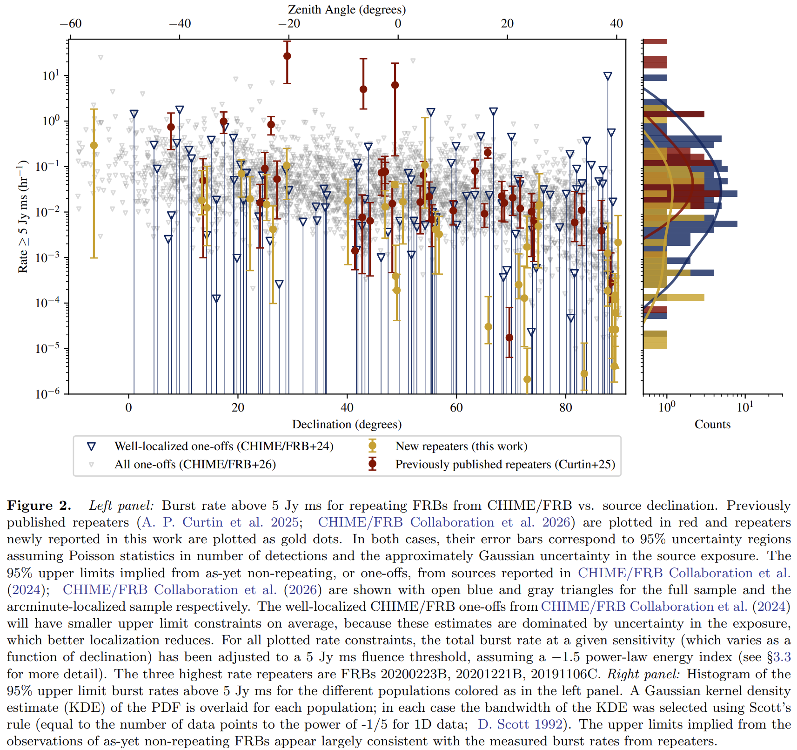

2. [Tracing the kinematic perturbations of the Milky Way spiral arms with APOGEE DR17 and Gaia DR3](https://arxiv.org/abs/2605.10092)

   > Milky Way, Spiral Arm, Kinematics, Gaia

   利用APOGEE DR17与Gaia DR3构建红巨星样本，最终选出46330颗盘星并平滑得到二维银心径向速度场，用来约束银河系旋臂对恒星运动的非轴对称扰动。模型采用两臂对数螺旋势，在稳态径向速度响应中同时保留$V_{R,\sin}$和$V_{R,\cos}$项，并用AGAMA轨道积分和dynesty贝叶斯参数恢复验证。写文章的时候，方法这部分可以抄。

   改进模型能在模拟速度场中恢复相位和振幅到约2%水平，明显优于只含$V_{R,\sin}$的处理。观测数据给出的旋臂俯仰角约为$10^\circ$，太阳半径处局部面密度反差约5–18%，旋臂图案速度倾向于$\Omega_p \approx 10$–$20\ {\rm km\ s^{-1}\ kpc^{-1}}$。Lindblad共振和共转共振会强烈改变径向速度场，因此共振处理是从恒星流运动反推旋臂结构的关键限制。

   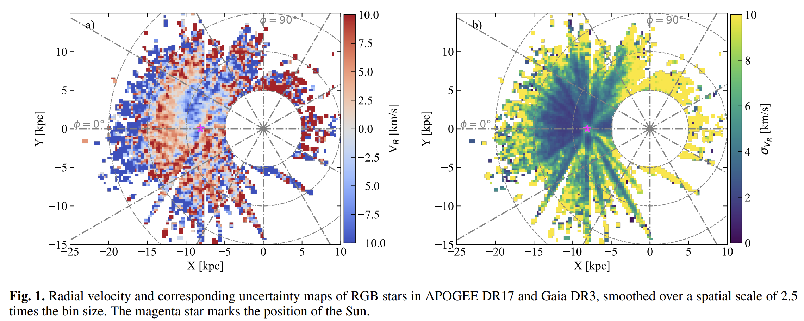

3. [From Large Telescopes to the MUltiplexed Survey Telescope (MUST)](https://arxiv.org/abs/2605.10102)

   > Astronomy, Spectroscopy, Instrument, Survey, Review

   围绕宽视场高复用光谱能力在2030年代的缺口，回顾大型光学望远镜和光谱巡天的发展，并以MUST作为Stage V光谱巡天设施案例。MUST设计为6.5米宽视场光谱望远镜，可在约5平方度视场内同时获取超过2万个目标的光谱，焦面采用6.2 mm间距的模块化机器人光纤定位器。

   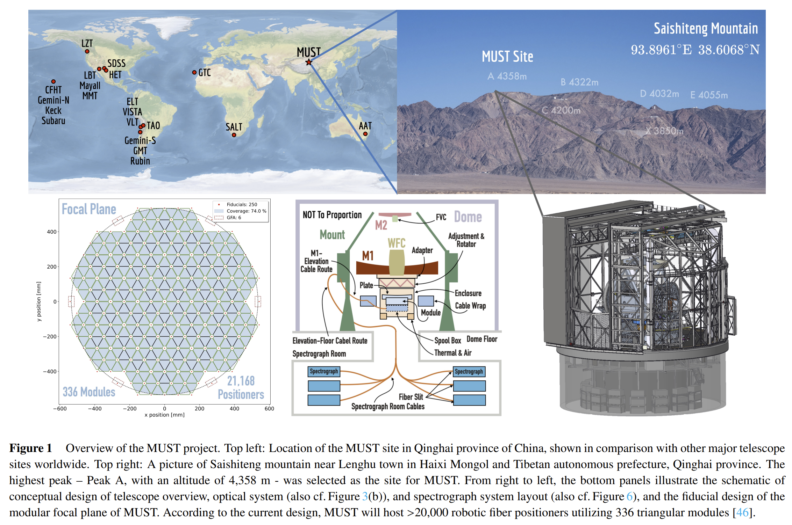

   设计目标是在8年巡天中覆盖超过10000平方度，获得超过1亿个星系和类星体的光谱红移，支持暗能量、结构增长、原初非高斯性、中微子质量、暗物质、星系演化、银河系考古和时域天文学。当前方案包括Ritchey Chretien加宽视场改正器、21168个光纤定位器、约40台三通道光谱仪，波长覆盖约370–960 nm，分辨率约$R\sim1900$–5000；焦面、光纤、光谱仪和高海拔运行环境仍是主要工程挑战。

   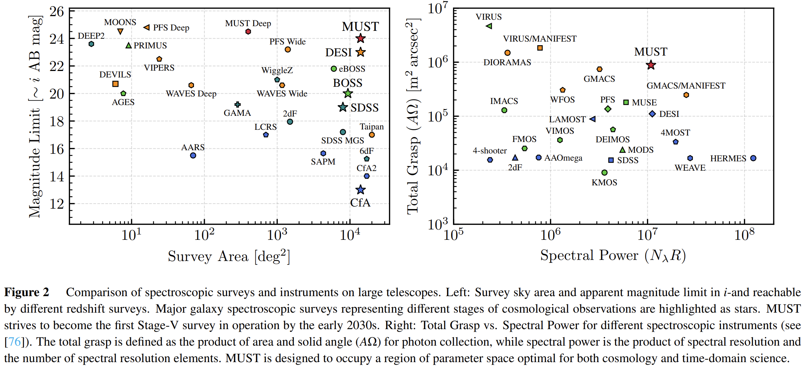

4. [Application of Machine Learning to 21 cm Cosmology](https://arxiv.org/abs/2605.10105)

   > 21 cm Cosmology, Machine Learning, SKA, Review

   综述机器学习在宇宙黎明和再电离时期红移21 cm观测中的作用，重点面向SKA Low时代的科学分析。21 cm信号由密度、电离状态、自旋温度和辐射背景共同决定，具有强非高斯性；实际观测还受到前景污染、RFI、电离层扰动、校准误差和高维参数推断成本限制。

   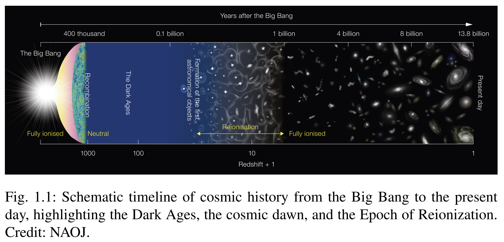

   机器学习方法被分为三类：观测域方法处理RFI筛选、前景建模、校准残差和图像重建；理论域方法用仿真代理模型或摘要统计加速前向建模；推断域方法用CNN、回归器或simulation based inference从功率谱、图像、light cone和全局信号中约束天体物理与宇宙学参数。可靠路径不是用端到端神经网络替代物理模型，而是在保留物理结构、传播不确定度、进行覆盖率和域偏移检验的前提下，把ML作为混合分析管线中的加速和正则化组件。

5. [Characterizing Pulsar Distances Using H I Kinematics](https://arxiv.org/abs/2605.10881)

   > Pulsar, H I, Kinematics, Distance, Tool

   更新脉冲星中性氢$H I$运动学距离，用归档$H I$吸收和发射径向速度为66条脉冲星视线重新计算距离约束。方法采用Reid et al. 2019银河系旋转曲线，把$H I$速度上下限、单侧限和切点速度转化为距离范围，并对英仙臂方向的特殊运动和云团随机运动加入修正。

   距离结果发布在[Zenodo](https://doi.org/10.5281/zenodo.19775798)，同时提供估算脉冲星$H I$运动学距离的[Python脚本](https://github.com/stella-ocker/psr-HI-kinematics)。新距离与Frail & Weisberg 1990目录平均相差约10%，主要来自不同旋转曲线；具有视差距离的样本中，几乎全部在$1\sigma$内一致，少数在$2\sigma$内一致。与NE2025银河电子密度模型的预测总体相符，但系统误差、特殊运动修正和$H I$测量本身仍是限制精度的主要来源。
   
   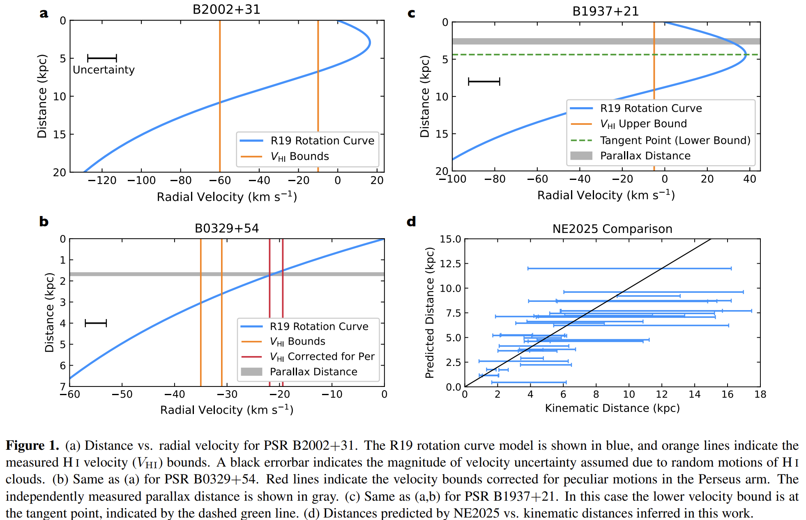

## 2026-05-13

1. [Survey Footprint Explorer: A Browser-Based Interactive Tool for Visualizing and Cross-Matching Astronomical Survey Footprints](https://arxiv.org/abs/2605.11099)

   > Astronomy, Survey, Tool, Visualization

   [Survey Footprint Explorer](https://www.lammimahad.com/survey-footprint-explorer) 是一个零安装的浏览器工具，用来显示、比较和交叉匹配大型天文巡天的天空覆盖区域。工具用客户端JavaScript实现，核心覆盖计算由WebAssembly版Rust MOC库完成，不需要服务器；界面同时提供Aladin Lite交互天球和D3全天天图投影。

   当前版本包含13个巡天足迹，包括Euclid DR1、LSST WFD、Roman HLWAS和HLTDS、DESI Legacy DR9、DES、HSC、KiDS、UNIONS、eRASS1和ACT。足迹用MOC/HEALPix表示，可计算多巡天重叠面积，上传CSV或TSV源表后为每个源追加是否落入各巡天区域的布尔列，也支持用户上传自定义MOC足迹。主要贡献是把多巡天覆盖区比较、源表成员判定和可导出的全天天图整合到一个轻量级网页工具中。

   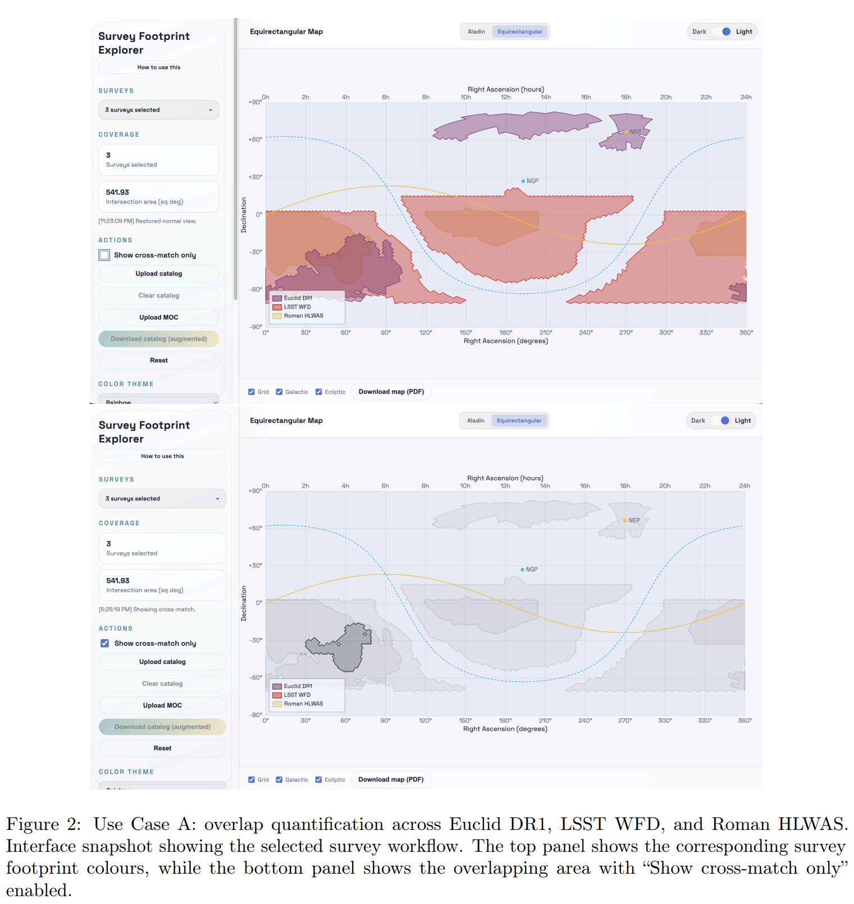

2. [Quantifying the Reconstructability of Astrophysical Methods with Large Language Models and Information Theory: A Case Study in Spectral Reconstruction](https://arxiv.org/abs/2605.11154)

   > Astronomy, LLM, Reproducibility, Information Theory, Method

   提出一种用LLM和信息论评估天体物理方法可复现性的框架，问题被表述为从论文文本$X$重建算法$Y$的条件分布$P(Y|X)$。方法用不同文本层级（标题、标题加摘要、标题加摘要加方法）提示模型生成候选算法，再在关键词空间和代码语义嵌入空间中聚类，用Shannon entropy、Jensen Shannon divergence、mutual information和与ground truth的距离衡量论文文本对算法空间的约束能力。

   案例是从稀疏光度测量重建TNO光谱。实验1用DeepSeek R1 Distill Qwen 14B和GPT oss 20B各生成200个样本，实验2用Gemini 3.1 Pro、ChatGPT 5.2和Claude 4.6 Sonnet生成可执行Python流程。结果显示，增加方法文本能把模型推向正确的大框架，例如PCA、KDE和机器学习组合，但不能消除实现层面的残余分散；LLM通常能生成可运行流程，却会漏掉非负反射率、潜空间协方差、Gaussian copula等隐含专家约束，导致结果过度自信或科学校准不足。信息论框架代码在[astro_entropy](https://github.com/sevenlin123/astro_entropy)，光谱重建流程在[spectra_reconstructor](https://github.com/sevenlin123/spectra_reconstructor/)。

3. [Periodic Emission Frequency Modulation in a Hyperactive Fast Radio Burst](https://arxiv.org/abs/2605.12098)

   > Fast Radio Burst, Periodicity, Spectrum, Observation

   针对超活跃重复FRB 20240114A的频谱演化，使用Parkes 64米望远镜Murriyang的UWL接收机数据分析爆发中心频率是否存在长周期调制。观测覆盖约16个月，原始样本包含5526个$S/N \geq 7.5$爆发；周期搜索只使用$S/N>20$的高信噪比爆发，以降低去色散和中心频率测量误差。周期性由Lomb Scargle periodogram和phase folding两种方法独立检验。

   中心发射频率存在显著的约112.91天周期调制，单周期内频率从低频向高频系统漂移；Lomb Scargle和phase folding的保守显著性均超过$6\sigma$，尾部分布外推给出更高显著性。FAST同期数据呈现相近的中心频率演化趋势，但爆发到达时间本身没有显著周期性。单纯自由自由吸收难以解释高频缺失而低频仍可见的现象，更可行的解释包括双星系统中随轨道相位变化的吸收和回旋共振吸收，或磁星自由进动导致视线角度周期变化。
   
   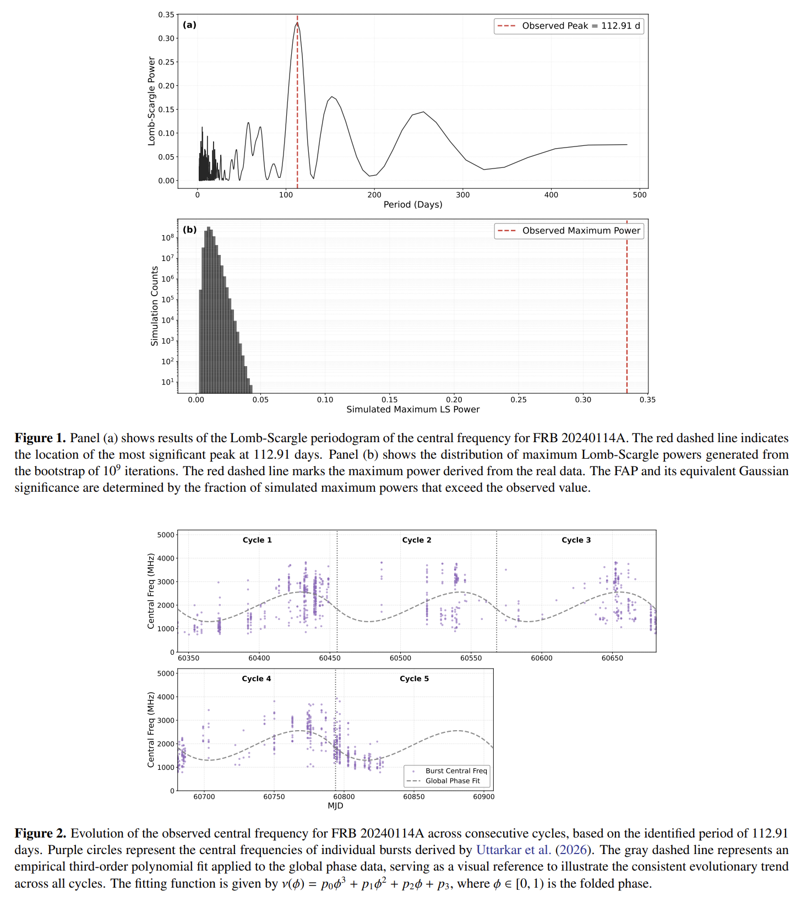

## 2026-05-14

1. [Magnetar-powered long gamma-ray bursts and connection to superluminous supernovae and fast radio bursts](https://arxiv.org/abs/2605.13440)

   > Gamma Ray Burst, Magnetar, Supernova, FRB, Theory

   针对长GRB的磁星中心引擎问题，从Swift XRT余辉光变中筛选169个具有平台后接近 $t^{-2}$ 衰减特征的LGRB，其中78个有光谱红移，其余用Amati关系估计伪红移。通过MCMC拟合平台光度 $L_0$ 和断裂时间 $t_b$，再在磁偶极自旋下降模型中反推出初始自转周期 $P_0$ 和极向磁场 $B_p$。

   样本满足Dainotti相关，斜率接近 $-1$，支持平台期近似恒定能量注入；推得 $B_p \sim 2.6 \times 10^{15}$ G、$P_0 \sim 4.0$ ms，并得到 $B_p \propto P_0^{0.8}$ 的正相关。与SLSNe和FRB相关磁星相比，GRB磁星的磁场约高一个数量级，指向更强磁化的坍缩条件或不同能量释放通道。

2. [DEFROST: Detecting Excess in Faraday Rotation thrOugh Sophisticated analysis Techniques](https://arxiv.org/abs/2605.13605)

   > Radio, Faraday Rotation, Cosmology, Method

   DEFROST面向RM-grid中的河外磁场测量问题，用Bayesian Information Field Theory同时分离银河系Faraday rotation、河外贡献和观测噪声；输入为点源Faraday depth目录及红移、Stokes I光度等辅助信息，实现基于[NIFTy](https://ift.pages.mpcdf.de/nifty/)。河外Faraday rotation被建模为零均值高斯方差项，并拆成源内亮度相关项和沿视线环境红移相关项。

   用基于NVSS、LoTSS和Van Eck等目录特性的合成样本测试算法边界。银河磁场功率谱以大尺度为主时更容易分离银河和河外项；在当前类似NVSS/LoTSS的数据密度和噪声下，远离银道面的样本更稳健，$|b|>45^\circ$ 时河外参数恢复效果最好。结果说明现有RM目录已可用于统计约束河外Faraday excess，但精确红移和未来SKA级高密度RM-grid会显著改善宇宙磁场测量。

   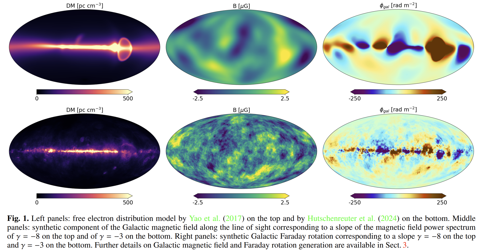

3. [Detector for fast wave trains in the solar radio emission](https://arxiv.org/abs/2605.13728)

   > Solar, Radio, QFP, Deep Learning

   面向太阳射电动态谱中快速准周期传播波列QFP的自动识别，使用HiRAS在2011年的20 MHz到2.5 GHz、1秒时间分辨率数据，并以50个全球日冕EUV波作为目标事件。检测器由合成flare时间序列训练的CNN/FCN分类网络和相邻频率时间轮廓相关性筛选组成，用不同平滑窗口覆盖不同QFP时间尺度。

   自动搜索得到75个QFP候选检测，对重复宽带事件合并后为50个独立候选，其中13个与全球EUV波相连。射电QFP与全球波的关联比例为26%，Wilson 95%区间为16%到39%，随机符合概率估计低于10%，Z-score为4.0。结果支持部分全球日冕波事件在射电波段存在快速波列响应，但候选事件仍需要EUV、硬X射线或多台站观测进一步验证。

   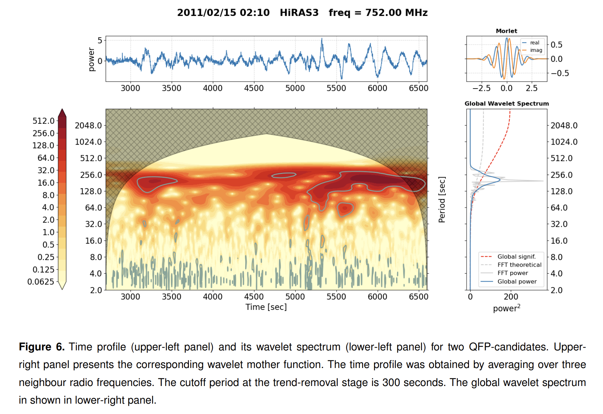

## 2026-05-15

1. [Determining star formation histories and age-metallicity relations with convolutional neural networks](https://arxiv.org/abs/2605.13973)

   > Galaxy, Star Formation History, Deep Learning, PHANGS

   面向近邻星系中空间分辨的恒星形成历史和年龄金属丰度关系恢复，构建结合卷积层、注意力机制和共享潜空间的CNN，同时输入PHANGS-MUSE积分场光谱和PHANGS-HST五个NUV/光学波段测光，输出16个年龄bin中的恒星质量比例和平均金属丰度。训练集包含165,000组合成光谱和HST测光，覆盖不同SFH、金属丰度演化、尘埃消光和SNR，并与pPXF全谱拟合比较。

   CNN在合成测试集上给出更低偏差和散布，平均年龄散布约0.12 dex、金属丰度散布约0.03 dex，推理速度比传统全谱拟合快约$5\times10^3$到$2\times10^4$倍。应用到NGC 3627时，恢复出与旋臂和恒星形成区一致的年轻星族结构，以及空间连续的年龄和金属丰度分布。

   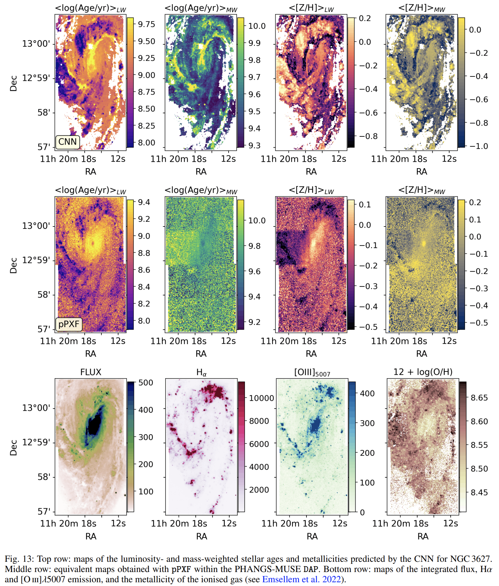

2. [The Homogeneous MeerKAT and Swift/XRT X-ray Binary Radio:X-ray Plane](https://arxiv.org/abs/2605.14003)

   > XRB, MeerKAT, Swift, Radio, Observation

   利用ThunderKAT五年MeerKAT射电监测和Swift KAT准同时Swift/XRT观测，构建目前最大的同质X射线双星radio:X-ray平面；数据包括948个射电点和1029个X射线点，射电采用MeerKAT核心通量密度，X射线采用吸收修正后的1–10 keV通量。机器可读数据和交互页面在[ThunderKAT网站](https://thunderkat.physics.ox.ac.uk/)，分析与作图代码在[GitHub](https://github.com/JustineCrook/Radio_X-ray_Plane_Paper_2026)。

   软态中经常检测到未分辨核心射电辐射，主要可能来自此前抛出的喷流物质，而非重新建立的紧致喷流。黑洞和黑洞候选体的全样本回归给出$L_R-L_X$斜率约$\beta=0.57$，与经典标准轨道一致；中子星样本受上限和数量限制更大，但整体比黑洞系统射电暗约10–100倍。不同源在平面上的分支和散布说明吸积盘与喷流耦合随源性质和吸积状态演化，单一普适关系不足以描述全部样本。

   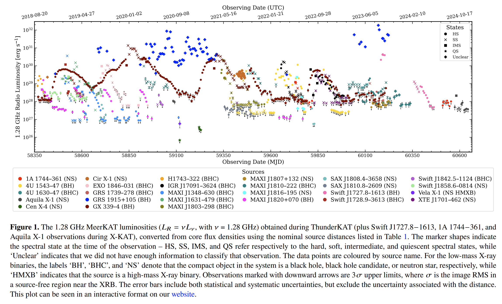

3. [Beyond AI as Assistants: Toward Autonomous Discovery in Cosmology](https://arxiv.org/abs/2605.14791)

   > Cosmology, AI Agent, LLM, Method

   探索AI从辅助工具走向自主科学发现的工作流，提出两个互补系统：CMBEvolve用于有明确量化指标的任务，通过LLM引导的代码演化和树搜索迭代改进候选算法；CosmoEvolve用于开放式研究任务，模拟由PI agent和多个student scientist agents组成的虚拟实验室，通过工具、技能、记忆和共享状态协作。

   CMBEvolve在[FAIR Universe Weak Lensing ML Uncertainty Challenge](https://www.codabench.org/competitions/10902/)的弱引力透镜图像分布外检测任务中通过代码演化逐步提高评分。CosmoEvolve在[ACT DR6](https://lambda.gsfc.nasa.gov/product/act/act_dr6.02/)温度图数据上自主生成split cross pseudo-$C_\ell$和多频相干性诊断，识别出频段对和尺度依赖的稳定窗口。结果仍是初步演示，但说明宇宙学可以同时提供可评分benchmark和开放式真实数据任务，用于检验AI scientist系统。

   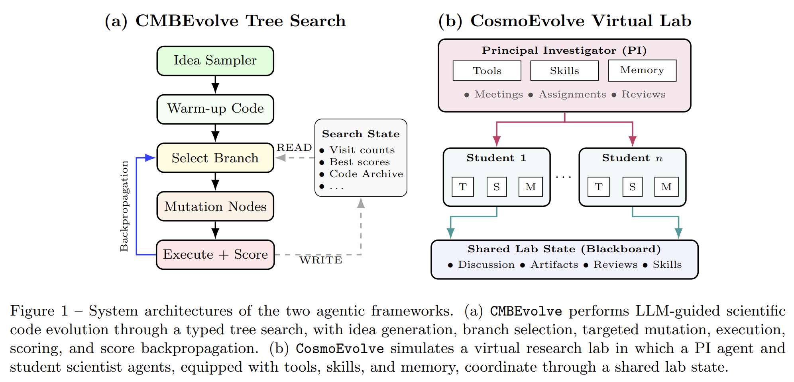

4. [Imaging without visibilities: FAST-Effelsberg scintillometry of PSR B1508+55](https://arxiv.org/abs/2605.15004)

   > Pulsar, Scintillation, ISM, Method

   针对没有传统visibility的双站观测能否做散射屏精密天测的问题，使用FAST和Effelsberg 100米望远镜对PSR B1508+55进行两次成功的同步观测。动态谱经过RFI清理、频率和时间网格对齐后，利用强度交叉次级谱、地球自转造成的投影基线变化、闪烁弧曲率和MCMC模型拟合，约束一屏和两屏散射模型。

   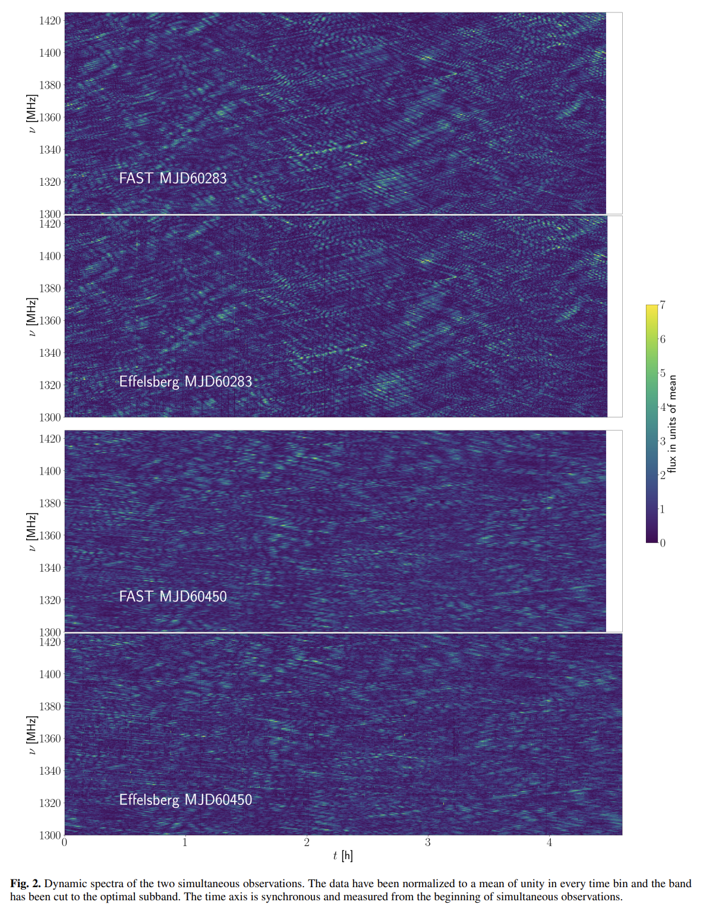

   两个历元都能在约0.1 mas分辨率下重建脉冲星散射像，对应星际介质中约0.01 AU尺度；近屏散射像高度一维各向异性，但存在小尺度偏离。屏方向角的单历元约束优于多年单站弧曲率监测，并显示近屏方向正在演化。只要有清晰闪烁弧，两台望远镜的同步闪烁观测可以作为低成本VLBI替代方案，用于未来散射屏成像和ISM小尺度结构研究。

   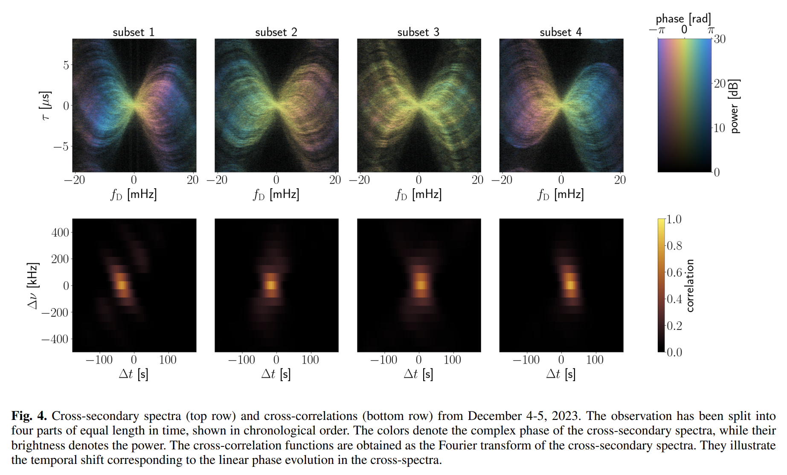

5. [Strong Gravitational Lensing with the James Webb Space Telescope](https://arxiv.org/abs/2605.15189)

   > JWST, Strong Lensing, Cosmology, Review

   综述JWST时代强引力透镜的主要科学应用，覆盖透镜基础、暗物质和宇宙学约束、高红移星系、早期星系光度函数、再电离、透镜AGN和SMBH、星团、极端放大的单颗恒星、透镜超新星和星系团演化。JWST的近红外深度、角分辨率和光谱能力与透镜放大和多像验证结合，使HST时代难以到达的低光度、高红移、小尺度和瞬变源成为常规目标。

   GLASS、UNCOVER、CANUCS、PEARLS、GLIMPSE、MAGNIF、SLICE和VENUS等项目已经把JWST强透镜样本扩展到数十个星系团。GLIMPSE等深场通过透镜把高红移光度函数推进到$M_{\rm UV}\sim -12$量级；JWST还发现更多极端放大恒星、星团、little red dots、Population III候选体和透镜超新星，包括$z=5.13$的SN Eos。强透镜正在把JWST推向更暗、更远和更小尺度的源，并与ALMA、Euclid、LSST、Roman和未来ELT形成互补。
   
   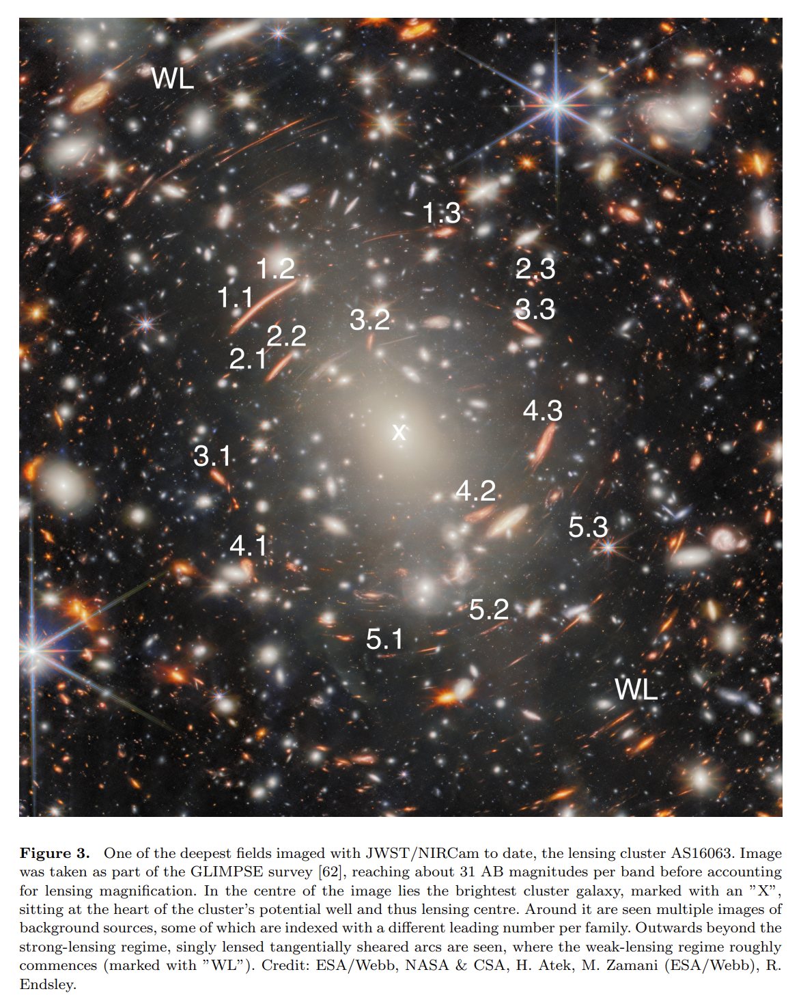

## 2026-05-18

1. [Rotationally modulated highly circularly polarised radio pulses from the rapidly rotating M dwarf ASKAP J181335-604720](https://arxiv.org/abs/2605.15587)

   > M Dwarf, Radio, Polarization, Observation

   针对早中型M矮星中相干射电爆发究竟来自耀发还是磁层过程的问题，使用ASKAP对ASKAP J181335-604720进行800–1088 MHz观测，并与TESS光学测光严格同步。ASKAP在2025年6月4日获得10小时观测，另有2025年5月29日独立历元；TESS Sector 93的Lomb–Scargle周期为$P=5.607\pm0.003$ h，对应恒星自转。Gaia/eROSITA对应体显示该源位于84 pc，$T_{\rm eff}=3405$ K，符合M3–M4矮星。

   射电脉冲在固定自转相位重复出现，主脉冲宽约20 min，另有较弱次脉冲，峰值圆偏振接近100%，但同步TESS数据中没有对应光学耀发。保守估计亮温$T_b\gtrsim1.8\times10^{12}$ K，超过非相干辐射极限；800–1088 MHz的电子回旋脉泽解释要求发射区磁场至少约$190$–$390$ G。结果支持大尺度磁层控制的auroral-like ECM辐射，而不需要近距离行星相互作用或长周期射电暂现源解释；同步射电和光学观测能有效区分M矮星磁层相干辐射与经典耀发活动。
   
   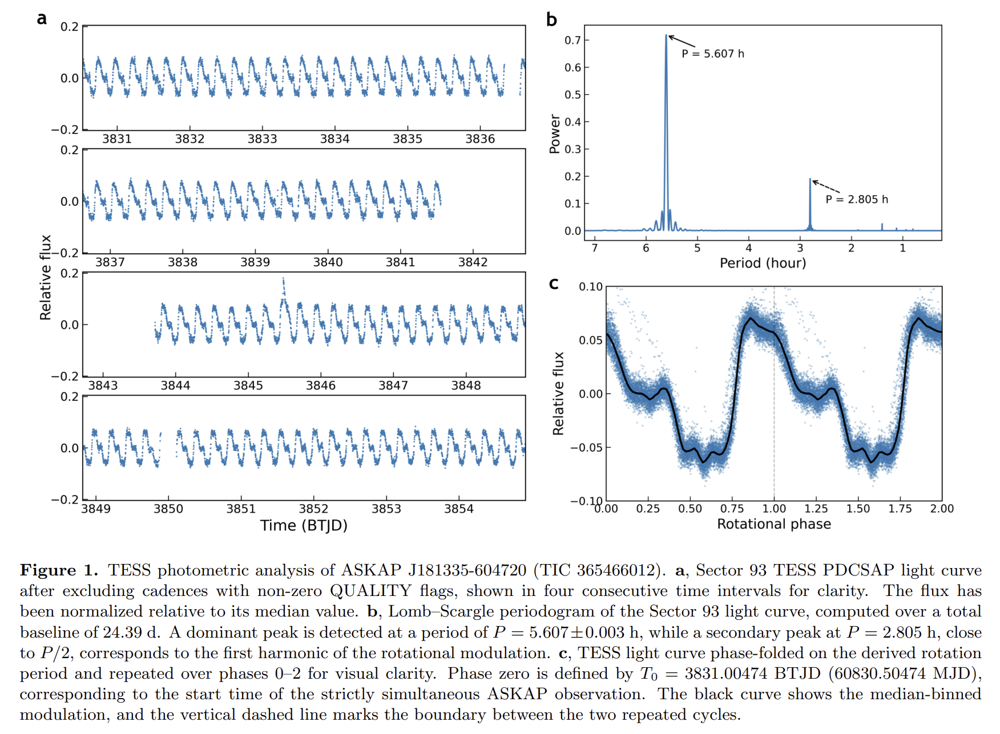

## 2026-05-19

1. [The Rapid ASKAP Continuum Survey VII: Spectra and Polarisation In Cutouts of Extragalactic Sources (SPICE-RACS) Second Data Release -- Unveiling the Magnetised Sky](https://arxiv.org/abs/2605.16917)

   > Radio, Polarization, RM, Survey

   发布SPICE-RACS第二版数据，用ASKAP RACS-low3的800–1088 MHz低频巡天数据构建南天到赤纬$+49^\circ$的偏振源和旋转量网格。处理流程围绕总强度源制作Stokes $I,Q,U$ cutout谱立方体，对约400万射电源、550万个射电成分提取偏振谱，并用RM synthesis测量宽带Faraday旋转量；数据产品指向[CSIRO DAP](https://doi.org/10.25919/jr11-yj30)和[CASDA](https://data.csiro.au/domain/casda)。

   去重后在$8\sigma$线偏振阈值下得到246509个可靠RM，在$6\sigma$阈值下得到342606个唯一偏振成分，成为目前最大的单一RM星表，面密度约$6.7^{+1.8}_{-1.7}\ {\rm deg^{-2}}$，有效角分辨率约$23'$，宽带RM典型不确定度约$2\ {\rm rad\ m^{-2}}$。新的RM网格揭示了银河系中心、旋臂、麦哲伦云、Vela超新星遗迹和G353-34等区域的磁化电离结构，并为POSSUM、MeerKAT和SKA的深偏振巡天提供宽天区参考。
   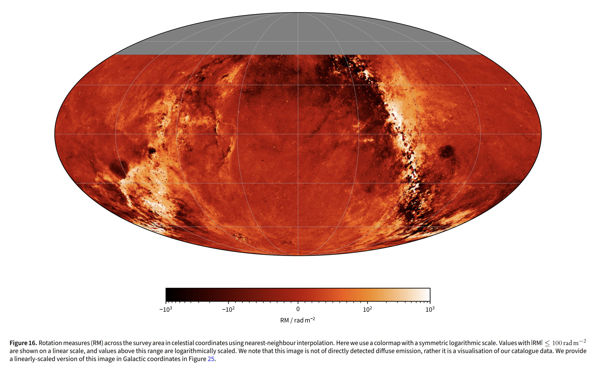

2. [Search for the Highest-energy Quasiperiodic Oscillation in the Black Hole X-Ray Binary Candidate Swift J1727.8-1613](https://arxiv.org/abs/2605.18050)

   > Black Hole, X Ray Binary, QPO, High Energy

   针对黑洞X射线双星候选体Swift J1727.8-1613在2023年爆发中的低频QPO高能延伸，使用Insight-HXMT硬X射线观测搜索100 keV以上的调制信号。由于QPO频率随时间演化，分析采用Hilbert-Huang transform从26–150 keV光变中提取瞬时相位，再把更高能段光子按相位折叠，并用$\chi^2$检验和与低能模板互相关评估显著性。

   NaI探测器中QPO轮廓可延伸到250 keV以上，互相关显著性约$8.9\sigma$；CsI探测器在100–300 keV也显示清晰QPO轮廓，250–300 keV显著性约$5.7\sigma$。QPO fractional rms在100 keV以上单调下降，到300 keV约1%，相对26–40 keV的软相位滞后随能量增加并在200 keV以上快速变大。这些能谱和相位滞后行为支持type-C LFQPO的几何起源，较自然地对应小尺度喷流进动。

3. [A 4200-hour HyperFlash and ÉCLAT campaign on the hyperactive FRB 20240114A: constraining energetics with the most brilliant bursts](https://arxiv.org/abs/2605.18513)

   > Fast Radio Burst, Observation, Energetics, Magnetar

   对超活跃重复FRB 20240114A进行4233.58小时监测，结合HyperFlash的Onsala、Stockert、Toruń、Westerbork、Dwingeloo和ÉCLAT的Nançay观测，重点约束高能爆发、累积能量释放和DM演化。主要样本包含178个HyperFlash爆发，其中176个在L波段约1.4 GHz，搜索和处理使用[FRB-baseband](https://github.com/pharaofranz/frb-baseband)、SFXC phased array和Dwingeloo管线等工具。

   这些高能爆发的各向同性等效累积射电能量约$4.4\times10^{42}$ erg，是FAST约11553个低能爆发样本累积能量的约2倍。最亮单个爆发STROOP达到$1.4\times10^{42}$ erg，贡献整个L波段样本约三分之一能量，说明极少数最亮爆发可主导能量预算。累积能量分布在约$2\times10^{40}$ erg附近出现折断，低能和高能段斜率不同；DM在318天内线性增加$+0.96\pm0.06\ {\rm pc\ cm^{-3}}$。结果整体符合磁星来源图景，并暗示低能与高能FRB可能对应磁星中等耀发和巨耀发一类不同能量释放通道。
   
   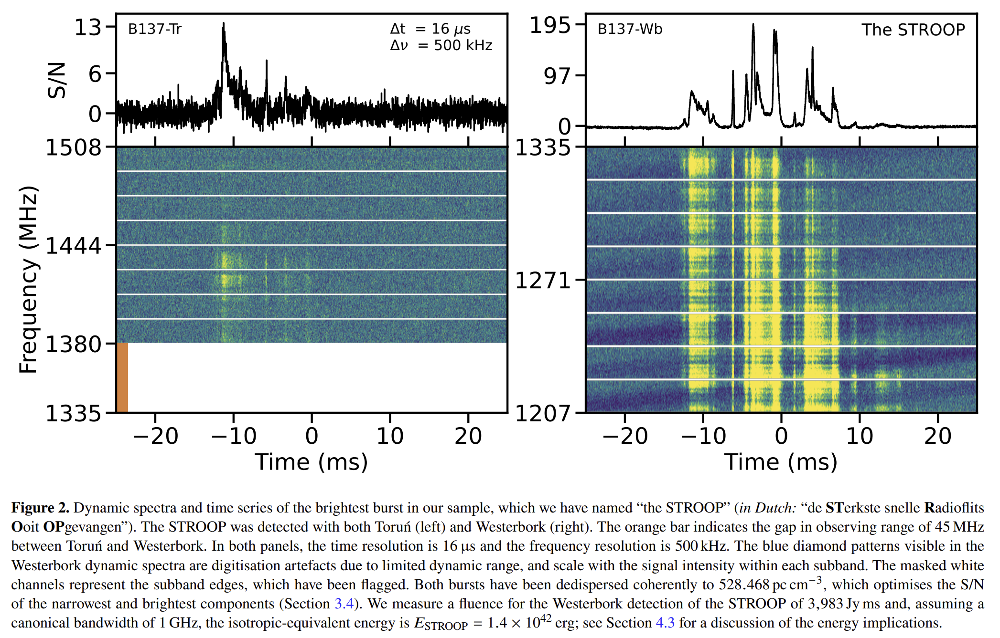

## 2026-05-20

1. [Hyrax: An Extensible Framework for Rapid ML Experimentation and Unsupervised Discovery in the Era of Rubin, Roman, and Euclid](https://arxiv.org/abs/2605.18959)

   > Astronomy, Machine Learning, Tool, Unsupervised Learning

   [Hyrax](https://github.com/lincc-frameworks/hyrax)是面向Rubin、Roman、Euclid等大规模巡天的开源Python机器学习框架，解决天文ML项目中数据获取、训练、推理、实验比较、向量检索和潜空间可视化分散且难复用的问题。框架支持Rubin LSST和HSC数据获取、多模态数据集、PyTorch模型训练、多GPU运行、MLflow/TensorBoard监控、Optuna调参、向量数据库相似搜索，以及二维/三维交互式潜空间探索；文档和示例在[这里](https://hyrax.readthedocs.io/)。

   五个示例覆盖无监督表示学习、星系团尺度引力弧候选搜索、ZTF早期暂现源多模态分类、太阳系远距天体shift and stack假阳性过滤、以及HSC/LSST类图像中的半分辨矮星系检测。Rubin DP1 ECDFS约$4\times10^5$个星系的无监督应用找到了未出现在Euclid Q1和DES LSB参考星表中的并合星系与低表面亮度候选，同时把成像伪迹分离到潜空间低密度区域；矮星系检测示例中，合成源注入训练的CNN达到0.2%的假阳性率。主要贡献是把天文ML中可复用的工程基础设施标准化，使无监督发现和快速方法迭代更接近常规工作流。

   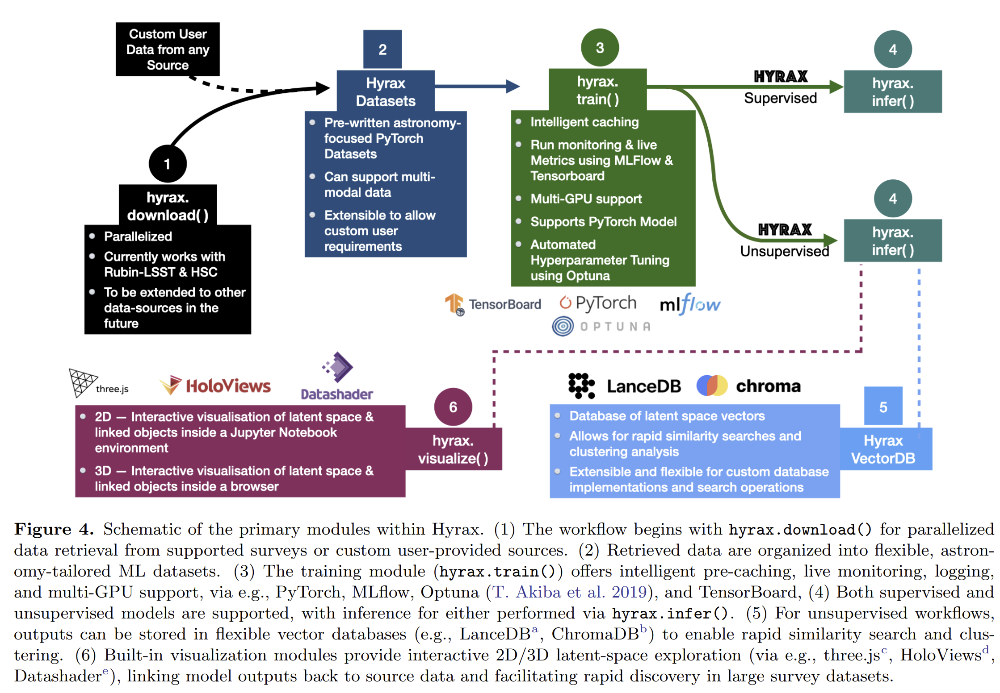

2. [Faraday Complexity and Depolarization in LOFAR Two-metre Sky Survey (LoTSS-DR2) Polarized Radio Sources](https://arxiv.org/abs/2605.19226)

   > Radio, Polarization, Faraday Rotation, AGN

   利用LoTSS-DR2 RM Grid中1565个偏振射电源的120–168 MHz LOFAR HBA频段Stokes $Q,U$谱，研究低频偏振源的Faraday复杂性和退偏振机制。分析对每个源拟合1到3个RM成分，并在Faraday thin、外部Faraday dispersion、内部differential Faraday rotation及混合模型之间用BIC选择；RM Grid和对应频率谱可在[LoFAR MKSP数据页](https://lofar-mksp.org/data/)获取。（是不是可以从LoTSS-DR2中找点光变源用FAST来看看）

   43.2%的源需要两个或三个Faraday成分，说明多成分磁电离结构很常见；54.1%的源由外部屏主导，60.2%显示显著外部Faraday dispersion，只有10.3%符合纯内部differential Faraday rotation。多成分模型中的本征偏振角差通常小于$30^\circ$，RM差值峰值约$20\ {\rm rad\ m^{-2}}$，更像同一或平滑变化磁电离环境中的相关发射区。静止系$\sigma_{\rm RM,rest}$随红移和射电光度增加，其中红移是更主要驱动因素，指向高红移射电AGN周围更湍动、更致密或更强磁化的环境。

   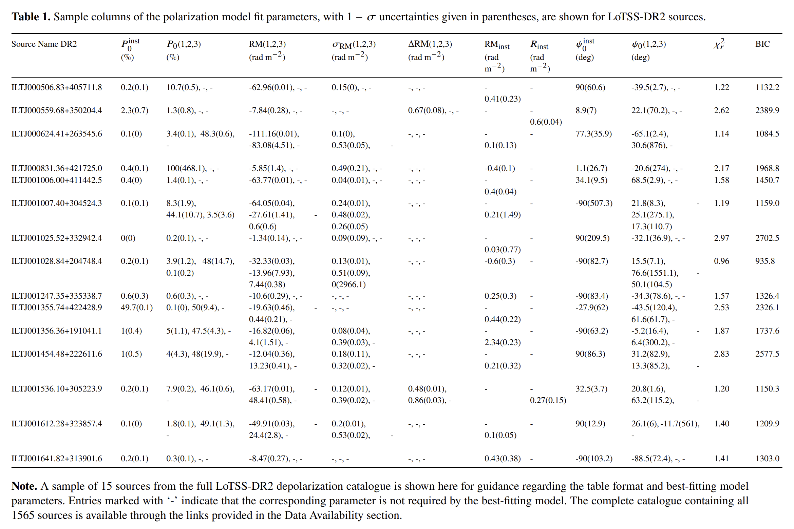

3. [Evidence for Intermediate-Mass Black Holes From Microlensing Signatures in CHIME/FRB catalog 2](https://arxiv.org/abs/2605.19653)

   > Fast Radio Burst, Microlensing, Black Hole, PBH

   针对中等质量黑洞难以直接确认的问题，利用FRB毫秒级动态谱中的微透镜回声信号搜索致密透镜。分析基于CHIME/FRB Catalog 2的4539个爆发，重点筛选340个多峰FRB；流程先用光变自相关函数寻找同一时间延迟的峰对，再检查到达顺序、频率漂移和不同频段的hardness ratio一致性，公开动态谱来自[CANFAR](https://www.canfar.net/storage/list/AstroDataCitationDOI/CISTI.CANFAR/25.0066/data)，筛选代码在[MICRO-FRB](https://github.com/Huan-Zhou-spec/MICRO-FRB)。

   最终保留FRB 20190131D和FRB 20211115A两个候选微透镜事件，对应透镜质量分别约为$[1544,2571]\,M_\odot$和$[539,609]\,M_\odot$，落在IMBH区间。如果视线方向没有星系或星系团等介入结构，这些透镜可能是孤立且原初起源；在这种解释下，相关质量段PBH约占暗物质的4%。如果两个候选都不是真实引力透镜信号，则CHIME/FRB Catalog 2给出$M>300\,M_\odot$的中等质量PBH丰度约13%的95%置信上限。论文也强调FRB内禀发射或等离子体传播效应可能产生类透镜结构，需要偏振、更高时间分辨率和更完整光谱模型来确认。

4. [Spectral classification of brown dwarfs using machine learning](https://arxiv.org/abs/2605.20146)

   > Brown Dwarf, Machine Learning, Photometry

   针对褐矮星光谱型难以通过简单颜色关系确定的问题，使用2MASS和WISE多波段光度训练监督分类器，在缺少高信噪比光谱时估计光谱类型。样本来自UltracoolSheet，剔除大质量伴星和潜在未分辨双星后得到1723个孤立褐矮星；输入特征包括$J,H,W1$绝对星等和$W1-W2$、$J-H$、$J-W1$、$J-W2$颜色，目标分为M6–M9、L0–L4、L5–L9、T0–T4、T5–T9和Y六类，训练/测试按70/30划分并做5折交叉验证。

   Random Forest和Gaussian Processes在测试集上分别达到F1=0.86和0.87；在196个有文献光谱型的直接成像褐矮星外部样本上，两者与已知分类的一致率超过80%，非相邻类别误分比例约为3%和7%。随后应用到21个无既有光谱型的直接成像孤立褐矮星，多数被归入M6–M9或L0–L4。主要限制来自晚型尤其Y矮星训练样本不足，但多颜色机器学习分类已经能捕捉传统二维颜色图中不明显的复杂趋势，可作为大规模光度巡天中光谱跟进前的初筛工具。

## 2026-05-21

1. [Robustness Analysis of USmorph: II. Optimizing Feature Extraction, Dimensionality Reduction, and Clustering for Unsupervised Galaxy Morphology Classification](https://arxiv.org/abs/2605.20871)

   > Galaxy, Morphology, Machine Learning, Method

   针对大规模巡天中无标签星系形态分类的稳定性问题，系统测试[USmorph](https://github.com/IAAA-246011/USmorph)无监督模块中的特征提取、降维和聚类配置。样本为COSMOS场近10万个$I$波段星系，红移范围$0.2<z<1.2$、$I_{\rm mag}<25$；流程先用预训练CNN抽取形态特征，再降维、聚类，并用聚类标签构造后续监督分类训练集。

   ImageNet预训练AlexNet在五种特征编码器中最适合提取星系形态结构；UMAP在保留局部和全局结构、计算效率与聚类准确率之间表现最好；K-means、Birch和Agglomerative clustering组合成Bagging式多聚类投票后，标签一致性和纯度更稳定。最终采用$K=16$作为聚类数，在分类粒度和人工验证成本之间取得平衡；t-SNE可视化显示更紧凑的形态分离，分类结果在参数空间中也符合星系演化预期，为CSST等未来深场巡天的自动形态分析提供可扩展方案。

   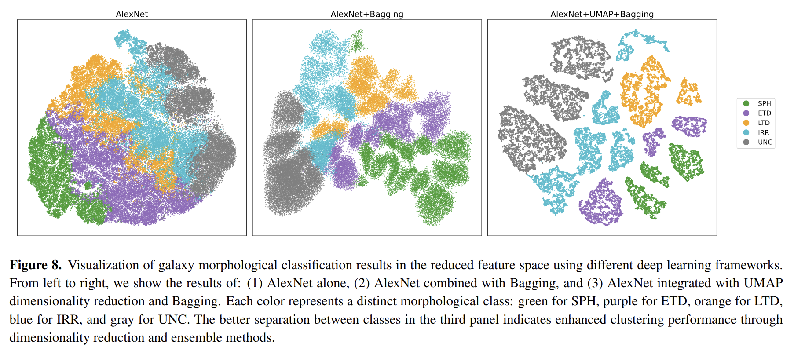

2. [Type-III solar radio bursts with spike-like toppings](https://arxiv.org/abs/2605.20937)

   > Solar, Radio, Type III Burst, Polarization

   使用中国子午工程二期Chashan Broadband Solar radio spectrometer at meter wavelengths（CBSm）的90–600 MHz高时间和高频率分辨率数据，统计研究type III太阳射电暴高频起始端的spike-like cluster。样本包含2023年11月至2025年10月间35个事件中的502个spike–type III配对，其中309对有可用偏振数据；识别时结合偏振、频谱形态、时间和频率分离，并在复杂重叠情形下使用强度阈值和互相关辅助分离。

   spike-like cluster通常先于对应type III暴出现：87%的配对提前0.5–3 s，80%的配对在频率上高出3–30 MHz。spike结构形态多样，包括点状、团块状、单向和双向漂移、弥散结构；部分漂移结构显示正负两个方向的频率漂移，指向源区既有朝向太阳也有远离太阳的运动。偏振差异更显著，64%的spike cluster最大圆偏振超过0.6，而82%的type III暴低于0.4。结果支持spike辐射来自多尺度、不均匀且快速演化的电子加速区，type III暴则在电子逃逸后沿开放磁力线向外传播时产生。

   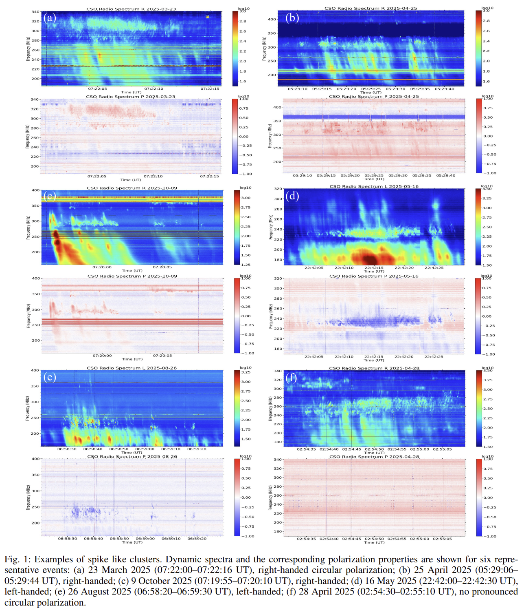

3. [Searching for links between energetic millisecond pulsars and repeating fast radio bursts](https://arxiv.org/abs/2605.21331)

   > Fast Radio Burst, Pulsar, Giant Pulse, Observation

   针对FRB 20200120E位于M81球状星团、可能不是年轻磁星而是毫秒脉冲星巨脉冲的解释，使用Parkes Murriyang望远镜UWL接收机观测银河系最高自转能损率毫秒脉冲星M28A（PSR B1821-24A）。观测覆盖0.7–4.0 GHz、时间分辨率$2.0\,\mu$s，在8.77小时数据中检测到156个信噪比超过7的巨脉冲，并进行全带和子带单脉冲搜索；相关代码和数据产品在[Zenodo](https://doi.org/10.5281/zenodo.19283133)。

   M28A巨脉冲可呈现700–4000 MHz宽带谱，并带有约100 MHz尺度的窄带谱峰，但没有发现真正孤立的窄带巨脉冲。与FRB 20200120E相比，M28A巨脉冲持续时间短约50倍、谱光度低约$10^5$倍，具有清晰自转周期性和Poisson等待时间分布；FRB 20200120E则无显著周期性并可出现burst storm。两者共同点是能量分布较陡、DM变化都很小。整体上没有强证据支持M28A类毫秒脉冲星巨脉冲与FRB 20200120E直接相连，但仍不能排除FRB 20200120E属于没有银河系对应体的罕见MSP类源。

   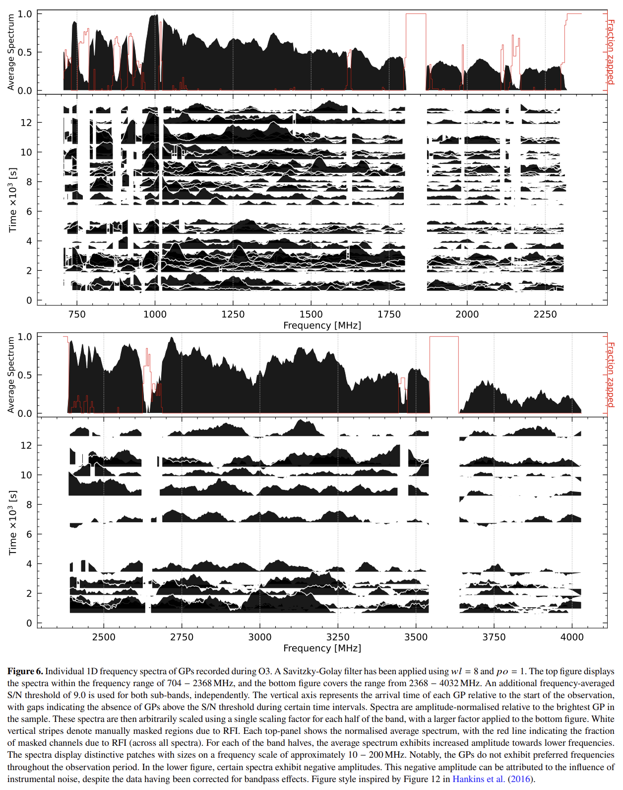

4. [Compact Object Astrophysics with Frontline Astrometry](https://arxiv.org/abs/2605.21375)

   > Compact Object, Astrometry, Black Hole, Review

   围绕高精度天体测量在致密天体物理中的作用展开综述，重点是微角秒到毫角秒级位置、视差和自行测量如何约束中子星、恒星级黑洞和超大质量黑洞的运动学。Gaia和VLBI已经把致密天体研究从单纯光变和光谱推进到三维空间速度测量，可用于估计超新星natal kick、检验黑洞直接塌缩或回落超新星形成通道，并发现非吸积的休眠黑洞伴星系统，如Gaia BH类候选体。

   综述还讨论了超大质量黑洞并合后的引力波反冲、离核或逃逸SMBH候选、以及用月掩星重新发展高角分辨率X射线天体测量的可能性。未来Gaia DR4/DR5将改进双星轨道解和致密天体速度测量；Roman可通过近红外巡天和微透镜寻找孤立恒星级黑洞；Gaia-NIR、Theia、JASMINE、SKA-VLBI、ngVLA和空间X射线干涉仪则有望把更暗的脉冲星、X射线双星、暂现源和并合星系核心纳入精密天体测量范围。核心结论是，高精度天体测量会成为连接超新星物理、致密天体增长和星系演化的重要观测约束。

   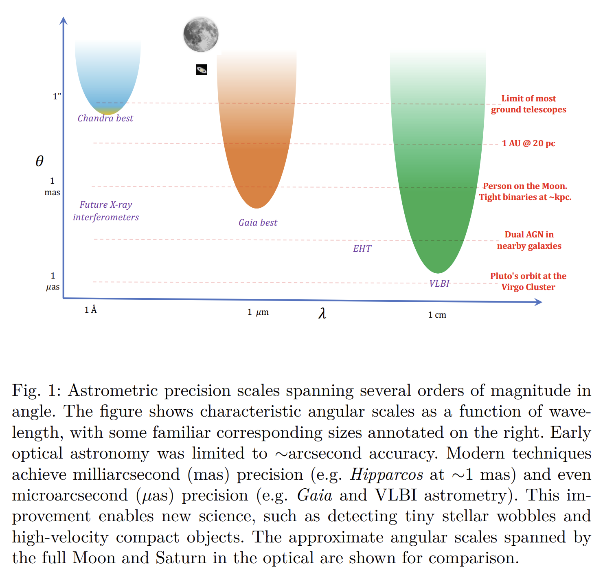

5. [The giant pulse population of PSR B0355+54](https://arxiv.org/abs/2605.21469)

   > Pulsar, Giant Pulse, Polarization, Observation

   使用Quasar VLBI网络Badary 32 m射电望远镜在1.46 GHz附近对PSR B0355+54进行7.97小时观测，每个圆偏振通道带宽128 MHz，搜索其巨脉冲群体。折叠和单脉冲流程在全自转相位盲搜亮脉冲，分别处理右旋和左旋圆偏振，并用同一扫描的平均轮廓归一化峰值强度，以降低闪烁和偏振相关增益变化的影响。

   共识别432个含亮脉冲的自转周期，约每424个自转出现一次，按偏振单独计数为551个事件。巨脉冲集中在普通射电脉冲窗口内两个紧凑经度区，二者相隔1.91 ms；早到达经度组更少但相位更紧，偏向右旋圆偏振，晚到达经度组更丰富且更宽，偏向左旋圆偏振。脉冲中位宽度$W_{50}=290.3\,\mu$s，峰值相对平均轮廓可达$S_{\rm pk}/\langle S_{\rm pk}\rangle=149.7$。固定经度和相反圆偏振偏好说明这些亮脉冲来自磁层中不同的相干或放大态发射区域，闪烁主要调制探测到的事件数，而不是产生这种相位和偏振结构。
   
   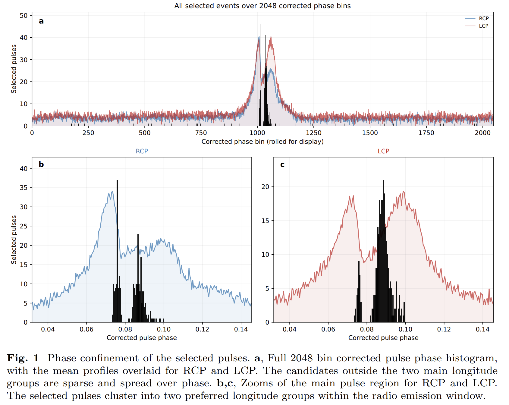

## 2026-05-22

1. [A Generalized Template Matching Algorithm for Correcting Jitter Noise in Pulsar Timing](https://arxiv.org/abs/2605.21750)

   > Pulsar, Timing, Method, Gravitational Wave

   针对毫秒脉冲星计时中的jitter noise，提出一种广义模板匹配方法。传统TOA估计假设脉冲轮廓只是固定模板的平移、缩放和加白噪声，但单脉冲幅度和形状的短时变化会让平均轮廓偏离模板，从而把轮廓残差转化为TOA误差。新方法把主成分分析引入模板匹配，把脉冲形状变化作为可拟合的主成分项，同时保持shift covariance，避免把引力波等真实整体相位延迟错误吸收掉。

   通过多高斯成分脉冲模拟比较普通模板匹配、PCA回归校正、skewness校正和广义模板匹配。若jitter主要来自各成分幅度变化，校正方法可大幅降低TOA误差，很多情况下广义模板匹配表现最好，误差可降低90%以上；若jitter包含成分相位漂移，校正效果明显受限，说明这类随机相位扰动可能构成更基本的计时精度限制。下一步需要在真实脉冲星数据中验证这种方法能否稳定提升PTA计时精度。

2. [Machine Learning applications to Galaxy Clusters](https://arxiv.org/abs/2605.21991)

   > Galaxy Cluster, Machine Learning, Cosmology, Review

   综述机器学习在星系团研究中的主要应用，重点是用SZ、X射线、光学、动力学和引力透镜观测推断星系团质量。传统质量估计依赖静力平衡、球对称和标度关系，容易受到质量偏差、投影效应、动力学状态和星系团核心复杂重子物理影响；机器学习可直接从模拟中学习多波段观测量到总质量的非线性映射，并利用图像形态、相空间结构和多波段信息降低散布。文中也提到基于CNN的全天天区星系团质量估计项目[DeepPlanck](https://github.com/The300th/DeepPlanck)。

   深度学习已用于SZ图、X射线图像、相空间图、弱透镜剪切图和多波段质量图重建，常能比单一标度关系减少质量散布；GNN、normalizing flow和simulation based inference进一步提供误差估计或后验分布。主要限制来自simulation to reality gap：训练集中的反馈模型、选择效应和未解析物理会传递为质量偏差。综述强调，未来精密星系团宇宙学需要标准化benchmark、可解释性、可靠不确定度估计，以及能边缘化重子物理不确定性的模拟训练策略。

   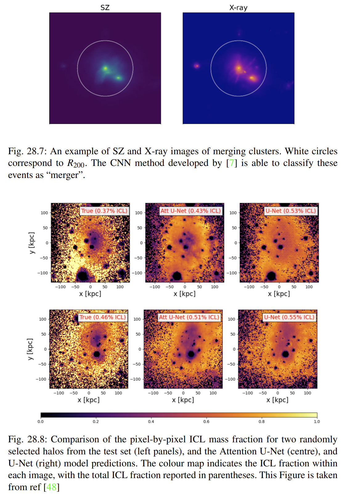

3. [Self-Supervised ConvLSTM for Fermi Large Area Telescope Transient Detection](https://arxiv.org/abs/2605.22112)

   > High Energy, Deep Learning, Transient, Fermi

   针对Fermi-LAT全天伽马射线暂现源搜索，构建一个可复现实验框架：用Fermitools中的`gtobssim`生成约10年的Fermi-LAT式合成天空，再把每日counts和exposure图作为双通道时间序列输入ConvLSTM。模拟采用P8R3_SOURCE_V3响应、标准银河系和各向同性弥散背景以及编目源模型，天空分成192个HEALPix tile、时间按约90天分块并行生成；模型文件工具在[fermimodel](https://github.com/ideare-ds/fermimodel)，合成数据集在[Hugging Face](https://huggingface.co/datasets/Idea-re/fermi-lat-synthetic-daily-sky-maps)。

   ConvLSTM以自监督方式学习正常天空的日尺度时空演化，预测下一帧全天图，再用像素级MSE残差、训练集自适应阈值和空间连通性过滤生成异常候选。候选源与4FGL-DR4交叉匹配后更偏向高变源，说明流程确实优先捕捉可变和暂现活动；案例检查中能标记GRB 080916A和3C 279在2015年的强耀发。当前版本仍受能量积分输入、曝光非平稳性和定位较粗限制，后续需要能量分辨序列、观测状态条件化和注入实验来量化探测效率与误报率。

   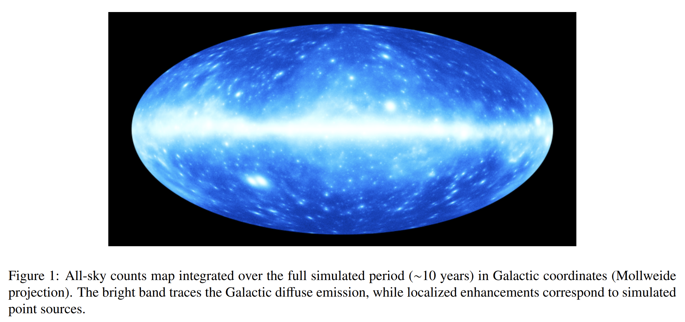

4. [Spectra as Language: Large Language Models for Scalable Stellar Parameter and Abundance Inference](https://arxiv.org/abs/2605.22162)

   > Stellar, LLM, Spectroscopy, Abundance

   将恒星光谱视为按波长排序的数值语言序列，用LLaMA-3.1-8B Instruct构建两阶段恒星参数反演框架。输入为3800–8700 Å归一化光谱通量序列；第一阶段用150万条LAMOST低分辨率光谱和LAMOST管线大气参数标签训练，学习$T_{\rm eff}$、$\log g$和$[\mathrm{Fe/H}]$等基础参数；第二阶段用约$10^5$条与APOGEE交叉匹配的LAMOST光谱和APOGEE DR16元素丰度标签微调，扩展到近20种元素丰度的联合估计。训练采用QLoRA、DeepSpeed ZeRO Stage 3和8:2训练测试划分。

   LLM在多数光谱型上的基础参数误差散布低于LightGBM、ResNet-50、GRU和小型CNN等基线，低信噪比和类别不均衡样本中更稳定；例如M型星的$T_{\rm eff}$散布明显低于ResNet-50，F/G/K型星与Gaia-ESO和GALAH DR4外部高分辨率巡天也保持较好一致性。元素丰度方面，LLM对若干元素优于ResNet-50，但并非全面超过CNN，弱线、混合线和A型/M型样本仍是难点。结果支持spectra as language的可扩展性，训练样本从$10^5$到$1.5\times10^6$增大时，三项基础参数的偏差趋近零、散布继续降低。

5. [Hostless extragalactic transients in Fink: Results from the ELEPHANT pipeline](https://arxiv.org/abs/2605.22407)

   > Transient, Supernova, Survey, Tool

   评估Fink broker中的ELEPHANT无宿主星系暂现源筛选管线，目标是在实时告警中自动发现ZTF和Rubin/LSST的hostless候选。管线只依赖告警stamp和少量Fink聚合特征：先用science/template stamp中的亮像素筛选，再用频域像素统计、Wasserstein距离和KS检验判断图像中是否存在宿主结构；ZTF版本代码在[Fink science](https://github.com/astrolabsoftware/fink-science/tree/master/fink_science/ztf/hostless_detection)，Rubin版本在[这里](https://github.com/astrolabsoftware/fink-science/blob/master/fink_science/rubin/hostless_detection/processor.py)。

   对2023年9月1日至2025年12月31日的ZTF流进行回溯分析，共有3193902条告警、156110个ZTF对象，ELEPHANT标记3272条告警、877个对象为hostless候选，其中276个有TNS光谱分类。主要类别是SN Ia 162个和SLSN-I 30个，主要污染来自30个CV和3个高自行恒星；在只把非河外源和恒星变源视作污染的定义下，准确率约84%。深度巡天交叉匹配和人工检查后，约65个暂现源保留为真正hostless候选，另有51个存在当前星表和ZTF stamp中都不可见、但在更深图像中可见的宿主。Rubin适配版已加入移动天体过滤和LSST告警字段处理，自2026年2月开始处理Rubin告警。
   
   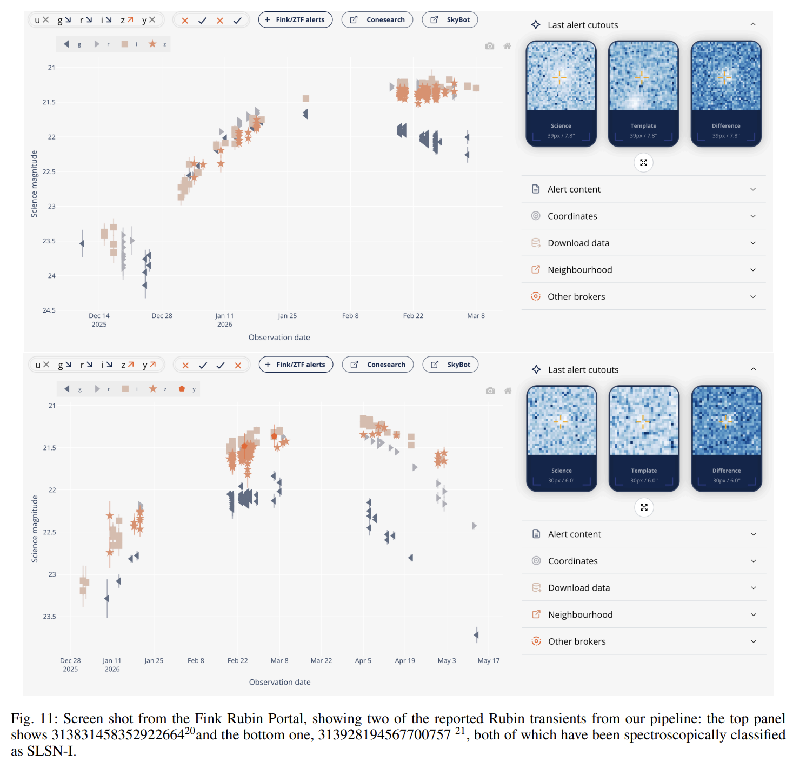

## 2026-05-25

