## 2026-06-01

1. [The EPS Research Astro-RAG Platform: A Unified Open-Science Infrastructure for Cross-Epoch Astrophysical Kinematic Analysis, LLM-Assisted Research Workflows, and Educational Outreach](https://arxiv.org/abs/2605.30384)

   > Astronomy, RAG, LLM, Tool, Data Release

   面向跨红移天体运动学分析和 LLM 辅助检索，[EPS Research Astro-RAG Platform](https://github.com/eps-research/rag-corpus-series) 整合四个机器可读语料库：438 个 HI 旋转曲线星系、129 个矮星系或不规则星系、174 个银河系球状星团，以及 31 个高红移 ALMA [CII] 星系，总计 772 个对象。数据以 JSON、CSV、RAG-ready JSONL 和逐源 ZIP 形式发布，并配套 120 个已通过 `nbconvert` 执行验证的 Jupyter notebooks 与 QuickStart 复现实例。

   平台的核心贡献是把本地宇宙、银河系球状星团和高红移星系放入统一 schema 与分析框架，便于比较 HI 旋转曲线、球状星团动力学和高红移气体运动学。四个语料库均以 CC BY 4.0 发布在 Zenodo，QuickStart 可在一次克隆后自动下载数据并复现核心 cross epoch omega 结果；LLM fine tune 和 RAG 工具仍属于后续阶段规划。

2. [Transformer-Based Source Detection and Morphological Classification in LOFAR Deep-Field Continuum Images](https://arxiv.org/abs/2605.30500)

   > Radio, Deep Learning, Source Detection, LOFAR

   面向深场射电连续谱巡天中的源检测和形态分类，使用 RF-DETR 这类 transformer set prediction detector 处理 LOFAR Deep Fields 150 MHz 图像。模型在 ELAIS-N1 DR1 上训练，采用五类互斥标签：Compact、Single Extended、Multi Extended、Flagged 和 Spurious；推理时用滑动窗口覆盖 ELAIS-N1、Lockman Hole、Boötes 和 EDFN 四个深场，并把结果与 PyBDSF 目录和人工识别的大尺度射电星系样本比较。

   在 ELAIS-N1 验证集上，RF-DETR 的整体检测 F1 约为 91%，匹配后的分类 F1 约为 99%。跨四个深场应用时得到 43,805 到 75,609 个源，Compact 源占 92%–95%，说明单一训练场可迁移到不同深度和校准条件的图像。相比 PyBDSF，RF-DETR 能把双瓣或多成分射11电星系统一成源级检测，并显式标出伪源和受伪影影响的目标；对人工整理的 extended radio galaxies，恢复率约 94%，对 giant radio galaxies 约 86%。

   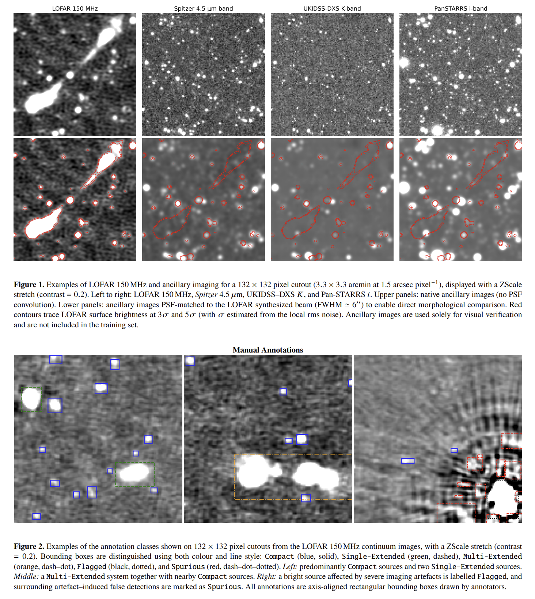

3. [Characterising and mitigating Bluetooth and WiFi radio frequency interference at the Parkes Observatory](https://arxiv.org/abs/2605.30761)

   > Radio, RFI, Parkes, Instrument

   针对 Murriyang/Parkes 64 米望远镜 UWL 接收机中 2368–2496 MHz 子带的 RFI，分析 Wi-Fi、Bluetooth 和 NBN 信号在时间、频率和指向上的分布。材料包括多年校准观测的 1 MHz 频谱快照，以及 2023 年 8 月 10 日观测 Vela pulsar 时记录的 10 秒、16 bit 电压数据；后者用于在保留脉冲星信号的同时测试实时可行的 RFI 缓解方法。

   比较了 DSPSR spectral kurtosis、简单功率阈值和基于 Bluetooth 解调信号的阈值。无处理时 Vela 脉冲几乎不可用；调优后的 spectral kurtosis 可达到最高相对 S/N 516，但剔除约 33.4% 数据；8.69 dB 简单功率阈值只剔除约 0.4% 数据，S/N 达 341，更适合低复杂度实时部署。原本约 70% 子带长期被弃用，RFI 的时间频率局域性说明经过在线阈值处理后，超过 90% 的该子带可重新用于科学观测。

   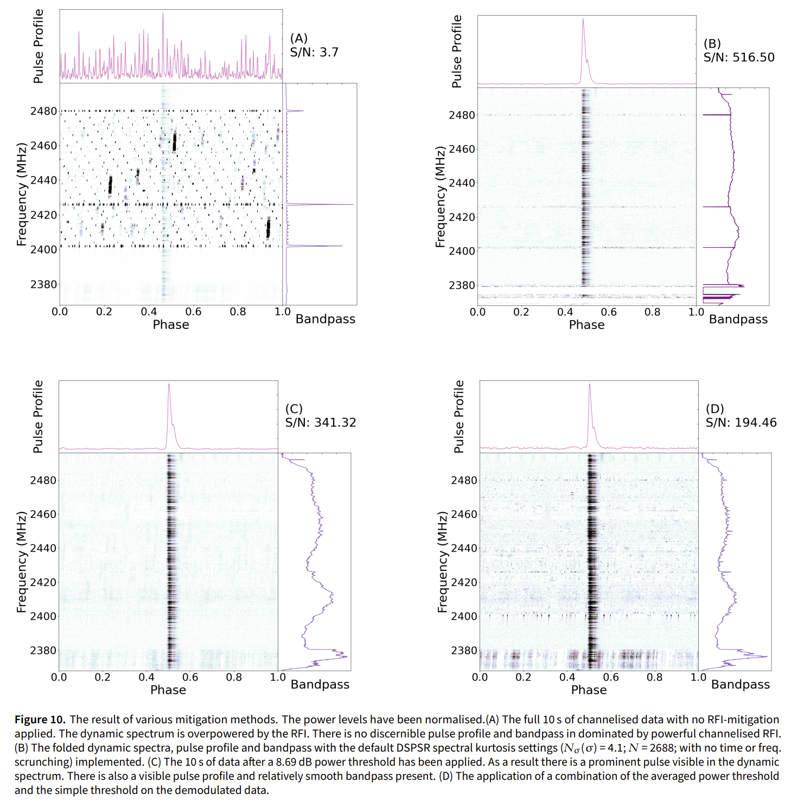

4. [Interstellar Scintillation of Three Nearby Pulsars with FAST](https://arxiv.org/abs/2605.30918)

   > Pulsar, FAST, Scintillation, Observation

   利用 FAST 19 波束接收机 L 波段 1.0–1.5 GHz 数据研究 PSR J0837+0610、J1136+1551 和 J1239+2453 的星际闪烁。处理流程包括 DSPSR 折叠和消色散、PSRCHIVE 去除 RFI、由动态谱计算二维自相关函数，并用 NuT transform 增强 secondary spectrum 中的 scintillation arcs；弧曲率用于估计散射屏距离和频率标度。

   PSR J0837+0610 和 J1239+2453 各检测到一个主要 scintillation arc，PSR J1136+1551 检测到三个清晰弧。J0837+0610 和 J1239+2453 的弧曲率频率标度分别约为 $\eta \propto \nu^{-2.0\pm0.6}$ 和 $\eta \propto \nu^{-1.9\pm0.6}$，J1136+1551 两个较清晰弧也接近 $\nu^{-2}$。推得散射屏距离约为 421 pc、196 pc、146 pc、39 pc 和 253 pc；除 J0837+0610 外，其余屏多位于距地球约 100–200 pc 范围，可能与 Local Bubble 子结构有关，但单历元观测仍需要长期闪烁监测或 VLBI 验证。

   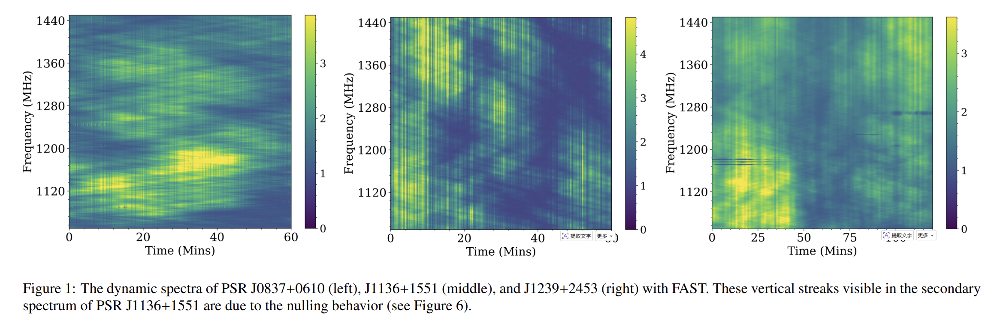

5. [Frequency-time-resolved Imaging Spectroscopy of Fine Structures in a Solar Radio Noise Storm](https://arxiv.org/abs/2605.31450)

   > Solar, Radio, LOFAR, Observation, Simulation

   针对太阳射电 noise storm 中异常紧凑的表观源尺寸，使用 LOFAR 对 2015 年 6 月 23 日接近日面中心的事件进行 30–40 MHz 频率时间分辨成像光谱分析，并结合各向异性射电波散射模拟。观测覆盖宽带连续谱及其中的 type I bursts、S-bursts 和 spikes；Nançay Decameter Array 提供 20–80 MHz 动态谱背景，LOFAR 覆盖约 10:45–12:30 UT。

   连续谱源在几十分钟内穿过日面，31.3–38.4 MHz 的表观主轴约从 $8.0'$ 降到 $4.3'$，小于相近频率 type III burst 源尺寸的一半。type I bursts、S-bursts 和 spikes 的动态谱形态不同，但在相同频率下与连续谱具有近似相同的表观尺寸；spike 的质心可与连续谱相差约 $500''$，提示其磁场系统可能不同。模拟表明，闭合磁场结构中的各向异性湍流会把辐射偏离视线方向，使观测到的源更紧凑；过密等离子体、较陡密度梯度、较低散射率和强各向异性也有贡献，但主导因素是大尺度日冕磁场与传播环境，而非不同精细结构的内禀发射机制。
   
   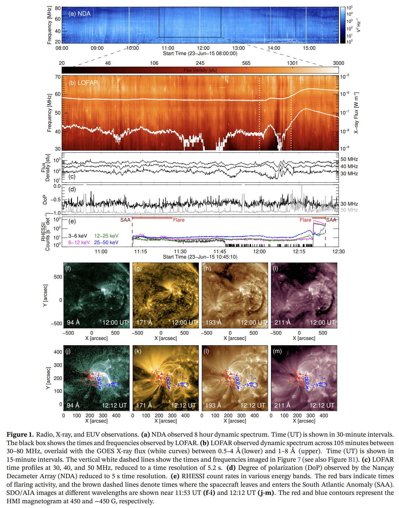

## 2026-06-02

1. [A 0.03 Hz Radio Quasi-periodic Oscillation During the 2025 Flare of GRS 1915+105](https://arxiv.org/abs/2606.01823)

   > Microquasar, Radio, QPO, Jet, Observation

   对微类星体 GRS 1915+105 的 2025 年射电耀发进行每周监测，使用上海天马 65 m 与佘山 25 m 望远镜组成的约 6 km 单基线，在 S band 2.25 GHz 和 X band 8.42 GHz 同时观测。172 天内共分析 24 次观测、61 个 scan，并结合 NICER 1–10 keV 数据；2 秒时间分辨率光变用于功率谱和 Lomb Scargle 分析。

   射电耀发在 X band 先于 S band 达峰，谱指数从约 $+0.5$ 变到 $-0.75$，符合膨胀喷流中的 synchrotron self absorption。MJD 60765 和 60772 的两个连续观测中检测到 $\sim0.03$ Hz QPO 及 $\sim0.06$ Hz 谐波；MJD 60765 的双波段联合显著性超过 $5.9\sigma$，总联合显著性超过 $5\sigma$。该频率在 S/X 两个波段一致，并与 2021 年另一场射电耀发中的 0.03 Hz 信号相同，说明它更像吸积喷流系统的特征时标；但 X 射线强遮蔽导致无法确认其是否直接来自内吸积流，喷流进动或其它全局调制仍需同步 X 射线时变和高分辨率射电成像验证。

   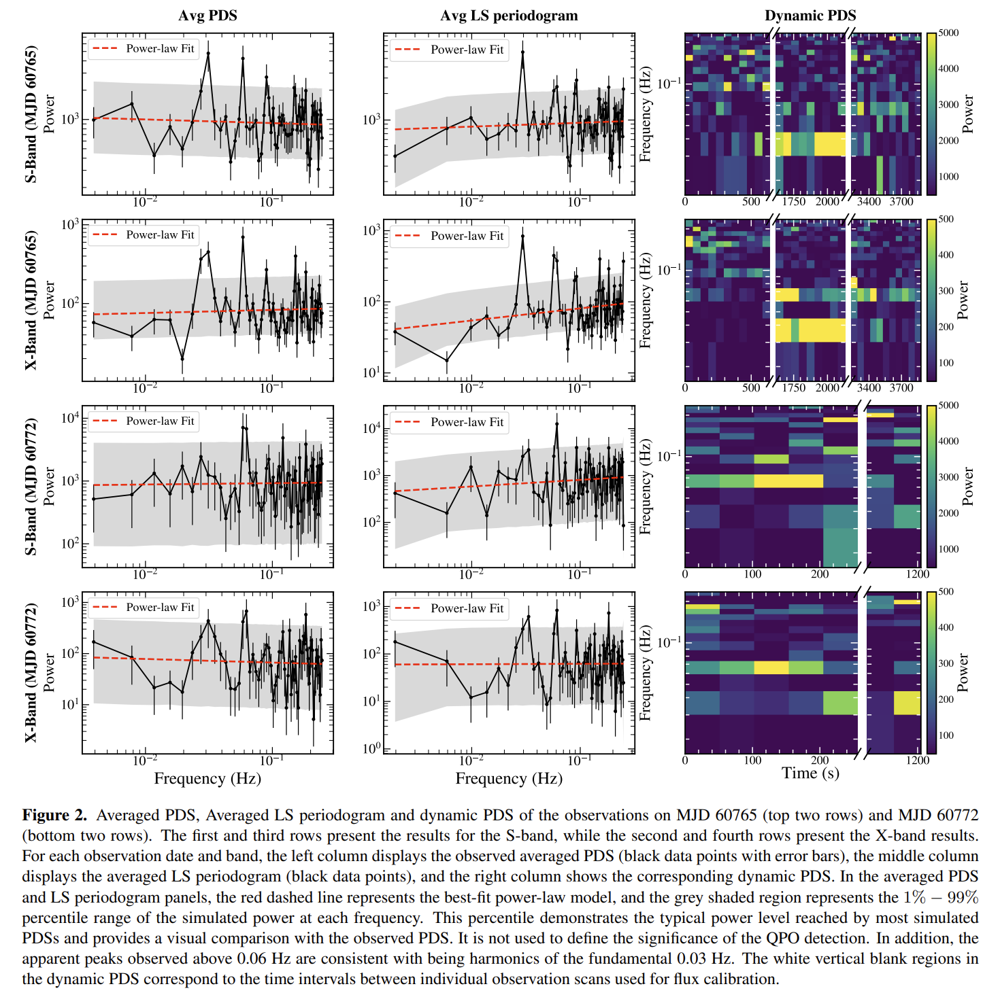

2. [Fast radio bursts, magnetars and earthquakes: their "family feud"?](https://arxiv.org/abs/2606.01855)

   > Fast Radio Burst, Magnetar, Statistics, Method

   为区分重复 FRB 的触发机制是否更像地震、磁星耀发或其它突发现象，构造 Pincus Lyapunov diagram，将事件序列映射到 stochasticity chaos 平面。数据包括 FRB 20121102A、20190520B、20201124A、20220912A、20240114A，多个磁星耀发、脉冲星 glitch、太阳耀发和地震序列；底层数据整理在 [ScienceDB](https://doi.org/10.57760/sciencedb.Fastro.00031)。每个源用 Pincus Index 描述随机性，用 Lyapunov Exponent 描述混沌性。

   PLD 中不同现象形成不同区域：地震偏高混沌低随机，脉冲星 glitch 偏高随机低混沌，磁星耀发和太阳耀发位于中间且相互接近，重复 FRB 形成独立且紧凑的区域。与 FRB 群体比较时，磁星耀发的 energy distance 为 0.138、$p=0.031$，脉冲星 glitch 为 0.111、$p=0.020$，可在 5% 水平拒绝同分布假设；FRB 20240114A 与其它 FRB 的比较为 $p=0.630$，内部自洽检验为 $p=0.984$。FRB 20240114A 在 8 个月内爆发率大幅变化，但 PI 和 LE 仍稳定，说明重复 FRB 的时能统计特征不只是活动率或样本量效应。

   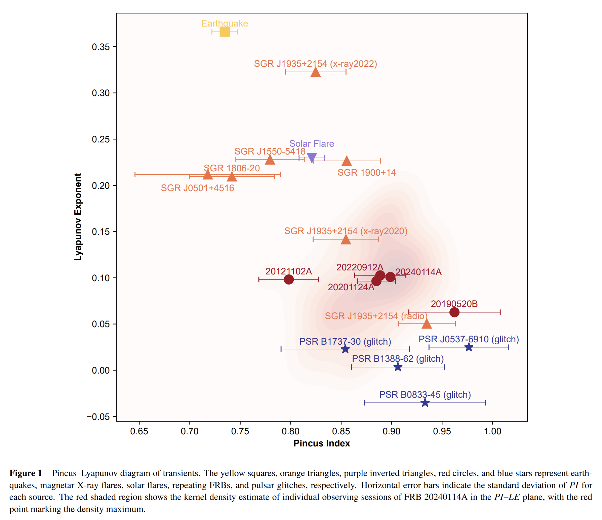

3. [AstroSkyFlow: an astronomical sky image flow simulator for time domain survey validation and machine learning](https://arxiv.org/abs/2606.02140)

   > Astronomy, Simulation, Tool, Time Domain, Machine Learning

   [AstroSkyFlow](https://github.com/laomuliubingbing/AstroSkyFlow) 是面向时域巡天验证和机器学习训练的多历元天区图像模拟器。给定观测计划后，OCS 模拟器负责望远镜指向、读出占用、可见性和安全约束，图像模拟器再生成天空源、PSF、星系形态、快移目标轨迹、内禀变源、消光、大气折射、天光背景、空间相关 scintillation、散射光、光学系统和探测器响应。恒星和星系来自用户目录或 Gaia DR3 查询，快移目标由星历动态传播，变量和暂现源可注入指定光变模型。

   验证使用上海木光天文台 CDK14 对 WASP 11 b 凌星的 75 张 180 秒图像，以及兴隆 85 cm 望远镜对 V0554 Dra 的 188 张 30 秒图像，并与 SkyMaker 比较。AstroSkyFlow 在噪声特性、CDPP 曲线和 PSF FWHM 分布上更接近真实观测，SkyMaker 对暗源噪声低估更明显；注入恢复测试能恢复凌星、几何/菲涅耳掩星、超新星和小行星轨迹等信号，超新星光变相对残差 RMS 约为 8%。当前限制包括 PSF 采用 Moffat 近似、星系用简单 Sérsic 模型、未处理静态源自行和视差，大规模生产还需要并行化优化。

   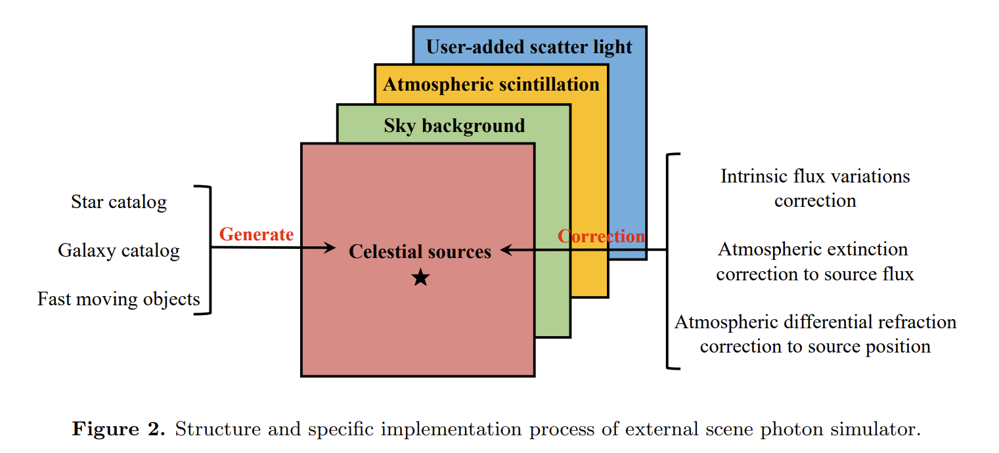

## 2026-06-03

1. [One Transit Is All You Need: Detecting Exoplanets Through Learned Stellar Behaviour with EXOVEIL](https://arxiv.org/abs/2606.02778)

   > Exoplanet, Transit, Deep Learning, Kepler, Tool

   [EXOVEIL](https://github.com/Pratik25priyanshu20/ExoVeil) 把凌星搜索改写成预测残差中的异常检测：先用 6 层、8 头的 causal Transformer world model 学习恒星在无凌星情况下的原始光变，再用方盒模板 matched filter 从残差中找 transit shaped dip，最后用 XGBoost 基于 21 个特征区分行星和假阳性。训练使用 16,499 条 Kepler 光变，约 2,000 个含行星目标的已知凌星区间在自监督训练中被插值掩蔽，分类器用约 1,000 个 DR25 TCE 标签训练。

   在 Kepler DR25 上分类 AUC 为 0.938，仅使用 flux time series，低于依赖 Data Validation 诊断量的 ExoMiner，但能处理分类式系统无法处理的单次凌星。盲搜 3,737 颗 Kepler 星恢复 2,873 个已知确认行星信号，并找到 179 个不在 DR25 TCE 目录中的 transit like 信号，其中 46 个为 Tier 1 monotransit 候选；1000 ppm 单次凌星注入恢复率为 32.3%（假阳性修正后），零样本迁移到 TESS PLATO LOPS2 区域时恢复 47/47 个确认行星，PLATO 25 秒 cadence 模拟中灵敏度接近 100 ppm。

   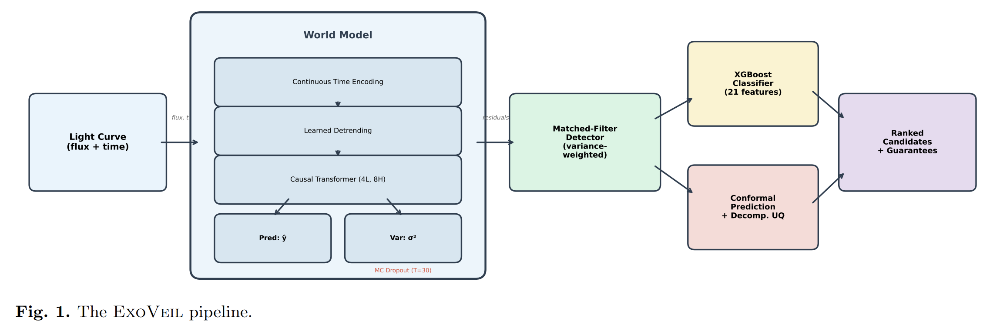

2. [Data-Driven Forecasting of three-Component Seismograms Using Transformer Architectures](https://arxiv.org/abs/2606.02912)

   > Seismology, Transformer, Simulation, Method

   [SeismoGPT](https://github.com/wesmail/seismogpt) 用 2600 万参数 causal Transformer 直接在时域预测三分量地震波形，把任务定义为物理约束的 continuation：输入从 P 波到 S 波后某个相对窗口的上下文，之后完全自回归生成未来波形。训练和评估基于合成地震图，覆盖震源深度 5–100 km、震中距 $10^\circ$–$90^\circ$、震级 $3\leq M_w\leq7$；三种配置分别比较 120 秒与 240 秒预测跨度，以及额外 post S 上下文对长跨度预测的影响。

   三种配置下 median normalized cross correlation 为 0.93–0.97，代表性预测能保持相位相干和谱能量分布。预测质量在大震中距和低震级时下降，主要因为波场较弱、相干性低且色散更强；震源深度影响较小。失败样例通常是逐步自回归 rollout 中的相位漂移，而非生成非物理波形。结果说明 transformer sequence model 可以从数据中学习稳定的地震波场延拓，但当前固定 patch tokenization 仍限制长时标高保真预测，后续需要更结构化或物理知情的表示。

   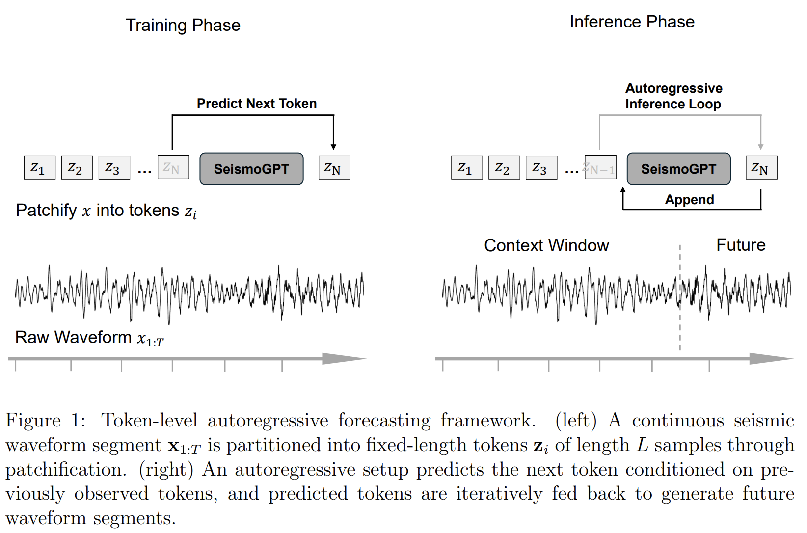

3. [Multimodal Transformer Based Generic Mixture Density Network for Scattering Timescale Estimation of Fast Radio Bursts](https://arxiv.org/abs/2606.03596)

   > Fast Radio Burst, Deep Learning, Scattering, CHIME

   [MT-GMDN](https://github.com/kharelb/Scattering-Timescale-Estimation-With-Transformers) 面向 FRB 散射时标 $\tau$ 的快速概率估计，输入 CHIME/FRB Catalog 2 的去色散动态谱和对应 time series profile。动态谱分支把每个时间 bin 作为 token、频率向量作为 embedding，time series 分支用平行 transformer 捕捉脉冲不对称和散射尾；两路 latent representation 拼接后进入 mixture density regression head，同时输出零散射/未分辨散射的 Bernoulli 概率，以及 $\tau>0$ 时 lognormal 分布的参数。

   数据来自 CHIME/FRB Catalog 2，原始动态谱覆盖 400–800 MHz、16,384 个频率通道和约 160 个时间采样，频率方向下采样到 256 通道。对有可测散射的 Catalog 2 测试样本，MT-GMDN 的 $\tau$ 点估计 $R^2$ 达 94%，散射检测 AUC 为 0.87，测试集 recall 约 90%。在低 SNR 合成事件上，MT-GMDN 比 fitburst 更稳健，$R^2$ 为 68% 对 39%，并给出随 SNR 和 $\tau$ 变化的异方差不确定度；训练完成后推理约比 fitburst 快 $10^4$ 倍，适合大规模 FRB 参数自动化测量，但经典拟合方法仍适合作为验证基准。
   
   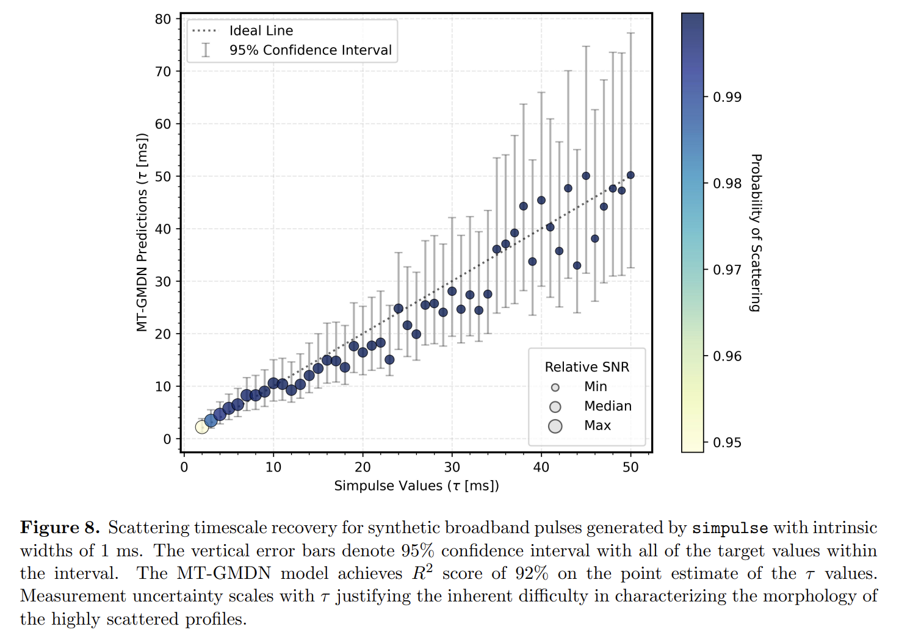

## 2026-06-04

1. [Kinematic modelling of clusters with Gaia: the Death Throes of the Hyades](https://arxiv.org/abs/2007.02969)

   > Star Cluster, Gaia, Kinematics, Observation, Method

   针对星团内部速度场、旋转、剪切和潮汐尾运动，建立一个把 Gaia 视差、自行和部分径向速度联合起来的前向层级模型，建模代码为 [kinesis](http://github.com/smoh/kinesis)。星团成员的三维速度被写成线性速度场加随机弥散：

   $$
   \boldsymbol{v}_{i}\sim
   \mathcal{N}\left(\boldsymbol{v}_{0}+\mathbf{T}(\boldsymbol{b}_{i}-\boldsymbol{b}_{0}),\mathbf{\Sigma}\right),
   $$

   其中 $\boldsymbol{v}_{0}$ 是参考位置 $\boldsymbol{b}_{0}$ 的平均速度，$\mathbf{T}=dv_l/dx_k$ 是速度梯度张量，$\mathbf{\Sigma}$ 是完整三维速度弥散矩阵。背景污染用宽的各向同性高斯分量表示：

   $$
   \boldsymbol{v}_{i}\sim \mathcal{N}(\boldsymbol{v}_{0,\rm bg},\sigma_{\rm bg}^{2}\mathbf{I}),
   \qquad
   \mathcal{L}=f_{\rm mem}\mathcal{L}_{\rm cl}+(1-f_{\rm mem})\mathcal{L}_{\rm bg}.
   $$

   速度梯度的物理解释来自把 $\mathbf{T}$ 分解为反对称旋转项和对称剪切项：

   $$
   \frac{1}{2}(\mathbf{T}-\mathbf{T}^{T})=
   \begin{bmatrix}
   0&-\omega_z&\omega_y\\
   \omega_z&0&-\omega_x\\
   -\omega_y&\omega_x&0
   \end{bmatrix},
   $$

   $$
   \frac{1}{2}(\mathbf{T}+\mathbf{T}^{T})=
   \begin{bmatrix}
   w_4&w_3&w_2\\
   w_3&w_5&w_1\\
   w_2&w_1&3\kappa-w_4-w_5
   \end{bmatrix},
   \qquad
   \kappa=\frac{1}{3}(T_{xx}+T_{yy}+T_{zz}).
   $$

   这里 $\boldsymbol{\omega}$ 描述刚体旋转，$w_1,\ldots,w_5$ 描述剪切，$\kappa$ 描述各向同性膨胀或收缩。只用天体测量会让平均速度和 $\kappa$ 存在退化，并且通常只能约束 $\mathbf{T}$ 的 8 个独立组合；加入部分 Gaia DR2 亮星径向速度后，可以打破径向速度梯度方向的信息缺失，约束全部 9 个速度梯度分量。

   从三维速度到观测量的关键推导是投影和高斯边缘化。对每颗星定义

   $$
   \boldsymbol{a}_{i}=
   \begin{bmatrix}
   \pi_i\\
   \mu_{\alpha,i}\\
   \mu_{\delta,i}
   \end{bmatrix},
   \qquad
   \bar{\boldsymbol{a}}_{i}(d_i,\boldsymbol{v}_i)=
   \begin{bmatrix}
   1/d_i\\
   \boldsymbol{p}_i^T\boldsymbol{v}_i/d_i\\
   \boldsymbol{q}_i^T\boldsymbol{v}_i/d_i
   \end{bmatrix},
   $$

   其中 $\boldsymbol{p}_i$ 和 $\boldsymbol{q}_i$ 是赤经、赤纬方向单位矢量。由于 Gaia 测量误差和内部速度弥散都取高斯分布，潜在的 $\boldsymbol{v}_i$ 可以解析边缘化，得到

   $$
   \boldsymbol{a}_{i}\sim
   \mathcal{N}\left(
   \bar{\boldsymbol{a}}_{i}(d_i,\boldsymbol{v}_{0,\rm cl/bg}),
   \mathbf{D}_{i}
   \right),
   $$

   $$
   \mathbf{D}_{i}(d_i,\mathbf{\Sigma})=
   \mathbf{C}_{\boldsymbol{a},i}
   +\frac{1}{d_i^2}
   \begin{bmatrix}
   0&0&0\\
   0&&\\
   0&&\mathbf{M}_i^T\mathbf{\Sigma}\mathbf{M}_i
   \end{bmatrix},
   \qquad
   \mathbf{M}_i=[\boldsymbol{p}_i,\boldsymbol{q}_i].
   $$

   径向速度观测作为额外似然项加入：

   $$
   \bar v_{r,i}=\boldsymbol{r}_i^T\boldsymbol{v}_i,
   \qquad
   v_{r,i}\sim
   \mathcal{N}\left(
   \boldsymbol{r}_i^T\boldsymbol{v}_{0,\rm cl/bg},
   \sigma_{\rm RV}^{2}+\boldsymbol{r}_i^T\mathbf{\Sigma}_{\rm cl/bg}\boldsymbol{r}_i
   \right).
   $$

   应用于 Hyades 时，以约 10 pc 潮汐半径区分核心星团和潮汐尾。核心速度弥散接近各向同性，没有明显旋转；潮汐尾速度椭球明显拉长，主轴指向银心方向。核心在银道方位和垂直方向存在约 $2\sigma$ 水平的膨胀或收缩信号，潮汐尾显示强剪切，超过太阳邻域 Oort 常数预期的银河剪切，说明尾部恒星正在更快损失角动量，可能很快被银河潮汐进一步拉离或变形。
   
1. [Periodic Radio and X-ray Emission from an Accreting White Dwarf Binary](https://arxiv.org/abs/2606.04232)

   > Radio Transient, White Dwarf, X Ray, Observation

   ASKAP J174508.9−505149 是一个长周期射电暂现源，射电脉冲具有相干、偏振、窄带和间歇特征。ASKAP 发现圆偏振射电源后，MeerKAT 精确定位到 Gaia 光学对应体；SOAR、Magellan 光谱显示蓝色连续谱、强 Balmer 和 He I/He II 发射线，结合 Swift 和 Einstein Probe 的紫外及 X 射线观测，指向一个吸积磁白矮星双星系统。

   光谱给出约 1.3 小时轨道周期，射电爆发和 X 射线辐射都随轨道相位调制。射电脉冲在不同观测中集中于接近轨道合相的相位，但相位可相差半个轨道；没有发现类似 AR Sco 的秒级白矮星自转周期。该源把一类长周期射电暂现源与吸积白矮星双星直接联系起来，说明至少部分 LPT 可以由白矮星吸积环境中的等离子体过程产生。
   
   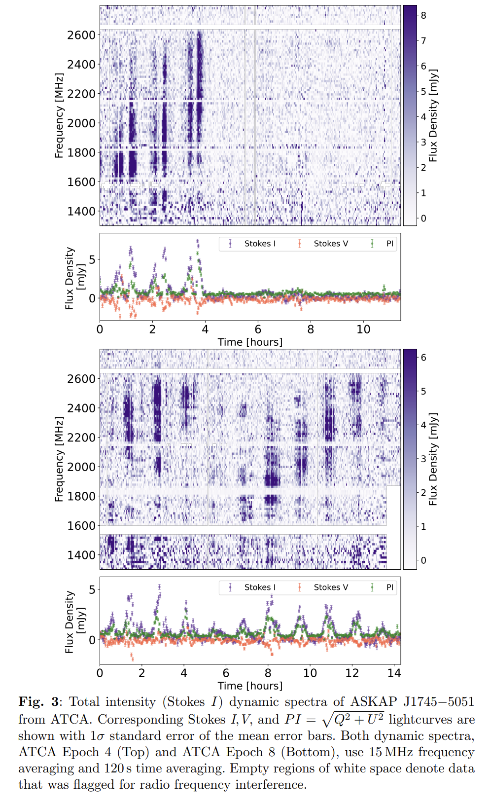
   
3. [Full Nonlinear Velocity Reconstruction With Transformer and Ensemble Tree Machine Learning](https://arxiv.org/abs/2606.05047)

   > Cosmology, Deep Learning, Large Scale Structure, kSZ

   面向星系大尺度结构中的本动速度重建，将线性理论速度估计作为基线，再用机器学习预测真实速度与线性重建之间的非线性残差。模型包括 GBDT 和 Transformer，输入为多尺度星系密度与环境特征，输出视向和横向速度修正；训练和测试基于 AbacusSummit 模拟，并构造接近 DESI LRG、ELG 观测的周期盒和光锥样本，同时考察类似 Rubin LSST 光度红移误差的影响。

   两类模型都能改善线性速度重建，Transformer 表现最好，在 LRG 和 ELG 样本中提高速度相关系数、降低归一化残差方差，并在更宽空间尺度上恢复更准确的速度功率谱及与真实速度场的互相关。该方法对 kSZ 相关应用尤其有用，例如星系团成对速度相关和堆叠星系团密度剖面，可作为从未来巡天中提取非线性速度信息的工具。

   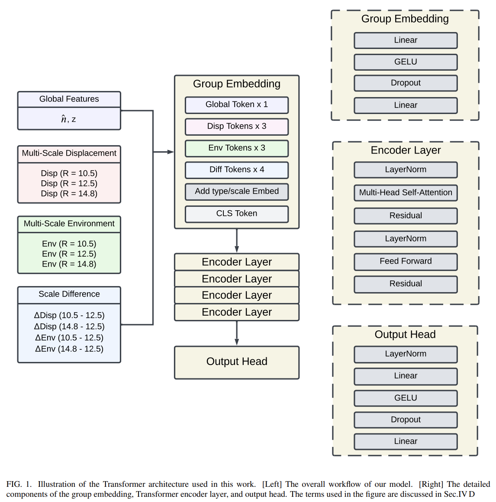

## 2026-06-05

1. [Toward decision-aware AI for LSST-scale time-domain astronomy](https://arxiv.org/abs/2606.05285)

   > Astronomy, AI, LSST, Time Domain, Method

   LSST 每晚约产生 $10^7$ 个 alerts，早期光变通常稀疏、类别不确定、后续观测资源有限，单纯把每个 alert 当作静态分类问题会丢掉真正关键的决策信息。更合适的框架是部分可观测的动态环境：每次光谱、多波段测光、ToO 触发或延迟观测都会改变之后能学到的信息。

   提出的架构把 foundation model 作为源状态表示层，用异质时域数据学习类别概率、不确定性、异常度、宿主星系上下文和未来观测预测；再用 POMDP、信息增益估计、分层 triage 或仿真训练策略，把这些 belief states 转化为可审计的后续观测建议。已有 broker 不再只输出分类排名，而是接入持续更新的状态层和显式 utility function。关键要求是决策日志、可解释 utility、人类 override 和治理机制；评估指标也应从分类准确率扩展到累计科学收益、资源效率和群体参数恢复。

   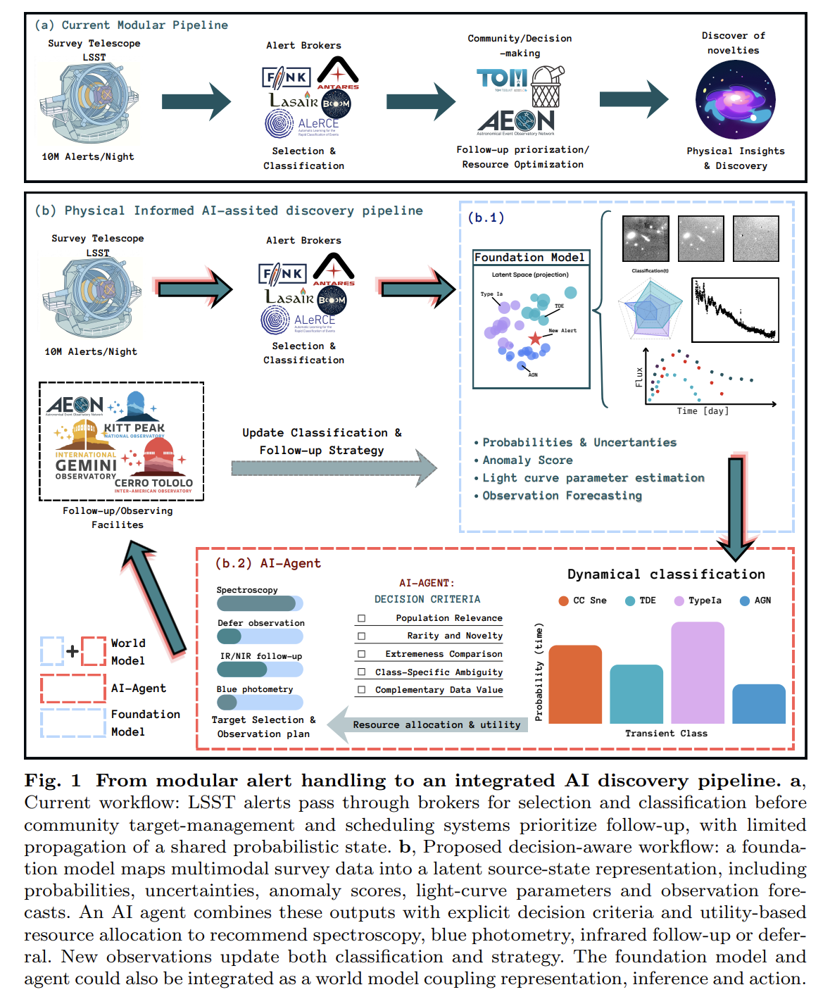

2. [A Decade to Map the Diffuse Universe: FRB-QSO Pairs with HST/COS Spectroscopy](https://arxiv.org/abs/2606.05310)

   > Fast Radio Burst, QSO, CGM, HST

   利用角秒定位 FRB 和近邻投影的紫外亮 QSO 视线配对，把 FRB 的 $DM$、$RM$、散射约束和 QSO 的 HST/COS 吸收线红移、柱密度、相态信息结合起来，用于分解 CGM、IGM、银河系和 M31 halo 中的电离气体与磁场贡献。FRB 提供与气体相态无关的自由电子柱密度，QSO 光谱提供逐红移、逐相态的吸收结构，两者配对后才能把特定 $DM$ 或 $RM$ 贡献关联到同一片气体。

   样本预测使用 $N(<\theta)=N_{\rm FRB}\Sigma_{\rm QSO}\pi\theta^2$，在约 20,000 deg$^2$ 公共天区内，采用 Milliquas v8 与 GALEX 选出的 FUV $<19$、$z<1$ QSO 面密度 $\Sigma_{\rm QSO}\approx0.46\,{\rm deg^{-2}}$。当前约 100 个 $z<1$ 角秒定位 FRB 几乎无法形成统计样本；到 2035 年，若下一代干涉阵列提供约 $10^5$ 个定位 FRB，静态 QSO 目录下可得到约 16–64 个 $\theta<1'$ 配对和数千个 $\theta<10'$ 配对。HST/COS 的 G130M+G160M 可在 $\lesssim15$ orbits 内达到 $S/N\gtrsim10$，覆盖低红移 CGM/IGM 的 Ly$\alpha$ 和金属线；2030 年代仍需要 HST/COS 支撑这类 UV 计划，直到 HWO 进入下一阶段。

   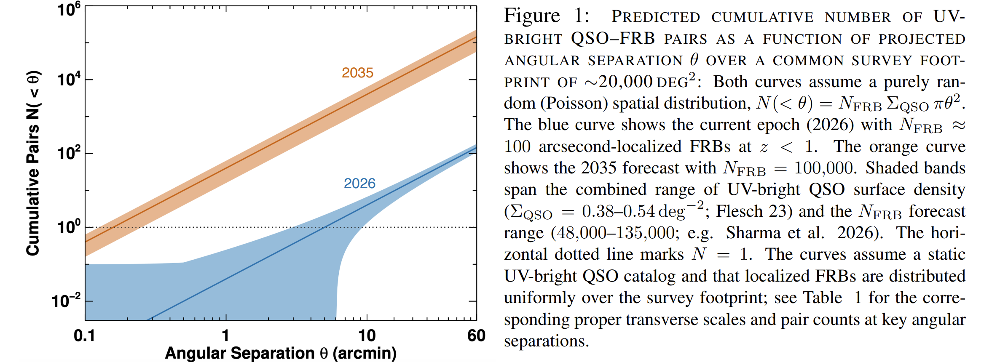

3. [The X-ray emission of the long-period transient and accreting cataclysmic variable ASKAP J174508.9-505149](https://arxiv.org/abs/2606.05842)

   > Radio Transient, White Dwarf, X Ray, Observation

   ASKAP J174508.9-505149 是已被识别为吸积激变变星的长周期射电暂现源。基于 2025 年 9 月到 2026 年 5 月的 XMM-Newton 和 Einstein Probe X 射线观测，并结合同时的 ASKAP 射电和 XMM-Newton/OM B 波段数据，检测到 $P=4868(22)$ s 的 X 射线周期，与射电和光学周期一致；XMM-Newton 硬度比也有同样周期，并在流量调制最低处变硬。XMM 与 EP 的 X 射线 pulsed fraction 分别约为 23% 和 22%，还存在约 52 ks 的长时标调制，但受观测时长限制仍不稳健。

   X 射线谱用局部吸收、热等离子体和黑体成分描述，包含 $kT_{\rm apec}\sim15$ keV 的碰撞电离等离子体、$kT_{\rm bb}\sim0.14$ keV 的软黑体，以及 0.77 keV 附近可能来自 O VII 的吸收特征。周期性 X 射线、硬度比随相位变化和磁 CV 型谱结构共同指向磁化白矮星吸积；该源是第三个有 X 射线探测的 LPT，也是第一个被明确识别为吸积磁 CV 的 LPT。现有数据支持 intermediate polar 或 asynchronous polar 两种解释，仍需要更长、连续的 X 射线和高 cadence 光学观测来区分。

   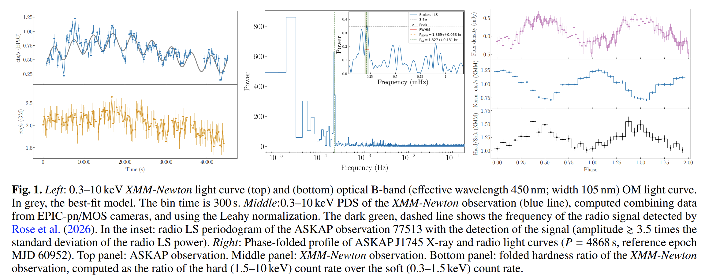

4. [A micronova burst in the intermediate polar IGR J17014-4306](https://arxiv.org/abs/2606.06305)

   > White Dwarf, Micronova, Cataclysmic Variable, Observation

   在 TESS sector 93 中检测到 IGR J17014-4306 的短时光学爆发。该源是食双星型 intermediate polar，并具有很长的轨道周期。分析使用 TESS 120 s cadence 数据，并用 ASAS-SN 光度和 Gaia 距离把 TESS flux 标定为 luminosity；长期搜索还结合 Gaia、ASAS-SN 和 AAVSO 光变。爆发持续 1.56 d，呈多峰结构，两个主峰相隔 0.26 d，峰值光学光度为 $(9.3\pm0.2)\times10^{33}\,{\rm erg\,s^{-1}}$，总辐射能量为 $(3.25\pm0.01)\times10^{38}$ erg，这些数值因未作 bolometric correction 可视为下限。

   按能量、峰值光度、持续时间和发生频率放到经验诊断图上，该事件落在已知 micronova 区域，明显偏离 dwarf nova、magnetic gating burst 和 donor flare。若按磁约束吸积柱中的局部热核 runaway 解释，燃烧柱质量约为 $1.6\times10^{-11}\,M_\odot$，结合质量转移率得到约 20 d 的复发时间；长期光变中还找到 16 个可能的快速增亮事件，最短间隔约 26 d。TESS 时序显示白矮星自转周期 $P_{\rm spin}\simeq1859$ s 在爆发前后保持稳定，爆发期间功率谱变复杂并出现多个峰，可能对应 micronova oscillations。该系统使已确认 micronova 系统增至 8 个，并因长轨道周期和食几何成为检验磁约束白矮星热核燃烧的样本。
   
   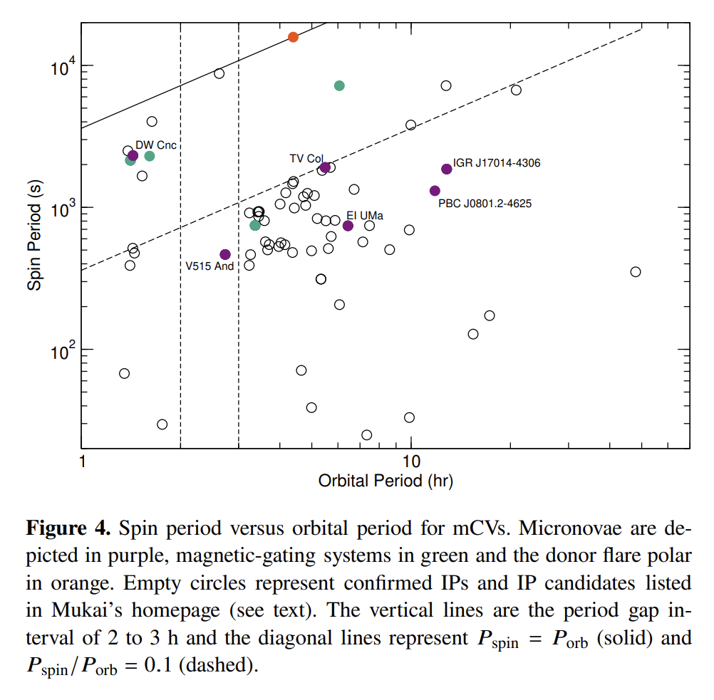

## 2026-06-08

1. [VLA Observations Confirm AT 2023mfm as an Off-nuclear Tidal Disruption Event](https://arxiv.org/abs/2606.06595)

   > TDE, Radio, Black Hole, Observation

   AT 2023mfm 是系统搜索中筛出的高可信 off nuclear TDE 候选体。ZTF/PS1 暂现源位置与 SDSS、PS1、DESI Legacy Surveys 的宿主星系中心存在显著偏移；2026 年 4 月 11 日的 VLA A configuration C band 6 GHz 高分辨率成像进一步把射电辐射分解成两个点源：东南源与 TDE 光学位置一致，西北源与宿主星系核一致。

   两个射电源相距 $0.651\pm0.036''$，对应 $1.06\pm0.06$ kpc；东南源流量密度为 $46\pm9\,\mu{\rm Jy}$，西北源为 $60\pm6\,\mu{\rm Jy}$。X band 和 Ku band 也探测到核源，并在 Ku band 对 TDE 位置有约 $3\sigma$ 候选探测。附近没有其他 ZTF 或 TNS 暂现源，晚期光变 bump 前后的光学位置也一致，支持东南射电源来自 AT 2023mfm 本身。宿主恒星质量约 $10^{10.7}$–$10^{11.0}\,M_\odot$，低面亮度结构和可能的卫星星系暗示并合历史；核源具有紧致 AGN 类谱指数，off nuclear TDE 更可能来自同一星系中的额外离心 massive black hole，而不是中央黑洞整体反冲。

   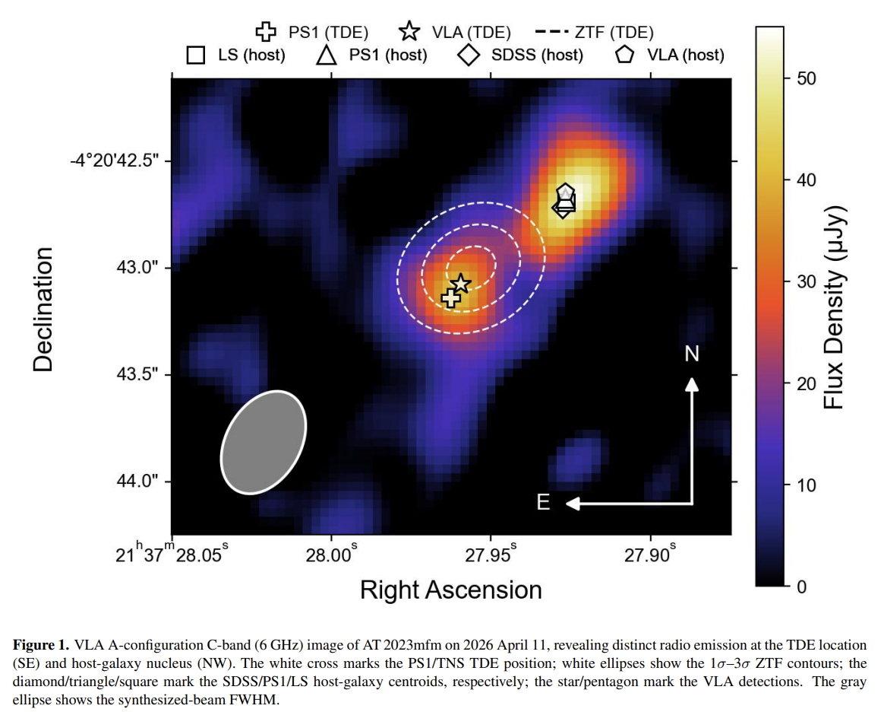

2. [From Cosmic Web to Supernova Remnants: Modeling FRB DM to Trace Baryons across Multiple Scales](https://arxiv.org/abs/2606.06963)

   > Fast Radio Burst, Cosmology, Simulation, Baryon, SNR

   围绕 FRB 色散量 $DM$ 的多尺度来源建立统一建模框架，把宇宙网、前景 halo、CGM、宿主星系和源区等离子体分层处理。大尺度部分使用基于 GADGET3/4 OSAKA 的 CROCODILE 水动力模拟，包含恒星形成、超新星反馈和 AGN 反馈，构建 light cone、气体密度剖面和 $DM$ 统计；局域部分用一维水动力、非平衡电离和辐射冷却模型，模拟年轻 magnetar 嵌在超新星遗迹中的 $DM_{\rm source}$ 和 $RM_{\rm source}$ 演化。SNR 数据产品在 [Zenodo](https://doi.org/10.5281/zenodo.20486710)，代码为 [SNR_FRB](https://github.com/zhaojosephzhang/SNR_FRB)；宇宙学 FRB 模拟分析框架 ARCOS 在 [Zenodo](https://doi.org/10.5281/zenodo.20487842) 和 [GitHub](https://github.com/zhaojosephzhang/ARCOS)。

   到 $z=1$ 的 $DM$–$z$ 关系给出 diffuse baryon fraction $f_{\rm diff}=0.865^{+0.101}_{-0.165}$，无黑洞反馈模型为 $0.856^{+0.101}_{-0.162}$。AGN 反馈会降低 halo 中心气体密度、改变 CGM 与 IGM 的边界，并显著调制前景 halo 对 FRB 视线的 $DM$ 贡献；$10^{12.5}$–$10^{13.5}\,M_\odot$ halo 中反馈对中心 $DM$ 的压低最强。宿主项高度依赖环境：中心 dwarf case 通常低于 $100\,{\rm pc\,cm^{-3}}$，MW like spiral 中心可到百量级，cluster 环境可超过 $1300\,{\rm pc\,cm^{-3}}$。SNR 源区模型显示可变 $DM$ 主要来自未激波 ejecta，激波区通常只贡献 $\lesssim10\,{\rm pc\,cm^{-3}}$；早期 $DM\propto t^{-\alpha}$，$\alpha\simeq1.8$–1.9。匹配 FRB 20190520B 和 FRB 20121102 的 $dDM/dt$ 需要几十到数百 ${\rm pc\,cm^{-3}}$ 的本地 SNR 贡献，多数模型在 $\lesssim70$ yr 内对 GHz FRB 透明，说明精确 FRB 宇宙学必须同时建模前景 halo、宿主环境和源区演化。

   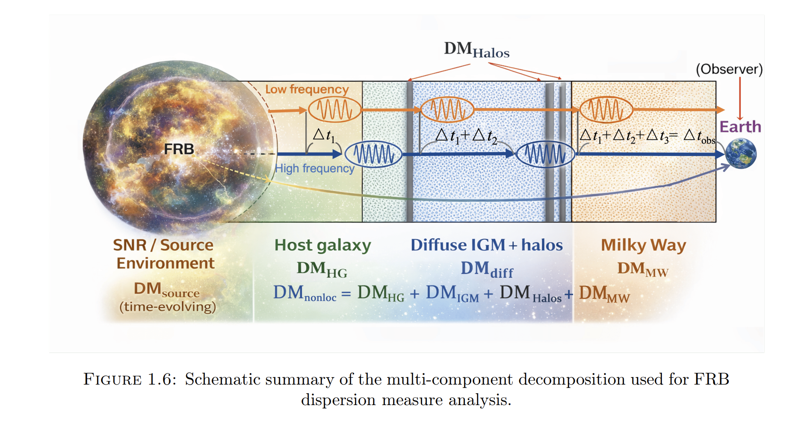

3. [A series of unfortunate events: CHIME/FRB misclassification of a Galactic pulsar as a periodic fast radio burst](https://arxiv.org/abs/2606.07087)

   > Fast Radio Burst, Pulsar, CHIME, Instrument

   FRB 20191221A 原先被报告为具有显著 217 ms 周期的长持续时间 FRB，信号约 3 s、包含 9 个显著峰；按当时定位方向估算，其 $DM$ 超过银河电子密度模型预测约 4 倍。新的 CHIME/Slow 探测和 Second CHIME/FRB Baseband Catalog 中的 twin bursts 显示，该事件的周期、$DM$、RA 和 Faraday rotation 与已知银河脉冲星 PSR J0248+6021 一致，只是 Dec 偏差约 $20^\circ$，因此 FRB 20191221A 实际是该高 $DM$ 银河脉冲星的少数脉冲被错误定位。

   误分类来自一次罕见的 CHIME 校准故障。2019 年 12 月 21 日强降雨导致部分 feeds 异常，测试中的 RFI excision 在校准源 transit 期间把高频段数据标记为坏数据，校准流程可能使用了 stale visibility data；得到的 gain solution 在 $\gtrsim600$ MHz 产生随南北 feed 位置变化的相位梯度，beamforming 后造成频率相关的 Dec 指向偏移，约为 $20^\circ$。PSR J0248+6021 本身位于致密 H II 区附近、$DM$ 异常高，并具有类似 rotating radio transient 的爆发式发射，进一步增强了 FRB 外观。新的日增益诊断会搜索非零 offset 的次峰；已检查所有 CHIME/FRB 已发表事件，包括第二目录，只有 2019 年 12 月 21 日和无 FRB 探测的 2019 年 3 月 11 日出现大范围频道偏移，支持该问题没有影响其他 FRB 定位。
   
   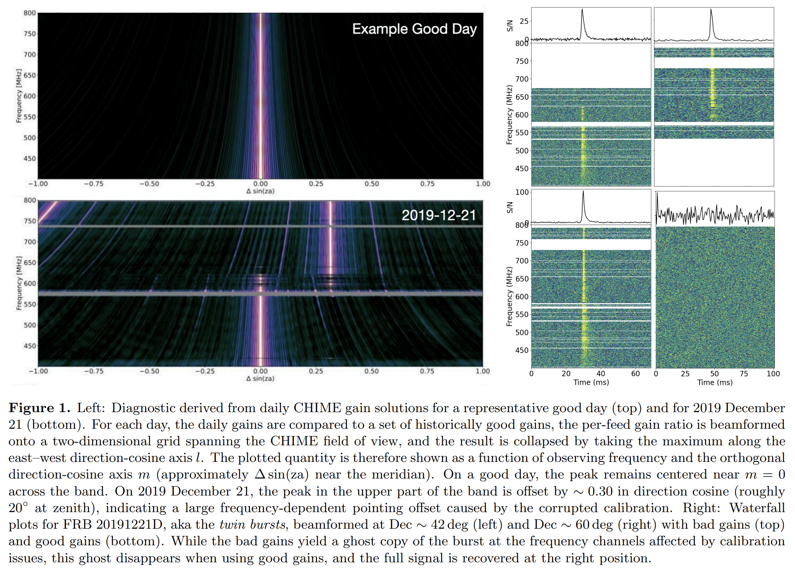

## 2026-06-09

1. [Do Vision-Language Models See Dwarf Galaxies the Way We Do?](https://arxiv.org/abs/2606.07779)

   > VLM, Galaxy

   评估VLM在识别超暗矮星系上的性能。结果发现零样本的VLM能较好复现人工结果。

   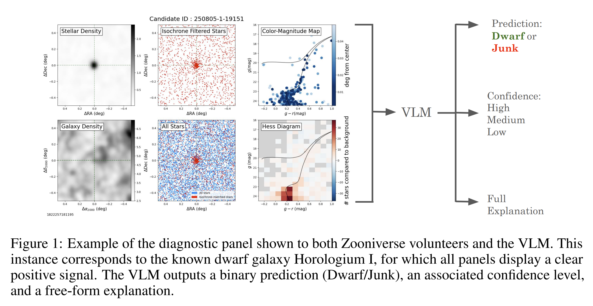

2. [Faraday Complexity and Depolarisation in a High-Rotation-Measure Radio Galaxy from the Spectra and Polarisation In Cutouts of Extragalactic Sources (SPICE-RACS) DR2](https://arxiv.org/abs/2606.07919)

   > Polarization, Galaxy

   ASKAP对RACS\_0900-28\_7036这个射电源的观测，测量到其偏振有一个 Burn-slab 成分和两个外部法拉第色散成分（1 Slab + 2 EFD）。

3. [Modern Time-Series and Spectral Methods for Analyzing Solar and Stellar Oscillatory Signals](https://arxiv.org/abs/2606.07966)

   > Time Series, Light Curve, Period, Method

   对比基于傅里叶变换的方法、基于非线性拟合的方法（Lomb-Scargle 周期图）、时频方法（小波变换和同步压缩变换）以及自适应分解技术（经验模态分解）这些方法在恒星光变曲线找周期的性能。

   FFT 和 LSP 适合平稳或准平稳周期信号，wavelet 更适合暂现和非平稳振荡，EMD/HHT 更灵活但容易 mode mixing，SWT 频率分辨率更好但缺少成熟显著性检验。作者特别提醒，太阳和恒星数据里的背景噪声常常是 red noise / power-law noise，不能简单用白噪声或 AR(1) 显著性检验，否则会把随机涨落误判成 QPP，或者因为不当 detrending 人为制造周期信号。

   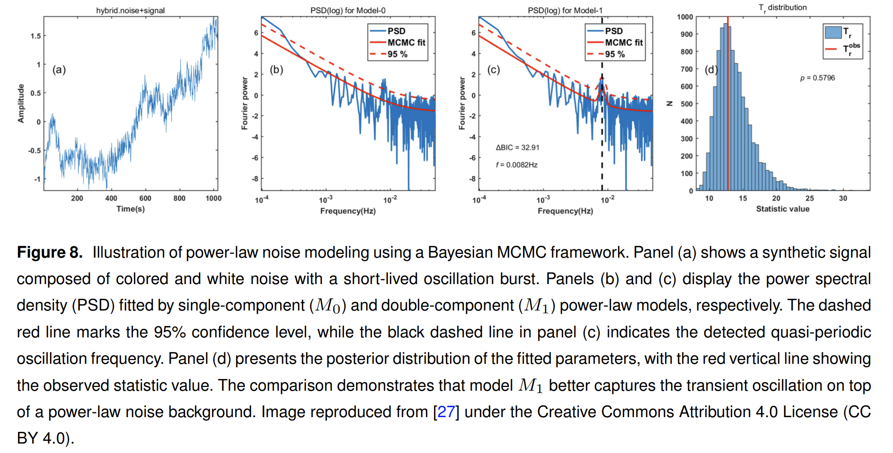

4. [Fast Astronomical Transients in Archival Photographic Plates: Using optical aberrations as a tool for discerning real images, from plate artifacts](https://arxiv.org/abs/2606.08319)

   > Optical, Transient

   用历史天文底片里的**光学像差**来判断所谓 fast optical transients 是否真的是经过望远镜成像的天体信号，而不是底片缺陷。作者利用 APPLAUSE 档案中 Hamburger Sternwarte Doppel-Reflektor 0.6 m 望远镜的 532 对底片；这台望远镜的离轴点源会带明显 coma，因此真正的星像应该和周围恒星一样带有朝向视场中心的彗差形态，而底片划痕、灰尘、乳剂缺陷等伪影不会自然复现这种光学结构。最终找到 11 个 transient，其中多个显示出和同场参考星一致的 coma signature，因此支持它们确实由穿过望远镜光路的光造成，而不是普通 plate artifacts。

   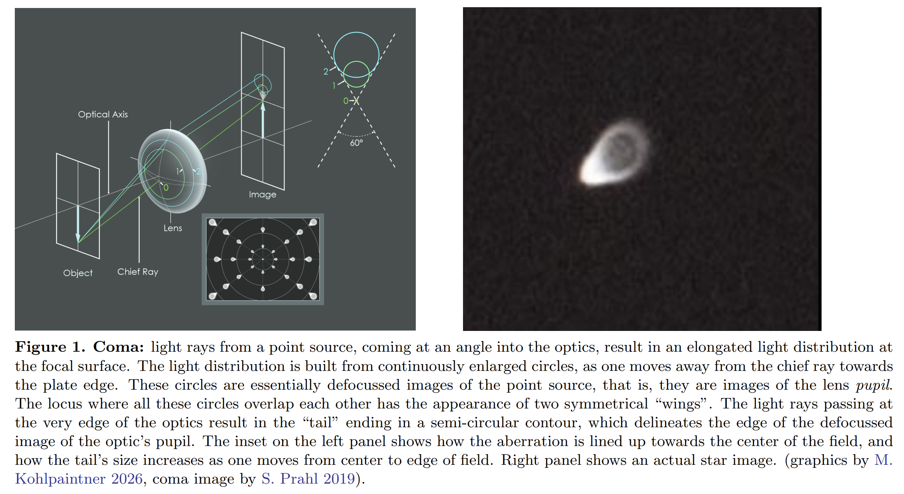

5. [Fast Radio Bursts produced during collapse of macroscopic X-mode in magnetized pair plasma](https://arxiv.org/abs/2606.09417)

   > Fast Radio Burst, Theory

   提出一种磁星磁层中产生 FRB 的等离子体机制：高度磁化 pair plasma 里的大尺度 X-mode 电磁扰动，在接近 current starvation、且扰动磁场幅度约等于或超过 guide field 的窄参数区间内，会发生 nonlinear wave collapse / breaking。

## 2026-06-10

1. [Radio precursors of monster shocks: a mechanism for fast radio bursts from SGR 1935+2154](https://arxiv.org/abs/2606.10189)

   > Fast Radio Burst, Magnetar, Plasma Shock

   Beloborodov 提出一种解释 SGR 1935+2154 弱 FRB 的机制：活跃磁星中的 kHz magnetosonic 扰动会在 $r\sim10^8$ cm 处演化成 “monster radiative shock”，冲击产生 X 射线，同时在冲击前方产生半相干射电 precursor。关键在于这个 radio precursor 会强烈作用于上游磁层等离子体，使辐射自调节；最终 GHz 射电爆发主要在 $r\sim10^9$ cm 产生，持续亚毫秒，能量约 $E_{\rm FRB}\sim10^{34}E_{38}^{0.2}$ erg。模型自然给出 X 射线比射电晚毫秒级到来，也解释了为什么 SGR 1935+2154 的 X 射线爆发很少伴随射电：GHz burst 往外逃逸时容易在光柱附近被吸收，只有视线方向等离子体密度比典型活跃磁星低约 30 倍时才看得到。**磁层内 monster shock 可以解释银河磁星的弱 FRB，但效率太低，不能直接解释 $E_{\rm FRB}\gtrsim10^{38}$ erg 的明亮宇宙学 FRB。**

2. [Integral Field Unit Spectroscopy with One Fiber](https://arxiv.org/abs/2606.10197)

   > Galaxy Spectroscopy, Foundation Model, IFU

   提出一个多模态、概率式 foundation model，用宽波段图像、红移和指定 fiber 位置，直接预测星系任意空间位置的高分辨率光谱及不确定度。模型基于 masked autoencoder，训练数据是 470 万个 DESI 图像和单 fiber 光谱；作者利用 DESI fiber 天然落在星系不同位置的分布，以及星系内部形态自相似性，让模型学会“某类局部形态对应某类光谱”。把 fiber 位置在图像上扫描一遍后，就能合成近似 IFU datacube。和独立 MaNGA IFU 数据比较时，模型能恢复 Hα flux map 和局部谱线结构，zero-shot 表现接近直接用 MaNGA 训练的监督 baseline。核心意思是：大规模单孔径光谱巡天里其实藏着空间分辨信息，足够大的多模态模型可以把“一根 fiber”扩展成近似 IFU 能力。

   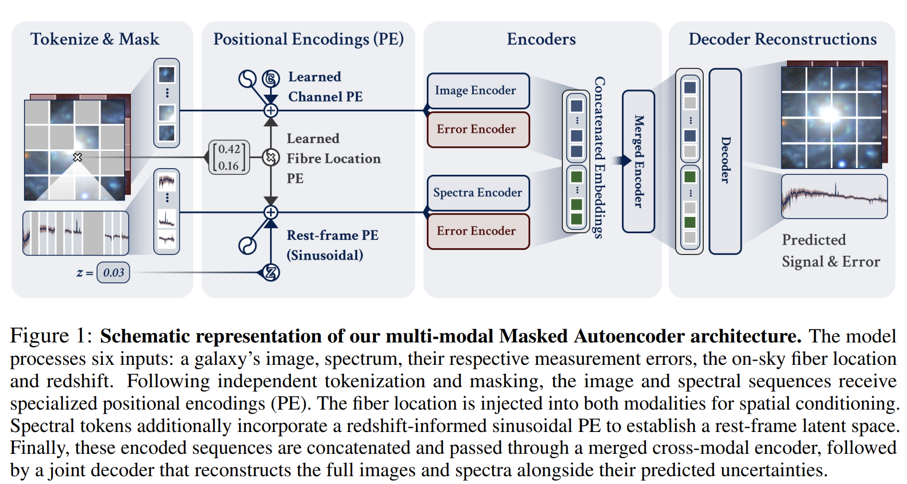

3. [Updating the PATH framework with FRB host galaxy models](https://arxiv.org/abs/2606.10538)

   > Fast Radio Burst, Host Galaxy, Bayesian Association

   升级 FRB 宿主星系匹配工具 PATH。原始 PATH 主要用 FRB 定位误差、星系位置、星系亮度和一个简化的“宿主不可见”先验来给候选宿主分配概率；作者现在把 FRB 的 DM 信息也纳入进去，用 $P(z|\mathrm{DM})$ 预测红移，再用 $P(m_r|z)$ 预测宿主 apparent magnitude，从而给出更物理的宿主亮度先验和 unseen-host 概率。他们测试了 Marnoch23、Loudas25 和一个新的 Naive 模型，并用 32 个 ASKAP/CRAFT ICS FRB 拟合。结果是，新先验通常会提高已知最可能宿主的置信度；同时显示 FRB 宿主整体比单纯按 star formation 加权预期的星系更暗，而质量加权模型更不合适。作者建议默认用较简单的 Marnoch23 模型生成 PATH prior，并强调 $P(U)$ 不该是固定常数，而应该随 DM 和图像深度变化。高红移端目前样本太少，宿主金属丰度或对大质量高散射宿主的探测偏差，可能是下一步要区分的解释。

4. [The Thousand-Pulsar-Array programme on MeerKAT XIX: Single-pulse data analysis, nulling and pulse energy distributions](https://arxiv.org/abs/2606.10807)

   > Pulsar, MeerKAT, Nulling

   发布并分析 MeerKAT Thousand Pulsar Array 的单脉冲数据集：1192 颗脉冲星，每颗通常约 1000 个连续脉冲，并介绍 MeerTime Single Pulse pipeline 如何校准、去 RFI、生成单脉冲数据产品。作者用 Bayesian 框架同时拟合 pulse energy distribution 和 nulling fraction。对可靠样本而言，约一半脉冲星可用单一能量分布解释，另一半需要多成分模型；nulling 在大多数源中被探测或约束。最清楚的群体趋势是：nulling fraction 几乎随自转周期近线性增加，而对 $\dot P$ 依赖很弱，暗示 nulling 更可能和磁层几何、光柱半径、极冠尺寸有关，而不是简单由 spin-down power 控制。作者还发现能量分布形状随 $\dot E$ 有轻微演化迹象；低 $\dot E$ 脉冲星的单个亮脉冲有时可达到甚至超过长期 spin-down luminosity，这也让一些超长周期射电暂现源的高亮脉冲显得没那么“异类”。

   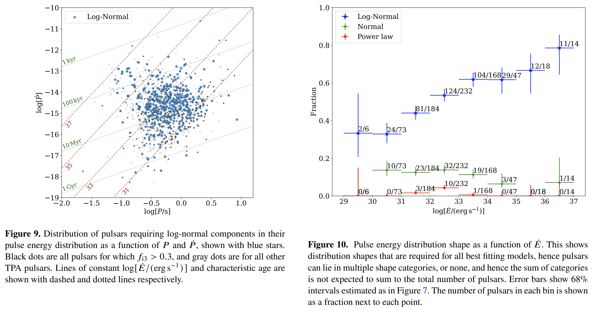

5. [The Ohio SETI Program - The Last Decades](https://arxiv.org/abs/2606.11102)

   > SETI, Radio Transient, Wow! Signal

   回顾 Ohio State University Radio Observatory “Big Ear” 在后几十年的 SETI 工作。Big Ear 在完成 Ohio Sky Survey 后，于 1973 年转为世界上第一个全职 SETI 观测站，一直运行到 1998 年拆除；期间从 8-channel hydrogen-line receiver 发展到 50-channel、LOBES、SERENDIP 等系统，长期覆盖约 70% 的射电天空。文章重点不只是 Wow! Signal：这个信号确实符合强窄带、近氢线、天球点源等特征，但只经过一个波束且从未重复，因此仍是未解事件。更有意思的是，Ohio SETI 还留下 4 万多个短时窄带 transient 事件，其中一些在银河中心附近和极轴方向呈现非随机集中。作者把 Big Ear archive 放进现代时域射电天文学语境里看：它既是 SETI 遗产，也是早期 radio transient 档案；Arecibo Wow! project 正在重新数字化和分析这些数据，未来可能还会从这个老档案里挖出新东西。

   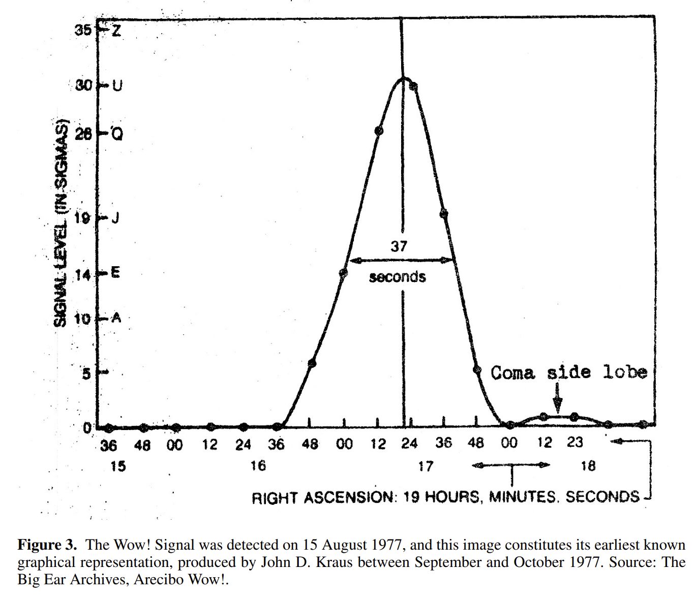

## 2026-06-11

1. [A magnetar formation in binary neutron star merger](https://arxiv.org/abs/2606.11299)

   > Binary Neutron Star, Magnetar, Theory, Simulation

   双中子星并合后能否在毫秒尺度形成磁星，通过全局广义相对论中微子辐射转移磁流体模拟检验。模拟使用 `NANASI`，采用 DD2 核物质状态方程、$1.35+1.35,M_\odot$ 等质量双中子星、约 44.4 km 初始间距，并用 $A_\varphi \propto \max(P-0.0004P_{\rm max},0)^2$ 初始化内部磁场，最大初始磁场为 $3.16\times10^{12},{\rm G}$。最高空间分辨率达到 6.25 m，覆盖并合接触面和 Kelvin Helmholtz 不稳定性区域。

   两颗中子星接触后，Kelvin Helmholtz 不稳定性先在小尺度指数放大磁场，再推动恒星尺度磁场增长。电磁能在并合后约 5 ms 达到 $\sim10^{50}$ erg 量级；功率谱中动能谱接近 Kolmogorov $k^{-5/3}$，磁能谱出现 Kazantsev $k^{3/2}$，指向小尺度动力学发电机过程。恒星尺度磁场从 $3.16\times10^{12},{\rm G}$ 增至约 $10^{15},{\rm G}$，即使考虑湍流电阻率外推可能高估约一个数量级，仍可达到 $\sim10^{14},{\rm G}$。并合后若不立即塌缩为黑洞，短暂磁星形成可能较普遍；不过得到的强磁场主要位于赤道附近且不是偶极结构，后续仍需要磁转动不稳定性等机制形成极区大尺度场和相对论喷流。

   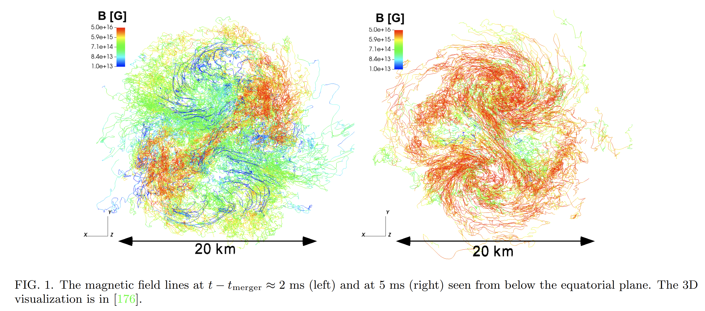

2. [Time Series Analysis in Machine Learning](https://arxiv.org/abs/2606.11746)

   > Time Series, Machine Learning, Deep Learning, Review

   面向天文学、宇宙学和其他时域数据的机器学习时间序列综述，梳理从经典统计模型到深度学习模型的主要路线。内容覆盖平稳性、自相关、季节性等基本概念，以及 ARIMA、指数平滑、状态空间模型、HMM、Lomb Scargle 周期图、Gaussian Process、CARMA/DRW 等经典方法；其中 GP 和连续时间模型适合不规则采样光变曲线，但普通 GP 的计算代价随样本数快速上升，LSST 时代的大规模光变曲线需要更可扩展的实现。

   机器学习部分把时间序列任务分为特征工程加通用模型、距离或形状方法、集成树模型、ROCKET 类随机卷积核方法，以及 RNN、LSTM、CNN、Transformer、时间序列 foundation model 等端到端模型。关键实践点是验证必须保持时间顺序，随机 k 折会引入未来信息泄漏；天文应用还要处理不规则采样、异方差测量误差、类别不平衡和稀有事件。整体结论偏方法论：小数据、可解释或季节性问题仍适合经典模型和树模型；大规模复杂序列可用深度学习和 Transformer，但需要更多数据、调参和不确定性校准；科学场景中，物理约束、可解释性和面向天文噪声特性的基准评估仍是主要挑战。

## 2026-06-12

1. [Multifractal Signatures of Hamiltonian Chaos in Hyperion's Rotational Dynamics](https://arxiv.org/abs/2606.12491)

   > Planetary, Hamiltonian Chaos, Time Series, Method

   土卫七 Hyperion 的混沌自转已经由理论和航天器成像支持，关键问题是稀疏、有噪声的地基光变能否给出正面的混沌诊断。合成光变先由三轴刚体在 Saturn 潮汐力矩下的 Euler 方程生成：

   $$
   A\dot{\omega}_{x}-(B-C)\omega_y\omega_z=N_x,\quad B\dot{\omega}_{y}-(C-A)\omega_z\omega_x=N_y,\quad C\dot{\omega}_{z}-(A-B)\omega_x\omega_y=N_z
   $$

   $$
   N_x=\frac{3GM}{r^3}(C-B)u_yu_z,\quad N_y=\frac{3GM}{r^3}(A-C)u_zu_x,\quad N_z=\frac{3GM}{r^3}(B-A)u_xu_y
   $$

   姿态再通过三轴椭球的投影面积转成光变：

   $$
   S(t)=\pi\sqrt{ b^2c^2(\hat O\cdot \hat x_b)^2+ c^2a^2(\hat O\cdot \hat y_b)^2+ a^2b^2(\hat O\cdot \hat z_b)^2 }
   $$

   真实 Klavetter 1989 光变和合成光变都用自然样条重采样到均匀网格，再做 MFDFA。核心诊断不是直接测 Lyapunov 指数，而是从光变序列构造 profile：

   $$
   Y(i)=\sum_{k=1}^{i}[x_k-\langle x\rangle]
   $$

   对不同尺度窗口计算局部去趋势方差和 $q$ 阶 fluctuation function：

   $$
   F^2(\nu,s)=\frac{1}{s}\sum_{i=1}^{s} \{Y[(\nu-1)s+i]-y_\nu(i)\}^2
   $$

   $$
   F_q(s)= \left\{ \frac{1}{2N_s} \sum_{\nu=1}^{2N_s} [F^2(\nu,s)]^{q/2} \right\}^{1/q}
   $$

   若满足标度律：

   $$
   F_q(s)\sim s^{h(q)}
   $$

   则由斜率得到 generalized Hurst exponent $h(q)$，再用 Legendre 变换得到奇异谱：

   $$
   \alpha=h(q)+qh'(q),\quad f(\alpha)=q[\alpha-h(q)]+1
   $$

   谱宽定义为：

   $$
   \Delta\alpha=\alpha_{\max}-\alpha_{\min}
   $$

   这里 $\Delta\alpha$ 只作为同一套预处理和参数下的相对诊断量，不被解释成通用混沌强度。混沌翻滚在稀疏采样和噪声过滤后仍保留宽的多重分形谱，合成观测混沌模型给出 $\Delta\alpha\approx1.13$，Klavetter 数据为 $\Delta\alpha=1.42\pm0.08$；规则快自转在相同观测窗口下被混叠成近似噪声，谱宽约 $\Delta\alpha\approx0.13$。shuffled 和 IAAFT surrogate 的谱宽显著塌缩，说明宽谱主要来自非线性相位相关和 Hamiltonian 相空间 stickiness，而不是振幅分布、线性相关或有限数据长度。MFDFA 因此可在传统 Lyapunov 或相空间重构不可行时，从稀疏行星光变中识别混沌翻滚。

2. [What I Wish I had Known When I Began Building Astronomical Instruments](https://arxiv.org/abs/2606.12653)

   > Astronomy, Instrument, Review

   面向刚进入天文仪器研制领域的研究者，总结地基望远镜仪器项目中的经验性规则。核心判断是科学目标先于技术新颖性：仪器概念、需求追踪、预算和排期都应从关键科学观测反推，而不是由可用技术或空白功能清单驱动。系统工程在小项目中也不能省略，项目负责人需要理解科学目标、工程取舍和需求边界，避免把失败归因于已委托出去的局部任务。

   具体建议覆盖团队组织、工程沟通、光学、结构、运动机构、探测器、电子学、软件、供应商和仪器全生命周期。仪器控制、数据处理和观测规划软件需要及早纳入项目；没有可用的数据处理流程，仪器很难真正完成 commissioning。装配、集成和测试应尽量在实验室中暴露问题，望远镜现场不适合首次发现基础缺陷。仪器投入使用后还需要持续响应异常行为，并尽早撰写 instrument paper、硬件手册和观测者手册，把性能和维护知识固定下来。

3. [Finding Novel Precursors for Solar Wind Stream Interaction Regions with Interpretable Deep Learning](https://arxiv.org/abs/2606.12661)

   > Solar Wind, Space Weather, Deep Learning, Tool

   太阳风 stream interaction regions 传统上依赖人工目视和阈值标注，边界主观且容易漏掉弱压缩或复杂形态事件。SIREN 使用 Wind/SWE 和 MFI 的原位太阳风数据，对 Chi2018 目录中的事件做逐时间步 SIR 检测；每个样本覆盖 stream interface 前后三天，共 864 个 10 分钟步长，输入 11 个磁场、速度和热力学参数。质量筛选后保留 676 个事件，按 473/101/102 分成训练、验证和测试集。模型是约 99,985 参数的两层 Transformer encoder，使用加权 binary cross entropy、cosine annealing 学习率和 Platt scaling 输出校准概率。代码、训练权重和特征归因流程在 [Zenodo](https://doi.org/10.5281/zenodo.20531966)。

   独立测试集上 ROC-AUC 为 0.93，F1 为 0.78，TSS 为 0.67，HSS 为 0.70；self-attention 主要集中在 stream interface 和压缩区。Integrated Gradients 显示质子密度贡献 24.3%、总磁场强度 21.6%、温度 13.9%、体速度 12.1%，共同构成主要 SIR 诊断量；横向速度 $V_y$ 和东西向流角合计贡献 13–17%，把 flow deflection 定量识别为稳定但以往低估的 SIR 前兆。连续概率输出比二元目录更适合阈值可调的业务监测和自动 catalog 构建。

4. [A Delayed Multi-channel Progenitor for Apparently Nonrepeating Fast Radio Bursts](https://arxiv.org/abs/2606.12960)

   > Fast Radio Burst, CHIME, Population, Progenitor

   针对 apparently nonrepeating FRB 的红移演化，使用 CHIME/FRB Catalog 2 Gold Sample 中的 1973 个高质量事件做统计人口分析。多数 CHIME FRB 缺少宿主星系红移，因此用更新的 $\mathrm{DM_E}-z$ 关系从银河系外色散量统计推断红移，并同时拟合 fluence、各向同性能量和红移的累积分布。模型中包含经验探测效率、带指数截断的幂律能量函数，并比较直接追踪恒星形成历史 SFH 的模型、Gaussian/log normal/power law 延迟模型、BNS 相关模型、中子星年龄窗口模型，以及 BNS 和年龄窗口的混合模型。

   纯 SFH 模型拟合最差，$\mathrm{BIC}=21146.27$；延迟模型显著改善，其中 Gaussian delay 的 $\mathrm{BIC}=5008.74$。物理动机模型中，BNS 相关通道和中子星年龄窗口通道的混合模型最好，$\mathrm{BIC}=3653.80$，有效平均延迟时间为 $\bar{\tau}=1.426^{+0.032}*{-0.035},\mathrm{Gyr}$，混合权重 $w*{\rm BNS}=0.657^{+0.015}_{-0.018}$。结果支持 one-off FRB 的红移分布包含延迟演化和多通道成分，但混合权重只是模型空间中两种红移分布形状的相对权重，不能直接解释为真实物理分支比例。

## 2026-06-15

1. [A novel data-driven approach to extract stellar population properties from galaxy spectra using absorption indices](https://arxiv.org/abs/2606.13791)

   > Galaxy, Stellar Population, PCA, Method

   用可解释的 PCA latent space 从星系光谱吸收指标中提取恒星族群信息，重点解决年龄–金属丰度退化。在 500,000 个 composite stellar population 模型上选取六个指标：$D_n(4000)$、H$\beta$、H$\gamma_A$、H$\delta_A$、[MgFe]$'$、[Mg$_2$Fe]，标准化后对 $6\times6$ 协方差矩阵做 PCA，再把 SDSS 和 LEGA-C 星系投影到模型定义的主成分空间。实际使用的模型子样本为 414,514 个；观测样本限制在 $\sigma=150$–250 km s$^{-1}$，最终包含 138,659 个 SDSS 星系和 34 个 LEGA-C 星系，所用 SDSS/LEGA-C 目录在[这里](https://www.basta.inaf.it/)。

   PC1 解释 83.66% 方差，主要对应年龄主导的恒星族群演化轴，并在第二阶上混合金属丰度；PC2、PC3 捕捉较弱但有物理意义的次级变化，在前三个主成分空间中可部分打破年龄–金属丰度退化。PC6 虽只解释 0.04% 方差，却主要体现 H$\gamma_A$ 与 H$\delta_A$ 的相反变化，可作为近期 burst 的诊断量，模型中 PC6 $<-0.1$ 对应近期 starburst。投影到真实数据后，LEGA-C 的中红移星系比 SDSS 更接近包含年轻和 bursty 成分的模型区域，并呈现两个族群：一个与年轻 SDSS 星系重叠，平均年龄约 4.6 Gyr；另一个更年轻、金属丰度更低，平均年龄约 1.4 Gyr。PCA 与常规 SPS fitting 的年龄判别一致，但不需要逐个星系做直接光谱拟合。

   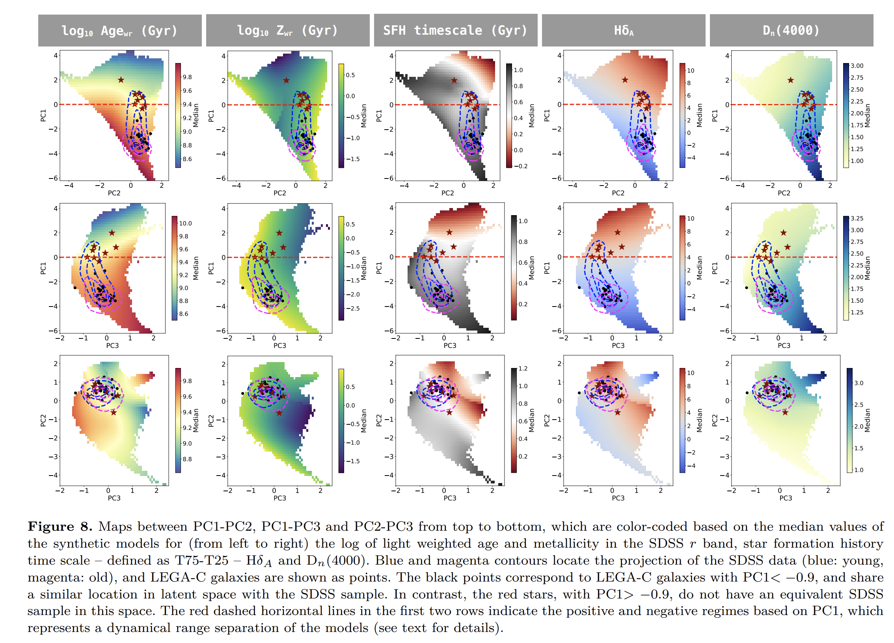

2. [Solar System Technosignatures](https://arxiv.org/abs/2606.13797)

   > Technosignature, Solar System, SETI, Review

   评估太阳系内物理 technosignature 的现有限制，包括轨道上的 probe 和行星/小天体表面的 artifact，并按 active/passive、probe/surface artifact 构造搜索矩阵。可用线索包括异常轨道、异常光谱、异常形状、通信信号、废热和表面结构；但每类线索都有强自然混淆源，例如 interstellar comet、dark comet、Yarkovsky 效应、outgassing、活跃小行星和普通热异常。

   现有观测只能给出很粗的上限。一个面积 $\sim1,{\rm km^2}$、位于 5 au 的全反射被动 probe 亮度可达 $m_V\sim19.5$，并不难被 LSST 级巡天发现，难点是从 $>10^6$ 主带小行星和大量小天体中识别其非自然属性。地基可见光/近红外通常无法分辨 probe，10 km 物体在 1 au 也只有约 0.015 arcsec；雷达成像可达米级形状约束，但信噪比随距离按 $1/R^4$ 下降，只适用于近地掠过目标。表面 artifact 的限制也很不完整：月球 LRO/NAC 可达约 0.5 m 分辨率但像素量巨大，许多外太阳系卫星和小天体只有公里级或更粗覆盖，1 km 结构在多数 Saturn 卫星图像中可能不到一个像素。结论是不能排除太阳系中存在未识别的 probe 或 artifact；更现实的推进方向是利用 PDS/PSA、Gaia、WISE/NEOWISE、LSST、SPHEREx 和行星影像档案做异常目标搜索，即使没有发现 ET 技术物，也会改进太阳系小天体和表面过程的普查。

   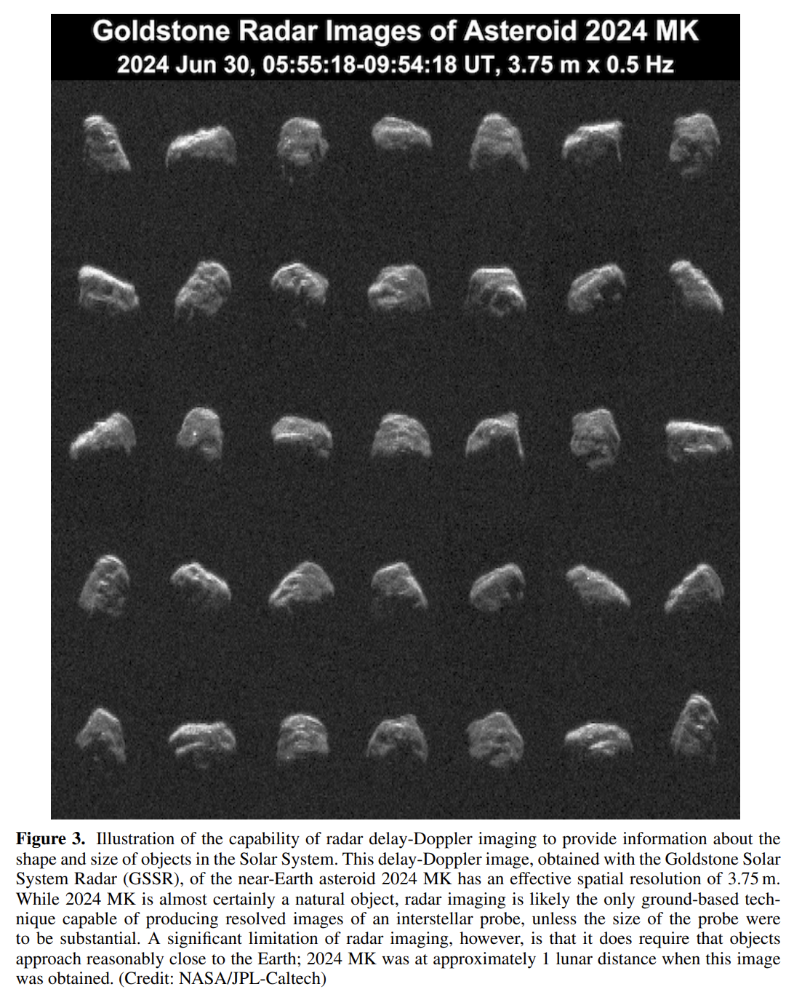

3. [Multiwavelength Analysis of the Einstein Probe X-ray Transient EP240305a](https://arxiv.org/abs/2606.14341)

   > Transient, Einstein Probe, GRB, Observation

   报告 Einstein Probe 在 2024 年 3 月 5 日发现的未编目 X-ray transient EP240305a，并结合 EP/WXT、EP/FXT、Swift/XRT、GROND、SVOM/VT 和 ATCA 做 X-ray、光学、近红外和射电跟进。WXT 看到两个软 X-ray flare：第一个持续约 120 s，0.5–4 keV 峰值通量约 $3\times10^{-9},{\rm erg,cm^{-2},s^{-1}}$；约 200 s 后第二个 flare 持续约 250 s，峰值通量约 $5\times10^{-10},{\rm erg,cm^{-2},s^{-1}}$。X-ray 通量两天内下降约两个数量级，21 天后比初始低至少四个数量级；谱可由吸收幂律描述，WXT 平均谱光子指数 $\Gamma=1.6^{+0.8}_{-0.7}$。GROND 在 $J/H$ 波段发现暗弱候选 counterpart，SVOM/VT 后期未探测到显著源。

   ATCA 在触发后一周开始、持续约 81 天的多历元观测显示射电源从自吸收到光学薄状态演化：第 10 天谱指数 $\alpha=1.51$，第 21/23 天转为 $\alpha=-0.53$ 和 $-0.16$，第 66 天为 $\alpha=-0.74$，指向离散喷流抛射和膨胀。快速 X-ray 衰减和早期射电峰值排除了 jetted TDE；低吸收柱、远离银心位置和显著射电辐射不支持 very faint X-ray transient；近红外限制和持续数周的射电辐射也不支持普通恒星 flare。缺少光谱红移使分类不能定案，但若位于 $z\sim0.1$–0.5，X-ray 和射电 luminosity 与 GRB afterglow 量级相容；无 gamma-ray counterpart、双峰 X-ray 结构和射电衰减斜率 $\sim-0.93\pm0.07$ 共同支持 gamma ray dark GRB like transient，可能来自 off axis jet 或 choked jet。

   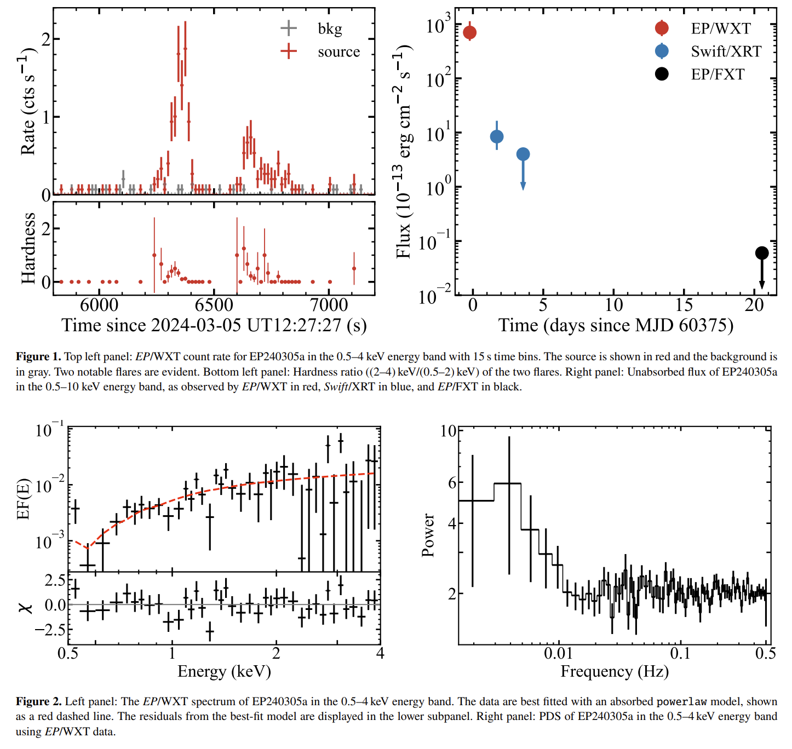

## 2026-06-16

1. [Spiking Neural Dedispersion: A Neuromorphic Fast Radio Burst Detection Pipeline](https://arxiv.org/abs/2606.15361)

   > Fast Radio Burst, Neuromorphic Computing, Dedispersion, Tool

   面向下一代射电望远镜实时 FRB 搜索中高成本的去色散后端，构建了基于 Spiking Neural Dedispersion 的神经形态管线，代码在[这里](https://github.com/lessju/NeuroFRB)。核心是把归一化 filterbank 编码成 spike raster，再用分层 delay and add 树做非相干去色散，支持任意 trial DM 网格和可调分支因子；后端接 DM 相关 boxcar matched filter、连通域候选提取和跨频带合并。验证使用 950 个合成 Northern Cross filterbank、共 12350 个注入 FRB，并与 Heimdall 对比。

   float 模式达到 99.3% 完整度，接近 Heimdall 的 99.4%，估计功耗为每束 244 mW；graded 模式为 89.3% 和 61 mW；binary 模式整体为 59.4% 和 1.75 mW，但对亮且窄的事件仍保留约 91% 灵敏度。三种模式都能放进单个 SpiNNaker 2 芯片，binary 的 history buffer 完全在片上 SRAM 内；48 芯片板卡可对应 48 个同时波束，系统功耗估计约 100–112 W，相比等效 GPU 部署低约 10–40 倍。

   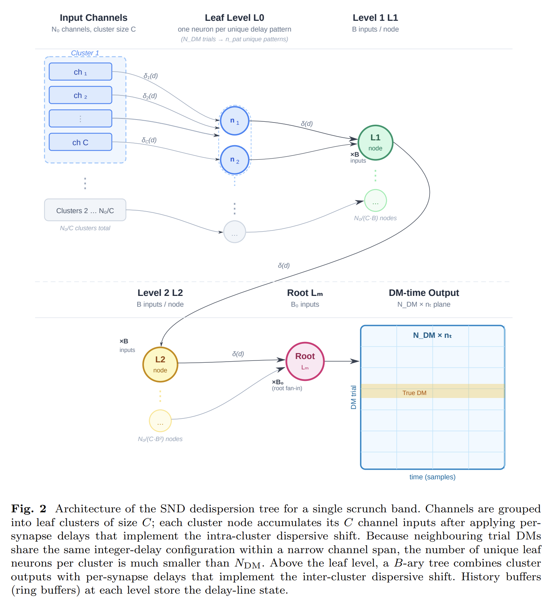

2. [From One to Two: A Second Binary Millisecond Pulsar in the Globular Cluster M92 (NGC 6341)](https://arxiv.org/abs/2606.15639)

   > Pulsar, Globular Cluster, FAST, Timing

   利用 FAST 对球状星团 M92 的 6 年 L 波段观测，搜索并计时第二颗毫秒脉冲星 PSR J1717+4308B。观测覆盖 1.0–1.5 GHz，使用 PRESTO/MOSS 做 DM 搜索、加速度搜索和 jerk 搜索，并用 TEMPO 与 Dracula 得到相位连贯计时解。新脉冲星自转周期 3.51 ms，DM 为 $35.292,{\rm pc,cm^{-3}}$，轨道周期 2.294 天，偏心率约 $4.8\times10^{-4}$，最小伴星质量约 $0.2,M_\odot$，没有探测到食现和显著偏振。

   M92B 的 DM 与 M92A 相差小于 $0.2,{\rm pc,cm^{-3}}$，投影位置在星团核心半径内，负的 $\dot P$ 可由星团引力势中的视向加速度解释，支持其星团成员身份。结合 M92A 和 M92B 的位置与加速度进行贝叶斯 MCMC，得到中心质量密度 $\rho_c=1.2^{+1.3}*{-0.9}\times10^6,M*\odot,{\rm pc^{-3}}$、核心半径 $r_c=0.3^{+0.3}_{-0.1}$ pc，与 $N$ 体动力学模型一致但约束仍宽，说明即使只有少量脉冲星，计时也能提供星团动力学信息。

3. [Transfer learning for transient search with small-field optical survey telescopes](https://arxiv.org/abs/2606.15705)

   > Optical Transient, Deep Learning, Transfer Learning, Method

   针对小视场光学巡天缺少大量标注样本的问题，把 ZTF 暂现源图像中的形态知识迁移到 4 m International Liquid Mirror Telescope。输入是 science、reference、difference 三通道图像 stamp，ZTF 样本来自 ALeRCE 分类，ILMT stamp 被重采样到与 ZTF 接近的像素尺度；CNN 先在 ZTF 上训练，再用较低学习率或冻结卷积层在 ILMT 小样本上微调。ILMT 图像数据在[这里](https://cloud.aries.res.in/index.php/s/xPER9Y3XuaCsTL9)，ZTF 图像入口在[这里](https://irsa.ipac.caltech.edu/applications/ztf/?__action=layout.showDropDown&)。

   real/bogus 分类器在独立测试集上达到 97.3% 准确率，高于无迁移学习的 90.5%；3 类和 4 类暂现源 alert 分类器分别达到 92.9% 和 85.6%。20 组迁移学习模型与 baseline 的非配对 t 检验给出显著差异。接入 PyLMT 后，在约 300 张 ILMT 全帧图像上检出小行星、变星、AGN 和超新星候选，说明大型巡天学到的图像级特征可用于小样本、小视场巡天的实时候选筛选。

   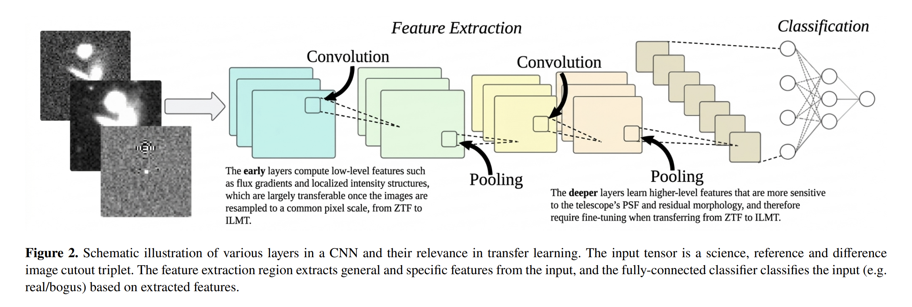

4. [The Rapid ASKAP Continuum Survey (RACS) VIII: total intensity and circular polarization images and catalogues at 887.5 MHz from RACS-low2](https://arxiv.org/abs/2606.16182)

   > Radio, ASKAP, Survey, Catalog

   发布 ASKAP Rapid ASKAP Continuum Survey 的第二个低频 epoch RACS-low2，中心频率 887.5 MHz、带宽 288 MHz，覆盖赤纬约 $+48^\circ$ 以南天空，包含 Stokes I 和 Stokes V 图像、源表和校准 visibility。RACS-low2 使用 15 分钟 snapshot、自动调度和 holography primary beam 模型；数据产品通过 [CASDA](http://data.csiro.au/domain/casda) 和 DOI [10.25919/m8t2-b486](https://doi.org/10.25919/m8t2-b486) 公开。

   合并后的 Stokes I 源表包含 3922151 个源，中值 rms 约 $195,\mu{\rm Jy,PSF^{-1}}$，中值角分辨率约 $15.2''\times13.0''$，亮度标度精度约 7%，天体测量误差通常为 $1''$–$2''$。Stokes V 源表从 Stokes I 位置测量圆偏振，使用位置相关的 Stokes I 泄漏阈值筛选，得到 221 个显著测量；交叉匹配显示包括 61 个独特射电恒星、85 个脉冲星、43 个 AGN 候选，以及一个未关联已知天体的源。

   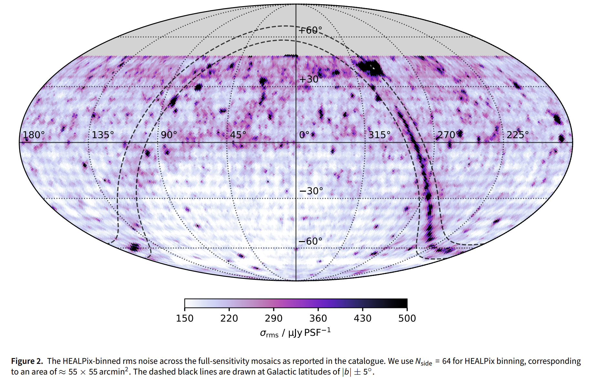

5. [Scalable Bayesian data curation for next-generation radio experiments](https://arxiv.org/abs/2606.16525)

   > Radio, Bayesian Inference, Data Curation, Method

   面向 SKA 时代无法人工质检的大规模射电数据，把数据筛选嵌入贝叶斯推断本身。每个数据点带有潜在异常指示量，似然由物理模型分支和宽的异常分支混合，并对异常指示量边缘化，从而得到后验异常概率，而不需要外部阈值或人工 flag。实现基于 JAX 和 BlackJAX 的 GPU nested sampling，在 REACH 第一年度 4655 个 50–130 MHz 漂移扫描谱上测试。

   每个观测先拟合带 chromaticity 的前景模型并压缩到 75 MHz 参考温度 $T_{\rm ref}$，再用 LST 的 Fourier 模型做群体层级异常检测，证据自动选择 $H=3$。异常图恢复了 95–106 MHz 的 FM 频段 RFI、50 MHz 边缘通道污染、三月/八月/九月/十二月的 episodic contamination，并在后验分数中显露出与噪声源温度和降雨的相关性；这些元数据没有进入似然，因而成为独立诊断。数据质控从外部预处理转为可传播不确定性的推断产物，可减少污染数据对全局 21 cm 科学推断的偏置。

   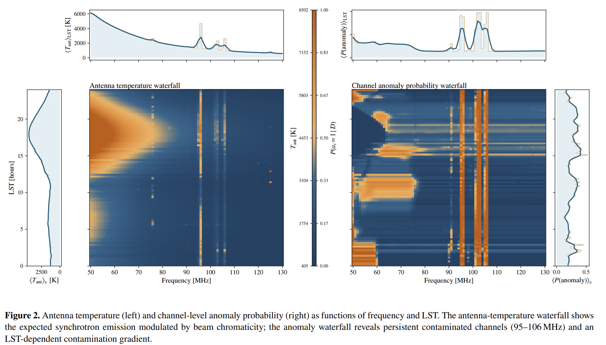

6. [Curvature--Radiation Geometries Across the Second CHIME/FRB Fast Radio Burst Population](https://arxiv.org/abs/2606.17039)

   > Fast Radio Burst, CHIME, Curvature Radiation, Spectral Modeling

   用第二个 [CHIME/FRB catalog](https://www.chime-frb.ca/catalog2) 中 4536 个 burst 的 Stokes I 动态谱，检验三类曲率辐射启发的谱模板：点源 bunch、一维 extended bunch、paired bunch cavity。预处理包括 CHIME good frequency mask、IQR/MAD 额外 RFI 剔除和多尺度频率 rebinning；拟合使用加权非线性最小二乘，并用 $\chi^2_r$、AIC/BIC 和 Ljung Box 残差自相关检验评价模型。

   三个模板的 $\chi^2_r$ 中值都接近 1，repeaters 的拟合质量分布比 non repeaters 更窄，但差异效应量较小。AIC 中一维 bunch 最常被选中，non repeaters 为 61.2%，repeaters 为 70.0%；BIC 下仍最高，但比例降为 45.9% 和 57.3%。残差自相关是主要限制，只有约 12%–22% 的 burst 同时通过 $\chi^2_r$ 和 Ljung Box 标准，说明这些模板能描述主谱包络，但不能解释大量细尺度谱结构。拟合得到的一维模型相干尺度约 16.5–17.9 cm，cavity 模型约 25–28 cm；repeaters 与 non repeaters 参数分布高度重叠，不支持清晰的物理二分。

## 2026-06-17

1. [Discovery of a Supernova Following the Einstein Probe Transient EP250302a at z = 1.131](https://arxiv.org/abs/2606.17170)

   > High Energy, Fast X Ray Transient, Supernova, Observation

   EP250302a 是 Einstein Probe 发现的快速 X 射线暂现源，红移 $z=1.131$，没有对应的伽马射线触发。多波段跟进覆盖 FTW、Gemini North、Swift 和 Chandra 数据，从触发后数小时延伸到约 84 天；早期光学和 X 射线表现为快速、带色差的再增亮，随后进入标准 GRB 余辉式衰减，光谱和闭合关系更接近均匀星际介质中的同步辐射余辉。

   早期峰值可由刷新激波或反向激波解释，光学快速上升要求外流已相对论性准直，保守约束为 $\Gamma_0 > 25$，若减速发生在约 460 秒则可达 $\Gamma_0 \gtrsim 100$。Gemini 晚期 $i$ 波段在 20–30 天出现余光模型之外的光学过量，用 SN 1998bw 型宽线 Ic 超新星模板可解释，亮度缩放约束为 $k_{\rm 98bw} \gtrsim 0.3$。整体图像支持 EP250302a 是一个缺少明显伽马射线触发、但具有长 GRB 类相对论喷流和伴随超新星的事件。

   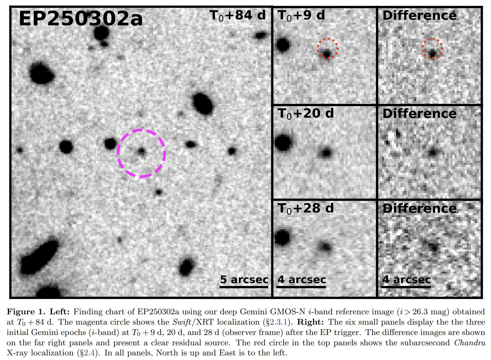

2. [Two-population model of type Ia supernovae and their associations with host galaxies in ZTF DR2](https://arxiv.org/abs/2606.17802)

   > Supernova, Cosmology, Host Galaxy, Bayesian Inference

   针对 [ZTF DR2](https://ztfcosmo.in2p3.fr) 中 $0.01<z<0.06$ 的 809 个正常 Ia 型超新星，联合拟合 SALT2 光变参数、宿主星系恒星质量和静止系 $g-z$ 颜色。层级贝叶斯模型把超新星分为高展宽和低展宽两类，同时把宿主分为蓝色低质量与红色高质量两类；高展宽超新星可出现在两类宿主中，低展宽超新星主要关联红色高质量宿主。

   两个超新星族群在标准化后仍存在明显差异：低展宽族群在 $x_1=0$ 处亮约 $0.14\pm0.03$ mag，展宽修正斜率也更大。蓝色低质量宿主中的高展宽超新星具有接近银河系尘埃的 $R_B\simeq3.9$，红色高质量宿主中的 $R_B\simeq3.1$；传统宿主质量或颜色 step 可以由族群混合与消光差异自然产生，因此在该模型中不再需要额外经验 step 修正。高展宽、蓝色宿主样本的残差散布更小，可能是更稳健的宇宙学距离指示器。

   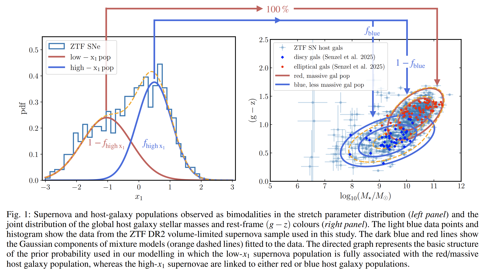

3. [Querying an astronomical database using large language models: the ALeRCE text-to-SQL system](https://arxiv.org/abs/2606.18108)

   > Astronomy, LLM, Database, Tool

   面向 [ALeRCE database](https://science.alerce.online/) 的自然语言到 SQL 查询系统，用 LLM 帮助天文学用户直接检索暂现源数据库。评测集包含 110 对自然语言问题和专家 SQL，覆盖简单、中等和困难查询；流程包含 schema linking、查询难度分类、分步 SQL 生成和执行错误自修正，评估指标比较返回行标识和列标识的部分匹配率。

   13 个商用 LLM 的测试显示，自修正通常能提高或保持性能，尤其能修复表名、列名、语法和类型等执行错误，但超时和语义错误仍是主要限制。Claude Opus 4.6 和 Gemini 2.5 Pro 在分步框架中表现最好，简单查询的行和列匹配率可接近 0.97 和 0.94，中等和困难查询明显下降。结果说明 LLM 已可承担一部分天文数据库查询入口功能，但复杂多表查询仍需要更强的语义校验、检索增强或专门微调。
   
   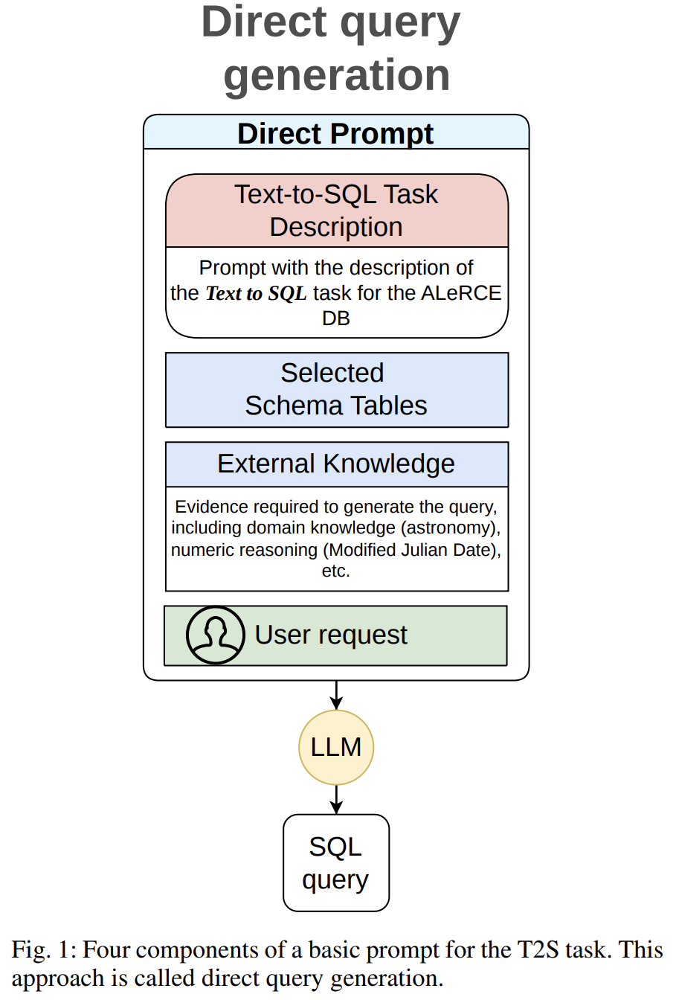

## 2026-06-18

1. [THOR and HAMRR](https://arxiv.org/abs/2606.18330)

   > HST, Roman, Galactic Bulge, Tool

   面向 Roman Galactic Bulge Time Domain Survey 的 HST 先导观测，开发 [THOR/HAMRR](https://github.com/skterry/THOR) 数据处理和查询工具。THOR 处理 GO-17776 中 WFC3 与 ACS 的银心核球成像数据，以 MAST 校准曝光为输入，结合 `hst1pass` 的拥挤场 PSF 测光/天测和 `thor_go` 的拼接、定标流程，生成恒星目录和堆叠参考图像；天测基准使用 Gaia DR3 中 RUWE $<1.3$、AENS $<2$ mas 的高质量源。HAMRR 在 THOR 星表上做 cone search，返回校准测光、天测、图像切片、CMD 和光度函数等产品。

   早期 HLSP 覆盖 8 个核球场、近 80 万个点源；当前中间目录覆盖 332 个 HST 场、约 2200 万个探测源，作为 DR1 之前的 shared risk 数据产品。该工具链把 HST 高分辨率先导观测转成可与 Roman、Rubin/LSST 和 Euclid 核球目标联合分析的拥挤场星表。

   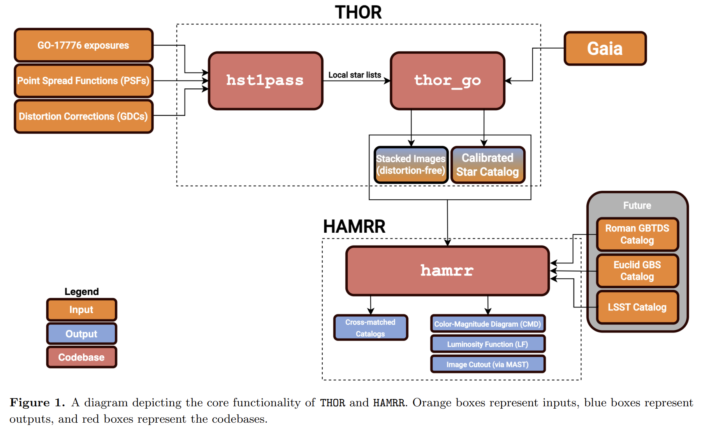

2. [The Via Project: Overview of the Science, Instrument, and Survey](https://arxiv.org/abs/2606.18332)

   > Spectroscopy, Survey, Dark Matter, Time Domain

   [Via](https://via-project.org) 是规划中的全天光谱巡天，目标是在 2027 年开始的五年内观测超过 200 万颗暗星，达到 $G\lesssim21$ 恒星的 $100\,{\rm m\,s^{-1}}$ 径向速度稳定性，并用低分辨率光谱跟进接近 LSST 单次曝光深度的暂现源。项目将在 MMT 和 Magellan/Clay 两台 6.5 m 望远镜上部署相同的 576 光纤多目标光谱仪，视场直径 $1^\circ$；Viaspec 提供 $R\approx15000$、505–595 nm、540 根光纤，用于高精度速度和化学丰度，Boombox 提供 $R\approx1000$、360–1010 nm、36 根光纤，用于暂现源分类和暗弱目标光谱。

   四个核心科学方向分别是用恒星流速度扰动限制 $M\lesssim10^7\,M_\odot$ 的暗物质子晕，巡查银河系卫星星系的动力学和金属丰度，用 Na I 吸收构建银河系晕冷气体三维层析图，以及跟进数千到上万个 LSST 暂现源。配套的数据模拟器、实时诊断和自定义处理管线用于曝光时间估计、二维探测器图像模拟、光谱抽取、波长定标、天光扣除和恒星参数测量，使 Via 成为连接 LSST、Euclid、Roman 和 Gaia 发现样本的双半球光谱参考巡天。

   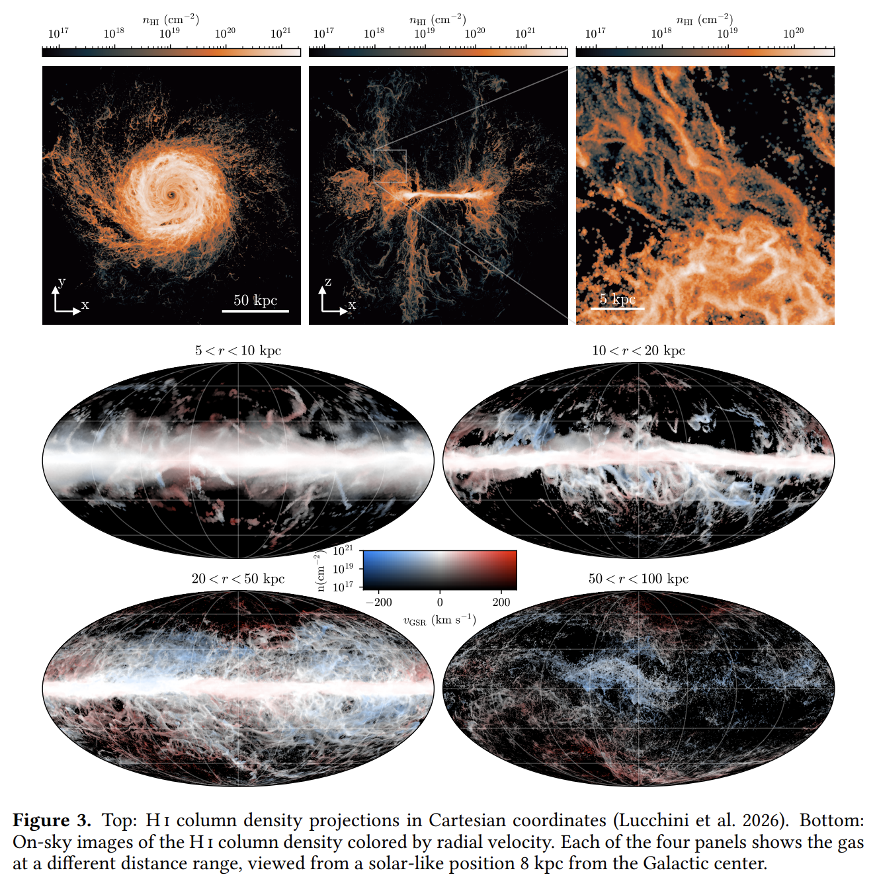

## 2026-06-19

1. [Scintillation of the first-known pulsar planetary system](https://arxiv.org/abs/2606.19406)

   > Pulsar, Scintillation, FAST, Observation

   使用 FAST 研究第一个已知脉冲星行星系统 PSR B1257+12 的星际闪烁和散射屏结构。31 次时长不短于 30 分钟的观测用于构造动态谱和二级谱，其中 14 次长观测不短于 120 分钟；一维自相关分析在 12 个历元给出闪烁时标、闪烁带宽和频率漂移率。3 次观测同时出现 inner、middle、outer 三层闪烁弧，另有 2 次频域自相关出现强周期调制，可能对应传播路径上的 AU 尺度致密结构。

   inner arc 的年周调制支持近似各向同性散射，散射屏距地球 $233\pm28$ pc，横向速度为 $V_{\rm scr,\alpha}=-7.16\pm2.16$ km/s、$V_{\rm scr,\delta}=-41.07\pm5.69$ km/s；middle 和 outer arc 在各向同性假设下对应的屏到脉冲星距离分别为 $354\pm22$ pc 和 $166\pm12$ pc。DM 长期下降主要由离脉冲星更远的等离子体主导，outer arc 的低 DM 变化率和未探测到更近散射屏共同指向一个相对干净的脉冲星近邻环境。

   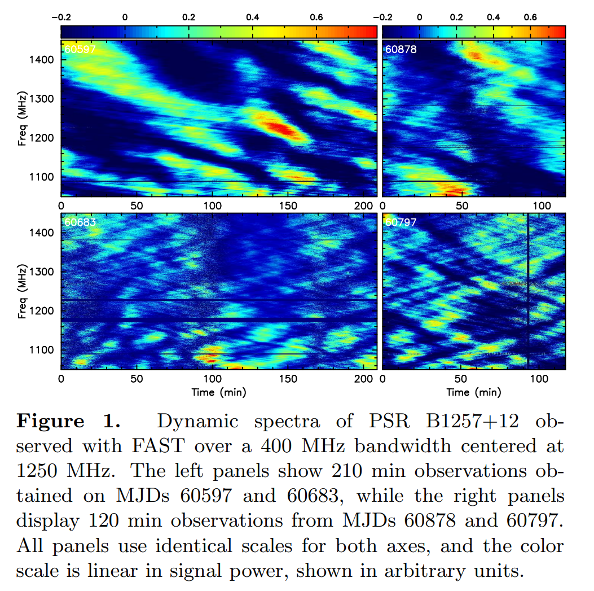

2. [Physics-guided discovery of dynamical dark-energy equations of state through iterative AI reasoning](https://arxiv.org/abs/2606.19427)

   > Cosmology, Dark Energy, LLM, Method

   将暗能量状态方程 $w(z)$ 的构造改写成可审计的迭代 AI 推理流程，代码和提示在 [discovery pipeline](https://iadev.cbpf.br/labia/cosmoai)。Qwen3-30B-A3B 生成可执行的 $w(z)$ 形式和物理动机，检索增强模块从约 7000 篇暗能量文献提供上下文，候选模型被嵌入宇宙学背景并用 SNIa、BAO、CMB 数据优化；独立的 GPT-5.1 mini critic 再从物理动机、新颖性、清晰度、数值稳定性和实现有效性打分，经验缓冲区把高分候选反馈到后续迭代。

   盲测的非标准暗能量 mock 宇宙中，CPL 给出有偏恢复，而少数 AI 候选能重建观测层面的膨胀历史。真实数据验证使用 Pantheon+、Union3、DESY5、DESI DR2 BAO 和 Planck 2018 完整似然，最终保留 AI 1 和 AI 2 两个两参数现象学形式；AI 1 在 DESI DR2 BAO + Pantheon+ + Planck 2018 中相对 $\Lambda$CDM 获得贝叶斯证据偏好，并在 DESI DR2 BAO + Union3 + Planck 2018 中表现最强。两类形式主要把自由度限制在晚期宇宙，对早期宇宙和 CMB 声学峰影响很小，应理解为可检验的现象学参数化，而非微观暗能量理论。

   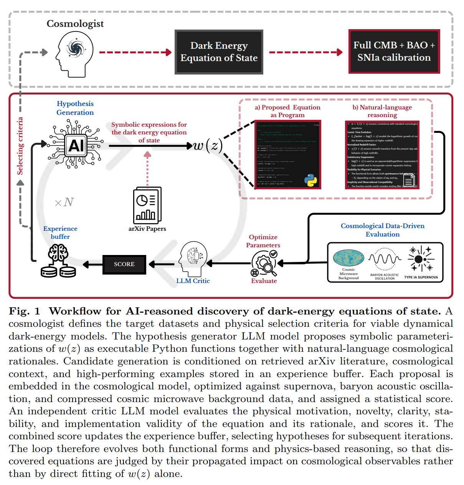

3. [Damping of Fast Radio Bursts in the Inner Magnetospheres of Magnetars](https://arxiv.org/abs/2606.19448)

   > FRB, Magnetar, Plasma, Simulation

   研究 FRB 在磁星内磁层中的传播是否会被非线性等离子体过程耗散。GHz 射电脉冲在强磁化、force free 条件下被视为快磁声波，三维 force free electrodynamics 模拟跟踪定向 FMS 波包与背景 Alfvén 扰动之间的共振三波相互作用，包括 $F\to F+A$ 和 $F\to A+A$，能量被转移到沿闭合磁力线受困的 Alfvén 波中。

   静态偶极磁层中，非线性衰减在约 $10$–$100\,R_{\rm NS}$ 内高效发生，较远处由激发 Alfvén 波的电荷饥饿终止衰减。若 FRB 伴随磁层爆发产生的相对论磁化外流传播，三波相互作用仍可保持高效，明亮爆发的逃逸半径被推到 $\gtrsim10^2$–$10^3\,R_{\rm NS}$。磁星内磁层近场产生的 FRB 因此很难不经明显耗散和重处理直接逃逸。

   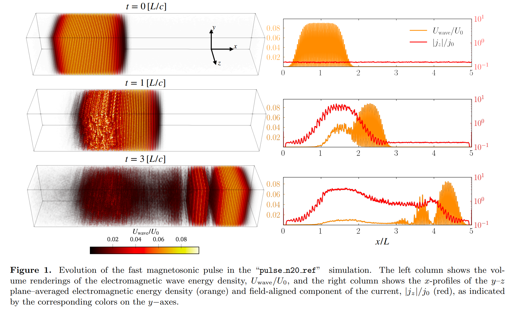

4. [Nonlinear Decay of Fast Magnetosonic Waves through Weak Turbulence: Force-Free Electrodynamics Simulations](https://arxiv.org/abs/2606.19450)

   > FRB, Magnetar, Weak Turbulence, Simulation

   针对强磁化环境中的低频快磁声波，直接用三维高分辨率 force free electrodynamics 模拟检验弱湍流理论。模拟在 $1024^3$ 网格上演化 FMS 与 Alfvén 波谱，不预设主导共振通道，而是同时包含 $F\leftrightarrow F+A$ 和 $F\leftrightarrow A+A$ 等非线性相互作用；重点检验 FMS 波是否会通过参数衰变把能量转入不能自由逃逸的 Alfvén 波连续谱。

   结果支持此前谱方程预期：FMS 波能高效转化为宽频 Alfvén 波谱，且可直接激发大 $k_\perp$ 模式。初始 FMS 谱越窄、波能越高、传播方向相对背景磁场越倾斜，能量转移越快；窄谱示例中 Alfvén 波可在约 30 个波周期内达到与 FMS 近似能量均分。即使 FMS 与 Alfvén 波能量相近，FMS 参数衰变仍是主导过程，说明深磁星磁层产生的 FRB 类信号在逃逸前很可能经历显著能量损失和谱展宽。

   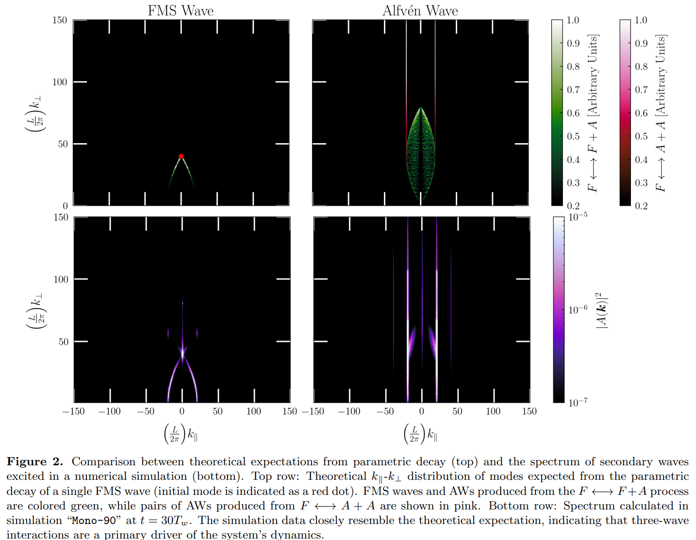

5. [A FAST search for radio pulsations during the dormant state of the AMSPs IGR J00291+5934 and MAXI J1957+032](https://arxiv.org/abs/2606.20086)

   > Pulsar, FAST, AMSP, Observation

   使用 FAST L 波段搜索两个吸积毫秒脉冲星 IGR J00291+5934 和 MAXI J1957+032 在 dormant/quiescent 状态下的相干射电脉冲。IGR J00291+5934 有两次 50 分钟 FAST 观测，MAXI J1957+032 有一次 20 分钟观测；Swift/XRT 和 Las Cumbres Observatory 的同期或近同期数据用于确认低 X 射线和光学态。射电搜索覆盖 1–1.5 GHz、4096 个频率道，并在 $0$–$400\,{\rm pc\,cm^{-3}}$ 的 DM 范围内做 4000 个 trial，结合已知星历折叠、Fourier acceleration/jerk search 和 $T_{\rm asc}$ 网格搜索。

   两个源在已知自转频率和盲搜频率上均无显著候选。假设 10% 脉冲占空比，脉冲平均流量密度上限为 IGR J00291+5934 的 $3.3\,\mu{\rm Jy}$ 和 MAXI J1957+032 的 $5.6\,\mu{\rm Jy}$，是持续 AMSP 中最严格的一组限制。Swift 给出的 X 射线光度上限约为 $\lesssim4$–$6\times10^{32}$ erg/s，LCO 对 IGR J00291+5934 给出 $i^\prime>19.9$–21.6 mag，支持观测时处于低态；残余极暗吸积盘仍可能遮蔽或抑制射电脉冲，高 cadence 监测和 SKA 级灵敏度是后续关键。

6. [The impact of FRB dispersion measure probability distribution functions on cosmographic estimates](https://arxiv.org/abs/2606.20471)

   > Fast Radio Burst, Cosmology, Dispersion Measure

   使用 [Blinkverse](https://blinkverse.alkaidos.cn) 中 106 个精确定位且 $z\leq0.7$ 的 FRB 约束模型无关宇宙学参数 $H_0$、$q_0$ 和 $j_0$。观测 DM 被分解为银河系 ISM、银河系晕、IGM 和宿主星系贡献，宿主项采用 log normal 分布并按 $1+z$ 稀释，银河系晕固定为 $50\,{\rm pc\,cm^{-3}}$；宇宙学展开使用 $y=z/(1+z)$ 并截断到三阶。IGM 的 DM 概率分布分别采用高斯形式和带右偏尾的 quasi Gaussian 形式，同时比较固定与自由 $f_{\rm IGM,0}$、宽先验与高斯先验。

   宇宙学参数对 IGM PDF 和先验选择非常敏感。高斯 IGM 分布在固定 $f_{\rm IGM,0}$ 时给出较强负的 $q_0$ 偏好，在自由 $f_{\rm IGM,0}$ 时约为 $q_0\simeq-1.0$；quasi Gaussian 分布在宽先验下可偏向正的 $q_0$，主要来自宇宙学参数与宿主 DM 贡献的退化，收紧先验后回到接近 $\Lambda$CDM 的 $q_0\simeq-0.525$。当前 FRB 样本对 $j_0$ 仍缺乏稳健约束，FRB 宇宙志要达到高精度需要更好控制 IGM 非均匀性和宿主 DM 模型。
   
   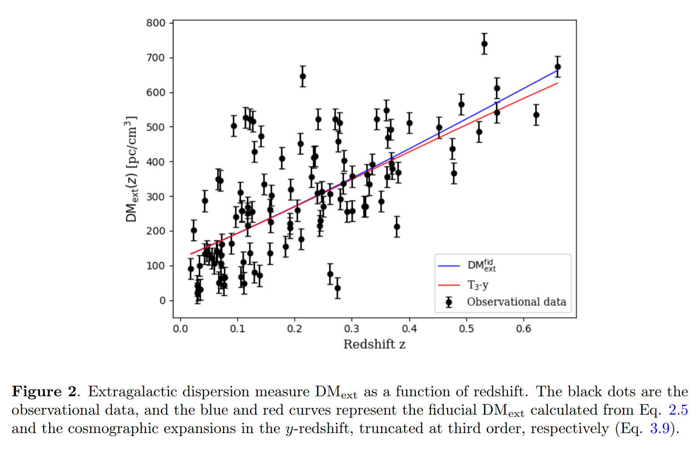

## 2026-06-22

今日停更

## 2026-06-23

1. [Subgrid Modelling for Relativistic Magnetohydrodynamics with Machine Learning](https://arxiv.org/abs/2606.21659)

   > Relativistic MHD, Machine Learning, Simulation

   针对双中子星并合、吸积盘和相对论喷流中无法直接解析的小尺度磁湍流，构建机器学习亚格子模型来补偿低分辨率相对论磁流体模拟的缺失物理。训练数据来自高分辨率 Kelvin Helmholtz 不稳定性模拟：先把高分辨率流体场滤波到低分辨率网格，再用滤波后的原始变量、守恒变量及其导数预测亚格子张量。模型为小型全连接神经网络，并在 GR Athena++ 中做在线低分辨率演化测试。

   在三维特殊相对论 MHD Kelvin Helmholtz 测试中，低分辨率模拟加入神经网络亚格子项后，可以接近 4 倍分辨率模拟的磁场放大和能谱形状，最高给出约 44 倍计算加速。结果也显示，离线相关性高的模型未必在线稳定，必须通过实际演化检验；所有主要亚格子项共同参与时，磁能增长、湍流谱和涡旋发展才更接近高分辨率结果。

   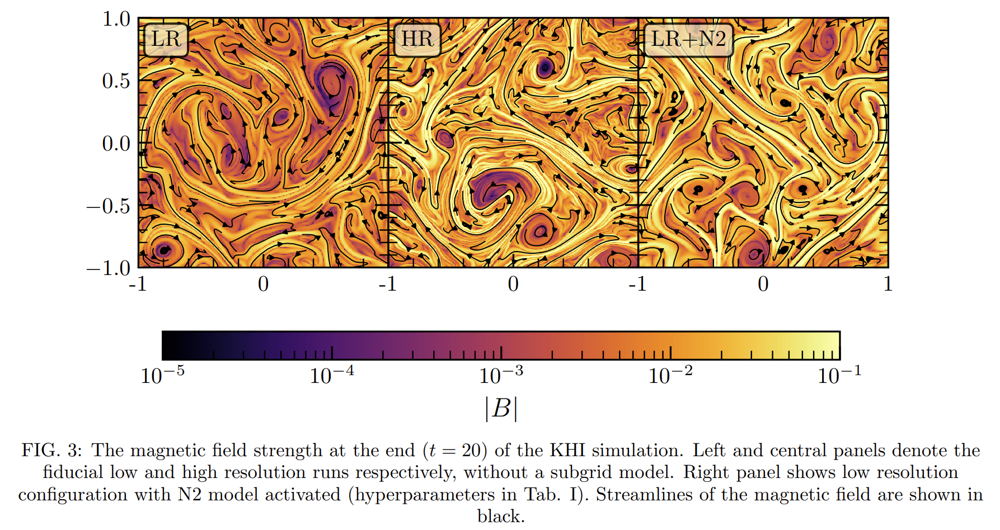

2. [Prediction of Solar Flares Using Photospheric Magnetic Field Parameters with Deep Learning](https://arxiv.org/abs/2606.21896)

   > Solar Flare, Deep Learning, Magnetic Field

   利用太阳光球磁场参数预测未来 24 小时内是否会发生 M 级或 X 级耀斑，并用可解释性方法检查模型依赖的物理量。数据来自 SDO/HMI 的 SHARP 与 Lorentz force 参数、GOES 软 X 射线耀斑目录，时间范围为 2010 年 5 月至 2018 年 5 月；输入为连续 24 小时的磁场参数序列，特征筛选后保留 16 个参数，包括总电流螺度、总无势场能量、总无符号磁通量和 Schrijver R value 等。

   模型采用 patch 化的 transformer 编码结构，用加权交叉熵处理正负样本严重不平衡。测试集上 AUC 约 0.96，召回率约 0.89。SHAP 和 PDP 分析显示，总无符号电流螺度、平均电流螺度和总无势场能量对预测贡献最大，高电流螺度与高非势能区域对应更高的强耀斑概率。

   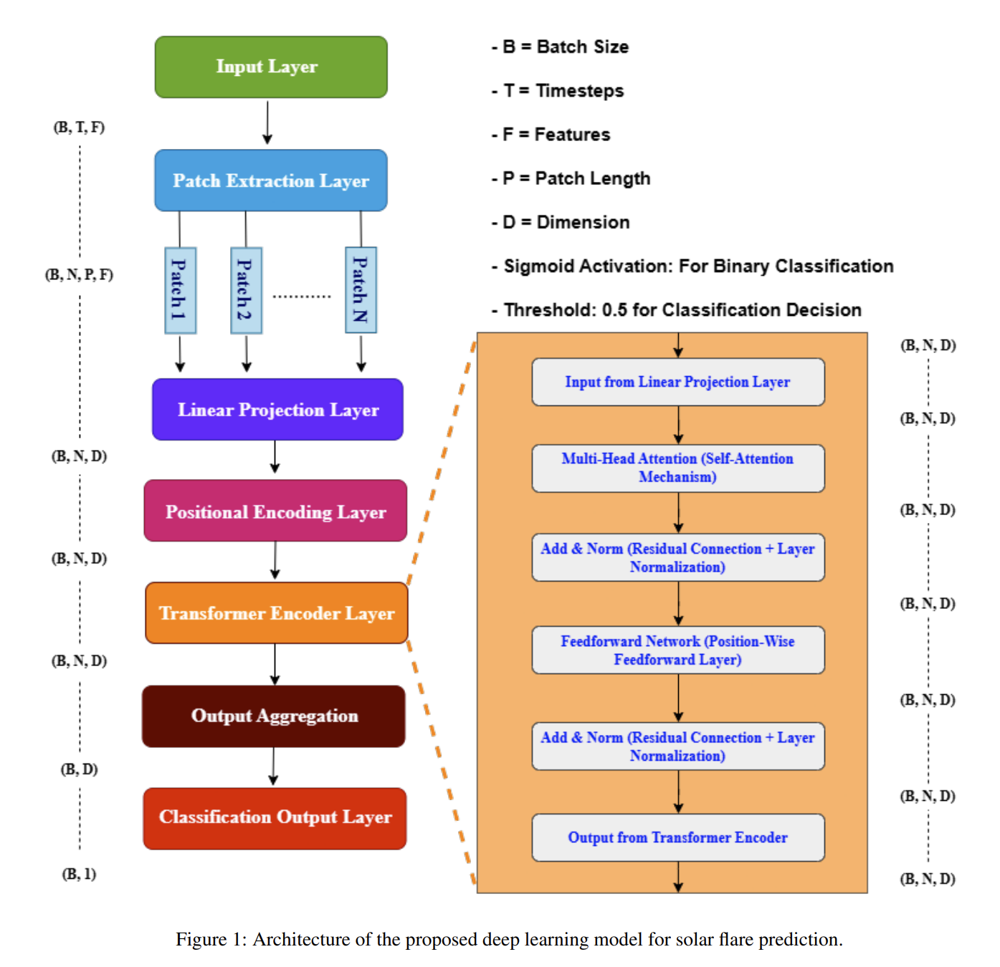

3. [Measuring Magnetic Field Strengths in Galactic Star-forming Regions via the Zeeman Effect with the SKA](https://arxiv.org/abs/2606.22090)

   > Star Formation, Magnetic Field, SKA, Review

   综述利用 Zeeman 效应测量银河系恒星形成区磁场强度的现状，并评估 SKA 在分子云和致密气体磁场测量中的能力。Zeeman 分裂直接给出视线方向磁场 $B_{\rm LOS}$，低频谱线更有利，因为 Doppler 线宽随频率增加，而 Zeeman 频移不随观测频率等比例增大。当前最可靠的热谱线探针包括 OH 1665/1667 MHz 和 HI 21 cm，OH 适合分子云密度气体，HI 吸收和 HINSA 可追踪光解离区、冷中性介质和致密云包层。

   SKA Mid 可把现有 VLA 需要数小时到数十小时的 OH Zeeman 测量缩短到分钟到小时量级，并提升空间分辨率和灵敏度；对 CCS 等更高密度气体示踪线，也有望在强线源中测量百微高斯量级磁场。未来 MeerKAT、ASKAP、FAST 和 SKA 的组合将把 Zeeman 样本从少数目标扩展到数百个区域，并支持从弥散 HI 到致密分子气体的多相磁场结构重建。

   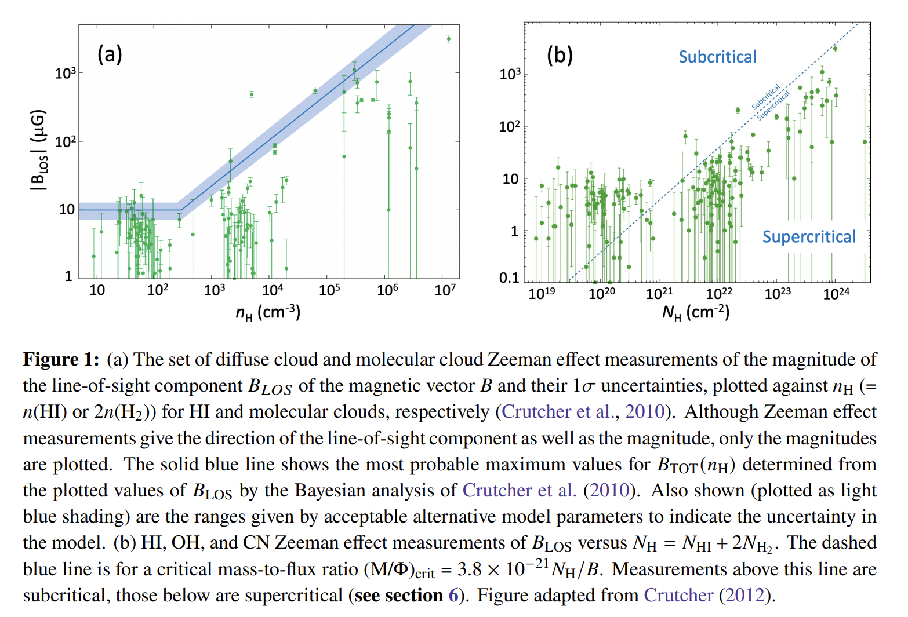

4. [Fast Radio Burst Cosmology: Hubble Tension and Dark Energy](https://arxiv.org/abs/2606.22390)

   > FRB, Cosmology, Dark Energy, Review

   综述快速射电暴在宇宙学中的应用，重点是用色散量与红移关系约束哈勃常数、重子分布和暗能量演化。观测到的 FRB 色散量由银河系星际介质、银河系晕、星系际介质和宿主星系贡献组成，其中 IGM 色散量的平均值与宇宙重子密度、$H_0$ 和膨胀历史相关。已定位 FRB 可直接结合宿主星系红移建立 Macquart 关系，未定位 FRB 可通过统计红移分布或伪红移使用，但系统误差更强。

   现有百量级已定位 FRB 已能给出约百分之几水平的 $H_0$ 约束，但结果仍受 IGM 重子比例、宿主星系色散量和反馈模型影响。暗能量约束需要远大于当前的样本，模拟研究通常要求约 $10^4$ 个高质量已定位 FRB 才能接近 CMB 或 BAO 的精度。强引力透镜 FRB 还提供独立的时间延迟宇宙学路径，未来 CHIME、DSA 2000、HIRAX、CHORD 和 SKA 的大样本定位将是关键。

5. [Tracing Large-scale Structure with the MeerKLASS On-the-Fly Survey: Angular Clustering of Radio Sources at 816 MHz](https://arxiv.org/abs/2606.22432)

   > Radio, Galaxy, Large Scale Structure, Observation

   利用 [MeerKLASS UHF on the fly continuum DR1](https://doi.org/10.48479/h9k3-7294) 的 816 MHz 射电连续谱源表，首次测量该巡天中射电源的角两点相关函数。数据覆盖约 800 平方度 DESI 天区，源表由 PyBDSF 提取；为降低系统误差，聚类样本限制在 $S_{816} \geq 2$ mJy、局部噪声低、单高斯紧致源和边缘裁剪后的 39,483 个源。

   角相关函数用 Landy Szalay 估计量和基于噪声掩膜的随机星表计算，并用 jackknife 估计协方差。结果在 $0.02^\circ$ 到 $10^\circ$ 之间显示正聚类信号；若放宽紧致源限制，小角尺度会受到多成分射电星系拆分的影响。固定斜率 $\gamma=1.8$ 时，$1^\circ$ 处相关幅度约为 $1.4 \times 10^{-3}$；结合不同红移分布先验，得到有效偏置 $b_{\rm eff}\approx1.5-2.0$，主要不确定性来自射电源红移分布。

   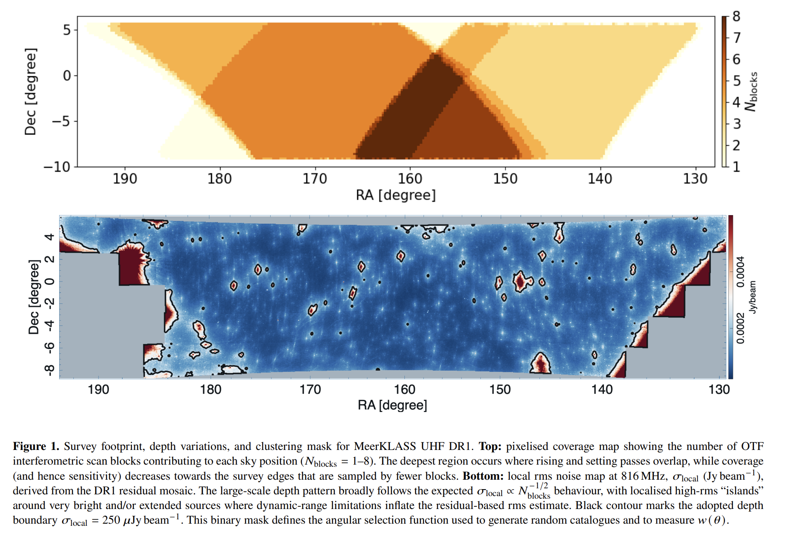

6. [Time-domain anomalies in solar and stellar flares](https://arxiv.org/abs/2606.23482)

   > Solar Flare, Stellar Flare, Deep Learning, Tool

   用无监督深度学习识别太阳和恒星耀斑光变中偏离标准快升慢降形态的时间域异常，并给出统一的异常评分 FLAI。模型 [FLAI](https://github.com/Warwick-Solar/FLAI) 基于 Deep SVDD 和全卷积特征提取器，在 45,000 条合成正常耀斑趋势上训练；训练样本由多个解析耀斑模板生成，并动态加入不同噪声。真实数据包括 2,274 条 Kepler 恒星白光耀斑，以及 Solar Orbiter/STIX 在 4–10 keV 和 15–25 keV 的 M/X 级太阳耀斑光变。

   Kepler 样本中约 30% 被标为强异常，STIX 低能段强异常比例约 15%，高能段约 32%。高能 X 射线耀斑更常出现强异常，符合非热辐射更脉冲化、更结构化的预期；Kepler 白光异常比例更接近 STIX 高能段。异常类型包括多峰耀斑、准周期脉动和仪器伪迹，其中多峰事件通常给出最高 FLAI，说明单一标准模板不足以描述大量复杂耀斑光变。
   
   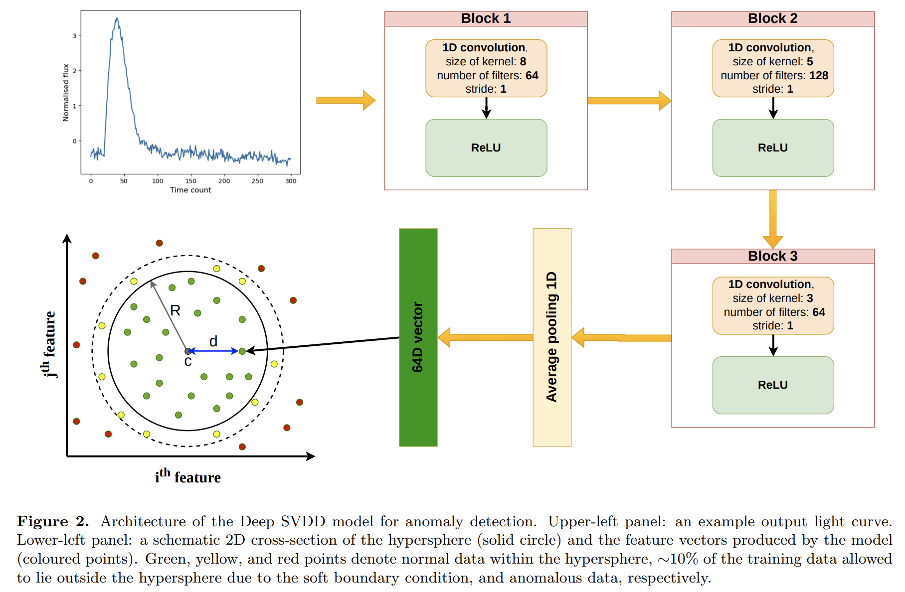

## 2026-06-24

1. [Pioneer 10/11 Telemetry Explanatory Almanac](https://arxiv.org/abs/2606.23755)

   > Spacecraft, Telemetry, Data Release, Tool

   面向 Pioneer anomaly 和星上系统力建模，整理 Pioneer 10/11 工程遥测数据的来源、格式、校准和数据产品。部分数据已由 Goddard Space Flight Center 发布：[Pioneer 10](https://spdf.gsfc.nasa.gov/pub/data/pioneer/pioneer10/radio/Turyshev20170327_Pioneer-10/) 和 [Pioneer 11](https://spdf.gsfc.nasa.gov/pub/data/pioneer/pioneer11/radio/Turyshev20170327_Pioneer-11/)。原始 MDR 遥测来自磁带和 floptical 介质恢复，Pioneer 10 包含 8,976 个 MDR 文件、16.33 GB，Pioneer 11 包含 7,540 个 MDR 文件、23.01 GB。

   数据处理包括 C 语言低层 MDR 读取库、命令行工具、Windows 交互查看器、HTML 查询接口和数据抽取脚本。发布产品覆盖自旋、机动脉冲计数、温度、电源、通信、推进系统和 DSN AGC 信号强度，格式为制表符 ASCII 或 Excel。数据中存在弱信号接收导致的坏记录，但固定字段结构、慢变物理量趋势、冗余读数和手动抽查显示，大多数遥测量可以可靠恢复，用于估计热辐射、推进剂泄漏等星上系统效应。

   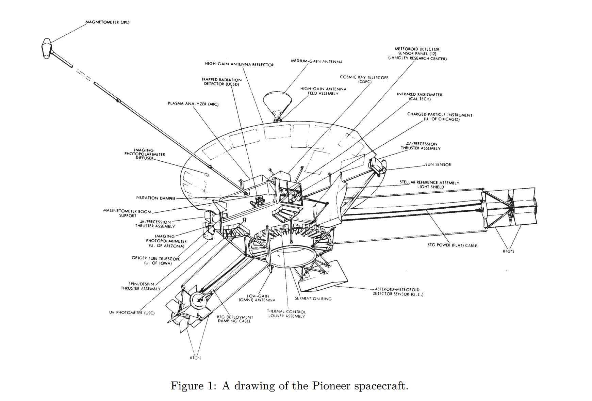

2. [Indication for Decreasing Dispersion Measure in the Population of Repeating Fast Radio Bursts and Connection to Young Supernova Remnant Expansion](https://arxiv.org/abs/2606.23903)

   > Fast Radio Burst, DM, SNR, Observation

   利用 CHIME 重复 FRB 样本检验长期色散量 $DM$ 演化是否存在群体偏向。样本从 63 个 CHIME repeater 中选出 19 个爆发数超过 10 次的源，用加权最小二乘拟合 $DM$ 随时间的变化，并用 Bayesian 分析作为稳健性检查；其中 7 个源满足显著演化标准，构成 golden sample。

   Golden sample 中 5 个源表现为 $DM$ 下降，2 个源表现为 $DM$ 上升；结合文献中已有显著 $DM$ 演化的 repeater 后，下降与上升数量为 9:2，二项检验给出 $p=0.033$。这种下降偏向与年轻超新星遗迹膨胀导致局域电子密度降低的图像一致。SNR 模型用于给出单个 repeater 年龄和 $\rm DM_{SNR}$ 贡献的示例估计，但当前样本仍不足以做完整群体建模。

3. [FAST Pulsar Database IV. Spike subpulses and quasi-periodic subpulses of 25 pulsars observed by FAST](https://arxiv.org/abs/2606.23970)

   > Pulsar, FAST, Observation, Polarization

   使用 [FAST](https://cstr.cn/31116.02.FAST) 高灵敏度 L 波段数据研究单脉冲精细结构，时间分辨率约 $49~\mu{\rm s}$。样本包括 FAST GPPS 和公开 FAST 项目中的 25 个脉冲星；通过去色散后的微分脉冲轮廓自动识别尖峰子脉冲，并用相邻窄脉冲间隔统计识别准周期子脉冲。

   25 个源中，21 个探测到尖峰子脉冲，13 个探测到准周期子脉冲。尖峰通常只有一个或少数相位 bin，未被 FAST 当前时间分辨率完全解析，并且常具有强线偏振，说明它们可能是局域化的基本辐射单元。准周期子脉冲的特征周期集中在约 0.2–0.35 ms，四个脉冲星中探测到超过 20 组准周期结构；这些结构更支持发射区局域等离子体动力学，而非单纯几何调制或传播效应。

   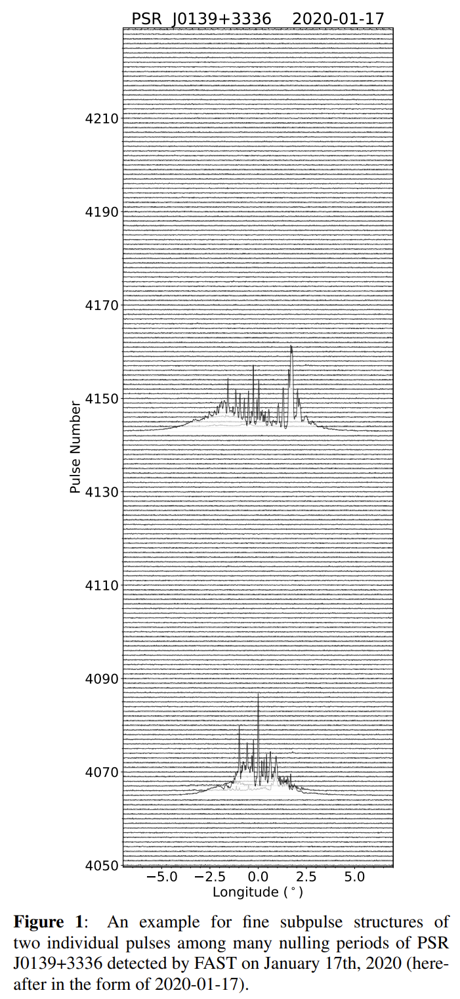

4. [Probing Baryonic Feedback Effect with CSST Weak Lensing and Future FRB Measurements](https://arxiv.org/abs/2606.24061)

   > FRB, Weak Lensing, Cosmology, Baryonic Feedback

   用模拟数据评估 CSST 弱引力透镜与未来 FRB 色散量统计联合约束重子反馈的能力。计算框架基于 baryonic halo model，生成物质功率谱、电子功率谱和物质-电子交叉功率谱；FRB 样本采用 SKA Mid 或 DSA 2000 级别的下一代巡天设定，基准数量为 $N_{\rm FRB}=10^5$。MCMC 同时拟合 7 个宇宙学参数、1 个反馈参数 $\log_{10}T_{\rm AGN}$ 和 16 个系统误差参数。

   CSST 弱透镜单独约束 $\log_{10}T_{\rm AGN}$ 的精度为 3.1%，FRB DM 单独可达 1.3%，联合 $3\times2{\rm pt}$ 分析提升到 0.4%。加入 FRB 后，重子反馈与小尺度结构增长的退化被削弱，中微子总质量上限从弱透镜单独的 $\sum m_\nu<0.53$ eV 改善到 $\sum m_\nu<0.47$ eV，同时也改善 $\Omega_b$、$h$ 和若干系统误差参数的约束。

5. [Improving Radio Source Count Estimation Using Kernel Density Estimation](https://arxiv.org/abs/2606.24117)

   > Radio, Source Count, Method, Tool

   针对射电源计数中传统分箱方法对 bin 宽、bin 中心、边界截断和完备性校正敏感的问题，引入固定带宽 KDE 和自适应 KDE 估计微分源计数。方法在对数流量空间工作，使用反射法处理流量阈值边界效应，并允许对单个源连续赋予完备性权重。相关计算由 AstroKDE Python 包实现，但正文只说明该包将发布到 PyPI，未给出公开仓库链接。

   模拟部分从已知射电光度函数生成 flux limited 样本，每个流量阈值做 200 次实现，对比传统分箱、Bayesian Blocks 和 KDE。KDE，尤其是自适应 KDE，在高流量稀疏区和低流量边界附近更稳定、更接近真实源计数。应用到 LoTSS Deep Fields 后，主 sub mJy drop and bump 特征得到确认，但 Boötes 场中约 10 mJy 的次级小 bump 更可能是原始分箱造成的伪迹。

6. [Bayesian analysis of Gaia epoch astrometry and radial velocities with kima](https://arxiv.org/abs/2606.24132)

   > Gaia, Exoplanet, Bayesian, Tool

   为 [kima](https://github.com/kima-org/kima) 增加 Gaia 历元天体测量和天体测量加视向速度联合拟合能力，文档在 [kima.science](https://www.kima.science/)。新增的 `GAIAmodel` 和 `RVGAIAmodel` 使用 diffusive nested sampling，支持自由数量的 Keplerian 信号、已知天体轨道、天体测量加速度项、扫描角相关信号、多视向速度数据集偏移和 jitter。

   测试覆盖 [Gaia OHP 模拟数据](https://dace.unige.ch/openData/?record=10.82180/dace-gaia-ohp)、真实 Gaia 数据和 Gaia BH3。结果与已有工具或已发表参数一致，并展示了在部分情况下区分真实 Keplerian 轨道与扫描角系统信号的能力。该框架也可从 Gaia 数据生成 compatibility limits，为 Gaia DR4 之后的大量行星、双星和黑洞候选体提供统一的 Bayesian 轨道分析工具。

   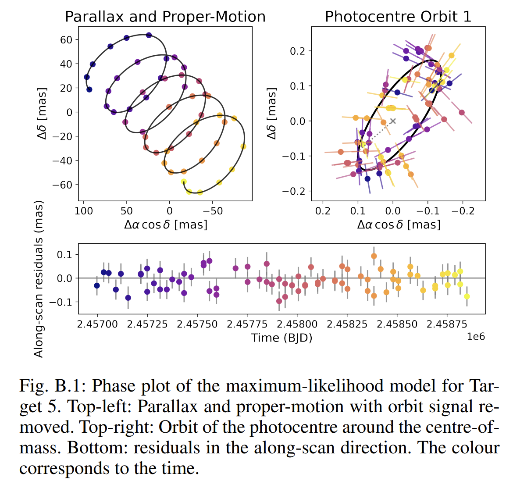

7. [NGC 6134: a comprehensive study through photometric and kinematic analysis using Gaia DR3](https://arxiv.org/abs/2606.24270)

   > Open Cluster, Gaia, Observation, Stellar Dynamics

   利用 Gaia DR3 对疏散星团 NGC 6134 做光度、距离、空间结构和动力学分析。成员星来自先前 HDBSCAN 星团成员研究，距离用带 King profile 先验的 Bayesian 推断估计，基本参数用 ASteCA 拟合 Gaia CMD，质量分层用 Minimum Spanning Tree，二维和三维子结构用 Bayesian Gaussian Mixture Model 分解。

   Bayesian 个体距离给出星团距离 $1070.83\pm2.50$ pc；ASteCA 得到 $\mathrm{[Fe/H]}=0.08\pm0.06$、$\log(t)=9.14\pm0.01$、$d=1064.43\pm15.19$ pc、$A_V=1.03\pm0.05$ mag。空间结构可分为核心、潮汐尾和弥散 halo，质量分层更符合长期两体弛豫和低质量星优先损失导致的动力学起源。CMD 中的主序 gap 与较高双星比例相关，$f_{\rm bin}\approx0.42$，并识别出可能的蓝离散星。

   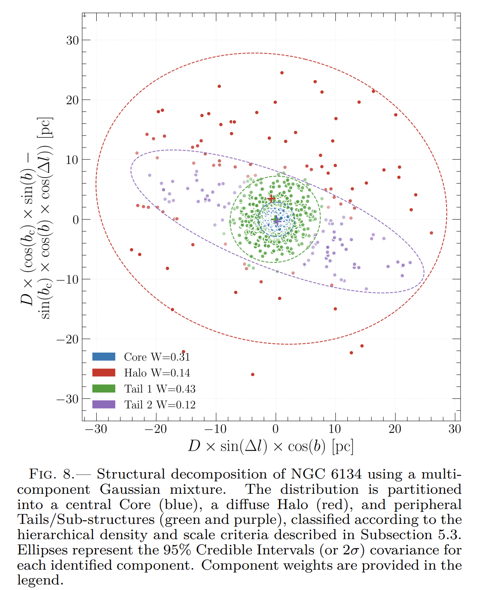

8. [Overview: Extragalactic Continuum Science with the SKAO](https://arxiv.org/abs/2606.24843)

   > Radio, Galaxy, AGN, SKA, Review

   总结 SKAO 河外连续谱科学工作组在 AASKAII 中的主要科学目标。射电连续谱由同步辐射和自由自由辐射主导，可无尘埃遮挡地追踪恒星形成、AGN 活动、反馈、磁场和宇宙线。SKA Low 与 SKA Mid 的灵敏度、角分辨率、频率覆盖和巡天速度将把宽天区连续谱巡天与深场、多波段、多波长宿主识别结合起来。

   主要科学方向包括宇宙恒星形成历史、AGN 触发与 duty cycle、radio quiet AGN 辐射起源、黑洞与宿主星系协同演化、星系团和 cosmic web 中弥散同步辐射、近邻星系的热与非热过程、强引力透镜以及高红移 ISM/IGM。实现这些目标需要可靠的源提取、形态分类、跨波段匹配，并结合统计方法、机器学习和人工检查处理大规模连续谱源表。

   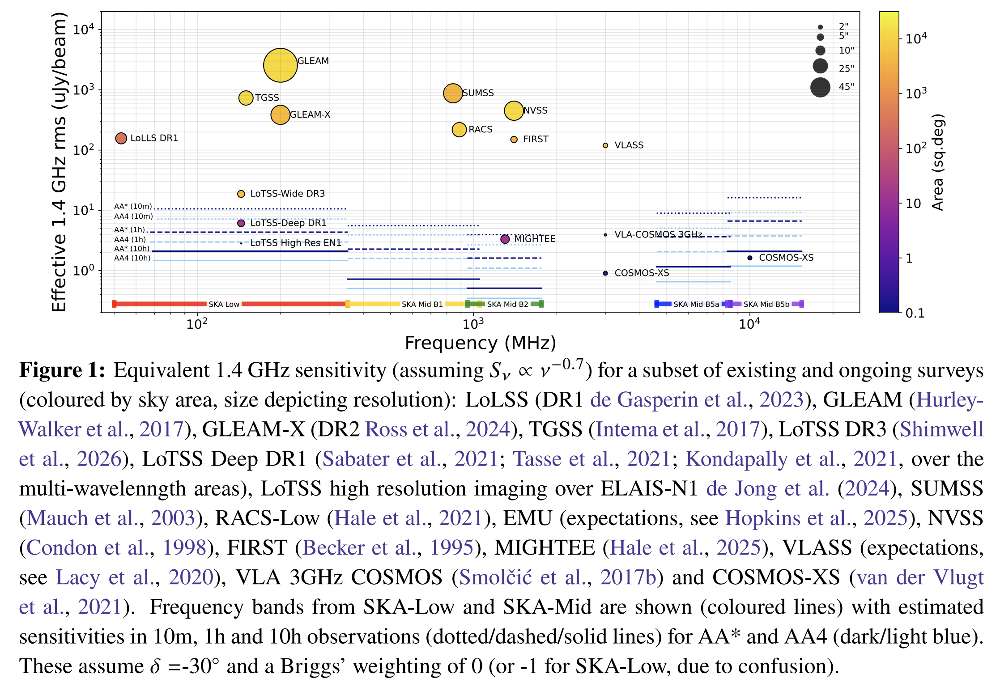

9. [The Topology of the Universe](https://arxiv.org/abs/2606.24886)

   > Cosmology, CMB, Topology, Review

   综述宇宙拓扑作为全局空间性质的可观测性问题。非平凡拓扑会产生不可收缩闭合路径和重复像，在 CMB 与三维物质分布中留下破坏统计各向同性、甚至破坏均匀性的相关结构。主要观测方法包括 CMB matched circle 搜索，以及基于拓扑依赖协方差矩阵的 Bayesian likelihood 分析；相关 COMPACT 协作代码在 [GitHub](https://github.com/CompactCollaboration) 公开。

   WMAP 和 Planck 未给出非平凡拓扑的确定证据，但现有限制只覆盖部分拓扑、参数范围和观测者位置。matched circle 搜索给出近邻镜像距离 $d_{\rm NC}>0.985d_{\rm LSS}$，Planck likelihood 分析在研究过的拓扑中可推进到约 $d_{\rm NC}\gtrsim1.03d_{\rm LSS}$，完整 Planck 分析预计约 $1.05d_{\rm LSS}$。LiteBIRD 和 Taurus 的低多极化数据可能把 Euclidean 等拓扑的搜索范围扩展到约 $1.2d_{\rm LSS}$；未来三维星系巡天和线强度映射含有更多拓扑相关模式，但可提取的信息量仍未确定。
   
   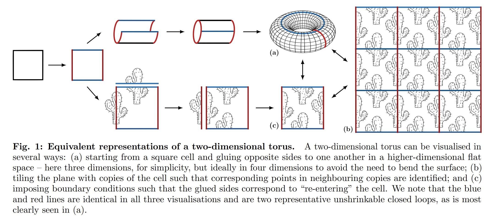

## 2026-06-25

1. [The kinetic-energy bottleneck in Fast Radio Burst models](https://arxiv.org/abs/2606.25035)

    > Fast Radio Burst, Theory, Magnetar

    FRB 相干辐射模型受到一个近乎模型无关的动能瓶颈限制：观测到的亮温和毫秒时标要求辐射区持续获得高动能流，否则粒子冷却时间会短于爆发持续时间，甚至短于电磁波周期。分析从动能光度、亮温和冷却时间出发，比较近磁层模型、冲击 maser、光柱附近重联和外部冲击等方案。

    近中子星表面的磁层模型若有持续粒子加速，仍是较有希望的方向；磁星级磁场可在约 $R \lesssim 10^{10}\,\mathrm{cm}$ 内支持所需平行电场。怪物冲击模型需要远超 Goldreich Julian 密度的粒子数，maser 峰值容易移到 GHz 以上；外部冲击 maser 满足部分能量条件，但上游风的诱导康普顿散射会阻碍 GHz 辐射逃逸。主要贡献是把不同 FRB 模型放到统一的能量和冷却约束下，指出持续原位加速是高亮度 FRB 模型的关键要求。

2. [The Nearest Galactic Nucleus: Studying the Galactic Centre with SKA-Mid](https://arxiv.org/abs/2606.25051)

    > Galactic Centre, SKA, Radio, Observation

    银心是最近的星系核，也是检验极端恒星形成、致密天体、磁场和反馈过程的最佳实验场。SKA-Mid 的亚角秒分辨率、高灵敏度和南半球可见性可覆盖约 $2.0^\circ \times 0.4^\circ$ 的中央分子区，并对 Sgr A* 周围核星团做多年重复深观测。

    观测方案围绕连续谱、谱线、偏振和时域监测展开，目标包括低质量 X 射线双星、脉冲星和毫秒脉冲星、HII 区和 maser、以厘米连续谱为背景的前生命分子吸收、非热丝状体、RM synthesis 磁场结构和银心外流。SKA-Mid 有望缓解银心 missing pulsar problem，重建中央分子区磁场和非热压力，并把银河系核区作为其他星系核物理的近距离模板。

    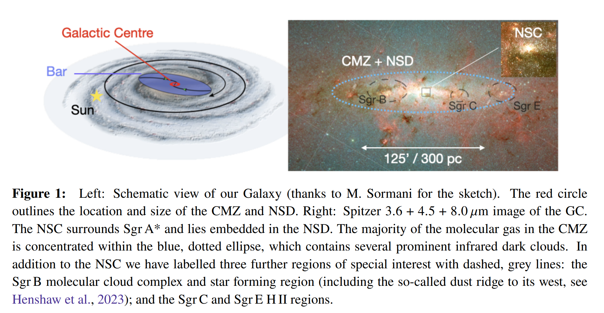

3. [Fast Radio Bursts probe Galaxy Evolution: Evidence and implications of a redshift-dependent FRB host DM](https://arxiv.org/abs/2606.25214)

    > Fast Radio Burst, DM, Galaxy Evolution, Observation

    FRB 宿主星系和星系晕中的电离气体会贡献宿主色散量，可用 $DM_{\rm host}(z) \propto (1+z)^{n_z}$ 描述其红移演化。基于 90 个定位 FRB、其中 69 个有确认宿主红移的样本，结合 DSA 和 ASKAP/CRAFT ICS 选择效应做前向建模，约束宿主 DM 是否随星系演化而变化。

    联合结果给出 $n_z = 1.62^{+1.48}_{-1.57}$，在约 $1\sigma$ 水平排除无演化情形；DSA 和 CRAFT 子样本也独立偏向 $n_z > 0$。若忽略宿主 DM 演化，基于 DM 的 FRB 红移估计会系统偏高，在 $DM_{\rm EG}\sim1000$–$2000\,\mathrm{pc\,cm^{-3}}$ 时可达到 $\Delta z \sim 0.3$。高红移 FRB 对该问题最敏感，未来 MeerTRAP、DSA-2000、CHORD 和大规模宿主光谱红移样本可把宿主气体演化变成 FRB 宇宙学中的可测量项，而不是系统误差。

    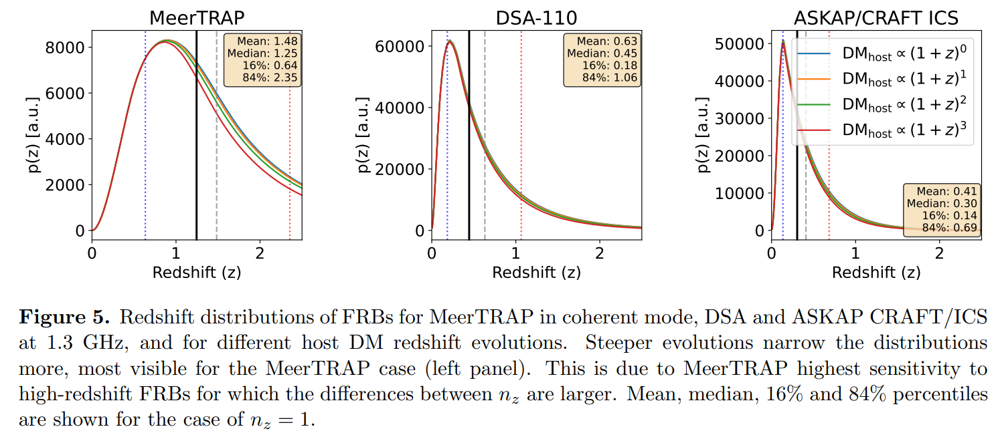

4. [Supernovae with the Square Kilometre Array](https://arxiv.org/abs/2606.25223)

    > Supernova, SKA, Radio, Review

    超新星射电辐射来自抛射物与星周介质相互作用产生的同步辐射，能直接追踪前身星质量损失、冲击微物理和星周物质密度结构。SKA 的高灵敏度、多频和宽场能力可把射电超新星研究从少数目标跟踪推进到统计样本研究，尤其适合发现被尘埃遮蔽的核心坍缩超新星。

    核心坍缩超新星可通过早期和晚期射电光变约束 IIb/Ib/Ic/IIP/IIn 等不同类型的星周环境、壳层结构、非热粒子和可能的紧致残骸；Ia 型超新星深射电非探测可排除大部分富氢单简并通道，探测则能直接给出前身星周介质密度；超亮超新星的晚期射电信号可区分 magnetar、强 CSM 相互作用和离轴喷流等供能机制。SKA 与 ALMA、ngVLA、ULTRASAT、CTA、IceCube-Gen2 的联动将显著扩展超新星多信使研究空间。

    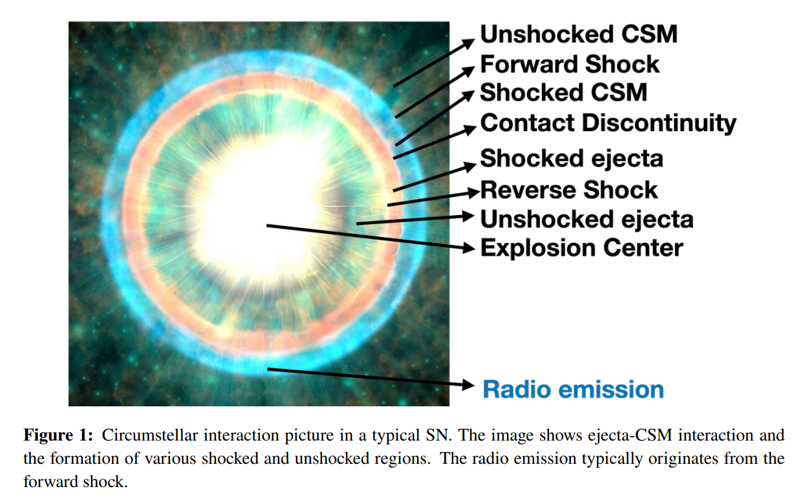

5. [M-EPDet: Real-Time Real-Bogus Classification and Transient Candidate Judgement for the EP-WXT Pipeline via Multi-Modal Data](https://arxiv.org/abs/2606.25352)

    > X ray, Transient, Deep Learning, Tool

    Einstein Probe WXT 的候选体流同时包含真实 X 射线源、lobster-eye 光学结构产生的 Arm 伪迹和宇宙线事件，[M-EPDet](https://github.com/chenlang-china-vo/M-EPDet) 用三级实时流程做 real-bogus 筛选。数据来自 2024 年 7 月至 2025 年 7 月的运行日志，包含 211,959 条已标注候选观测记录。

    第一级用 ResNet-18 处理空间 cutout，识别 Arm 伪迹，准确率 95.54%；第二级用光变曲线 Transformer 加 PI 能谱 MLP 的双分支结构区分源和宇宙线，准确率 98.98%；第三级用考虑背景的 Bayesian Blocks 在稀疏事件中筛选变源，把 282,099 条过滤后观测压缩到 2,117 条候选。级联系统真实源召回率约 98.31%，CPU Docker 部署后单候选约 30 ms，可直接接入 EP-WXT 实时流水线。

    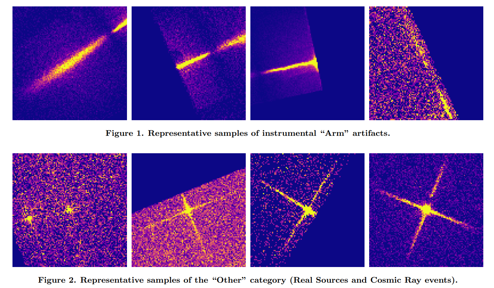

6. [Solar Radio Burst Fine Structures](https://arxiv.org/abs/2606.25469)

    > Solar, Radio, Flare, Review

    太阳射电爆发中的精细结构包括 spikes、drift pairs、Type III striae、Type II herringbones 和分裂带等，通常具有窄频带、亚秒时标和复杂偏振行为，反映电子加速、磁重联、冲击、密度湍流和传播散射。过去的观测受限于成像、频谱和时间分辨率，许多结构只能在动态谱中识别，缺少可靠空间定位。

    SKA-Low 和 SKA-Mid 的宽频段全 Stokes 成像光谱可在亚秒尺度同时测量源位置、大小、漂移、偏振和散射效应。Type III striae 可用于约束日冕密度湍流，Type II herringbones 可定位冲击加速电子束，分米波 spikes 可检验小尺度重联和电子回旋 maser 等机制。核心贡献是梳理 SKA 如何把太阳射电精细结构从动态谱分类推进到物理成因诊断。

    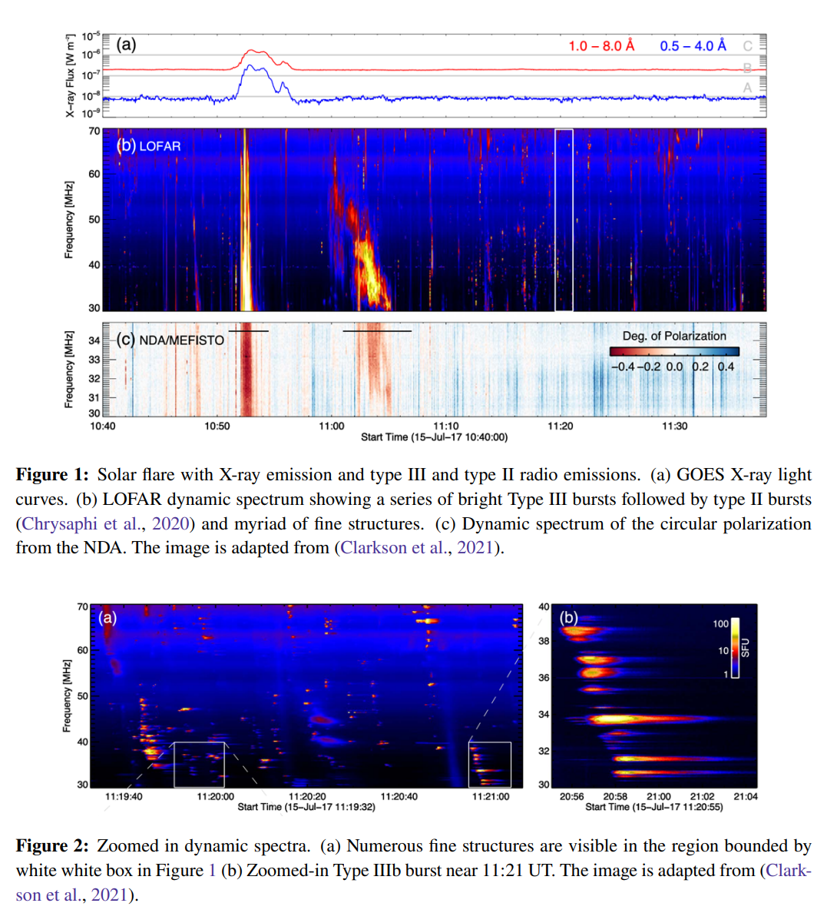

7. [The Galaxy's Guide to the Tokenizer: A Benchmark for Scientific Foundation Models](https://arxiv.org/abs/2606.25610)

    > Astronomy, Foundation Model, Deep Learning, Benchmark

    科学基础模型中的 tokenizer 决定图像信息如何进入 Transformer，[astroPT](https://github.com/Smith42/astroPT) 框架比较 Affine、AIM、JetFormer 和 VQ-VAE 四种星系图像 tokenizer。训练数据为 DESI Legacy Survey DR8 的 640,000 张星系图像，另用 167,000 个星系评估物理属性表征，用 5,000 张测试图像评估重建质量。

    JetFormer 的可逆连续 token 最适合图像重建，能保留低表面亮度结构和细节；VQ-VAE 的离散 codebook 更有利于线性或 MLP probe 读取红移、恒星质量、颜色、形态等物理量，但牺牲像素级细节。Affine 和 AIM 对局部形态较稳健，AIM 的 MLP head 在强 Transformer backbone 下收益有限。重建质量和科学表征质量并不等价，物理属性推断更适合 VQ-VAE，生成和重建更适合 JetFormer，算力受限时 Affine 是较稳的基线。

    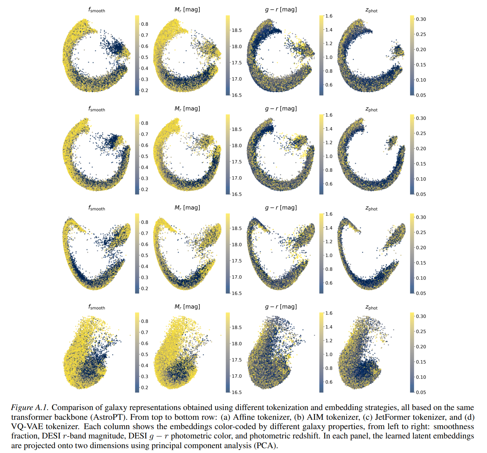

8. [A Non-Negativity Iterative Approach to Image Deconvolution for SKA](https://arxiv.org/abs/2606.25631)

    > Radio, SKA, Method, Imaging

    SKA 和 VLBI 成像常受稀疏 uv 覆盖影响，传统反卷积容易在点源和弥散结构周围产生环状伪迹。Non-Negative Optimal-Fidelity Deconvolution 在傅里叶域迭代，只保留 PSF 中信噪比较高的采样模，屏蔽会放大噪声的低幅或稀疏模，并在每次迭代后强制图像通量非负，从而同时抑制非物理波动和补全缺失 Fourier 信息。

    方法不需要训练集或源模型先验，计算量随像素数近似线性，$512\times512$ 图像在普通笔记本上约 1–2 秒完成。点源、扩展星系和 SKA-Low 式稀疏 uv 覆盖模拟显示，该方法比 CLEAN 更好恢复弥散结构和尖锐特征，并降低不完整覆盖导致的伪迹。当前验证主要是无噪声实验，后续需要在真实噪声和 RFI 条件下测试稳健性。

    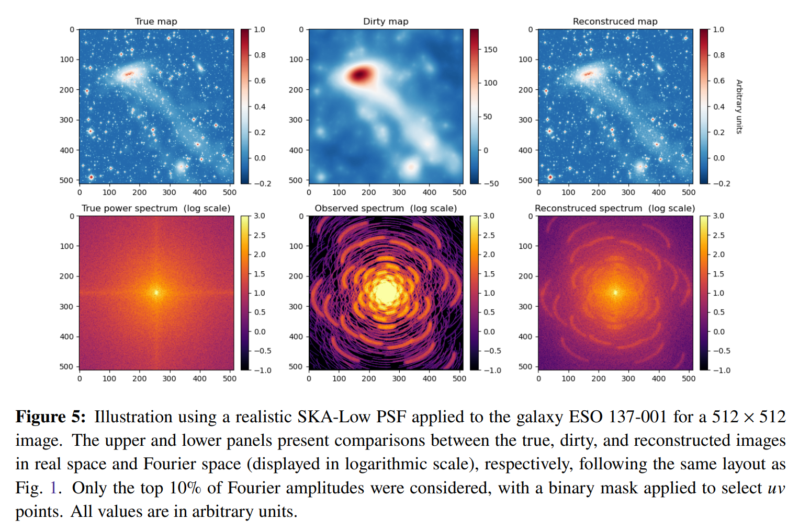

9. [Unveiling the Trans-Neptunian Region with the SKA](https://arxiv.org/abs/2606.25686)

    > Solar System, TNO, SKA, Observation

    海王星外天体和 Centaur 的厘米波热辐射可探测表层以下热性质、谱发射率、环、双星和表面非均匀性，是 Spitzer、Herschel、ALMA、JWST 和掩星观测的互补信息。基于 NEATM 框架和标准热模型，选取 23 个最亮 TNO/Centaur，使用已有尺寸、反照率和 $\epsilon=0.7$ 的发射率估计 SKA-AA4 在 2.3、2.8、4.6 cm 的探测能力。

    5 小时积分和 $5\sigma$ 阈值下，2.3 cm 可探测约 14/23 个目标，2.8 cm 约 12/23 个，4.6 cm 主要只有 Pluto 和 Haumea。SKA 在 4.6–2.3 cm 的角分辨率约 50–20 mas，可能部分分辨 Haumea 环系统；15 GHz 掩星观测中，50 au 处直径约 300 km 的 TNO 可在 0.1 s 积分下以高信噪比探测。LSST 将扩大 TNO 目标库，但厘米热辐射仍主要适合最亮天体，掩星则会成为更广泛的 SKA 应用方向。

10. [Euclid Quick Data Release (Q2) -- The Euclid Galactic Bulge Survey](https://arxiv.org/abs/2606.25883)

    > Euclid, Galactic Bulge, Data Release, Microlensing

    Euclid Q2 发布的是 Galactic Bulge Survey，面向内银河核球提供深度、高分辨率、宽场 VIS 数据，用于微引力透镜、恒星族群、运动学和 Roman Galactic Bulge Time Domain Survey 前期准备。数据覆盖 9 个连续视场、约 4.8 平方度，观测于 2025 年 3 月 23–24 日，每个视场 16 次 400 s dither，总曝光约 1.8 h，并包含两个 PSF 标定场；数据入口为 [Euclid Q2 Data Release](https://www.cosmos.esa.int/web/euclid/q2-data-release)。

    处理使用 VIS-PF 流水线，并针对极端拥挤星场修改天体测量和宇宙线识别流程。发布内容包括定标图像、PSF 模型和光度星表；相对 Gaia DR3 的天体测量残差约为 RA 5.5 mas、Dec 4.4 mas，光度零点约 1.5%，每个 dither 可探测约 4500 万个源至 AB mag 26。由于拥挤和变消光，星表不完全且空间均匀性有限，更适合标定和初步科学使用；图像产品则支持后续更深、更均匀的重处理。

    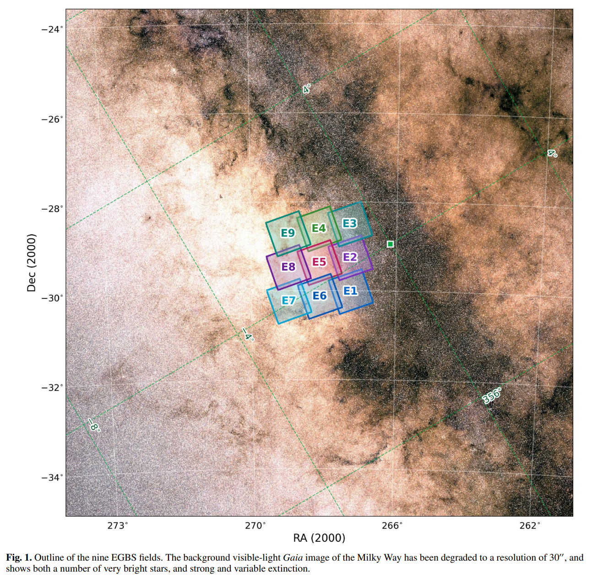

11. [Cosmology with Tully-Fisher HI Galaxy Surveys](https://arxiv.org/abs/2606.26001)

     > HI, Tully Fisher, Cosmology, SKA, Peculiar Velocity

     Tully-Fisher 关系把旋转速度与光度或重子质量联系起来，HI 21 cm 观测可同时给出系统红移、积分通量、线宽和旋转速度，是构建星系距离和本动速度样本的直接路径。SKA-Mid 的空间分辨和谱线灵敏度可把当前 $z<0.1$ 左右、样本量约 $10^4$–$10^5$ 的本动速度宇宙学推进到更深红移和更大体积。

     预测采用 GAEA 半解析星系模型和模拟 HI 线型，结合 SKAO 灵敏度计算器建立选择函数；中深 Band 2 巡天设定为 5000 平方度、总积分约 10000 小时、每 pointing 约 0.95 小时，并要求 HI 线宽探测达到 $\mathrm{SNR}=5$ 且至少覆盖 8 个谱道。到 $z<0.4$，SKA-Mid AA* 约可得到 129.5 万个 TF/BTF 样本，AA4 约 201 万个，远大于 WALLABY、DESI 和 4HS 的同类本动速度样本。

     这些样本可用于 $H_0$、速度功率谱、动量功率谱、增长率 $f\sigma_8$、大尺度 bulk flow、三维速度场重建，以及与 LSST、Euclid、Roman、4HS、CMB lensing、ISW 和 kSZ 的交叉相关。主要限制将从统计误差转向系统误差，尤其是 TF 零点校准、倾角估计、选择函数、RFI 和高红移处边缘分辨线型；若这些系统误差可控，SKA 的 HI Tully-Fisher 巡天将成为低到中红移本动速度宇宙学的核心数据集。

## 2026-06-26

1. [The 10-15 GHz radio continuum survey of the Galactic Plane with SKAO](https://arxiv.org/abs/2606.26278)

    > Galactic Plane, SKA, Radio, Star Formation, Survey

    10–15 GHz SKA-Mid 银河面连续谱巡天面向电离气体和恒星反馈的全银河系普查，填补低频射电巡天与远红外、毫米波数据之间的空白。Band 5b 观测在 AA4 配置下用约 600 小时覆盖 630 平方度，包括银心方向 $-180^\circ < \ell < 30^\circ$、$|b|\leq1.5^\circ$，目标是在 20 kpc 距离上分辨小于 0.05 pc 的结构。

    巡天将同时探测 hypercompact 和 ultracompact HII 区、热射电喷流、行星状星云、超新星遗迹、演化大质量星及其星周结构。高频自由自由辐射主导、较低 Faraday depolarization 和亚角秒分辨率可直接约束电子密度、电离结构、质量损失、局部反馈和非热成分；与 ALMA、MeerKAT、JWST 和红外巡天结合后，可把大质量恒星反馈从单个区域研究扩展到银河系尺度的统计样本。

    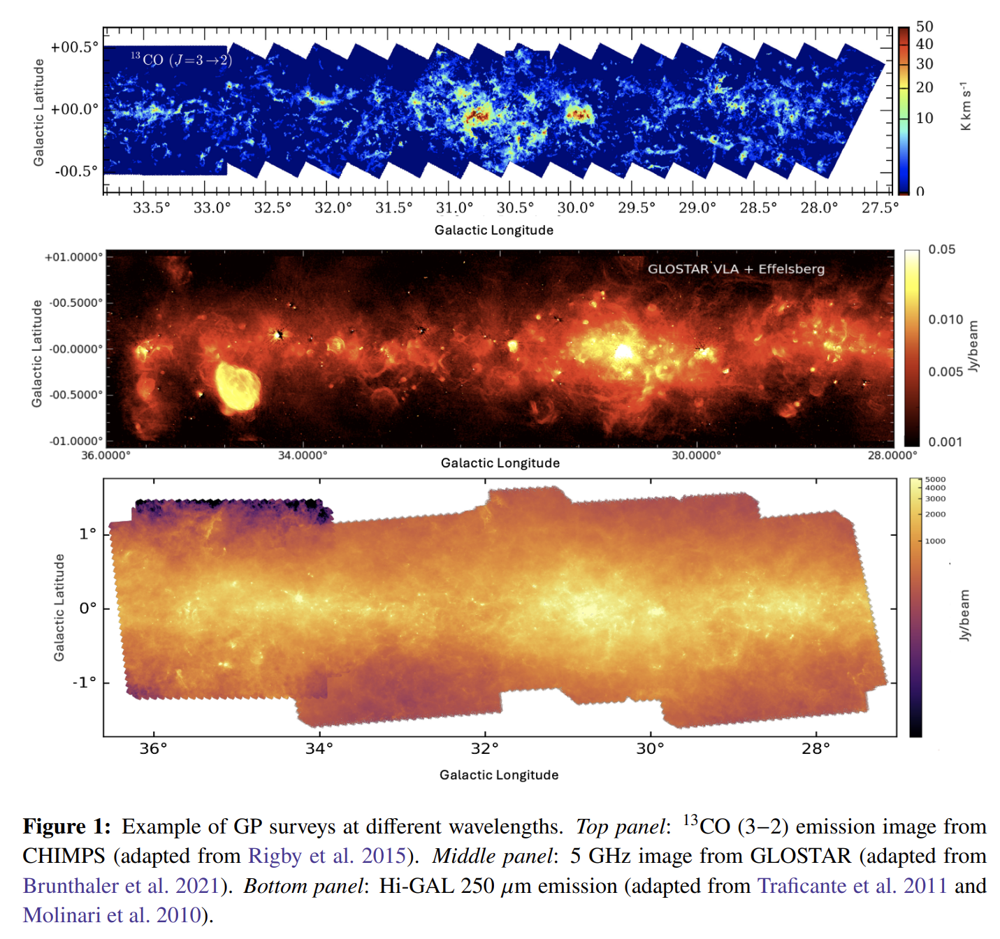

2. [Debiasing the Observed Fast Radio Burst Population with the CHIME/FRB Selection Function](https://arxiv.org/abs/2606.26334)

    > Fast Radio Burst, CHIME, Selection Function, Method

    CHIME/FRB Catalog 2 的数千个 FRB 需要去除搜索管线选择效应后才能推断本征 fluence、DM、脉宽和散射时间分布。分析使用 587,367 个合成 FRB 注入到 CHIME/FRB 实时搜索管线的结果，先用重采样框架修正边缘分布，再训练四维 logistic regression selection function，把探测概率写成 fluence、DM、intrinsic width 和 scattering timescale 的函数，并加入高阶交互项和 KNN 掩膜限制有效参数空间。

    选择函数显示探测边界强烈依赖散射和脉宽：高散射或宽脉冲需要更高 fluence 才能被探测。修正后，Catalog 2 对 600 MHz 参考频率下约 30 ms 以内的散射时间仍有约束力；高散射端不支持强烈上升的本征分布，更接近对数空间平坦或轻微下降，但仍不能排除较弱结构。主要贡献是给出可前向模拟的 CHIME/FRB intensity selection model，为后续 baseband、Outrigger 定位样本和跨巡天 FRB population inference 提供去偏框架。

    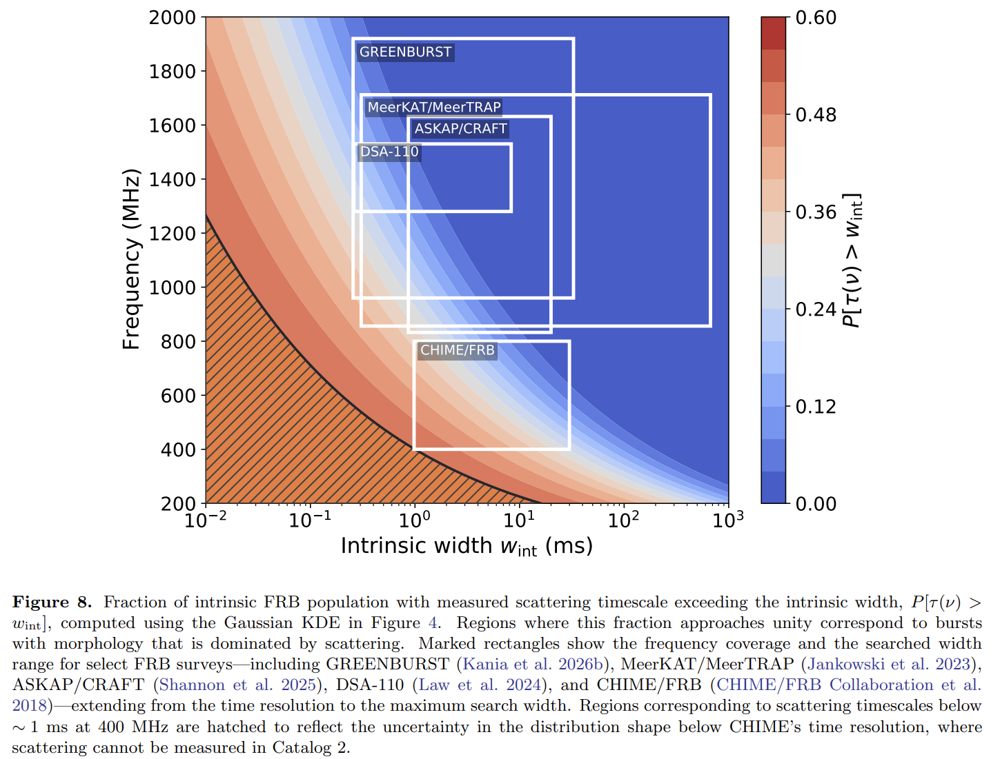

3. [Long-Period Transients as a new frontier in time-domain astronomy](https://arxiv.org/abs/2606.26572)

    > Long Period Transient, Radio, Compact Object, Review

    Long Period Transients 是介于经典脉冲星和慢变射电源之间的新类群，周期从数分钟到数小时，发出强偏振、相干、宽带射电脉冲，单个脉冲可含毫秒到分钟尺度子结构。它们的射电光度通常超过自转能损可供给的范围，指向磁场衰减、磁层重联、吸积或双星相互作用等额外能量来源；已知样本包含超长周期磁星候选体、磁白矮星双星候选体和若干尚未分类系统，[LPT catalogue](https://lpt.mwa-image-plane.cloud.edu.au/published/tables/1) 汇总了当前样本。

    主要观测瓶颈来自高消光、强间歇性、长周期和高时间分辨率数据量。现有发现大多依赖 ASKAP、MWA、LOFAR、MeerKAT 等设施的快速成像或可见度域搜索，而 SKAO 需要成熟的 commensal fast imaging pipeline，与 pulsar backend 或 baseband 触发联动，以获得动态谱、偏振和 DM 信息。未来高 cadence 巡天、实时分类和多波段触发随访将把 LPT 从偶然发现推进到统计族群研究，用于区分孤立中子星尾端、磁星和白矮星双星等起源。

    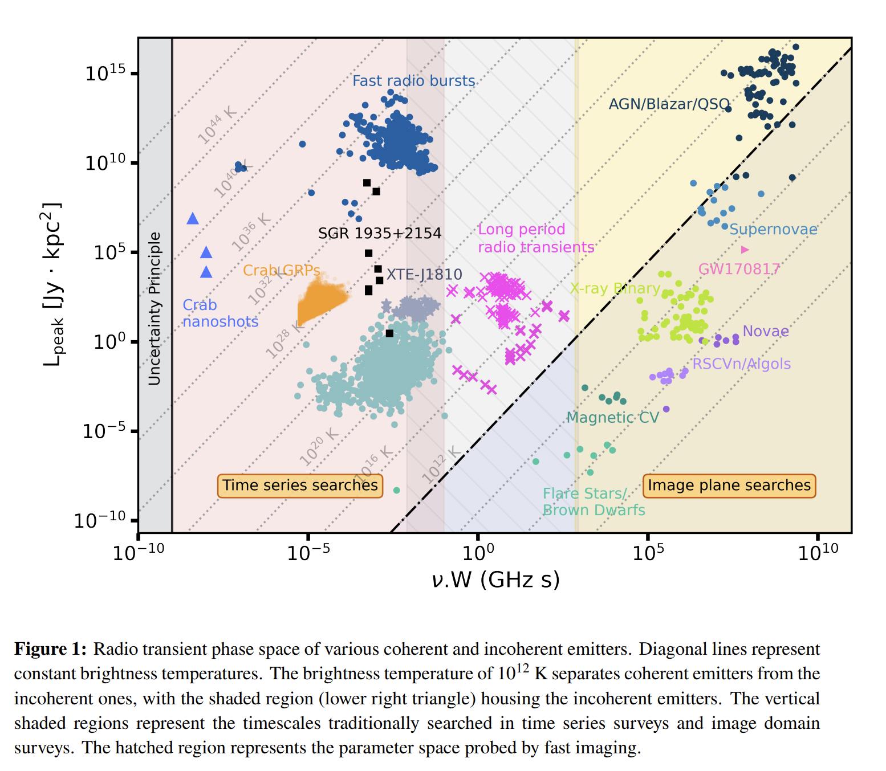

4. [Supernova remnants in the new radio astronomy era](https://arxiv.org/abs/2606.26889)

    > Supernova Remnant, Radio, SKA, Review

    超新星遗迹的射电同步辐射记录了爆炸激波、星周或星际介质、磁场和宇宙线电子的相互作用，但现有样本仍受低表面亮度漏检、空间尺度恢复不足、偏振去偏振和频率覆盖不完整限制。ASKAP、MeerKAT 和 MWA 已能在数角秒到数度尺度、十微 Jy 灵敏度和 80 MHz–3.5 GHz 频段内发现新遗迹并绘制谱指数图；SKA 将把频率覆盖扩展到 50 MHz–15 GHz，并提高偏振和图像保真度。

    低频 SKA-Low 可测自由自由吸收和谱 turnover，高频 SKA-Mid 可寻找谱 break 或 cut off，并与 X 射线和 $\gamma$ 射线数据共同约束电子能谱和粒子加速。1720 MHz OH maser 可作为超新星遗迹与分子云相互作用、距离和三维运动的探针；Band 5 银河面巡天约 20 $\mu$Jy、15 GHz 约 0.8 arcsec 的能力可为数百个遗迹测局域谱指数和磁场结构。与 ALMA、NOEMA、AtLAST、IXPE、CTAO 和 KM3NeT 的协同将帮助区分轻子和强子辐射成分，并检验超新星遗迹对宇宙线和星际介质反馈的贡献。

    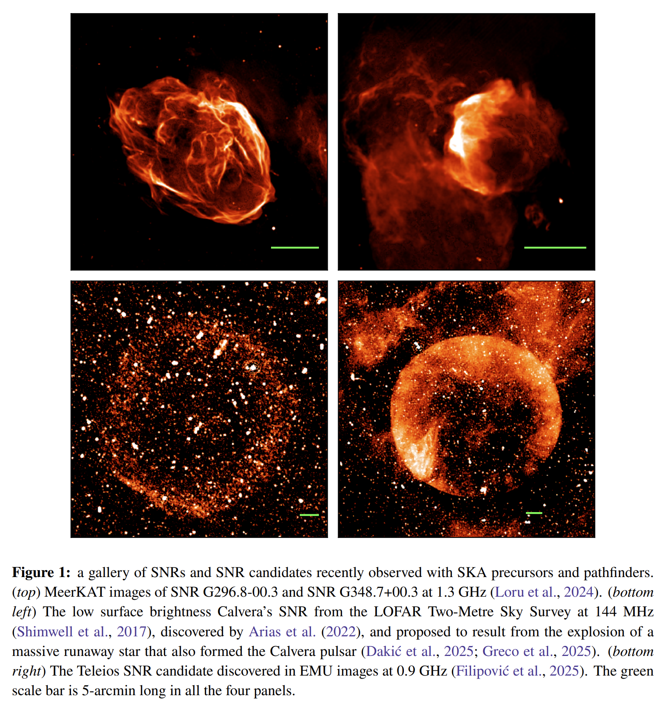

5. [HI Galaxy Science with the SKA](https://arxiv.org/abs/2606.26999)

    > HI, Galaxy, SKA, Review

    HI 星系科学围绕星系重子循环展开：冷气体吸积、原子到分子气体转化、恒星形成、反馈、环境剥离、暗物质晕和宇宙网中的中性氢分布。SKA-Mid 的 HI 发射观测将把附近星系的亚 kpc、1 km/s 级运动学普查，与 $z\sim1$ 以内的 HI 质量函数和 $\Omega_{\rm HI}$ 演化测量连接起来；21 cm 吸收和 OH 吸收则可把冷气体研究推进到 $z>1$，并提供尘埃无偏的高红移视角。

    巡天策略延续三层 wedding cake 设计，并针对 AA* 和 AA4 灵敏度、RFI 环境和最新 HI 演化模型更新参数。宽场层适合族群统计和稀有系统，medium deep 层适合环境和 scaling relation，ultra deep 层适合高红移质量函数、gas fraction 和 stacking；选场需与 Euclid、LSST、DESI、4MOST、JWST、Roman 和 ELT 等光学红外数据重叠。主要挑战是人为 RFI 会切掉大块红移空间，深场联合反卷积也会给 SKA Regional Centres 带来很高的数据处理压力。

    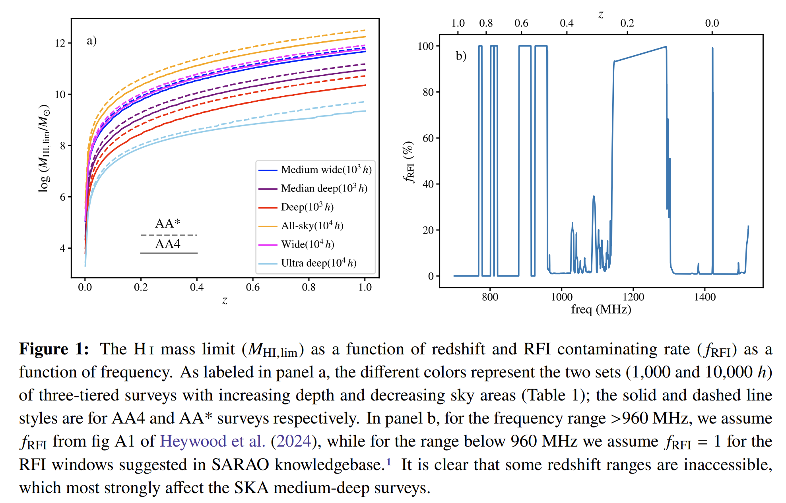

6. [SMR: Scheduler with Multi-Channel Map-Encoded Reinforcement Learning for Radio Telescopes](https://arxiv.org/abs/2606.27021)

    > Radio Telescope, Reinforcement Learning, Scheduling, Tool

    [SMR](https://doi.org/10.5281/zenodo.19343630) 把单碟射电望远镜动态调度写成强化学习问题，将可变长度目标列表投影到本地 Az El 网格，形成多通道天空图。目标通道编码候选源，附加通道可编码卫星干扰风险和仰角相关增益，使 CNN policy 直接利用天空几何，而不需要把目标列表 padding 成固定长度向量。模拟使用乌鲁木齐站址、ATNF 脉冲星和 NVSS 源表，考虑可见性、slew、接收机和后端切换、Sun avoidance 和方位 cable wrap。

    在完整 24 小时调度、含仪器切换开销的实验中，SMR 的时间利用率为 0.86，高于 tuned look ahead greedy 的 0.78，相当于每天多约 1.7 小时科学观测；它会接受约 2 分钟的小切换代价，以避免更昂贵的 cable unwrap。与 MLP baseline 相比，Az El map 表征在不同观测窗口上更稳健；加入卫星占用和增益通道后，SMR 在 12 小时和 24 小时任务中同时提高 utilization、低干扰曝光比例 LIER 和高增益观测比例 HGOR。主要限制是当前干扰和增益通道仍是简化代理，实际部署需要接入测量驱动的 RFI、天气和仪器状态产品。

    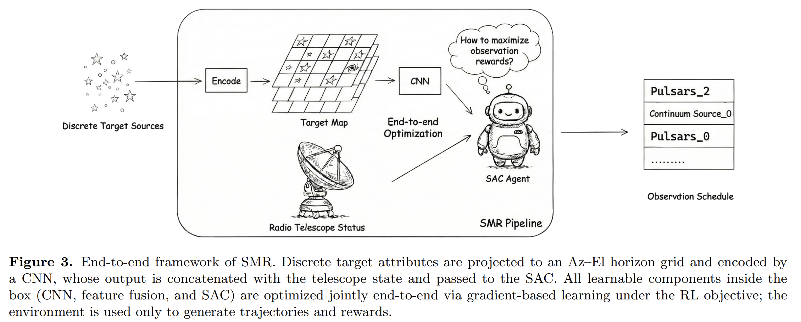

7. [A search for Fast Radio Bursts from globular clusters in M49 with FAST](https://arxiv.org/abs/2606.27225)

    > Fast Radio Burst, Globular Cluster, FAST, Observation

    FRB 20200120E 位于 M81 球状星团，说明老年恒星环境也可能产生 FRB；M49 是 Virgo 星系团中约 17 Mpc 外的巨椭圆星系，含约 7000 个球状星团，适合检验类似通道。FAST 19 波束接收机以 SnapShotCal 模式观测 M49 9 小时，其中 on source 8.4 小时，中心频率 1.25 GHz、带宽 400 MHz、采样 49.152 $\mu$s，覆盖约 $4230\pm65$ 个球状星团，每个 GC 的有效曝光约 2.1 小时。TransientX 在 $0$–$5000\,\mathrm{pc\,cm^{-3}}$ DM 范围做单脉冲搜索。

    没有发现无歧义的天体物理 FRB。最显著候选在 $DM=412.2\,\mathrm{pc\,cm^{-3}}$、宽度 0.7 ms、fluence 14.5 mJy ms 处达到后处理 $S/N=8.6$，但考虑 trials factor 后与热噪声假阳性一致；其 DM 也高于 M49 预期上限，不支持 M49 GC 起源。1 ms 脉冲的束平均峰值流量灵敏度约 16.5 mJy，对应 fluence 阈值约 16.5 mJy ms，并给出 95% 单边率上限 $4.4\times10^{-4}\,\mathrm{FRB\,GC^{-1}\,hr^{-1}}$。非探测仍允许低 duty cycle、低亮度或稀有 GC FRB 通道，若按 FRB 20200120E 类似事件率估计，约 50 小时 on source 才期望探测到 1 个事件。

    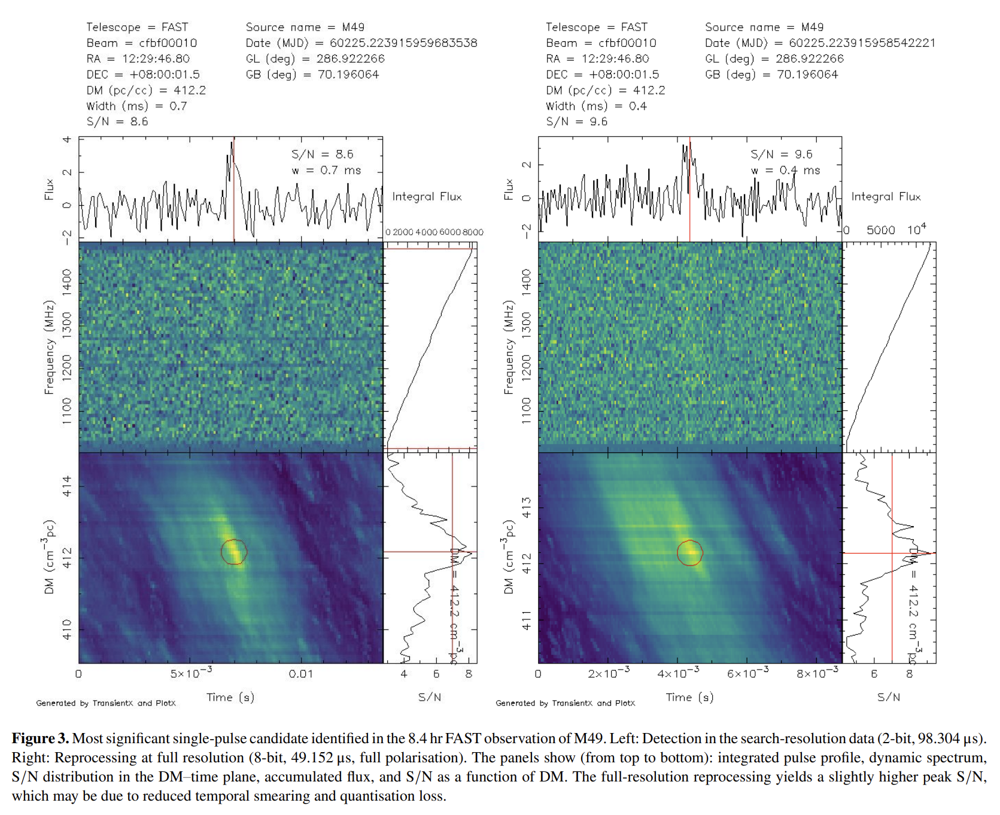

8. [The SPOTLIGHT Multibeam Real-Time Transient Detection System](https://arxiv.org/abs/2606.27262)

    > Fast Radio Burst, Radio Transient, Pipeline, Tool

    [SPOTLIGHT](https://spotlight.ncra.tifr.res.in/) 是 uGMRT 的 commensal 实时暂现源后端，用 60 台计算服务器和 90 块 NVIDIA A100 GPU 搜索 FRB 和其他毫秒射电暂现源。系统可处理最多 2000 个 post correlation beams，当前部署为 640 beams，实时搜索 DM 到 $2000\,\mathrm{pc\,cm^{-3}}$，并在触发后自动转储高时间分辨率 visibility 和 baseband 数据，用于后续成像定位。核心数据流包括 [Ares](https://github.com/nsmspotlight/Ares) 环形缓冲和 RFI 预处理、AstroAccelerate 暴力 dedispersion、matched filtering、候选聚类、跨波束 coincidence 与 anti coincidence 过滤、[candies](https://github.com/astrogewgaw/candies) 特征提取和 FETCH CNN 分类。

    Cycle 49 和 Cycle 50 初始科学部署中，SPOTLIGHT 在常规 uGMRT 观测同时运行，已从 42 个已知天体物理源探测到 2870 个 burst，fluence 分布达到约 0.2 Jy ms 的预期巡天阈值；到 2026 年 6 月，系统覆盖 277.77 平方度，其中 Band 3 为 239.09 平方度、Band 4 为 48.49 平方度、Band 5 为 10.51 平方度。实时注入框架 arachne 可把模拟 burst 注入 beamformed 数据流，用于持续验证灵敏度和管线完整性。结果表明，低频宽场干涉阵列可以用 GPU 管线实时完成多波束 FRB 搜索、候选筛选和触发式数据捕获，为下一代射电暂现源巡天提供可扩展系统原型。
    
    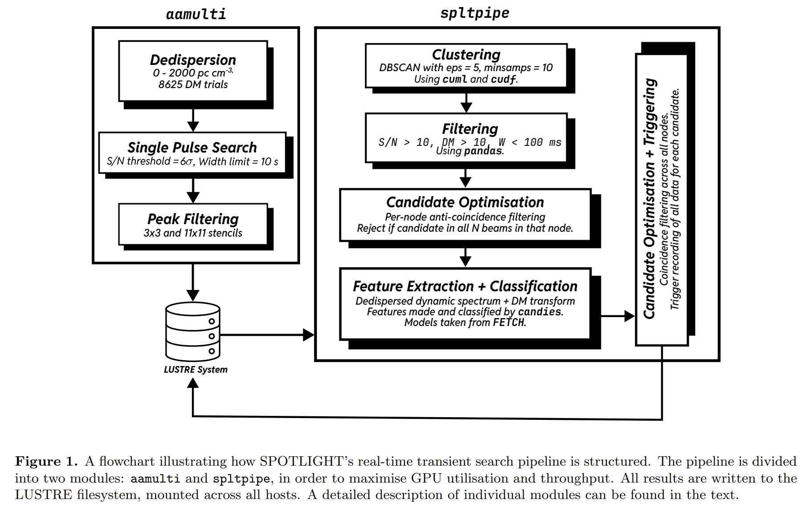

## 2026-06-29

