## 2026-07-01

1. [Deep Learning for Astrophysics: An Open Textbook from the NASA Cosmic Origins AI/ML Science and Technology Interest Group](https://arxiv.org/abs/2606.30855)

    > Astronomy, Deep Learning, Education, LLM

    面向天文学中 AI 方法采用门槛高、训练资源缺少领域语境的问题，NASA Cosmic Origins AI/ML STIG 把线上讲座整理成开放教材 [Deep Learning for Astrophysics](https://deeplearning4astro.com)。教材包含 17 位讲者贡献的 23 章，分为计算基础、深度学习架构、生成模型与仿真推断、强化学习、LLM 与智能体、AI 科学实践六部分，其中 17 章带可执行 notebook，并使用星系图像、射电星系形态、暂现源光变曲线、恒星流等真实天文数据。核心贡献是把机器学习教育从通用计算机科学材料转成可审查、可运行、带失败模式讨论的天文学训练模块，后续重点转向 agentic research 和 NASA ASTRA 任务概念中的可验证 AI 工作流。

    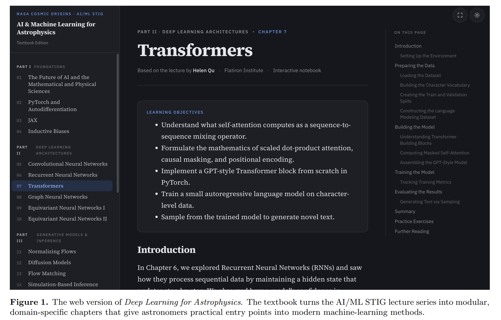

2. [SAOImageDS9: An Essential Tool for Astronomical Exploration](https://arxiv.org/abs/2606.30897)

    > Astronomy, Tool, Visualization, Software

    [SAOImageDS9](https://ds9.si.edu) 是跨平台开源天文数据可视化和交互分析工具，代码托管在 [GitHub](https://github.com/SAOImageDS9/SAOImageDS9)。文章回顾 DS9 从 SAOImage 系列发展而来的历史、FITS/WCS 支持、region 分析、catalog 联动、多波段比较、XPA/SAMP 互操作、远程数据访问和出版级图像输出能力，并说明 Tcl/Tk 图形界面加 C/C++ 高性能组件的模块化架构如何支撑长期演化。结论强调 DS9 的价值来自准确坐标处理、交互性能、脚本化控制和跨平台稳定性；未来维护难点在 legacy 依赖、Wayland、浏览器和云端分析环境，需要在保留核心能力的同时现代化代码基础。

    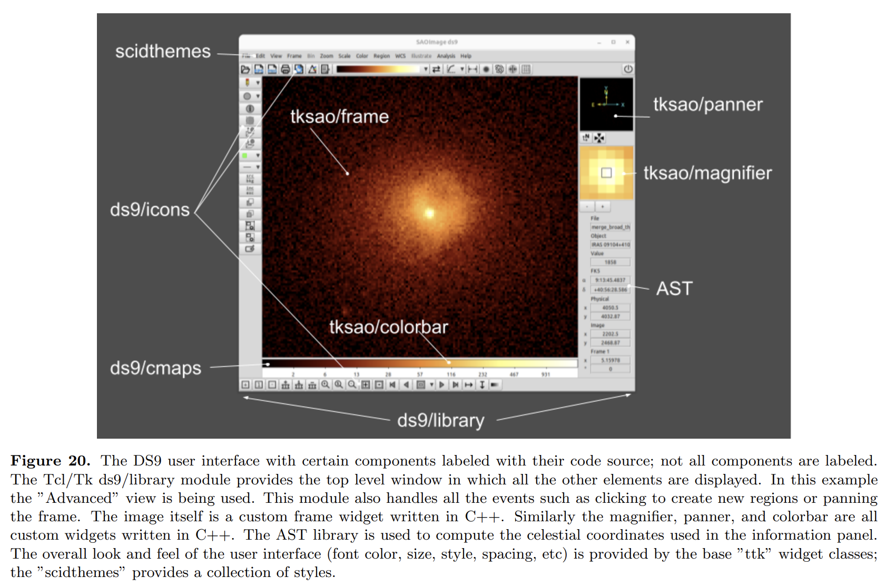

3. [GSED: The Galactic Stellar Extinction Database](https://arxiv.org/abs/2606.31374)

    > Milky Way, Extinction, Database, Deep Learning

    [GSED](https://nadc.china-vo.org/data/gsed/) 把六个代表性三维消光数据集统一到共同的 $E(B-V)$ 和视差距离基准上，解决不同巡天消光量、距离尺度和恒星参数空间不一致的问题。校正框架使用六层 MLP，两条分支分别学习消光系统差异和距离系统差异；消光分支以原始消光和恒星参数或本征颜色为输入，距离分支以银经、银纬和原始距离为输入。训练后的模型生成超过 19 亿条均一化恒星消光记录，并提供按坐标、搜索半径和距离查询的网页服务，实时拟合距离消光曲线，返回 $E(B-V)$、$E(G_{\rm BP}-G_{\rm RP})$ 和 $A_V$，也可下载原始查询结果和拟合曲线。当前主要适合单视线查询，后续计划增加批量查询和 Python 包。

    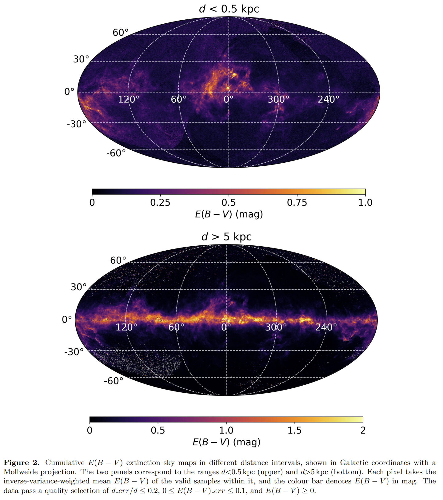

4. [Scattering of Strong Radio Waves by Particles in Strongly Magnetized Plasmas and Implications for Fast Radio Bursts](https://arxiv.org/abs/2606.31439)

    > Fast Radio Burst, Magnetar, Plasma, Theory

    针对 FRB 在磁星磁层中传播时是否会被强磁化等离子体非线性散射耗散的问题，直接求解带电粒子在强背景磁场和大振幅电磁波中的相对论运动，计算 X-mode、O-mode、混合线偏振和圆偏振波的散射截面与光深。O-mode 散射在 $a\sin\theta_B < \omega_B/\omega$ 时可强于 X-mode，在 $a\sin\theta_B > \omega_B/\omega$ 时接近 X-mode；准平行传播和相对论粒子流会显著压低散射截面，使光深远小于 1。磁星壳震激发的大振幅 Alfvén 波可把局部磁场线拉直、减小 $\theta_B$，让 FRB 在开放磁力线区更容易逃逸；高重数或大倾角传播仍可能增加耗散，是限制磁层透明度的主要条件。

5. [State-of-the-art Observation, Calibration, and Imaging Framework for Solar and Heliospheric Sciences with SKA](https://arxiv.org/abs/2606.31520)

    > Solar, SKA, Imaging, Review

    SKA 做太阳和日球层观测的主要难点来自太阳极高亮度、强时变性和宽参数空间：亮温可从 $10^4$ K 到 $10^{13}$ K，时间尺度从太阳周到毫秒，频谱结构可窄到约 100 kHz，偏振比例从低于 1% 到接近 100%。综述从 MWA、LOFAR、MeerKAT、DART、NenuFAR 等先导设施经验出发，讨论模拟信号链线性度和衰减、通量定标、强源自噪声、快照全偏振成像、自校准管线 P-AIRCARS、SIMPL 和 [MeerSOLAR](https://pypi.org/project/meersolar/)。关键建议是为 SKA 建立太阳专用成像器、弹性时间频率处理模式、内外部触发观测、子阵列监测和 transient buffer，并形成端到端 science ready 太阳和日球层数据产品。

    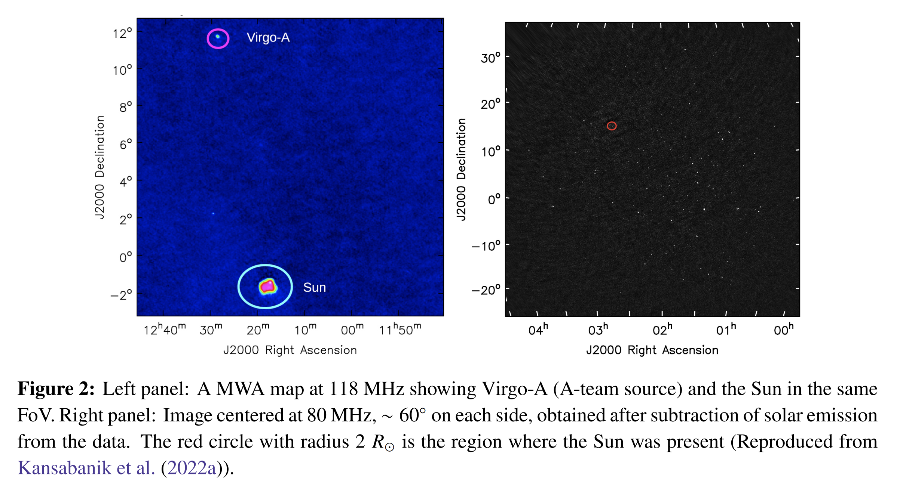

6. [The FAST All Sky HI Survey DR2: the FASHI Catalog and the HI Mass Function](https://arxiv.org/abs/2606.31539)

    > Galaxy, HI, FAST, Survey

    FAST All Sky HI Survey DR2 用 FAST 漂移扫描覆盖赤纬 $>-14^\circ$ 的约 19,500 平方度天区，发布 156,411 个 $z<0.09$ 的河外 H I 源，速度分辨率 6.4 km s$^{-1}$，中位灵敏度 0.57 mJy beam$^{-1}$；[FASHI 页面](https://zcp521.github.io/fashi)给出目录入口。数据通过 HiFAST 处理，SoFiA 自动提源后结合人工检查，并利用 DESI/SDSS 光谱红移进行光学引导补充提取和验证。基于超过 109,000 个完备性校正源得到 H I 质量函数，稳健约束到 $M_{\rm HI}\sim10^{6.2}M_\odot$，单 Schechter 函数已能描述系统误差内的 HIMF，低质量端没有强烈变陡证据；得到 $\Omega_{\rm HI}=(4.71\pm0.03_{\rm stat}\pm0.40_{\rm sys})\times10^{-4}h_{70}^{-1}$，并显示 H I 选择星系偏向欠密环境。

    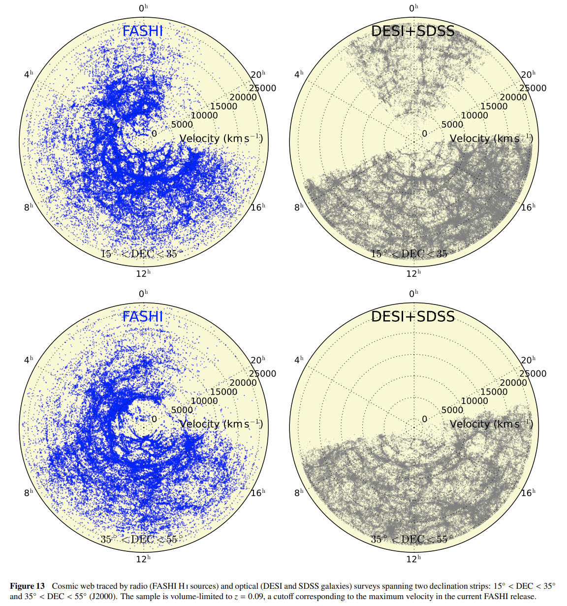

7. [Unveiling Radio Transients with SKAO Telescopes](https://arxiv.org/abs/2606.31701)

    > Radio Transient, SKA, Fast Radio Burst, Review

    综述 SKAO 在射电暂现源中的发现空间，覆盖从纳秒到十年的时间尺度，以及 FRB、长周期射电暂现源、恒星、X 射线双星、GRB、超新星、潮汐瓦解事件、新星和传播效应导致的表观暂现。快暂现源主要依赖波束形成动态谱，慢暂现源多在图像域搜索；SKA-Low 的大视场适合低频 FRB 和 LPT，SKA-Mid 则适合高灵敏度跟进和多信使事件候选体定位。主要挑战是候选体数量会超过跟进能力，必须依赖自动分类器、数据 broker、快速触发和现有中小射电望远镜网络分担长期监测；SKAO 最适合保留给稀有、高价值或只有其灵敏度和频率覆盖才能解决的物理问题。

8. [High Frequency Wideband Study of FRB 20240114A with the Allen Telescope Array](https://arxiv.org/abs/2606.31897)

    > Fast Radio Burst, Observation, ATA

    Allen Telescope Array 在 2024 年 1 月 27 日到 10 月 29 日对高活跃重复 FRB 20240114A 进行了 1167 小时宽带观测，10 个本振调谐覆盖约 900–7620 MHz，每次同时带宽 1344 MHz。搜索使用 SPANDAK、HEIMDALL 和 CNN 候选筛选，之后用 FRBGUI 测量 97 个爆发及 162 个子成分的时频性质，结构优化色散量为 528.1 pc cm$^{-3}$；全部时频性质表在 [Zenodo](https://zenodo.org/records/19429571)，动态谱也在 [Zenodo](https://zenodo.org/records/19429415)。爆发只出现在约 900 MHz 到 5 GHz，2244–3588 MHz 在 MJD 60480–60510 期间达到约 24.97 hr$^{-1}$ 的峰值率，而 4932–7620 MHz 的 305 小时没有探测到爆发。结果显示该源活动强烈依赖频率和时间，2.4–4.6 GHz 的高频 burst storm 与严格相干的 112.9 天中心频率调制不一致；带宽和漂移率幅度随频率增加、持续时间变短，爆发以向低频漂移为主，高能端累积分布较浅，宽频高 cadence 监测对区分本征活动和选择效应是必要的。
    
    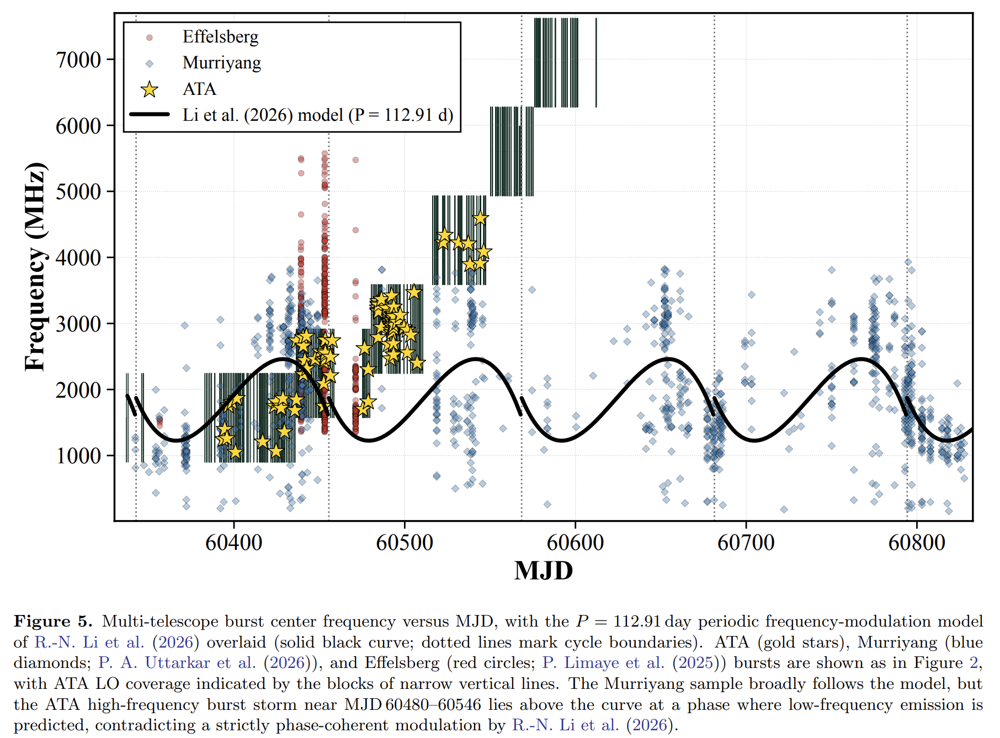

## 2026-07-02

1. [Leveraging Multimodality for Real-Time Classification of Transients and Variables found by the Zwicky Transient Facility](https://arxiv.org/abs/2607.00228)

    > Transient, Deep Learning, Multimodal, ZTF, Tool

    面向 ZTF 警报流中的早期天体分类，[ORACLE-2](https://github.com/dev-ved30/Oracle) 同时利用光变曲线、警报元数据和参考图像，区分暂现源、AGN、CV、变星以及多类超新星；模型权重在 [Hugging Face](https://huggingface.co/collections/vedshah30/oracle)。光变曲线分支使用 GRU 和 attention pooling，元数据用 MLP，图像分支比较了 Pan-STARRS 和 ZTF 参考图像；训练和评估基于 ZTF Bright Transient Survey 及 LSST ELAsTiCC 模拟警报。

    BTS 测试中，多模态 ORACLE-2 Omni 的最终 depth 2 macro F1 为 $0.73\pm0.01$，相对光变曲线加元数据模型最高提升 11%，相对纯光变曲线模型最高提升 40%，优势主要出现在首周。ELAsTiCC 上光变曲线加元数据版本达到 macro F1 0.88。实时部署到 BOOM broker 后，2026 年 5 月 15 日至 6 月 11 日期间对 344 个有光谱标签的新源给出分类，depth 1 macro F1 为 0.88、准确率 0.99，depth 2 macro F1 为 0.55、准确率 0.79。

    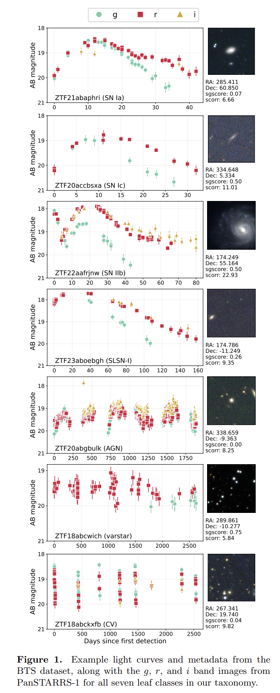

2. [Stellar masses and ages in Gaia Data Release 4 from the Final Luminosity Age Mass Estimator algorithm](https://arxiv.org/abs/2607.00264)

    > Gaia, Stellar, Catalog, Method

    FLAME 是 Gaia DR4 中用于估计恒星光度、半径、引力红移径向速度修正、质量、年龄和演化阶段的官方 DPAC 管线。流程分为解析部分和模型推断部分：前者根据 Gaia 大气参数、视差和光度计算光度与半径，后者用 BaSTI 恒星演化轨道、SPInS 风格的 Bayesian MCMC 和经典最小化方法，从 $L$、$T_{\rm eff}$、$\log g$、金属丰度及误差中推断质量和年龄。

    DR4 预计约 5 亿个 GSP-Phot XP 源和 3400 万个 GSP-Spec RVS 源会有 FLAME 输出。模拟星、太阳、Gaia Benchmark Stars、星震样本、StarHorse 和星团验证显示主序星与次巨星的质量整体可靠，典型质量不确定度峰值约 2% 到 6%；年龄精度强依赖质量和演化阶段，太阳型主序星常在 20% 到 40%，低质量 FGK 主序星可差到约 50%。红巨星质量和年龄对输入大气参数非常敏感，需要结合 Gaia 质量标志使用。

3. [GTLS: A GPU-accelerated method for periodic transit detection](https://arxiv.org/abs/2607.00348)

    > Exoplanet, Transit, GPU, Tool

    [GTLS](https://github.com/Farthing-0/GTLS) 是面向大规模光变曲线巡天的 GPU 加速周期凌星搜索方法，用 CuPy/CUDA 重写 TLS 类搜索中的周期网格、相位折叠、持续时间扫描、深度估计、$\chi^2$ 和 SDE 计算。目标是在保持 TLS 对真实凌星形状敏感性的同时，把 Kepler、TESS、PLATO 等数据中的首轮候选搜索速度提高到可批处理规模。

    合成 Kepler 长基线光变曲线和真实 KOI 测试显示，1500 天光变曲线搜索耗时 33.3 秒，而 TLS 为 522.0 秒、GPU BLS 为 121.1 秒；3000 天光变曲线在单张 RTX 4090 上约 138 秒，双 RTX 4090 上约 79 秒。以 SDE=7、SNR=5 作为首轮阈值时，GTLS 的 precision/recall 为 9.3%/79.4%，与 TLS 的 9.4%/81.1% 基本一致；低 precision 反映的是高召回首轮候选搜索，后续仍需要天体物理 vetting。

    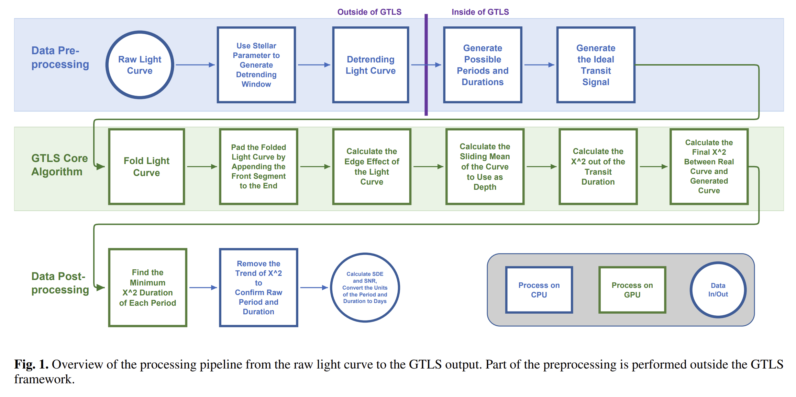

4. [White Dwarf Classification of DESI DR1 Spectra](https://arxiv.org/abs/2607.00430)

    > White Dwarf, DESI, Catalog, Observation

    基于 DESI DR1 光谱和 Gaia DR3 白矮星候选表，构建 44,417 个目标的白矮星光谱分类样本，其中约 20,660 个没有既有光谱分类记录。分类主要依靠人工检查 DESI 光谱；29,072 个 DA 白矮星用 Koester 氢大气模型和 [DAWD_Fitting](https://github.com/Mandorama/DAWD_Fitting) 拟合 $T_{\rm eff}$ 与 $\log g$，再结合演化模型估计质量；磁白矮星用 Zeeman 分裂和偏心倾斜偶极模型估计磁场强度。

    样本中包括 35,512 个 DA、2,598 个 DB、168 个 DO、3,932 个 DC、1,021 个 DZ 和 219 个 CV。DA 质量分布均值为 $0.677\,M_\odot$、中位数为 $0.647\,M_\odot$。共识别 547 个磁白矮星，其中 84 个为新发现；磁白矮星平均质量约 $0.88\,M_\odot$，明显高于总体白矮星群体。中等磁场强度在尚未进入结晶阶段的恒星中已经出现，说明结晶驱动的发电机机制不能单独解释白矮星磁场来源。

    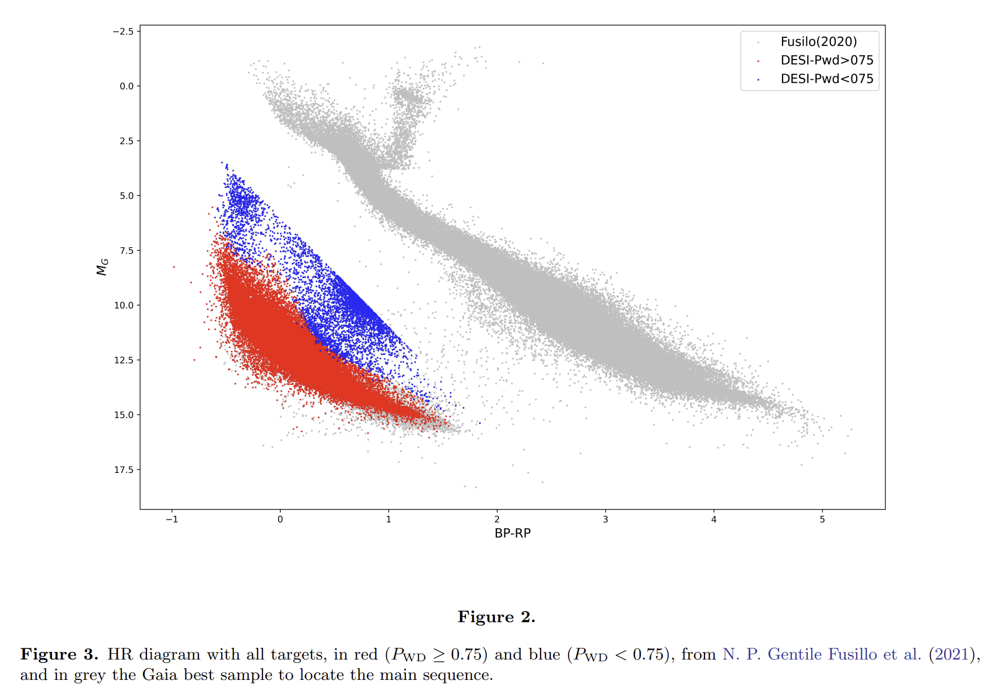

5. [FRB20250613A: a remarkable repeating FRB with apparent millisecond-timescale scattering variations](https://arxiv.org/abs/2607.00505)

    > Fast Radio Burst, Repeater, Scattering, Polarization, Observation

    FRB20250613A 是 ASKAP/CRAFT 发现并定位的重复 FRB，宿主为 $z=0.0987\pm0.0001$ 的低质量、低金属丰度、仍在形成恒星的矮星系，性质接近 FRB 20121102A 的宿主。ASKAP、MeerKAT 和 Murriyang/Parkes 的多轮观测覆盖了发现暴和后续重复暴，主要分析使用 [ILEX](https://github.com/tdial2000/ILEX)；爆发形态用多个高斯脉冲卷积单边指数散射尾拟合，偏振用 RM synthesis 和频率退偏振模型处理。

    MeerKAT 2025 年 6 月 24 日的爆发在分钟到小时尺度上显示近两个数量级的表观散射变化，1 GHz 参考散射时间从约 0.14 ms 到 7.2 ms；ASKAP 发现暴 A1 的两个相隔毫秒的子成分也显示强烈差异散射。RM 在月尺度上变化约 $300\ {\rm rad\ m^{-2}}$，多成分暴的典型成分间隔为 $6.8\pm0.8$ ms。传播效应整体指向近源、湍动、磁化且团块化的散射屏；中子星和 Be 星双星的强恒星风可以同时解释长时标 DM/RM/散射变化，而部分毫秒尺度差异散射可能来自强 FRB 辐射在恒星风中驱动的非线性等离子体传播。

    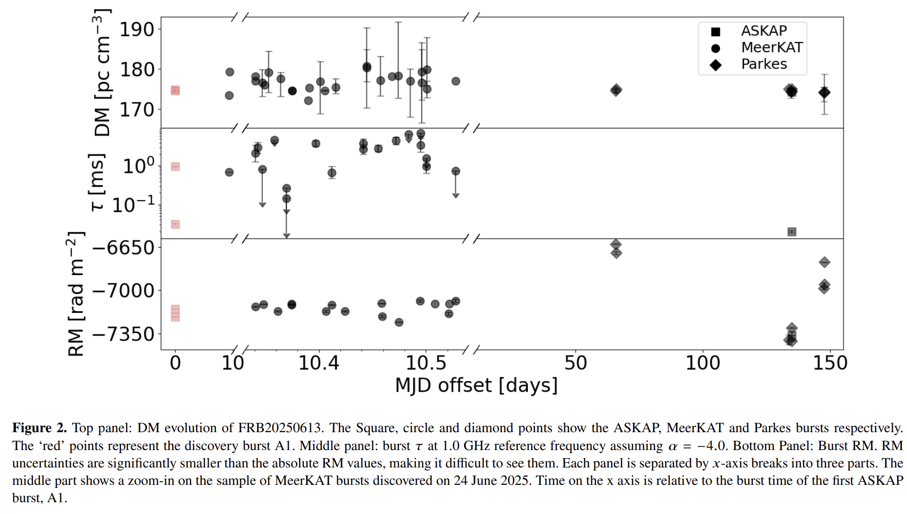

6. [Unveiling the Mysteries of Lightning: Exploring its fundamental Physical Processes with SKA-LOW](https://arxiv.org/abs/2607.00659)

    > Lightning, SKA, Plasma, Review

    面向 SKA-Low 的闪电物理科学案例综述，核心问题是闪电如何起始、leader 如何传播、VHF 辐射来自什么等离子体过程，以及为什么负 leader 强 VHF、正 leader 弱 VHF。LOFAR 已经能以米级和纳秒级分辨率重建云内闪电，并发现 needles、云顶放电和正常闪电起始结构；SKA-Low 的更高灵敏度、更宽频段和澳大利亚西部更强雷暴环境可进一步探测弱起始、失败起始、正 leader 和 fast breakdown。

    闪电处于 SKA-Low 近场，常规天文成像管线不适用，需要在通道化前转储 raw voltage buffer，并由自触发强射电脉冲或约 10 km 外的低频天线触发，保存每个台站少量天线约 1 到 2 秒原始电压。后处理可沿用 LOFAR 的 impulsive imager 做整场闪电定位，也可用近场 3D beamforming/TRID 对局部过程进行约 100 ns 积分成像，目标定位精度可到约 10 cm。雷暴时段本来会污染常规天文数据，因此这类观测可以利用低天文效率时段，同时为时间校准和天线模型提供独立检验。

    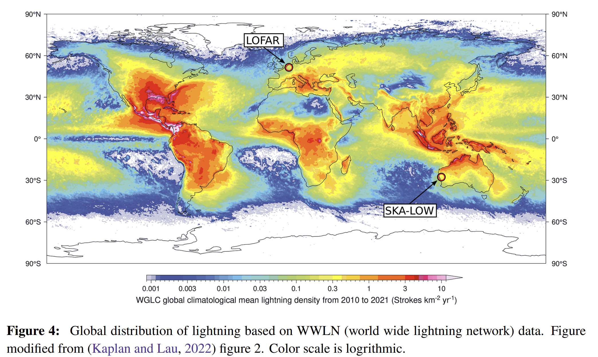

7. [Kolmogorov turbulence across multi-fractal gas in Polaris Flare](https://arxiv.org/abs/2607.00872)

    > Interstellar Medium, Molecular Cloud, Turbulence, Theory

    利用 PPCOS 的宽场 $^{12}{\rm CO}(1-0)$ 数据研究 Polaris Flare 中湍流级联是否在分子云内部发生模式转变。强度积分图作为柱密度示踪，质心速度图作为速度场示踪；通过 TurbuStat 的 $\Delta$ 方差方法测量二阶结构函数斜率，并用分形投影关系把二维观测斜率映射到三维速度斜率，核心关系为 $\alpha_V^{\rm 3D}=\alpha_V-\alpha_I/3$。

    观测到的二维强度和速度结构函数在 $L\sim0.5$ pc 附近出现斜率分叉，但代入投影修正后，三维速度斜率在 0.05 到 20 pc 上保持 $\alpha_V^{\rm 3D}\simeq0.62-0.64$，接近 Kolmogorov 的 $2/3$。高阶速度增量 PDF 用 Normal Log Normal 混合模型刻画，间歇性 log variance 在 0.5 pc 以下趋于饱和。这个转折更像是密度分形维数和视线投影改变造成的表观效应，而非从 Kolmogorov 湍流转向 Burgers 或引力主导湍流；Polaris Flare 的内部湍流很可能从周围冷中性介质连续继承下来，并未在 0.1 pc 以下被压缩或引力打断。
    
    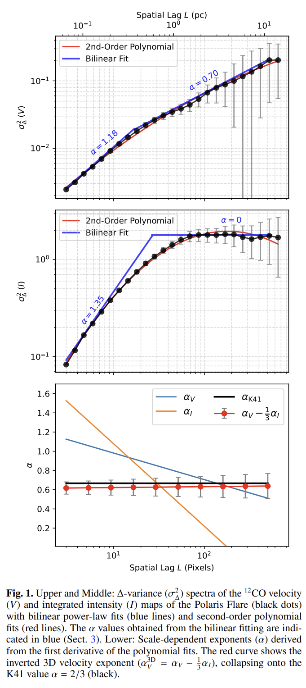

## 2026-07-03

1. [Pulsar Science with the SKAO](https://arxiv.org/abs/2607.01288)

    > Pulsar, SKA, Review, Observation

    围绕 SKA-Low 和 SKA-Mid 的 AA\*、AA4 阶段梳理脉冲星科学目标，覆盖银河系巡天、球状星团、银河中心、中子星族群、磁层物理、星际介质、银河磁场、脉冲星风云、强引力、核物质状态方程和 PTA 纳赫兹引力波。早期 AA\* 双层巡天预计发现约 10,000 颗慢脉冲星和约 800 颗毫秒脉冲星，AA4 总产出可超过 12,000 颗，并显著扩大高色散、弱源、外银盘和银晕样本。

    SKA-Mid 的高频覆盖和灵敏度可在银河中心附近寻找受强散射影响的脉冲星，并通过微秒级计时约束 Sgr A\* 的自旋和四极矩；球状星团深场搜索在 AA4 阶段可能把已知团内脉冲星数提高到数倍量级。大样本 DM、RM 和散射测量会改进银河电子密度与磁场三维图像，PTA 和相对论双星计时则服务于引力理论、黑洞无毛定理和中子星内部物理检验。

2. [Constraining the near-source relativistic wind medium using Fast Radio Burst circular polarization data](https://arxiv.org/abs/2607.01369)

    > Fast Radio Burst, Polarization, Theory

    用近源相对论磁星风中的 Faraday conversion 解释部分 FRB 的圆偏振，而非预设圆偏振全部来自辐射源本身。模型把偏振向量在 Poincare 球上的演化写成 Stokes 参数传播问题；纯电子正电子风中 Faraday rotation 为零但 Faraday conversion 可产生 Stokes $V$，并额外考虑强 FRB 电磁波导致的有效粒子质量增加、离子载荷和径向变化风参数。

    风环境主要由 $\xi$ 这类综合参数约束，连接风光度、磁化度、bulk Lorentz 因子和粒子质量修正。FRB 20201124A、FRB 20180301A、FRB 20220912A 以及 SGR 1935+2154 的偏振数据表明，模型可解释从弱圆偏振到强圆偏振的宽范围现象，也能给出无圆偏振的限制；FRB 20180301A 的快速频率振荡和接近观测值的 RM 可在该框架下拟合。显著圆偏振和大 RM 往往更适合来自不同区域，内禀圆偏振仍不能被排除。

3. [Signatures of Two Distinct Epochs of FRB 20240114A from January to August 2024 Based on its Energy and Waiting Time Analysis](https://arxiv.org/abs/2607.01576)

    > Fast Radio Burst, Repeater, Statistics, FAST

    基于 FAST 在 2024 年 1 月 28 日至 8 月 29 日对 FRB 20240114A 的 33.86 小时观测，分析 11,553 个超过 0.026 Jy ms 阈值的爆发能量和等待时间分布。全样本无法由单一 SPL、BPL、TPL、Band 能量模型或 Poisson、Weibull 等待时间模型良好描述；分成单日且爆发数超过 50 的子样本后，能量分布多可由 BPL/TPL 拟合，等待时间分布整体更接近 Weibull。

    2024 年 3 月 21 日前后呈现两个统计阶段：早期包含多数 $E>10^{39}$ erg 的高能爆发，后期活动率更低、等待时间中位数更长。高能段 $E>6\times10^{37}$ erg 的微分能量谱指数从早期约 $-1.97$ 变为后期约 $-2.34$，BPL 的 $\beta$ 在两个阶段内分别保持在约 $1.006$ 和 $1.236$。这种能量和等待时间的同步变化指向不同爆发类型占比变化，或发射区物理条件在数月尺度上发生改变。

4. [Development of a Retrieval-Augmented Generation Virtual Assistant for Enhanced Information Discovery at Rubin Observatory](https://arxiv.org/abs/2607.01659)

    > Astronomy, LLM, RAG, Tool, Rubin

    Rubin Observatory 的 RAG 虚拟助手用于在碎片化文档生态中检索和回答 Rubin 专用问题，代码在 [rubin_rag](https://github.com/lsst-dm/rubin_rag)。系统面向 LSST 每晚 15-20 TB 原始数据、约 1,000 万 transient alerts 和庞大数据权社区带来的支持压力，把 Confluence、Jira、GitHub、Community Forum、Slack、DocuShare、PDF 与技术文档接入统一问答入口。

    架构使用 Python、Weaviate 向量库、LangChain 编排、OpenAI `text-embedding-3-large` 嵌入和 `gpt-3.5-turbo` 生成，Streamlit 前端部署到 Rubin Science Platform，可按 Confluence、Jira、LSST Forum Docs、Local Docs 等来源过滤检索。当前原型已建立文档 ingest、chunking、embedding、source citation 和 RAGAS 评估框架；主要限制来自固定长度分块、Rubin 术语差异、语料缺口、重复和过期内容，后续重点是 hybrid BM25+vector 检索、结构感知分块、自动重建索引和能生成可运行 Rubin 查询/代码的 agentic RAG。

    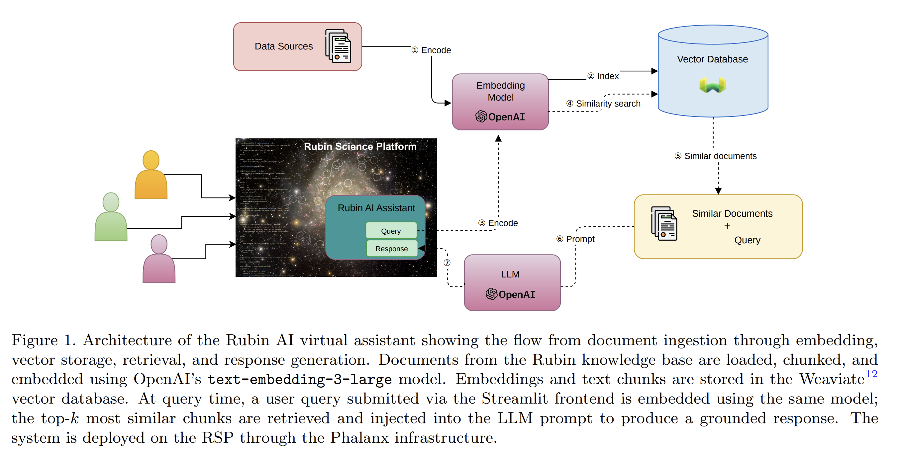

5. [Periodic Radio Technosignature Search toward 3I/ATLAS with FAST](https://arxiv.org/abs/2607.01666)

    > SETI, FAST, Technosignature, RFI

    面向第三个确认的星际天体 3I/ATLAS，使用 FAST L 波段多波束数据搜索周期性调制射电技术信号，补充此前以窄带 Doppler drift 为主的 SETI 搜索。数据来自 FAST psr backend，采样时间 49.152 μs、频率分辨率约 0.122 MHz，下采样到约 0.12 s 后在 1050-1140 MHz 和 1300-1450 MHz 搜索，避开 1140-1300 MHz 强 RFI 频段。

    方法把时间、频率、波束组成三维动态谱张量，对 Stokes $I,Q,U,V$ 分别做 CPD/CANDECOMP/PARAFAC 分解，再用中心波束占优度、波束熵、periodogram SNR、离轴波束约束和频率投影 ACF 筛选候选。2753 个中心波束占优成分中只有 3 个通过表格阈值，均来自 2026 年 1 月 5 日的 Stokes $V$，最终分别因 300 s 校准注入、谐波/校准调制或缺少稳定窄带频率结构被排除。未发现 $P\in[0.7,1000]$ s、periodogram 阈值 10$\sigma$ 以上的可信周期发射信号，对 3I/ATLAS 方向给出 EIRP 高于 0.146 W 的周期发射器无可靠证据这一限制。

6. [Pulsar Backend for 21 CentiMeter Array: Implementation of Data Acquisition and Initial Results](https://arxiv.org/abs/2607.01975)

    > Pulsar, Instrument, 21CMA, Low Frequency

    21CMA 的 RFSoC 脉冲星后端面向低频脉冲星和 FRB 基带采集，代码在 [rfsoc_data_acquisition](https://github.com/fxzjshm/rfsoc_data_acquisition)，使用 `microphase-t510-21cma` 分支。系统以 1.6 Gsps 原始采样、RFDC 二倍抽取、8 bit 量化和 100 GbE UDP 输出工作，有效频段约 50-350 MHz，包格式兼容 FAST ROACH2 多波束后端；大点数 channelization 交给 GPU，RFSoC 主要承担采样、同步和高速传输。

    多板同步依赖全局 10 MHz 与 1PPS、nested zero delay 和 RFSoC MTS；实验室两块 MicroPhase ANTSDR T510 的 3462 次测试给出 0.14 ns 延迟标准差。单站 S13 对 PSR B0329+54 的 1 小时测试无丢包并由 PulsarX 折叠检出脉冲星；随后用 Cas A 和 Cyg A 标定多站线缆延迟，并完成 PSR B0329+54 的相干波束合成，2.5 小时观测 SNR 达 699.09。结果说明 21CMA 已具备低频 tied array 脉冲星观测和巡天的基础能力，但台站间非平坦群延迟和模拟延迟单元稳定性仍需进一步校准。

7. [Development of a cosmic ray detector using CMOS sensors embedded in smartphones and Raspberry Pi devices](https://arxiv.org/abs/2607.02106)

    > Cosmic Ray, Detector, Citizen Science, Tool

    SORAMAME 把手机、平板和 Raspberry Pi 上的 CMOS 图像传感器改造成低成本宇宙线/电离辐射探测器，代码在 [soramame-cosmicray](https://github.com/soramame-cosmicray)，公开观测 dashboard 在[这里](https://soramame.n.kanagawa-u.ac.jp/en/)。暗场图像中，带电粒子穿过硅层会产生电子空穴对并形成亮点或短迹线；系统用 OpenCV 自适应阈值和噪声坐标列表在设备端识别候选事件，记录时间、像素坐标、形态和亮度特征，并在联网时上传云端，支持地图、时间序列和 CSV 导出。

    iPhone 13 Pro 的两次商业航班验证显示高空候选事件率显著高于地面：BKK-HND 为 19.33 h$^{-1}$ 对 3.68 h$^{-1}$，IRR=5.26；YUL-NRT 为 27.27 h$^{-1}$ 对 3.68 h$^{-1}$，IRR=7.42。Raspberry Pi 4 + HQ Camera 的航线比较进一步显示地面日本为 17.10 h$^{-1}$，关岛、温哥华、蒙特利尔至日本航线分别为 53.63、65.51、77.49 h$^{-1}$，事件率随平均地磁截止刚度升高而下降，描述性幂律斜率约 $k=-0.196$。消费级 CMOS 传感器能够在真实飞行环境中捕捉高度和地磁纬度相关趋势，但探测效率仍受设备噪声、遮光、温度、长时间噪声列表构建和统一标定限制。

## 2026-07-06

