## 2026-07-01

1. [Deep Learning for Astrophysics: An Open Textbook from the NASA Cosmic Origins AI/ML Science and Technology Interest Group](https://arxiv.org/abs/2606.30855)

    > Astronomy, Deep Learning, Education, LLM

    面向天文学中 AI 方法采用门槛高、训练资源缺少领域语境的问题，NASA Cosmic Origins AI/ML STIG 把线上讲座整理成开放教材 [Deep Learning for Astrophysics](https://deeplearning4astro.com)。教材包含 17 位讲者贡献的 23 章，分为计算基础、深度学习架构、生成模型与仿真推断、强化学习、LLM 与智能体、AI 科学实践六部分，其中 17 章带可执行 notebook，并使用星系图像、射电星系形态、暂现源光变曲线、恒星流等真实天文数据。核心贡献是把机器学习教育从通用计算机科学材料转成可审查、可运行、带失败模式讨论的天文学训练模块，后续重点转向 agentic research 和 NASA ASTRA 任务概念中的可验证 AI 工作流。

    

2. [SAOImageDS9: An Essential Tool for Astronomical Exploration](https://arxiv.org/abs/2606.30897)

    > Astronomy, Tool, Visualization, Software

    [SAOImageDS9](https://ds9.si.edu) 是跨平台开源天文数据可视化和交互分析工具，代码托管在 [GitHub](https://github.com/SAOImageDS9/SAOImageDS9)。文章回顾 DS9 从 SAOImage 系列发展而来的历史、FITS/WCS 支持、region 分析、catalog 联动、多波段比较、XPA/SAMP 互操作、远程数据访问和出版级图像输出能力，并说明 Tcl/Tk 图形界面加 C/C++ 高性能组件的模块化架构如何支撑长期演化。结论强调 DS9 的价值来自准确坐标处理、交互性能、脚本化控制和跨平台稳定性；未来维护难点在 legacy 依赖、Wayland、浏览器和云端分析环境，需要在保留核心能力的同时现代化代码基础。

    

3. [GSED: The Galactic Stellar Extinction Database](https://arxiv.org/abs/2606.31374)

    > Milky Way, Extinction, Database, Deep Learning

    [GSED](https://nadc.china-vo.org/data/gsed/) 把六个代表性三维消光数据集统一到共同的 $E(B-V)$ 和视差距离基准上，解决不同巡天消光量、距离尺度和恒星参数空间不一致的问题。校正框架使用六层 MLP，两条分支分别学习消光系统差异和距离系统差异；消光分支以原始消光和恒星参数或本征颜色为输入，距离分支以银经、银纬和原始距离为输入。训练后的模型生成超过 19 亿条均一化恒星消光记录，并提供按坐标、搜索半径和距离查询的网页服务，实时拟合距离消光曲线，返回 $E(B-V)$、$E(G_{\rm BP}-G_{\rm RP})$ 和 $A_V$，也可下载原始查询结果和拟合曲线。当前主要适合单视线查询，后续计划增加批量查询和 Python 包。

    

4. [Scattering of Strong Radio Waves by Particles in Strongly Magnetized Plasmas and Implications for Fast Radio Bursts](https://arxiv.org/abs/2606.31439)

    > Fast Radio Burst, Magnetar, Plasma, Theory

    针对 FRB 在磁星磁层中传播时是否会被强磁化等离子体非线性散射耗散的问题，直接求解带电粒子在强背景磁场和大振幅电磁波中的相对论运动，计算 X-mode、O-mode、混合线偏振和圆偏振波的散射截面与光深。O-mode 散射在 $a\sin\theta_B < \omega_B/\omega$ 时可强于 X-mode，在 $a\sin\theta_B > \omega_B/\omega$ 时接近 X-mode；准平行传播和相对论粒子流会显著压低散射截面，使光深远小于 1。磁星壳震激发的大振幅 Alfvén 波可把局部磁场线拉直、减小 $\theta_B$，让 FRB 在开放磁力线区更容易逃逸；高重数或大倾角传播仍可能增加耗散，是限制磁层透明度的主要条件。

5. [State-of-the-art Observation, Calibration, and Imaging Framework for Solar and Heliospheric Sciences with SKA](https://arxiv.org/abs/2606.31520)

    > Solar, SKA, Imaging, Review

    SKA 做太阳和日球层观测的主要难点来自太阳极高亮度、强时变性和宽参数空间：亮温可从 $10^4$ K 到 $10^{13}$ K，时间尺度从太阳周到毫秒，频谱结构可窄到约 100 kHz，偏振比例从低于 1% 到接近 100%。综述从 MWA、LOFAR、MeerKAT、DART、NenuFAR 等先导设施经验出发，讨论模拟信号链线性度和衰减、通量定标、强源自噪声、快照全偏振成像、自校准管线 P-AIRCARS、SIMPL 和 [MeerSOLAR](https://pypi.org/project/meersolar/)。关键建议是为 SKA 建立太阳专用成像器、弹性时间频率处理模式、内外部触发观测、子阵列监测和 transient buffer，并形成端到端 science ready 太阳和日球层数据产品。

    

6. [The FAST All Sky HI Survey DR2: the FASHI Catalog and the HI Mass Function](https://arxiv.org/abs/2606.31539)

    > Galaxy, HI, FAST, Survey

    FAST All Sky HI Survey DR2 用 FAST 漂移扫描覆盖赤纬 $>-14^\circ$ 的约 19,500 平方度天区，发布 156,411 个 $z<0.09$ 的河外 H I 源，速度分辨率 6.4 km s$^{-1}$，中位灵敏度 0.57 mJy beam$^{-1}$；[FASHI 页面](https://zcp521.github.io/fashi)给出目录入口。数据通过 HiFAST 处理，SoFiA 自动提源后结合人工检查，并利用 DESI/SDSS 光谱红移进行光学引导补充提取和验证。基于超过 109,000 个完备性校正源得到 H I 质量函数，稳健约束到 $M_{\rm HI}\sim10^{6.2}M_\odot$，单 Schechter 函数已能描述系统误差内的 HIMF，低质量端没有强烈变陡证据；得到 $\Omega_{\rm HI}=(4.71\pm0.03_{\rm stat}\pm0.40_{\rm sys})\times10^{-4}h_{70}^{-1}$，并显示 H I 选择星系偏向欠密环境。

    

7. [Unveiling Radio Transients with SKAO Telescopes](https://arxiv.org/abs/2606.31701)

    > Radio Transient, SKA, Fast Radio Burst, Review

    综述 SKAO 在射电暂现源中的发现空间，覆盖从纳秒到十年的时间尺度，以及 FRB、长周期射电暂现源、恒星、X 射线双星、GRB、超新星、潮汐瓦解事件、新星和传播效应导致的表观暂现。快暂现源主要依赖波束形成动态谱，慢暂现源多在图像域搜索；SKA-Low 的大视场适合低频 FRB 和 LPT，SKA-Mid 则适合高灵敏度跟进和多信使事件候选体定位。主要挑战是候选体数量会超过跟进能力，必须依赖自动分类器、数据 broker、快速触发和现有中小射电望远镜网络分担长期监测；SKAO 最适合保留给稀有、高价值或只有其灵敏度和频率覆盖才能解决的物理问题。

8. [High Frequency Wideband Study of FRB 20240114A with the Allen Telescope Array](https://arxiv.org/abs/2606.31897)

    > Fast Radio Burst, Observation, ATA

    Allen Telescope Array 在 2024 年 1 月 27 日到 10 月 29 日对高活跃重复 FRB 20240114A 进行了 1167 小时宽带观测，10 个本振调谐覆盖约 900–7620 MHz，每次同时带宽 1344 MHz。搜索使用 SPANDAK、HEIMDALL 和 CNN 候选筛选，之后用 FRBGUI 测量 97 个爆发及 162 个子成分的时频性质，结构优化色散量为 528.1 pc cm$^{-3}$；全部时频性质表在 [Zenodo](https://zenodo.org/records/19429571)，动态谱也在 [Zenodo](https://zenodo.org/records/19429415)。爆发只出现在约 900 MHz 到 5 GHz，2244–3588 MHz 在 MJD 60480–60510 期间达到约 24.97 hr$^{-1}$ 的峰值率，而 4932–7620 MHz 的 305 小时没有探测到爆发。结果显示该源活动强烈依赖频率和时间，2.4–4.6 GHz 的高频 burst storm 与严格相干的 112.9 天中心频率调制不一致；带宽和漂移率幅度随频率增加、持续时间变短，爆发以向低频漂移为主，高能端累积分布较浅，宽频高 cadence 监测对区分本征活动和选择效应是必要的。
    
    

## 2026-07-02

1. [Leveraging Multimodality for Real-Time Classification of Transients and Variables found by the Zwicky Transient Facility](https://arxiv.org/abs/2607.00228)

    > Transient, Deep Learning, Multimodal, ZTF, Tool

    面向 ZTF 警报流中的早期天体分类，[ORACLE-2](https://github.com/dev-ved30/Oracle) 同时利用光变曲线、警报元数据和参考图像，区分暂现源、AGN、CV、变星以及多类超新星；模型权重在 [Hugging Face](https://huggingface.co/collections/vedshah30/oracle)。光变曲线分支使用 GRU 和 attention pooling，元数据用 MLP，图像分支比较了 Pan-STARRS 和 ZTF 参考图像；训练和评估基于 ZTF Bright Transient Survey 及 LSST ELAsTiCC 模拟警报。

    BTS 测试中，多模态 ORACLE-2 Omni 的最终 depth 2 macro F1 为 $0.73\pm0.01$，相对光变曲线加元数据模型最高提升 11%，相对纯光变曲线模型最高提升 40%，优势主要出现在首周。ELAsTiCC 上光变曲线加元数据版本达到 macro F1 0.88。实时部署到 BOOM broker 后，2026 年 5 月 15 日至 6 月 11 日期间对 344 个有光谱标签的新源给出分类，depth 1 macro F1 为 0.88、准确率 0.99，depth 2 macro F1 为 0.55、准确率 0.79。

    

2. [Stellar masses and ages in Gaia Data Release 4 from the Final Luminosity Age Mass Estimator algorithm](https://arxiv.org/abs/2607.00264)

    > Gaia, Stellar, Catalog, Method

    FLAME 是 Gaia DR4 中用于估计恒星光度、半径、引力红移径向速度修正、质量、年龄和演化阶段的官方 DPAC 管线。流程分为解析部分和模型推断部分：前者根据 Gaia 大气参数、视差和光度计算光度与半径，后者用 BaSTI 恒星演化轨道、SPInS 风格的 Bayesian MCMC 和经典最小化方法，从 $L$、$T_{\rm eff}$、$\log g$、金属丰度及误差中推断质量和年龄。

    DR4 预计约 5 亿个 GSP-Phot XP 源和 3400 万个 GSP-Spec RVS 源会有 FLAME 输出。模拟星、太阳、Gaia Benchmark Stars、星震样本、StarHorse 和星团验证显示主序星与次巨星的质量整体可靠，典型质量不确定度峰值约 2% 到 6%；年龄精度强依赖质量和演化阶段，太阳型主序星常在 20% 到 40%，低质量 FGK 主序星可差到约 50%。红巨星质量和年龄对输入大气参数非常敏感，需要结合 Gaia 质量标志使用。

3. [GTLS: A GPU-accelerated method for periodic transit detection](https://arxiv.org/abs/2607.00348)

    > Exoplanet, Transit, GPU, Tool

    [GTLS](https://github.com/Farthing-0/GTLS) 是面向大规模光变曲线巡天的 GPU 加速周期凌星搜索方法，用 CuPy/CUDA 重写 TLS 类搜索中的周期网格、相位折叠、持续时间扫描、深度估计、$\chi^2$ 和 SDE 计算。目标是在保持 TLS 对真实凌星形状敏感性的同时，把 Kepler、TESS、PLATO 等数据中的首轮候选搜索速度提高到可批处理规模。

    合成 Kepler 长基线光变曲线和真实 KOI 测试显示，1500 天光变曲线搜索耗时 33.3 秒，而 TLS 为 522.0 秒、GPU BLS 为 121.1 秒；3000 天光变曲线在单张 RTX 4090 上约 138 秒，双 RTX 4090 上约 79 秒。以 SDE=7、SNR=5 作为首轮阈值时，GTLS 的 precision/recall 为 9.3%/79.4%，与 TLS 的 9.4%/81.1% 基本一致；低 precision 反映的是高召回首轮候选搜索，后续仍需要天体物理 vetting。

    

4. [White Dwarf Classification of DESI DR1 Spectra](https://arxiv.org/abs/2607.00430)

    > White Dwarf, DESI, Catalog, Observation

    基于 DESI DR1 光谱和 Gaia DR3 白矮星候选表，构建 44,417 个目标的白矮星光谱分类样本，其中约 20,660 个没有既有光谱分类记录。分类主要依靠人工检查 DESI 光谱；29,072 个 DA 白矮星用 Koester 氢大气模型和 [DAWD_Fitting](https://github.com/Mandorama/DAWD_Fitting) 拟合 $T_{\rm eff}$ 与 $\log g$，再结合演化模型估计质量；磁白矮星用 Zeeman 分裂和偏心倾斜偶极模型估计磁场强度。

    样本中包括 35,512 个 DA、2,598 个 DB、168 个 DO、3,932 个 DC、1,021 个 DZ 和 219 个 CV。DA 质量分布均值为 $0.677\,M_\odot$、中位数为 $0.647\,M_\odot$。共识别 547 个磁白矮星，其中 84 个为新发现；磁白矮星平均质量约 $0.88\,M_\odot$，明显高于总体白矮星群体。中等磁场强度在尚未进入结晶阶段的恒星中已经出现，说明结晶驱动的发电机机制不能单独解释白矮星磁场来源。

    

5. [FRB20250613A: a remarkable repeating FRB with apparent millisecond-timescale scattering variations](https://arxiv.org/abs/2607.00505)

    > Fast Radio Burst, Repeater, Scattering, Polarization, Observation

    FRB20250613A 是 ASKAP/CRAFT 发现并定位的重复 FRB，宿主为 $z=0.0987\pm0.0001$ 的低质量、低金属丰度、仍在形成恒星的矮星系，性质接近 FRB 20121102A 的宿主。ASKAP、MeerKAT 和 Murriyang/Parkes 的多轮观测覆盖了发现暴和后续重复暴，主要分析使用 [ILEX](https://github.com/tdial2000/ILEX)；爆发形态用多个高斯脉冲卷积单边指数散射尾拟合，偏振用 RM synthesis 和频率退偏振模型处理。

    MeerKAT 2025 年 6 月 24 日的爆发在分钟到小时尺度上显示近两个数量级的表观散射变化，1 GHz 参考散射时间从约 0.14 ms 到 7.2 ms；ASKAP 发现暴 A1 的两个相隔毫秒的子成分也显示强烈差异散射。RM 在月尺度上变化约 $300\ {\rm rad\ m^{-2}}$，多成分暴的典型成分间隔为 $6.8\pm0.8$ ms。传播效应整体指向近源、湍动、磁化且团块化的散射屏；中子星和 Be 星双星的强恒星风可以同时解释长时标 DM/RM/散射变化，而部分毫秒尺度差异散射可能来自强 FRB 辐射在恒星风中驱动的非线性等离子体传播。

    

6. [Unveiling the Mysteries of Lightning: Exploring its fundamental Physical Processes with SKA-LOW](https://arxiv.org/abs/2607.00659)

    > Lightning, SKA, Plasma, Review

    面向 SKA-Low 的闪电物理科学案例综述，核心问题是闪电如何起始、leader 如何传播、VHF 辐射来自什么等离子体过程，以及为什么负 leader 强 VHF、正 leader 弱 VHF。LOFAR 已经能以米级和纳秒级分辨率重建云内闪电，并发现 needles、云顶放电和正常闪电起始结构；SKA-Low 的更高灵敏度、更宽频段和澳大利亚西部更强雷暴环境可进一步探测弱起始、失败起始、正 leader 和 fast breakdown。

    闪电处于 SKA-Low 近场，常规天文成像管线不适用，需要在通道化前转储 raw voltage buffer，并由自触发强射电脉冲或约 10 km 外的低频天线触发，保存每个台站少量天线约 1 到 2 秒原始电压。后处理可沿用 LOFAR 的 impulsive imager 做整场闪电定位，也可用近场 3D beamforming/TRID 对局部过程进行约 100 ns 积分成像，目标定位精度可到约 10 cm。雷暴时段本来会污染常规天文数据，因此这类观测可以利用低天文效率时段，同时为时间校准和天线模型提供独立检验。

    

7. [Kolmogorov turbulence across multi-fractal gas in Polaris Flare](https://arxiv.org/abs/2607.00872)

    > Interstellar Medium, Molecular Cloud, Turbulence, Theory

    利用 PPCOS 的宽场 $^{12}{\rm CO}(1-0)$ 数据研究 Polaris Flare 中湍流级联是否在分子云内部发生模式转变。强度积分图作为柱密度示踪，质心速度图作为速度场示踪；通过 TurbuStat 的 $\Delta$ 方差方法测量二阶结构函数斜率，并用分形投影关系把二维观测斜率映射到三维速度斜率，核心关系为 $\alpha_V^{\rm 3D}=\alpha_V-\alpha_I/3$。

    观测到的二维强度和速度结构函数在 $L\sim0.5$ pc 附近出现斜率分叉，但代入投影修正后，三维速度斜率在 0.05 到 20 pc 上保持 $\alpha_V^{\rm 3D}\simeq0.62-0.64$，接近 Kolmogorov 的 $2/3$。高阶速度增量 PDF 用 Normal Log Normal 混合模型刻画，间歇性 log variance 在 0.5 pc 以下趋于饱和。这个转折更像是密度分形维数和视线投影改变造成的表观效应，而非从 Kolmogorov 湍流转向 Burgers 或引力主导湍流；Polaris Flare 的内部湍流很可能从周围冷中性介质连续继承下来，并未在 0.1 pc 以下被压缩或引力打断。
    
    

## 2026-07-03

1. [Pulsar Science with the SKAO](https://arxiv.org/abs/2607.01288)

    > Pulsar, SKA, Review, Observation

    围绕 SKA-Low 和 SKA-Mid 的 AA\*、AA4 阶段梳理脉冲星科学目标，覆盖银河系巡天、球状星团、银河中心、中子星族群、磁层物理、星际介质、银河磁场、脉冲星风云、强引力、核物质状态方程和 PTA 纳赫兹引力波。早期 AA\* 双层巡天预计发现约 10,000 颗慢脉冲星和约 800 颗毫秒脉冲星，AA4 总产出可超过 12,000 颗，并显著扩大高色散、弱源、外银盘和银晕样本。

    SKA-Mid 的高频覆盖和灵敏度可在银河中心附近寻找受强散射影响的脉冲星，并通过微秒级计时约束 Sgr A\* 的自旋和四极矩；球状星团深场搜索在 AA4 阶段可能把已知团内脉冲星数提高到数倍量级。大样本 DM、RM 和散射测量会改进银河电子密度与磁场三维图像，PTA 和相对论双星计时则服务于引力理论、黑洞无毛定理和中子星内部物理检验。

2. [Constraining the near-source relativistic wind medium using Fast Radio Burst circular polarization data](https://arxiv.org/abs/2607.01369)

    > Fast Radio Burst, Polarization, Theory

    用近源相对论磁星风中的 Faraday conversion 解释部分 FRB 的圆偏振，而非预设圆偏振全部来自辐射源本身。模型把偏振向量在 Poincare 球上的演化写成 Stokes 参数传播问题；纯电子正电子风中 Faraday rotation 为零但 Faraday conversion 可产生 Stokes $V$，并额外考虑强 FRB 电磁波导致的有效粒子质量增加、离子载荷和径向变化风参数。

    风环境主要由 $\xi$ 这类综合参数约束，连接风光度、磁化度、bulk Lorentz 因子和粒子质量修正。FRB 20201124A、FRB 20180301A、FRB 20220912A 以及 SGR 1935+2154 的偏振数据表明，模型可解释从弱圆偏振到强圆偏振的宽范围现象，也能给出无圆偏振的限制；FRB 20180301A 的快速频率振荡和接近观测值的 RM 可在该框架下拟合。显著圆偏振和大 RM 往往更适合来自不同区域，内禀圆偏振仍不能被排除。

3. [Signatures of Two Distinct Epochs of FRB 20240114A from January to August 2024 Based on its Energy and Waiting Time Analysis](https://arxiv.org/abs/2607.01576)

    > Fast Radio Burst, Repeater, Statistics, FAST

    基于 FAST 在 2024 年 1 月 28 日至 8 月 29 日对 FRB 20240114A 的 33.86 小时观测，分析 11,553 个超过 0.026 Jy ms 阈值的爆发能量和等待时间分布。全样本无法由单一 SPL、BPL、TPL、Band 能量模型或 Poisson、Weibull 等待时间模型良好描述；分成单日且爆发数超过 50 的子样本后，能量分布多可由 BPL/TPL 拟合，等待时间分布整体更接近 Weibull。

    2024 年 3 月 21 日前后呈现两个统计阶段：早期包含多数 $E>10^{39}$ erg 的高能爆发，后期活动率更低、等待时间中位数更长。高能段 $E>6\times10^{37}$ erg 的微分能量谱指数从早期约 $-1.97$ 变为后期约 $-2.34$，BPL 的 $\beta$ 在两个阶段内分别保持在约 $1.006$ 和 $1.236$。这种能量和等待时间的同步变化指向不同爆发类型占比变化，或发射区物理条件在数月尺度上发生改变。

4. [Development of a Retrieval-Augmented Generation Virtual Assistant for Enhanced Information Discovery at Rubin Observatory](https://arxiv.org/abs/2607.01659)

    > Astronomy, LLM, RAG, Tool, Rubin

    Rubin Observatory 的 RAG 虚拟助手用于在碎片化文档生态中检索和回答 Rubin 专用问题，代码在 [rubin_rag](https://github.com/lsst-dm/rubin_rag)。系统面向 LSST 每晚 15-20 TB 原始数据、约 1,000 万 transient alerts 和庞大数据权社区带来的支持压力，把 Confluence、Jira、GitHub、Community Forum、Slack、DocuShare、PDF 与技术文档接入统一问答入口。

    架构使用 Python、Weaviate 向量库、LangChain 编排、OpenAI `text-embedding-3-large` 嵌入和 `gpt-3.5-turbo` 生成，Streamlit 前端部署到 Rubin Science Platform，可按 Confluence、Jira、LSST Forum Docs、Local Docs 等来源过滤检索。当前原型已建立文档 ingest、chunking、embedding、source citation 和 RAGAS 评估框架；主要限制来自固定长度分块、Rubin 术语差异、语料缺口、重复和过期内容，后续重点是 hybrid BM25+vector 检索、结构感知分块、自动重建索引和能生成可运行 Rubin 查询/代码的 agentic RAG。

    

5. [Periodic Radio Technosignature Search toward 3I/ATLAS with FAST](https://arxiv.org/abs/2607.01666)

    > SETI, FAST, Technosignature, RFI

    面向第三个确认的星际天体 3I/ATLAS，使用 FAST L 波段多波束数据搜索周期性调制射电技术信号，补充此前以窄带 Doppler drift 为主的 SETI 搜索。数据来自 FAST psr backend，采样时间 49.152 μs、频率分辨率约 0.122 MHz，下采样到约 0.12 s 后在 1050-1140 MHz 和 1300-1450 MHz 搜索，避开 1140-1300 MHz 强 RFI 频段。

    方法把时间、频率、波束组成三维动态谱张量，对 Stokes $I,Q,U,V$ 分别做 CPD/CANDECOMP/PARAFAC 分解，再用中心波束占优度、波束熵、periodogram SNR、离轴波束约束和频率投影 ACF 筛选候选。2753 个中心波束占优成分中只有 3 个通过表格阈值，均来自 2026 年 1 月 5 日的 Stokes $V$，最终分别因 300 s 校准注入、谐波/校准调制或缺少稳定窄带频率结构被排除。未发现 $P\in[0.7,1000]$ s、periodogram 阈值 10$\sigma$ 以上的可信周期发射信号，对 3I/ATLAS 方向给出 EIRP 高于 0.146 W 的周期发射器无可靠证据这一限制。

6. [Pulsar Backend for 21 CentiMeter Array: Implementation of Data Acquisition and Initial Results](https://arxiv.org/abs/2607.01975)

    > Pulsar, Instrument, 21CMA, Low Frequency

    21CMA 的 RFSoC 脉冲星后端面向低频脉冲星和 FRB 基带采集，代码在 [rfsoc_data_acquisition](https://github.com/fxzjshm/rfsoc_data_acquisition)，使用 `microphase-t510-21cma` 分支。系统以 1.6 Gsps 原始采样、RFDC 二倍抽取、8 bit 量化和 100 GbE UDP 输出工作，有效频段约 50-350 MHz，包格式兼容 FAST ROACH2 多波束后端；大点数 channelization 交给 GPU，RFSoC 主要承担采样、同步和高速传输。

    多板同步依赖全局 10 MHz 与 1PPS、nested zero delay 和 RFSoC MTS；实验室两块 MicroPhase ANTSDR T510 的 3462 次测试给出 0.14 ns 延迟标准差。单站 S13 对 PSR B0329+54 的 1 小时测试无丢包并由 PulsarX 折叠检出脉冲星；随后用 Cas A 和 Cyg A 标定多站线缆延迟，并完成 PSR B0329+54 的相干波束合成，2.5 小时观测 SNR 达 699.09。结果说明 21CMA 已具备低频 tied array 脉冲星观测和巡天的基础能力，但台站间非平坦群延迟和模拟延迟单元稳定性仍需进一步校准。

7. [Development of a cosmic ray detector using CMOS sensors embedded in smartphones and Raspberry Pi devices](https://arxiv.org/abs/2607.02106)

    > Cosmic Ray, Detector, Citizen Science, Tool

    SORAMAME 把手机、平板和 Raspberry Pi 上的 CMOS 图像传感器改造成低成本宇宙线/电离辐射探测器，代码在 [soramame-cosmicray](https://github.com/soramame-cosmicray)，公开观测 dashboard 在[这里](https://soramame.n.kanagawa-u.ac.jp/en/)。暗场图像中，带电粒子穿过硅层会产生电子空穴对并形成亮点或短迹线；系统用 OpenCV 自适应阈值和噪声坐标列表在设备端识别候选事件，记录时间、像素坐标、形态和亮度特征，并在联网时上传云端，支持地图、时间序列和 CSV 导出。

    iPhone 13 Pro 的两次商业航班验证显示高空候选事件率显著高于地面：BKK-HND 为 19.33 h$^{-1}$ 对 3.68 h$^{-1}$，IRR=5.26；YUL-NRT 为 27.27 h$^{-1}$ 对 3.68 h$^{-1}$，IRR=7.42。Raspberry Pi 4 + HQ Camera 的航线比较进一步显示地面日本为 17.10 h$^{-1}$，关岛、温哥华、蒙特利尔至日本航线分别为 53.63、65.51、77.49 h$^{-1}$，事件率随平均地磁截止刚度升高而下降，描述性幂律斜率约 $k=-0.196$。消费级 CMOS 传感器能够在真实飞行环境中捕捉高度和地磁纬度相关趋势，但探测效率仍受设备噪声、遮光、温度、长时间噪声列表构建和统一标定限制。

## 2026-07-06

今日停更

## 2026-07-07

1. [Helical radio jets as probes of magnetised cluster environments: Periodic Faraday Rotation Revealed in the Corkscrew Galaxy by POSSUM](https://arxiv.org/abs/2607.02665)

    > AGN, Radio, Polarization, Magnetic Field

    使用 ASKAP/POSSUM 对 Norma 星系团中的 Corkscrew Galaxy 进行 1.3 GHz 偏振观测，检验螺旋形射电喷流是否会在法拉第旋转中留下周期性结构。处理 Stokes $IQU$ 数据立方体并进行 RM synthesis，结合喷流骨架提取、周期图和互相关分析，比较喷流横向偏移与 $RM$ 变化。

    喷流附近的 $RM$ 呈现非随机、准周期结构，主导空间尺度与螺旋形喷流偏移一致，单纯银河前景或星系团前景屏难以解释。结果支持喷流鞘层和局部星系团介质共同贡献法拉第屏，说明类似系统可用于探测星系团磁化等离子体。

    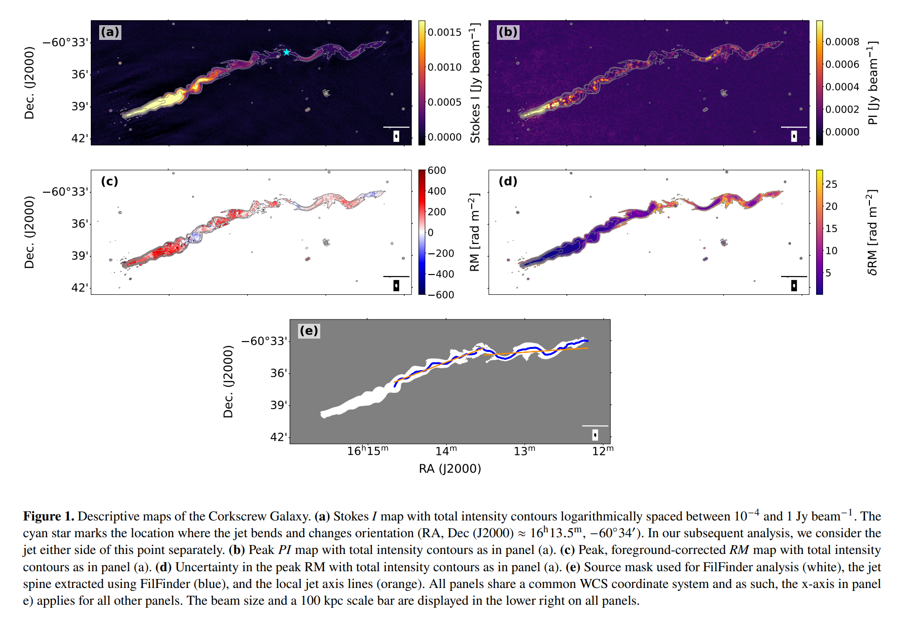

2. [The Stellar Observations Network Group (SONG) -- A Legacy Archive of Stellar Time-Domain Spectroscopy](https://arxiv.org/abs/2607.02775)

    > Stellar, Spectroscopy, Time Domain, Data

    介绍 SONG 高分辨率恒星时域光谱遗产库 [SODA](https://soda.phys.au.dk/)，覆盖 2014–2025 年的亮星和太阳观测，包含超过 580,000 条光谱、3091 颗恒星，以及碘池或钍氩校准得到的径向速度。数据来自 Tenerife、Mt Kent、Lenghu 和 APO 等站点，服务于星震学、恒星活动、双星、系外行星和 TESS/PLATO 协同观测。

    SONG 的优势在于高 cadence、长时间基线和多经度覆盖，后续 Lenghu 与 APO 站点会改善全天候连续观测能力。该档案把分散的 SONG 光谱和径向速度整理成长期可复用资源，特别适合研究恒星振荡、活动噪声和行星径向速度信号。

3. [Revisiting the Radial Velocities of Nearby Open Clusters using Gaia DR3](https://arxiv.org/abs/2607.02923)

    > Open Cluster, Gaia, Radial Velocity

    重新评估 500 pc 内开放星团的 Gaia DR3 径向速度，重点处理热星、冷星和双星导致的速度弥散偏大问题。样本包含 246 个开放星团、53,584 个成员星，其中 20,383 个有 Gaia DR3 径向速度；核心筛选采用 $0.2 \leq (BP-RP)_0 \leq 1.2$ 的颜色范围，并要求每个星团至少 20 个径向速度成员。

    平均径向速度与文献整体一致，但颜色筛选后中位径向速度弥散从 3.76 km/s 降至 2.79 km/s，仍显著高于切向速度弥散，说明 Gaia 误差和未分辨双星仍会抬高弥散。少数红团簇巨星给出的径向速度弥散约 1.6 km/s，更接近切向速度弥散，是 Gaia-only 星团运动学中更稳健的示踪体。

    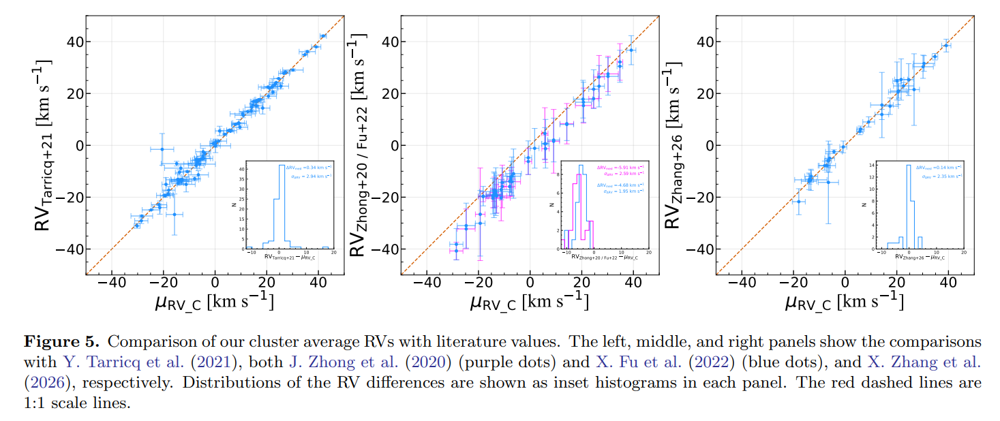

4. [No Strong Evidence for Plasma Lensing in FRB 20240114A](https://arxiv.org/abs/2607.02939)

    > Fast Radio Burst, Plasma Lensing, FAST

    针对 FRB 20240114A 的等离子体透镜解释进行检验，比较 Parkes 和 FAST 的爆发率调制、候选 burst storm、形态相似的 burst pair、能量分布和频宽压缩。分析使用一维高斯等离子体透镜模型拟合爆发率，并通过模拟考虑仪器阈值、频率覆盖和能量幂律分布的选择效应。

    若干局部结构可被透镜模型拟合，但整体证据不强。Parkes 与 FAST 的透镜事件中心和 trough 在重叠时段不一致，FAST 的未透镜化爆发率也可低于模型 trough；相似 burst pair 的偶然出现概率不可忽略，能量增强可由内禀 rate energy 相关解释，频宽也没有系统性压缩。FRB 20240114A 的复杂活动更可能主要来自源内禀变化。

5. [Time Domain Studies of Active Galactic Nuclei with the SKA telescopes](https://arxiv.org/abs/2607.02994)

    > AGN, SKA, Time Domain, Review

    综述 SKA 在 AGN 射电时域研究中的科学目标和技术需求。射电 AGN 变源既可追踪超大质量黑洞附近喷流的内禀演化，也可通过闪烁和极端散射事件探测银河系小尺度电离介质；关键观测能力包括高灵敏度、宽视场、宽频段、偏振、VLBI 和从分钟到多年的多尺度 cadence。

    SKA-Mid 和 SKA-Low 将系统扩展现有 intra-hour variability、ESE、对称消色差变化、紧致对称源和窄线 Seyfert 1 星系变源研究。内禀变化可约束喷流形成、膨胀和环境相互作用，传播效应则可反推出小尺度散射屏和银河系隐含重子结构。

6. [Rapid Response Triggering for Radio Transients with the SKA Observatory](https://arxiv.org/abs/2607.03024)

    > Radio Transient, SKA, Trigger, Multi Messenger

    讨论 SKA 的快速响应触发体系，即望远镜根据外部多信使警报或内部 transient 数据流自动调整观测。内容覆盖 GCN Kafka/VOEvent 警报解析、自动排程、子阵列、低延迟指向、缓冲数据转储、多频段协同和 VLBI 触发。

    科学场景包括 GRB、引力波电磁对应体、FRB、长周期射电暂现源、新星、X 射线双星、脉冲星、磁星、太阳和恒星活动。SKA-Mid 对 FRB 的探测还可利用色散延迟触发 SKA-Low，在 50 MHz 到 15 GHz 的宽频段上补充早期射电行为；整体结论是低延迟响应能力会直接决定 SKA 对快速暂现源和多信使事件的发现效率。

    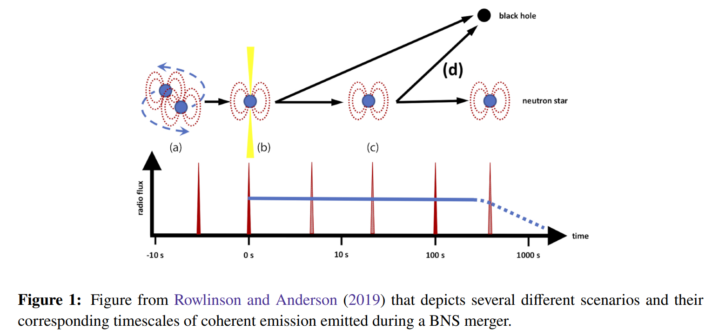

7. [FAST Pulsar Database III. Snapshots of nulling, mode-changing and subpulse modulation of 374 pulsars](https://arxiv.org/abs/2607.03047)

    > Pulsar, FAST, Observation, Database

    基于 FAST L 波段 1.0–1.5 GHz 单脉冲序列，整理 374 颗脉冲星的 nulling、mode changing 和 subpulse modulation 快照。全文转换不可用，PDF 规模很大，因此这里只按摘要信息保守概括。

    识别到 160 颗脉冲星存在 nulling，其中 127 颗为首次报告；52 颗存在 mode changing，其中 51 颗为首次报告；272 颗存在 subpulse modulation，其中 180 颗为新发现，且多数表现为 subpulse drifting。具有 nulling 或调制的脉冲星倾向于更老、更长周期和更低自转能损率，调制周期 $P_3$ 主要与自转周期、磁场和自转能损率相关。

    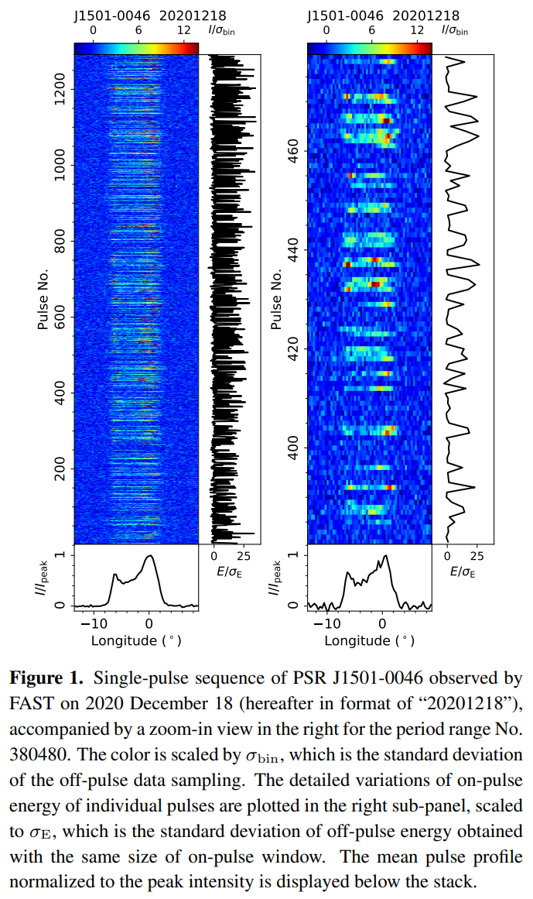

8. [Galactic Centre Pulsars with the SKAO](https://arxiv.org/abs/2607.03078)

    > Pulsar, Galactic Centre, SKA, Review

    综述 SKAO 搜索银河中心脉冲星的科学回报和观测策略。目前 Sgr A* 投影 100 pc 内只发现 7 颗脉冲星，实际族群很可能更大，但强散射、灵敏度和搜索算法限制了发现率；高频 SKA-Mid 搜索对穿透银河中心散射尤其关键。

    如果发现绕 Sgr A* 运行的脉冲星，可用于检验广义相对论和替代理论、测量黑洞参数、刻画银河中心磁化等离子体，并约束暗物质、恒星形成和反馈历史。文章还强调保留 search-mode 数据的重要性，因为后续改进的算法和轨道模型可能从归档数据中找出漏检源。

    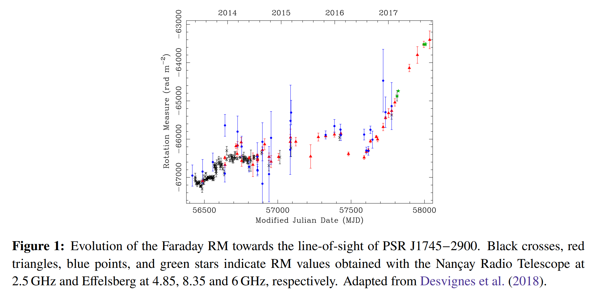

9. [Exploring the Magnetic Field Structure of the Milky Way with Pulsars in the SKA Era](https://arxiv.org/abs/2607.03314)

    > Pulsar, Magnetic Field, Milky Way, SKA

    脉冲星的 $DM$ 和 $RM$ 是银河系磁场三维结构的关键探针，因为脉冲星分布在盘、旋臂和晕中，本征法拉第旋转通常很小，可与只积分整条视线的河外源互补。SKA1 AA4 和 AA* 将显著扩展已知脉冲星与脉冲星 $RM$ 样本，并与 FAST 的天空覆盖互补。

    宽带偏振观测能提高 $DM$ 和 $RM$ 精度，使远端银盘、银晕、旋臂磁场反转和三维磁离子介质结构得到更密集约束。SKA 时代的核心贡献是把目前稀疏的脉冲星法拉第网格扩展为可用于银河磁场建模的大样本数据集。

    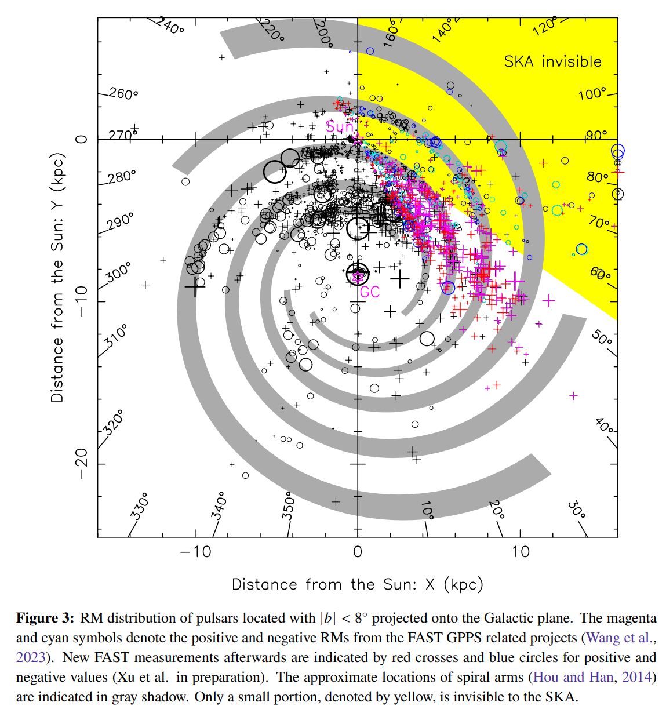

10. [Long-period radio transient PSR J0901-4046 is not an Isolated White Dwarf Pulsar](https://arxiv.org/abs/2607.03848)

    > Long Period Transient, Pulsar, Chandra, Magnetar

    用 Chandra 检验长周期射电暂现源 PSR J0901−4046 是否可能是孤立白矮星脉冲星。该源周期 75.89 s，距离约 467 pc；Chandra ACIS-S 在 2025 年 3 月和 8 月累计观测约 41 ks，在位置误差圈内没有探测到 0.5–8 keV 光子。

    X 射线光度上限为数个 $10^{28}$ erg/s，比 Swift 约深 50 倍。该上限与中子星自转能损率相当，却比白矮星模型预期的自转功率低约四个数量级，也低于白矮星情形下通常预期的 X 射线辐射。结果排除了孤立白矮星解释的主要空间，更支持中子星或磁星式能量来源，长周期射电发射可能由磁能耗散或重联驱动。

11. [Cross-validation of six dispersion measure estimation methods for FRB 20240114A](https://arxiv.org/abs/2607.03877)

     > Fast Radio Burst, Dispersion Measure, FAST, Method

     使用 FAST 在 2024 年 3 月 12 日 4.4 小时观测到的 2874 个 FRB 20240114A 爆发，交叉比较六种 $DM$ 估计方法，并提出基于结构化动态谱密度过滤的峰度最大化和熵最小化方法。分析系统考察信噪比、形态复杂度和 RFI 对 $DM$ 估计的影响，数据在 [Science Data Bank](https://doi.org/10.57760/sciencedb.Fastro.00033)，代码在 [DM_cross](https://github.com/loganlun/DM_cross.git)。

     单成分高信噪比 burst 的不同方法结果较一致，多成分和漂移子结构会产生显著方法间差异；即使筛选低散布 burst，表观 $DM$ 仍在 528–534 pc cm$^{-3}$ 间变化。秒到分钟尺度的真实电子柱密度变化不太可能，频率相关的内禀发射时间结构更可能伪装成色散变化。

     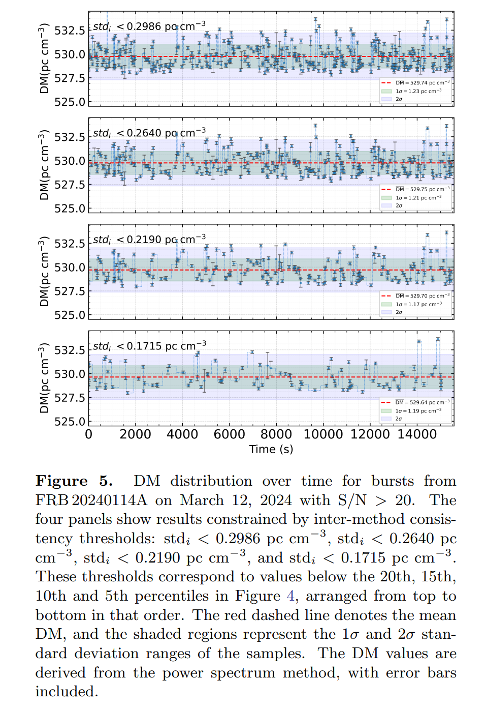

12. [A Model Context Protocol Server for Astrophysical RAG: Unified Access to HI, Dwarf, Globular Cluster, IntZ, and ALPINE Kinematic Corpora with FAISS Semantic Search](https://arxiv.org/abs/2607.03946)

     > Astronomy, RAG, MCP, Tool

     介绍 EPS Research Astro-RAG MCP Server v2.3.0，用 Model Context Protocol 为天体物理 RAG 提供统一检索接口。系统整合 5 个运动学语料库，共 2064 个天体，覆盖 HI 旋转曲线、矮星系和不规则星系、银河系球状星团、中红移星系以及 ALPINE 高红移样本；检索使用 MiniLM-L6-v2 嵌入和 FAISS 语义索引。

     该工具同时提供浏览器查询、REST API 和 LLM-native MCP 访问，支持元数据过滤和确定性召回。项目代码在 [GitHub](https://github.com/eps-research/rag-corpus-series)，在线服务部署在 [Hugging Face Spaces](https://dflynn5656-astro-rag-mcp.hf.space)，目标是让 LLM 可直接访问带出处的天体物理运动学语料，而不是依赖非结构化网页检索。

     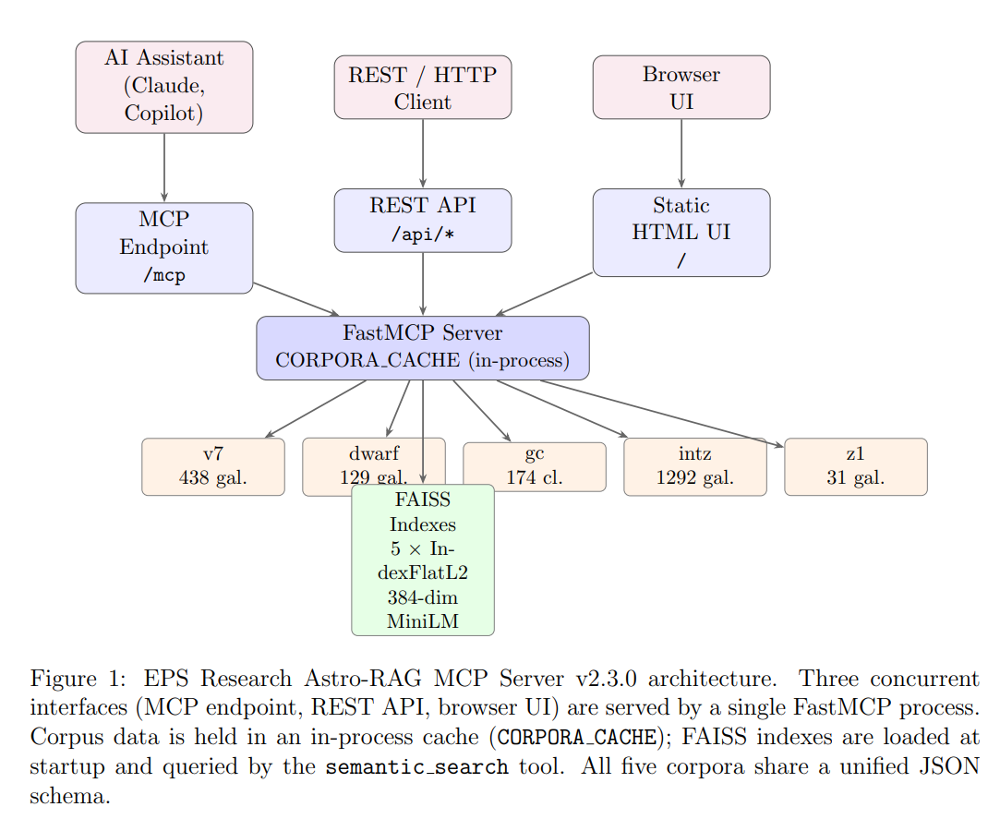

13. [Measuring the Angular Auto-power Spectrum of Fast Radio Burst Dispersion Measures as a Robust Cosmological Probe and Baryon Tracer](https://arxiv.org/abs/2607.04106)

     > Fast Radio Burst, Cosmology, Baryon, Method

     基于 CHIME/FRB Catalog 2 中 3455 个表观非重复 FRB，首次测量 FRB 残余 $DM$ 场的角向自功率谱。处理流程先扣除银河系 ISM 贡献，再用 NaMaster catalog estimator 估计 bandpower，并通过随机化 $DM$ 检验得到超过 $3\sigma$ 的角相关信号。

     该方法把 $DM$ 角相关与 $\Omega_b h^2$、$H_0$ 和大尺度结构重子比例联系起来，不需要单个 FRB 红移，只需要红移分布，因此比传统 $DM_{\rm LSS}$ redshift 方法更不依赖宿主星系 $DM$。当前限制主要来自样本量、天空覆盖和银河前景建模，未来 DSA-2000 和 SKA 样本可显著提高约束能力。

14. [Evidence for a Delayed Progenitor Population for CHIME non-repeating Fast Radio Bursts using a Self-Consistent Forward and Backward Inference Framework](https://arxiv.org/abs/2607.04792)

     > Fast Radio Burst, Population, CHIME, Statistics

     使用 CHIME/FRB Catalog 2 中超过 1000 个非重复 FRB，结合加权 Lynden-Bell $C^-$ 反演和前向 Monte Carlo 族群合成，在 $DM_{\rm ext}$ fluence 空间同时处理选择效应、baseband 到 catalog fluence 校正和概率 $DM$ redshift 映射。

     推断的内禀红移分布在 $z \sim 1$ 附近达到峰值，偏离纯恒星形成历史在 $z \sim 1.7$ 的峰值，支持存在延迟 progenitor 成分。能量分布在 $10^{42}$ erg 以下近似幂律并在高能端变陡；前向模拟显示纯恒星形成历史与观测 $DM_{\rm ext}$ 分布强烈不符。结果倾向于非重复 FRB 中有较老环境贡献，但不排除部分活跃重复源来自年轻恒星形成区域。

     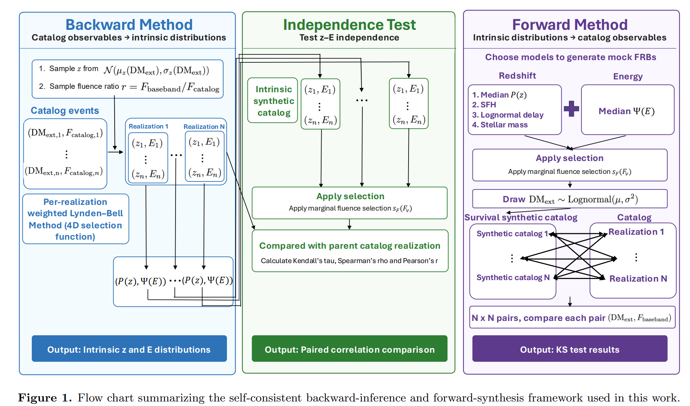

15. [CausticFlow: An Efficient Machine Learning Framework Combining Neural Differential Equations and Normalizing Flows for Binary Microlensing Parameter Inference](https://arxiv.org/abs/2607.04955)

     > Microlensing, Deep Learning, Method

     CausticFlow 用 neural controlled differential equations 和 conditional normalizing flows 推断双星微引力透镜参数。输入是不规则采样光变曲线，模型先把光变曲线路径编码成表示，再输出双透镜参数后验；训练数据为 KMTNet-like 模拟光变曲线和简化白噪声模型。

     在 GPU 上约 1 秒可生成 $10^5$ 个后验样本，典型 MAP 精度约为质量比 $q$ 的 17% 和投影间距 $s$ 的 3%。作为后续局部优化的 proposal 时，少量后验样本即可把精度推进到 $q < 5\%$、$s < 1\%$；10 个真实双星透镜事件中恢复 7 个，失败主要来自弱异常、训练范围外参数或轨道运动等高阶效应。

     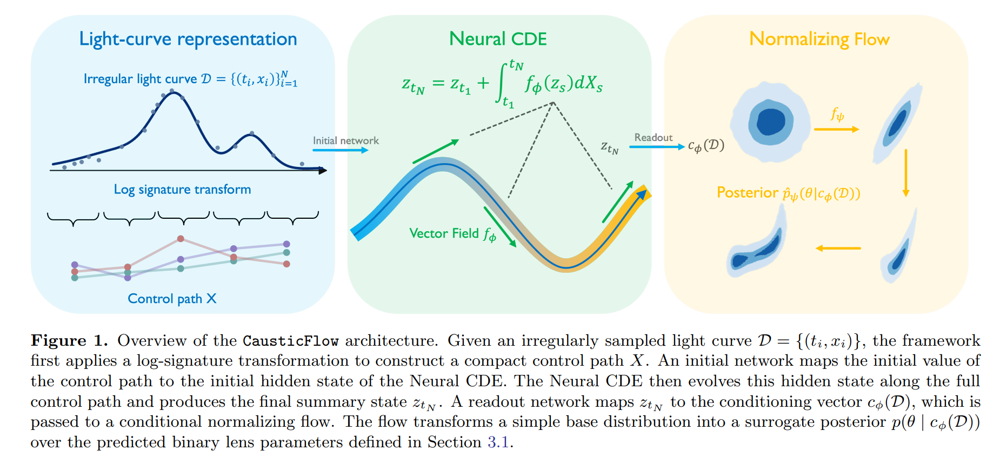

16. [A cornucopia of null results: A statistical analysis of fireballs reported to the American Meteor Society](https://arxiv.org/abs/2607.05071)

     > Meteor, Statistics, Observation

     统计检验 AMS 关于 2026 年第一季度大型 fireball 增多和 February fireballs 的说法。数据来自 American Meteor Society fireball 报告数和辐射点信息，方法是 Poisson 回归和广义线性模型，并显式考虑多重检验；七条公开说法中有五条可由数据直接测试。

     2026 年第一季度报告数与长期报告增长趋势一致，没有证据表明大火流星比例、报告数分布、延迟声事件比例或辐射点分布发生异常变化。February fireballs 也未获支持，11 月较高报告率更可能与天气、夜长和人类活动有关。空结果不能证明真实天体事件完全不存在，但说明现有 AMS 报告不足以支持异常增强声明。

     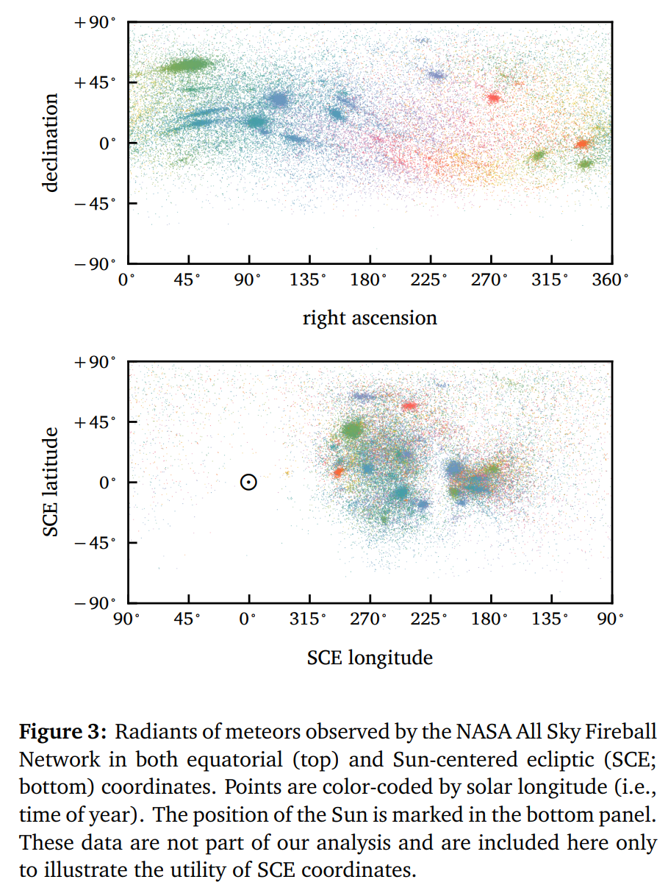

17. [Commensal image plane transient search methods with the SKAO](https://arxiv.org/abs/2607.05118)

     > Radio Transient, SKA, Imaging, Method

     综述 SKAO 共时成像平面暂现源搜索方法，重点是如何在非专门 transient survey 的常规成像数据中寻找稀有和未知射电暂现源。内容覆盖短曝光快照、多 epoch 成像、模型扣除、差分图像、候选过滤、图像到光变曲线流水线、机器学习和 citizen science 辅助筛选。

     触发后可通过重成像、动态谱、图像平面去色散和社区警报提高确认与跟踪效率。该类方法适合秒到年尺度 transient，尤其是长周期射电暂现源等发现空间大的目标；从 SKA-Mid 和 SKA-Low 的 AA* 阶段起，commensal image-plane 搜索就会成为 SKAO 暂现源科学的重要组成。

     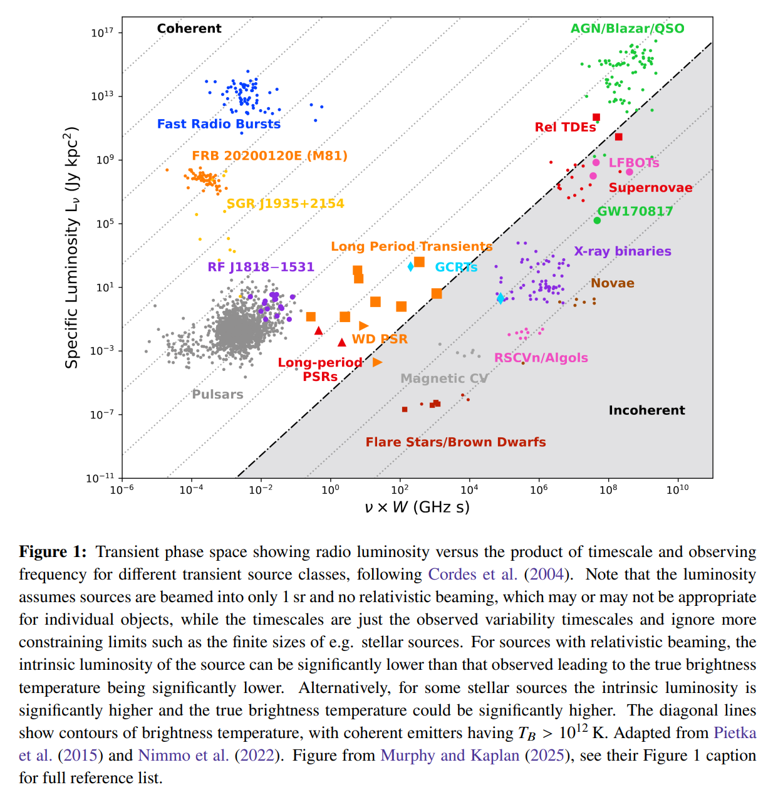

18. [Spectropolarimetric detection of baryonic mass loading in a transient relativistic jet: application to the black hole X-ray binary Swift J1727.8-1613](https://arxiv.org/abs/2607.05182)

     > Black Hole, X Ray Binary, Polarization, Jet

     使用 MeerKAT L 波段全 Stokes 观测研究黑洞 X 射线双星 Swift J1727.8−1613 在 2023 年爆发期间的射电喷流，重点分析最亮 radio flaring 阶段的法拉第复杂结构。处理包括 full-Stokes 校准、RM synthesis 和参数化 $QU$ fitting；MeerKAT 数据来自 SARAO 档案，机器可读数据和分析脚本在 [GitHub](https://github.com/AKHughes1994/SwJ1727_2023_Outburst)。

     源在 flare 前主要表现为法拉第简单结构，flare 期间需要多个 Faraday-thick 成分，约一周后恢复简单状态。复杂偏振结构与射电 flare 同步出现，前景法拉第屏稳定，支持其来自喷流内部而非 ISM 或外部屏。由于纯电子正电子等离子体会抑制内部法拉第旋转，结果支持喷流中存在电子质子主导的重子载荷；结合同步自吸收尺度估计，Faraday-rotating 质量约为 $10^{21}$ g，只占 flare 期间可用吸积质量的约 $10^{-3}$。

     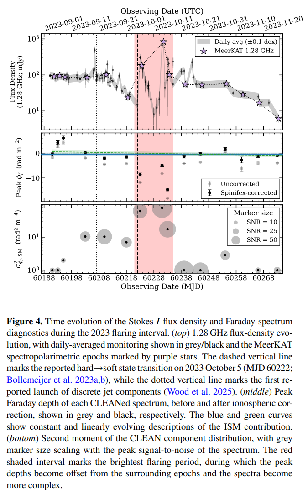

19. [AU or pc? Inferring the distance of magnetized plasma near FRBs from propagation diagnostics](https://arxiv.org/abs/2607.05289)

     > Fast Radio Burst, Propagation, Magnetized Plasma, Method

     提出用 $RM$ 变化、去偏振和时间散射联合约束 FRB 附近磁化等离子体距离的方法，目标是在 AU 级双星环境和 pc 级超新星遗迹环境之间做区分。框架尽量不依赖具体源模型，把源到屏距离 $D_S$ 与多种传播诊断联系起来，并应用于多个有重复 $RM$ 测量的活跃重复 FRB。

     FRB 20190303A、FRB 20190417A 和 FRB 20190520B 更偏向超新星遗迹尺度磁化环境；FRB 20180916B 和 FRB 20201124A 与双星尺度环境也相容；FRB 20121102A 看起来接近 SNR 情形，但其 $RM$ 演化可能由局部 SNR 快速膨胀主导。现有数据仍受非同时观测和本地散射约束不足限制，需要长期、宽带、同步的 $RM$、去偏振和散射监测。

     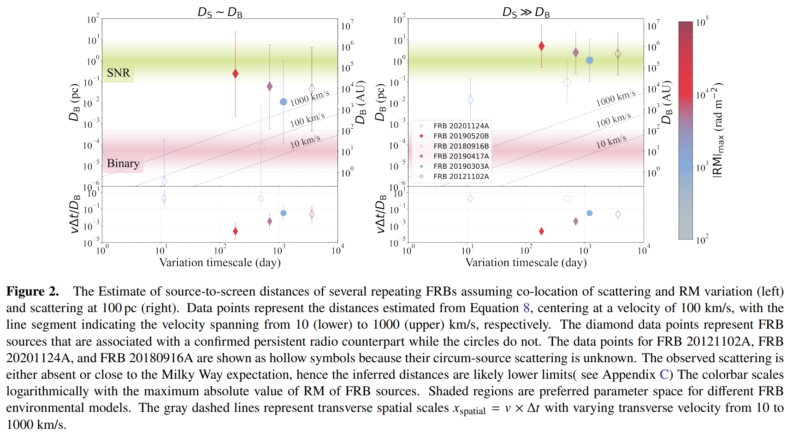

20. [Interpretable Human-Label-Free Deep Learning for Real-Bogus Classification with Uncertainty Quantification](https://arxiv.org/abs/2607.05393)

    > Astronomy, Deep Learning, Transient, Uncertainty

    面向时域巡天中的 Real Bogus 分类，构建不依赖人工标注真实样本的深度学习流程。训练数据由物理动机的注入暂现源和 bogus-dominated 巡天数据组成，模型使用双网络非对称 co-teaching 处理两类不同噪声水平，并用带标注子集、潜空间可视化和不确定性估计评估性能。

    在强污染条件下仍能保持稳健分类，提出的低成本混合不确定性估计接近或优于 MC dropout 和 deep ensemble 等基线，同时计算代价更低。方法还扩展到光变曲线分类并取得接近完美的标注集表现；补充可视化和标注工具示例在 [Zenodo](https://doi.org/10.5281/zenodo.18434676)。
    
    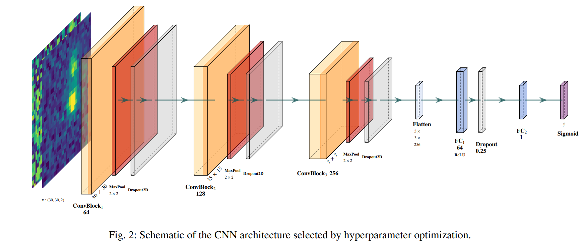

## 2026-07-08

1. [Understanding Pulsar Magnetospheres with the SKAO](https://arxiv.org/abs/2607.05432)

    > Pulsar, Magnetosphere, SKA, Review

    综述过去十年脉冲星磁层物理的进展，并围绕五个问题组织：中子星磁场几何、脉冲星本征射电谱、射电脉冲和自转能损率的时变来源、全局磁层物理，以及脉冲星族群随时间的演化。重点使用射电脉冲强度、偏振、单脉冲行为、频率演化、长时标监测和多波段观测来连接观测现象与等离子体模拟。

    SKA-Low 和 SKA-Mid 的宽频段、高灵敏度、高保真偏振校准和子阵列能力适合大样本长期监测，也适合对双脉冲星、磁星、长周期射电暂现源和特殊新发现源进行高时间分辨率跟踪。核心建议是用 SKA 做大规模脉冲星监测，并配合特定源的高信噪比、全 Stokes、宽频段观测，建立脉冲星磁层行为的整体图像。

    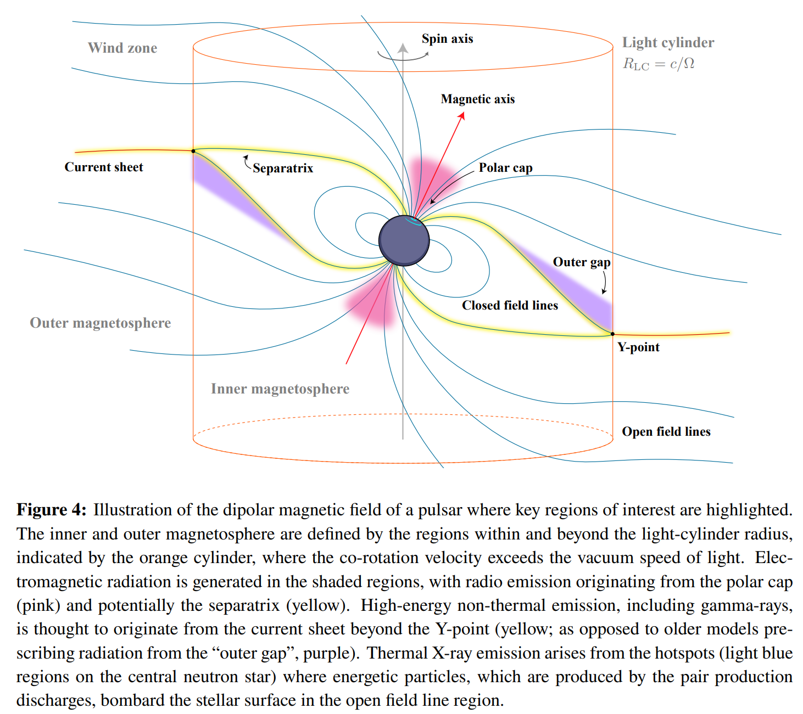

2. [Unveiling the Local Environment of FRB 20220912A: Sub-arcsecond 4–26 GHz Radio Continuum Mapping](https://arxiv.org/abs/2607.05950)

    > Fast Radio Burst, VLA, Star Formation, Observation

    使用 VLA A 和 BnA 构型对活跃重复 FRB 20220912A 的宿主环境做 4–26 GHz 高分辨率连续谱成像，检验其局部射电源是类似 FRB 20121102A 的紧致持续射电源，还是宿主星系内的恒星形成结构。观测在 C、X、Ku、K 波段覆盖宽频率范围，并通过相位校准源位置偏差修正保证亚角秒天体测量可靠性。

    在 FRB 位置探测到连续谱源，距离宿主星系中心约 300 mas，即约 450 pc；高频图像给出未分辨角尺度 $\lesssim 130 \times 120$ mas，9.51 GHz 峰值流量为 $44.8 \pm 3.9~\mu{\rm Jy~beam^{-1}}$，谱指数约 $-0.73$。结合 VLBI 非探测，辐射区物理直径被限制在 75–190 pc，亮温 $T_b < 100$ K，局部恒星形成率面密度 $\Sigma_{\rm SFR} \gtrsim 13~M_\odot~{\rm yr^{-1}~kpc^{-2}}$。这些特征更符合紧致恒星形成结，而非中心引擎驱动的超紧致 PRS，支持该重复 FRB 位于年轻大质量恒星形成环境中。

    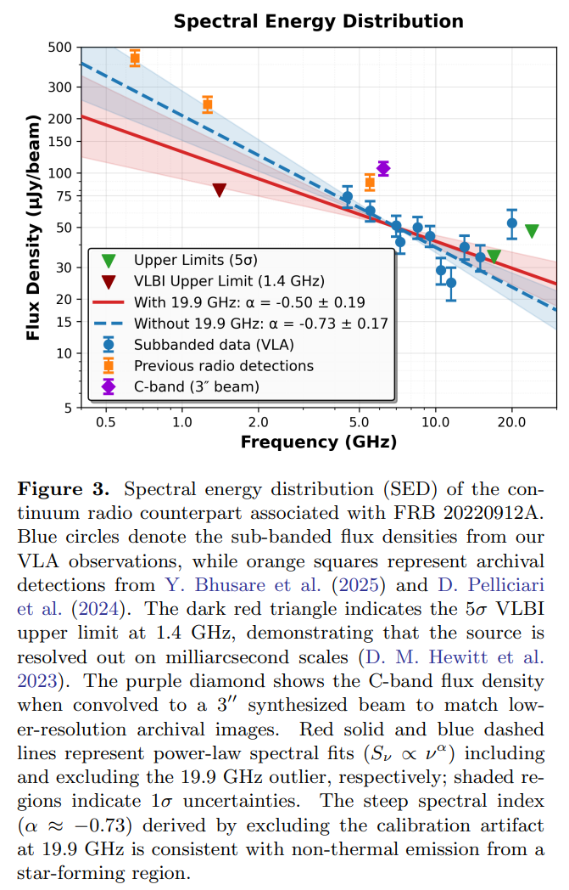

3. [Exploring the Galactic plasma with pulsars in the SKA Era](https://arxiv.org/abs/2607.06096)

    > Pulsar, Galactic Plasma, SKA, Review

    综述如何用脉冲星传播效应研究银河、太阳风和地球电离层等离子体。核心观测量包括 $DM$、$RM$、$DM$ 时变、频率相关色散、闪烁、脉冲展宽、散射、脉冲星距离模型、太阳风和电离层贡献，以及 HI 吸收中的 AU 尺度结构。

    SKA 的宽频段和高灵敏度将把 $DM$ 误差推进到当前望远镜之下，SKA-Mid AA4 对典型毫秒脉冲星可达到约 $10^{-6}~{\rm pc~cm^{-3}}$，SKA-Low 可接近 $10^{-8}~{\rm pc~cm^{-3}}$，但低频结果会更受电离层限制。更精确的银河自由电子分布会改进脉冲星距离、FRB 银河前景扣除和 PTA 噪声建模，也会让脉冲星成为探测小尺度等离子体结构的常规工具。

    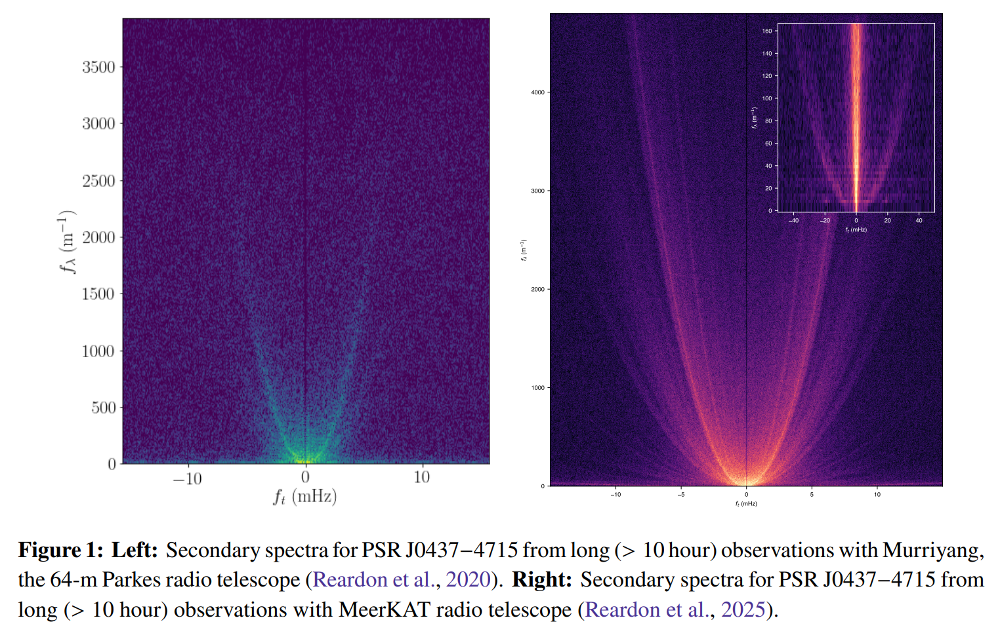

4. [Executable verification through formalized expert reasoning in astronomical spectroscopy](https://arxiv.org/abs/2607.06128)

    > Astronomy, Spectroscopy, LLM, Tool

    提出 [FORMA](https://github.com/SpecSurvey-In-AI-era/FORMA)，把天文光谱专家目检中的证据抽取、物理约束假设、替代解释测试和审计判断形式化成可执行验证流程。输入是观测光谱和 Redrock 等模板拟合给出的候选红移，数值测量由确定性 Python 工具完成，LLM 负责在工具和知识库约束下进行物理推理、交叉审计和报告生成。

    在 DESI EDR 视觉检查目录的 1149 条光谱上零样本评估，medium 或更高可信度阈值得到 331 个 definite predictions，与专家裁定二分类的一致率为 95.5%；QSO、LRG、ELG 和 BGS 的分类一致率分别约为 97.1%、93.8%、94.5% 和 95.0%。可信度分数随红移一致性和分类可靠性提高而改善，低可信度样本被路由到人工审查，说明自动推断可以通过显式证据链和物理一致性审计进入可追溯的科学使用流程。

    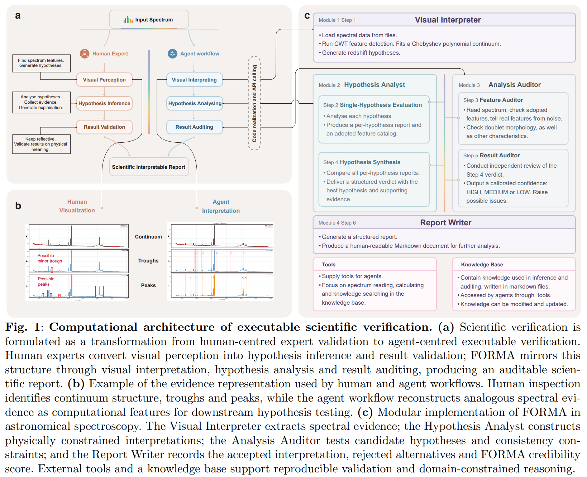

5. [Pulsars in Globular Clusters With the SKAO](https://arxiv.org/abs/2607.06154)

    > Pulsar, Globular Cluster, SKA, Review

    综述 SKAO 在球状星团脉冲星搜索中的发现空间。球状星团单位恒星质量中的射电脉冲星数量约为银河场的 1000 倍，目前已在 45 个星团中发现 345 颗射电脉冲星；这些系统可用于强引力、致密物质状态方程、双星动力学、星团气体和磁场研究。

    搜索策略结合 SKA-MID 和 SKA-LOW 的 tied-array beam、短周期双星的 acceleration 或 jerk search、成像搜索、baseband 数据分析、FFA 和分布式计算。基于球状星团性质和光度函数的估计显示，SKA-MID AA4 对所有可见银河球状星团的 2 小时巡天可探测约 1700 颗脉冲星，约为当前样本的 5 倍；更保守地看，在已有脉冲星的 45 个星团中，SKA-MID AA* 或 AA4 约可新增 150 或 250 颗。归档 search-mode 数据同样关键，完整巡天原始量级约 2 PB，压缩和按星团 $DM$ 子带化后长期保存约 700 TB，可支撑后续算法复搜和新发现源定轨。

6. [Exploring Image–Text Alignment for Radio Galaxy Morphologies](https://arxiv.org/abs/2607.06305)

    > Radio Galaxy, Vision Language Model, Deep Learning

    检验文本 caption 是否能承载射电星系图像中的 FR-I 和 FR-II 形态信息。实验使用 MiraBest 数据集，排除 uncertain 样本后保留 833 张 confident 图像，并用 104 张作为测试集；Gemini 2.5 Flash 生成通用 caption 和领域提示下的 curated caption，再用 SigLIP-2 计算图文嵌入，并比较冻结模型和 LoRA 微调后的线性探针、KNN 与相似度指标。

    图像和文本嵌入都能区分 FR-I/FR-II，领域化 caption 相比通用 caption 只带来小幅分类提升。LoRA 微调增强了类别局部结构，视觉编码器或全模型微调比只微调文本编码器更有效，但图文全局配对相似度并未明显改善，拼接图像和文本特征在测试集上也没有稳定收益。结果说明自然语言形态描述可作为射电星系图像标签的低资源补充，但目前更擅长类别级形态信息，而非实例级图文对齐。

## 2026-07-09

1. [Fast Graph-based Higher-Order Clustering Statistics on the GPU](https://arxiv.org/abs/2607.06604)

    > Cosmology, GPU, Method, Tool

    面向 DESI 这类大规模星系巡天的高阶聚类统计计算，重点加速图算法下的三点和四点相关函数。新版 [GRAMSCI](https://github.com/csabiu/Gramsci) 用 merge-walk 替代二分查找式邻接交集，将 3pCF 内层复杂度降到线性，并把 4pCF、宇称分解 4pCF、连通 4pCF 的断开项扣除和 Python 接口整合到同一框架；GPU 版本基于 OpenACC，并支持超出显存的 out of core 图分块。

    CPU 上 merge-walk 对 3pCF 加速约 1.5–2 倍、对 4pCF 加速约 2.8–3.8 倍；单张消费级 GPU 相对 64 线程 CPU 节点可获得约 2.6–9 倍加速，并能在 24 GB 显存卡上处理 BAO 尺度的 90 亿边图。DESI DR1 LRG 应用中，3pCF 在 50–150 h$^{-1}$ Mpc 尺度与 EZmock 一致，连通 4pCF 在 20–65 h$^{-1}$ Mpc 尺度也与模拟散布相符；宇称奇 4pCF 在 Quijote 宇称对称模拟中通过零信号检验。

    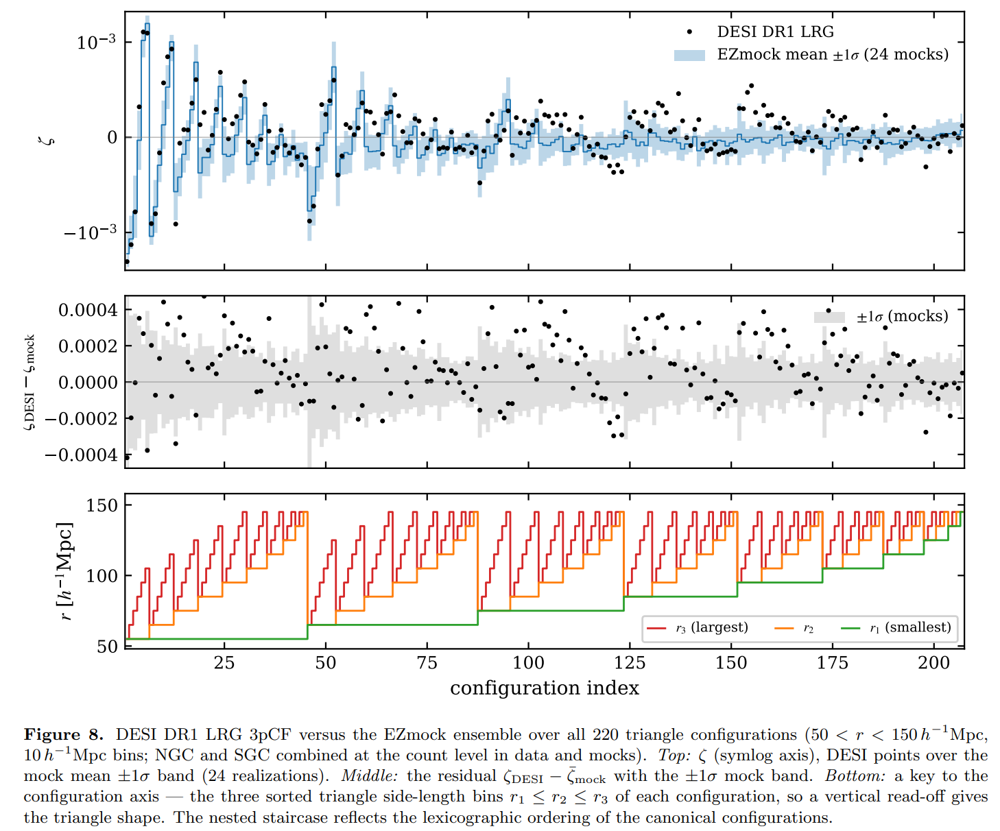

2. [Kinetic Processes to Radio Burst: First Observational-driven Study in Coronal Loops](https://arxiv.org/abs/2607.06991)

    > Solar, Radio Burst, Simulation, Plasma

    慢正漂移爆发 SPDB 是太阳射电动态谱中频率随时间升高但漂移率远低于 III 型爆发的一类相干辐射。研究对象来自 2014 年 5 月 10 日 C8.7 级耀斑期间的 Ondřejov RT5 和 BLEN7M Callisto 观测，频段约 600–2000 MHz，观测漂移率约 54–90 MHz/s，为日冕环内电子束传播和等离子体辐射建模提供约束。

    模型分三层：先用 NLFFF 外推活动区磁场，再用导心近似跟踪注入环顶附近的高能电子，最后把约一个反弹周期后的演化速度分布函数输入 PIC 模拟。静水平衡密度模型给出与观测谱相当的等离子体频率梯度；电子束经历磁镜、俯仰角散射、湍流发展和部分沉降后，主要激发束驱动 Langmuir 波和基频等离子体辐射。模拟辐射强度从环顶向足点减弱，谐波辐射效率低，时间演化能再现约 4 s 持续时间和正频漂特征，说明 SPDB 可由日冕环中的等离子体辐射机制解释。

    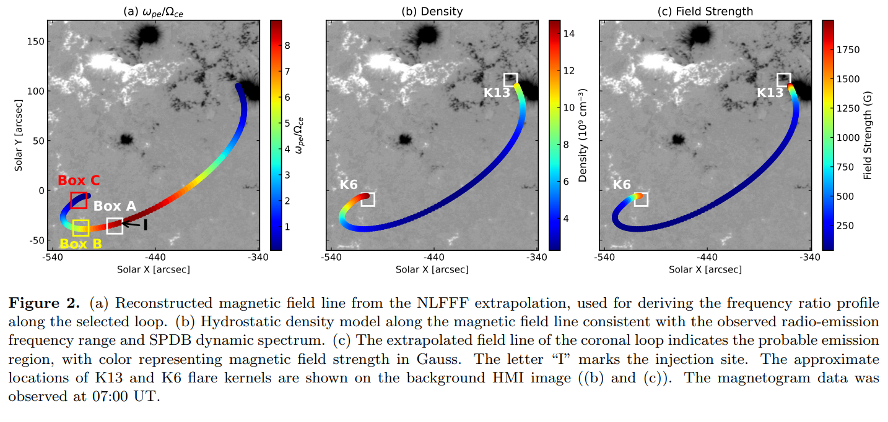

3. [Detection of Quasiperiodic Oscillations in the Blazar PKS 0735+178 with TESS](https://arxiv.org/abs/2607.07200)

    > Blazar, QPO, TESS, Observation

    PKS 0735+178 的 TESS 71 和 72 扇区光变覆盖约 49 天，用 200 s cadence 的全帧图像切片和比较星做差分光度，并结合 Fermi LAT 伽马射线光变作对照。周期搜索使用 WWZ、Lomb Scargle periodogram 和 PDM，并通过 10^5 条模拟光变估计假警报概率和显著性。

    71 扇区出现一个约 4.6 天的双成分温和光学耀发；72 扇区末段出现约 11.2 小时的瞬态 QPO，Lomb Scargle 给出约 4.11 sigma 局部显著性和 3.06 sigma 全局显著性，PDM 和非正弦模拟也支持同一周期。Fermi LAT 在光学耀发和 QPO 附近只有弱增强且误差较大，无法做可靠周期检验，提示光学 QPO 可能来自喷流中的激波、湍流涡旋、螺旋喷流结构，或靠近黑洞的吸积盘热斑和进动，但多波段同源性仍不确定。

    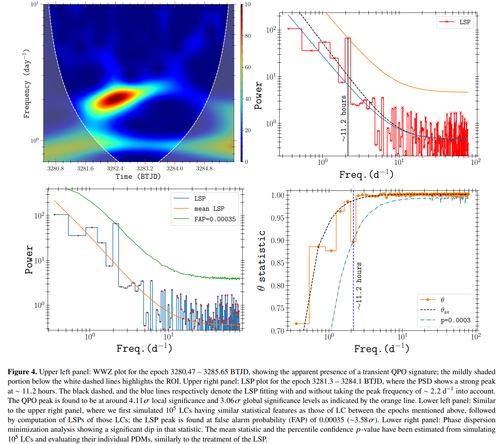

4. [Beyond traditional emission-line diagnostics: using autoencoders to uncover active galactic nuclei in DESI spectra](https://arxiv.org/abs/2607.07329)

    > Galaxy, AGN, Deep Learning, DESI

    传统 BPT、WHAN 等发射线诊断依赖少数谱线和信噪比阈值，容易漏掉弱线、低信噪比或被宿主星形成稀释的 AGN。这里用 DESI DR1 的 50,241 个星系光谱训练 SPENDER 自编码器，将观测光谱压缩到 10 维潜空间，再用 k-d tree 最近邻把 FastSpecFit 标签传播为 AGN、star-forming、Other/passive 三类，以及 NL AGN、BL、composite、star-forming、passive、retired、Other 七类。数据和复现实验代码分别放在 Zenodo：[10.5281/zenodo.20490011](https://doi.org/10.5281/zenodo.20490011) 和 [10.5281/zenodo.21069095](https://doi.org/10.5281/zenodo.21069095)。

    三分类中 AGN 准确率为 0.952、AUC 为 0.976，七分类中 broad line AGN 准确率为 0.965、AUC 为 0.973。潜空间不仅分离 AGN 与非 AGN，也与恒星质量、SFR 等物理量相关。与 DESI AGN/Galaxy VAC、堆叠光谱、BPT 和 WHAN 交叉验证后，许多被传统单一诊断漏掉但被模型判为 AGN 的源显示出真实 AGN 特征；预测为 AGN 但传统标签为 Other/passive 的样本中，93.5% 至少被一个独立诊断支持为 AGN。性能指标因此更像保守下限，框架适合扩展到更大 DESI 光谱样本。

    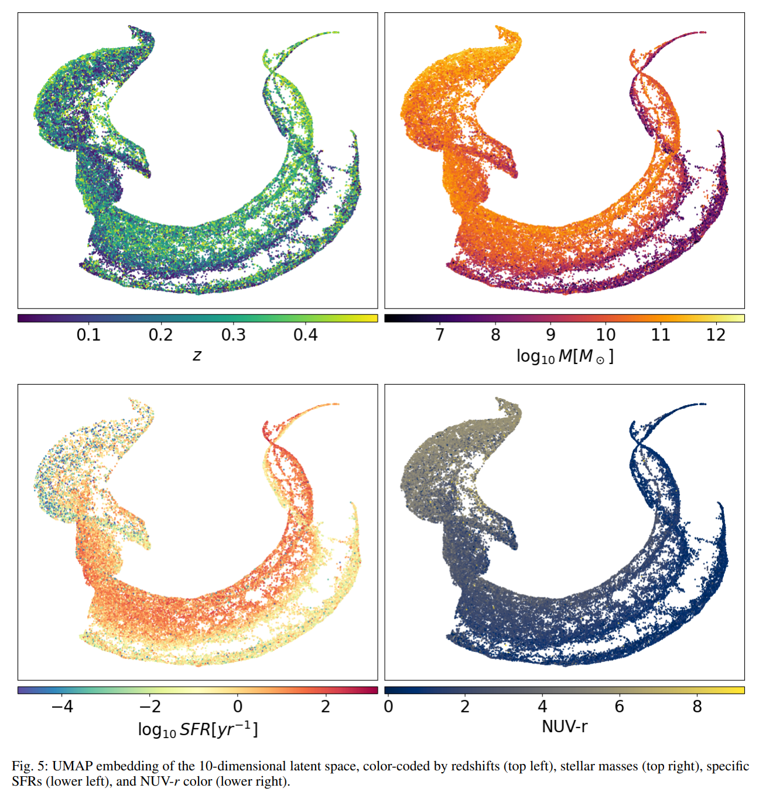

5. [Double-periodic pulsations simultaneously detected in mid-infrared and hard X-ray emissions during an X1.5 flare](https://arxiv.org/abs/2607.07442)

    > Solar, Flare, QPP, Observation

    2024 年 12 月 30 日 X1.5 级白光耀斑中，AIMS 8–10 micron 中红外、Fermi 26–50 keV、ASO S HXI 20–50 keV、NoRP 2 GHz、WST、SDO AIA 和 HMI 提供了从中红外到硬 X 射线的联合观测。FFT 和 Morlet 小波分析在中红外与硬 X 射线中同时检测到约 8.5 s 和 4.6 s 的双准周期，NoRP 微波中主要出现较长的 8.5 s 周期；硬 X 射线中还可见约 17.2 s 的较长成分。

    HXI CLEAN 重建显示中红外、白光和硬 X 射线源在空间上相互对应，DEM 分析给出耀斑环结构的热等离子体环境。中红外调制深度低于 0.1%，硬 X 射线和微波约为 1%–5%，但脉冲时序高度相关，说明中红外 QPP 与非热电子沉降密切相关。双周期更可能来自振荡式磁重联的准周期粒子加速，并由快 sausage 波的准谐波调制。

    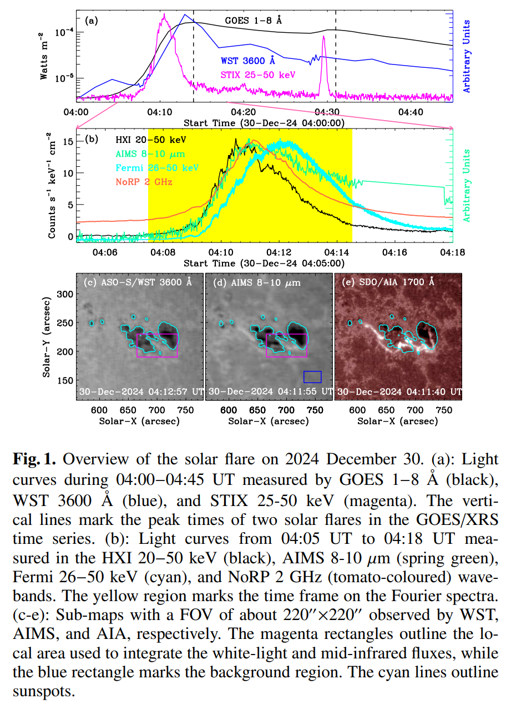

6. [Radio emission from close-in exoplanets: Can we extend the radio-magnetic scaling law to the sub-Alfvénic stellar wind regime?](https://arxiv.org/abs/2607.07704)

    > Exoplanet, Radio, Magnetosphere, Simulation

    太阳系行星的射电磁标度律 RMSL 建立在超 Alfvenic 太阳风环境中，直接外推到近恒星热木星可能高估射电辐射。这里用 3D MHD 模拟把一个 1 G 偶极磁场的类木星行星放在不同轨道距离，比较类太阳风 B1 和更强磁化风 B10 两种环境，并加入大气光电离对电离层电子密度和 ECMI 逃逸条件的影响。射电功率由极光 Poynting 通量、风到磁层的转移函数和经太阳系超 Alfvenic 情形标定的常数射电效率给出。

    超 Alfvenic 情形下模拟射电功率与 RMSL 匹配；进入 sub Alfvenic 风后，B1 中 RMSL 约高估一阶数量级，B10 中偏差可增至约两阶数量级，原因是风能到极光 Poynting 通量的转移效率随风磁化增强而下降。光电离会在近恒星轨道提高电离层电子密度，使满足 ECMI 产生和逃逸的区域偏向夜侧和较大轨道距离，并可再降低约一阶数量级的可逃逸射电功率。更强磁化风能通过开放磁通和重联外流清空部分等离子体、改善 ECMI 条件，但整体能量转移效率不足，近恒星行星的射电可探测性仍可能低于传统 RMSL 预期。
    
    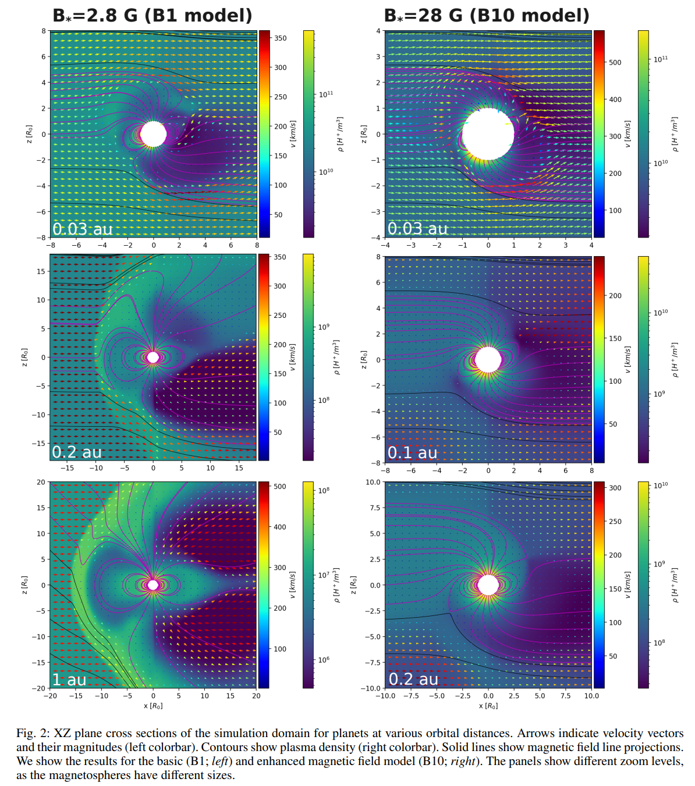

## 2026-07-10

1. [Blind Line Search System: BLiSS](https://arxiv.org/abs/2607.07783)

    > X Ray Spectroscopy, Emission Line Detection, X Ray Binary, Tool

    BLiSS 是面向一维高分辨率 X 射线光谱的开源 Python 发射线盲搜工具，无需预设谱线位置或先建立物理连续谱模型。程序以多尺度 sigma-clipped 滑动平均的下包络构造经验基线，从正残差中寻找候选区域并进行局部多高斯拟合；观测谱和基于基线生成的合成零假设光谱经过同一流程，再用高斯混合模型按候选线的信噪比、等效宽度和形态等特征给出经验可靠度。可选步骤包括全谱多高斯联合拟合和原子跃迁匹配，代码、文档与教程见 [BLiSS GitHub 仓库](https://github.com/xragua/BLiSS)。

    Vela X-1 的两条 Chandra/HETGS 硬度分段光谱和一条 XRISM/Resolve 光谱用于验证。BLiSS 恢复了主要的 Ne、Mg、Si 复合线，并在没有输入实验室能量或双线间距的情况下，将 Fe K$\alpha$ 结构分解为 $6.4039\pm0.0002$ 和 $6.3904\pm0.0003$ keV 两个高可靠候选，与专门物理拟合结果一致，线面积则约低 30%；所选能段的单次搜索耗时为 8.7–22.3 s。它适合作为物理建模前的快速候选生成器，但结果仍依赖分箱、经验基线和选择阈值，混合线区的高斯分量及自动原子匹配不能直接视为最终物理认定。

    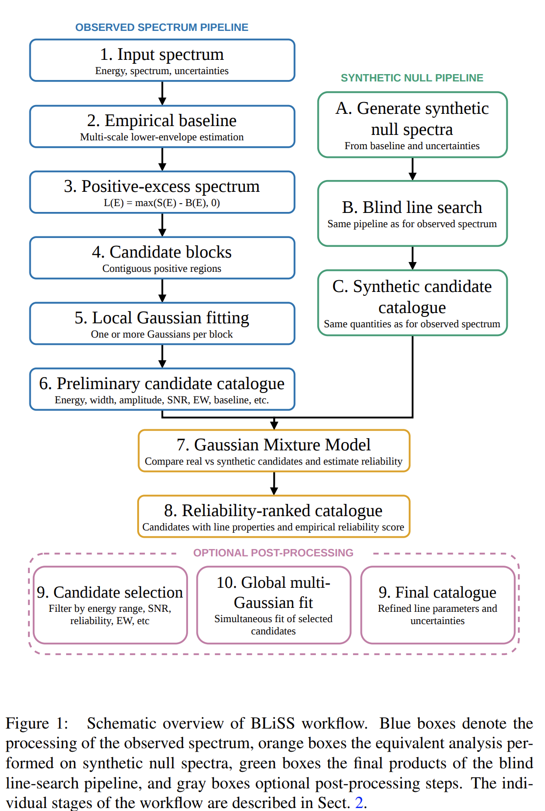

2. [Catching Disguised Transients with ASTRANet: Anomaly-Aware Spectroscopic Classification and Conformal Calibration](https://arxiv.org/abs/2607.08044)

    > Transient, Spectroscopy, Deep Learning, Anomaly Detection, Conformal Prediction

    ASTRANet 针对闭集光谱分类器会把未知暂现源高置信度归入已知类别的问题，将分层分类、异常检测和保形不确定性量化整合为统一流程。输入光谱保留在观测者系的 $3850$–$9000~\text{\AA}$ 范围并插值为 4096 点，分类器通过多尺度卷积、膨胀 TCN、注意力池化和可选 FiLM 元数据生成 192 维嵌入，推理时不要求宿主红移或光谱相位。六模型集成之上的 ASTRANet-Sentinel 用 LightGBM 非线性融合不确定性、距离、密度和混合四类共 16 个异常分数；ASTRANet-CP 则输出 Mondrian 保形 $p$ 值、候选类别集合及偶然和认知不确定性，并进一步按预测类别和异常分数分位构造 AD-MCP。

    七类常见暂现源的 3396 条测试光谱上，分类准确率为 87%，宏平均召回率为 83%。在训练中刻意排除的 11 类、289 条稀有或分类体系外光谱上，无泄漏五折评估显示：异常暴露微调后的三种子平均模型在 1% 假警率下检出 $238/289$（82.4%），而最强单一分数族仅检出 $86/289$；种子并集在约 3% 假警率下达到 $244/289$（84.4%）。在 $\alpha=0.05$ 时，AD-MCP 将五个异常分位的覆盖率稳定在 $0.952\pm0.001$，其中最高异常分位由普通 Mondrian 的 0.824 提升至 0.953，说明分类器内部不确定性和嵌入空间异常度分别捕捉类内边界错误与分布外伪装，联合使用才能可靠筛选稀有暂现源。

    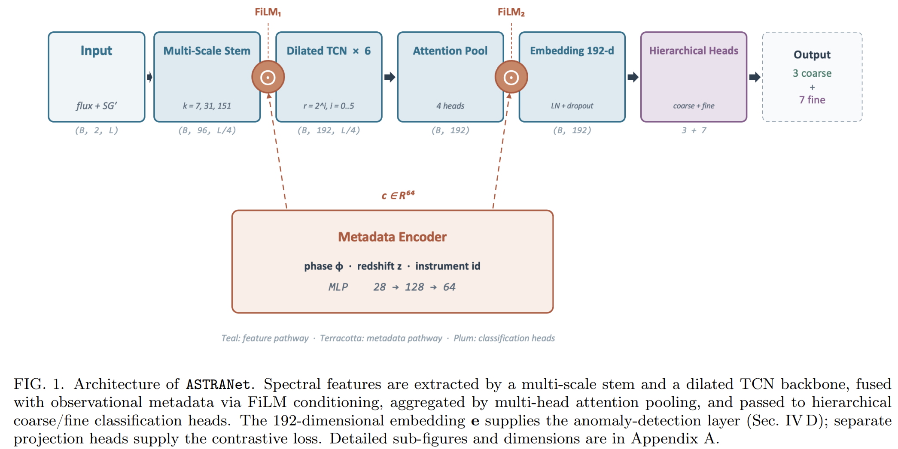

3. [The Southern-sky MWA Rapid Two-metre (SMART) pulsar survey--IV. Survey update and an atlas of 205 non-recycled southern pulsars](https://arxiv.org/abs/2607.08106)

    > Pulsar, MWA, Survey, Observation, Data Release

    SMART 巡天利用 Murchison Widefield Array 的大视场和电压记录能力，在 140–170 MHz 搜索脉冲星与快速射电暂现源。2018–2023 年间以 71 个相互重叠的指向覆盖赤纬 $+30^\circ$ 以南全天，单次驻留 4800 s，原生时间和频率分辨率为 $100~\mu{\rm s}$ 和 10 kHz，累计数据约 3.9 PB。处理链完成 MWAX 电压数据校准、相控阵波束形成、非相干去色散、折叠、RFI 清理、精细 $DM$ 搜索、脉宽测量、通量定标和法拉第深度分析，并发布 205 颗非再循环脉冲星的低频图谱、时间序列、多频段折叠档案以及 $DM$、$RM$ 和 154 MHz 流量测量。

    本篇的 205 个对象中包含 2 颗早期 SMART 发现；连同此前报告的 40 颗毫秒脉冲星，目前目录共有 245 个对象，另有 23 颗深度搜索新发现尚待后续发表，因此 SMART 数据中累计检测到 268 颗脉冲星、其中 25 颗由该巡天发现。117 颗非再循环脉冲星获得了 $RM$ 测量，加入此前的毫秒脉冲星后总数为 142，其中 5 个为首次测量、29 个比现有目录值更精确。与 MeerKAT 重合样本的两点谱指数均值为 $-1.56\pm0.13$，但 154 MHz 流量尚未计入闪烁变化且依赖模拟波束，只能视为初步估计。这一持续更新的低频南天目录可用于 SKA-Low 调试和巡天预测，也能约束本地星际介质的电子密度、湍流与银河磁场模型。

    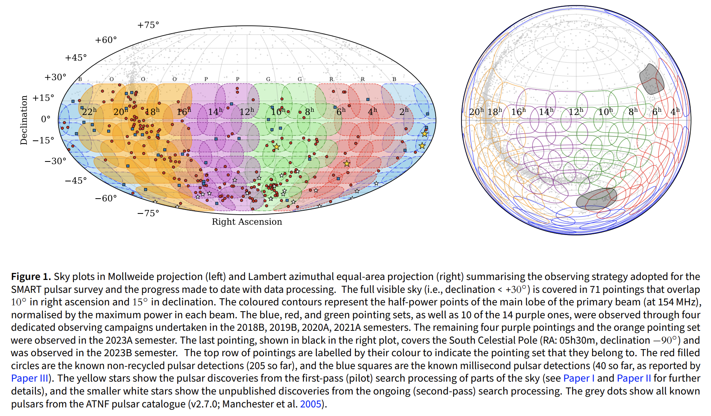

4. [DegenDetector: Symbolic Recovery of Parameter Degeneracies in Bayesian Posteriors](https://arxiv.org/abs/2607.08755)

    > Bayesian Inference, Symbolic Regression, Cosmology, Tool

    DegenDetector 自动识别贝叶斯后验中参与参数简并的变量，并将简并关系恢复为可解释的闭式方程。流程先用 $k$ 近邻互信息估计器计算参数两两依赖，并按互信息总和排列候选参数组；随后把简并曲面写成可分离水平集 $\sum_i g_i(\theta_i)=c$，通过交替的一维 PySR 符号回归求解各分量，再用 SymPy 化简并恢复原始尺度。LogDegen 可在对数坐标中搜索乘法型简并，拟合质量则以样本到隐式曲面的正交距离定义。代码和复现实验已发布在 [DegenDetector GitHub 仓库](https://github.com/chaipattira/degen_detector)。

    四组含强非高斯简并的合成后验中，候选参数和函数形式均被正确恢复，所有拟合的正交 $R_\perp^2>0.98$。在 Planck 2018 TTTEEE+lowl+lowE+lensing 的 25,225 个七参数后验样本上，系统在没有输入宇宙学先验关系的情况下选出 $(H_0,\Omega_m)$，得到 $123.97\log H_0+42.07\log\Omega_m={\rm const}$，正交 $R_\perp^2\approx0.98$；系数比 2.947 与预期的 $\Omega_m h^3\approx{\rm const}$ 接近。主要限制是可分离函数假设，真正不可分离的高阶简并仍需多变量符号回归或学习式重参数化。
    
    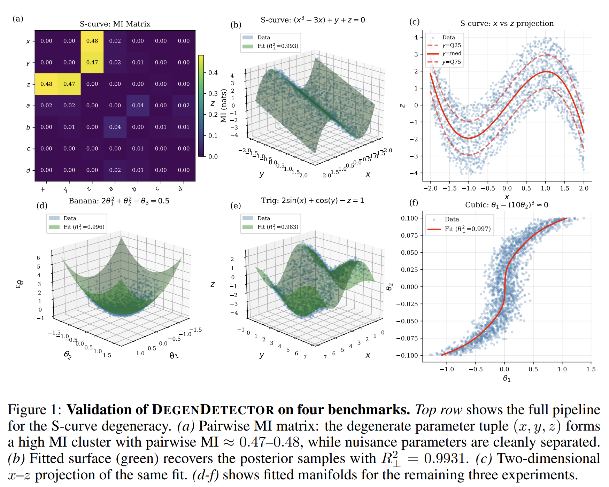

## 2026-07-13

