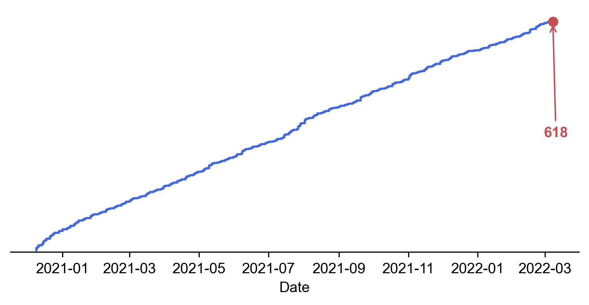
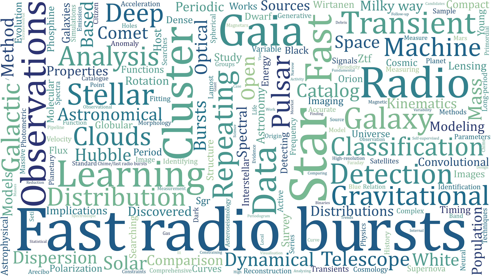

# Astro-PH of the Day (APOD)

_✨ Based on [arXiv Astro-PH](https://arxiv.org/list/astro-ph/new), since December 9, 2020. ✨_  

  
  

## Description

- Read preprints every day.
- Article selection has strong personal preference biases.
- Different topics will be involved.

## Article Reading Count

- **Paper Cumulative Count**
  
  

## Word Frequency Statistics

- **Title Segmentation**
  
  

- **Content Segmentation**
  
  