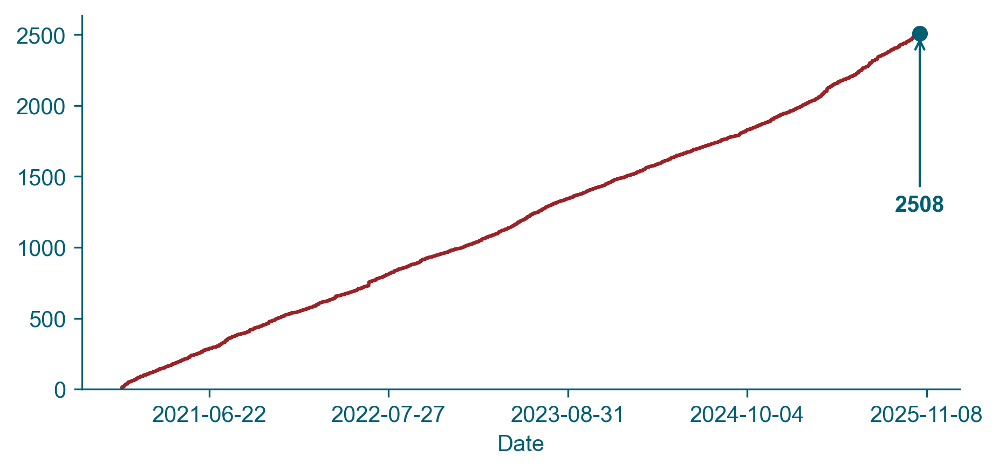
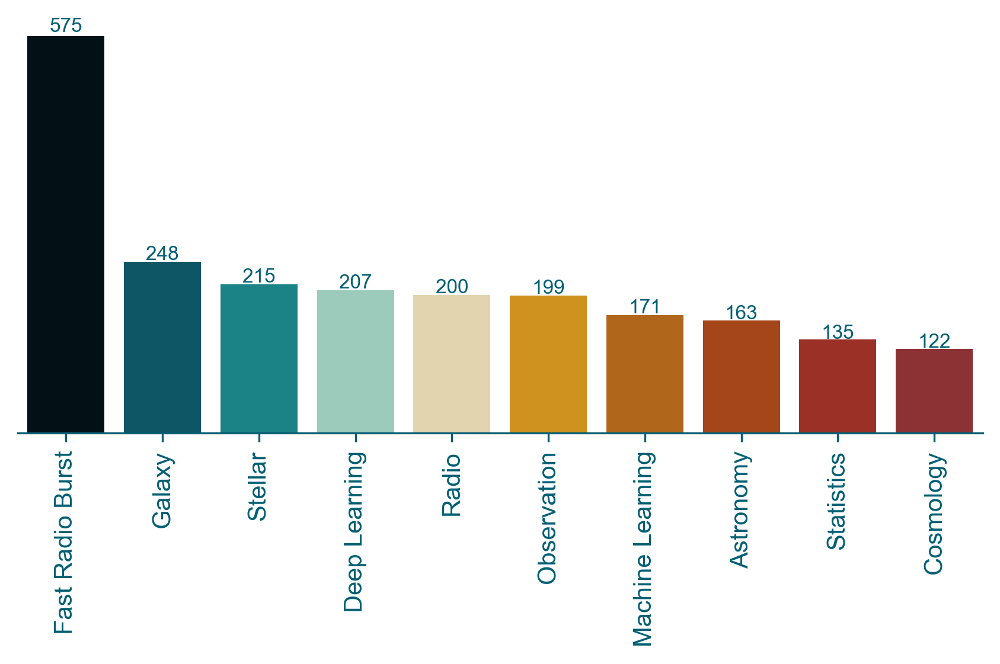
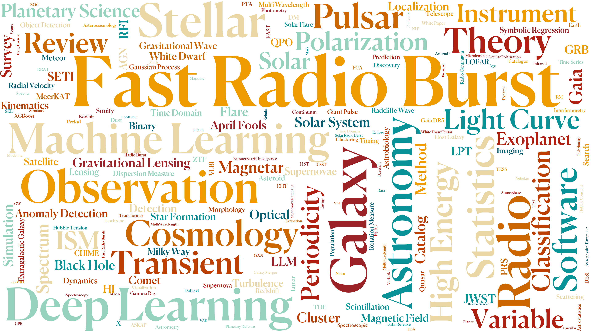

<h1 align='center' class='h1-center'> Astro-PH of the Day (APOD) </h1>

_✨ Based on [arXiv Astro-PH](https://arxiv.org/list/astro-ph/new), since December 9, 2020. ✨_

 

  
  

## 
Description

Read preprints every day

Article selection has strong personal preference biases

Different topics will be involved

## 
Article Reading Count

Paper Cumulative Count

 

## 
Word Frequency Statistics

KeyWord Frequency

 

KeyWord Cloud

 

 

Content Segmentation

